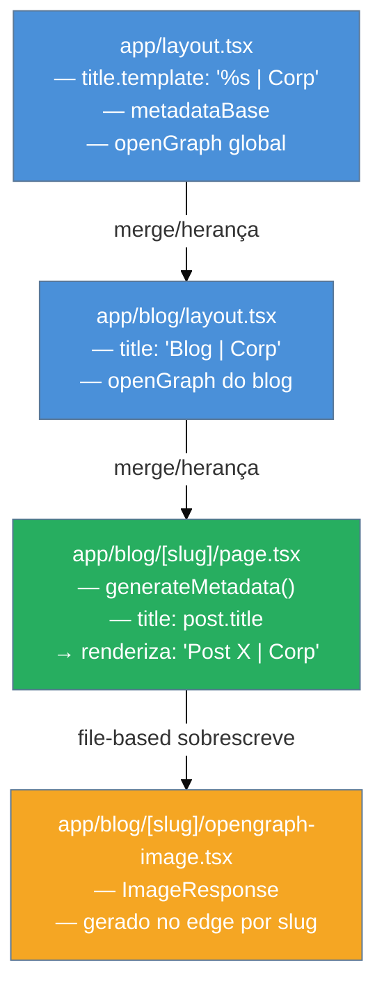

# Metadata, SEO e assets sociais

> [!abstract] TL;DR
> O App Router expõe dois caminhos para metadata: **declarativo** (`export const metadata`) para valores estáticos conhecidos em build time, e **dinâmico** (`export async function generateMetadata`) para valores que dependem de parâmetros de rota ou chamadas externas. A metadata se propaga pela árvore de layouts via merge, com `title.template` permitindo padrões como `"Artigo | Blog"` sem repetir o sufixo em cada página. Para OG images, o Next oferece `opengraph-image.(jpg|tsx)` file-based — onde `.tsx` usa `ImageResponse` para gerar imagens com JSX no edge. `sitemap.ts` e `robots.ts` completam o stack de SEO. Em Next 15, `params` e `searchParams` são Promises: `await` obrigatório.

---

Você compartilha um artigo no WhatsApp e o preview aparece em branco — sem título, sem imagem, sem descrição. Ou pior: aparece o título genérico do layout raiz em todas as páginas do seu e-commerce, sem nenhuma diferenciação por produto. Ambos os problemas têm a mesma causa: metadata mal configurada. E a boa notícia é que o App Router foi projetado exatamente para tornar isso tratável em escala — seja um blog com 3 páginas ou uma loja com 50 mil SKUs.

O que o Next faz, afinal, é garantir que as tags `<meta>`, `<title>`, `<link rel="canonical">` e afins apareçam no HTML enviado pelo servidor — visíveis para crawlers (Googlebot, bots de redes sociais) sem precisar de JavaScript. Isso é o que diferencia o SEO em SSR de uma SPA tradicional, onde o crawler chegava em uma página quase vazia esperando o bundle carregar.

## A Metadata API em duas formas

O App Router oferece dois mecanismos para declarar metadata em qualquer `layout.tsx` ou `page.tsx`:

**1. Estática** — `export const metadata`

Use quando os valores são conhecidos em build time e não dependem de parâmetros de URL.

```tsx
// app/about/page.tsx
import type { Metadata } from "next";

export const metadata: Metadata = {
  title: "Sobre nós",
  description: "Conheça a história e os valores da empresa.",
  openGraph: {
    title: "Sobre nós",
    description: "Conheça a história e os valores da empresa.",
    url: "https://exemplo.com/about",
    siteName: "Exemplo Corp",
    images: [{ url: "https://exemplo.com/og/about.png", width: 1200, height: 630 }],
    locale: "pt_BR",
    type: "website",
  },
};

export default function AboutPage() {
  return <main>...</main>;
}
```

**2. Dinâmica** — `export async function generateMetadata`

Use quando o título ou a descrição precisam de dados externos — típico em páginas de produto ou de post de blog, onde o slug determina qual conteúdo buscar.

```tsx
// app/blog/[slug]/page.tsx
import type { Metadata, ResolvingMetadata } from "next";

type Props = {
  params: Promise<{ slug: string }>;
  searchParams: Promise<Record<string, string | string[]>>;
};

export async function generateMetadata(
  { params }: Props,
  parent: ResolvingMetadata
): Promise<Metadata> {
  // Em Next 15, params é uma Promise — await obrigatório
  const { slug } = await params;
  const post = await fetchPost(slug);

  // Acessar metadata herdada do parent (layout) para compor, não substituir
  const parentImages = (await parent).openGraph?.images ?? [];

  return {
    title: post.title,
    description: post.excerpt,
    openGraph: {
      title: post.title,
      description: post.excerpt,
      images: [post.ogImage, ...parentImages],
    },
  };
}
```

> [!question]- Por que `params` é uma Promise no Next 15?
> No Next 14 e anteriores, `params` era um objeto síncrono. No Next 15, o acesso a `params` e `searchParams` foi tornado assíncrono para alinhar com o modelo de renderização dinâmica — a leitura de parâmetros de rota agora é tratada como acesso a dados que podem chegar do servidor. Isso exige `await params` em `generateMetadata`, `page.tsx` e qualquer Server Component que os leia.

> [!warning] Next 14 vs Next 15: params síncrono vs assíncrono
> **O que mudou:** em Next 14, `params: { slug: string }` era acessível diretamente. **No Next 15:** `params: Promise<{ slug: string }>` — é necessário `await params` antes de usar. Código que não faz o await em Next 15 pode compilar mas falha em runtime com comportamento indefinido (o objeto Promise não tem a propriedade `slug`).

---

## Herança e merge entre layouts e pages

A metadata não vive só em pages — ela pode (e deve) ser declarada nos layouts também. O Next faz um **merge profundo** das metadata declarations da raiz até a folha da árvore de rotas.

A regra de merge é simples: **os valores da folha sobrescrevem os do pai**. Mas há uma nuance importante: o merge não é profundo para objetos aninhados como `openGraph` — se a page define `openGraph.title`, ela precisa redefinir o objeto `openGraph` inteiro; o Next não mescla propriedades individuais de `openGraph`.

```tsx
// app/layout.tsx (raiz — valores padrão globais)
export const metadata: Metadata = {
  metadataBase: new URL("https://exemplo.com"),
  title: {
    default: "Exemplo Corp",
    template: "%s | Exemplo Corp",
  },
  description: "A empresa líder em soluções.",
  openGraph: {
    siteName: "Exemplo Corp",
    locale: "pt_BR",
    type: "website",
  },
};
```

```tsx
// app/blog/[slug]/page.tsx — sobrescreve title, description, openGraph completo
export async function generateMetadata({ params }: Props): Promise<Metadata> {
  const { slug } = await params;
  const post = await fetchPost(slug);
  return {
    title: post.title,           // renderiza como "Título do Post | Exemplo Corp"
    description: post.excerpt,
    openGraph: {
      title: post.title,
      description: post.excerpt,
      images: [{ url: post.ogImage }],
      // sem siteName/locale/type → esses NÃO são herdados do layout aqui
    },
  };
}
```

> [!warning] openGraph não herda campos do layout automaticamente
> **Sintoma:** `siteName`, `locale` e `type` definidos no layout raiz desaparecem nas pages que declaram seu próprio `openGraph`. **Por quê:** o Next substitui o objeto `openGraph` inteiro, não mescla campo a campo. **Como evitar:** use `parent: ResolvingMetadata` em `generateMetadata` para recuperar os campos do parent e compor manualmente: `const { openGraph } = await parent`.

---

## Títulos templated: template, default e absolute

O tipo `title` do objeto `Metadata` aceita string simples ou um objeto com três campos:

| Campo | Comportamento |
|-------|---------------|
| `title.default` | Usado quando uma rota filha **não** exporta `title`. |
| `title.template` | Padrão aplicado ao `title` das páginas filhas. `%s` é substituído pelo título da página. |
| `title.absolute` | Ignora completamente qualquer template do parent — útil para páginas que precisam de título exato. |

```tsx
// app/layout.tsx
export const metadata: Metadata = {
  title: {
    default: "Meu Site",          // aparece na home, que não define title
    template: "%s | Meu Site",    // blogs renderizam "Artigo X | Meu Site"
  },
};

// app/blog/[slug]/page.tsx
export const metadata: Metadata = {
  title: "Introdução ao TypeScript",  // renderiza: "Introdução ao TypeScript | Meu Site"
};

// app/landing/page.tsx — precisa de título exato sem sufixo
export const metadata: Metadata = {
  title: {
    absolute: "Black Friday — 70% off",  // ignora o template do layout
  },
};
```

---

## OG e Twitter cards via metadata object

O objeto `openGraph` e `twitter` cobrem os cards de redes sociais:

```tsx
export const metadata: Metadata = {
  openGraph: {
    title: "Meu Artigo",
    description: "Descrição para o card do Facebook/LinkedIn/WhatsApp.",
    url: "https://exemplo.com/artigo",
    siteName: "Exemplo Corp",
    images: [
      {
        url: "https://exemplo.com/og/artigo.png",
        width: 1200,
        height: 630,
        alt: "Imagem do artigo com fundo azul e título em destaque",
      },
    ],
    locale: "pt_BR",
    type: "article",
    publishedTime: "2024-01-15T00:00:00.000Z",  // para type: "article"
    authors: ["https://exemplo.com/autores/joao"],
  },
  twitter: {
    card: "summary_large_image",
    title: "Meu Artigo",
    description: "Descrição para o Twitter/X.",
    images: ["https://exemplo.com/og/artigo.png"],
    creator: "@joao",
  },
};
```

---

## File-based metadata: imagens, ícones e muito mais

Além da API declarativa, o Next reconhece arquivos especiais pela **convenção de nome** dentro de qualquer pasta de rota. São dois tipos: **estáticos** (imagem `.jpg`/`.png` simplesmente colocada na pasta) e **dinâmicos** (arquivo `.tsx`/`.ts` que gera o asset em runtime).

### Ícones e favicon

| Arquivo | Resultado |
|---------|-----------|
| `app/favicon.ico` | `<link rel="icon">` na raiz |
| `app/icon.png` | `<link rel="icon">` |
| `app/apple-icon.png` | `<link rel="apple-touch-icon">` |
| `app/icon.tsx` | Gerado dinamicamente com `ImageResponse` |

### OG image e Twitter image

Coloque `opengraph-image.jpg` (1200×630px, recomendado) em qualquer pasta de rota e o Next automaticamente adiciona a tag `<meta property="og:image">` para aquela rota e suas filhas:

```
app/
  opengraph-image.jpg          ← OG image global do site
  blog/
    opengraph-image.jpg        ← sobrescreve para /blog e filhos
    [slug]/
      opengraph-image.tsx      ← gerado dinamicamente por slug
```

### OG image dinâmica com `ImageResponse`

`opengraph-image.tsx` usa `ImageResponse` (de `next/og`) para gerar imagens com JSX renderizado no Edge Runtime. É uma das features mais poderosas para branding consistente:

```tsx
// app/blog/[slug]/opengraph-image.tsx
import { ImageResponse } from "next/og";

export const runtime = "edge";
export const alt = "Imagem de capa do post";
export const size = { width: 1200, height: 630 };
export const contentType = "image/png";

type Props = {
  params: Promise<{ slug: string }>;
};

export default async function OgImage({ params }: Props) {
  const { slug } = await params;
  const post = await fetchPost(slug); // chamada ao banco/CMS

  return new ImageResponse(
    (
      <div
        style={{
          background: "#0f172a",
          width: "100%",
          height: "100%",
          display: "flex",
          flexDirection: "column",
          alignItems: "flex-start",
          justifyContent: "flex-end",
          padding: "60px",
          fontFamily: "Inter, sans-serif",
        }}
      >
        <p style={{ color: "#94a3b8", fontSize: 28, margin: 0 }}>
          {post.category}
        </p>
        <h1 style={{ color: "white", fontSize: 64, lineHeight: 1.1, margin: "16px 0 0" }}>
          {post.title}
        </h1>
      </div>
    ),
    { ...size }
  );
}
```

> [!info] ImageResponse roda no Edge Runtime
> O Edge Runtime não tem acesso à filesystem do Node.js. Para carregar fontes customizadas, use `fetch()` para buscá-las de uma URL (CDN ou `/public`) ou as importe como `ArrayBuffer` via `fs.readFile` apenas em rotas com runtime `"nodejs"`.

---

## Diagrama: merge de metadata na árvore de rotas



---

## `sitemap.ts` e `robots.ts`

### sitemap.ts

Gera o `sitemap.xml` dinamicamente — essencial para sites com conteúdo gerado pelo CMS/banco:

```ts
// app/sitemap.ts
import type { MetadataRoute } from "next";

export default async function sitemap(): Promise<MetadataRoute.Sitemap> {
  const posts = await fetchAllPosts();

  const postEntries: MetadataRoute.Sitemap = posts.map((post) => ({
    url: `https://exemplo.com/blog/${post.slug}`,
    lastModified: new Date(post.updatedAt),
    changeFrequency: "weekly",
    priority: 0.8,
  }));

  return [
    {
      url: "https://exemplo.com",
      lastModified: new Date(),
      changeFrequency: "yearly",
      priority: 1,
    },
    {
      url: "https://exemplo.com/about",
      lastModified: new Date(),
      changeFrequency: "monthly",
      priority: 0.5,
    },
    ...postEntries,
  ];
}
```

O Next serve o resultado em `/sitemap.xml` automaticamente, com o `Content-Type` correto.

### robots.ts

```ts
// app/robots.ts
import type { MetadataRoute } from "next";

export default function robots(): MetadataRoute.Robots {
  return {
    rules: [
      {
        userAgent: "*",
        allow: "/",
        disallow: ["/api/", "/admin/", "/_next/"],
      },
      {
        userAgent: "Googlebot",
        allow: "/",
      },
    ],
    sitemap: "https://exemplo.com/sitemap.xml",
  };
}
```

> [!question]- Quando usar `sitemap.ts` vs um `sitemap.xml` estático?
> Use `.ts` dinâmico quando o conteúdo muda com frequência e o total de URLs não é conhecido em build time — típico de blogs, e-commerces, portfólios com CMS. Para sites estáticos pequenos com URLs fixas, um `sitemap.xml` na pasta `public/` resolve com menos overhead.

---

## Por que server rendering muda o SEO

> [!info] Pré-requisito: Server Components
> Esta seção pressupõe que você entende o modelo RSC — por que as pages são executadas no servidor e o que isso significa para o HTML entregue ao cliente. Se ainda não viu: [[03-Dominios/Tecnologia/React/React core/23 - Server Components (RSC)|React core 23 — Server Components (RSC)]]

Uma SPA com React puro entrega ao Googlebot um HTML quase vazio — as tags `<meta>` são injetadas pelo JavaScript depois da hidratação. O Googlebot renderiza JS, mas há latência e limitações de orçamento de renderização; redes sociais (WhatsApp, Slack, LinkedIn) **não executam JavaScript** ao gerar o preview — elas só leem o HTML puro.

O App Router resolve isso na raiz: como as pages são Server Components por padrão, o HTML entregue ao cliente (e ao crawler) já contém todas as tags `<meta>`, `<title>` e `<link>` corretas, sem depender de execução de JS. `generateMetadata` é aguardado no servidor antes de enviar o HTML — o cliente nunca recebe uma página sem metadata.

---

## Casos práticos

### Cenário 1: Blog com título e OG por post

Um blog tem layout raiz com template de título e OG image global. Cada post precisa de título, descrição e OG image específicos, gerados a partir do slug:

```tsx
// app/layout.tsx
export const metadata: Metadata = {
  metadataBase: new URL("https://meu-blog.com"),
  title: { default: "Meu Blog", template: "%s | Meu Blog" },
  openGraph: { siteName: "Meu Blog", locale: "pt_BR", type: "website" },
};

// app/blog/[slug]/page.tsx
export async function generateMetadata({ params }: Props): Promise<Metadata> {
  const { slug } = await params;
  const post = await db.post.findUnique({ where: { slug } });
  if (!post) return { title: "Post não encontrado" };

  return {
    title: post.title,                   // → "Meu Artigo | Meu Blog"
    description: post.excerpt,
    openGraph: {
      title: post.title,
      description: post.excerpt,
      type: "article",
      publishedTime: post.createdAt.toISOString(),
      // OG image via file-based: app/blog/[slug]/opengraph-image.tsx
    },
  };
}

// app/blog/[slug]/opengraph-image.tsx — ImageResponse com título do post
// (ver exemplo completo na seção de OG image dinâmica acima)
```

### Cenário 2: E-commerce com metadata de produto

Uma loja virtual precisa de metadata diferenciada por produto: título com nome e marca, descrição com preço, e OG image com foto do produto. Criticamente, produtos fora de estoque ou removidos devem retornar `noindex`:

```tsx
// app/produtos/[id]/page.tsx
export async function generateMetadata(
  { params }: Props,
  parent: ResolvingMetadata
): Promise<Metadata> {
  const { id } = await params;
  const produto = await fetchProduto(id);

  if (!produto) {
    return {
      title: "Produto não encontrado",
      robots: { index: false, follow: false },
    };
  }

  // Herda robots do parent (pode ter regras globais)
  const parentOpenGraph = (await parent).openGraph ?? {};

  return {
    title: `${produto.nome} — ${produto.marca}`,
    description: `${produto.descricao.slice(0, 155)}...`,
    openGraph: {
      ...parentOpenGraph,              // herda siteName, locale, etc.
      title: `${produto.nome} — R$ ${produto.preco}`,
      description: produto.descricao,
      images: produto.fotos.map((url) => ({
        url,
        width: 1200,
        height: 630,
        alt: produto.nome,
      })),
      type: "website",
    },
    // Produto fora de estoque: noindex sem remover da árvore de rotas
    ...(produto.estoque === 0 && {
      robots: { index: false, follow: true },
    }),
  };
}
```

---

## Armadilhas comuns

> [!warning] Esquecer `metadataBase` e gerar URLs relativas
> **O que acontece:** o Next converte caminhos relativos em `openGraph.images` usando `metadataBase`. Sem ele, a URL fica relativa (`/og/img.png`) em vez de absoluta (`https://meu-site.com/og/img.png`). Redes sociais rejeitam URLs relativas — o card aparece sem imagem. **Como evitar:** defina `metadataBase: new URL(process.env.NEXT_PUBLIC_SITE_URL!)` no layout raiz. Em produção, use a URL canônica do deploy.

> [!warning] Substituir `openGraph` inteiro e perder campos do layout
> **O que acontece:** uma page define `openGraph: { title, images }` e perde `siteName`, `locale` e `type` definidos no layout raiz — o Next não faz merge profundo de `openGraph`. **Por quê:** o objeto `openGraph` é substituído, não mesclado. **Como evitar:** use `parent: ResolvingMetadata` em `generateMetadata` e componha: `const po = (await parent).openGraph ?? {}; return { openGraph: { ...po, title, images } }`.

> [!warning] Await de `params` faltando em Next 15
> **O que acontece:** código que acessa `params.slug` sem `await` compila sem erro mas retorna `undefined` em runtime — o título fica `undefined | Meu Site` ou a busca ao banco falha. **Por quê:** em Next 15, `params` é uma `Promise<{ slug: string }>`, não mais um objeto síncrono. **Como evitar:** sempre `const { slug } = await params;` antes de usar qualquer parâmetro de rota.

> [!warning] Confundir `title.default` com `title.template`
> **O que acontece:** uma page não exporta `title` e o site exibe o template com `%s` literal — algo como `"%s | Minha Empresa"` — porque `title.template` não sabe o que substituir. **Por quê:** `title.template` aplica o padrão ao `title` das **filhas que exportam title**. Quando a filha não exporta, o Next usa `title.default` (string simples, sem substituição). **Como evitar:** sempre defina `title.default` junto com `title.template` no layout raiz.

> [!tip] Assista: Next.js 15 Tutorial - 17 - Routing Metadata
> **Canal:** Codevolution | **Duração:** ~8min | **Idioma:** EN
>
> Cobre static metadata, generateMetadata e merge no App Router com código real em Next.js 15 — incluindo uma armadilha crítica que a nota não menciona: exportar `metadata` de uma page marcada com `"use client"` gera erro em build. A solução canônica é manter o Server Component como page e extrair a lógica client-side para um componente filho separado. Trecho de destaque [5:48]: *"there is one crucial limitation you need to be aware of when working with metadata — it will not work in pages that are marked with the use client directive"*
>
> 🎬 [Assistir no YouTube](https://www.youtube.com/watch?v=OldUurB0Wx8)

---

## Como explicar em inglês

The Next.js App Router provides a Metadata API where you export either a static `metadata` object or an async `generateMetadata` function from any layout or page. Metadata propagates down the route tree through merge — with page values overriding layout values. For Open Graph images, you can place an `opengraph-image.tsx` file in any route folder and use `ImageResponse` to generate social card images dynamically on the edge, driven by route parameters like slugs.

| PT | EN |
|----|----|
| metadata estática | static metadata |
| metadata dinâmica | dynamic metadata |
| herança de metadata | metadata inheritance / metadata merge |
| template de título | title template |
| imagem Open Graph | Open Graph image / OG image |
| card social | social card |
| geração dinâmica de imagem | dynamic image generation |
| rastreador / crawler | web crawler / search engine bot |
| sitemap | sitemap |
| indexação | indexing |
| arquivo de convenção | file convention / special file |

---

## Metadata em uma frase

**Metadata no App Router** é um sistema de declaração tipada (`Metadata`, `ResolvingMetadata`) que propaga pela árvore de layouts via merge, com dois caminhos para imagens sociais: arquivo estático ou `ImageResponse` dinâmico no edge.

---

## O que vem a seguir

Com metadata e SEO no lugar, o próximo passo natural é entender como o usuário **navega** entre essas páginas: prefetch, atualização do Router Cache e as nuances entre navegação client-side e server-side completam o quadro do ciclo requisição-resposta no App Router.

- [[03-Dominios/Tecnologia/React/Next.js/12 - Navegação e o Router|12 - Navegação e o Router]] — `<Link>`, prefetch, `useRouter`, `staleTimes` e o Router Cache
- [[03-Dominios/Tecnologia/React/Next.js/08 - Rendering strategies - SSR, SSG, ISR, PPR|08 - Rendering strategies]] — como a estratégia de renderização afeta quando a metadata é gerada
- [[03-Dominios/Tecnologia/React/Next.js/index|Next.js (galho)]] — mapa completo das 3 fases

---

## Referências

- **Vercel / Next.js Team** — [*generateMetadata | Next.js Docs*](https://nextjs.org/docs/app/api-reference/functions/generate-metadata) — referência completa da API, campos do objeto `Metadata`, `ResolvingMetadata` e comportamento de merge
- **Vercel / Next.js Team** — [*Metadata and OG images | Getting Started*](https://nextjs.org/docs/app/getting-started/metadata-and-og-images) — guia prático com exemplos de file-based metadata e ImageResponse
- **Vercel / Next.js Team** — [*opengraph-image and twitter-image | File Conventions*](https://nextjs.org/docs/app/api-reference/file-conventions/metadata/opengraph-image) — convenções de arquivo para OG e Twitter cards
- **Vercel / Next.js Team** — [*sitemap.xml | File Conventions*](https://nextjs.org/docs/app/api-reference/file-conventions/metadata/sitemap) — API do `sitemap.ts` e tipo `MetadataRoute.Sitemap`
- **Vercel / Next.js Team** — [*robots.txt | File Conventions*](https://nextjs.org/docs/app/api-reference/file-conventions/metadata/robots) — API do `robots.ts` e tipo `MetadataRoute.Robots`
- **Vercel / Next.js Team** — [*ImageResponse | Next.js Docs*](https://nextjs.org/docs/app/api-reference/functions/image-response) — API do construtor para geração dinâmica de OG images no Edge Runtime
