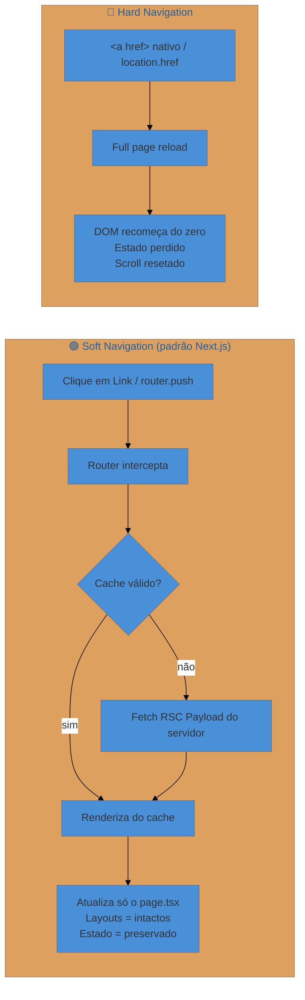

> [!abstract] TL;DR
> O App Router do Next.js separa navegação **declarativa** (`<Link>`) de **programática**
> (`useRouter`). Por padrão, toda troca de rota é uma **soft navigation** — o cliente atualiza
> apenas o segmento que mudou, mantendo layouts compartilhados intactos. O prefetch ocorre
> automaticamente quando o `<Link>` entra no viewport; o comportamento depende de a rota ser
> estática (prefetch completo) ou dinâmica (parcial, se `loading.tsx` existir). No Next 15, o
> Router Cache tem `staleTimes.dynamic = 0` (sem cache por padrão — mudança de comportamento em
> relação ao Next 14). Hooks client-side (`usePathname`, `useSearchParams`, `useParams`) vivem em
> `next/navigation`; no servidor, `redirect()`, `permanentRedirect()` e `notFound()` encerram a
> renderização imediatamente. Em Server Components, `params` e `searchParams` são **Promises** e
> precisam de `await`.

## O problema: navegar sem perder o estado da página

Imagine um painel de administração com sidebar, breadcrumbs e um toast de notificação no ar.
O usuário clica em um link da sidebar. Na web clássica, isso dispara um `GET` de página inteira:
o DOM recomeça do zero, o toast desaparece, o scroll reseta, a sidebar pisca. Não é o que o
usuário espera de uma aplicação moderna.

O Next.js App Router resolve isso com **client-side transitions**: em vez de recarregar a página,
ele substitui somente o `page.tsx` que mudou, mantendo o `layout.tsx` compartilhado no lugar.
Para que isso seja rápido, ele prefetcha os dados da próxima rota enquanto o usuário ainda está
lendo a atual.

Mas "navegar sem recarregar" não é magia — é um conjunto de primitivas bem definidas. Esta nota
mapeia cada uma delas: onde vive, quando usar, e onde o Next 15 mudou o comportamento.

## Soft navigation vs hard navigation

O termo técnico para "trocar de rota sem reload completo" é **soft navigation**. Seu oposto,
**hard navigation**, é o modelo tradicional da web: `<a href>` nativo, `location.href = ...`,
ou `window.location.replace(...)`.



A soft navigation do Next.js funciona porque o servidor retorna um **RSC Payload** — não HTML
completo, mas uma representação serializada dos Server Components que mudaram. O cliente aplica
esse delta sobre a árvore existente.

> [!info] Fundamento no React core
> A serialização de RSC Payload e o protocolo de atualização parcial são explicados em
> [[03-Dominios/Tecnologia/React/React core/23 - Server Components (RSC)|React core 23]].
> Esta nota foca em como o Next.js expõe essas primitivas via Router.

## `<Link>`: navegação declarativa

`<Link>` é o componente canônico para navegar entre rotas. Ele renderiza um `<a>` no DOM, mas
intercepta o clique para fazer soft navigation.

```tsx
// app/layout.tsx
import Link from 'next/link'

export default function Sidebar() {
  return (
    <nav>
      <Link href="/dashboard">Dashboard</Link>
      <Link href="/settings">Configurações</Link>
    </nav>
  )
}
```

### Prefetch automático

O grande diferencial do `<Link>` é o **prefetch automático**: quando o link entra no viewport
do usuário (em produção), o Next.js carrega os dados da rota em segundo plano. Quando o clique
vem, a navegação parece instantânea.

O comportamento varia pelo tipo de rota:

| Tipo de rota | O que é prefetchado |
|---|---|
| **Estática** (pré-renderizada) | Rota completa (payload + dados) |
| **Dinâmica** com `loading.tsx` | Layout + loading skeleton (parcial) |
| **Dinâmica** sem `loading.tsx` | Nada — aguarda resposta do servidor |

A prop `prefetch` controla esse comportamento:

```tsx
{/* Padrão: auto (null) — comportamento descrito acima */}
<Link href="/blog">Blog</Link>

{/* Desativa prefetch — útil em listas longas / tabelas infinitas */}
<Link href="/item/123" prefetch={false}>Item</Link>

{/* Força prefetch completo mesmo para rotas dinâmicas */}
<Link href="/profile" prefetch={true}>Perfil</Link>
```

> [!warning] Prefetch só funciona em produção
> Em modo de desenvolvimento (`next dev`), o prefetch é desabilitado. Os testes de performance
> de prefetch precisam ser feitos com `next build && next start`.

> [!tip] Assista: The Recommended Way To Link In Next.js 15
> **Canal:** Code Ryan | **Duração:** ~10min | **Idioma:** EN
>
> O vídeo percorre as três opções do prop `prefetch` (`null`, `true`, `false`) com exemplos no browser — deixando claro que `null` não significa "ativo por padrão", mas sim "Next.js decide pelo tipo de rota". Detalhe que reforça o warning acima: o narrador explica por que o prefetch parece idêntico com ou sem o prop durante o desenvolvimento (ele está silenciosamente desativado em `next dev`).
> Trecho de destaque [7:48]: *"null is prefetched behavior depends on whether the route is static or dynamic — for static the full route will be prefetched, for dynamic routes the partial route down to the nearest loading.js boundary will be prefetched."*
>
> 🎬 [Assistir no YouTube](https://www.youtube.com/watch?v=ETVRpNG-pgM)

### Scroll e âncora

Por padrão, toda navegação faz scroll ao topo da nova página. Para suprimir:

```tsx
<Link href="/dashboard" scroll={false}>Mantém scroll</Link>
```

Para navegar a uma âncora específica:

```tsx
<Link href="/docs#instalação">Seção de Instalação</Link>
```

## Hooks client-side: `next/navigation`

Todos os hooks de navegação no App Router vêm de `next/navigation` — **nunca** de `next/router`
(que pertence ao Pages Router). Essa é a quebra mais comum em migrações.

> [!warning] `next/router` vs `next/navigation`
> No Pages Router, os hooks vieram de `next/router`. No App Router, o pacote correto é
> `next/navigation`. Importar do lugar errado não gera erro de compilação imediato — o hook
> simplesmente retorna `null` e causa bugs silenciosos em runtime.

### `useRouter`

Para navegação programática — quando o destino depende de lógica (formulário enviado, ação
concluída, timeout):

```tsx
'use client'

import { useRouter } from 'next/navigation'

export function LoginButton() {
  const router = useRouter()

  async function handleLogin() {
    await authenticateUser()
    router.push('/dashboard')          // adiciona ao histórico
    // router.replace('/dashboard')    // substitui entrada atual
    // router.back()                   // volta no histórico
    // router.refresh()                // re-fetcha dados da rota atual
  }

  return <button onClick={handleLogin}>Entrar</button>
}
```

Métodos disponíveis:

| Método | Comportamento |
|---|---|
| `router.push(href, opts?)` | Navega e adiciona entrada no histórico do browser |
| `router.replace(href, opts?)` | Navega substituindo a entrada atual (sem volta) |
| `router.refresh()` | Re-fetcha dados do servidor; preserva estado client |
| `router.back()` | Volta no histórico (equivale ao botão Voltar) |
| `router.forward()` | Avança no histórico |
| `router.prefetch(href)` | Prefetcha manualmente uma rota |

`opts` aceita `{ scroll: boolean }` — `false` suprime o scroll ao topo.

> [!info] `router.refresh()` vs `revalidatePath`
> `router.refresh()` limpa o **Router Cache** (client-side) da rota atual e dispara novo fetch
> do servidor. Mas ele não invalida o **Data Cache** do servidor. Para isso, use `revalidatePath`
> ou `revalidateTag` em Server Actions. A distinção entre os dois caches é explicada em
> [[03-Dominios/Tecnologia/React/Next.js/07 - O modelo de caching do Next 15|nota 07]].

### `usePathname`

Retorna a pathname atual como string:

```tsx
'use client'

import { usePathname } from 'next/navigation'
import Link from 'next/link'

export function NavLink({ href, label }: { href: string; label: string }) {
  const pathname = usePathname()
  const isActive = pathname === href || pathname.startsWith(`${href}/`)

  return (
    <Link
      href={href}
      className={isActive ? 'nav-link nav-link--active' : 'nav-link'}
    >
      {label}
    </Link>
  )
}
```

### `useSearchParams`

Acessa os query parameters da URL atual como um objeto `URLSearchParams`:

```tsx
'use client'

import { useSearchParams } from 'next/navigation'

export function ProductFilter() {
  const searchParams = useSearchParams()
  const category = searchParams.get('category') ?? 'all'
  const page = Number(searchParams.get('page') ?? '1')

  return <p>Categoria: {category} — Página: {page}</p>
}
```

> [!warning] `useSearchParams` exige `<Suspense>` em builds estáticos
> Componentes que chamam `useSearchParams` precisam estar dentro de um `<Suspense>` boundary.
> Caso contrário, o build falha com erro de pré-renderização. A convenção é envolver o componente
> consumidor em `<Suspense fallback={<div>Carregando...</div>}>` no arquivo pai.

### `useParams`

Acessa os parâmetros dinâmicos da rota (ex.: `[slug]`, `[id]`):

```tsx
'use client'

import { useParams } from 'next/navigation'

export function ArticleHeader() {
  const params = useParams<{ slug: string }>()
  return <h1>Artigo: {params.slug}</h1>
}
```

## Funções server: `redirect`, `permanentRedirect`, `notFound`

No servidor (Server Components, Route Handlers, Server Actions), não há hooks — a saída é via
funções que **interrompem a renderização imediatamente** lançando um erro interno capturado pelo
framework.

> [!warning] Nunca chamar dentro de `try/catch`
> `redirect()`, `permanentRedirect()` e `notFound()` funcionam lançando um erro especial
> (`NEXT_REDIRECT`, `NEXT_NOT_FOUND`). Se chamados dentro de um bloco `try`, o `catch` captura
> o erro e a função não tem efeito. Coloque-as **sempre fora** de `try/catch`.

### `redirect(path, type?)`

Redireciona com status **307** (temporário, preserva método HTTP):

```tsx
// app/team/[id]/page.tsx
import { redirect } from 'next/navigation'

export default async function TeamPage({
  params,
}: {
  params: Promise<{ id: string }>    // Next 15: params é uma Promise
}) {
  const { id } = await params
  const team = await fetchTeam(id)

  if (!team) {
    redirect('/login')    // encerra renderização — sem return necessário
  }

  return <TeamView team={team} />
}
```

Em Server Actions, `redirect` emite um **303** (redireciona como GET); em outros contextos, 307.

### `permanentRedirect(path)`

Redireciona com status **308** (permanente, preserva método):

```tsx
import { permanentRedirect } from 'next/navigation'

// Rota /old-path foi movida definitivamente para /new-path
export default async function OldPage() {
  permanentRedirect('/new-path')
}
```

> [!warning] 307 vs 308 (não 301/302)
> O Next.js usa 307/308 em vez de 301/302 para **preservar o método HTTP** da requisição
> original. Um redirect 302 em resposta a um `POST` faz o browser refazer a requisição como
> `GET`, quebrando Server Actions. O 307 garante que o `POST` se mantenha.

### `notFound()`

Termina a renderização e exibe o `not-found.tsx` mais próximo na hierarquia de rotas:

```tsx
import { notFound } from 'next/navigation'

export default async function ArticlePage({
  params,
}: {
  params: Promise<{ slug: string }>
}) {
  const { slug } = await params
  const article = await getArticle(slug)

  if (!article) {
    notFound()    // aciona app/not-found.tsx ou o not-found.tsx do segmento
  }

  return <ArticleView article={article} />
}
```

## Router Cache e `staleTimes`

> [!info] Router Cache — visão completa na nota 07
> O Router Cache (também chamado de Client Cache) é o quarto nível do modelo de caching do Next
> 15. Os detalhes completos — como ele interage com os outros três caches, como `fetch` se
> encaixa, e como `revalidatePath`/`revalidateTag` invalidam dados — estão em
> [[03-Dominios/Tecnologia/React/Next.js/07 - O modelo de caching do Next 15|nota 07]].
> Aqui, o foco é no impacto direto na navegação.

No Next 15, o Router Cache tem comportamento diferente do Next 14 para segmentos de página:

| | Next 14 | Next 15 |
|---|---|---|
| `staleTimes.dynamic` (padrão) | 30 segundos | **0 segundos** (sem cache) |
| `staleTimes.static` (padrão) | 5 minutos | 5 minutos (sem mudança) |

Isso significa que, por padrão no Next 15, cada navegação para uma rota dinâmica re-fetcha os
dados do servidor. Se o comportamento do Next 14 for desejado, configure explicitamente:

```js
// next.config.js
/** @type {import('next').NextConfig} */
const nextConfig = {
  experimental: {
    staleTimes: {
      dynamic: 30,   // segundos — restaura o padrão do Next 14
      static: 300,   // 5 minutos
    },
  },
}

module.exports = nextConfig
```

> [!warning] `staleTimes` é experimental
> A flag `staleTimes` foi marcada como experimental no Next 14.2 e permanece assim no Next 15.
> Não é recomendada para produção sem avaliação de risco — a API pode mudar em versões futuras.

## Next 15: `params` e `searchParams` como Promises

No Next 15, os props `params` e `searchParams` de Server Components (`page.tsx`, `layout.tsx`)
passaram a ser **Promises** em vez de objetos síncronos. Isso requer `await`:

```tsx
// ✅ Next 15 — params é Promise
export default async function Page({
  params,
  searchParams,
}: {
  params: Promise<{ slug: string }>
  searchParams: Promise<{ page?: string; q?: string }>
}) {
  const { slug } = await params
  const { page = '1', q = '' } = await searchParams

  // ...
}
```

```tsx
// ❌ Padrão do Next 14 — quebra no Next 15
export default function Page({ params }: { params: { slug: string } }) {
  const { slug } = params   // TypeError em runtime no Next 15
}
```

Essa mudança permite que o Next.js paralelize o acesso a `params` e `searchParams` com outras
operações assíncronas da renderização.

## Scroll restoration

O Next.js trata scroll de forma diferente dependendo do tipo de navegação:

- **Rota nova** (`router.push`, `<Link>`): scroll vai ao topo automaticamente. Suprima com
  `scroll={false}` no `<Link>` ou `{ scroll: false }` em `router.push`.
- **Voltar/avançar** (`router.back`, botão do browser): o browser restaura a posição exata de
  scroll automaticamente — o Next.js não interfere com isso.
- **`router.refresh()`**: scroll não é alterado; o usuário permanece na mesma posição.

## Casos práticos

### Cenário 1: Filtro de produtos com `searchParams` sem reload

Uma lista de produtos filtrada por categoria e página. O filtro deve atualizar a URL para que
o link seja compartilhável, mas sem recarregar a página inteira:

```tsx
// app/products/page.tsx
import { ProductList } from '@/components/product-list'
import { FilterBar } from '@/components/filter-bar'

export default async function ProductsPage({
  searchParams,
}: {
  searchParams: Promise<{ category?: string; page?: string }>
}) {
  const { category = 'all', page = '1' } = await searchParams
  const products = await fetchProducts({ category, page: Number(page) })

  return (
    <div>
      <FilterBar />
      <ProductList products={products} />
    </div>
  )
}
```

```tsx
// app/components/filter-bar.tsx
'use client'

import { useRouter, useSearchParams, usePathname } from 'next/navigation'
import { useCallback } from 'react'

export function FilterBar() {
  const router = useRouter()
  const pathname = usePathname()
  const searchParams = useSearchParams()

  const setFilter = useCallback(
    (key: string, value: string) => {
      const params = new URLSearchParams(searchParams.toString())
      params.set(key, value)
      params.set('page', '1')   // reseta paginação ao filtrar
      router.push(`${pathname}?${params.toString()}`)
    },
    [router, pathname, searchParams]
  )

  return (
    <div>
      <button onClick={() => setFilter('category', 'electronics')}>
        Eletrônicos
      </button>
      <button onClick={() => setFilter('category', 'clothing')}>
        Roupas
      </button>
    </div>
  )
}
```

O `router.push` atualiza a URL e dispara uma nova renderização do Server Component
`ProductsPage`, que lê os novos `searchParams`. O estado da sidebar e do header não são tocados.

### Cenário 2: Wizard multi-step com `router.push` e histórico

Um formulário em 3 etapas onde o usuário pode voltar ao passo anterior:

```tsx
// app/onboarding/step-[step]/page.tsx
import { redirect } from 'next/navigation'

export default async function StepPage({
  params,
}: {
  params: Promise<{ step: string }>
}) {
  const { step } = await params
  const stepNumber = parseInt(step)

  if (stepNumber < 1 || stepNumber > 3) {
    redirect('/onboarding/step-1')
  }

  return <StepForm step={stepNumber} />
}
```

```tsx
// app/components/step-form.tsx
'use client'

import { useRouter } from 'next/navigation'

export function StepForm({ step }: { step: number }) {
  const router = useRouter()

  function goToNext() {
    if (step < 3) {
      router.push(`/onboarding/step-${step + 1}`)
    } else {
      router.push('/dashboard')
    }
  }

  return (
    <div>
      <h2>Passo {step} de 3</h2>
      {/* formulário do passo */}
      <button onClick={() => router.back()}>Voltar</button>
      <button onClick={goToNext}>Próximo</button>
    </div>
  )
}
```

`router.push` garante que cada passo gera uma entrada no histórico, então `router.back()`
funciona naturalmente com o botão Voltar do browser.

## Armadilhas comuns

> [!warning] Importar `useRouter` do lugar errado
> **O que acontece:** `useRouter()` retorna `null` ou `undefined`; chamar `router.push()` causa
> `TypeError: Cannot read properties of null`.
> **Por quê:** `next/router` é o pacote do Pages Router e não funciona no App Router.
> **Como evitar:** sempre importe de `next/navigation`:
> ```tsx
> import { useRouter } from 'next/navigation'  // ✅
> import { useRouter } from 'next/router'       // ❌ Pages Router
> ```

> [!warning] `params` e `searchParams` sem `await` no Next 15
> **O que acontece:** `params.slug` retorna `undefined`; o tipo TypeScript indica `Promise<...>`.
> **Por quê:** no Next 15, esses props são Promises. Acessar propriedades diretamente lê a
> Promise object, não o valor resolvido.
> **Como evitar:** torne a função `async` e use `await params` / `await searchParams` antes de
> desestruturar.

> [!warning] `redirect()` dentro de `try/catch`
> **O que acontece:** o redirect é silenciosamente engolido; a renderização continua normalmente,
> sem redirecionar.
> **Por quê:** `redirect()` funciona lançando um erro especial (`NEXT_REDIRECT`). Um `catch`
> genérico captura esse erro e o descarta.
> **Como evitar:** restructure o código para chamar `redirect()` fora do bloco `try`:
> ```tsx
> let data
> try {
>   data = await fetchData()
> } catch (e) {
>   // tratar erros de fetch aqui
> }
> if (!data) redirect('/not-found')  // fora do try
> ```

> [!warning] `useSearchParams` sem `<Suspense>` em páginas estáticas
> **O que acontece:** build falha com erro de pré-renderização; ou a página toda vira dinâmica
> desnecessariamente.
> **Por quê:** `useSearchParams` acessa dados da requisição que não estão disponíveis em build
> time. O Next.js exige que o componente consumidor esteja em um `<Suspense>` para poder
> renderizar o resto da página estaticamente.
> **Como evitar:** envolva o componente que usa `useSearchParams` em `<Suspense>`:
> ```tsx
> <Suspense fallback={<p>Carregando filtros...</p>}>
>   <FilterComponent />
> </Suspense>
> ```

## Como explicar em inglês

In Next.js, client-side navigation is handled by the `<Link>` component for declarative use cases,
and by the `useRouter` hook for programmatic ones. Both trigger **soft navigations** — only the
changed page segment is re-rendered, while shared layouts remain mounted. Server-side redirects
use `redirect()` or `permanentRedirect()`, which throw a special error to immediately terminate
rendering. In Next 15, the Router Cache no longer caches dynamic page segments by default
(`staleTimes.dynamic = 0`), so each navigation refetches fresh data from the server.

| PT | EN |
|---|---|
| Navegação suave | Soft navigation / client-side transition |
| Navegação completa | Hard navigation / full page reload |
| Pré-carregamento | Prefetching |
| Cache do roteador | Router Cache / Client Cache |
| Parâmetros de rota | Route params / dynamic segments |
| Parâmetros de busca | Search params / query parameters |
| Restauração de rolagem | Scroll restoration |
| Redirecionamento permanente | Permanent redirect (308) |

## O que vem a seguir

A navegação controla **onde** o usuário vai; o próximo tema é o que acontece **enquanto** ele
espera: as estratégias de renderização que determinam se a resposta vem do cache, do servidor
em streaming, ou pré-pronta de build.

- [[03-Dominios/Tecnologia/React/Next.js/07 - O modelo de caching do Next 15|07 - O modelo de caching do Next 15]] — como Router Cache, Data Cache e Full Route Cache se relacionam
- [[03-Dominios/Tecnologia/React/Next.js/08 - Rendering strategies - SSR, SSG, ISR, PPR|08 - Rendering strategies]] — SSR, SSG, ISR e PPR na prática
- [[03-Dominios/Tecnologia/React/Next.js/09 - Streaming, Suspense e loading.tsx|09 - Streaming, Suspense e loading.tsx]] — como tornar rotas dinâmicas rápidas com streaming

## Fontes

- **Vercel / Next.js Team** — [*Linking and Navigating*](https://nextjs.org/docs/app/building-your-application/routing/linking-and-navigating) — documentação oficial do App Router, incluindo prefetch e client-side transitions
- **Vercel / Next.js Team** — [*useRouter API Reference*](https://nextjs.org/docs/app/api-reference/functions/use-router) — métodos, assinaturas e histórico de versões
- **Vercel / Next.js Team** — [*staleTimes Configuration*](https://nextjs.org/docs/app/api-reference/config/next-config-js/staleTimes) — mudanças de default no Next 15 (`dynamic: 30s → 0s`)
- **Vercel / Next.js Team** — [*redirect Function*](https://nextjs.org/docs/app/api-reference/functions/redirect) — comportamento, status codes (307/308) e uso em Server Actions
- **Vercel / Next.js Team** — [*Next.js 15 Release Notes*](https://nextjs.org/blog/next-15) — breaking changes: `params`/`searchParams` como Promise, `staleTimes.dynamic = 0`
