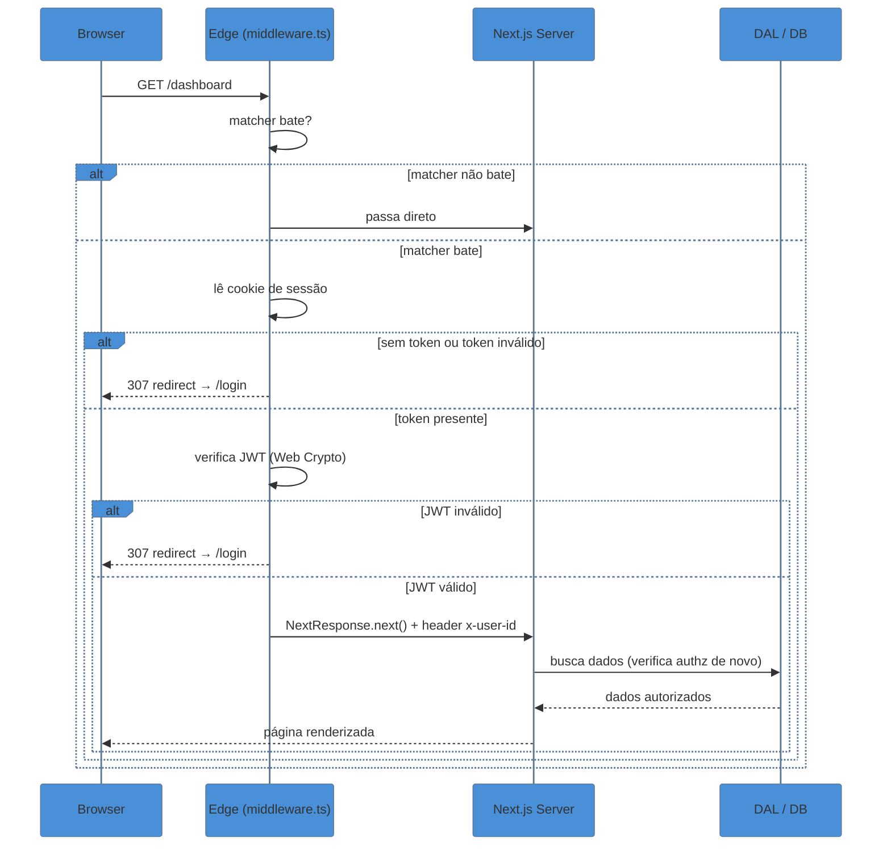
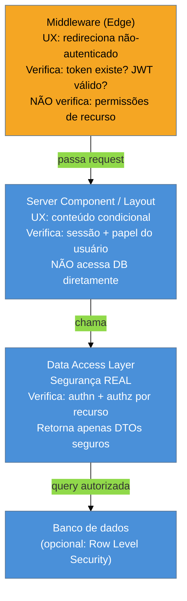

> [!abstract] TL;DR
> O `middleware.ts` roda na **borda**, antes de qualquer renderização de página ou execução de
> Route Handler. Ele intercepta requisições, decide o que fazer (deixar passar, redirecionar,
> reescrever) e pode ler/modificar cookies e headers. O `matcher` determina quais rotas são
> interceptadas. Por padrão executa no **Edge runtime** — sem Node.js nativo, sem libs pesadas, mas
> latência mínima; desde Next 15.5 é possível optar pelo runtime Node.js. A grande armadilha de
> arquitetura: **middleware não é barreira de segurança — é portaria**. A autorização real deve
> viver no Data Access Layer (DAL), em Server Actions e em Route Handlers. Tratar o middleware
> como única defesa abre CVEs silenciosas.

## O problema que o middleware resolve

Imagine que sua aplicação tem cinquenta rotas protegidas: `/dashboard`, `/settings`, `/admin/*`,
`/api/orders/*`. Sem middleware, você precisaria checar a sessão em cada `page.tsx`, em cada
`layout.tsx`, em cada Route Handler — repetindo a mesma lógica de "tem cookie? está válido?
redireciona para /login" dezenas de vezes, com risco de esquecer uma rota.

O middleware resolve isso com uma intercepção centralizada: uma única função que roda antes de
qualquer outra coisa, para qualquer rota que o `matcher` descreva. É o ponto certo para decisões
transversais — auth check de primeiro nível, redirecionamentos por geolocalização, A/B routing por
cookie, injeção de headers de segurança — sem tocar no código das páginas.

O que o middleware **não** é: o cofre-forte dos seus dados. Esse papel pertence ao Data Access
Layer.

## Onde o `middleware.ts` vive e como é chamado

O arquivo deve estar na raiz do projeto — ou dentro de `src/` se você usa esse layout — no mesmo
nível de `app/`. Não existe arquivo de middleware aninhado por rota: há **um único** `middleware.ts`
por projeto.

```ts
// middleware.ts (raiz do projeto)
import { NextResponse } from 'next/server'
import type { NextRequest } from 'next/server'

export function middleware(request: NextRequest): NextResponse {
  // lógica aqui
  return NextResponse.next()
}

// Opcional, mas fortemente recomendado:
export const config = {
  matcher: ['/dashboard/:path*', '/admin/:path*'],
}
```

A função `middleware` recebe um `NextRequest` (extensão do Web `Request`) e deve retornar um
`NextResponse` (extensão do Web `Response`). O Next.js chama essa função para cada requisição que
bate no `matcher`; se o matcher não for configurado, o middleware roda em **todas** as rotas — o
que geralmente é excessivo.

## O `matcher`: filtrando quais rotas interceptar

O `matcher` vive dentro de `export const config` e aceita um array de strings ou objetos com
`source` e `regexp`. A sintaxe suporta padrões estilo path-to-regexp:

```ts
export const config = {
  matcher: [
    // rotas explícitas
    '/dashboard/:path*',
    '/admin/:path*',
    // excluir arquivos estáticos e internos do Next
    '/((?!_next/static|_next/image|favicon.ico).*)',
  ],
}
```

> [!question]- Por que excluir `_next/static` e `_next/image`?
> Esses caminhos são arquivos estáticos servidos diretamente pelo Next — CSS, JS, imagens
> otimizadas. Passar pelo middleware a cada request de asset duplica o trabalho sem benefício
> algum. A exclusão é idiomática e recomendada pela documentação oficial.

O padrão `/:path*` significa "este segmento e qualquer sub-segmento". Já `/dashboard` sem o
`/:path*` só pega a rota exata `/dashboard`, deixando `/dashboard/settings` de fora — uma armadilha
comum.

## Edge runtime: poder e limites

Por padrão, o middleware roda no **Edge runtime** do Next.js — um ambiente V8 leve, sem Node.js
completo. O benefício é latência ultrabaixa: o código roda geograficamente próximo ao usuário, sem
cold start pesado de servidor Node.

```ts
// Default: Edge (implícito, não precisa declarar)
// Para optar pelo Node.js runtime (Next 15.5+):
export const runtime = 'nodejs'
```

> [!info] Runtime Node.js no middleware (Next 15.5+)
> A partir do Next 15.5, é possível exportar `export const runtime = 'nodejs'` no `middleware.ts`
> para acessar APIs Node.js plenas. Use quando precisar de libs que não suportam Edge — por
> exemplo, algumas implementações de verificação de JWT com criptografia assimétrica. O trade-off
> é latência levemente maior e ausência dos benefícios de distribuição geográfica do Edge.

**O que está disponível no Edge:**

- Web Crypto API (para verificar JWTs com `jose`)
- `fetch` nativo
- `Request`, `Response`, `Headers`, `URL`, `URLSearchParams`
- `TextEncoder`, `TextDecoder`
- Cookies e headers via `NextRequest`/`NextResponse`

**O que NÃO está disponível no Edge (sem `runtime = 'nodejs'`):**

- `fs`, `path`, `crypto` (Node built-ins)
- Drivers de banco de dados que usam sockets TCP nativos (Prisma padrão, `pg`, `mysql2`)
- Muitas libs npm que assumem Node.js internamente

A tentativa de importar uma lib incompatível com Edge gera erro em build ou em runtime — não em
TypeScript. Sempre confira se a lib tem anotação de suporte Edge ou teste com `next build`.

## As três respostas possíveis

Toda execução do middleware termina retornando uma dessas três formas de `NextResponse`:

```ts
// 1. Deixa a requisição seguir o fluxo normal
return NextResponse.next()

// 2. Redireciona (muda a URL visível no browser)
return NextResponse.redirect(new URL('/login', request.url))

// 3. Reescreve internamente (URL visível não muda, mas rota diferente é servida)
return NextResponse.rewrite(new URL('/dashboard/v2', request.url))
```

`redirect` envia um 307 (ou 308 para permanente) para o browser — o usuário vê a URL mudar.
`rewrite` é transparente: o browser não sabe que a requisição foi servida por outra rota. Isso é
útil para A/B testing (mostrar `/home-b` mas manter `/home` na barra de endereços) e para proxying
condicional.

`NextResponse.next()` pode ser enriquecido com cookies e headers antes de repassar:

```ts
const response = NextResponse.next()
response.headers.set('x-custom-header', 'valor')
response.cookies.set('theme', 'dark', { httpOnly: false, path: '/' })
return response
```

## Lendo e escrevendo cookies e headers

`NextRequest` expõe cookies de entrada via `.cookies`:

```ts
export function middleware(request: NextRequest) {
  const sessionToken = request.cookies.get('session-token')?.value
  const locale = request.headers.get('accept-language')

  if (!sessionToken) {
    return NextResponse.redirect(new URL('/login', request.url))
  }

  // Passa header downstream para Server Components lerem via `headers()`
  const response = NextResponse.next()
  response.headers.set('x-user-locale', locale ?? 'pt-BR')
  return response
}
```

> [!question]- Server Components conseguem ler headers que o middleware injetou?
> Sim. Headers adicionados em `NextResponse.next()` ficam disponíveis no request que chega ao
> Server Component via `headers()` de `next/headers`. É o padrão canônico para passar contexto
> leve (locale, user-id inferido do token) sem bater no banco no middleware.

Para **deletar** um cookie na resposta:

```ts
const response = NextResponse.next()
response.cookies.delete('session-token')
return response
```

## Fluxo de uma requisição pelo middleware



O ponto crítico do diagrama: o **DAL verifica autorizações de novo**, independente do middleware
ter passado. O middleware é triagem; o DAL é a porta cofre.

## Padrões de proteção de rota e leitura de sessão

### Verificando JWT no Edge com `jose`

`jose` é a biblioteca padrão para trabalhar com JWTs no Edge runtime porque usa Web Crypto API
internamente — sem dependências Node.js.

```ts
// middleware.ts
import { jwtVerify } from 'jose'
import { NextResponse } from 'next/server'
import type { NextRequest } from 'next/server'

const SECRET = new TextEncoder().encode(process.env.JWT_SECRET!)

export async function middleware(request: NextRequest): Promise<NextResponse> {
  const token = request.cookies.get('session-token')?.value

  if (!token) {
    return NextResponse.redirect(new URL('/login', request.url))
  }

  try {
    const { payload } = await jwtVerify(token, SECRET)
    // Injeta user-id como header para Server Components lerem
    const response = NextResponse.next()
    response.headers.set('x-user-id', String(payload.sub))
    return response
  } catch {
    // Token expirado ou inválido: limpa cookie e redireciona
    const response = NextResponse.redirect(new URL('/login', request.url))
    response.cookies.delete('session-token')
    return response
  }
}

export const config = {
  matcher: ['/dashboard/:path*', '/settings/:path*'],
}
```

> [!tip] Assista: Next.js App Router Authentication (Sessions, Cookies, JWTs)
> **Canal:** leerob (Lee Robinson, Vercel) | **Duração:** ~11min | **Idioma:** EN
>
> Lee Robinson constrói ao vivo a camada de auth mínima do App Router sem bibliotecas externas: criptografa um JWT com `jose`, armazena-o como cookie `httpOnly`, e usa o middleware para chamar `updateSession` — que renova o `expires` a cada request com `NextResponse.next()` + `cookies.set()`. O vídeo torna concreto o padrão de "middleware como portaria + DAL como cofre" ao mostrar por que a verificação real da sessão fica em `getSession`, não no middleware.
> Trecho de destaque [4:47]: *"This file is going to run in front of every request in our application, and it's calling 'update session' with that web request — otherwise, refresh that session so it doesn't expire."*
>
> 🎬 [Assistir no YouTube](https://www.youtube.com/watch?v=DJvM2lSPn6w)

> [!warning] Middleware não substitui verificação no DAL
> **O que acontece:** você protege `/dashboard` no middleware e assume que quem chegou ao Server
> Component está autorizado. Uma requisição direta a um Route Handler que não está no `matcher`
> (ou que manipula o header `x-middleware-subrequest`) passa sem check nenhum.
> **Por quê:** o middleware é executado apenas para as rotas no `matcher`, e pode ser contornado
> por requests diretos ao servidor em certos cenários (cf. CVE-2025-29927).
> **Como evitar:** sempre re-verificar sessão/permissão no Data Access Layer antes de retornar
> dados sensíveis. O middleware filtra; o DAL autoriza.

### Usando NextAuth / Clerk no middleware

Libs de auth de alto nível exportam suas próprias funções de middleware:

```ts
// Exemplo com NextAuth v5 (Auth.js)
export { auth as middleware } from '@/auth'

export const config = {
  matcher: ['/((?!_next/static|_next/image|favicon.ico).*)'],
}
```

```ts
// Exemplo com Clerk
import { clerkMiddleware, createRouteMatcher } from '@clerk/nextjs/server'

const isProtected = createRouteMatcher(['/dashboard(.*)', '/settings(.*)'])

export default clerkMiddleware((auth, req) => {
  if (isProtected(req)) auth().protect()
})

export const config = {
  matcher: ['/((?!_next/static|_next/image|favicon.ico).*)'],
}
```

O padrão é o mesmo em ambas: a lib encapsula a verificação de sessão e decide se chama
`NextResponse.next()` ou `redirect()`. Você configura o `matcher` e declara quais rotas são
protegidas.

## Camadas de segurança: onde cada verificação mora



| Camada | Verifica | Não verifica |
|--------|----------|--------------|
| Middleware | Token existe, JWT não expirou | Permissões granulares, dados do recurso |
| Server Component | Sessão ativa, papel do usuário | Dados brutos do banco |
| Data Access Layer | Authn + authz por recurso | — (é a fonte de verdade) |

## Quando usar middleware vs Server Component vs DAL

A pergunta que aparece em entrevistas: "onde coloco minha lógica de auth?". A resposta é "nas três
camadas, com propósitos distintos":

- **Middleware** → triagem rápida na borda: "existe sessão?" Se não, redireciona antes de gastar
  qualquer recurso de servidor. Não acessa banco, não verifica permissões específicas.
- **Server Component / Layout** → personalização de UI baseada no papel do usuário: "é admin?
  mostra o link de /admin". Pode chamar o DAL para obter perfil básico.
- **DAL** → autorização de recurso: "este usuário pode ler **este** pedido?". É aqui que a
  verificação realmente importa — um bug aqui expõe dados; um bug no middleware apenas falha na UX.

> [!info] Terminologia Next.js oficial
> A documentação do Next.js (nextjs.org/docs/app/guides/data-security) recomenda explicitamente o
> padrão DAL com DTOs (Data Transfer Objects): funções que verificam sessão, consultam o banco e
> retornam apenas os campos necessários — nunca expondo o objeto ORM completo ao componente.

## Casos práticos

### Cenário 1: proteger /dashboard com JWT em cookie

Usuário não autenticado tenta acessar `/dashboard/orders`. O middleware checa o cookie
`session-token`, tenta verificar o JWT com `jose`. Se falhar, redireciona para `/login?from=/dashboard/orders`
para que o login possa redirecionar de volta após autenticação.

```ts
import { jwtVerify } from 'jose'
import { NextResponse } from 'next/server'
import type { NextRequest } from 'next/server'

const SECRET = new TextEncoder().encode(process.env.JWT_SECRET!)

export async function middleware(request: NextRequest): Promise<NextResponse> {
  const token = request.cookies.get('session-token')?.value
  const loginUrl = new URL('/login', request.url)
  loginUrl.searchParams.set('from', request.nextUrl.pathname)

  if (!token) return NextResponse.redirect(loginUrl)

  try {
    await jwtVerify(token, SECRET)
    return NextResponse.next()
  } catch {
    const res = NextResponse.redirect(loginUrl)
    res.cookies.delete('session-token')
    return res
  }
}

export const config = {
  matcher: ['/dashboard/:path*', '/settings/:path*', '/api/protected/:path*'],
}
```

O parâmetro `from` preserva o destino original para o componente de login redirecionar após o
login bem-sucedido — experiência de UX padrão que vale implementar desde o início.

### Cenário 2: A/B testing silencioso por cookie

Você quer testar duas versões de `/home` sem mudar a URL visível. O middleware sorteia o grupo na
primeira visita, armazena em cookie e faz um `rewrite` interno:

```ts
import { NextResponse } from 'next/server'
import type { NextRequest } from 'next/server'

export function middleware(request: NextRequest): NextResponse {
  // Lê grupo já atribuído ou sorteia
  const bucket = request.cookies.get('ab-bucket')?.value
    ?? (Math.random() < 0.5 ? 'a' : 'b')

  const url = request.nextUrl.clone()
  url.pathname = bucket === 'b' ? '/home-b' : '/home-a'

  const response = NextResponse.rewrite(url)

  // Persiste bucket para visitas futuras
  if (!request.cookies.get('ab-bucket')) {
    response.cookies.set('ab-bucket', bucket, {
      httpOnly: false,
      maxAge: 60 * 60 * 24 * 30, // 30 dias
      path: '/',
    })
  }

  return response
}

export const config = {
  matcher: ['/home'],
}
```

A URL no browser permanece `/home`; internamente o Next serve `/home-a` ou `/home-b` conforme o
bucket. O cookie persiste o grupo para garantir consistência entre sessões.

### Cenário 3: i18n redirect por Accept-Language

Antes de adotar `next-intl` ou i18n nativo, muitas apps redirecionam baseado no header do browser:

```ts
import { NextResponse } from 'next/server'
import type { NextRequest } from 'next/server'

const LOCALES = ['pt', 'en', 'es']
const DEFAULT_LOCALE = 'pt'

function getLocale(request: NextRequest): string {
  const acceptLang = request.headers.get('accept-language') ?? ''
  const preferred = acceptLang.split(',')[0]?.split('-')[0] ?? ''
  return LOCALES.includes(preferred) ? preferred : DEFAULT_LOCALE
}

export function middleware(request: NextRequest): NextResponse {
  const { pathname } = request.nextUrl
  const hasLocale = LOCALES.some(
    (loc) => pathname.startsWith(`/${loc}/`) || pathname === `/${loc}`
  )

  if (!hasLocale) {
    const locale = getLocale(request)
    return NextResponse.redirect(
      new URL(`/${locale}${pathname}`, request.url)
    )
  }

  return NextResponse.next()
}

export const config = {
  matcher: ['/((?!_next|api|favicon.ico).*)'],
}
```

O middleware só redireciona quando a rota não tem prefixo de locale — evitando loop de redirect.

## Armadilhas comuns

> [!warning] Middleware como única barreira de segurança (a armadilha mais grave)
> **O que acontece:** a equipe protege `/dashboard` no middleware e não verifica autorizações nos
> Route Handlers e Server Actions. Um atacante faz requisição direta a `/api/orders/123` — que
> não está no `matcher` — ou explora um bypass e lê dados de outros usuários sem autenticação.
> **Por quê:** o middleware é camada de UX (redireciona browsers), não de segurança de dados. Ele
> não é chamado para requests que não batem no `matcher`, e pode ser contornado em cenários de
> self-hosting sem proxy correto.
> **Como evitar:** implementar um Data Access Layer que verifica sessão e permissões antes de
> qualquer acesso ao banco — independentemente de o middleware ter passado a requisição.

> [!warning] CVE-2025-29927 — bypass via `x-middleware-subrequest`
> **O que acontece:** em versões Next.js 11.1.4 a 15.2.2, era possível enviar o header
> `x-middleware-subrequest` em uma requisição externa para **pular completamente** a execução do
> middleware — contornando toda lógica de auth implementada nele. CVSS 9.1.
> **Por quê:** o header era usado internamente pelo Next para evitar loops em subrequests; não
> havia validação de origem.
> **Como evitar:** manter o Next.js atualizado (corrigido em 15.2.3). Em self-hosting, bloquear
> o header `x-middleware-subrequest` no load balancer/proxy reverso. Este CVE é o argumento mais
> concreto contra tratar middleware como única barreira de segurança.

> [!warning] Libs pesadas no Edge runtime causam erro silencioso em build
> **O que acontece:** você importa `prisma`, `bcrypt`, ou outra lib com dependências nativas no
> `middleware.ts`. O build compila, mas em runtime o Edge lança erro de módulo não encontrado —
> ou o build falha com mensagem críptica sobre `node:crypto`.
> **Por quê:** o Edge runtime não tem acesso a módulos Node.js nativos; qualquer lib que faça
> `require('crypto')` internamente quebra.
> **Como evitar:** usar apenas Web Crypto API (`crypto.subtle`) no middleware; para JWT, usar
> `jose` (suporta Edge); para verificações que exigem banco, mover para Route Handlers ou Server
> Actions (que rodam no runtime Node.js).

> [!warning] `matcher` sem `/:path*` deixa sub-rotas desprotegidas
> **O que acontece:** você configura `matcher: ['/dashboard']` e assume que `/dashboard/settings`
> também está protegido. O middleware não roda para a sub-rota.
> **Por quê:** `/dashboard` sem wildcard bate apenas na rota exata. `/:path*` é necessário para
> incluir todos os segmentos filhos.
> **Como evitar:** sempre usar `/dashboard/:path*` para proteger uma seção inteira. Testar com
> rotas aninhadas reais antes de ir para produção.

## Fundamento teórico: edge computing e defense-in-depth

O middleware no Edge é uma aplicação do princípio de **processamento próximo à origem** (edge
computing): em vez de enviar cada requisição para um servidor centralizado para decidir se deve
continuar, a decisão acontece em um nó geograficamente próximo ao usuário. O ganho é duplo —
latência menor e redução de carga no servidor de origem.

Mas o Edge runtime impõe um contrato: **sem estado persistente, sem I/O pesado**. Isso força uma
divisão de responsabilidades que coincide com o princípio de **defense-in-depth** (defesa em
profundidade): nenhuma camada é a única responsável pela segurança. Se o middleware falha (por
bug, por bypass, por CVE), o DAL ainda protege. Se o DAL tem um bug, Row Level Security no banco
ainda pode bloquear. Camadas redundantes de verificação não são redundância por incompetência —
são engenharia de segurança.

**JWT vs sessão em banco no contexto de Edge:** JWTs são stateless — o middleware pode verificar
a assinatura sem tocar no banco. O custo é que JWTs revogados antes do prazo exigem blocklist (que
exige banco). Sessões em banco permitem revogação imediata, mas exigem um lookup — inviável no
Edge sem um banco com API HTTP (Upstash Redis, PlanetScale HTTP API). A escolha depende do modelo
de ameaça: para a maioria das apps, JWT com expiração curta (15min) + refresh token revogável no
banco é o equilíbrio certo.

**Middleware em uma frase:** é o fiscal da entrada — verifica se você tem bilhete, mas não decide
se você pode usar a mesa VIP; isso é papel do maître (DAL).

## Como explicar em inglês

Middleware in Next.js runs at the edge, before any page rendering or data fetching. It intercepts
every request matched by the `config.matcher`, and decides whether to let it through, redirect, or
rewrite — all in milliseconds, close to the user. The critical point for interviews: **middleware
is a UX guard, not a security gate**. Authentication in middleware prevents unauthenticated users
from seeing your pages, but authorization must live in your Data Access Layer, where you verify not
just "is this user logged in?" but "is this user allowed to read this specific resource?".

| PT | EN |
|----|-----|
| Middleware | Middleware |
| Correspondência de rotas | Route matching |
| Reescrever (internamente) | Rewrite |
| Redirecionar | Redirect |
| Runtime na borda | Edge runtime |
| Limite de runtime | Runtime constraint |
| Camada de acesso a dados | Data Access Layer (DAL) |
| Defesa em profundidade | Defense in depth |
| Token de sessão em cookie | Session token in cookie |
| Sessão stateless (JWT) | Stateless session (JWT) |
| Revogação de token | Token revocation |
| Bypass de middleware | Middleware bypass |

## O que vem a seguir

Com o middleware estabelecendo guards de rota na borda, o próximo passo natural é otimizar o que
o usuário recebe quando passa por eles — imagens, fontes, bundles — para que a experiência seja
rápida mesmo quando as páginas são ricas. É aí que entram as ferramentas de otimização do Next.

- [[03-Dominios/Tecnologia/React/Next.js/14 - Otimizações - Image, Font, bundle, Turbopack|14 - Otimizações: Image, Font, bundle, Turbopack]] — `next/image`, `next/font`, `dynamic()` e Turbopack
- [[03-Dominios/Tecnologia/React/Next.js/10 - Route Handlers e APIs|10 - Route Handlers e APIs]] — onde a autorização por recurso complementa o middleware
- [[03-Dominios/Tecnologia/React/React core/23 - Server Components (RSC)|React core 23 — Server Components (RSC)]] — é no Server Component que o DAL roda e os headers injetados pelo middleware são consumidos via `headers()`
- [[03-Dominios/Tecnologia/React/Next.js/index|Next.js (galho)]] — mapa completo do galho

## Referências

- **Vercel / Next.js Team** — [*Middleware — Next.js Docs*](https://nextjs.org/docs/app/building-your-application/routing/middleware) — documentação oficial do App Router middleware, matcher e Edge runtime
- **Next.js Team** — [*Data Security Guide*](https://nextjs.org/docs/app/guides/data-security) — DAL pattern e recomendações de defense-in-depth oficial
- **Next.js Team** — [*NextResponse API Reference*](https://nextjs.org/docs/app/api-reference/functions/next-response) — API de cookies, headers, redirect e rewrite
- **WorkOS Blog** — [*Building authentication in Next.js App Router: 2026 guide*](https://workos.com/blog/nextjs-app-router-authentication-guide-2026) — padrões de auth no App Router com análise de CVE-2025-29927
- **Authgear** — [*Next.js Middleware Authentication*](https://www.authgear.com/post/nextjs-middleware-authentication/) — JWT no Edge com `jose`, defense-in-depth em produção
- **Eva / Medium** — [*Authentication in Next.js Middleware: Edge Runtime Limitations & Solutions*](https://medium.com/@shuhan.chan08/authentication-in-next-js-middleware-edge-runtime-limitations-solutions-7692a44f47ab) — limitações do Edge e alternativas práticas
