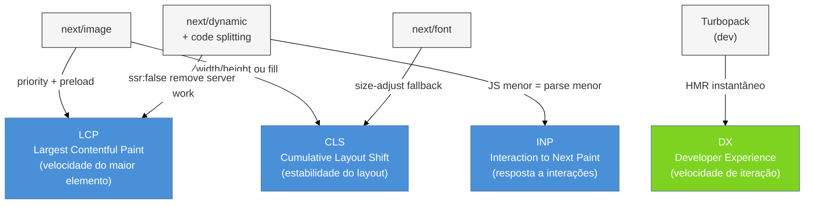

> [!abstract] TL;DR
> Next.js entrega quatro alavancas de performance prontas para uso: `next/image` (formato moderno, lazy, CLS zero), `next/font` (self-hosting, zero FOUT), `next/dynamic` (lazy de componente, corte de bundle por feature) e Turbopack (dev estável desde Next 15; build estável como padrão a partir do Next 16). Cada otimização ataca uma métrica Core Web Vital distinta: `next/image` e `next/font` miram CLS; `next/image` com `priority` acelera LCP; `next/dynamic` reduz INP via bundles menores. O trade-off nunca desaparece: conveniência automática versus controle fino — saber quando sair do padrão é o diferencial Magus.

---

Você publica um e-commerce. O Lighthouse devolve 58 em Performance. O culpado? Imagens sem dimensão definida que saltam o layout (CLS 0,42), uma fonte do Google carregada por rede externa que bloqueia a renderização, e um pacote de gráficos que vai no bundle principal mesmo em páginas que nunca mostram um gráfico. Cada problema tem solução nativa no Next.js — mas cada solução tem nuances que, ignoradas, criam novos problemas.

Esta nota desempacota os mecanismos internos dessas otimizações: por que elas funcionam, onde falham e quando o automático não é suficiente.

---

## `next/image` — mais do que um `` glorificado

O problema fundamental com `` no browser é que o HTML é parseado de cima para baixo: o navegador descobre a imagem, faz o download, e só então sabe as dimensões reais. Enquanto isso, o layout já foi calculado sem reservar espaço — resultado: a página "pula" quando a imagem carrega. Isso é CLS (Cumulative Layout Shift).

`next/image` resolve isso de três formas simultâneas:

**1. Dimensões obrigatórias ou `fill`** Você informa `width` e `height`, ou usa `fill` (que preenche o contêiner posicionado). O browser recebe o atributo `aspect-ratio` via CSS intrínseco e reserva espaço antes de baixar a imagem. CLS → zero.

**2. Lazy loading nativo com threshold inteligente** Por padrão, `next/image` usa `loading="lazy"` com `decoding="async"`. O browser só baixa a imagem quando ela está a ≈1 viewport de distância do viewport atual. Em páginas longas, isso elimina dezenas de MB de downloads desnecessários no first load.

**3. Conversão automática para formatos modernos** O servidor Next.js intercepta a requisição, converte para WebP (ou AVIF, se o browser suportar via `Accept`), redimensiona para o tamanho exato pedido e serve com `Cache-Control: public, max-age=31536000`. O original fica intocado; o servidor gera variantes on-demand e as cacheia em disco.

```tsx
// Uso básico — width/height obrigatórios (ou fill)
import Image from 'next/image'

export default function ProductCard() {
  return (
    <Image
      src="/product-hero.jpg"
      alt="Produto em destaque"
      width={800}
      height={600}
      sizes="(max-width: 768px) 100vw, 50vw"
    />
  )
}
```

### `sizes` — a prop que a maioria ignora

Por padrão, `next/image` gera um `srcset` que vai de 640px a 3840px. Sem `sizes`, o browser baixa a variante mais larga que couber na tela — em mobile, pode ser a de 1080px mesmo que a imagem ocupe só 30% da viewport.

`sizes` instrui o browser (não o Next.js) sobre qual variante escolher:

```tsx
// Sem sizes: browser pode escolher variante muito grande
// Com sizes: browser escolhe a variante certa para o slot real
<Image
  src="/hero.jpg"
  alt="Hero"
  width={1200}
  height={630}
  sizes="(max-width: 640px) 100vw, (max-width: 1024px) 80vw, 1200px"
  priority   // LCP image — não lazy-load
/>
```

### `priority` — para a imagem de LCP

`priority` remove o lazy loading e injeta `<link rel="preload">` no `<head>`. Use **somente** na imagem above-the-fold que é o elemento de LCP (Largest Contentful Paint). Usar em mais de uma imagem por página derrota o propósito: você está precarregando tudo ao mesmo tempo.

### `fill` — imagens sem dimensão conhecida

Quando você não sabe as dimensões do contêiner em tempo de compilação (ex.: imagem de banner vinda do CMS), use `fill` com um contêiner de posicionamento:

```tsx
<div className="relative h-64 w-full">
  <Image
    src={bannerUrl}
    alt="Banner dinâmico"
    fill
    style={{ objectFit: 'cover' }}
    sizes="100vw"
  />
</div>
```

O contêiner precisa de `position: relative` (ou `absolute`/`fixed`). Sem isso, a imagem "escapa" do fluxo.

---

## `next/font` — fonte sem layout shift e sem tracker

Fonts externas do Google Fonts enviam o usuário para `fonts.gstatic.com` — uma requisição de rede extra que bloqueia a renderização e vaza dados de acesso. `next/font/google` elimina isso fazendo o download da fonte em build-time e servindo como asset estático do próprio site.

```tsx
// app/layout.tsx
import { Inter, Roboto_Mono } from 'next/font/google'

const inter = Inter({
  subsets: ['latin'],
  display: 'swap',
  variable: '--font-inter',
})

const robotoMono = Roboto_Mono({
  subsets: ['latin'],
  display: 'swap',
  variable: '--font-roboto-mono',
})

export default function RootLayout({ children }: { children: React.ReactNode }) {
  return (
    <html lang="pt-BR" className={`${inter.variable} ${robotoMono.variable}`}>
      <body>{children}</body>
    </html>
  )
}
```

**Por que zero CLS?** `next/font` usa `size-adjust` CSS para compensar a métrica da fonte de fallback (geralmente `Arial` ou `Times New Roman`). Enquanto a fonte real carrega, o texto ocupa o mesmo espaço que ocuparia com a fonte real. Resultado: sem salto visual.

**`display: 'swap'`** instrui o browser a mostrar o fallback imediatamente e trocar quando a fonte carregar — melhor para percepção de velocidade do que `block` (que esconde o texto) ou `optional` (que descarta a fonte se ela demorar).

Para fontes locais (compradas, proprietárias):

```tsx
import localFont from 'next/font/local'

const customFont = localFont({
  src: [
    { path: './fonts/CustomFont-Regular.woff2', weight: '400' },
    { path: './fonts/CustomFont-Bold.woff2', weight: '700' },
  ],
  variable: '--font-custom',
})
```

---

## Code splitting automático + `next/dynamic`

O App Router faz code splitting por rota automaticamente. Cada `page.tsx` gera um chunk separado — você nunca carrega o JS da página de checkout na página de catálogo. Isso é transparente e gratuito.

O que não é automático: **componentes grandes dentro de uma rota**. Se você importa um editor de texto rico, um player de vídeo ou uma biblioteca de gráficos no topo do arquivo, todo esse JS vai no chunk da rota — mesmo que o componente só apareça após interação do usuário.

`next/dynamic` resolve isso:

```tsx
// Sem lazy: o bundle do chart entra no chunk da rota
import { SalesChart } from '@/components/SalesChart'

// Com lazy: o bundle do chart só é baixado quando o componente renderiza
import dynamic from 'next/dynamic'

const SalesChart = dynamic(() => import('@/components/SalesChart'), {
  loading: () => <p>Carregando gráfico...</p>,
  ssr: false,  // não renderiza no servidor (ex.: usa APIs do browser)
})
```

> [!question]- Por que `ssr: false` e quando usar?
> Algumas bibliotecas acessam `window`, `document` ou `localStorage` no nível de módulo — código que corre quando o arquivo é importado, não quando o componente renderiza. No servidor, essas APIs não existem e o processo quebra. `ssr: false` impede que o módulo seja importado no server. Use com bibliotecas de gráficos (Recharts, Chart.js), players de mídia e editores rich text baseados em browser. O trade-off: o componente não aparece no HTML inicial (SSR ausente), o que pode impactar SEO se o conteúdo for indexável.

**`next/dynamic` é um wrapper sobre `React.lazy` + `Suspense`** com a camada extra de SSR control. No App Router, Server Components não precisam de `dynamic` para splitting — eles já são excluídos do bundle do cliente por definição. Use `dynamic` principalmente para Client Components pesados.

---

## Bundle analyzer — enxergando o que você está enviando

`@next/bundle-analyzer` gera um mapa visual (treemap) dos módulos no bundle:

```bash
npm install @next/bundle-analyzer
```

```js
// next.config.ts
import bundleAnalyzer from '@next/bundle-analyzer'

const withBundleAnalyzer = bundleAnalyzer({
  enabled: process.env.ANALYZE === 'true',
})

export default withBundleAnalyzer({
  // resto da config
})
```

```bash
ANALYZE=true npm run build
```

Três abas abrem no browser: client bundle, server bundle e edge bundle. Procure por:

- Dependências duplicadas (ex.: `lodash` e `lodash-es` no mesmo bundle)
- Módulos grandes inesperados (ex.: `moment.js` com todos os locales)
- Código de Server Component que vazou para o client bundle (indica um `'use client'` não intencional numa importação)

> [!info] Next.js 16 e Turbopack integrado
> A partir do Next.js 16, o bundle analyzer se integra ao grafo de módulos do Turbopack, oferecendo rastreamento de imports mais preciso. Para projetos em Next 15, o `@next/bundle-analyzer` baseado em webpack continua sendo a ferramenta padrão.

---

## Turbopack — estado em 2026

O Turbopack é o bundler escrito em Rust que a Vercel construiu para substituir o webpack no Next.js. A distinção entre dev e build é crucial:

### Dev (`next dev --turbo`) — estável desde Next 15

O modo de desenvolvimento com Turbopack atingiu estabilidade no Next.js 15. HMR (Hot Module Replacement), Fast Refresh, resolução de módulos, CSS Modules e TypeScript funcionam de forma confiável. A diferença de velocidade é perceptível em projetos grandes: o cold start de dev pode ser **5-10x mais rápido** que o webpack, porque o Turbopack compila apenas os módulos necessários para a rota atual (lazy compilation).

```bash
# Ativa Turbopack no dev (estável em Next 15)
next dev --turbo
```

### Build (`next build --turbopack`) — beta/alpha em Next 15.x, padrão em Next 16

| Versão | Status do build |
|--------|----------------|
| Next 15.0–15.2 | Experimental (`--experimental-turbo`) |
| Next 15.3–15.5 | Beta (`next build --turbopack`) |
| Next 16 | Estável — padrão para dev e build |

Em Next 15.x, o build com Turbopack ainda tinha edge cases em tree-shaking (mais agressivo que o webpack em alguns cenários) e em CSS Modules de produção. A recomendação oficial para Next 15.x era: **use Turbopack no dev, webpack no build**.

> [!warning] Turbopack dev ≠ Turbopack build em Next 15
> O Turbopack de dev e de build são dois pipelines distintos. Ter `--turbo` no dev não significa que `next build` usa Turbopack — o build ainda usa webpack por padrão no 15.x. Verificar o pipeline de CI: se o script de build não tiver a flag, está usando webpack.

### Configuração (`next.config.ts`)

```ts
// next.config.ts
import type { NextConfig } from 'next'

const nextConfig: NextConfig = {
  // Configurações específicas do Turbopack (Next 15+)
  turbopack: {
    rules: {
      '*.svg': {
        loaders: ['@svgr/webpack'],
        as: '*.js',
      },
    },
  },
}

export default nextConfig
```

---

## Core Web Vitals — o que estamos medindo

Antes de mapear otimizações para métricas, vale fixar o que cada CWV realmente mede — e por que o Google as usa como sinal de ranking desde 2021.

**LCP (Largest Contentful Paint):** tempo até o maior elemento visível na viewport ser renderizado. "Maior" é medido em área de pixels — geralmente uma imagem hero, um bloco de texto principal ou um vídeo. Meta: < 2,5s. Acima de 4s é reprovado. O `next/image` com `priority` ataca diretamente essa métrica ao eliminar o lazy e emitir um preload.

**CLS (Cumulative Layout Shift):** soma ponderada de todos os saltos inesperados de layout durante o ciclo de vida da página. Cada shift é calculado como `impact_fraction × distance_fraction`. Meta: < 0,1. Acima de 0,25 é reprovado. O CLS é particularmente cruel porque penaliza shifts que movem elementos sob o cursor do usuário — o botão "Cancelar" que pulou para onde estava o "Confirmar". `next/image` (dimensões explícitas) e `next/font` (size-adjust no fallback) são as duas proteções nativas do Next.js contra CLS.

**INP (Interaction to Next Paint):** substituiu o FID em março de 2024. Mede o tempo entre qualquer interação do usuário (clique, toque, teclado) e o próximo frame pintado. Captura a fila de trabalho JS que atrasa a resposta visual. Meta: < 200ms. Acima de 500ms é reprovado. Bundles menores via `next/dynamic` reduzem o tempo de parse e execução do JS no thread principal, liberando o browser para responder mais rápido às interações.

> [!tip] Referência em vídeo
> **[Optimizing Web Performance with Next.js](https://www.youtube.com/watch?v=_hHCmBxCrys)** — Delba de Oliveira (Vercel, Next.js Conf 2023). Demonstra como `next/image`, `next/font` e lazy loading impactam CLS e LCP em uma aplicação real, com DevTools ao vivo. (~22 min)

---

## Mapa: otimização → Core Web Vital



---

## Casos práticos

### Cenário 1: Hero image sem CLS em e-commerce

O produto tem uma imagem hero above-the-fold que é o elemento de LCP. A imagem vem de um CDN externo (Cloudinary). Sem otimização, o LCP ultrapassa 4s e o CLS é 0.3.

```tsx
// app/product/[slug]/page.tsx
import Image from 'next/image'

interface Props {
  params: { slug: string }
}

export default async function ProductPage({ params }: Props) {
  const product = await fetchProduct(params.slug)

  return (
    <main>
      {/* priority: sem lazy, com preload — é o LCP */}
      <Image
        src={product.heroImageUrl}
        alt={product.name}
        width={1200}
        height={800}
        priority
        sizes="(max-width: 768px) 100vw, (max-width: 1200px) 80vw, 1200px"
        style={{ objectFit: 'cover' }}
      />
      <h1>{product.name}</h1>
    </main>
  )
}
```

Para domínios externos, o `next.config.ts` precisa de permissão explícita:

```ts
// next.config.ts
const nextConfig: NextConfig = {
  images: {
    remotePatterns: [
      {
        protocol: 'https',
        hostname: 'res.cloudinary.com',
        pathname: '/meu-account/**',
      },
    ],
  },
}
```

Resultado após: LCP ~1.2s (preload ativado + WebP), CLS 0.0 (width/height explícitos).

### Cenário 2: Dashboard com gráfico lazy

O dashboard tem uma rota `/dashboard/sales` que carrega um gráfico de Recharts. Sem lazy, o bundle da rota incluía 180kB de Recharts para todos os usuários — incluindo os que aterrissam na aba de Overview e nunca veem a aba de Sales.

```tsx
// app/dashboard/sales/page.tsx
'use client'
import dynamic from 'next/dynamic'
import { Suspense } from 'react'

// Recharts só é baixado quando SalesChart renderiza
const SalesChart = dynamic(
  () => import('@/components/SalesChart').then(m => m.SalesChart),
  {
    loading: () => (
      <div className="h-64 animate-pulse bg-gray-100 rounded" />
    ),
    ssr: false,  // Recharts usa window.ResizeObserver
  }
)

export default function SalesPage() {
  return (
    <section>
      <h2>Vendas do mês</h2>
      <SalesChart />
    </section>
  )
}
```

Após: o bundle da rota caiu de 220kB para 42kB. O gráfico carrega em ~300ms adicionais quando a aba é acessada — troca imperceptível dado o contexto (usuário navegou até essa aba intencionalmente).

### Cenário 3: Fonte customizada sem FOUT

Design system usa a fonte `Geist` da Vercel. Sem otimização, a fonte é carregada de CDN externo, causando FOUT (Flash of Unstyled Text) por ~400ms em conexões lentas.

```tsx
// app/layout.tsx
import { Geist, Geist_Mono } from 'next/font/google'

const geist = Geist({
  subsets: ['latin'],
  variable: '--font-geist',
  display: 'swap',
})

const geistMono = Geist_Mono({
  subsets: ['latin'],
  variable: '--font-geist-mono',
  display: 'swap',
})

export default function RootLayout({ children }: { children: React.ReactNode }) {
  return (
    <html lang="pt-BR" className={`${geist.variable} ${geistMono.variable}`}>
      <body className="font-sans">{children}</body>
    </html>
  )
}
```

O `size-adjust` gerado pelo `next/font` garante que o fallback (`Arial`) ocupe o mesmo espaço que a `Geist`. CLS de fonte → 0.

---

## Armadilhas comuns

> [!warning] `priority` em todas as imagens above-the-fold
> **O que acontece:** o desenvolvedor lê "priority melhora LCP" e coloca a prop em todas as imagens visíveis no topo da página — hero, avatar, ícones. **Por quê:** `priority` injeta um `<link rel="preload">` para cada imagem. O browser limita o número de preloads paralelos; muitos preloads competem entre si e degradam o LCP em vez de melhorar. **Como evitar:** use `priority` em **uma única imagem por rota** — a que você identificou via Lighthouse como o elemento de LCP.

> [!warning] `next/image` com imagens SVG — comportamento inesperado
> **O que acontece:** `next/image` com `src` apontando para SVG pode não servir o SVG como esperado — o componente tenta otimizar e converter, mas SVG não é um formato de raster. **Por quê:** o pipeline de otimização foi projetado para JPEG/PNG/GIF/WebP. SVGs são vetoriais e não ganham nada com conversão de formato. **Como evitar:** use `` nativo ou um componente SVG inline para SVGs. Para ícones, prefira `lucide-react` ou SVG inline; reserve `next/image` para imagens raster.

> [!warning] Fonte do Google Fonts importada fora do `next/font`
> **O que acontece:** o desenvolvedor importa a fonte via `@import url(...)` no CSS ou via `<link>` no `<head>` do layout — a fonte é carregada do CDN do Google em vez de ser self-hosted. **Por quê:** o `next/font` só intercepta importações via API (`import { Inter } from 'next/font/google'`). CSS imports diretos são ignorados. **Como evitar:** remova todos os `@import url(https://fonts.googleapis.com/...)` do CSS e substitua por `next/font/google`. Buscar no projeto por `fonts.googleapis.com` antes de publicar.

> [!warning] `ssr: false` em Server Component
> **O que acontece:** erro em build — `Error: 'ssr' is only allowed in Client Components`. **Por quê:** Server Components não são hidratados no browser; o controle de SSR não tem sentido no contexto de server rendering. **Como evitar:** `next/dynamic` com `ssr: false` é exclusivo de Client Components (`'use client'`). Se você precisa de lazy loading em um Server Component, use `import()` dinâmico nativo do JavaScript.

---

## Como explicar em inglês

In Next.js, performance optimization comes in four main tools that each target a specific Core Web Vital. `next/image` eliminates CLS by enforcing explicit dimensions and converts images to WebP automatically. `next/font` self-hosts Google Fonts at build time and uses CSS `size-adjust` on the fallback to prevent layout shift. `next/dynamic` defers heavy Client Components to a separate chunk, keeping the initial bundle small and reducing parse time. Finally, Turbopack replaces webpack for the dev server, delivering near-instant HMR through lazy per-module compilation.

| PT | EN |
|----|-----|
| Deslocamento de layout | Layout shift (CLS) |
| Carregamento preguiçoso | Lazy loading |
| Divisão de bundle / divisão de código | Code splitting |
| Self-hosting de fonte | Font self-hosting |
| Precarregamento | Preloading |
| Formatos modernos de imagem | Modern image formats (WebP/AVIF) |
| Analisador de bundle | Bundle analyzer |
| Substituição de módulo a quente | Hot Module Replacement (HMR) |
| Compilação incremental | Incremental compilation |

---

## O que vem a seguir

Com as otimizações de asset e de bundle dominadas, o próximo passo é garantir que a aplicação esteja pronta para produção em qualquer ambiente: Vercel (zero-config) ou self-hosted via Docker. A nota 15 cobre estratégias de deploy, o `output: standalone`, variáveis de ambiente e o comportamento de cache em infraestrutura própria.

- [[03-Dominios/Tecnologia/React/Next.js/11 - Metadata, SEO e assets sociais|11 - Metadata, SEO e assets sociais]] — `next/image` e `next/font` complementam a estratégia de SEO vista ali: assets otimizados + OG images
- [[03-Dominios/Tecnologia/React/Next.js/08 - Rendering strategies - SSR, SSG, ISR, PPR|08 - Rendering strategies - SSR, SSG, ISR, PPR]] — a estratégia de rendering define o que chega ao browser; as otimizações desta nota refinam *como* o asset chega
- [[03-Dominios/Tecnologia/Tooling e Build/15 - Turbopack, Rspack e a corrida Rust-Go|Tooling e Build 15 - Turbopack, Rspack e a corrida Rust-Go]] — contexto mais amplo sobre o Turbopack fora do ecossistema Next.js, comparação com Rspack e o panorama de bundlers em Rust/Go

---

Otimizações em uma frase: `next/image` serve o pixel certo no formato certo; `next/font` serve a letra certa sem surpresas de layout; `next/dynamic` serve só o JS necessário; e o Turbopack garante que o dev loop não seja o gargalo.

---

## Referências

- **Vercel / Next.js Team** — [*Image Optimization — App Router*](https://nextjs.org/docs/app/getting-started/images) — documentação oficial do componente `Image`, props e configuração de domínios externos
- **Vercel / Next.js Team** — [*Font Optimization — App Router*](https://nextjs.org/docs/app/getting-started/fonts) — self-hosting, `display`, `variable`, subsets e fontes locais
- **Vercel / Next.js Team** — [*Lazy Loading — App Router*](https://nextjs.org/docs/app/guides/lazy-loading) — `next/dynamic` e `React.lazy` no contexto do App Router
- **Vercel / Next.js Team** — [*Bundle Analyzer*](https://nextjs.org/docs/app/guides/package-bundling) — configuração do `@next/bundle-analyzer`
- **Vercel / Next.js Team** — [*Turbopack Dev Stable*](https://nextjs.org/blog/turbopack-for-development-stable) — post oficial de estabilidade do Turbopack dev
- **Vercel / Next.js Team** — [*Next.js 15.3 — Turbopack Builds Alpha*](https://nextjs.org/blog/next-15-3) — introdução do alpha de build com Turbopack
- **Vercel / Next.js Team** — [*Next.js 16 — Turbopack Stable Default*](https://nextjs.org/blog/next-16) — Turbopack estável e padrão para dev e build
