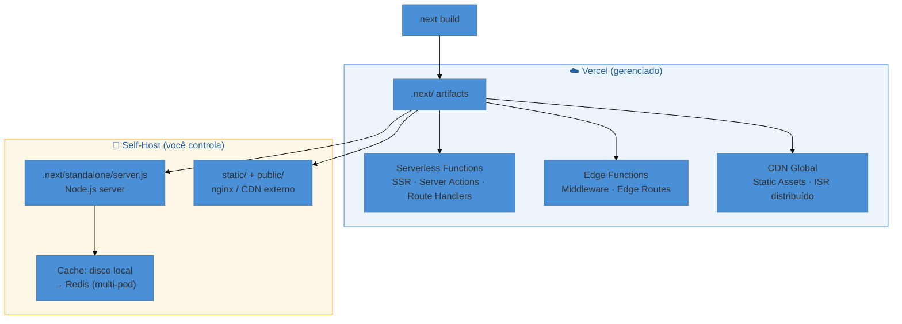

# Deploy — Vercel e self-host

> [!abstract] TL;DR
> Next.js tem dois caminhos de deploy: **Vercel** (zero-config, infraestrutura gerenciada, ISR distribuído globalmente) e **self-host** (controle total, via `output: 'standalone'` + Dockerfile ou `next start`). O modelo de cache/ISR funciona nos dois, mas em self-host exige configuração explícita para múltiplas instâncias. Variáveis `NEXT_PUBLIC_` são injetadas no bundle em **build time** — nunca use para secrets. O runtime **edge** oferece cold start próximo de zero, mas sem Node.js APIs e sem ISR.

---

Você terminou de escrever sua aplicação. Tudo funciona localmente. Agora vem a pergunta que parece simples mas tem camadas: *onde* e *como* isso vai para produção?

Next.js não é uma biblioteca que você só serve com um `npm run build && node index.js`. Ele é um framework completo com SSR, ISR, streaming, Server Actions, edge functions, cache em quatro camadas — e cada um desses recursos tem implicações diferentes dependendo de onde você hospeda. Entender esses trade-offs é o que separa um desenvolvedor que "só faz funcionar" de alguém que toma decisões de arquitetura conscientes.

---

## Dois mundos de deploy



O `next build` produz o mesmo conjunto de artefatos independentemente de onde você vai deployar. O que muda é **quem** serve esses artefatos e com quais garantias.

Existe ainda uma terceira opção — `output: 'export'` — que gera HTML estático puro (sem servidor Node.js). Ela é adequada para sites totalmente estáticos sem SSR, ISR ou Server Actions. Neste caso, qualquer CDN (S3, Nginx, GitHub Pages) pode servir a aplicação diretamente. Por ser o caso mais simples e com limitações claras, esta nota foca nos dois caminhos que cobrem a maior parte das aplicações Next.js reais: Vercel e self-host com servidor.

---

## Vercel: zero-config, infraestrutura nativa

A Vercel é a criadora do Next.js — o framework foi construído *para* a plataforma deles. Isso significa que cada feature do Next.js tem mapeamento automático para primitivas da Vercel, sem configuração extra.

**O que acontece automaticamente ao fazer push:**

| Feature do Next.js | Mapeamento na Vercel |
|-|-|
| `page.tsx` com `export const dynamic = 'force-dynamic'` | Serverless Function (Lambda) |
| Middleware (`middleware.ts`) | Edge Function (V8 Isolate global) |
| `page.tsx` com `revalidate` / ISR | Cache distribuído globalmente via CDN |
| `output: 'standalone'` | **Não necessário** — a Vercel usa os `.nft.json` traces diretamente |
| Route Handlers GET sem cache | Serverless Function |
| `next/image` | Otimização via CDN Vercel (sem `sharp` local) |

Na Vercel, cada Server Component renderizado dinamicamente (ver [[03-Dominios/Tecnologia/React/React core/23 - Server Components (RSC)|React core 23]]) torna-se uma Serverless Function — sem nenhuma configuração de infraestrutura da sua parte. O mapeamento é automático e transparente.

**Preview Deployments** são automáticos: cada PR ou branch ganha uma URL única com o mesmo ambiente de produção. Isso inclui variáveis de ambiente configuradas por ambiente no dashboard.

> [!info] ISR na Vercel
> Quando você define `export const revalidate = 60` em uma page, a Vercel cacheia a página no CDN global e propaga invalidações automaticamente. Não é necessário configurar `cacheHandler` — a infra gerencia isso. Você obtém ISR multi-região sem esforço.

O trade-off real da Vercel é **custo e lock-in**. Para apps de alto tráfego, serverless functions com billing por invocação podem sair mais caro que uma instância dedicada. E migrar para fora exige reestruturar caches e pipelines. Para a maioria dos projetos em estágio inicial ou médio, a produtividade do zero-config compensa; em escala, a aritmética muda.

---

## Self-host com `output: 'standalone'`

> [!tip] Vídeo oficial — Self-hosting aprofundado
> A equipe da Vercel gravou um walkthrough completo cobrindo standalone output, Dockerfile, configuração de cache e reverse proxy: [Self-hosting Next.js](https://www.youtube.com/watch?v=sIVL4JMqRfc) (YouTube, 45 min). Vale especialmente para a parte de produção com múltiplas instâncias.

Quando você self-hosta, o recurso principal é o `output: 'standalone'`.

```ts
// next.config.ts
import type { NextConfig } from 'next'

const nextConfig: NextConfig = {
  output: 'standalone',
}

export default nextConfig
```

### O que o standalone empacota

O `next build` usa `@vercel/nft` para rastrear estaticamente todos os `import`, `require` e chamadas `fs` de cada page. Com `output: 'standalone'`, ele cria `.next/standalone/` contendo:

- **`server.js`** — servidor Node.js mínimo (substitui `next start`)
- **`node_modules/`** — somente os pacotes *realmente usados* (pode reduzir drasticamente o tamanho)
- Cópias rastreadas de arquivos de configuração

**O que NÃO é incluído automaticamente:**
- `public/` — arquivos públicos estáticos
- `.next/static/` — JS/CSS gerados pelo build

Esses dois devem ser copiados manualmente ou servidos por CDN/nginx:

```bash
cp -r public .next/standalone/
cp -r .next/static .next/standalone/.next/
```

> [!info] sharp no Next 15
> A partir do Next 15, o `sharp` (otimizador de imagens) é instalado e usado automaticamente quando você roda `next start` ou `node server.js`. Não é mais necessário adicioná-lo manualmente como dependência.

### Dockerfile mínimo para produção

```dockerfile
FROM node:22-alpine AS base

# — Etapa: dependências —
FROM base AS deps
RUN apk add --no-cache libc6-compat
WORKDIR /app
COPY package.json package-lock.json* ./
RUN npm ci

# — Etapa: build —
FROM base AS builder
WORKDIR /app
COPY --from=deps /app/node_modules ./node_modules
COPY . .
RUN npm run build

# — Etapa: runner (imagem final, mínima) —
FROM base AS runner
WORKDIR /app

ENV NODE_ENV=production
ENV PORT=3000
ENV HOSTNAME="0.0.0.0"

RUN addgroup --system --gid 1001 nodejs && \
    adduser --system --uid 1001 nextjs

# Copia apenas o standalone + assets estáticos
COPY --from=builder /app/public ./public
COPY --from=builder --chown=nextjs:nodejs /app/.next/standalone ./
COPY --from=builder --chown=nextjs:nodejs /app/.next/static ./.next/static

USER nextjs
EXPOSE 3000

CMD ["node", "server.js"]
```

A imagem final contém apenas o `standalone/` — sem `node_modules` desnecessários, sem código-fonte. Builds multi-stage mantêm a imagem de produção pequena.

Para rodar localmente para testar o build de produção:

```bash
next build
node .next/standalone/server.js
# ou com porta customizada:
PORT=8080 HOSTNAME=0.0.0.0 node .next/standalone/server.js
```

---

## Variáveis de ambiente

Este é o tema com mais pegadinhas no deploy. Existem dois tipos, e eles têm comportamentos radicalmente diferentes.

### `NEXT_PUBLIC_*` — injetadas no bundle (build time)

```ts
// app/components/analytics.tsx
export function Analytics() {
  // Esse valor é substituído estaticamente durante next build
  const key = process.env.NEXT_PUBLIC_ANALYTICS_KEY
  return <script data-key={key} />
}
```

Durante `next build`, o Next.js faz substituição literal de `process.env.NEXT_PUBLIC_*` no bundle JavaScript enviado ao browser. Isso significa:

- **Disponível no cliente** (browser) ✓
- **Frozen no momento do build** — mudar a variável não tem efeito sem rebuild
- **Visível no bundle** — qualquer um pode inspecionar o JS gerado

> [!warning] NEXT_PUBLIC_ é para dados PÚBLICOS, não secrets
> **O que acontece:** A variável fica literalmente no código JS enviado ao browser — qualquer usuário pode ver seu valor no DevTools.
> **Por quê:** O prefixo `NEXT_PUBLIC_` é exatamente um aviso: "este dado vai para o bundle público".
> **Como evitar:** Tokens de API, senhas e chaves privadas nunca devem ter o prefixo `NEXT_PUBLIC_`. Use variáveis sem prefixo (lidas apenas no servidor) ou crie um Route Handler que forneça dados ao cliente quando necessário.

### Variáveis sem prefixo — lidas em runtime no servidor

```ts
// app/page.tsx — Server Component
import { connection } from 'next/server'

export default async function Page() {
  await connection() // força rendering dinâmico
  // Lida em runtime, nunca enviada ao browser
  const dbUrl = process.env.DATABASE_URL
  // ...
}
```

Variáveis sem `NEXT_PUBLIC_` ficam somente no Node.js server. Em um Server Component com rendering dinâmico (ou Route Handler), elas são lidas na hora da request — o que permite usar **uma única imagem Docker** promovida entre staging e produção com variáveis diferentes via `docker run -e`.

```bash
# Mesma imagem, ambientes diferentes
docker run -e DATABASE_URL=postgres://prod-db/app -e SECRET_KEY=xyz myapp:latest
docker run -e DATABASE_URL=postgres://staging-db/app -e SECRET_KEY=abc myapp:latest
```

---

## Edge vs Node runtime

Routes individuais podem declarar em qual runtime rodam:

```ts
// app/api/fast/route.ts
export const runtime = 'edge' // ou 'nodejs' (default)
```

O trade-off é significativo:

| Dimensão | Node.js (padrão) | Edge (V8 Isolate) |
|-|-|-|
| **Cold start** | ~100–500ms (Lambda) | ~0ms (V8 Isolate) |
| **APIs disponíveis** | Node.js completo (`fs`, `crypto`, etc.) | Apenas Web APIs (fetch, crypto Web, etc.) |
| **Pacotes npm** | Qualquer pacote | Apenas pacotes Edge-compatible |
| **Bundle limit** | Sem limite prático | ~4 MB |
| **ISR** | ✅ Suportado | ❌ Não suportado |
| **Latência** | Regional (Lambda) | Global (<50ms) |
| **Casos de uso** | SSR completo, DB, processar arquivos | Auth rápido, geo-routing, A/B testing |

> [!info] Middleware usa Edge por padrão
> O `middleware.ts` (ver [[03-Dominios/Tecnologia/React/Next.js/13 - Middleware e auth na borda|nota 13]]) roda no Edge runtime por design — é executado antes de qualquer request, e o cold start próximo de zero é essencial. A partir do Next 15.2, existe suporte experimental para rodar o Middleware em Node.js quando necessário (`experimental.nodeMiddleware: true`).

A regra prática: **use Edge somente quando latência global for o requisito primário** (e você aceitar as limitações de APIs). Para SSR com banco de dados, processamento de arquivos ou qualquer dependência nativa, fique no Node.js.

---

## Cache e ISR em self-host

O modelo de cache do Next 15 (detalhado na [[03-Dominios/Tecnologia/React/Next.js/07 - O modelo de caching do Next 15|nota 07]]) funciona em self-host, mas com diferenças importantes.

### Uma instância: funciona out-of-the-box

Por padrão, o cache é armazenado em memória (máximo 50 MB) e em disco no servidor. Para um único pod com disco persistente, ISR funciona sem nenhuma configuração adicional.

```ts
// app/blog/[slug]/page.tsx
export const revalidate = 3600 // regenera no máximo 1x por hora

export async function generateStaticParams() {
  const posts = await fetch('https://api.example.com/posts').then(r => r.json())
  return posts.map((p: { slug: string }) => ({ slug: p.slug }))
}
```

Uma dica de debug: para verificar o comportamento ISR em produção antes de deployar, rode `next build && next start` localmente. O Next.js em modo produção aplica o mesmo algoritmo de cache que seria usado no servidor real. Para logging detalhado, adicione `NEXT_PRIVATE_DEBUG_CACHE=1` no `.env`.

Você pode observar o comportamento via header `x-nextjs-cache`:
- `HIT` — servido do cache
- `STALE` — servido do cache, regenerando em background (stale-while-revalidate)
- `MISS` — não estava no cache, renderizou fresh
- `REVALIDATED` — regenerado via on-demand revalidation

### Múltiplas instâncias: problema de inconsistência

Quando você tem 3 pods atrás de um load balancer, cada pod tem seu próprio cache em disco. `revalidateTag('posts')` executado no Pod 1 **não invalida** os Pods 2 e 3 — eles continuam servindo conteúdo stale.

> [!warning] ISR em self-host multi-pod sem storage compartilhado
> **O que acontece:** Usuários recebem versões diferentes do mesmo conteúdo dependendo de qual pod serve a request.
> **Por quê:** O cache padrão é local ao filesystem de cada instância — não há coordenação entre pods.
> **Como evitar:** Configure um `cacheHandler` externo (Redis, S3, etc.) e desative o cache em memória:
>
> ```js
> // next.config.js
> module.exports = {
>   cacheHandler: require.resolve('./cache-handler.js'),
>   cacheMaxMemorySize: 0, // desativa in-memory
> }
> ```
>
> O `cache-handler.js` deve implementar `get`, `set` e `revalidateTag` conectados a Redis ou armazenamento compartilhado. Veja o [exemplo oficial no GitHub](https://github.com/vercel/next.js/tree/canary/examples/cache-handler-redis).

### Multi-pod: mais configurações necessárias

Em clusters Kubernetes ou multi-instância, considere também:

```bash
# Chave de criptografia consistente para Server Actions entre pods
NEXT_SERVER_ACTIONS_ENCRYPTION_KEY=<base64-32-bytes>
```

Sem isso, uma Server Action criptografada pelo Pod 1 não pode ser decifrada pelo Pod 2 — o usuário recebe "Failed to find Server Action".

```js
// next.config.js — ID de build para version skew protection
module.exports = {
  generateBuildId: async () => process.env.GIT_HASH,
  deploymentId: process.env.DEPLOYMENT_VERSION,
}
```

---

## CDN e assets estáticos

Independentemente de usar Vercel ou self-host, o Next.js gerencia os `Cache-Control` headers automaticamente — você não precisa configurar TTLs na mão. O que muda é *quem* respeita esses headers: na Vercel é a própria CDN global; no self-host é o nginx, Cloudflare ou outro CDN que você colocar na frente.

O Next.js serve assets com headers corretos por padrão:

- **Arquivos com hash** (JS/CSS do build): `Cache-Control: public, max-age=31536000, immutable` — cache de 1 ano, imutável
- **Páginas ISR**: `Cache-Control: s-maxage=<revalidate>, stale-while-revalidate`
- **Páginas dinâmicas**: `Cache-Control: private, no-cache, no-store`

Para apontar assets para um CDN externo:

```ts
// next.config.ts
const nextConfig: NextConfig = {
  assetPrefix: process.env.NODE_ENV === 'production'
    ? 'https://cdn.meusite.com'
    : undefined,
}
```

Com `assetPrefix`, todos os imports de JS/CSS gerados usarão o domínio do CDN. O servidor Next.js ainda precisa servir as requests de página; o CDN fica com a carga de assets.

> [!warning] nginx e streaming não combinam por padrão
> **O que acontece:** Streaming SSR e PPR param de funcionar — o nginx bufferiza a resposta inteira antes de enviar.
> **Por quê:** Por padrão o nginx faz buffering de proxy.
> **Como evitar:** Adicione o header `X-Accel-Buffering: no` via `next.config.ts` ou configure `proxy_buffering off` no nginx.

---

## Casos práticos

### Cenário 1: Deploy na Vercel com ISR — blog de conteúdo

Uma equipe de conteúdo atualiza posts frequentemente. O blog tem 500 posts, e rebuilds completos levam 8 minutos.

**Solução com Vercel + ISR:**

```ts
// app/blog/[slug]/page.tsx
export const revalidate = 300 // 5 minutos

export async function generateStaticParams() {
  // Gera os 50 posts mais recentes no build
  const posts = await fetch('https://cms.example.com/api/posts?limit=50').then(r => r.json())
  return posts.map((p: { slug: string }) => ({ slug: p.slug }))
}

export default async function BlogPost({ params }: { params: Promise<{ slug: string }> }) {
  const { slug } = await params
  const post = await fetch(`https://cms.example.com/api/posts/${slug}`, {
    next: { tags: [`post-${slug}`] },
  }).then(r => r.json())
  return <article>{/* ... */}</article>
}
```

```ts
// app/actions.ts — chamada pelo webhook do CMS
'use server'
import { revalidateTag } from 'next/cache'

export async function onPostUpdated(slug: string) {
  revalidateTag(`post-${slug}`) // invalida só o post alterado
}
```

Na Vercel, a invalidação propaga para todos os nós CDN automaticamente. O leitor recebe a versão atualizada na próxima request após o webhook.

---

### Cenário 2: Dockerfile standalone para Kubernetes

Uma empresa quer rodar em seu próprio cluster k8s com 5 réplicas e usa Redis para cache compartilhado.

**1. `next.config.ts`:**

```ts
const nextConfig: NextConfig = {
  output: 'standalone',
  cacheHandler: process.env.NODE_ENV === 'production'
    ? require.resolve('./src/lib/redis-cache-handler.js')
    : undefined,
  cacheMaxMemorySize: process.env.NODE_ENV === 'production' ? 0 : undefined,
}
```

**2. Dockerfile** (conforme a seção acima — imagem final ~120 MB com Alpine).

**3. Deployment Kubernetes (fragmento):**

```yaml
# deployment.yaml
env:
  - name: DATABASE_URL
    valueFrom:
      secretKeyRef:
        name: app-secrets
        key: database-url
  - name: REDIS_URL
    valueFrom:
      secretKeyRef:
        name: app-secrets
        key: redis-url
  - name: NEXT_SERVER_ACTIONS_ENCRYPTION_KEY
    valueFrom:
      secretKeyRef:
        name: app-secrets
        key: actions-key
  - name: GIT_HASH
    value: "$(GIT_HASH)"  # injetado pelo CI/CD
```

Com o `cacheHandler` apontando para Redis e a chave de criptografia compartilhada, todos os pods servem ISR consistente e Server Actions funcionam cross-pod.

---

## Armadilhas comuns

> [!warning] Vazar secrets com `NEXT_PUBLIC_`
> **O que acontece:** `NEXT_PUBLIC_API_KEY=sk-prod-xxx` fica literalmente no bundle JS — qualquer usuário inspeciona o código no DevTools e vê a chave.
> **Por quê:** O prefixo sinaliza ao Next.js que a variável deve ser embutida no bundle do browser.
> **Como evitar:** Variáveis sensíveis nunca recebem `NEXT_PUBLIC_`. Se o cliente precisa de um token, crie um Route Handler que gera tokens de curta duração via Server Action ou API endpoint autenticado.

> [!warning] ISR em self-host retorna conteúdo stale diferente por pod
> **O que acontece:** `/blog/post-123` retorna versão A no Pod 1 e versão B no Pod 2 após `revalidatePath('/blog/post-123')` ser chamado no Pod 1.
> **Por quê:** A invalidação é local ao pod que a executa. O cache em disco não é compartilhado.
> **Como evitar:** Em produção com múltiplos pods, use um `cacheHandler` baseado em Redis com `cacheMaxMemorySize: 0`. Implemente `refreshTags()` no handler para sincronizar estado entre instâncias antes de cada request.

> [!warning] Edge runtime sem ISR — pega quem migra do Pages Router
> **O que acontece:** Você define `export const runtime = 'edge'` e `export const revalidate = 60` na mesma page. O ISR é silenciosamente ignorado e a rota vira dinâmica.
> **Por quê:** ISR requer o Node.js runtime para escrever no cache de disco. O Edge runtime não tem acesso a filesystem.
> **Como evitar:** ISR e Edge runtime são mutuamente exclusivos. Para Edge, use cache manual via `fetch` com headers de CDN ou via `'use cache'` (Next 16+).

---

## Como explicar em inglês

*"Next.js supports two main deployment paths. On Vercel, everything is zero-config: ISR pages are distributed across a global CDN, Server Components and Route Handlers run as serverless functions, and Middleware runs on the Edge. When self-hosting, you use `output: 'standalone'` to generate a minimal server bundle that includes only the traced dependencies — think of it as tree-shaking for your whole deployment. The tricky part is ISR on self-hosted multi-instance setups: each pod has its own local cache, so you need a shared cache handler backed by Redis to keep all replicas in sync after invalidation."*

| PT | EN |
|-|-|
| imagem Docker de produção | production Docker image |
| saída standalone | standalone output |
| cache compartilhado | shared cache handler |
| variável de ambiente de build | build-time environment variable |
| variável de runtime | runtime environment variable |
| cold start | cold start |
| funções serverless | serverless functions |
| borda / edge | edge |
| isolado V8 | V8 Isolate |
| ISR multi-região | globally distributed ISR |
| invalidação por tag | tag-based revalidation |
| deploy de preview | preview deployment |

---

## O que vem a seguir

Deploy é a dimensão operacional do Next.js — mas a próxima note fecha o galho com a dimensão estratégica: escolher entre Server e Client Components, entre estratégias de render, entre caches. O capstone é o lugar onde todas as decisões se tornam trade-offs explícitos.

- [[03-Dominios/Tecnologia/React/Next.js/16 - Capstone - arquitetura, decisões e entrevista|Nota 16 — Capstone]] — decision tree, anti-patterns e perguntas de entrevista

---

**Deploy em uma frase:** Self-host com `output: 'standalone'` dá controle total; Vercel dá ISR global e zero-config — o preço em cada caso é diferente.

> [!question]- Por que o standalone não copia `public/` e `.next/static/` automaticamente?
> Porque esses diretórios deveriam idealmente ser servidos por um CDN — não pelo servidor Node.js. O design do standalone assume que você vai separar assets estáticos (Nginx, S3, CloudFront) da camada de SSR. Copiar manualmente é para quem quer um único container que serve tudo, aceitando que o Node.js fique encarregado de assets.

---

## Referências

- **Vercel / Next.js Team** — [*Deploying — Getting Started*](https://nextjs.org/docs/app/getting-started/deploying) — visão geral de opções de deploy (Node.js, Docker, static export, adapters)
- **Vercel / Next.js Team** — [*Self-Hosting Guide*](https://nextjs.org/docs/app/guides/self-hosting) — standalone, caching, multi-instance, streaming, env vars
- **Vercel / Next.js Team** — [*output: standalone*](https://nextjs.org/docs/app/api-reference/config/next-config-js/output) — o que é rastreado, o que não é copiado automaticamente, monorepo
- **Vercel / Next.js Team** — [*Incremental Static Regeneration*](https://nextjs.org/docs/app/guides/incremental-static-regeneration) — ISR no App Router, revalidação time-based e on-demand, caveats multi-instância
- **Vercel** — [*Next.js on Vercel*](https://vercel.com/docs/frameworks/full-stack/nextjs) — mapeamento automático de features, ISR distribuído, preview deployments
