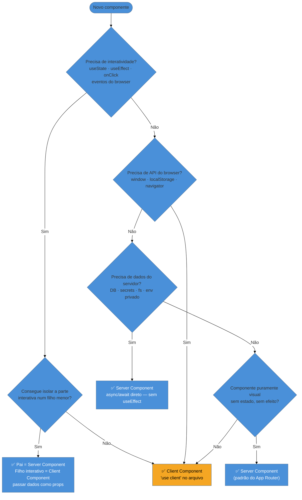
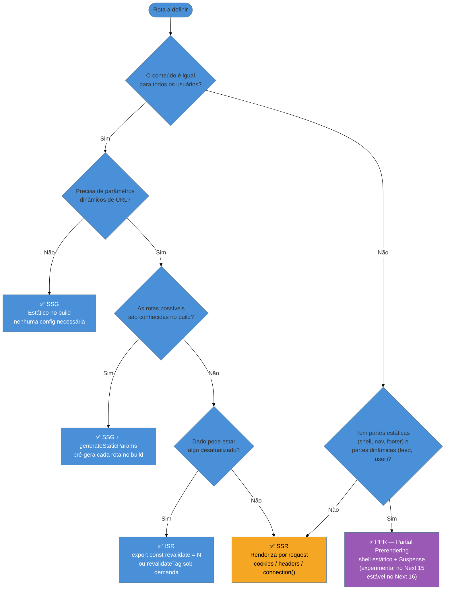
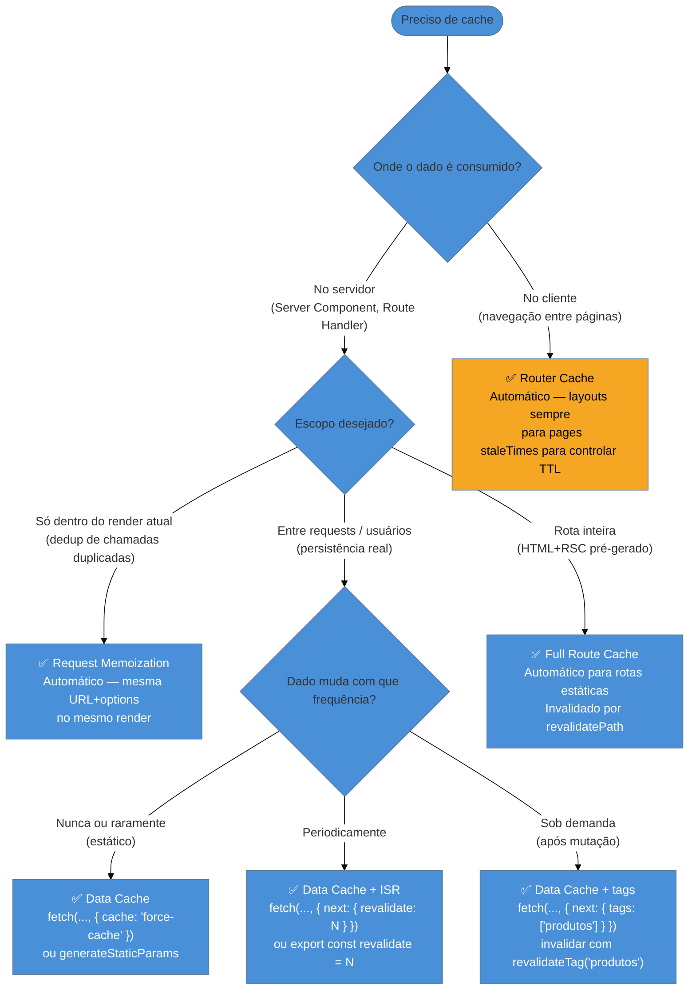

# Capstone — arquitetura, decisões e entrevista

> [!abstract] TL;DR
> Este capstone fecha o galho **Next.js (App Router)** com quatro eixos práticos: decision trees para as decisões recorrentes de arquitetura (Server vs Client, estratégia de rendering, cache, Route Handler vs Server Action); um catálogo de anti-patterns reais do App Router com diagnóstico e correção; um mapa mental do Pages Router legado para quem vai encontrar código antigo; perguntas de entrevista com respostas-modelo prontas; e um mapa de revisão das 15 notas do galho. O objetivo não é apresentar API nova — é integrar e conectar o que você já aprendeu para tomar decisões corretas sob pressão.

---

## O ponto de chegada

Você leu quinze notas sobre Next.js. Aprendeu sobre boundaries de componente, quatro camadas de cache, cinco estratégias de rendering, Server Actions, Route Handlers, Middleware, otimizações de imagem e font, streaming com Suspense, e deploy em Vercel e self-host. Agora vem a pergunta real: **quando você senta diante de um problema novo, qual escolha fazer?**

Decisões de arquitetura no App Router não são óbvias. O `'use client'` parece inofensivo — você adiciona para usar um hook e não pensa mais nisso. O `fetch` sem opção de cache parece razoável — afinal, você quer dados frescos. O Middleware parece o lugar perfeito para travar uma rota protegida. Cada uma dessas escolhas tem uma armadilha não-óbvia que só aparece em revisão de código ou em produção.

Este capstone organiza as decisões recorrentes em árvores visuais e traduz os erros mais comuns em padrões reconhecíveis. É o material que você revisa antes de uma entrevista técnica ou antes de iniciar um novo projeto.

---

## Decision Trees

### 1 — Server Component ou Client Component?

A primeira decisão que você toma ao criar qualquer componente no App Router. Errar aqui infla o bundle do cliente ou quebra a renderização.



**Regra de ouro:** comece como Server Component (é o padrão). Só adicione `'use client'` quando a necessidade for inequívoca — interatividade, estado local, API do browser. O boundary é de módulo, não de componente; tudo que o arquivo importa entra no bundle.

---

### 2 — Qual estratégia de rendering usar?

A decisão de quando pré-gerar, quando renderizar por request, ou quando usar a abordagem híbrida do PPR.



**Regra de ouro:** o App Router assume estático por padrão. Qualquer uso de `cookies()`, `headers()`, `searchParams` ou `connection()` torna a rota dinâmica automaticamente. Não declare `dynamic = 'force-dynamic'` sem razão — você descarta cache para toda a rota.

---

### 3 — Qual cache usar e como invalidar?

O modelo de quatro camadas do Next 15 tem comportamento diferente do 14. Cada camada responde a um problema diferente.



> [!warning] Next 15: cache é opt-in, não opt-out
> No **Next 14**, `fetch` usava `force-cache` por padrão — você precisava pedir `no-store` para dados dinâmicos. No **Next 15**, o padrão virou `no-store` — você precisa pedir `force-cache` ou `revalidate` para cachear. Se você migrou de 14 para 15 e seu app ficou mais lento, provavelmente é porque perdeu o cache implícito. Reveja todos os `fetch` críticos e adicione opções de cache explicitamente.

---

### 4 — Route Handler ou Server Action?

A decisão mais confundida no App Router. Ambos executam no servidor, mas têm propósitos distintos.

```mermaid
%%{init: {"theme": "base", "themeVariables": {"primaryColor": "#4A90D9", "edgeLabelBackground": "#ffffff"}}}%%
flowchart TD
    Start([Preciso de lógica no servidor]) --> Q1{Quem vai chamar?}
    Q1 -- "Outro serviço / app externo\n(webhook, mobile, parceiro)" --> RH["✅ Route Handler\nroute.ts — endpoint HTTP real\nURL pública e versionável"]
    Q1 -- "Só o próprio app Next.js" --> Q2{É uma mutação\nou busca de dado?}
    Q2 -- "Mutação\n(criar, editar, deletar)" --> Q3{A mutação está\nligada a um formulário ou\nação do usuário na UI?}
    Q3 -- Sim --> SA["✅ Server Action\n'use server'\n<form action={fn}> ou onClick\nrevalida cache automaticamente"]
    Q3 -- Não --> Q4{Precisa de URL\npara o cliente chamar?}
    Q4 -- Sim --> RH
    Q4 -- Não --> SA
    Q2 -- "Busca de dado\n(GET)" --> Q5{Dado precisa\nser público / versionável?}
    Q5 -- Sim --> RH
    Q5 -- Não --> SC["✅ Server Component\nfetch direto no componente\n— sem camada de API"]

    style RH fill:#F5A623,color:#000
    style SA fill:#4A90D9,color:#fff
    style SC fill:#4A90D9,color:#fff
```



**Regra de ouro:** Server Action para mutações da própria UI; Route Handler para APIs públicas e integrações externas. Para buscar dados que só a sua UI consome, nem precisa de nenhum dos dois — faça o `fetch` direto no Server Component.

---

## Anti-patterns do App Router

### Anti-pattern 1: `'use client'` no topo da árvore

> [!warning] Envenenar a árvore inteira com `'use client'`
> **O que acontece:** você precisa de um hook em um componente de layout (ex: `usePathname` para destacar o link ativo) e adiciona `'use client'` no próprio `layout.tsx`. Agora toda a sub-árvore daquele layout — incluindo todos os `page.tsx` filhos — entrou no bundle do cliente.
>
> **Por quê:** `'use client'` cria uma fronteira de módulo. Todos os imports do arquivo são puxados para o bundle. Não é "este componente é client", é "este módulo e tudo que ele importa são client".
>
> **Como evitar:** extraia o mínimo interativo para um componente filho pequeno. O `layout.tsx` continua Server Component; só o `<NavHighlight>` ou `<ActiveLink>` vira Client Component. Passe os dados como props do servidor para o cliente.

---

### Anti-pattern 2: `fetch` em waterfall no servidor

> [!warning] Waterfalls sequenciais em Server Components
> **O que acontece:** você tem três buscas de dado numa página — usuário, posts do usuário, notificações. Você escreve `await getUser()`, depois `await getPosts()`, depois `await getNotifications()`. A página espera cada uma terminar antes de começar a próxima. Tempo total = soma dos três tempos.
>
> **Por quê:** `await` serializa. Em JavaScript, um `await` pausa a execução até a promise resolver — mesmo que as três operações sejam independentes.
>
> **Como evitar:** paralelize com `Promise.all` ou `Promise.allSettled` quando as buscas são independentes. Se alguma depende de outra, paralelize o que puder e encadeie só o necessário:
> ```tsx
> // ✅ Paralelo — reduz latência para max(t1, t2, t3)
> const [user, posts, notifications] = await Promise.all([
>   getUser(userId),
>   getPosts(userId),
>   getNotifications(userId),
> ])
> ```

---

### Anti-pattern 3: segredo em variável `NEXT_PUBLIC_`

> [!warning] `NEXT_PUBLIC_` não é para segredos — nunca
> **O que acontece:** você tem uma API key de terceiro e coloca em `NEXT_PUBLIC_MY_API_KEY` para "poder usar no cliente também". A key vai para o bundle, fica visível no DevTools de qualquer usuário, e eventualmente vaza.
>
> **Por quê:** o prefixo `NEXT_PUBLIC_` instrui o bundler a inlinar o valor no código JavaScript do cliente em build time. Todo usuário que inspecionar o bundle verá a key em texto plano.
>
> **Como evitar:** variáveis sem `NEXT_PUBLIC_` ficam disponíveis apenas no servidor (Server Components, Server Actions, Route Handlers, Middleware). Toda chamada a API externa que usa credenciais deve acontecer nesses contextos — nunca no cliente. Se o cliente precisa de um dado que requer credenciais, crie um Route Handler ou Server Action que faz a chamada e retorna só o necessário.

---

### Anti-pattern 4: Middleware como única barreira de autenticação

> [!warning] Middleware protege rotas, mas não substitui autorização no servidor
> **O que acontece:** você bloqueia `/dashboard/*` no Middleware verificando um cookie de sessão. Parece seguro. Mas o Middleware roda na Edge e tem acesso limitado — às vezes não consegue verificar o token criptografado completo, ou um atacante descobre um path não coberto pelo matcher. Dado sensível é retornado porque o Server Component não checou quem está pedindo.
>
> **Por quê:** o Middleware é a primeira linha de defesa na borda — rápido e eficiente para redirects e rewrites. Mas ele não tem contexto completo da sessão do usuário. Uma camada de UI bloqueada não protege os dados por trás dela se o endpoint não checou autorização.
>
> **Como evitar:** use o Middleware para UX (redirect para login, roteamento de tenant), mas **sempre verifique autenticação e autorização dentro do Server Component, Server Action ou Route Handler** que acessa dados sensíveis. Defense in depth: middleware + verificação no servidor.

---

### Anti-pattern 5: abusar de `dynamic = 'force-dynamic'`

> [!warning] `force-dynamic` em tudo descarta os benefícios do App Router
> **O que acontece:** você tem uma rota estática mas quer garantir "dados frescos". Adiciona `export const dynamic = 'force-dynamic'` para forçar SSR. Agora cada request re-renderiza a página no servidor — zero cache, latência máxima, custo de compute desnecessário.
>
> **Por quê:** `force-dynamic` desativa o Full Route Cache e força renderização a cada request, mesmo que os dados raramente mudem.
>
> **Como evitar:** entenda o que torna a rota dinâmica naturalmente (`cookies()`, `headers()`, `searchParams`). Se a rota é estática mas os dados precisam de atualização, use ISR (`export const revalidate = N`) ou revalidação sob demanda via `revalidateTag`. Reserve `force-dynamic` para rotas que genuinamente dependem de dados exclusivos por request.

---

### Anti-pattern 6: Client Component buscando dado que deveria vir do servidor

> [!warning] `useEffect + fetch` em Client Component para dados que o servidor já tem
> **O que acontece:** você cria um Client Component com `useEffect(() => { fetch('/api/produtos').then(...) }, [])`. A página carrega, mostra loading spinner, espera a hydration, dispara o fetch, espera a resposta, re-renderiza. Três round trips onde poderia ter sido um.
>
> **Por quê:** é o padrão SPA aplicado ao App Router. Faz sentido em SPA puro, mas no App Router você tem Server Components — o servidor pode buscar o dado antes de montar o HTML, sem waterfall.
>
> **Como evitar:** se o dado não depende de interação do usuário (não é ativado por um clique, não depende de estado local), busque-o em um Server Component e passe como prop para o Client Component. Reserve `useEffect + fetch` para dados que genuinamente precisam ser buscados após interação do usuário no cliente.

---

## Padrões de composição recorrentes

Três padrões que aparecem em quase todo projeto App Router sério. Não são APIs — são formas de estruturar o código que emergem quando você aplica os princípios do galho de forma consistente.

### Padrão 1: Server Component como orquestrador de dados

O Server Component de uma rota busca todos os dados necessários em paralelo e distribui para os filhos via props. Os filhos — Server ou Client Components — recebem dados prontos; não buscam por conta própria.

```tsx
// app/dashboard/page.tsx (Server Component)
export default async function DashboardPage() {
  // Paralelo: aguarda os três simultaneamente
  const [user, metrics, notifications] = await Promise.all([
    getUser(),
    getMetrics(),
    getNotifications(),
  ])

  return (
    <main>
      <UserHeader user={user} />           {/* Server Component */}
      <MetricsGrid metrics={metrics} />    {/* Server Component */}
      <NotificationBell                    {/* Client Component */}
        initialCount={notifications.length}
      />
    </main>
  )
}
```

O Client Component `<NotificationBell>` parte com o estado inicial do servidor — sem spinner no carregamento inicial, sem round trip extra.

### Padrão 2: "Slot" para manter Server Component dentro de Client Component

Quando você precisa que um Client Component contenha partes renderizadas no servidor, passe-as como `children` — nunca importe Server Components dentro de Client Components.

```tsx
// ✅ Client Component aceita children do servidor
'use client'
export function AnimatedWrapper({ children }: { children: React.ReactNode }) {
  const [visible, setVisible] = useState(true)
  return <div style={{ opacity: visible ? 1 : 0 }}>{children}</div>
}

// app/page.tsx (Server Component orquestra)
import { AnimatedWrapper } from './AnimatedWrapper'
import { HeavyServerContent } from './HeavyServerContent' // Server Component

export default function Page() {
  return (
    <AnimatedWrapper>
      <HeavyServerContent /> {/* continua sendo Server Component */}
    </AnimatedWrapper>
  )
}
```

### Padrão 3: Server Action com otimistic update no cliente

O Server Action muta o dado no servidor e revalida o cache. O Client Component usa `useOptimistic` (React 19) para atualizar a UI imediatamente antes da confirmação do servidor.

```tsx
'use client'
import { useOptimistic } from 'react'
import { toggleLike } from '@/actions/likes'

export function LikeButton({ postId, initialCount }: LikeButtonProps) {
  const [optimisticCount, addOptimistic] = useOptimistic(
    initialCount,
    (state, delta: number) => state + delta
  )

  async function handleLike() {
    addOptimistic(1)        // UI atualiza imediatamente
    await toggleLike(postId) // Server Action muta e revalida
  }

  return <button onClick={handleLike}>❤️ {optimisticCount}</button>
}
```

A Server Action `toggleLike` valida autorização, persiste no banco e chama `revalidateTag('likes')`. O Router Cache atualiza; o `useOptimistic` garante que a UI nunca "pisca" de volta para o estado anterior.

---

## Casos práticos

Dois cenários que integram os conceitos do galho inteiro. Não introduzem API nova — mostram como as peças se encaixam em decisões reais de arquitetura.

### Cenário 1: página de produto em e-commerce (SSG + ISR + Server Action)

Um e-commerce com 50 mil SKUs precisa de páginas de produto rápidas, atualizáveis sem redeploy, e com formulário de "adicionar ao carrinho" que funcione mesmo com JavaScript desabilitado.

**Decisões tomadas e por quê:**

1. **Rendering:** SSG com `generateStaticParams` para os 1.000 produtos mais vendidos; ISR com `revalidate = 3600` para o restante. O preço e estoque mudam com menos frequência do que a percepção de "dado em tempo real" sugere — uma hora de stale é aceitável.

2. **Componentes:** `ProductPage` (Server Component) busca produto, variantes e avaliações em paralelo com `Promise.all`. O `<AddToCartButton>` vira Client Component isolado — só ele precisa de `useState` para loading/feedback. O restante da página não entra no bundle.

3. **Mutação:** `addToCart` é uma Server Action. O `<form>` usa `action={addToCart}` — funciona sem JS, e quando JS está disponível, `useActionState` habilita feedback de loading. Após sucesso, `revalidatePath('/carrinho')` atualiza o badge do carrinho no header.

4. **Cache:** avaliações do produto usam `fetch(..., { next: { tags: ['reviews', `product-${id}`] } })`. Quando um novo review é aprovado pelo moderador, `revalidateTag(`product-${id}`)` invalida só aquele produto.

5. **Anti-patterns evitados:** `'use client'` no `layout.tsx` (movemos o hook de carrinho para um Client Component filho); `NEXT_PUBLIC_STRIPE_KEY` (as chamadas ao Stripe acontecem em Route Handlers e Server Actions); `force-dynamic` na página de produto (usamos ISR em vez de SSR desnecessário).

---

### Cenário 2: dashboard SaaS com dados por usuário (SSR + auth + Middleware)

Um SaaS B2B serve dashboards analíticos personalizados por empresa. Os dados são exclusivos por tenant e mudam em tempo real — SSG ou ISR não servem.

**Decisões tomadas e por quê:**

1. **Rendering:** SSR obrigatório — o dashboard lê `cookies()` para identificar o tenant, o que torna a rota dinamicamente renderizada automaticamente. Sem `force-dynamic` explícito; o Next detecta e decide.

2. **Auth em duas camadas:** Middleware verifica se o cookie de sessão existe e redireciona para `/login` se ausente — latência mínima na borda. Dentro do `DashboardLayout` (Server Component), `getSession()` re-verifica o token completo com a lib de auth e lê permissões do banco. Um atacante que bypass o Middleware ainda encontra a verificação no servidor.

3. **Componentes:** o layout busca o `tenant` e as `permissões` e passa como props para componentes filhos. Os widgets de gráfico são Client Components (usam uma lib de charting que requer DOM), mas recebem os dados como props serializadas — sem `useEffect + fetch` no cliente.

4. **Streaming:** o `DashboardLayout` mostra o shell (sidebar, header com nome do usuário) imediatamente. Os widgets pesados — relatórios de vendas, funil de conversão — ficam em `<Suspense>` com `loading.tsx` individual, e são enviados via streaming conforme ficam prontos.

5. **Anti-patterns evitados:** Middleware como única barreira (temos verificação dupla); Client Components buscando dados com `useEffect` (os dados vêm do servidor como props); `NEXT_PUBLIC_DB_URL` no `.env` (inexistente — toda conexão ao banco é server-only).

---

## Legado Pages Router: mapa mental para código antigo

> [!info] Você vai encontrar isto em codebases existentes
> O Pages Router ainda roda em produção em milhares de projetos. Esta seção não re-explica como ele funciona (isso está na [[03-Dominios/Tecnologia/React/Next.js/02 - App Router vs Pages Router|nota 02]]) — é o mapa mental para quando você abre uma codebase legada e precisa navegar rapidamente.
>
> | Pages Router (legado) | App Router (atual) | O que muda na prática |
> |----------------------|-------------------|----------------------|
> | `pages/` | `app/` | Pasta raiz diferente; podem coexistir |
> | `pages/_app.tsx` | `app/layout.tsx` | Layout raiz; App Router suporta layouts aninhados |
> | `pages/_document.tsx` | Não existe | HTML shell via `layout.tsx` + Metadata API |
> | `getStaticProps` | Server Component + `generateStaticParams` | async/await direto; sem export de função especial |
> | `getServerSideProps` | Server Component com `cookies()` / `headers()` | Qualquer API dinâmica torna a rota SSR |
> | `getStaticPaths` | `generateStaticParams` | Mesmo propósito; nova sintaxe, retorno `{ params }[]` |
> | `pages/api/*.ts` | `app/api/*/route.ts` | Route Handlers; suporte a Web API nativa |
> | `useRouter` (pages) | `useRouter` + `usePathname` + `useSearchParams` | Splitado em hooks menores; só em Client Components |
> | `router.push()` | `router.push()` + `redirect()` | `redirect()` funciona em Server Components |
> | Props via `getServerSideProps` | Props passadas como partes do componente | Sem "prop drilling" de servidor — componentes leem direto |
>
> **Coexistência:** se um projeto tem `pages/` e `app/`, os dois roteadores funcionam em paralelo. Um arquivo em `pages/` não pode usar Server Components, e um arquivo em `app/` não pode usar `getServerSideProps`. Migração incremental é possível, mas planejada: comece pelos novos recursos em `app/` e migre páginas antigas à medida que tocam nelas.

---

## Perguntas de entrevista

### Q1: Qual é a diferença fundamental entre Server Component e Client Component no App Router?

**Resposta-modelo:** No App Router, todo componente é Server Component por padrão — executa no servidor, pode fazer `async/await`, acessar banco e segredos, e não envia JavaScript para o cliente. Um Client Component é criado com `'use client'` no topo do arquivo — isso cria uma fronteira de módulo que inclui o arquivo e todos os seus imports no bundle do cliente. A distinção não é "onde renderiza" (ambos geram HTML), é "onde o JavaScript executa": o Server Component não tem JS no cliente; o Client Component é hidratado e pode usar hooks, eventos e APIs do browser.

**Como explicar em inglês:**
> "In the App Router, all components are Server Components by default — they run on the server, have access to databases and secrets, and ship zero JavaScript to the client. You create a Client Component by adding `'use client'` at the top of the file, which turns that module into a client bundle entry point. The key insight is that `'use client'` marks a module boundary, not just a single component — everything that file imports also gets bundled for the client."

---

### Q2: Como o Next 15 mudou o comportamento de caching em relação ao Next 14?

**Resposta-modelo:** No Next 14, o padrão era "cache tudo": `fetch` usava `force-cache` implicitamente, Route Handlers GET eram cacheados automaticamente, e o Router Cache mantinha segmentos de página entre navegações. No Next 15, o padrão virou "não cache nada": `fetch` usa `no-store` por padrão, GET em Route Handlers não é mais cacheado automaticamente, e o Router Cache de páginas também foi desabilitado por padrão (layouts ainda são cacheados). Para cachear, você opta explicitamente com `force-cache`, `next: { revalidate }` ou `next: { tags }`.

**Como explicar em inglês:**
> "Next 14 was 'cache everything by default' — fetch was implicitly `force-cache`, GET route handlers were cached, the Router Cache persisted pages automatically. Next 15 flipped this to 'uncached by default': fetch is `no-store`, GET route handlers are not cached, and page segments in the Router Cache are no longer persisted between navigations. You now opt into caching explicitly, which makes behavior predictable but requires you to understand all four cache layers."

---

### Q3: Quando usar Server Action vs Route Handler?

**Resposta-modelo:** Server Actions são para mutações ligadas à UI do próprio app — formulários, botões, ações do usuário. Elas se integram com `<form action>`, recebem `FormData` automaticamente, podem revalidar cache com `revalidatePath`/`revalidateTag`, e funcionam sem JavaScript (progressive enhancement). Route Handlers são para APIs públicas que outros serviços vão chamar — webhooks, endpoints REST para apps mobile, integrações com terceiros. Eles têm uma URL permanente e versionável. Para buscar dados que só o próprio app consome, nem precisa de nenhum dos dois: faça o `fetch` diretamente no Server Component.

**Como explicar em inglês:**
> "Server Actions are for mutations triggered by your own UI — form submissions, user actions. They integrate directly with `<form action>`, support progressive enhancement, and can revalidate cache on completion. Route Handlers are for public APIs consumed by external services — webhooks, mobile clients, third-party integrations. They provide a stable, versionable HTTP endpoint. For data fetching that only your own server components need, you don't need either: just fetch directly in the component."

---

### Q4: O que é Partial Prerendering (PPR) e em que ponto do ciclo de vida do Next está?

**Resposta-modelo:** PPR é uma estratégia de rendering híbrida que combina um shell estático (navbar, footer, estrutura da página) com buracos dinâmicos preenchidos via streaming. O shell é pré-renderizado no build e servido instantaneamente do CDN; as partes dinâmicas são envolvidas em `<Suspense>` e enviadas via streaming conforme ficam prontas. No Next 15, PPR é **experimental** — precisa de `experimental: { ppr: true }` no `next.config.ts` e a flag `export const experimental_ppr = true` na rota. No Next 16, PPR se torna estável e o mecanismo evolui com `'use cache'` e cache components.

**Como explicar em inglês:**
> "Partial Prerendering combines a static shell — navbar, layout structure, footer — with dynamic holes filled via streaming. The static shell is pre-rendered at build time and served instantly from the CDN; dynamic sections are wrapped in Suspense boundaries and streamed as they resolve on the server. In Next 15 it's experimental, requiring opt-in flags. It becomes stable in Next 16 where the caching model matures further with `'use cache'` directives."

---

### Q5: Como funciona o boundary `'use client'` na composição de componentes?

**Resposta-modelo:** `'use client'` não é por componente — é por módulo. Quando você adiciona `'use client'` a um arquivo, ele e todos os seus imports diretos entram no bundle do cliente. Mas um Server Component pode continuar sendo filho de um Client Component se for passado como `children` ou prop — nesse caso, ele continua executando no servidor e chega ao cliente como HTML pré-renderizado, nunca como código JavaScript. Esse é o padrão de composição mais importante do App Router: Client Component como "slot" que recebe Server Components via props.

**Como explicar em inglês:**
> "The `'use client'` directive creates a module boundary, not a component boundary. The file and everything it imports become part of the client bundle. However, you can still pass Server Components into Client Components via `children` or props — those server components keep running on the server and arrive as pre-rendered HTML, never as JavaScript. This 'slot pattern' lets you keep most of your tree on the server while wrapping interactive shells around specific parts."

---

### Q6: Como o Middleware difere de uma verificação de autenticação em um Server Component?

**Resposta-modelo:** Middleware executa na Edge Network — antes da rota processar, com latência mínima, mas com um runtime limitado (sem Node.js nativo, sem acesso ao banco). É ideal para redirecionamentos rápidos baseados em cookies ou headers. Server Components executam no runtime Node.js (ou Edge, se configurado) com acesso total ao banco, libs de criptografia e ao contexto completo da aplicação. Para segurança real, o Middleware é a primeira linha de defesa (UX e redirecionamento), mas toda verificação de autorização de dados sensíveis deve acontecer dentro do Server Component, Server Action ou Route Handler — nunca confiar só no Middleware.

**Como explicar em inglês:**
> "Middleware runs at the Edge, before the route processes — extremely fast, but with a constrained runtime: no Node.js APIs, no database access. It's excellent for quick redirects based on cookies or headers. Server Components run with full Node.js access and can query the database or call crypto libraries. For real security, use Middleware for UX-layer protection — redirect unauthenticated users — but always re-verify authorization inside the Server Component or Server Action that actually accesses sensitive data. The Middleware alone is not a security boundary."

---

## Como explicar em inglês

Além das respostas por pergunta acima, aqui estão frases de alto nível prontas para entrevistas em inglês:

> "Next.js is a React meta-framework that adds routing, rendering strategies, caching, and optimization layers on top of React. The App Router, introduced in Next 13 and the default since Next 15, shifts the paradigm to server-first: components run on the server by default, and you opt into the client only when you need interactivity."

> "The App Router's mental model is that the server is where most of your logic should live — data fetching, auth checks, heavy computation. You push only what genuinely needs the browser to the client bundle. This keeps bundles small and Time to Interactive fast."

> "The hardest thing to explain about Next 15's caching is that it's four separate systems working together: Request Memoization deduplicates within a render, the Data Cache persists fetch results across requests, the Full Route Cache stores pre-rendered HTML, and the Router Cache speeds up client-side navigation. Each has different scope, lifetime, and invalidation rules."

### Tabela PT↔EN — termos do galho

| Português | English |
|-----------|---------|
| Componente de Servidor | Server Component |
| Componente de Cliente | Client Component |
| Fronteira de módulo | Module boundary |
| Estratégia de renderização | Rendering strategy |
| Renderização estática | Static rendering / SSG |
| Renderização dinâmica | Dynamic rendering / SSR |
| Regeneração incremental | Incremental Static Regeneration (ISR) |
| Pré-renderização parcial | Partial Prerendering (PPR) |
| Camada de cache | Cache layer |
| Memoização de request | Request Memoization |
| Cache de dados | Data Cache |
| Cache de rota completa | Full Route Cache |
| Cache do Router | Router Cache |
| Revalidação sob demanda | On-demand revalidation |
| Tag de cache | Cache tag |
| Ação de servidor | Server Action |
| Manipulador de rota | Route Handler |
| Layout aninhado | Nested layout |
| Grupo de rotas | Route group |
| Rota dinâmica | Dynamic route |
| Parâmetro de rota | Route parameter / slug |
| Busca de dados | Data fetching |
| Hidratação | Hydration |
| Enhancement progressivo | Progressive enhancement |
| Streaming | Streaming |
| Middleware | Middleware |
| Borda / rede de borda | Edge / Edge network |
| Tempo de build | Build time |
| Por request | Per request |
| Publicação autônoma | Self-hosting (`output: standalone`) |
| Variável de ambiente pública | Public env var (`NEXT_PUBLIC_`) |
| Variável de ambiente secreta | Private env var (server-only) |
| Imagem otimizada | Optimized image (`next/image`) |
| Font auto-hospedada | Self-hosted font (`next/font`) |
| Divisão de código | Code splitting |
| Importação dinâmica | Dynamic import (`dynamic()`) |
| Metadados | Metadata |
| Mapa de site | Sitemap |

---

## Mapa de revisão

Este galho tem 16 notas em 3 fases. Use este mapa para revisão estruturada: revise Iniciado antes de entrevistas júnior/pleno; adicione Adepto para pleno/sênior; inclua Magus para discussões de arquitetura.

### Fase Iniciado — fundamentos e modelo mental

- [[03-Dominios/Tecnologia/React/Next.js/01 - O que é o Next.js e por que existe|01 - O que é o Next.js e por que existe]] — meta-framework, o que resolve, posição no ecossistema
- [[03-Dominios/Tecnologia/React/Next.js/02 - App Router vs Pages Router|02 - App Router vs Pages Router]] — salto de paradigma, RSC-first, mapa mental do legado
- [[03-Dominios/Tecnologia/React/Next.js/03 - Estrutura de rotas - layouts, pages, loading, error|03 - Estrutura de rotas]] — arquivos especiais, layouts aninhados, route groups
- [[03-Dominios/Tecnologia/React/Next.js/04 - Server vs Client Components|04 - Server vs Client Components]] — o conceito central do App Router
- [[03-Dominios/Tecnologia/React/Next.js/05 - Data fetching no Server|05 - Data fetching no Server]] — async/await, sequencial vs paralelo, memoização

### Fase Adepto — mecanismos avançados

- [[03-Dominios/Tecnologia/React/Next.js/06 - Server Actions e mutations|06 - Server Actions e mutations]] — `'use server'`, formulários, revalidação, segurança
- [[03-Dominios/Tecnologia/React/Next.js/07 - O modelo de caching do Next 15|07 - O modelo de caching do Next 15]] — os 4 caches, opt-in no Next 15, invalidação
- [[03-Dominios/Tecnologia/React/Next.js/08 - Rendering strategies - SSR, SSG, ISR, PPR|08 - Rendering strategies]] — quando o Next escolhe cada estratégia
- [[03-Dominios/Tecnologia/React/Next.js/09 - Streaming, Suspense e loading.tsx|09 - Streaming, Suspense e loading.tsx]] — UX progressiva, Suspense automático vs manual
- [[03-Dominios/Tecnologia/React/Next.js/10 - Route Handlers e APIs|10 - Route Handlers e APIs]] — `route.ts`, endpoints HTTP, `NextRequest`/`NextResponse`
- [[03-Dominios/Tecnologia/React/Next.js/11 - Metadata, SEO e assets sociais|11 - Metadata, SEO e assets sociais]] — Metadata API, OG images, sitemap, robots
- [[03-Dominios/Tecnologia/React/Next.js/12 - Navegação e o Router|12 - Navegação e o Router]] — `<Link>`, `useRouter`, prefetch, `staleTimes`

### Fase Magus — arquitetura, produção e decisões difíceis

- [[03-Dominios/Tecnologia/React/Next.js/13 - Middleware e auth na borda|13 - Middleware e auth na borda]] — Edge runtime, matcher, proteção de rotas
- [[03-Dominios/Tecnologia/React/Next.js/14 - Otimizações - Image, Font, bundle, Turbopack|14 - Otimizações]] — `next/image`, `next/font`, `dynamic()`, Turbopack
- [[03-Dominios/Tecnologia/React/Next.js/15 - Deploy - Vercel e self-host|15 - Deploy - Vercel e self-host]] — `output: standalone`, Docker, edge vs node runtime

---

## Resumo em 1 linha

**Next.js App Router em uma frase:** um framework que inverte o padrão — servidor primeiro, cliente apenas quando necessário — e entender essa inversão é a chave para todas as decisões de arquitetura.

---

## O que vem a seguir

Este capstone fecha o galho Next.js, mas não fecha o assunto. O App Router é a camada de framework sobre o React — e a profundidade real vem de dominar o React core que sustenta tudo.

Se você chegou aqui e quer continuar no mesmo domínio, os caminhos naturais são:

- **React core — Server Components e Actions** — [[03-Dominios/Tecnologia/React/React core/23 - Server Components (RSC)|React core 23]] e [[03-Dominios/Tecnologia/React/React core/22 - Actions no React 19|React core 22]] — o Next implementa em cima dessas primitivas; entendê-las torna o comportamento do framework previsível, não mágico.
- **TypeScript com React** — galho adjacente no mesmo domínio — os tipos idiomáticos (`PageProps`, `Metadata`, `NextRequest`) ficam mais naturais com fluência em generics e utility types.
- **Ecossistema React** (planejado) — Zustand, React Query, tRPC — as integrações com o App Router têm nuances de SSR + hydration que valem estudo dedicado.

E se o objetivo é entrevistas internacionais: revise as 6 perguntas desta nota, pratique as respostas em inglês com as frases prontas, e volte aos decision trees antes de qualquer system design que envolva rendering strategy.

---

> [!tip] Para fixar com vídeo
> **Theo (t3.gg)** — [*"I'm Done With Next.js"*](https://www.youtube.com/watch?v=_OC7sJxMjOo) e [*"Next.js App Router — the Good, the Bad, and the Ugly"*](https://www.youtube.com/watch?v=zvXNpFPwPKc) — dois vídeos opinativos que cobrem os anti-patterns do App Router da perspectiva de quem usa em produção. Bons para calibrar o julgamento além da documentação oficial.
>
> **Lee Robinson (Vercel)** — [*"Next.js App Router: Routing, Data Fetching, Caching"*](https://www.youtube.com/watch?v=gSSsZReIFRk) — overview oficial da arquitetura do App Router, com exemplos de decision making real.

---

## Referências

- **Vercel / Next.js Team** — [*Next.js 15 Docs — App Router*](https://nextjs.org/docs/app) — documentação oficial; fonte primária para APIs, defaults e exemplos
- **Vercel Blog** — [*Next.js 15 Release Notes*](https://nextjs.org/blog/next-15) — mudanças de caching e defaults do Next 15 vs 14
- **Vercel Blog** — [*Partial Prerendering (PPR)*](https://nextjs.org/blog/next-14#partial-prerendering-preview) — estado experimental, roadmap para Next 16
- **Next.js Docs** — [*Caching in Next.js*](https://nextjs.org/docs/app/deep-dive/caching) — mapa das 4 camadas, comportamento por versão
- **Next.js Docs** — [*Server Actions and Mutations*](https://nextjs.org/docs/app/building-your-application/data-fetching/server-actions-and-mutations) — `'use server'`, segurança, integração com formulários
