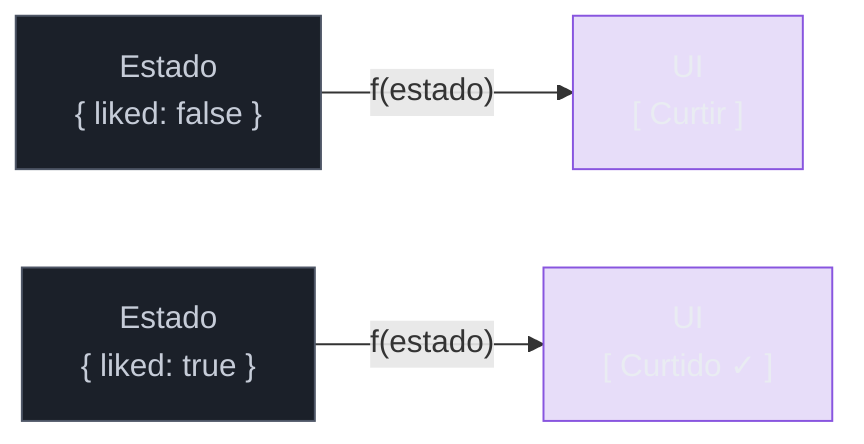
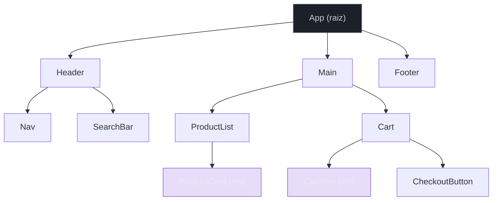
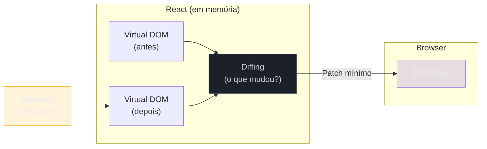
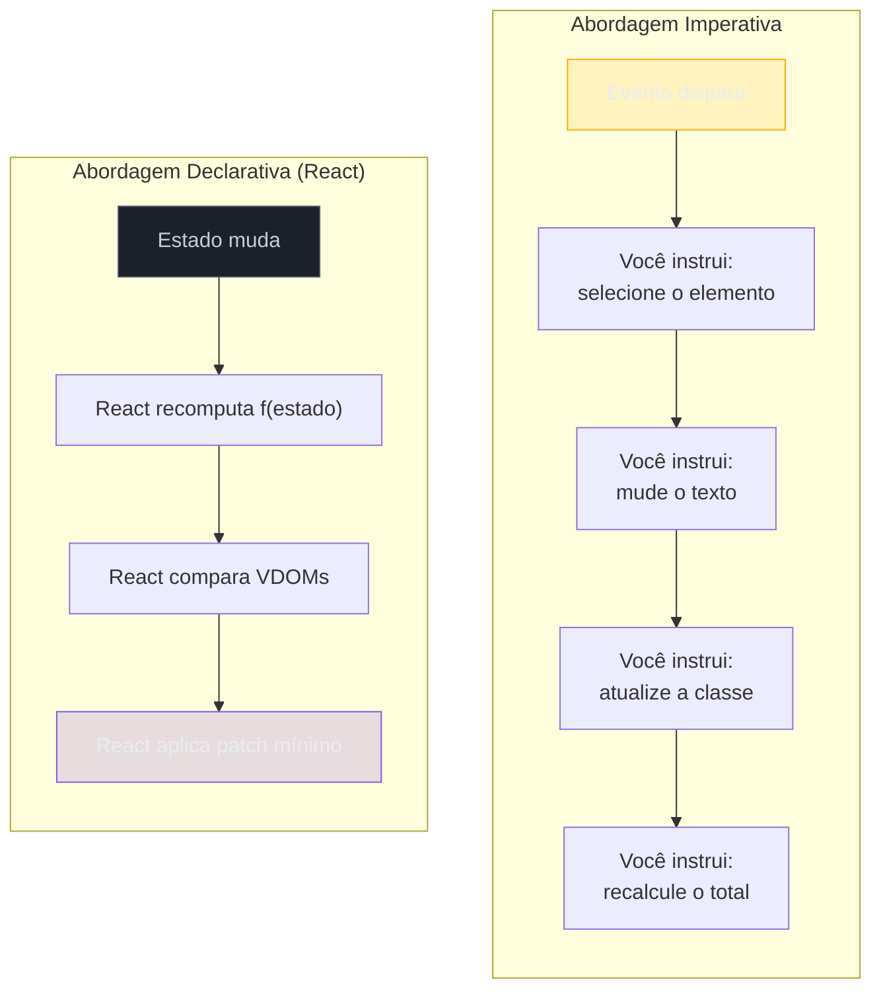

# O que é React e a UI declarativa

> [!abstract] TL;DR
> React é uma biblioteca JavaScript para construir interfaces de usuário declarativas: você descreve *o que* a tela deve mostrar dado um estado, e o React cuida do *como* atualizar o DOM. O modelo mental central é `UI = f(estado)` — a UI é uma função pura do estado da aplicação. O Virtual DOM é a camada intermediária que torna esse modelo eficiente, comparando representações em memória antes de tocar o DOM real. Na era React 19 (2025-2026), o ecossistema amadureceu com Server Components estáveis, Actions, compilador automático e renderização concorrente por padrão.

---

## O problema que o React resolve

Imagine que você precisa construir um carrinho de compras. O usuário adiciona um produto, e você precisa:

1. Atualizar o contador de itens no header.
2. Adicionar a linha do produto na lista.
3. Recalcular o subtotal.
4. Habilitar o botão "Finalizar" se antes estava desabilitado.
5. Exibir um badge no ícone do carrinho.

Em JavaScript puro, você escreve cada um desses passos à mão, na ordem certa, toda vez que algo muda. Isso funciona. Por um tempo.

Depois de seis meses e vinte desenvolvedores, você tem um emaranhado de `document.getElementById`, listeners acumulados e estado espalhado entre variáveis globais. Cada nova feature exige rastrear manualmente quais elementos precisam ser atualizados — e esquecer um deles gera um bug sutil que só aparece em produção.

Esse é o problema central que React veio resolver: **como manter a UI sincronizada com o estado da aplicação sem enlouquecer.**

---

## Imperativo vs. declarativo: a diferença fundamental

Antes de entrar no React, vale entender essa distinção — ela aparece em entrevistas e explica *por que* React existe.

**Programação imperativa** descreve *como* chegar ao resultado: você dá instruções passo a passo ao computador.

**Programação declarativa** descreve *o que* você quer: você descreve o resultado final e delega o *como* para outra camada.

```tsx
// ❌ IMPERATIVO — JavaScript puro
// "Faça isso, depois aquilo, depois aquilo..."
const btn = document.getElementById('like-btn') as HTMLButtonElement;
let liked = false;

btn.addEventListener('click', () => {
  if (liked) {
    liked = false;
    btn.textContent = 'Curtir';
    btn.classList.remove('active');
  } else {
    liked = true;
    btn.textContent = 'Curtido ✓';
    btn.classList.add('active');
  }
});
```

```tsx
// ✅ DECLARATIVO — React
// "Dado este estado, a UI deve parecer assim."
import { useState } from 'react';

interface LikeButtonProps {
  initialLiked?: boolean;
}

function LikeButton({ initialLiked = false }: LikeButtonProps) {
  const [liked, setLiked] = useState(initialLiked);

  return (
    <button
      className={liked ? 'active' : ''}
      onClick={() => setLiked(!liked)}
    >
      {liked ? 'Curtido ✓' : 'Curtir'}
    </button>
  );
}
```

No código imperativo, você instrui o DOM: "vá nesse elemento, mude esse texto, adicione essa classe". No código declarativo, você *descreve* o que o botão deve parecer para cada valor de `liked`, e o React resolve o resto.

> [!question]- Mas não é a mesma coisa? O resultado final é idêntico!
> O resultado visual é igual — mas o custo de manutenção não é. Na versão imperativa, se você adicionar mais um efeito ao clique (ex: animação, analytics, badge), precisa lembrar de todos os estados possíveis. Na versão declarativa, você só descreve o estado → aparência; qualquer novo efeito é adicionado em um lugar só, sem rastrear mutações manuais.

---

## O modelo mental: UI = f(estado)

Essa é a equação central do React. Simples de escrever, profunda de entender:

```
UI = f(estado)
```

Leia assim: a interface do usuário é o *resultado* de aplicar uma função (`f`) sobre um estado. Cada vez que o estado muda, o React recomputa `f(estado)` e atualiza a tela para corresponder ao resultado.



O que torna isso poderoso é que você nunca mais precisa rastrear transições de estado manualmente. Se o estado é `{ liked: true }`, a UI *sempre* mostrará o botão ativo — não importa como chegamos a esse estado.

> [!info] Analogia: planilha eletrônica
> Pense numa planilha Excel. Você define fórmulas nas células — quando os dados de entrada mudam, todas as células que dependem deles atualizam automaticamente. Você não instrui "atualize a célula B3 depois de mudar A1". O modelo declarativo faz o mesmo pela UI.

---

## Componentes: a unidade do React

Se o modelo é `UI = f(estado)`, então **componentes são as funções `f`**.

Um componente React é uma função TypeScript que recebe props (dados de entrada) e retorna JSX (uma descrição da UI). Nada mais que isso.

```tsx
// Um componente é uma função que descreve um pedaço de UI
interface UserCardProps {
  name: string;
  role: string;
  avatarUrl: string;
}

function UserCard({ name, role, avatarUrl }: UserCardProps) {
  return (
    <div className="card">
      
      <h2>{name}</h2>
      <p>{role}</p>
    </div>
  );
}

// Uso: props entram, UI sai
<UserCard
  name="Ada Lovelace"
  role="Primeira programadora da história"
  avatarUrl="/avatars/ada.jpg"
/>
```

Componentes são **reutilizáveis**, **composáveis** e **testáveis de forma independente**. Você constrói UIs complexas combinando componentes simples — como montar blocos de Lego.



Cada caixa no diagrama é uma função. Cada função descreve sua parte da UI. O React compõe tudo isso em uma árvore e renderiza o resultado.

---

## O Virtual DOM: modelo mental

Você já se perguntou: se React recomputa `f(estado)` cada vez que o estado muda, e o DOM real é lento de atualizar, como isso é eficiente?

A resposta é o **Virtual DOM** — uma representação leve do DOM real, mantida em memória como um objeto JavaScript.



O fluxo é:
1. Estado muda.
2. React gera um *novo* Virtual DOM (barato — só um objeto JS).
3. React compara o novo com o antigo (*diffing*).
4. React aplica **só as diferenças** no DOM real (o patch mínimo).

Isso significa que você pode escrever código como se redesenhasse a UI inteira a cada mudança, mas o React é inteligente o suficiente para tocar apenas o que realmente mudou no DOM.

> [!info] Virtual DOM não é sobre velocidade bruta
> Um equívoco comum: "React é rápido porque Virtual DOM é mais rápido que DOM real". Isso não é exatamente verdade. DOM manual bem escrito pode ser mais rápido que React. O valor do Virtual DOM é permitir o **modelo declarativo** com custo razoável — você escreve código simples, e React faz o trabalho tedioso de descobrir o patch mínimo. Para o algoritmo de reconciliation em detalhes, veja [[16 - Reconciliation e diffing a fundo]] (quando existir).

---

## Onde React roda

React não é só "para web". A biblioteca principal (`react`) é agnóstica de plataforma — ela manipula uma árvore de componentes. Quem faz o render de fato é um *renderer* separado:

| Ambiente | Renderer | O que renderiza |
|---|---|---|
| Browser | `react-dom` | DOM HTML |
| Servidor | `react-dom/server` | HTML estático (SSR/SSG) |
| Mobile | `react-native` | Views nativas iOS/Android |
| Desktop | `react-native` (Electron) | Janelas de desktop |
| PDFs | `@react-pdf/renderer` | Documentos PDF |
| Terminal | `ink` | Output de CLI |
| 3D | `@react-three/fiber` | Cenas Three.js |

Isso explica por que "aprender React" tem retorno alto: o modelo mental de componentes + estado é transferível para qualquer plataforma.

---

## React 19-era (2025-2026): o que mudou

React 19.0 saiu estável em dezembro de 2024. Em outubro de 2025, chegou o React 19.2. O que mudou em relação ao React 16-18 que você encontra em projetos legados?

### Server Components (estáveis)

Antes do React 19, Server Components eram experimentais (disponíveis via Next.js, mas sem suporte oficial estável). Agora são parte canônica da spec.

Server Components rodam **apenas no servidor**: sem bundle no cliente, sem JavaScript enviado ao browser. São ideais para partes da UI que dependem de dados do banco ou não têm interatividade.

```tsx
// app/UserProfile.tsx — Server Component (sem 'use client')
// Este componente nunca vai para o bundle do browser
async function UserProfile({ userId }: { userId: string }) {
  const user = await db.users.findById(userId); // acesso direto ao banco!
  return <h1>Olá, {user.name}</h1>;
}
```

### Actions

O pattern antigo para mutações de dados era: chamar uma API no `onClick`, gerenciar loading manualmente, tratar erros, atualizar o estado local. Actions simplificam isso com primitivas nativas: `useActionState`, `useOptimistic` e `useFormStatus`.

### React Compiler

O compilador (anteriormente chamado de React Forget) analisa seu código e adiciona memoização automática onde é seguro fazê-lo. Isso reduz drasticamente a necessidade de `useMemo` e `useCallback` escritos à mão — uma fonte histórica de bugs de performance.

### Renderização Concorrente por padrão

No React 18, Concurrent Mode era opt-in. No React 19, é o modo padrão. Isso significa que React pode pausar, interromper e retomar trabalho de renderização, mantendo a UI responsiva mesmo durante renders pesados.

> [!info] Para iniciantes
> Você não precisa entender os detalhes internos de concorrência agora. O que importa é saber que React 19 é mais inteligente sobre não travar o browser. Os hooks `useTransition` e `useDeferredValue` são as principais APIs que você vai tocar nesse contexto.

---

## Declarativo vs. imperativo: resumo visual



Na abordagem imperativa, **você** rastreia cada transição. Na abordagem declarativa, **você** descreve o destino; React traça o caminho.

---

## Armadilhas comuns

> [!warning] Confundir React com um framework completo
> **O que acontece:** Desenvolvedores buscam "como fazer roteamento no React" e ficam confusos ao descobrir que React não tem roteador built-in. **Por quê:** React é deliberadamente uma *biblioteca* focada só em UI — não um framework como Angular (que inclui roteamento, HTTP, formulários, DI). Para roteamento, você adiciona React Router ou usa Next.js. **Como evitar:** Mentalize React como "a camada de UI". Tudo que não é UI (roteamento, fetch, state global) vem de bibliotecas separadas ou de um meta-framework como Next.js.

> [!warning] Achar que Virtual DOM = performance automática
> **O que acontece:** Desenvolvedores escrevem componentes que re-renderizam desnecessariamente, esperando que o Virtual DOM "resolva" a performance. **Por quê:** O Virtual DOM reduz operações de DOM real, mas não elimina renders desnecessários do JavaScript. Se um componente pai re-renderiza, todos os filhos re-renderizam por padrão — mesmo que suas props não mudaram. **Como evitar:** Entender quando usar `React.memo`, `useMemo` e `useCallback` (ou deixar o React Compiler fazer isso por você em projetos novos). Performance é tópico separado.

> [!warning] Tratar o estado como mutável
> **O que acontece:** `state.items.push(newItem); setState(state)` — o código "funciona" às vezes, falha misteriosamente outras. **Por quê:** React detecta mudanças de estado comparando referências. Mutar o objeto original não cria uma nova referência, então React pode não detectar que algo mudou e não re-renderizar. **Como evitar:** Sempre crie novos objetos/arrays: `setState([...state.items, newItem])`. Estado no React é **imutável por convenção**.

> [!warning] Pensar em React como "HTML turbinado"
> **O que acontece:** Iniciantes focam em JSX como se fosse HTML com superpoderes e ignoram o modelo mental de estado/componentes. **Por quê:** JSX parece HTML. Mas JSX é açúcar sintático sobre chamadas de função JavaScript — cada tag JSX é uma chamada a `React.createElement(...)`. A semelhança com HTML é superficial. **Como evitar:** Leia JSX como "descreve a estrutura", não "gera HTML diretamente". O render para HTML é responsabilidade do `react-dom`, não do JSX em si.

---

## Como explicar em inglês

React is a JavaScript library for building user interfaces using a declarative model. Instead of manually manipulating the DOM, you describe what the UI should look like given a particular state, and React handles the updates efficiently through a virtual DOM diffing algorithm. The core mental model is `UI = f(state)`: the interface is a pure function of your application's state.

| PT | EN |
|---|---|
| UI declarativa | declarative UI |
| estado | state |
| componente | component |
| DOM Virtual | Virtual DOM |
| reconciliação | reconciliation |
| renderização | rendering |
| efeito colateral | side effect |
| propriedades | props |
| árvore de componentes | component tree |
| função pura | pure function |
| mutação | mutation |
| patch mínimo | minimal patch / minimal DOM update |

---

## O que vem a seguir

Agora que você entende *o que* React é e *por que* o modelo declarativo existe, a próxima pergunta natural é: como escrever o código? JSX é a sintaxe que torna possível descrever UI dentro de TypeScript — ela merece uma nota própria.

Depois de JSX, você vai querer entender o ciclo de vida de um componente: quando ele nasce, como recebe dados e quando some da tela.

- Próximas notas do galho React core (quando existirem) — JSX, Props, State, Hooks e ciclo de vida
- [[03-Dominios/Tecnologia/React/TypeScript com React/index|TypeScript com React]] — tipagem profunda de componentes, props e hooks
- [[03-Dominios/Tecnologia/JavaScript/index|JavaScript]] — fundamento da linguagem sobre a qual React é construído
- [[03-Dominios/Tecnologia/Plataforma Web/index|Plataforma Web]] — o DOM que React abstrai
- [[03-Dominios/Tecnologia/React/Dicionário de React|Dicionário de React]] — termos centrais do ecossistema

---

## Fontes

- **React Team** — [*React v19 (blog oficial)*](https://react.dev/blog/2024/12/05/react-19) — anúncio oficial do React 19 com lista completa de mudanças
- **React Team** — [*React 19.2 (blog oficial)*](https://react.dev/blog/2025/10/01/react-19-2) — novas APIs: Activity, useEffectEvent, Performance Tracks
- **React Team** — [*Virtual DOM and Internals (docs legado)*](https://legacy.reactjs.org/docs/faq-internals.html) — definição canônica de Virtual DOM
- **GreatFrontend** — [*Thinking Declaratively in React*](https://www.greatfrontend.com/react-interview-playbook/react-thinking-declaratively) — playbook de entrevistas: modelo declarativo explicado
- **freeCodeCamp** — [*What is the Virtual DOM in React?*](https://www.freecodecamp.org/news/what-is-the-virtual-dom-in-react/) — explicação acessível do VDOM com exemplos
- **LogRocket Blog** — [*What is the virtual DOM in React?*](https://blog.logrocket.com/the-virtual-dom-react/) — análise de performance e trade-offs do VDOM
