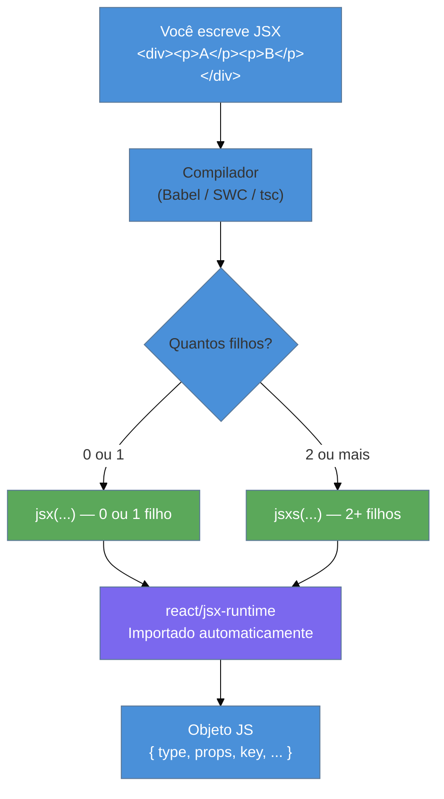
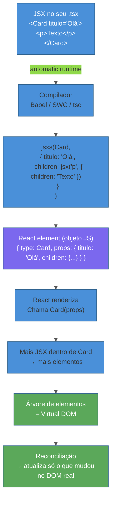

# JSX a fundo

> [!abstract] TL;DR
> JSX é açúcar sintático: o compilador o converte em chamadas de função antes de chegar ao navegador. Desde o React 17, o runtime **automatic** usa `jsx`/`jsxs` de `react/jsx-runtime` — não mais `React.createElement` — o que elimina a necessidade de importar `React` em cada arquivo `.tsx`. Dentro do JSX, `{}` aceita qualquer **expressão** JavaScript (número, string, variável, ternário, chamada de função), mas nunca um statement (if/for/while). Atributos seguem camelCase (`className`, `htmlFor`). Fragments (`<>...</>`) evitam nós DOM extras. Listas precisam de `key` para o React rastrear itens. A armadilha clássica: `{count && <p>...</p>}` renderiza `0` na tela quando `count` é zero — use ternário.

---

Imagine que você quer mostrar um botão na tela. Em JavaScript puro com a API do DOM, você escreveria algo como:

```ts
const btn = document.createElement('button');
btn.className = 'btn-primary';
btn.textContent = 'Salvar';
document.body.appendChild(btn);
```

Funciona — mas fica ilegível quando a interface cresce. Agora, imagine poder escrever quase HTML dentro do seu arquivo TypeScript, com toda a lógica em volta, e o compilador se encarregar de transformar isso em código eficiente. Isso é o que o **JSX** faz.

JSX não é uma linguagem nova. É uma **extensão de sintaxe** do JavaScript (e TypeScript, no caso do `.tsx`) que parece HTML mas tem superpoderes: pode receber expressões dinâmicas, compor componentes como tags e ser tipado estaticamente.

---

## O que é JSX, de verdade?

Você vê isso:

```tsx
const elemento = <h1 className="titulo">Olá, mundo</h1>;
```

O compilador (Babel, SWC, TypeScript) enxerga isso e converte. A questão é: **em quê** ele converte?

### O runtime classic (pré-React 17)

Antes do React 17, a regra era simples: JSX virava `React.createElement(...)`:

```ts
// O que o compilador gerava
const elemento = React.createElement('h1', { className: 'titulo' }, 'Olá, mundo');
```

Essa é a razão pela qual, antigamente, **todo arquivo que usava JSX tinha que importar React** — mesmo que você nunca chamasse `React` diretamente. O compilador ia precisar desse nome em scope para montar as chamadas.

```tsx
// Antes do React 17 — obrigatório mesmo sem usar React diretamente
import React from 'react';

function Saudacao() {
  return <h1>Olá</h1>; // → React.createElement('h1', null, 'Olá')
}
```

### O runtime automatic (React 17+, padrão atual)

A partir do React 17, um novo runtime foi introduzido: o **automatic**. Em vez de gerar chamadas para `React.createElement`, o compilador agora importa automaticamente funções de `react/jsx-runtime`:

```ts
// O que o compilador gera hoje (você NUNCA escreve isso à mão)
import { jsx as _jsx } from 'react/jsx-runtime';

const elemento = _jsx('h1', { className: 'titulo', children: 'Olá, mundo' });
```

Com isso, **não é mais necessário importar React** só para usar JSX. O compilador cuida do import por você. Você só importa React quando precisa de algo específico, como `useState` ou `useEffect`.

```tsx
// React 17+ com automatic runtime — sem import React
function Saudacao() {
  return <h1>Olá</h1>;
}
```

### `jsx` vs `jsxs` — qual a diferença?

O runtime automatic usa duas funções distintas:

- **`jsx`** — para elementos com **zero ou um filho** (incluindo quando o filho é passado como prop)
- **`jsxs`** — para elementos com **dois ou mais filhos estáticos**

O compilador decide qual usar com base na estrutura do JSX. Como usuário, você nunca chama essas funções diretamente — só precisa saber que elas existem por baixo.



> [!info] O que o React faz com esse objeto?
> O resultado de `jsx(...)` é um **React element**: um objeto JavaScript simples que descreve o que você quer renderizar. O React usa esse objeto para comparar com o que já está na tela (o algoritmo de reconciliação) e aplicar só as mudanças necessárias.

---

## Expressões `{}`: o portal para o JavaScript

Dentro do JSX, as chaves `{}` são um portal de volta para o JavaScript. Tudo que vai dentro delas precisa ser uma **expressão** — algo que produz um valor.

```tsx
const nome = 'Ana';
const pontos = 42;

function Placar() {
  return (
    <div>
      <p>Jogador: {nome}</p>
      <p>Pontos: {pontos}</p>
      <p>Dobro: {pontos * 2}</p>
      <p>Hoje: {new Date().toLocaleDateString('pt-BR')}</p>
      <p>Categoria: {pontos > 30 ? 'Ouro' : 'Prata'}</p>
    </div>
  );
}
```

### O que pode entrar em `{}`

| Tipo | Exemplo | Resultado |
|------|---------|-----------|
| String | `{'texto'}` | Texto literal |
| Número | `{42}` | `42` |
| Variável | `{nome}` | Valor da variável |
| Expressão aritmética | `{a + b}` | Resultado |
| Ternário | `{ok ? 'Sim' : 'Não'}` | Um dos valores |
| Chamada de função | `{formatDate(data)}` | Retorno da função |
| Array de JSX | `{itens.map(i => <li key={i.id}>{i.nome}</li>)}` | Lista de elementos |
| `null` / `undefined` / `false` | `{null}` | Não renderiza nada |

### O que **não** pode entrar em `{}`

Statements — blocos de código que não retornam valor — são inválidos dentro de `{}`:

```tsx
// ❌ INVÁLIDO — if é um statement, não uma expressão
function Exemplo() {
  return (
    <div>
      {if (logado) { return <p>Olá</p>; }} // SyntaxError
    </div>
  );
}

// ✅ Correto — ternário é uma expressão
function Exemplo() {
  return (
    <div>
      {logado ? <p>Olá</p> : null}
    </div>
  );
}
```

> [!question]- Por que `if` não funciona mas ternário sim?
> Um `if` é uma instrução de controle de fluxo — ele não produz um valor, apenas executa código. Um ternário (`a ? b : c`) é uma **expressão condicional** — ele sempre avalia para um valor. O JSX precisa de valores para saber o que renderizar.

---

## Atributos: camelCase e as exceções

Em HTML, os atributos são todos em letras minúsculas: `class`, `for`, `onclick`. Em JSX, quase todos viram **camelCase** — e dois têm nomes completamente diferentes:

| HTML | JSX | Por quê mudou |
|------|-----|---------------|
| `class` | `className` | `class` é palavra reservada em JavaScript |
| `for` | `htmlFor` | `for` é palavra reservada em JavaScript |
| `onclick` | `onClick` | Convenção camelCase do JS |
| `tabindex` | `tabIndex` | Idem |
| `readonly` | `readOnly` | Idem |
| `maxlength` | `maxLength` | Idem |
| `style="color: red"` | `style={{ color: 'red' }}` | Style vira objeto JS |

```tsx
// ❌ HTML puro — não funciona em JSX
<label class="rotulo" for="email">E-mail</label>
<input class="campo" type="email" id="email" readonly />

// ✅ JSX correto
<label className="rotulo" htmlFor="email">E-mail</label>
<input className="campo" type="email" id="email" readOnly />
```

O atributo `style` merece atenção especial: em HTML é uma string, em JSX é um **objeto JavaScript**:

```tsx
// ❌ String — erro de tipo
<div style="color: red; font-size: 16px">texto</div>

// ✅ Objeto JS — camelCase nas propriedades
<div style={{ color: 'red', fontSize: '16px' }}>texto</div>
//           ^ duplas chaves: externa = "expressão JS", interna = "objeto literal"
```

---

## Children e composição

Em JSX, o que está entre a tag de abertura e fechamento são os **children** do elemento:

```tsx
<div>
  <h1>Título</h1>     {/* child 1: elemento JSX */}
  <p>Parágrafo</p>    {/* child 2: elemento JSX */}
  Texto solto         {/* child 3: string */}
  {42}                {/* child 4: número */}
</div>
```

Children também podem ser passados como prop explícita — útil para componentes que recebem qualquer coisa:

```tsx
interface CardProps {
  children: React.ReactNode;
}

function Card({ children }: CardProps) {
  return <div className="card">{children}</div>;
}

// Uso
<Card>
  <h2>Título do card</h2>
  <p>Qualquer coisa vai aqui</p>
</Card>
```

`React.ReactNode` é o tipo mais abrangente para children — aceita elementos JSX, strings, números, arrays, `null`, `undefined`, `boolean`. É a escolha certa quando você quer que o componente aceite "qualquer coisa renderizável".

---

## Fragments: sem nós extras

Uma regra fundamental do JSX: **cada expressão retorna um único elemento raiz**. Isso cria um problema quando você precisa retornar múltiplos elementos sem um `<div>` container:

```tsx
// ❌ INVÁLIDO — dois elementos raiz
function Cabecalho() {
  return (
    <h1>Título</h1>
    <p>Subtítulo</p>
  );
}
```

A solução antiga era envolver tudo em um `<div>` — mas isso polui o DOM com nós desnecessários que podem quebrar estilos CSS (especialmente grid e flex diretos). A solução moderna são os **Fragments**:

```tsx
// ✅ Fragment curto — sem nó DOM adicional
function Cabecalho() {
  return (
    <>
      <h1>Título</h1>
      <p>Subtítulo</p>
    </>
  );
}

// ✅ Fragment explícito — necessário quando precisa de key
import { Fragment } from 'react';

function Lista({ itens }: { itens: string[] }) {
  return (
    <>
      {itens.map((item, i) => (
        <Fragment key={i}>
          <dt>{item}</dt>
          <dd>Descrição de {item}</dd>
        </Fragment>
      ))}
    </>
  );
}
```

> [!info] `<>` vs `<Fragment>`
> A sintaxe curta `<>...</>` é conveniente, mas **não aceita props** — incluindo `key`. Se você precisa de `key` (comum ao mapear listas de elementos múltiplos), use `<Fragment key={...}>`.

---

## Listas inline e a necessidade de `key`

Renderizar listas com `.map()` é padrão em React:

```tsx
interface Produto {
  id: number;
  nome: string;
  preco: number;
}

function ListaProdutos({ produtos }: { produtos: Produto[] }) {
  return (
    <ul>
      {produtos.map((produto) => (
        <li key={produto.id}>
          {produto.nome} — R$ {produto.preco.toFixed(2)}
        </li>
      ))}
    </ul>
  );
}
```

A prop `key` é **obrigatória em listas** — o React a usa para identificar cada item durante o processo de reconciliação (atualização do DOM). Sem ela, o React não sabe qual item mudou, foi adicionado ou removido, e pode gerar bugs visuais sutis ou renderizações desnecessárias.

> [!question]- Por que não usar o índice do array como key?
> Você **pode** — e às vezes é a única opção — mas tem custo. Se a ordem dos itens mudar (ordenação, remoção do meio), o índice de cada item muda junto. O React associa o estado interno (inputs, animações) ao `key`, não ao conteúdo. Com índice como key, um item que sai do topo faz todos os outros "parecerem" ter mudado. Com ID estável, o React sabe exatamente quem é quem. A nota [[07 - Listas e keys]] aprofunda esse mecanismo.

---

## Condicionais: `&&`, ternário e a armadilha do `0`

### Renderização condicional com `&&`

O padrão mais comum é usar `&&` para renderizar algo **somente se** uma condição for verdadeira:

```tsx
function Notificacao({ mensagens }: { mensagens: string[] }) {
  return (
    <div>
      {mensagens.length > 0 && (
        <p>Você tem {mensagens.length} mensagem(s) nova(s).</p>
      )}
    </div>
  );
}
```

Isso funciona porque em JavaScript, `verdadeiro && <elemento>` avalia para `<elemento>`, e `falso && <elemento>` avalia para `falso` — que o React ignora na renderização.

### A armadilha do `0 &&`

Aqui mora um bug clássico. O número `0` é **falsy** em JavaScript — então você esperaria que `{count && <p>...</p>}` não renderizasse nada quando `count` é zero. Mas o React trata `0` diferente de `false`:

```tsx
// ❌ BUG: renderiza "0" na tela quando mensagens.length é zero
function Lista({ mensagens }: { mensagens: string[] }) {
  return (
    <div>
      {mensagens.length && <p>Ver mensagens</p>}
      {/* Quando length é 0: 0 && <p> = 0 → React renderiza "0" */}
    </div>
  );
}

// ✅ Correto: converta para boolean explicitamente
function Lista({ mensagens }: { mensagens: string[] }) {
  return (
    <div>
      {mensagens.length > 0 && <p>Ver mensagens</p>}
      {/* ou: */}
      {!!mensagens.length && <p>Ver mensagens</p>}
    </div>
  );
}
```

**Por quê isso acontece?** O React renderiza qualquer valor que não seja `null`, `undefined`, `false` ou `true`. O número `0` não está nessa lista — ele é um valor válido a ser exibido como texto.

### Ternário para else

Quando você precisa de "se A mostre X, senão mostre Y", use ternário:

```tsx
function StatusConexao({ conectado }: { conectado: boolean }) {
  return (
    <span className={conectado ? 'verde' : 'vermelho'}>
      {conectado ? 'Online' : 'Offline'}
    </span>
  );
}
```

---

## `.tsx` e tipagem de elementos

Quando seu arquivo tem extensão `.tsx`, o TypeScript entende JSX nativamente. O tipo que descreve "qualquer coisa que pode ser renderizada pelo React" é `React.ReactNode`:

```tsx
import { ReactNode } from 'react';

interface LayoutProps {
  titulo: string;
  children: ReactNode; // strings, números, elementos, arrays, null, undefined, boolean
}

function Layout({ titulo, children }: LayoutProps) {
  return (
    <main>
      <h1>{titulo}</h1>
      <section>{children}</section>
    </main>
  );
}
```

### A hierarquia de tipos de elementos

| Tipo | O que aceita | Quando usar |
|------|-------------|-------------|
| `ReactNode` | Tudo renderizável (+ null/undefined/boolean) | Children em geral |
| `ReactElement` | Apenas elementos JSX reais | Quando precisa garantir que recebe um elemento, não null |
| `JSX.Element` | Igual a `ReactElement` (alias histórico) | Evite — prefira `ReactElement` |
| `string \| number` | Primitivos | Props de texto/valor |

```tsx
// Exemplo real: componente de ícone que aceita children opcionais
interface BotaoProps {
  label: string;
  icone?: ReactNode;  // pode ser null, um SVG, um emoji...
  children?: ReactNode;
}

function Botao({ label, icone, children }: BotaoProps) {
  return (
    <button type="button" aria-label={label}>
      {icone}
      {children ?? label}
    </button>
  );
}
```

---

## Como explicar em inglês

> JSX is syntactic sugar that the compiler transforms into function calls. Since React 17, the new **automatic JSX runtime** uses `jsx` and `jsxs` from `react/jsx-runtime` instead of `React.createElement`, so you no longer need to import React just to write JSX. Inside JSX, curly braces accept any JavaScript expression — but not statements. Attributes follow camelCase conventions, with `className` and `htmlFor` replacing the reserved words `class` and `for`. Fragments let you return multiple elements without adding extra DOM nodes.

| PT | EN |
|----|----|
| Açúcar sintático | Syntactic sugar |
| Runtime automático | Automatic runtime |
| Fragmento | Fragment |
| Renderização condicional | Conditional rendering |
| Curto-circuito | Short-circuit evaluation |
| Nó DOM extra | Extra DOM node |
| Elemento React | React element |
| Tipo filho | Children type |

---

## Armadilhas comuns

> [!warning] A armadilha do `0 &&`
> **O que acontece:** `{count && <Componente />}` renderiza o texto `"0"` na tela quando `count` é zero.
> **Por quê:** `0 && qualquerCoisa` avalia para `0` — um valor numérico que o React exibe como texto. Apenas `false`, `null`, `undefined` e `true` são silenciosamente ignorados pelo renderer.
> **Como evitar:** Use comparação explícita: `{count > 0 && <Componente />}` ou converta para boolean: `{!!count && <Componente />}`. Ternário é sempre seguro: `{count > 0 ? <Componente /> : null}`.

> [!warning] Ausência de `key` em listas
> **O que acontece:** React exibe um aviso no console. Em casos com estado interno nos itens (inputs, animações), o conteúdo de um item pode "vazar" para outro quando a lista é reordenada.
> **Por quê:** O React usa `key` para associar o estado e o DOM de cada elemento ao item correto entre re-renderizações. Sem ela, ele faz suposições pela posição — que ficam erradas quando a ordem muda.
> **Como evitar:** Sempre passe `key` com um ID estável e único dentro da lista. Evite usar o índice do array em listas que podem mudar de ordem.

> [!warning] Objeto como child do JSX
> **O que acontece:** `{minhaVariavel}` onde `minhaVariavel` é um objeto JavaScript gera o erro: *"Objects are not valid as a React child"*.
> **Por quê:** O React sabe renderizar strings, números e elementos JSX — mas não sabe como transformar um objeto `{}` em algo visível na tela.
> **Como evitar:** Extraia o valor específico que quer exibir: `{usuario.nome}` em vez de `{usuario}`. Se precisar inspecionar o objeto, use `{JSON.stringify(objeto)}` (só para debug).

> [!warning] `<>` sem suporte a `key`
> **O que acontece:** Usar a sintaxe curta `<>...</>` com `key` gera erro de compilação.
> **Por quê:** A sintaxe curta não aceita nenhuma prop — é literalmente `<Fragment>` sem atributos.
> **Como evitar:** Ao mapear listas onde cada item precisa de Fragment + key, use `<Fragment key={...}>` explicitamente: `import { Fragment } from 'react'`.

---

## Diagrama: JSX → árvore de elementos



---

## JSX em uma frase

> JSX é HTML com superpoderes: você escreve uma sintaxe familiar, o compilador a converte em chamadas de função, e o React usa os objetos resultantes para saber exatamente o que atualizar na tela.

---

## O que vem a seguir

Agora que você sabe o que JSX é por dentro e como expressá-lo corretamente, o próximo passo natural é entender como o React organiza a interface em blocos reutilizáveis — os componentes — e como eles recebem dados via props.

- [[03 - Componentes e props]] — como criar componentes, passar props tipadas e compor interfaces
- [[07 - Listas e keys]] — o algoritmo de reconciliação e por que keys importam de verdade
- [[03-Dominios/Tecnologia/React/TypeScript com React/index|TypeScript com React]] — tipagem avançada de elementos, children e componentes genéricos
- [[03-Dominios/Tecnologia/React/Dicionário de React|Dicionário de React]] — glossário de termos React usados nesta nota

---

## Referências

- **React Team** — [*Introducing the New JSX Transform*](https://legacy.reactjs.org/blog/2020/09/22/introducing-the-new-jsx-transform.html) — Post oficial do blog React explicando a motivação e mecânica do automatic runtime (React 17)
- **React Docs** — [*Writing Markup with JSX*](https://react.dev/learn/writing-markup-with-jsx) — Documentação oficial react.dev, seção Learn
- **React Docs** — [*JavaScript in JSX with Curly Braces*](https://react.dev/learn/javascript-in-jsx-with-curly-braces) — Expressões dentro de JSX
- **Babel Docs** — [*@babel/plugin-transform-react-jsx*](https://babeljs.io/docs/babel-plugin-transform-react-jsx/) — Configuração do runtime `automatic` vs `classic`
- **TypeScript Docs** — [*JSX*](https://www.typescriptlang.org/docs/handbook/jsx.html) — Como o TypeScript processa arquivos `.tsx` e os tipos JSX
- **Steve Kinney** — [*JSX Types: ReactNode, ReactElement*](https://stevekinney.com/courses/react-typescript/jsx-types-reactnode-reactelement) — Hierarquia de tipos para children e elementos
