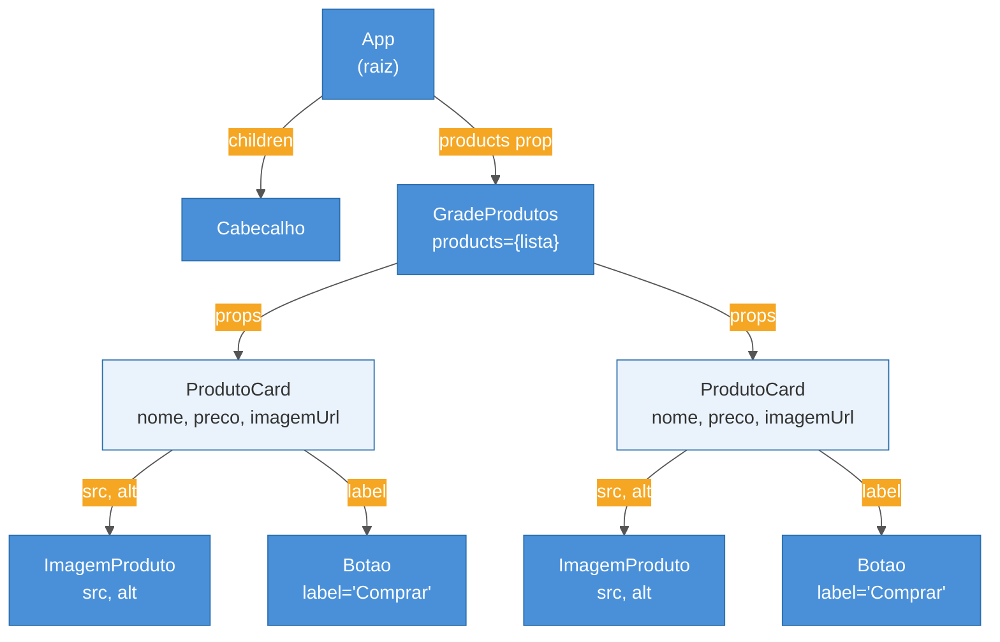

# Componentes e props

> [!abstract] TL;DR
> Componentes são funções TypeScript que recebem um objeto de propriedades (props) e retornam JSX —
> a unidade de construção de toda UI em React. Props fluem em sentido único (pai → filho) e são
> somente leitura: o filho nunca altera o que recebeu. Tipar props com `interface` ou `type` no TS
> elimina erros em tempo de compilação e serve de documentação viva. Quando muitos componentes
> precisam dos mesmos dados por vários níveis, o *prop drilling* se torna problema — sinal de que
> Context (nota 11) pode ajudar.

## O problema que componentes resolvem

Imagine que você está construindo uma página de e-commerce. Ela tem um cabeçalho, uma grade de
produtos, cada produto tem uma foto, nome, preço e botão de compra. Se você escrever tudo isso num
único arquivo HTML gigante, qualquer mudança pequena — como alterar a cor do botão — exige procurar
no código inteiro. Pior: se quiser reusar o mesmo layout de produto em outra página, você copia e
cola — e aí tem dois lugares para manter.

Componentes resolvem isso. Em vez de um bloco monolítico, você fatia a UI em **peças reutilizáveis
e independentes** — cada uma com sua própria lógica e aparência. O componente `ProdutoCard` sabe
como renderizar um produto; você o usa quantas vezes quiser, passando dados diferentes cada vez.

Essa ideia de "peças encaixáveis" não é nova — é o princípio de composição que existe em toda
engenharia. No React, a ferramenta que conecta as peças são as **props**.

## O que é um componente funcional

Em React moderno (pós-hooks, desde 2019), um componente é simplesmente uma **função TypeScript que
retorna JSX**:

```tsx
function Saudacao() {
  return <h1>Olá, mundo!</h1>
}
```

Três coisas são obrigatórias para o React reconhecer uma função como componente:

1. O nome começa com **letra maiúscula** (`Saudacao`, não `saudacao`). Isso é o que diferencia
   `<saudacao>` (tag HTML desconhecida) de `<Saudacao>` (componente React).
2. A função **retorna JSX** — que nos bastidores vira chamadas a `React.createElement`.
3. O componente é **puro em relação às props**: dado o mesmo input, sempre retorna o mesmo JSX.

> [!question]- Por que PascalCase é obrigatório?
> O compilador do React usa a capitalização para distinguir elementos HTML nativos de componentes.
> Quando você escreve `<div>`, o React entende que é uma tag HTML padrão. Quando você escreve
> `<Saudacao>`, ele sabe que deve chamar a função `Saudacao` e renderizar o que ela retorna. Se
> o nome começasse com minúscula, o React tentaria criar uma tag `<saudacao>` no DOM — e o
> navegador a ignoraria silenciosamente.

Um componente por arquivo é a convenção padrão. O arquivo tem o mesmo nome do componente:
`Saudacao.tsx`. Isso facilita encontrar o componente e evita arquivos com dezenas de definições
acumuladas.

## Props: a entrada do componente

Props (abreviação de *properties*) são o mecanismo pelo qual um componente pai passa dados para um
componente filho. Pense nas props como os **parâmetros de uma função** — você define o que a função
aceita, e quem a chama decide o que passa.

```tsx
// Definição do componente — "aceito uma prop chamada nome"
function Saudacao({ nome }: { nome: string }) {
  return <h1>Olá, {nome}!</h1>
}

// Uso — o pai "chama" passando o argumento
function App() {
  return <Saudacao nome="Maria" />
}
```

O JSX `<Saudacao nome="Maria" />` é açúcar sintático para `Saudacao({ nome: "Maria" })`. As props
chegam ao componente como um único objeto — por isso o padrão é fazer *destructuring* logo na
assinatura da função.

### Fluxo unidirecional: dados descem, eventos sobem

Uma das regras mais importantes do React é que **props são somente leitura**. O filho recebe dados
do pai; não pode alterá-los diretamente. Essa restrição é proposital: garante que o fluxo de dados
seja previsível e rastreável.

```
        App (pai)
        │ nome="Maria"
        ▼
    Saudacao (filho)
        │ ✗ não pode mudar nome
        │ ✓ pode chamar funções passadas como prop
        ▼
      <h1>Olá, Maria!</h1>
```

Se o filho precisa "informar" algo ao pai — como um clique —, o pai passa uma **função como prop**,
e o filho a chama. Dados descem via props; eventos sobem via callbacks. Essa assimetria é
intencional e mantém o estado centralizado.

## Tipando props com TypeScript

Sem TypeScript, você só descobre que passou a prop errada em tempo de execução — às vezes em
produção. Com TypeScript, o compilador rejeita o erro antes de você salvar o arquivo.

### Interface para props — o padrão mais comum

```tsx
interface SaudacaoProps {
  nome: string
  sobrenome: string
  idade: number
}

function Saudacao({ nome, sobrenome, idade }: SaudacaoProps) {
  return (
    <p>
      {nome} {sobrenome}, {idade} anos
    </p>
  )
}
```

A `interface` tem uma vantagem: ela pode ser **estendida** (`extends`) e aparece de forma mais
clara no hover do editor. O `type` faz o mesmo trabalho e é preferido quando você precisa de
unions ou tipos condicionais — veremos isso no galho TypeScript com React.

> [!info] `interface` vs `type` para props
> Ambos funcionam. A convenção atual (2026) no ecossistema React é: use `interface` como padrão
> para props de componentes — é extensível e mais legível em hover do IDE. Use `type` quando a
> situação exige union types (`"small" | "medium" | "large"`) ou tipos mapeados. Detalhes em
> [[03-Dominios/Tecnologia/React/TypeScript com React/04 - interface vs type vs satisfies para props|TypeScript com React › interface vs type vs satisfies]].

### Props opcionais e valores padrão

Nem toda prop é obrigatória. Marque opcionais com `?` na interface e forneça o padrão via
destructuring:

```tsx
interface BotaoProps {
  label: string         // obrigatória
  variante?: "primario" | "secundario"  // opcional
  desabilitado?: boolean                // opcional
}

function Botao({
  label,
  variante = "primario",   // padrão definido aqui
  desabilitado = false,
}: BotaoProps) {
  return (
    <button
      disabled={desabilitado}
      className={`btn btn--${variante}`}
    >
      {label}
    </button>
  )
}
```

### A prop `children`

`children` é a prop especial que recebe o conteúdo passado **entre as tags** do componente —
análogo ao `slot` de outras frameworks. O tipo correto é `React.ReactNode`, que aceita qualquer
coisa que o React sabe renderizar: strings, números, elementos JSX, arrays, `null`.

```tsx
interface CartaoProps {
  titulo: string
  children: React.ReactNode  // aceita qualquer conteúdo React
}

function Cartao({ titulo, children }: CartaoProps) {
  return (
    <div className="cartao">
      <h2 className="cartao__titulo">{titulo}</h2>
      <div className="cartao__corpo">{children}</div>
    </div>
  )
}

// Uso — o conteúdo entre as tags vira `children`
function App() {
  return (
    <Cartao titulo="Bem-vindo">
      <p>Este parágrafo é o children do Cartao.</p>
      <Botao label="Saiba mais" />
    </Cartao>
  )
}
```

> [!question]- Por que `React.ReactNode` e não `JSX.Element`?
> `JSX.Element` é mais restrito: aceita apenas elementos JSX puros. `React.ReactNode` é a união de
> tudo que pode ser renderizado: `JSX.Element | string | number | boolean | null | undefined | array`.
> Para `children`, use sempre `ReactNode` — é o que os usuários do componente vão passar.

## Composição: componentes dentro de componentes

Compor componentes é a habilidade central de React. Você constrói interfaces complexas encaixando
componentes simples — como peças de Lego. O resultado é uma **árvore de componentes**:

```
App
├── Cabecalho
│   └── Logo
├── GradeProdutos
│   ├── ProdutoCard (id=1)
│   │   ├── ImagemProduto
│   │   └── BotaoComprar
│   ├── ProdutoCard (id=2)
│   └── ProdutoCard (id=3)
└── Rodape
```

Cada nó dessa árvore é uma função. O React chama cada uma, do topo para baixo, para montar a UI
final.

```tsx
interface ImagemProdutoProps {
  src: string
  alt: string
}

function ImagemProduto({ src, alt }: ImagemProdutoProps) {
  return 
}

interface ProdutoCardProps {
  nome: string
  preco: number
  imagemUrl: string
}

function ProdutoCard({ nome, preco, imagemUrl }: ProdutoCardProps) {
  return (
    <div className="produto-card">
      <ImagemProduto src={imagemUrl} alt={nome} />
      <h3>{nome}</h3>
      <p>R$ {preco.toFixed(2)}</p>
      <Botao label="Comprar" />
    </div>
  )
}
```

Note que `ProdutoCard` não sabe nada sobre como `ImagemProduto` funciona internamente. Ele apenas
passa dados. Isso é encapsulamento — e é o que torna os componentes substituíveis e testáveis de
forma independente.

## Diagrama: árvore de componentes e fluxo de props



As props sempre descem: o `App` passa dados para `GradeProdutos`, que os fragmenta e repassa para
cada `ProdutoCard`. Nenhum filho sabe o que o irmão recebeu.

## Destructuring de props: o padrão idiomático

Em vez de acessar `props.nome`, `props.preco` etc., o padrão React é fazer destructuring direto na
assinatura da função:

```tsx
// ✗ Verboso — evitar
function ProdutoCard(props: ProdutoCardProps) {
  return <h3>{props.nome}</h3>
}

// ✓ Idiomático — prefer
function ProdutoCard({ nome, preco, imagemUrl }: ProdutoCardProps) {
  return <h3>{nome}</h3>
}
```

Destructuring com renomeação é permitido quando o nome da prop conflita com uma variável local:

```tsx
function Link({ href, children, className: estiloCustom }: LinkProps) {
  // usa `estiloCustom` internamente em vez de `className`
}
```

## Prop drilling: quando a composição começa a doer

Imagine que o `App` tem o nome do usuário logado, e um botão dentro de `ProdutoCard` precisa desse
nome para personalizar a mensagem de compra. Você acaba fazendo:

```
App (nome="Maria")
  └── GradeProdutos (nome="Maria")     ← não usa, só repassa
        └── ProdutoCard (nome="Maria") ← não usa, só repassa
              └── BotaoComprar (nome="Maria") ← finalmente usa
```

Isso se chama **prop drilling** — passar uma prop por vários níveis intermediários que não a
utilizam, só para que um componente profundo a receba. Os problemas são claros:

- `GradeProdutos` e `ProdutoCard` ficam "poluídos" com uma prop que não é deles.
- Refatorar a árvore exige repassar a prop em todos os intermediários.
- O código fica acoplado de forma invisível: mudar o nome de uma prop exige varredura em N arquivos.

A solução canônica para prop drilling é a **Context API**, que cria um "canal direto" entre o
provedor (o pai distante) e o consumidor (o filho profundo), sem passar por intermediários. Veremos
isso em [[03-Dominios/Tecnologia/React/React core/11 - useContext e Context API|11 - useContext e Context API]].

## Convenções essenciais (resumo)

| Convenção | Por quê importa |
|-----------|-----------------|
| Nomes em **PascalCase** | Diferencia componente de tag HTML para o compilador |
| **Um componente por arquivo** | Facilita encontrar, importar e testar |
| Arquivo com **mesmo nome** do componente | `Botao.tsx` → `function Botao` |
| **Destructuring** na assinatura | Código mais limpo; evita prefixo `props.` repetido |
| Interface `XxxProps` no mesmo arquivo | Documentação viva das entradas do componente |
| Props **somente leitura** | Garante fluxo previsível; mutação gera bugs silenciosos |

## Armadilhas comuns

> [!warning] Nunca mute props diretamente
> **O que acontece:** você faz `props.nome = "outro"` ou `objeto.campo = novo_valor` diretamente
> na prop, e nada parece mudar — ou pior, o comportamento fica inconsistente entre renders.
> **Por quê:** o React usa referência de objeto para detectar mudanças. Mutando a prop você quebra
> essa detecção; o componente não re-renderiza quando deveria.
> **Como evitar:** trate props como `readonly`. Se precisar derivar dados, crie uma variável local:
> `const nomeFormatado = props.nome.toUpperCase()`.

> [!warning] `defaultProps` foi removido no React 19
> **O que acontece:** você usa `Botao.defaultProps = { variante: "primario" }` seguindo exemplos
> antigos, e o TypeScript começa a reclamar — ou os padrões simplesmente são ignorados em runtime.
> **Por quê:** o React 19 descontinuou `defaultProps` para componentes funcionais. O tipo
> `FunctionComponent` não o suporta mais.
> **Como evitar:** defina padrões diretamente no destructuring da função. O TypeScript infere a
> prop como opcional automaticamente.

> [!warning] Prop drilling não é um bug — mas vira um quando escala
> **O que acontece:** 2-3 níveis de passagem são aceitáveis. Acima disso, adicionar uma nova prop
> compartilhada exige modificar todos os componentes do caminho — mesmo os que não a usam.
> **Por quê:** props são o único canal de comunicação entre componentes sem estado global.
> **Como evitar:** acima de 3 níveis, considere Context API (nota 11) ou um gerenciador de estado.
> Antes disso, tente reestruturar a árvore — a composição com `children` frequentemente resolve
> sem nenhuma biblioteca adicional.

> [!warning] Esquecer `key` em listas de componentes
> **O que acontece:** você mapeia um array sem `key`, o React emite warning no console. Em listas
> que mudam de ordem ou tamanho, componentes podem receber os dados errados entre renders.
> **Por quê:** o React usa `key` para identificar qual componente corresponde a qual item na
> próxima renderização. Sem ela, usa a posição — que muda quando o array é reordenado.
> **Como evitar:** sempre `key={item.id}` com o identificador único do dado. Nunca use o índice
> do array como key em listas que podem mudar de ordem.

## Casos práticos

### Cenário 1: Lista de produtos tipada

Um time recebe uma API que retorna produtos e precisa renderizar uma grade. Tipar bem as props
garante que erros de campo (ex: `price` vs `preco`) sejam pegos no build, não em produção:

```tsx
interface Produto {
  id: number
  nome: string
  preco: number
  imagemUrl: string
  emEstoque: boolean
}

interface ProdutoCardProps {
  produto: Produto
  onComprar: (id: number) => void  // callback tipado
}

function ProdutoCard({ produto, onComprar }: ProdutoCardProps) {
  return (
    <div className={`card ${!produto.emEstoque ? "card--esgotado" : ""}`}>
      
      <h3>{produto.nome}</h3>
      <p>R$ {produto.preco.toFixed(2)}</p>
      <button
        disabled={!produto.emEstoque}
        onClick={() => onComprar(produto.id)}
      >
        {produto.emEstoque ? "Comprar" : "Esgotado"}
      </button>
    </div>
  )
}

// Uso na lista
interface GradeProdutosProps {
  produtos: Produto[]
}

function GradeProdutos({ produtos }: GradeProdutosProps) {
  function handleComprar(id: number) {
    console.log("Comprando produto", id)
  }

  return (
    <div className="grade">
      {produtos.map((p) => (
        <ProdutoCard key={p.id} produto={p} onComprar={handleComprar} />
      ))}
    </div>
  )
}
```

Note o `key={p.id}` no map — sem ele, React emite warning e pode ter comportamento inesperado ao
reordenar listas.

### Cenário 2: Componente de layout com children

Um componente de modal genérico — o conteúdo interno varia conforme o contexto:

```tsx
interface ModalProps {
  titulo: string
  aberto: boolean
  onFechar: () => void
  children: React.ReactNode
}

function Modal({ titulo, aberto, onFechar, children }: ModalProps) {
  if (!aberto) return null

  return (
    <div className="modal-overlay" onClick={onFechar}>
      <div className="modal" onClick={(e) => e.stopPropagation()}>
        <header className="modal__cabecalho">
          <h2>{titulo}</h2>
          <button onClick={onFechar}>✕</button>
        </header>
        <div className="modal__corpo">{children}</div>
      </div>
    </div>
  )
}

// Uso — children pode ser qualquer coisa
function App() {
  const [aberto, setAberto] = React.useState(false)

  return (
    <>
      <button onClick={() => setAberto(true)}>Abrir modal</button>
      <Modal titulo="Confirmação" aberto={aberto} onFechar={() => setAberto(false)}>
        <p>Tem certeza que deseja continuar?</p>
        <Botao label="Confirmar" />
      </Modal>
    </>
  )
}
```

O `Modal` não sabe o que vai dentro dele — e não precisa. `children` é o slot que o usuário do
componente preenche conforme a necessidade.

## Como explicar em inglês

React components are just TypeScript functions that take a props object and return JSX. Props flow
in one direction — from parent to child — and are read-only: the child can never modify what it
received. When the same data needs to travel through multiple component levels just to reach a deep
descendant, that's called prop drilling, and it's a sign you might need Context or a state manager.

| PT | EN |
|----|----|
| componente | component |
| propriedade / prop | prop / property |
| filho / pai | child / parent |
| fluxo unidirecional | one-way data flow / unidirectional data flow |
| passagem de props em cadeia | prop drilling |
| conteúdo entre tags | children |
| valor padrão | default value / default prop |
| somente leitura | read-only |
| composição | composition |

## O que vem a seguir

Props são suficientes para dados que vêm de fora — mas e os dados que o próprio componente
precisa controlar? Um contador, um campo de formulário, se um modal está aberto? Para isso existe
o `useState` — o hook que dá ao componente sua própria memória entre renders.

- [[05 - useState e estado local]] — como um componente lembra de informações entre renders
- [[03-Dominios/Tecnologia/React/React core/08 - Renderização condicional e composição|08 - Renderização condicional e composição]] — composição e slots a fundo: render props, children como função
- [[03-Dominios/Tecnologia/React/React core/11 - useContext e Context API|11 - useContext e Context API]] — a solução canônica para prop drilling: dados globais sem repasse manual
- [[03-Dominios/Tecnologia/React/TypeScript com React/index|TypeScript com React]] — tipagem avançada de props: generics, polymorphic components, `as` prop

## Fontes

- **Documentação oficial do React** — [*Passing Props to a Component*](https://react.dev/learn/passing-props-to-a-component) — fonte primária; exemplos atualizados para React 19
- **Steve Kinney (Frontend Masters)** — [*Complete Guide to React Component Props with TypeScript*](https://stevekinney.com/courses/react-typescript/component-props-complete-guide) — curso aprofundado de TS com React, cobre interface vs type, children, defaults
- **LogRocket Blog** — [*How to type React children correctly in TypeScript*](https://blog.logrocket.com/react-children-prop-typescript/) — comparação `ReactNode` vs `ReactElement` vs `JSX.Element`; atualizado 2026
- **LogRocket Blog** — [*Mitigating prop drilling with React and TypeScript*](https://blog.logrocket.com/mitigating-prop-drilling-with-react-and-typescript/) — estratégias práticas para evitar prop drilling
- **TypeScript Cheatsheets / React** — [*GitHub*](https://github.com/typescript-cheatsheets/react) — referência mantida pela comunidade; cobre idiomas atuais de tipagem
- **Documentação oficial do React 19** — [*React 19 Release Notes*](https://react.dev/blog/2024/12/05/react-19) — mudanças em defaultProps, forwardRef, ref como prop normal

---

> **Componentes e props em uma frase:** componentes são funções que recebem dados (props) e
> retornam JSX — e a regra de ouro é que dados fluem para baixo, sempre somente leitura.

[[Dicionário de React]]
