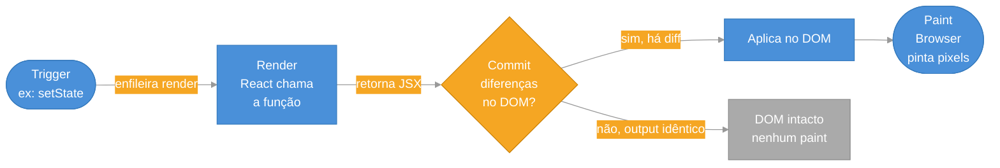
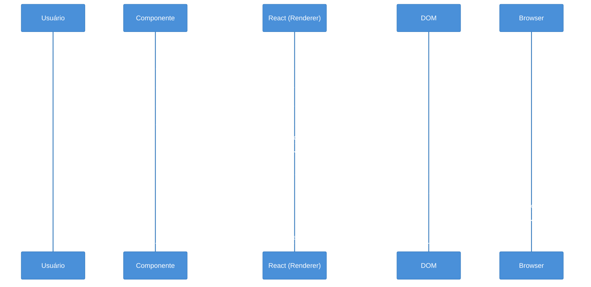

> [!abstract] TL;DR
> Renderizar no React significa **chamar a função do seu componente** para produzir JSX — não é pintar pixels na tela. Depois do render, o React faz o **commit** (atualiza o DOM) e o browser realiza o **paint**. Um re-render é disparado por: mudança de estado (`setState`), re-render do componente pai, ou mudança no contexto consumido. Mudar props **por si só não dispara render** — quem muda a prop é o pai, e é o re-render do pai que causa o do filho. Componentes devem ser **puros**: mesmas entradas → mesmo JSX de saída, sem side effects no corpo. O `StrictMode` renderiza tudo duas vezes em desenvolvimento justamente para pegar impurezas.

## O problema que esta nota resolve

Você mudou um estado, a tela não atualizou. Ou o oposto: a tela ficou re-renderizando sem parar e a aplicação travou. Ou alguém perguntou "por que meu componente está re-renderizando se eu não mudei nenhuma prop?" e você não soube responder.

Para debugar qualquer problema de performance ou comportamento visual no React, você precisa entender **quando e por que o React decide chamar sua função de componente de novo**. Esse mecanismo é simples, mas há uma armadilha clássica que pega quase todo iniciante.

---

## O que "renderizar" significa de verdade

Antes de entender o que *dispara* um render, é precisa ter claro o que a palavra significa — porque ela é usada de forma imprecisa no dia a dia.

**Renderizar = o React chamar a função do seu componente.**

Só isso. Quando o React "renderiza" um componente, ele executa a função e lê o JSX que ela retorna. Não vai para o DOM ainda. Não aparece na tela ainda.

Pense num pintor que está estudando o que vai pintar. Ele analisa o modelo, toma notas do que quer colocar na tela. Ainda não pegou o pincel. Essa fase de análise é o **render**.

Depois de ter o "plano" (o JSX retornado), o React compara com o que já está no DOM e aplica só as diferenças. Essa aplicação é o **commit**. Só depois do commit é que o browser pinta os pixels — o **paint**.

### Os três momentos distintos

```
Trigger → Render → Commit → Paint
```

| Fase | Quem faz | O que acontece |
|------|----------|----------------|
| **Trigger** | Você (via `setState`, etc.) | Enfileira uma solicitação de render |
| **Render** | React | Chama a função do componente, lê o JSX |
| **Commit** | React | Compara com o DOM atual, aplica diferenças |
| **Paint** | Browser | Pinta os pixels na tela |

> [!info] O React controla render e commit. O browser controla o paint.
> Você não aciona o paint diretamente — ele acontece depois que o React aplica as mudanças no DOM.

---

## O fluxo visual completo



Observe o detalhe importante: se o JSX que o componente retorna for **idêntico** ao que já está no DOM, o React não toca no DOM e o browser não repinta nada. Render não implica necessariamente paint.

---

## O que dispara um re-render

Há exatamente três causas de re-render em React. Se nenhuma das três aconteceu, o componente não renderiza.

### 1. Mudança de estado

Quando você chama a função de atualização retornada por `useState` (ou `useReducer`), o React agenda um novo render para **aquele componente e todos os seus descendentes**.

```tsx
import { useState } from "react";

function Contador() {
  const [count, setCount] = useState(0);

  // Ao clicar, count muda → Contador re-renderiza
  return (
    <div>
      <p>Contagem: {count}</p>
      <button onClick={() => setCount(count + 1)}>+1</button>
    </div>
  );
}
```

> [!question]- E se eu chamar `setCount` com o mesmo valor que já está lá?
> O React usa `Object.is` para comparar o valor atual com o novo. Se forem iguais, ele **pula o re-render** — não chama a função de novo. Isso se chama "bailout" e é uma otimização automática do React.

### 2. Re-render do componente pai

Se um componente pai renderiza, **todos os seus filhos também renderizam** — independentemente de as props terem mudado ou não.

```tsx
function Pai() {
  const [toggle, setToggle] = useState(false);

  return (
    <div>
      <button onClick={() => setToggle(!toggle)}>Toggle</button>
      {/* Filho vai re-renderizar sempre que Pai re-renderizar */}
      <Filho mensagem="olá" />
    </div>
  );
}

function Filho({ mensagem }: { mensagem: string }) {
  console.log("Filho renderizou"); // aparece a cada clique no Pai
  return <p>{mensagem}</p>;
}
```

A prop `mensagem` não mudou — continua sendo `"olá"` — mas `Filho` renderizou assim mesmo. Isso desfaz o mito mais comum sobre re-renders.

> [!info] O mito das props
> "Meu componente re-renderizou porque as props mudaram" — na maioria dos casos, quem mudou as props foi o pai, e é o re-render do pai que arrastou o filho. Props que mudam são *consequência* de re-renders do pai, não uma causa independente.

### 3. Mudança no contexto consumido

Quando o valor de um `Context.Provider` muda, **todos os componentes que consumem aquele contexto** re-renderizam, não importa onde estejam na árvore.

```tsx
const TemaContext = React.createContext("claro");

function App() {
  const [tema, setTema] = useState("claro");

  return (
    // Quando tema muda, todo consumidor do TemaContext re-renderiza
    <TemaContext.Provider value={tema}>
      <BotaoTema onChange={setTema} />
      <PaginaPrincipal />
    </TemaContext.Provider>
  );
}

function PaginaPrincipal() {
  const tema = useContext(TemaContext); // vai re-renderizar quando tema mudar
  return <div className={tema}>...</div>;
}
```

---

## O grande mito: props mudando disparam render

Vale reforçar porque esse equívoco causa muita confusão em entrevistas e em debugging.

**Props não disparam re-render por conta própria.**

Para uma prop de um filho mudar, o pai precisa passar um valor diferente. Para o pai passar um valor diferente, o pai teve que re-renderizar. E quando o pai re-renderiza, todos os filhos renderizam — **mesmo que a prop não tenha mudado**.

```tsx
// Cenário: Filho com props que NUNCA mudam, mas ainda assim re-renderiza
function Pai() {
  const [n, setN] = useState(0);
  return (
    <>
      <button onClick={() => setN(n + 1)}>Incrementar pai</button>
      <Filho nome="João" idade={30} /> {/* props fixas, mas Filho renderiza a cada clique */}
    </>
  );
}
```

A solução quando você quer evitar que um filho renderize sem necessidade é `React.memo` — mas isso é assunto de otimização, não de funcionamento básico.

---

## Render deve ser puro

O React exige que a função de um componente seja **pura**: dadas as mesmas props, estado e contexto, deve sempre retornar o mesmo JSX.

O que isso significa na prática:

- **Não modifique variáveis externas** durante o render.
- **Não faça chamadas de rede** no corpo do componente.
- **Não leia dados que mudam entre renders** (como `Date.now()` ou `Math.random()`) sem tratar isso como estado.
- **Não mute o estado diretamente** — sempre use as funções de atualização.

```tsx
// ✅ Componente puro — mesmas entradas, mesmo output
function Saudacao({ nome }: { nome: string }) {
  return <h1>Olá, {nome}!</h1>;
}

// ❌ Impuro — side effect no corpo
let contador = 0;
function ComponenteImpuro() {
  contador++; // muta variável externa durante render!
  return <p>Renderizou {contador} vezes</p>;
}
```

Por que pureza importa? Porque o React pode chamar sua função de componente mais de uma vez (como no Strict Mode), em ordem diferente, ou cancelar e refazer renders. Se seu componente tem side effects no corpo, você vai ter bugs difíceis de reproduzir.

> [!info] Puro não significa sem side effects para sempre
> Side effects *existem* em aplicações React — chamadas de API, timers, eventos. Eles só não podem acontecer **durante o render**. O lugar certo para side effects é o `useEffect`. Veja [[09 - useEffect e o modelo de efeitos]].

---

## StrictMode e o double-render em desenvolvimento

Se você abrir o console e perceber que `console.log` dentro de um componente aparece duas vezes, não é bug seu — é o `StrictMode` trabalhando.

```tsx
// main.tsx
import { StrictMode } from "react";
import { createRoot } from "react-dom/client";

createRoot(document.getElementById("root")!).render(
  <StrictMode>
    <App />
  </StrictMode>
);
```

O `StrictMode` chama a função do componente **duas vezes** em desenvolvimento para detectar impurezas. Se um componente é puro, rodar duas vezes produz o mesmo resultado — nenhum problema. Mas se o componente tem side effects no corpo (como incrementar uma variável global), o double-render vai revelar o problema cedo.

```tsx
// Sem Strict Mode em produção:
// render 1 → contador = 1 → tela mostra 1 ✅

// Com Strict Mode em desenvolvimento:
// render 1 → contador = 1
// render 2 → contador = 2 → tela mostra 2 ❌
// Bug detectado antes de chegar em produção!
```

> [!info] Strict Mode só funciona em desenvolvimento
> Em produção, o React renderiza cada componente uma vez. O double-render é exclusivo do ambiente de dev e não afeta performance em produção.

---

## O fluxo completo de ponta a ponta



Cada etapa tem um responsável: você dispara, o React renderiza e faz commit, o browser pinta.

---

## Armadilhas comuns

> [!warning] Side effect no corpo do componente
> **O que acontece:** Comportamentos estranhos, chamadas de API duplicadas, contadores que saltam valores, bugs que aparecem só em desenvolvimento. **Por quê:** O corpo da função de componente é executado durante o render. Qualquer side effect ali vai rodar a cada re-render — e com StrictMode, duas vezes por render em dev. **Como evitar:** Mova side effects para dentro de `useEffect`. O corpo do componente é só para calcular JSX.

> [!warning] Esperar que o estado mude imediatamente após `setState`
> **O que acontece:** Você chama `setCount(count + 1)` e logo depois lê `count` esperando o novo valor — mas ele ainda tem o valor antigo. **Por quê:** `setState` enfileira um re-render futuro. O estado novo só fica disponível **no próximo render**, não na execução atual. **Como evitar:** Nunca leia o estado logo após `setState` na mesma função. Se precisar do valor novo, calcule-o antes: `const novoValor = count + 1; setCount(novoValor); fazAlgoComNovoValor(novoValor);`

> [!warning] Mutar o estado diretamente
> **O que acontece:** Você muta um objeto ou array no estado e a tela não atualiza — ou atualiza de forma imprevisível. **Por quê:** O React usa `Object.is` para detectar mudanças. Se você muta o objeto mas mantém a mesma referência, o React acha que nada mudou e não re-renderiza. **Como evitar:** Sempre crie um novo objeto/array ao atualizar estado: `setItens([...itens, novoItem])` em vez de `itens.push(novoItem); setItens(itens)`.

> [!warning] Confundir "props mudaram" com "pai re-renderizou"
> **O que acontece:** Você vê um componente re-renderizando e assume que alguma prop mudou, mas não encontra nada diferente nas props. **Por quê:** O re-render foi disparado pelo pai, não pelas props. Qualquer re-render do componente pai arrasta os filhos, mesmo com props idênticas. **Como evitar:** Para confirmar a causa real de um re-render, use o React DevTools (aba "Profiler") ou o componente `<Profiler>`. Se quiser evitar re-renders desnecessários, avalie `React.memo` — mas só depois de confirmar que é um problema real de performance.

---

## Como explicar em inglês

Rendering in React means calling the component function to produce JSX — it does not mean updating the screen. React separates the work into three phases: the trigger (what causes a render), the render (calling the function), and the commit (applying changes to the DOM). The browser paints pixels only after the commit.

A component re-renders when its own state changes, when its parent re-renders, or when a consumed context value changes. Props changing by themselves do not cause re-renders — it is the parent re-render that does.

| Português | English |
|-----------|---------|
| renderizar | render (verb: to render) |
| fase de renderização | render phase |
| fase de commit | commit phase |
| pintura (browser) | paint / browser paint |
| re-renderização | re-render |
| componente puro | pure component |
| efeito colateral | side effect |
| enfileirar um render | schedule a render / queue a render |
| arvore de componentes | component tree |
| modo estrito | Strict Mode |

---

## Renderização em uma frase

Renderizar é o React chamando sua função para descobrir o que mostrar — o que aparece na tela só muda depois do commit e do paint.

---

## O que vem a seguir

Agora que você entende *quando* o React chama seu componente, a próxima pergunta natural é: como o estado funciona por dentro? Por que `useState` preserva o valor entre renders em vez de redeclarar do zero a cada chamada?

- [[05 - useState e estado local]] — como o estado é armazenado e atualizado, e por que ele persiste entre renders
- [[09 - useEffect e o modelo de efeitos]] — como executar side effects fora do render (chamadas de API, subscriptions, timers)
- [[16 - Reconciliation e diffing a fundo]] — como o React decide o que muda no DOM durante o commit: o algoritmo de reconciliação

Consulte também o [[03-Dominios/Tecnologia/React/Dicionário de React|Dicionário de React]] para os termos deste galho.

---

## Referências

- **React Team** — [*Render and Commit*](https://react.dev/learn/render-and-commit) — documentação oficial React, seção "Describing the UI"; explica o fluxo trigger → render → commit com exemplos interativos
- **React Team** — [*Keeping Components Pure*](https://react.dev/learn/keeping-components-pure) — por que pureza é requisito, o que conta como side effect proibido durante render
- **React Team** — [*StrictMode*](https://react.dev/reference/react/StrictMode) — como o double-render funciona e quais funções são chamadas duas vezes
- **Nadia Makarevich (Developer Way)** — [*React Re-renders Guide: Everything, All at Once*](https://www.developerway.com/posts/react-re-renders-guide) — guia prático e abrangente sobre todas as causas de re-render, com exemplos e desmitificação do mito das props
- **React Team** — [*Components and Hooks must be pure*](https://react.dev/reference/rules/components-and-hooks-must-be-pure) — regras formais de pureza para componentes e hooks em React 19
