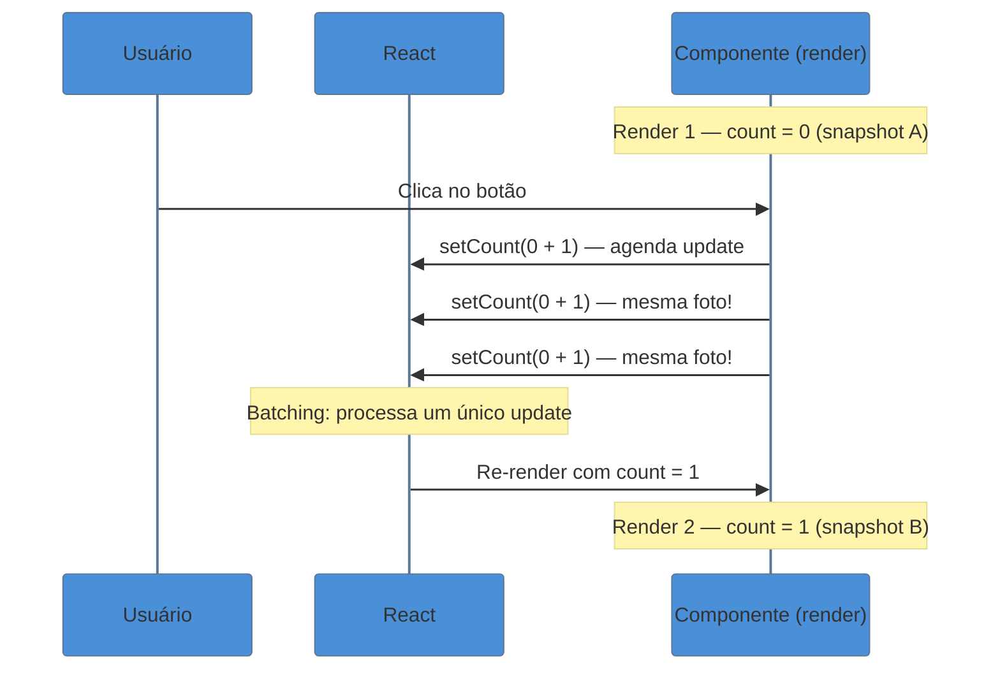

> [!abstract] TL;DR
> `useState` é o hook que dá memória a um componente entre renders. Sem ele, variáveis comuns são recriadas do zero a cada render e nunca alteram o que aparece na tela. A regra de ouro: **estado é imutável** — você nunca modifica o valor atual, você entrega um valor novo ao React e ele decide quando e como atualizar a tela. A *updater function* `setX(prev => ...)` resolve o problema de closures capturarem um estado defasado. No React 18+, múltiplos `setState` dentro do mesmo evento são automaticamente *batcheados* em um único re-render. Quando o estado precisar ser compartilhado, é hora de *levantar* — mas isso fica para [[15 - Estado - local, elevado e externo]].

## O problema: sua variável não está guardando nada

Imagine que você está construindo um contador simples. A primeira tentativa é óbvia:

```tsx
// ❌ Isso NÃO funciona
function Counter() {
  let count = 0;

  function handleClick() {
    count += 1;
    console.log(count); // Mostra 1, 2, 3... mas a tela nunca muda!
  }

  return <button onClick={handleClick}>Cliquei {count} vez(es)</button>;
}
```

Você clica, o console mostra os valores aumentando, mas a tela trava em zero. Por quê?

Porque `count` é uma variável local. Toda vez que o React renderiza o componente — que é literalmente uma chamada de função — `count` começa do zero. E mesmo que você incremente `count` entre renders, o React não sabe que precisa redesenhar a tela. Ele não está "observando" variáveis comuns.

Para resolver isso, precisamos de dois ingredientes:
1. Um lugar para **guardar o valor entre renders** (memória)
2. Uma forma de **avisar o React** que o valor mudou (trigger de re-render)

`useState` fornece os dois.

## A anatomia do useState

```tsx
import { useState } from 'react';

function Counter() {
  const [count, setCount] = useState<number>(0);
  //     ^^^^^  ^^^^^^^^           ^^^^^^  ^^^
  //     valor  setter             tipo    valor inicial

  function handleClick() {
    setCount(count + 1); // Avisa o React: "o estado mudou!"
  }

  return <button onClick={handleClick}>Cliquei {count} vez(es)</button>;
}
```

`useState` retorna um array de dois elementos. Por convenção, desestruturamos como `[valor, setter]`. O setter faz duas coisas ao mesmo tempo: atualiza o valor armazenado no React **e** agenda um re-render do componente.

Pense no `useState` como um post-it colado do lado de fora do componente. Toda vez que a função do componente é chamada de novo, o React pega o post-it e entrega o valor atual. Quando você chama o setter, o React reescreve o post-it e chama a função de novo — um novo render.

### Tipagem: inferência vs anotação explícita

TypeScript consegue inferir o tipo na maioria dos casos:

```tsx
// Inferência automática — funciona bem para tipos simples
const [count, setCount] = useState(0);        // inferido: number
const [name, setName] = useState('');         // inferido: string
const [active, setActive] = useState(false);  // inferido: boolean
```

Mas há casos onde a anotação explícita é necessária ou recomendada:

```tsx
// 1. Estado que começa null mas vira um tipo concreto depois
const [user, setUser] = useState<User | null>(null);

// 2. Arrays — inferência resultaria em `never[]` sem o tipo
const [items, setItems] = useState<string[]>([]);

// 3. Unions — inferência não consegue adivinhar qual union você quer
type Status = 'idle' | 'loading' | 'error' | 'success';
const [status, setStatus] = useState<Status>('idle');

// 4. Objetos complexos
interface FormData {
  email: string;
  password: string;
}
const [form, setForm] = useState<FormData>({ email: '', password: '' });
```

> [!info] Regra prática de tipagem
> Se o valor inicial já deixa claro o tipo (um número, uma string, um booleano), deixe o TS inferir. Se o estado pode ser `null`, um union type, ou um array vazio, anote explicitamente — o erro de compilação vai aparecer antes de virar bug em produção.

## Estado é imutável — sempre entregue um valor novo

Esta é a regra mais importante do `useState`, e também a mais violada por iniciantes.

O React usa comparação por referência para decidir se algo mudou. Se você modifica um objeto ou array no lugar (*mutação*), a referência não muda, o React acha que nada mudou, e não re-renderiza.

```tsx
// ❌ ERRADO: mutando o objeto diretamente
const [user, setUser] = useState<User>({ name: 'Ana', age: 28 });

function birthday() {
  user.age += 1;   // Mutação direta — React não detecta a mudança!
  setUser(user);   // Mesma referência — React ignora
}

// ✅ CERTO: criando um novo objeto com spread
function birthday() {
  setUser({ ...user, age: user.age + 1 }); // Nova referência — React detecta
}
```

O mesmo vale para arrays:

```tsx
const [tasks, setTasks] = useState<string[]>([]);

// ❌ ERRADO: mutando o array
function addTask(task: string) {
  tasks.push(task);  // Mutação!
  setTasks(tasks);   // Mesma referência
}

// ✅ CERTO: criando um novo array
function addTask(task: string) {
  setTasks([...tasks, task]); // Novo array com spread
}

// ✅ CERTO: removendo item
function removeTask(index: number) {
  setTasks(tasks.filter((_, i) => i !== index));
}

// ✅ CERTO: atualizando item específico
function updateTask(index: number, newValue: string) {
  setTasks(tasks.map((task, i) => (i === index ? newValue : task)));
}
```

> [!question]- Por que o React não detecta mutação?
> JavaScript passa objetos e arrays por referência. Quando você faz `user.age += 1`, você está alterando o objeto que a referência aponta — mas a referência em si (o endereço de memória) não muda. O React compara `Object.is(antigaRef, novaRef)`, e `Object.is(user, user)` é sempre `true`. Para o React, parece que você entregou exatamente o mesmo valor.

## Estado como snapshot — cada render é uma fotografia

Aqui mora uma das maiores fontes de confusão com `useState`.

Quando o React chama seu componente, o valor de `count` (ou qualquer estado) fica **congelado** para aquele render específico. Pense como uma fotografia: cada render tem sua própria foto do estado, e nenhuma ação pode alterar a foto já tirada.

```tsx
function Counter() {
  const [count, setCount] = useState(0);

  function handleClick() {
    setCount(count + 1); // count é 0 aqui
    setCount(count + 1); // count ainda é 0! (snapshot do render atual)
    setCount(count + 1); // count ainda é 0!
  }
  // Resultado: count vai para 1, não para 3!

  return <button onClick={handleClick}>{count}</button>;
}
```

Por que os três `setCount` resultam em apenas `+1`? Porque `count` é `0` para todo o render atual, e `0 + 1 = 1` três vezes ainda é `1`.

O diagrama abaixo ilustra como cada render tem seu próprio snapshot:



## A updater function: escapando do snapshot

Para incrementar o estado com base no valor *mais recente* — não no snapshot do render atual — use a forma funcional do setter:

```tsx
function Counter() {
  const [count, setCount] = useState(0);

  function handleTripleClick() {
    setCount(prev => prev + 1); // prev = valor mais recente
    setCount(prev => prev + 1); // prev = 1
    setCount(prev => prev + 1); // prev = 2
  }
  // Resultado: count vai para 3!

  return <button onClick={handleTripleClick}>{count}</button>;
}
```

A *updater function* `prev => prev + 1` não lê o snapshot do render. Ela entra na fila de updates do React e recebe o valor resultante do update anterior como argumento. É como dar instruções: "qualquer que seja o valor atual, some 1".

### Quando usar a updater function?

Use `setX(prev => ...)` quando:
1. O novo estado depende do estado anterior
2. Você chama o setter múltiplas vezes no mesmo handler
3. O setter está dentro de um `useEffect`, `setTimeout`, `setInterval` ou callback assíncrono

```tsx
// ✅ Caso clássico: incremento confiável
function increment() {
  setCount(prev => prev + 1);
}

// ✅ Objeto: atualização segura de uma propriedade
function updateAge(newAge: number) {
  setUser(prev => ({ ...prev, age: newAge }));
}

// ✅ Array: toggle de item
function toggleItem(id: number) {
  setSelected(prev =>
    prev.includes(id)
      ? prev.filter(i => i !== id)
      : [...prev, id]
  );
}
```

## Batching — React agrupa suas atualizações

Quando você chama `setCount` várias vezes dentro de um event handler, o React **não** re-renderiza entre cada chamada. Ele agrupa todos os updates e executa um único re-render no final. Isso se chama *batching*.

```tsx
function handleEvent() {
  setCount(c => c + 1);   // Não re-renderiza ainda
  setName('Ana');          // Não re-renderiza ainda
  setLoading(false);       // Não re-renderiza ainda
  // React faz UM único re-render aqui
}
```

**React 18+**: o batching é automático em *todos* os contextos — event handlers, setTimeout, Promises, fetch callbacks. Antes do React 18, batching só funcionava em event handlers do React.

```tsx
// React 18+: funciona em contextos assíncronos também
async function fetchUser() {
  const data = await fetchFromAPI();
  setUser(data.user);      // Não re-renderiza ainda
  setLoading(false);       // Não re-renderiza ainda
  setError(null);          // Não re-renderiza ainda
  // Um único re-render
}
```

> [!info] flushSync — quando você realmente precisa de renders síncronos
> Em casos raros (integração com bibliotecas não-React, animações precisas), você pode forçar um re-render imediato com `flushSync` do `react-dom`. Use com cautela — quebra a otimização de batching.

## Lazy initial state — evitando custo de inicialização

O valor inicial do `useState` é calculado apenas no primeiro render. Mas se você passa uma expressão como valor inicial, ela ainda é *avaliada* (mesmo que descartada) em cada render:

```tsx
// ❌ Ineficiente: parsear JSON em todo render
const [data, setData] = useState(JSON.parse(localStorage.getItem('data') ?? '{}'));

// ✅ Lazy initialization: função executada apenas no primeiro render
const [data, setData] = useState(() => JSON.parse(localStorage.getItem('data') ?? '{}'));
```

A diferença é sutil mas importante: ao passar uma *função* (não o resultado dela), o React chama essa função somente no primeiro render e usa o retorno como valor inicial. Útil para:
- Leitura de `localStorage` / `sessionStorage`
- Cálculos pesados (filtrar lista grande, parsear JSON)
- Criação de objetos complexos

```tsx
// Exemplo real: filtro inicial a partir de query params
const [filter, setFilter] = useState<FilterState>(() => {
  const params = new URLSearchParams(window.location.search);
  return {
    search: params.get('q') ?? '',
    category: params.get('cat') ?? 'all',
    page: Number(params.get('page') ?? '1'),
  };
});
```

## Casos práticos

### Caso 1: formulário controlado com estado de objeto

O padrão mais comum em aplicações reais: cada campo do formulário é parte de um estado-objeto único.

```tsx
interface LoginForm {
  email: string;
  password: string;
}

function LoginPage() {
  const [form, setForm] = useState<LoginForm>({
    email: '',
    password: '',
  });

  function handleChange(e: React.ChangeEvent<HTMLInputElement>) {
    const { name, value } = e.target;
    // Spread para não perder os outros campos!
    setForm(prev => ({ ...prev, [name]: value }));
  }

  function handleSubmit(e: React.FormEvent) {
    e.preventDefault();
    console.log('Submit:', form);
  }

  return (
    <form onSubmit={handleSubmit}>
      <input
        name="email"
        type="email"
        value={form.email}
        onChange={handleChange}
        placeholder="E-mail"
      />
      <input
        name="password"
        type="password"
        value={form.password}
        onChange={handleChange}
        placeholder="Senha"
      />
      <button type="submit">Entrar</button>
    </form>
  );
}
```

### Caso 2: lista de tarefas — add, toggle, remove

Demonstra os três padrões de array imutável em um componente real:

```tsx
interface Task {
  id: number;
  text: string;
  done: boolean;
}

function TodoList() {
  const [tasks, setTasks] = useState<Task[]>([]);
  const [input, setInput] = useState('');

  function addTask() {
    if (!input.trim()) return;
    setTasks(prev => [
      ...prev,
      { id: Date.now(), text: input.trim(), done: false },
    ]);
    setInput(''); // Limpa o campo
  }

  function toggleTask(id: number) {
    setTasks(prev =>
      prev.map(task =>
        task.id === id ? { ...task, done: !task.done } : task
      )
    );
  }

  function removeTask(id: number) {
    setTasks(prev => prev.filter(task => task.id !== id));
  }

  return (
    <div>
      <input
        value={input}
        onChange={e => setInput(e.target.value)}
        onKeyDown={e => e.key === 'Enter' && addTask()}
        placeholder="Nova tarefa..."
      />
      <button onClick={addTask}>Adicionar</button>
      <ul>
        {tasks.map(task => (
          <li key={task.id}>
            <span
              style={{ textDecoration: task.done ? 'line-through' : 'none' }}
              onClick={() => toggleTask(task.id)}
            >
              {task.text}
            </span>
            <button onClick={() => removeTask(task.id)}>✕</button>
          </li>
        ))}
      </ul>
    </div>
  );
}
```

### Caso 3: estado com múltiplas fases (status machine simples)

```tsx
type FetchStatus = 'idle' | 'loading' | 'success' | 'error';

interface SearchResult {
  id: number;
  title: string;
}

function SearchBox() {
  const [query, setQuery] = useState('');
  const [status, setStatus] = useState<FetchStatus>('idle');
  const [results, setResults] = useState<SearchResult[]>([]);
  const [errorMessage, setErrorMessage] = useState('');

  async function handleSearch() {
    if (!query.trim()) return;
    setStatus('loading');
    setResults([]);
    setErrorMessage('');

    try {
      const res = await fetch(`/api/search?q=${encodeURIComponent(query)}`);
      if (!res.ok) throw new Error('Erro na busca');
      const data: SearchResult[] = await res.json();
      setResults(data);
      setStatus('success');
    } catch (err) {
      setErrorMessage(err instanceof Error ? err.message : 'Erro desconhecido');
      setStatus('error');
    }
  }

  return (
    <div>
      <input value={query} onChange={e => setQuery(e.target.value)} />
      <button onClick={handleSearch} disabled={status === 'loading'}>
        {status === 'loading' ? 'Buscando...' : 'Buscar'}
      </button>
      {status === 'error' && <p style={{ color: 'red' }}>{errorMessage}</p>}
      {status === 'success' && results.length === 0 && <p>Nenhum resultado.</p>}
      <ul>
        {results.map(r => <li key={r.id}>{r.title}</li>)}
      </ul>
    </div>
  );
}
```

> [!question]- Quando minha lista de estados fica grande, ainda uso useState ou mudo para useReducer?
> Quando você tem 4+ estados relacionados que evoluem juntos (como o caso do SearchBox acima), ou quando as transições entre estados têm regras explícitas, useReducer é uma escolha melhor. Ele agrupa a lógica de transição em um único lugar e torna os estados impossíveis (ex: `loading: true` e `success: true` ao mesmo tempo) mais difíceis de acontecer. Veja [[12 - useReducer e estado complexo]].

## Armadilhas comuns

> [!warning] Mutar estado diretamente
> **O que acontece:** você altera `obj.prop = valor` ou `arr.push(item)` e a tela não atualiza — ou atualiza de forma imprevisível.
> **Por quê:** React usa comparação de referência (`Object.is`). Mutação não muda a referência, então o React acha que nada mudou e não re-renderiza.
> **Como evitar:** sempre crie um novo objeto/array. Use spread `{ ...obj, prop: valor }` para objetos, `[...arr, item]` / `arr.filter()` / `arr.map()` para arrays. Se precisar de estruturas mais complexas, considere [Immer](https://immerjs.github.io/immer/).

> [!warning] Ler o estado logo após o setState
> **O que acontece:** você chama `setCount(count + 1)` e na linha seguinte lê `count` esperando o novo valor — mas ainda vê o valor antigo.
> **Por quê:** `setCount` não muda `count` imediatamente. O estado só muda *no próximo render*. `count` é um valor do render atual (snapshot), não uma referência reativa.
> **Como evitar:** nunca leia o estado logo após setar. Se precisar do novo valor calculado, calcule antes: `const newCount = count + 1; setCount(newCount); doSomething(newCount);`

> [!warning] Stale closure em setInterval / setTimeout
> **O que acontece:** você usa `setInterval` dentro de `useEffect` e o callback continua mostrando o valor inicial do estado, mesmo depois de várias atualizações.
> **Por quê:** o callback do `setInterval` é criado no momento do mount e captura o valor de `count` naquele instante. Cada render cria um novo `count`, mas o interval continua usando o valor antigo (a closure "velha").
> **Como evitar:** use a updater function (`setCount(prev => prev + 1)`) dentro do callback — ela não depende da closure para calcular o novo valor. Ou, no React 19.2+, use `useEffectEvent` para ter acesso ao estado mais recente dentro de callbacks sem precisar de dependências.
>
> ```tsx
> // ❌ Stale closure — count nunca passa de 1
> useEffect(() => {
>   const id = setInterval(() => {
>     setCount(count + 1); // "count" é sempre 0 (snapshot do mount)
>   }, 1000);
>   return () => clearInterval(id);
> }, []); // deps vazias = fecha sobre count = 0
>
> // ✅ Updater function — resolve sem deps
> useEffect(() => {
>   const id = setInterval(() => {
>     setCount(prev => prev + 1); // Sempre incrementa o valor real
>   }, 1000);
>   return () => clearInterval(id);
> }, []);
> ```

> [!warning] Criar objetos como estado inicial inline sempre
> **O que acontece:** `useState({ x: 0, y: 0 })` parece inocente, mas se estiver dentro de um cálculo pesado, esse cálculo roda em todo render (mesmo que descartado).
> **Por quê:** o argumento de `useState` é avaliado em cada chamada da função-componente. O React ignora o resultado após o primeiro render, mas o custo computacional ainda existe.
> **Como evitar:** passe uma função inicializadora quando a inicialização for cara: `useState(() => computeExpensiveValue())`.

> [!warning] Chamar useState condicionalmente
> **O que acontece:** você tenta colocar `useState` dentro de um `if` e React lança um erro na runtime.
> **Por quê:** o React rastreia a ordem de todos os hooks por index. Se um hook aparece condicionalmente, a ordem pode mudar entre renders e o React perde o controle.
> **Como evitar:** sempre chame hooks no topo do componente, fora de condicionais, loops e funções aninhadas. Esta é a primeira Regra dos Hooks.

## Como explicar em inglês

State in React is the component's memory — data that persists between renders and, when changed, triggers a re-render. The `useState` hook returns the current value and a setter function. You must never mutate state directly; instead, you provide a new value or use the updater function form `setState(prev => ...)` to safely derive the next state from the previous one.

| PT | EN |
|----|-----|
| estado | state |
| setter / função de atualização | setter / state updater |
| render | render |
| re-renderizar | re-render |
| imutável | immutable |
| snapshot de estado | state snapshot |
| closure velha / stale | stale closure |
| inicialização lazy | lazy initialization |
| agrupamento de atualizações | batching / automatic batching |
| levantar estado | lift state up |
| updater function | updater function / functional update |

## Quando levantar o estado

`useState` é perfeito enquanto o estado pertence a um único componente. Mas assim que dois componentes precisam ler ou alterar o mesmo estado, ele precisa *subir* para o ancestral comum mais próximo.

Este tema — quando e como levantar o estado, e quando ir além para estado global — é aprofundado em [[15 - Estado - local, elevado e externo]]. Por ora, o sinal de alerta é simples: se você começar a passar props de estado para muitos níveis abaixo, ou se dois componentes "irmãos" precisarem se sincronizar, é hora de levantar.

## O que vem a seguir

Agora que você entende como o estado vive dentro de um componente, a próxima peça natural é entender o que faz o React decidir *quando* redesenhar a tela. Nem toda mudança de estado gera um re-render caro — o React tem regras precisas para isso.

- [[04 - Renderização - o que dispara um render]] — entenda quando o React decide redesenhar, como o algoritmo de reconciliação funciona e por que renders extras nem sempre são problema
- [[12 - useReducer e estado complexo]] — quando `useState` vira sopa de estados e você precisa de transições explícitas, o `useReducer` organiza a lógica em um só lugar
- [[15 - Estado - local, elevado e externo]] — o ciclo completo do estado: de local a compartilhado entre componentes, até gerenciadores externos como Zustand ou Redux

Veja também o [[03-Dominios/Tecnologia/React/Dicionário de React|Dicionário de React]] para definições rápidas dos termos usados nesta nota.

## useState em uma frase

`useState` é a memória de um componente: guarda um valor entre renders e avisa o React quando ele muda, sempre exigindo um valor novo em vez de mutação do existente.

## Fontes

- **React Team** — [*useState — React Docs*](https://react.dev/reference/react/useState) — referência oficial completa com exemplos e sandbox interativo
- **Dmitri Pavlutin** — [*Be Aware of Stale Closures when Using React Hooks*](https://dmitripavlutin.com/react-hooks-stale-closures/) — melhor explicação disponível sobre stale closures com `useState`
- **LogRocket** — [*React Hooks cheat sheet: Best practices with examples*](https://blog.logrocket.com/react-hooks-cheat-sheet-solutions-common-problems/) — referência consolidada de patterns e armadilhas
- **CodeWithSeb** — [*React 19.2 Release Guide: Activity, useEffectEvent, SSR Batching*](https://www.codewithseb.com/blog/react-19-2-release-guide-activity-useeffectevent-ssr-batching-and-more-explained) — contexto das novidades React 19.2, incluindo `useEffectEvent` estável
- **DEV Community / Ronaiza Cardoso** — [*Maximizing Performance with Lazy Initialization in useState*](https://dev.to/ronaizacardoso/maximizing-performance-with-lazy-initialization-in-react-usestate-3n5m) — guia prático de lazy initialization com casos de uso reais
