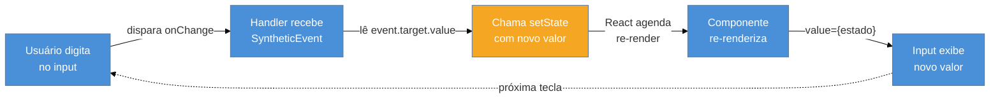

# Eventos e formulários controlados

> [!abstract] TL;DR
> React não usa eventos do DOM diretamente — ele os envolve em **Synthetic Events**, um wrapper cross-browser que normaliza o comportamento entre navegadores. Desde o React 17, o **event pooling foi removido**: você pode acessar `event.target.value` em qualquer momento, sem chamar `event.persist()`. Formulários controlados amarram o `value` de cada input ao estado React via `onChange`, tornando o estado a única fonte de verdade. Para tipar corretamente: `React.ChangeEvent<HTMLInputElement>`, `React.FormEvent<HTMLFormElement>`, `React.MouseEvent<HTMLButtonElement>`. Formulários complexos com validação: considere React Hook Form (RHF).

---

## O problema: por que precisamos "controlar" os eventos?

Imagine que você tem um campo de busca. O usuário digita, e você quer filtrar resultados em tempo real. Como você sabe o que o usuário digitou?

No HTML puro, você leria o DOM diretamente: `document.getElementById('busca').value`. Mas em React, manipular o DOM diretamente é ir contra a maré — o React é a única entidade que deve saber o estado da tela.

A solução React é conectar o input ao estado: o estado guarda o valor digitado, o input exibe o valor do estado, e a cada tecla pressionada o estado é atualizado. Esse ciclo — **valor do input amarrado ao estado** — é o coração dos formulários controlados.

Mas antes de chegar no formulário, precisamos entender o sistema de eventos que torna esse ciclo possível.

---

## Synthetic Events: o intérprete do React

Quando você clica em um botão HTML, o navegador dispara um `MouseEvent` nativo. O problema é que cada navegador implementa esse evento de forma levemente diferente — propriedades com nomes distintos, comportamentos inconsistentes no IE (sim, ainda existe em projetos legados).

O React resolve isso com um **Synthetic Event**: um wrapper que envolve o evento nativo e expõe uma API consistente, independente do navegador.

```
Usuário clica no botão
       │
       ▼
  Navegador dispara evento nativo (MouseEvent)
       │
       ▼
  React captura na raiz do DOM (event delegation)
       │
       ▼
  React cria SyntheticEvent wrappando o nativo
       │
       ▼
  Seu handler recebe o SyntheticEvent
```

> [!info] Event delegation: um listener, todos os eventos
> Em vez de colocar um listener em cada elemento, o React coloca **um único listener na raiz da sua aplicação** (o `<div id="root">`). Quando um evento sobe pelo DOM (bubbling), o React o intercepta e despacha pro handler correto. Isso é mais eficiente e é chamado de *event delegation*.
>
> Antes do React 17, esse listener ficava no `document`. A partir do React 17, ele fica no container raiz — o que permite múltiplas versões do React na mesma página sem conflito.

### Event pooling: a "pegadinha" que não existe mais

Antes do React 17, havia uma otimização chamada **event pooling**: o React reutilizava o mesmo objeto de evento entre chamadas. Isso significava que, ao acessar `event.target.value` de forma assíncrona (dentro de um `setTimeout`, por exemplo), o valor já tinha sido zerado.

```tsx
// React 16: PROBLEMA (não fazer assim)
function handleChange(event: React.ChangeEvent<HTMLInputElement>) {
  setTimeout(() => {
    console.log(event.target.value); // 🚨 null — evento já foi "reciclado"
  }, 1000);
}
```

A solução era chamar `event.persist()`. Hoje isso é história.

**React 17+ removeu o event pooling.** O objeto de evento persiste pelo tempo que você precisar:

```tsx
// React 17+: funciona normalmente
function handleChange(event: React.ChangeEvent<HTMLInputElement>) {
  setTimeout(() => {
    console.log(event.target.value); // ✅ funciona normalmente
  }, 1000);
}
```

> [!info] e.persist() em 2026
> Se você encontrar código legado chamando `event.persist()`, pode remover — o método ainda existe (para não quebrar código antigo), mas não faz nada.

---

## Handlers básicos e tipagem com TypeScript

Cada tipo de elemento DOM que dispara eventos tem seu tipo correspondente. A regra é simples: o tipo do evento carrega o elemento que o originou como genérico.

### onClick — cliques em botões

```tsx
function BotaoSalvar() {
  function handleClick(event: React.MouseEvent<HTMLButtonElement>) {
    event.preventDefault(); // evita comportamento padrão (ex: submit em form)
    console.log('Botão clicado!', event.currentTarget);
  }

  return <button onClick={handleClick}>Salvar</button>;
}
```

O tipo `React.MouseEvent<HTMLButtonElement>` diz: "é um evento de mouse originado em um `<button>`". Isso dá acesso a `event.currentTarget` já tipado como `HTMLButtonElement`.

### onChange — mudanças em inputs

```tsx
function CampoNome() {
  const [nome, setNome] = React.useState('');

  function handleChange(event: React.ChangeEvent<HTMLInputElement>) {
    setNome(event.target.value);
  }

  return <input type="text" value={nome} onChange={handleChange} />;
}
```

`React.ChangeEvent<HTMLInputElement>` — o `event.target` é um `HTMLInputElement`, então `event.target.value` é uma string e o TypeScript sabe disso.

### onSubmit — envio de formulário

```tsx
function FormularioLogin() {
  const [email, setEmail] = React.useState('');

  function handleSubmit(event: React.FormEvent<HTMLFormElement>) {
    event.preventDefault(); // 🚨 ESSENCIAL — evita reload da página
    console.log('Submetendo com email:', email);
  }

  return (
    <form onSubmit={handleSubmit}>
      <input
        type="email"
        value={email}
        onChange={(e) => setEmail(e.target.value)}
      />
      <button type="submit">Entrar</button>
    </form>
  );
}
```

> [!question]- Por que `event.preventDefault()` no submit?
> Quando um formulário HTML é submetido sem JavaScript, o navegador faz um request HTTP completo e recarrega a página. Em apps React de página única (SPA), esse reload destruiria o estado da aplicação. `preventDefault()` cancela esse comportamento padrão e deixa o JavaScript assumir.

---

## Fluxo do formulário controlado: o ciclo completo

O diagrama abaixo mostra o que acontece a cada tecla pressionada em um input controlado:



O ponto crítico é que **o input não exibe o que o usuário digitou diretamente** — ele exibe o que está no estado React. A diferença parece sutil, mas é fundamental: o estado React é sempre a fonte de verdade.

---

## Formulários controlados na prática

### Input de texto simples

```tsx
import { useState } from 'react';

function FormularioNome() {
  const [nome, setNome] = useState('');

  return (
    <div>
      <input
        type="text"
        value={nome}
        onChange={(e: React.ChangeEvent<HTMLInputElement>) => setNome(e.target.value)}
        placeholder="Seu nome"
      />
      <p>Olá, {nome || 'visitante'}!</p>
    </div>
  );
}
```

### Checkbox controlado

O checkbox é diferente: você lê `event.target.checked` (boolean), não `event.target.value`.

```tsx
function FormularioTermos() {
  const [aceitou, setAceitou] = useState(false);

  return (
    <label>
      <input
        type="checkbox"
        checked={aceitou}
        onChange={(e: React.ChangeEvent<HTMLInputElement>) => setAceitou(e.target.checked)}
      />
      Aceito os termos de uso
    </label>
  );
}
```

> [!info] checked vs value
> Para checkboxes e radio buttons, a prop de controle é `checked` (boolean), não `value`. O `value` em um checkbox representa o valor que vai para o payload do form HTML nativo — irrelevante em forms controlados React.

### Select controlado

```tsx
function SeletorCor() {
  const [cor, setCor] = useState('azul');

  return (
    <select
      value={cor}
      onChange={(e: React.ChangeEvent<HTMLSelectElement>) => setCor(e.target.value)}
    >
      <option value="azul">Azul</option>
      <option value="vermelho">Vermelho</option>
      <option value="verde">Verde</option>
    </select>
  );
}
```

A prop `value` no `<select>` controla qual `<option>` está selecionada. React compara `value` do select com o `value` de cada option e marca a correspondente como selecionada.

### Textarea controlado

```tsx
function CampoMensagem() {
  const [mensagem, setMensagem] = useState('');

  return (
    <textarea
      value={mensagem}
      onChange={(e: React.ChangeEvent<HTMLTextAreaElement>) => setMensagem(e.target.value)}
      rows={4}
      placeholder="Sua mensagem..."
    />
  );
}
```

> [!info] textarea em React vs HTML
> No HTML, o conteúdo do textarea fica entre as tags: `<textarea>Conteúdo aqui</textarea>`. Em React, o textarea é uma tag autofechante e você usa a prop `value`, assim como no input. Mais consistente, menos pegadinha.

---

## Formulário completo com múltiplos campos

Aqui está um exemplo real de um formulário de cadastro com estado agrupado:

```tsx
import { useState } from 'react';

interface FormData {
  nome: string;
  email: string;
  newsletter: boolean;
  plano: string;
}

function FormularioCadastro() {
  const [form, setForm] = useState<FormData>({
    nome: '',
    email: '',
    newsletter: false,
    plano: 'gratuito',
  });

  function handleChange(
    e: React.ChangeEvent<HTMLInputElement | HTMLSelectElement>
  ) {
    const { name, value, type } = e.target;
    // Checkbox precisa de tratamento especial
    const checked = (e.target as HTMLInputElement).checked;

    setForm((prev) => ({
      ...prev,
      [name]: type === 'checkbox' ? checked : value,
    }));
  }

  function handleSubmit(e: React.FormEvent<HTMLFormElement>) {
    e.preventDefault();
    console.log('Dados do formulário:', form);
    // Aqui você enviaria para uma API
  }

  return (
    <form onSubmit={handleSubmit}>
      <input
        name="nome"
        type="text"
        value={form.nome}
        onChange={handleChange}
        placeholder="Nome completo"
      />

      <input
        name="email"
        type="email"
        value={form.email}
        onChange={handleChange}
        placeholder="Email"
      />

      <label>
        <input
          name="newsletter"
          type="checkbox"
          checked={form.newsletter}
          onChange={handleChange}
        />
        Receber newsletter
      </label>

      <select name="plano" value={form.plano} onChange={handleChange}>
        <option value="gratuito">Gratuito</option>
        <option value="pro">Pro</option>
      </select>

      <button type="submit">Cadastrar</button>
    </form>
  );
}
```

O truque de `[name]: value` usa a prop `name` do HTML para atualizar a chave correta do estado com um único handler — uma técnica clássica para reduzir código repetitivo.

---

## Passar argumentos para handlers: inline vs declarado

Às vezes você precisa passar dados extras para um handler. Há duas abordagens:

### Arrow function inline

```tsx
function ListaItens({ itens }: { itens: string[] }) {
  function handleRemover(item: string) {
    console.log('Removendo:', item);
  }

  return (
    <ul>
      {itens.map((item) => (
        <li key={item}>
          {item}
          {/* Arrow function cria nova função a cada render */}
          <button onClick={() => handleRemover(item)}>Remover</button>
        </li>
      ))}
    </ul>
  );
}
```

A arrow function `() => handleRemover(item)` é uma nova função criada a cada render. Em listas pequenas, isso é irrelevante. Em listas grandes ou componentes que renderizam muitas vezes, pode ser otimizado com `useCallback` — mas só quando houver problema real de performance.

### Handler com dados via closure

```tsx
function handleRemover(item: string) {
  return function(event: React.MouseEvent<HTMLButtonElement>) {
    event.stopPropagation(); // impede bubbling se necessário
    console.log('Removendo:', item);
  };
}

// Uso:
<button onClick={handleRemover(item)}>Remover</button>
```

Aqui `handleRemover(item)` retorna um handler. Mais elegante em alguns casos, mas ainda cria uma nova função por render.

---

## stopPropagation: quando o evento não deve subir

O evento de click "sobe" pelo DOM (bubbling). Se você tem um card clicável com um botão dentro, clicar no botão também dispara o click do card:

```tsx
function Card({ onClick }: { onClick: () => void }) {
  function handleBotaoClick(e: React.MouseEvent<HTMLButtonElement>) {
    e.stopPropagation(); // impede que o click suba pro Card
    console.log('Ação do botão');
  }

  return (
    <div onClick={onClick} style={{ cursor: 'pointer' }}>
      <p>Clique no card para selecionar</p>
      <button onClick={handleBotaoClick}>Ação específica</button>
    </div>
  );
}
```

> [!question]- Diferença entre preventDefault e stopPropagation?
> - `preventDefault()`: cancela o comportamento padrão do navegador (submit que recarrega, link que navega). O evento ainda sobe pelo DOM.
> - `stopPropagation()`: impede que o evento suba para elementos pai. Não cancela o comportamento padrão.
> São independentes — você pode chamar ambos se precisar.

---

## Formulários não controlados: uma prévia

Há uma alternativa ao modelo controlado: deixar o DOM cuidar do estado do input e ler o valor só quando precisar, usando `ref`. Esse padrão é chamado de formulário não controlado.

```tsx
// Prévia — aprofundado em 15 - Estado: local, elevado e externo
function FormularioBusca() {
  const inputRef = React.useRef<HTMLInputElement>(null);

  function handleSubmit(e: React.FormEvent<HTMLFormElement>) {
    e.preventDefault();
    console.log(inputRef.current?.value); // lê valor direto do DOM
  }

  return (
    <form onSubmit={handleSubmit}>
      <input ref={inputRef} type="text" defaultValue="" />
      <button type="submit">Buscar</button>
    </form>
  );
}
```

A diferença: `value` (controlado) vs `defaultValue` (não controlado). A nota [[15 - Estado - local, elevado e externo]] explora quando cada abordagem faz mais sentido.

---

## Quando usar uma biblioteca de formulários

Para formulários simples (2-5 campos), o padrão controlado com `useState` é perfeitamente suficiente. Quando a coisa cresce — validação complexa, campos dinâmicos, 10+ campos, integração com Zod/Yup — o boilerplate começa a pesar.

**React Hook Form (RHF)** é a biblioteca mais popular para esse cenário em 2026. Ela usa inputs não controlados por padrão (sem re-render a cada tecla) e oferece uma API declarativa para validação. A nota de forms avançados explora a integração completa.

> [!question]- Por que RHF usa inputs não controlados?
> Formulários controlados re-renderizam o componente a cada tecla pressionada. Em um formulário grande, isso significa dezenas de re-renders por segundo. RHF usa refs para ler os valores só quando necessário (submit, validação), evitando os re-renders intermediários. O resultado é mais performance com menos código.

---

## Armadilhas comuns

> [!warning] Input controlado sem onChange — o input congela
> **O que acontece:** você define `value={nome}` mas não define `onChange`. O input fica completamente imóvel — o usuário não consegue digitar nada.
> **Por quê:** sem `onChange`, o estado nunca muda. Como o input exibe o estado, ele fica "preso" no valor atual.
> **Como evitar:** sempre que definir `value`, defina também `onChange`. O TypeScript com tipos corretos vai alertar se você esquecer o handler.
>
> ```tsx
> // 🚨 Errado — input congela
> <input value={nome} />
>
> // ✅ Correto
> <input value={nome} onChange={(e) => setNome(e.target.value)} />
> ```

> [!warning] Esquecer preventDefault no submit — página recarrega
> **O que acontece:** o formulário é submetido, a página recarrega (ou navega para a mesma URL com query params) e todo o estado React é perdido.
> **Por quê:** o comportamento padrão de um `<form>` HTML é fazer um GET/POST e navegar. `preventDefault()` cancela isso.
> **Como evitar:** todo `onSubmit` em React deve começar com `event.preventDefault()`. Sem exceção.

> [!warning] Recriar o handler dentro de um map — performance em listas grandes
> **O que acontece:** em uma lista de 500 itens, cada render cria 500 novas funções de handler anônimas.
> **Por quê:** `() => handleClick(item)` é uma nova referência de função a cada chamada de render.
> **Como evitar:** para listas pequenas, ignore — a diferença é imperceptível. Para listas grandes, use `useCallback` com dependências corretas, ou passe o `id` do item via `data-*` e leia no handler: `event.currentTarget.dataset.id`.

> [!warning] Tipar o handler como any — perde os benefícios do TypeScript
> **O que acontece:** `function handleChange(event: any)` compila, mas você perde autocompletar, verificação de `.target.value`, e a segurança de tipos.
> **Por quê:** `any` desliga o TypeScript localmente.
> **Como evitar:** use os tipos corretos. Em caso de dúvida, deixe o TypeScript inferir: `onChange={e => setValue(e.target.value)}` — o TypeScript infere `e` como `React.ChangeEvent<HTMLInputElement>` pelo contexto.

---

## Como explicar em inglês

> React wraps native browser events in **Synthetic Events** — a cross-browser abstraction that normalizes event behavior. Since React 17, event pooling has been removed, so you can safely access event properties asynchronously. In **controlled components**, the input value is always driven by React state: every keystroke calls `onChange`, updates the state, and triggers a re-render that reflects the new value in the input. This makes React state the single source of truth for form data.

| PT | EN |
|----|-----|
| Evento sintético | Synthetic Event |
| Formulário controlado | Controlled component / Controlled form |
| Formulário não controlado | Uncontrolled component |
| Prevenção do padrão | `preventDefault()` |
| Propagação | Event bubbling / propagation |
| Fonte de verdade | Single source of truth |
| Handler de evento | Event handler |
| Delegação de eventos | Event delegation |
| Checkbox marcado | Checked checkbox |

---

## Formulário controlado em uma frase

> Em um formulário controlado, o React é o dono do valor — o input só exibe o que o estado diz.

---

## O que vem a seguir

Entender eventos e formulários controlados abre as portas para os próximos desafios. Quando o formulário cresce — validação em tempo real, campos que aparecem e somem, estado que precisa ser compartilhado entre componentes — precisamos de ferramentas mais sofisticadas.

- [[05 - useState e estado local]] — fundação que torna possível o formulário controlado: estado local e o ciclo de re-render que "move" o input
- [[03-Dominios/Tecnologia/React/TypeScript com React/06 - Tipando event handlers|Tipando event handlers]] — mergulho fundo nos tipos de eventos: `React.ChangeEventHandler`, `ComponentPropsWithRef`, e como tipar componentes que aceitam handlers externos
- [[03-Dominios/Tecnologia/React/Dicionário de React|Dicionário de React]] — referência rápida para os termos: Controlled Component, Synthetic Event, Event Delegation, e outros

---

## Referências

- **Documentação oficial do React** — [*Responding to Events*](https://react.dev/learn/responding-to-events) — fonte primária para o modelo de eventos e formulários controlados
- **Documentação oficial do React** — [*Forms*](https://react.dev/reference/react-dom/components/form) — referência para forms, incluindo a nova `<form>` com Actions do React 19
- **React TypeScript Cheatsheet** — [*Forms and Events*](https://react-typescript-cheatsheet.netlify.app/docs/basic/getting-started/forms_and_events/) — referência de tipagem de eventos: os tipos corretos para cada elemento
- **Saeloun Blog** — [*React 17 removes event pooling*](https://blog.saeloun.com/2021/04/06/react-17-removes-event-pooling-in-modern-system/) — explicação detalhada da remoção do event pooling e o impacto prático
- **LogRocket Blog** — [*React Hook Form vs. React 19*](https://blog.logrocket.com/react-hook-form-vs-react-19/) — análise comparativa de quando usar RHF vs abordagem nativa em 2025
- **React Hook Form** — [*react-hook-form.com*](https://react-hook-form.com) — biblioteca para formulários complexos: uncontrolled por padrão, com suporte a Zod/Yup
