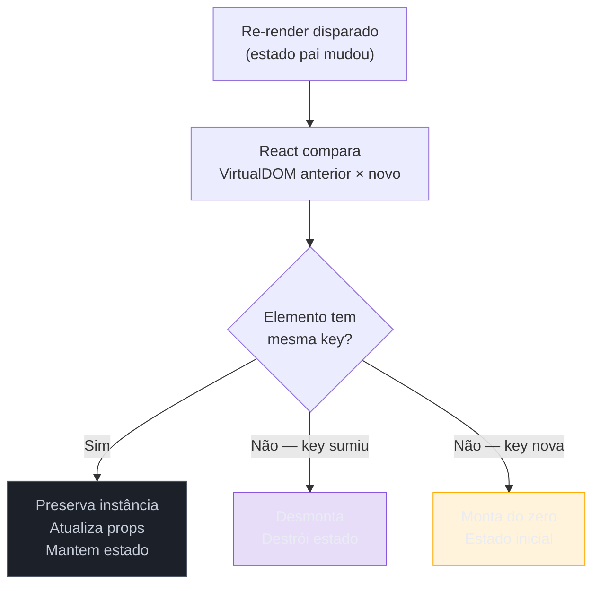

# Listas e keys

> [!abstract] TL;DR
> Renderizar listas em React significa usar `.map()` para transformar arrays de dados em arrays de JSX. A prop `key` é obrigatória: ela diz ao React **qual item é qual** entre renders, permitindo que o algoritmo de reconciliation atualize só o que mudou — sem ela, React embaralha estado. Nunca use o índice do array como key em listas dinâmicas; use o ID do dado. Mudar a `key` de um componente força sua desmontagem e remontagem com estado zerado — e isso pode ser uma ferramenta deliberada.

Imagine que você tem uma lista de tarefas. O usuário digita o nome de uma tarefa num campo de texto, clica em "Adicionar" e a tarefa aparece. Até aqui, tudo certo. Mas depois ele reordena as tarefas arrastando — e de repente os textos nos campos parecem ter trocado de lugar. O input da tarefa 1 agora mostra o conteúdo da tarefa 3. Nenhum bug de lógica óbvio. Nenhum erro no console (além de um aviso sobre `key`). O problema é silencioso e assustador.

Esse é o bug clássico de **index como key**. E entender por que ele acontece é entender como o React decide o que manter e o que descartar na tela.

---

## Renderizando listas com `.map()`

Em React, listas são simplesmente arrays de elementos JSX. A forma canônica de produzi-las é com `.map()`: você transforma cada item do seu array de dados num elemento React.

```tsx
// ✅ Estrutura básica
interface Tarefa {
  id: string;
  titulo: string;
}

function ListaDeTarefas({ tarefas }: { tarefas: Tarefa[] }) {
  return (
    <ul>
      {tarefas.map((tarefa) => (
        <li key={tarefa.id}>{tarefa.titulo}</li>
      ))}
    </ul>
  );
}
```

O `.map()` retorna um array de `<li>` — e React sabe renderizar arrays de elementos sem precisar de um wrapper extra. A prop `key` em cada elemento é obrigatória sempre que você renderiza uma lista assim.

> [!question]- Por que preciso de `key` se o React já sabe quantos elementos tem?
> Porque o React não rastreia elementos por posição — ele rastreia por **identidade**. Sem `key`, React não consegue distinguir "o item que era o segundo continua sendo o segundo" de "o item que era o segundo virou o primeiro". Com arrays, a identidade padrão seria o índice — e aí mora o bug.

---

## O que é a `key` e por que React precisa dela

Pense no React como um gerente que cuida de várias mesas de trabalho (instâncias de componentes). Cada mesa tem seus próprios papéis (estado local). Quando você diz "reorganize as mesas", o gerente precisa saber **qual mesa é qual** para não misturar os papéis.

A `key` é o **crachá** de cada mesa.

Quando React compara o que estava na tela com o que deve aparecer agora, ele olha as keys para decidir:

- Mesmo key → mesmo componente → **atualiza** as props, **preserva** o estado
- Key sumiu → componente foi removido → **desmonta**
- Key nova apareceu → componente é novo → **monta** do zero

Sem keys, React usa a posição (índice implícito) — e isso falha quando a ordem muda.



---

## O bug do índice como key — demonstrado

Esse é o bug mais comum e mais traiçoeiro com listas. Vamos construí-lo de propósito.

### Cenário: lista de tarefas com inputs

```tsx
// ❌ PERIGOSO — usando index como key
interface Tarefa {
  id: string;
  titulo: string;
}

function TarefaItem({ titulo }: { titulo: string }) {
  // Estado LOCAL dentro do item — simula um campo editável
  const [nota, setNota] = React.useState('');

  return (
    <li>
      <strong>{titulo}</strong>
      <input
        value={nota}
        onChange={(e) => setNota(e.target.value)}
        placeholder="Adicione uma nota..."
      />
    </li>
  );
}

function Lista({ tarefas }: { tarefas: Tarefa[] }) {
  return (
    <ul>
      {tarefas.map((tarefa, index) => (
        // ❌ key={index} — armadilha!
        <TarefaItem key={index} titulo={tarefa.titulo} />
      ))}
    </ul>
  );
}
```

Agora imagine que o usuário:

1. Digita "lembrar de ligar" no campo da **Tarefa A** (que está na posição 0)
2. Insere uma nova **Tarefa Z** no começo da lista

O que acontece?

- Antes da inserção: posição 0 = Tarefa A, posição 1 = Tarefa B
- Depois da inserção: posição 0 = Tarefa Z, posição 1 = Tarefa A, posição 2 = Tarefa B

React olha as keys: ainda tem `key={0}`, `key={1}`, `key={2}`. "As mesmas keys! Mesmo componente, então **preservo o estado**." O componente que era da Tarefa A (com o texto "lembrar de ligar" no estado) **fica associado à Tarefa Z** — porque ambas estão na posição 0.

**Resultado:** Tarefa Z aparece com "lembrar de ligar" no campo. A nota vazou do componente errado.

### A correção: ID estável do dado

```tsx
// ✅ CORRETO — usando id único do dado como key
function Lista({ tarefas }: { tarefas: Tarefa[] }) {
  return (
    <ul>
      {tarefas.map((tarefa) => (
        <TarefaItem key={tarefa.id} titulo={tarefa.titulo} />
      ))}
    </ul>
  );
}
```

Agora quando Tarefa Z entra na posição 0:

- React vê `key="id-z"` — nova key, monta do zero (sem nota)
- React vê `key="id-a"` — mesma key de antes, preserva o estado correto

Nenhuma nota vazou. Nenhum estado misturado.

---

## De onde tirar uma key boa

| Fonte | Quando usar | Exemplo |
|-------|-------------|---------|
| ID do banco de dados | Sempre que possível | `key={user.id}` |
| UUID gerado no cliente | Ao criar item localmente (antes de persistir) | `key={crypto.randomUUID()}` gerado **na criação**, não no render |
| Slug/nome único | Quando o nome for naturalmente único e imutável | `key={categoria.slug}` |
| Hash composta | Quando não há ID mas há combinação única | `key={\`${user.email}-${role}\`}` |

> [!warning] Key gerada com `Math.random()` — destruição de performance
> **O que acontece:** cada render gera uma key diferente para cada item. React nunca reconhece o mesmo componente entre renders. **Por quê:** o reconciliation interpreta "key mudou" como "componente antigo sumiu, novo apareceu" — então desmonta e remonta tudo a cada render. **Como evitar:** gere o identificador **uma vez**, quando o dado é criado, e armazene-o junto ao dado.

```tsx
// ❌ Nunca faça isso
tarefas.map((t) => <TarefaItem key={Math.random()} titulo={t.titulo} />)

// ✅ Gere o id na criação do dado
function adicionarTarefa(titulo: string): Tarefa {
  return { id: crypto.randomUUID(), titulo };
}
```

---

## Keys são únicas entre irmãos — não globalmente

Uma confusão comum: "preciso garantir que minha key seja única em toda a aplicação?"

Não. Keys precisam ser únicas **entre irmãos** — ou seja, dentro do mesmo array, no mesmo nível do DOM virtual. Você pode ter `key="1"` em uma lista e `key="1"` em outra lista completamente diferente — React não confunde, porque ele rastreia keys por contexto de lista.

```tsx
// ✅ Isso é válido — as duas listas têm keys independentes
function App() {
  return (
    <>
      <ul>
        {frutas.map((f) => <li key={f.id}>{f.nome}</li>)}
      </ul>
      <ul>
        {vegetais.map((v) => <li key={v.id}>{v.nome}</li>)}
        {/* v.id poderia coincidir com f.id — sem problema */}
      </ul>
    </>
  );
}
```

---

## Key em Fragment

Às vezes cada item da lista precisa renderizar **múltiplos elementos** sem um wrapper de HTML (como `<div>`). É aí que entra o `Fragment`.

O problema: a sintaxe curta `<>...</>` não aceita props — e `key` é uma prop.

```tsx
// ❌ Não funciona — <> não aceita key
lista.map((item) => (
  <>
    <dt key={item.id}>{item.termo}</dt>
    <dd>{item.definicao}</dd>
  </>
))
```

```tsx
// ✅ Use Fragment explícito com key
import { Fragment } from 'react';

interface DicionarioItem {
  id: string;
  termo: string;
  definicao: string;
}

function Dicionario({ itens }: { itens: DicionarioItem[] }) {
  return (
    <dl>
      {itens.map((item) => (
        <Fragment key={item.id}>
          <dt>{item.termo}</dt>
          <dd>{item.definicao}</dd>
        </Fragment>
      ))}
    </dl>
  );
}
```

O `key` no `Fragment` externo é suficiente — React usa ele para identificar todo o bloco de filhos.

---

## Resetando estado com `key` — a técnica deliberada

A `key` tem um superpoder além das listas: você pode usá-la em **qualquer componente** para forçar uma remontagem completa — como se você destruísse o componente e criasse um novo do zero.

> [!question]- Por que eu quereria destruir e recriar um componente?
> Existem casos reais: um formulário que deve "reiniciar" quando o usuário troca de cliente; um player de vídeo que deve começar do zero quando a URL muda; um componente com estado complexo que é mais fácil resetar do que "limpar" manualmente.

```tsx
// ✅ Resetar formulário mudando a key
function App() {
  const [clienteId, setClienteId] = React.useState('cliente-a');

  return (
    <>
      <button onClick={() => setClienteId('cliente-b')}>
        Trocar para Cliente B
      </button>

      {/* Quando clienteId muda, React desmonta o formulário antigo
          e monta um novo do zero — estado totalmente zerado */}
      <FormularioPedido key={clienteId} clienteId={clienteId} />
    </>
  );
}
```

Quando `clienteId` muda de `'cliente-a'` para `'cliente-b'`:

1. React vê que a key do `<FormularioPedido>` mudou
2. Desmonta a instância antiga (todos os `useState` descartados)
3. Monta uma nova instância com estado inicial

É uma técnica precisa — e muito mais limpa do que fazer `useEffect` correndo atrás de cada campo para resetar.

> [!info] O que "resetar" significa na prática
> Ao desmontar, React:
> - Descarta todo `useState` e `useReducer` local
> - Executa o cleanup de todos os `useEffect`
> - Remove o nó do DOM (dependendo do tipo)
>
> Ao remontar, parte do zero: `useState(initialValue)` usa `initialValue` de verdade.

---

## Armadilhas comuns

> [!warning] Usar o índice do array como key em listas dinâmicas
> **O que acontece:** ao adicionar, remover ou reordenar itens, o estado de componentes filhos "vaza" para o item errado — inputs mostram conteúdo trocado, checkboxes marcam o item errado. **Por quê:** React identifica componentes pela key; se a key é o índice e os índices mudam, React pensa que o "mesmo componente" mudou de dados — e preserva o estado antigo no lugar errado. **Como evitar:** sempre use um ID estável do dado (`item.id`, UUID gerado na criação). Índice como key só é seguro em listas **100% estáticas** que nunca mudam de ordem nem recebem inserções/remoções.

> [!warning] Keys não únicas dentro do mesmo array
> **O que acontece:** React emite aviso no console; comportamento de reconciliation torna-se imprevisível — dois itens com a mesma key podem ter estado misturado. **Por quê:** React usa key como identificador único no contexto do array; duplicatas quebram a bijection entre key e instância. **Como evitar:** garanta que o campo usado como key seja único entre os itens daquele array. Em casos de dados externos, verifique antes de renderizar.

> [!warning] Gerar key com `Math.random()` ou `Date.now()` no render
> **O que acontece:** a cada render, todas as keys mudam. React desmonta e remonta **todos** os itens da lista — performance péssima e animações/transições quebram. **Por quê:** o reconciliation interpreta "key diferente" como "componente diferente" — não há reaproveitamento. **Como evitar:** gere identificadores únicos **uma vez**, quando o item é criado, e armazene como campo no objeto. Nunca calcule dentro do `.map()`.

> [!warning] Esquecer key em Fragment quando há múltiplos elementos por item
> **O que acontece:** aviso no console `"Each child in a list should have a unique 'key' prop"` — e sem key, o comportamento de reconciliation para esses fragmentos usa índice implícito. **Por quê:** `<>...</>` não aceita props. Sem key explícita, React não consegue identificar o bloco. **Como evitar:** use `<Fragment key={item.id}>` (importando `Fragment` do React) sempre que renderizar múltiplos elementos por item de lista.

---

## Como explicar em inglês

In React, when you render a list with `.map()`, each element needs a `key` prop — a stable, unique identifier that tells React which item is which across re-renders. Without a proper key, React can't distinguish between items when the list changes, which leads to state leaking into the wrong components. The classic mistake is using the array index as a key: when items are reordered, React sees the same index and thinks it's the same component, preserving stale state in the wrong place. Always use a stable ID from your data instead.

You can also deliberately use `key` outside of lists — changing a component's key forces React to unmount the old instance and mount a fresh one, which is the cleanest way to reset a component's state.

| PT | EN |
|----|-----|
| renderizar lista | render a list |
| índice do array | array index |
| chave estável | stable key |
| reconciliation | reconciliation (sem tradução padrão) |
| estado preservado errado | stale state leaking / state bleeding |
| remontar / desmontar | remount / unmount |
| irmãos (no DOM) | siblings |
| resetar estado | reset state |
| ID do dado | data ID |

---

## Resumo em 1 linha

`key` é o crachá de identidade de cada elemento numa lista: com ele estável, React atualiza só o que mudou; sem ele (ou com índice), React embaralha estado ao menor movimento.

---

## O que vem a seguir

Agora que você entende como `key` alimenta o reconciliation, o próximo passo natural é entender **como** o React compara a árvore de elementos para decidir o que montar, atualizar ou desmontar — o algoritmo de diffing completo.

- [[03-Dominios/Tecnologia/React/React core/02 - JSX a fundo|02 - JSX a fundo]] — JSX é o que `.map()` retorna; entender a transformação para `React.createElement` ajuda a raciocinar sobre o que o reconciliation recebe
- 16 - Reconciliation e diffing a fundo — como o algoritmo de comparação usa keys (e outras heurísticas) para minimizar operações no DOM real *(nota ainda não criada)*

---

## Referências

- **Equipe React** — [*Rendering Lists — react.dev*](https://react.dev/learn/rendering-lists) — documentação oficial sobre `.map()` e key em listas
- **Equipe React** — [*Preserving and Resetting State — react.dev*](https://react.dev/learn/preserving-and-resetting-state) — explica como key controla montagem/desmontagem e reset de estado
- **Equipe React** — [*`<Fragment>` — react.dev*](https://react.dev/reference/react/Fragment) — referência oficial para Fragment com key
- **Steve Kinney** — [*Key Stability in Lists — React Performance*](https://stevekinney.com/courses/react-performance/key-stability-in-lists) — análise de performance de keys estáveis vs. instáveis
- **w3reference** — [*React Keys and You: Mastering Efficient Reconciliation and State Preservation*](https://www.w3reference.com/blog/react-keys-and-you/) — visão prática do impacto de keys no reconciliation
- **BSWEN** — [*How React Reconciliation Works: Understanding Keys and the Diffing Algorithm*](https://docs.bswen.com/blog/2026-03-03-react-reconciliation-keys/) — artigo de 2026 sobre reconciliation e keys
- **Nik Graf** — [*Using React's Key Attribute to Remount a Component*](https://www.nikgraf.com/blog/using-reacts-key-attribute-to-remount-a-component) — o padrão de reset deliberado com key

---

*Veja também o [[03-Dominios/Tecnologia/React/Dicionário de React|Dicionário de React]] para definições rápidas dos termos deste galho.*
