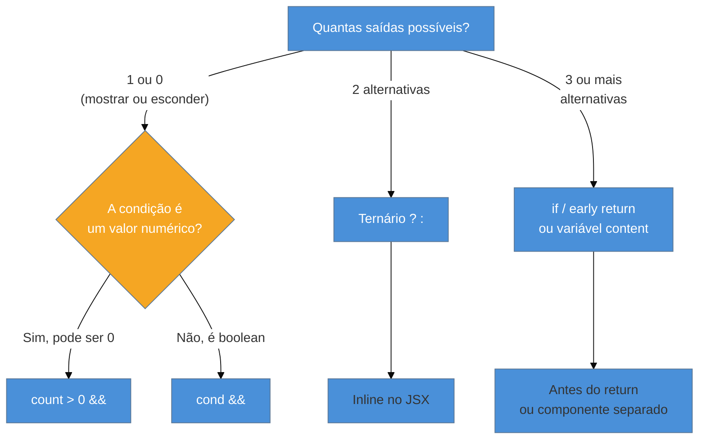
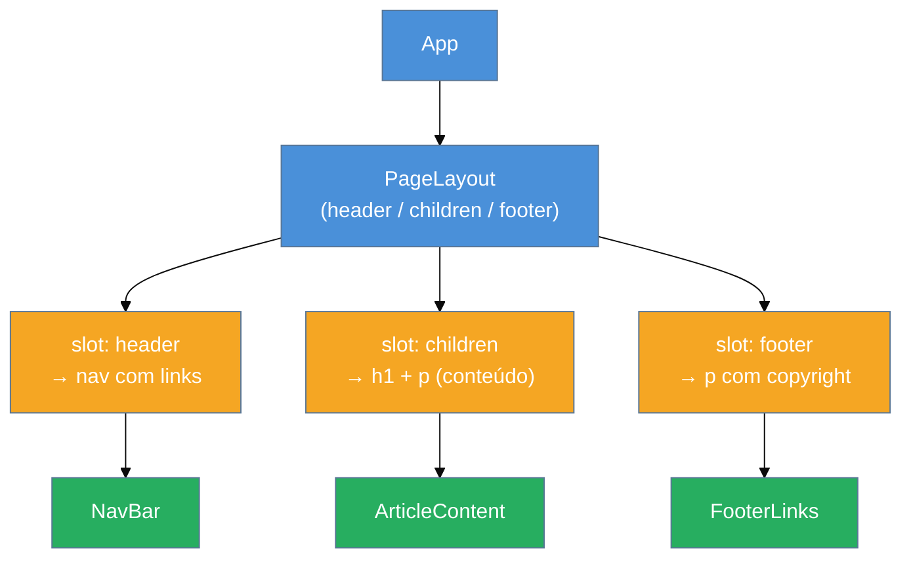

# Renderização condicional e composição

> [!abstract] TL;DR
> React decide o que mostrar na tela através de JavaScript puro — `if`, ternário (`? :`), `&&` e `null`. Cada técnica tem seu lugar: `if`/early return para lógica complexa, ternário para alternar entre duas opções, `&&` para mostrar/esconder algo — mas cuidado com `0 &&`, que renderiza o número 0 na tela. Para reutilizar estrutura sem repetir código, React usa **composição**: em vez de herança de classe, você encaixa componentes dentro de outros via `children` ou via props de JSX. O resultado é código flexível, testável e fácil de ler.

## O problema que esta nota resolve

Imagine que você tem um componente de `Dashboard`. Se o usuário não está logado, você quer mostrar uma tela de login. Se está logado mas não tem dados ainda, quer um spinner. Se tem dados, quer o conteúdo real. Se ocorreu um erro, quer uma mensagem de falha.

Como você organiza essa lógica sem transformar o JSX num labirinto de tags aninhadas?

E um segundo problema: você tem um componente `Card` que funciona bem para exibir um produto. Mais tarde, precisa de um `CardDestaque` com o mesmo visual mas um badge "Em oferta!" no topo. Você copia e cola o Card inteiro? Cria uma classe base e faz herança como em Java?

React responde os dois problemas com duas ferramentas: **renderização condicional** e **composição**. Esta nota cobre as duas — e por que elas andam juntas.

---

## Parte 1 — Renderização condicional

### O conceito fundamental

JSX é JavaScript. Isso significa que você pode usar qualquer estrutura de controle que o JavaScript oferece para decidir o que renderizar. Não existe sintaxe especial de template — sem `v-if`, sem `*ngIf`. Só JavaScript.

React renderiza `null`, `undefined` e `false` como **nada** — útil quando você quer que um componente "desapareça" sem erro. Já `0` (zero) e strings vazias são renderizados como texto — uma armadilha que veremos em detalhe.

### Técnica 1 — `if` tradicional e early return

A técnica mais legível quando a lógica é complexa. Você coloca o `if` **antes** do `return` do JSX, ou usa um **early return** para sair cedo do componente:

```tsx
// Early return — retorna cedo se a condição não bate
interface UserGreetingProps {
  isLoggedIn: boolean;
  name: string;
}

function UserGreeting({ isLoggedIn, name }: UserGreetingProps) {
  if (!isLoggedIn) {
    return <p>Por favor, faça login para continuar.</p>;
  }

  // A partir daqui, sabemos que o usuário está logado
  return <h1>Bem-vindo de volta, {name}!</h1>;
}
```

O early return é a técnica preferida quando há **lógica de guarda**: você elimina os casos inválidos primeiro e o "caminho feliz" fica limpo ao final. O TypeScript também aprova: após um early return, o compilador sabe que certas condições já foram descartadas.

```tsx
// Variante com variável intermediária
interface StatusBannerProps {
  status: "loading" | "error" | "success";
  message: string;
}

function StatusBanner({ status, message }: StatusBannerProps) {
  let content: React.ReactNode;

  if (status === "loading") {
    content = <Spinner />;
  } else if (status === "error") {
    content = <ErrorBox message={message} />;
  } else {
    content = <SuccessMessage message={message} />;
  }

  return <div className="banner">{content}</div>;
}
```

Usar uma variável `content` do tipo `React.ReactNode` permite montar o JSX em pedaços e combinar depois. É mais legível que ternários encadeados.

### Técnica 2 — Operador ternário `? :`

Ideal para alternar entre **duas** opções dentro do JSX. A sintaxe é compacta e fica inline:

```tsx
interface LoginButtonProps {
  isLoggedIn: boolean;
  onLogin: () => void;
  onLogout: () => void;
}

function LoginButton({ isLoggedIn, onLogin, onLogout }: LoginButtonProps) {
  return (
    <button onClick={isLoggedIn ? onLogout : onLogin}>
      {isLoggedIn ? "Sair" : "Entrar"}
    </button>
  );
}
```

Ternário aninhado (`a ? b : c ? d : e`) é sinal de que você devia usar `if` ou extrair um componente separado. Quando há três ou mais estados, o ternário vira um quebra-cabeça.

```tsx
// Ternário no JSX — ok para duas opções
function Painel({ carregando }: { carregando: boolean }) {
  return (
    <div>
      {carregando ? <Spinner /> : <Conteudo />}
    </div>
  );
}
```

### Técnica 3 — Operador `&&` (E lógico)

Útil para mostrar algo **ou nada** — sem alternativa. Se a condição é verdadeira, renderiza o JSX do lado direito. Se é falsa, renderiza nada:

```tsx
interface NotificacaoBadgeProps {
  count: number;
  showBadge: boolean;
}

function NotificacaoBadge({ count, showBadge }: NotificacaoBadgeProps) {
  return (
    <div>
      <span>Notificações</span>
      {showBadge && <Badge>{count}</Badge>}
    </div>
  );
}
```

Funciona porque React ignora `false` — então `false && <Badge />` resulta em `false`, que não aparece na tela.

> [!warning] A armadilha clássica do `0 &&`
> **O que acontece:** o número 0 aparece impresso na tela quando você usa `count && <Badge />`. **Por quê:** `0` é falsy em JavaScript, então `0 && <Badge />` retorna `0`. React **não renderiza `false`**, mas renderiza **números** — inclusive o 0. **Como evitar:** converta explicitamente para booleano antes do `&&`:
> ```tsx
> // ❌ Errado — pode renderizar 0 na tela
> {count && <Badge>{count}</Badge>}
>
> // ✅ Correto — converte para boolean
> {count > 0 && <Badge>{count}</Badge>}
>
> // ✅ Também correto — double negation
> {!!count && <Badge>{count}</Badge>}
>
> // ✅ Ou Boolean() explícito
> {Boolean(count) && <Badge>{count}</Badge>}
> ```
> A regra prática: sempre use uma **expressão de comparação** (`> 0`, `!== null`, etc.) antes do `&&` em vez de usar o valor bruto.

### Técnica 4 — `null` para renderizar nada

Se um componente não deve renderizar absolutamente nada (nem espaço, nem comentário), retorne `null`:

```tsx
interface AlertProps {
  message: string | null;
}

function Alert({ message }: AlertProps) {
  if (!message) return null; // Componente "desaparece" do DOM

  return (
    <div className="alert">
      <p>{message}</p>
    </div>
  );
}
```

`null` é diferente de uma string vazia ou um `<></>` vazio — é literalmente nada. O componente existe no React (pode ter estado, effects), mas não produz DOM.

> [!question]- Por que não usar display: none no CSS em vez de null?
> Ótima pergunta. `display: none` esconde visualmente mas **mantém o elemento no DOM** — eventos ainda disparam, refs ainda apontam para o elemento, leitores de tela podem encontrá-lo. `null` remove o componente completamente da árvore React e do DOM. Para animações de entrada/saída, `display: none` pode ser necessário; para lógica de "não existe", prefira `null`.

### Escolhendo a técnica certa



---

## Parte 2 — Composição: a filosofia React

### Por que não herança?

Se você veio de Java, C# ou Python, seu instinto ao reutilizar comportamento é criar uma classe base e herdar dela. Em React, os próprios docs dizem explicitamente: **use composição, não herança**.

Por quê? Componentes React já são funções. Herança entre funções é complexa, cria acoplamento forte e dificulta entender o que um componente faz sem ler toda a cadeia de herança. Composição — encaixar peças — é mais simples, mais testável e mais fácil de raciocinar.

> A filosofia React: em vez de perguntar "o que este componente **é**?", pergunte "o que este componente **contém**?".

### A analogia dos slots

Pense num container físico com encaixes — como um organizador de gaveta. O organizador não sabe o que vai dentro de cada encaixe; ele só define **onde** as coisas cabem. Quem usa o organizador decide o que colocar em cada espaço.

Em React, um componente pode ter **slots** — espaços que o componente pai preenche com JSX arbitrário. O componente filho não precisa saber o que vai nesses slots. Isso é composição.

```
┌─────────────────────────────────┐
│  Layout (o "organizador")       │
│  ┌───────────────────────────┐  │
│  │  slot: header             │  │
│  └───────────────────────────┘  │
│  ┌───────────────────────────┐  │
│  │  slot: children (default) │  │
│  └───────────────────────────┘  │
│  ┌───────────────────────────┐  │
│  │  slot: footer             │  │
│  └───────────────────────────┘  │
└─────────────────────────────────┘
```

### O slot padrão: `children`

Quando você escreve `<Card>conteúdo aqui</Card>`, o React passa tudo entre as tags como a prop `children`. O componente `Card` não precisa saber o que é esse conteúdo — só renderiza onde declarar `{children}`:

```tsx
// Definindo um Card com children
interface CardProps {
  children: React.ReactNode;
  className?: string;
}

function Card({ children, className = "" }: CardProps) {
  return (
    <div className={`card ${className}`}>
      {children}
    </div>
  );
}

// Usando o Card — o "slot" recebe JSX arbitrário
function PaginaProduto() {
  return (
    <Card className="destaque">
      <h2>Produto Especial</h2>
      <p>Descrição do produto com detalhes importantes.</p>
      <button>Comprar agora</button>
    </Card>
  );
}
```

`React.ReactNode` é o tipo correto para `children` — aceita JSX, strings, números, arrays, `null`, `undefined`. É o tipo mais permissivo que React consegue renderizar.

### Múltiplos slots via props de JSX

Quando você precisa de mais de um "encaixe", passe JSX como props nomeadas. É exatamente isso que Vue chama de "named slots" — em React, é simplesmente uma prop do tipo `React.ReactNode`:

```tsx
// Layout com três slots: header, children (default), footer
interface PageLayoutProps {
  header: React.ReactNode;
  footer: React.ReactNode;
  children: React.ReactNode;
}

function PageLayout({ header, footer, children }: PageLayoutProps) {
  return (
    <div className="page">
      <header className="page-header">{header}</header>
      <main className="page-content">{children}</main>
      <footer className="page-footer">{footer}</footer>
    </div>
  );
}

// Usando o Layout com slots nomeados
function App() {
  return (
    <PageLayout
      header={<nav><a href="/">Home</a> | <a href="/sobre">Sobre</a></nav>}
      footer={<p>© 2026 Minha Empresa</p>}
    >
      <h1>Bem-vindo ao site!</h1>
      <p>Conteúdo principal da página aqui.</p>
    </PageLayout>
  );
}
```

O `PageLayout` não sabe nada sobre navegação ou rodapé — ele apenas declara onde eles aparecem. Quem usa o `PageLayout` decide o conteúdo. Essa separação é o núcleo da composição.

### Diagrama: árvore de composição



O `PageLayout` é o "gabarito" — define a estrutura. Os nós verdes são o conteúdo que o usuário do componente injeta via slots. A árvore pode crescer para qualquer profundidade sem que o `PageLayout` precise saber o que está dentro.

### Pattern: containment (contenção)

O padrão de **contenção** é exatamente o que fizemos com `Card` e `PageLayout`: um componente genérico que não sabe o que vai dentro, só fornece estrutura e estilo. É o padrão mais básico de composição React.

Casos de uso típicos:
- Wrappers de layout (`PageLayout`, `Section`, `Grid`)
- Modais e drawers (a "caixa" genérica com título e ações)
- Cards e painéis com visual padronizado
- Provedores de contexto (um componente que envolve outros para prover dados)

```tsx
// Modal genérico por contenção
interface ModalProps {
  title: string;
  actions: React.ReactNode;  // slot para botões de ação
  children: React.ReactNode; // slot para o corpo
  isOpen: boolean;
  onClose: () => void;
}

function Modal({ title, actions, children, isOpen, onClose }: ModalProps) {
  if (!isOpen) return null;

  return (
    <div className="modal-overlay" onClick={onClose}>
      <div className="modal-box" onClick={(e) => e.stopPropagation()}>
        <h2 className="modal-title">{title}</h2>
        <div className="modal-body">{children}</div>
        <div className="modal-actions">{actions}</div>
      </div>
    </div>
  );
}

// Usando o Modal — cada uso tem conteúdo diferente
function ConfirmacaoExclusao({ onConfirm, onCancel }: { onConfirm: () => void; onCancel: () => void }) {
  return (
    <Modal
      title="Confirmar exclusão"
      isOpen={true}
      onClose={onCancel}
      actions={
        <>
          <button onClick={onCancel}>Cancelar</button>
          <button onClick={onConfirm} className="danger">Excluir</button>
        </>
      }
    >
      <p>Tem certeza? Esta ação não pode ser desfeita.</p>
    </Modal>
  );
}
```

Note como o `Modal` não sabe nada sobre confirmação de exclusão — ele é uma casca genérica. `ConfirmacaoExclusao` preenche os slots com conteúdo específico.

### Pattern: specialization (especialização)

**Especialização** é o oposto da contenção: você cria um componente específico a partir de um genérico, configurando as props com valores concretos. É como usar `containment` de dentro:

```tsx
// Componente genérico
interface ButtonProps {
  variant: "primary" | "secondary" | "danger";
  size: "sm" | "md" | "lg";
  children: React.ReactNode;
  onClick?: () => void;
  disabled?: boolean;
}

function Button({ variant, size, children, onClick, disabled }: ButtonProps) {
  return (
    <button
      className={`btn btn-${variant} btn-${size}`}
      onClick={onClick}
      disabled={disabled}
    >
      {children}
    </button>
  );
}

// Especializações — configuram o genérico com valores fixos
function PrimaryButton({ children, onClick, disabled }: Omit<ButtonProps, "variant" | "size">) {
  return (
    <Button variant="primary" size="md" onClick={onClick} disabled={disabled}>
      {children}
    </Button>
  );
}

function DangerButton({ children, onClick }: Omit<ButtonProps, "variant" | "size" | "disabled">) {
  return (
    <Button variant="danger" size="md" onClick={onClick}>
      {children}
    </Button>
  );
}
```

`PrimaryButton` e `DangerButton` são especializações de `Button`. Eles não herdam de `Button` como classes — eles **usam** `Button` por composição. Mais simples, mais claro.

### Composição vs configuração via props booleanas

Uma tensão comum: quando usar slots (composição) versus quando usar uma prop booleana que ativa um comportamento (configuração)?

```tsx
// Abordagem por configuração — booleans controlam variantes
interface CardProps {
  title: string;
  showBadge?: boolean;
  badgeText?: string;
  showImage?: boolean;
  imageUrl?: string;
}

function Card({ title, showBadge, badgeText, showImage, imageUrl }: CardProps) {
  return (
    <div>
      {showBadge && <span className="badge">{badgeText}</span>}
      {showImage && }
      <h3>{title}</h3>
    </div>
  );
}

// Vs abordagem por composição — passa JSX arbitrário
interface CardCompostoProps {
  title: string;
  badge?: React.ReactNode;
  image?: React.ReactNode;
}

function CardComposto({ title, badge, image }: CardCompostoProps) {
  return (
    <div>
      {badge}
      {image}
      <h3>{title}</h3>
    </div>
  );
}
```

A versão com booleans (`showBadge`, `showImage`) parece simples no começo, mas cresce indefinidamente conforme novos requisitos aparecem. Em algum momento você tem 12 props booleanas e o componente virou um Frankestein.

A versão com slots (`badge`, `image`) aceita qualquer JSX — hoje um `<Badge />`, amanhã um `<AnimatedBadge />`, depois um `<BadgeComTooltip />`. O componente `CardComposto` nunca precisa mudar.

**Regra prática**: use props booleanas para variações simples e estáveis (dark mode, tamanho). Use slots/composição quando o conteúdo pode variar ou crescer.

> [!warning] Prop drilling disfarçado de composição
> **O que acontece:** você passa props de configuração através de vários níveis de componentes para chegar ao componente que realmente precisa. **Por quê é ruim:** cria acoplamento entre componentes que não deveriam se importar um com o outro. O componente intermediário vira um "correio" de props. **Como evitar:** composição real quebra a cadeia — em vez de passar dados para baixo, passe JSX já montado. Se o problema persistir, Context API (nota 11) é o próximo passo. Veja também [[03 - Componentes e props]] onde prop drilling é introduzido.

### Introdução a compound components

Quando a composição vai além de slots simples, aparece o padrão **compound components** — vários componentes que trabalham juntos e compartilham estado implícito. O exemplo clássico é um componente `Select`:

```tsx
// Em vez de uma única prop enorme...
<Select options={[...]} value={...} onChange={...} renderOption={...} />

// Compound component — componentes colaboram
<Select value={valor} onChange={setValor}>
  <Select.Option value="br">Brasil</Select.Option>
  <Select.Option value="us">Estados Unidos</Select.Option>
  <Select.Option value="pt">Portugal</Select.Option>
</Select>
```

`Select` e `Select.Option` são componentes separados que compartilham contexto interno. Quem usa a API consegue customizar cada opção com JSX arbitrário sem precisar de uma prop `renderOption` complexa.

Este padrão usa Context API por baixo dos panos e será detalhado no **galho React Design Patterns** (ainda em construção). Por ora, o importante é reconhecer o problema que ele resolve: quando composição simples com slots não é suficiente porque os sub-componentes precisam se "comunicar".

> [!info] Compound components e TypeScript
> Tipar `children` de compound components requer atenção — você pode querer restringir o tipo de `children` para aceitar apenas `Select.Option`, não qualquer `React.ReactNode`. Isso envolve técnicas avançadas de tipagem cobertas em [[03-Dominios/Tecnologia/React/TypeScript com React/14 - Compound components, slots, render props|Compound components, slots, render props]].

---

## Composição com renderização condicional: o casamento

Na prática, composição e renderização condicional trabalham juntas o tempo todo. Um componente `PageLayout` pode receber um slot opcional — se não foi passado, renderiza um default ou nada:

```tsx
interface ArticleLayoutProps {
  children: React.ReactNode;
  sidebar?: React.ReactNode;  // slot opcional
  banner?: React.ReactNode;   // slot opcional
}

function ArticleLayout({ children, sidebar, banner }: ArticleLayoutProps) {
  return (
    <div className="article-layout">
      {banner && (
        <div className="article-banner">{banner}</div>
      )}
      <div className="article-body">
        <main className="article-content">{children}</main>
        {sidebar && (
          <aside className="article-sidebar">{sidebar}</aside>
        )}
      </div>
    </div>
  );
}

// Uso sem sidebar — o aside não aparece no DOM
function ArtigoPadrao() {
  return (
    <ArticleLayout>
      <p>Conteúdo do artigo aqui.</p>
    </ArticleLayout>
  );
}

// Uso com sidebar e banner
function ArtigoCompleto() {
  return (
    <ArticleLayout
      banner={<div className="promo">Novidade: versão 2.0 lançada!</div>}
      sidebar={<TableOfContents />}
    >
      <p>Conteúdo do artigo aqui.</p>
    </ArticleLayout>
  );
}
```

O `ArticleLayout` usa `&&` para renderizar condicionalmente os slots opcionais. Quando `sidebar` é `undefined`, `undefined && <aside>` resulta em `undefined` — que React não renderiza. Slots opcionais com `React.ReactNode` funcionam assim naturalmente.

---

## Armadilhas comuns

> [!warning] Renderizar `0` com o operador `&&`
> **O que acontece:** `{items.length && <Lista items={items} />}` renderiza o número `0` quando `items` é um array vazio. **Por quê:** `0` é falsy mas é um número — React renderiza números. `0 && x` retorna `0`, não `false`. **Como evitar:** `{items.length > 0 && <Lista items={items} />}` ou `{!!items.length && <Lista items={items} />}`.

> [!warning] Herança de componente React via `extends`
> **O que acontece:** você tenta criar `class CardDestaque extends Card {}` para reutilizar lógica. **Por quê é problemático:** herança de componentes quebra o modelo mental React. Props, state e o ciclo de renderização ficam difíceis de rastrear. Os próprios docs React desencorajam explicitamente. **Como evitar:** use composição — `CardDestaque` renderiza `<Card>` internamente e adiciona o que precisa ao redor.

> [!warning] Prop `children` com tipo errado
> **O que acontece:** você tipa `children: JSX.Element` e o componente quebra quando recebe uma string, um array ou `null`. **Por quê:** `JSX.Element` é apenas um elemento React — não aceita strings, números ou arrays. **Como evitar:** use `React.ReactNode` para `children` na maioria dos casos — é o tipo que cobre tudo que React consegue renderizar. Para casos onde você quer aceitar apenas componentes React (não strings), use `React.ReactElement`.

> [!warning] Ternários profundamente aninhados no JSX
> **O que acontece:** `{a ? b : c ? d : e ? f : g}` — um ternário dentro de outro dentro de outro. Ninguém consegue ler. **Por quê:** ternário foi feito para duas opções. Três ou mais? É uma if-else chain disfarçada. **Como evitar:** extraia para um `if` antes do `return`, use uma função auxiliar, ou quebre em componentes menores. Código que parece inteligente mas ninguém entende é código ruim.

---

## Como explicar em inglês

In React, **conditional rendering** means using plain JavaScript control flow — `if`, ternary (`? :`), or `&&` — to decide what JSX to return. There's no special template syntax; if the component returns `null`, nothing renders. A common pitfall is `count && <Badge />`, which renders the literal `0` when `count` is zero, because React renders numbers but not booleans.

**Composition** is React's answer to reuse: instead of extending components through class inheritance, you pass JSX as props (`children` or named slots like `header`). A component like `PageLayout` doesn't know what goes inside its slots — it just defines where things appear. This keeps components decoupled and easy to test.

| PT | EN |
|----|-----|
| Renderização condicional | Conditional rendering |
| Composição | Composition |
| Herança | Inheritance |
| Slot padrão | Default slot |
| Slot nomeado | Named slot |
| Contenção | Containment |
| Especialização | Specialization |
| Componentes compostos | Compound components |
| Prop drilling | Prop drilling |
| Retorno antecipado | Early return |

---

## Composição em uma frase

> **Composição em React** é a prática de encaixar componentes dentro de outros via `children` e props de JSX — em vez de herança — para reutilizar estrutura sem criar acoplamento.

---

## O que vem a seguir

Agora que você sabe renderizar condicionalmente e compor componentes, o próximo passo natural é lidar com **listas** — renderizar arrays de dados com `map()`, e por que React exige uma `key` única em cada item da lista.

- [[07 - Listas e keys]] — como `map()` + `key` funciona e por que a key importa para o algoritmo de reconciliação
- [[03 - Componentes e props]] — revise prop drilling e como children e slots se relacionam com a passagem de dados
- [[03-Dominios/Tecnologia/React/TypeScript com React/14 - Compound components, slots, render props|Compound components, slots, render props]] — como tipar children e slots avançados com TypeScript
- [[03-Dominios/Tecnologia/React/Dicionário de React|Dicionário de React]] — glossário de termos React: containment, specialization, compound components

---

## Fontes

- **React Team** — [*Conditional Rendering*](https://react.dev/learn/conditional-rendering) — documentação oficial React, cobre if/else, ternário e &&; conteúdo estável e atualizado para React 19
- **React Team** — [*Passing JSX as Children*](https://react.dev/learn/passing-props-to-a-component#passing-jsx-as-children) — explica a prop `children` como slot padrão de JSX
- **React Team (legacy docs)** — [*Composition vs Inheritance*](https://legacy.reactjs.org/docs/composition-vs-inheritance.html) — argumento original dos docs React para preferir composição; filosófico e ainda válido
- **Sandro Roth** — [*Building Component Slots in React*](https://sandroroth.com/blog/react-slots/) — artigo prático sobre slots nomeados via props de JSX, com exemplos de produção
- **Codemzy** — [*Why does React render 0 with conditional &&?*](https://www.codemzy.com/blog/react-render-0-conditional) — explica o mecanismo da armadilha do `0 &&` com exemplos e correções
- **LogRocket** — [*How to type React children correctly in TypeScript*](https://blog.logrocket.com/react-children-prop-typescript/) — diferenças entre `React.ReactNode`, `JSX.Element` e `React.ReactElement` no TypeScript
- **Makers' Den** — [*Advanced Guide on React Component Composition*](https://makersden.io/blog/guide-on-react-component-composition) — cobre containment, specialization, compound components e performance de composição
