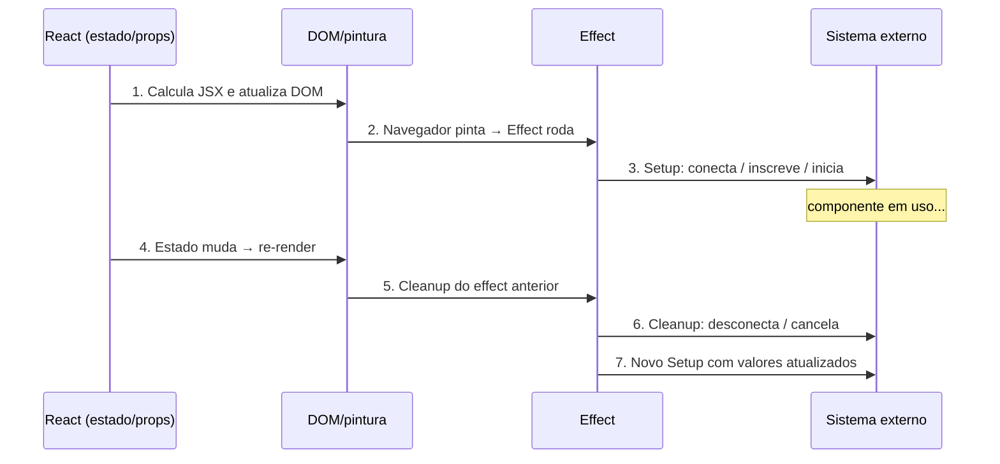

# useEffect e o modelo de efeitos

> [!abstract] TL;DR
> `useEffect` sincroniza um componente com um **sistema externo** — uma conexão WebSocket, um listener de evento, uma lib DOM imperativa — depois que o React termina de pintar a tela. O array de dependências controla *quando* o efeito ressincroniza; a função de cleanup desfaz o trabalho anterior. O erro clássico é usar `useEffect` para coisas que não são sincronização: derivar estado, reagir a eventos, buscar dados sem cache. Se você não está cruzando a fronteira entre React e um sistema externo, provavelmente não precisa de um efeito.

---

## O problema que useEffect resolve

Imagine que você está construindo um player de vídeo. O componente recebe uma prop `isPlaying` e precisa chamar `videoRef.current.play()` ou `pause()` dependendo do valor. Tentativa ingênua:

```tsx
function VideoPlayer({ src, isPlaying }: { src: string; isPlaying: boolean }) {
  const ref = useRef<HTMLVideoElement>(null);

  // ❌ Isso explode: o DOM ainda não existe durante o render
  if (isPlaying) {
    ref.current!.play();
  }

  return <video ref={ref} src={src} />;
}
```

O problema é que React **calcula o JSX primeiro** e só depois escreve no DOM. Chamar `ref.current.play()` durante o render é como tentar dirigir um carro que ainda está sendo montado.

A solução é `useEffect`: um ponto de escape que roda **depois** que o React terminou de atualizar o DOM e o navegador pintou a tela. Só ali o elemento de vídeo existe e pode ser controlado.

```tsx
function VideoPlayer({ src, isPlaying }: { src: string; isPlaying: boolean }) {
  const ref = useRef<HTMLVideoElement>(null);

  useEffect(() => {
    if (isPlaying) {
      ref.current!.play();
    } else {
      ref.current!.pause();
    }
  }, [isPlaying]);

  return <video ref={ref} src={src} />;
}
```

Agora o efeito roda depois do paint, sempre que `isPlaying` mudar, mantendo o player sincronizado com o estado do React. É isso que `useEffect` faz: **sincronizar** o mundo React com o mundo externo.

---

## O modelo mental: sincronizar dois relógios

Pense em `useEffect` como o mecanismo de sincronização entre dois relógios com fontes de tempo diferentes. O relógio A é o React (estado, props, JSX). O relógio B é o mundo externo (DOM, WebSocket, biblioteca de terceiro).

Eles não se atualizam juntos automaticamente. `useEffect` é o fio que, depois de cada mudança no relógio A, ajusta o relógio B para ficar na mesma hora. E quando o relógio A muda novamente, o fio primeiro *desfaz* o ajuste anterior antes de fazer um novo.



O diagrama deixa claro: não é "código que roda depois do render". É um loop de setup→cleanup→setup que mantém dois sistemas sincronizados.

---

## Quando o efeito roda: timing preciso

```
Render → Atualiza DOM → Navegador pinta → 💥 useEffect roda
```

A ordem importa porque:

1. **Render** é puro: React calcula o novo JSX sem tocar no DOM.
2. **Commit** é quando o React escreve as mudanças no DOM real.
3. **Paint** é quando o navegador exibe o resultado na tela.
4. **useEffect** só começa depois do paint — por isso o usuário vê o estado atualizado antes de qualquer efeito rodar.

Isso contrasta com `useLayoutEffect`, que roda *depois do commit mas antes do paint*, bloqueando a exibição. Para a maioria dos casos (fetch, subscriptions, analytics), `useEffect` é a escolha certa.

Ver: [[04 - Renderização - o que dispara um render]] para entender o ciclo completo de render/commit.

---

## O array de dependências: quem decide quando ressincronizar

O segundo argumento de `useEffect` é o array de dependências. Ele tem três formas, cada uma com comportamento diferente:

```tsx
// Forma 1: sem array — roda após CADA render
useEffect(() => {
  console.log("Rodei de novo!");
});

// Forma 2: array vazio — roda só na montagem
useEffect(() => {
  console.log("Montei!");
  return () => console.log("Desmontei!");
}, []);

// Forma 3: com dependências — roda na montagem E quando qualquer dep muda
useEffect(() => {
  const connection = createConnection(roomId);
  connection.connect();
  return () => connection.disconnect();
}, [roomId]); // Ressincroniza quando roomId muda
```

| Forma | Quando roda | Caso de uso |
|-------|-------------|-------------|
| Sem array | Todo render | Quase nunca — geralmente um bug |
| `[]` | Só na montagem | Setup único: logging, lib externa, analytics |
| `[dep1, dep2]` | Montagem + quando dep muda | Sincronizar com valor dinâmico |

> [!question]- Como o React sabe se uma dependência mudou?
> Usa `Object.is()` — comparação por valor para primitivos, por referência para objetos/arrays/funções. Por isso objetos e funções criados inline no render causam re-execução do effect a cada render: cada render cria uma nova referência.

### A regra de ouro das dependências

**Você não escolhe as dependências. Você declara o que o effect usa.** O linter (`eslint-plugin-react-hooks` com a regra `exhaustive-deps`) verifica isso.

Se seu effect lê `roomId` e você não inclui `roomId` no array, você está mentindo pro React: ele vai usar um valor antigo enquanto o componente já exibe outro. Isso é um *stale closure* — a armadilha mais comum com hooks.

```tsx
// ❌ Stale closure: effect usa roomId mas não declara
useEffect(() => {
  const conn = createConnection(roomId); // roomId pode estar desatualizado!
  conn.connect();
}, []); // Linter vai avisar

// ✅ Correto
useEffect(() => {
  const conn = createConnection(roomId);
  conn.connect();
  return () => conn.disconnect();
}, [roomId]);
```

---

## Cleanup: desfazendo o que você fez

A função de cleanup é o par do setup. Ela roda em dois momentos:

1. **Antes do próximo effect** — quando as dependências mudam, React limpa o effect anterior antes de rodar o novo.
2. **Na desmontagem** — quando o componente é removido do DOM.

O padrão é simétrico:

```tsx
useEffect(() => {
  // Setup: faça a coisa
  const subscription = externalStore.subscribe(callback);

  // Cleanup: desfaça a coisa
  return () => subscription.unsubscribe();
}, [externalStore]);
```

Sem cleanup, você acumula subscriptions. Cada vez que o componente re-renderiza com uma nova `externalStore`, você adiciona mais um listener sem remover o anterior. Com mil re-renders, mil listeners ativos — um leak de memória clássico.

### Exemplo completo: listener de janela

```tsx
function useWindowWidth(): number {
  const [width, setWidth] = useState(window.innerWidth);

  useEffect(() => {
    function handleResize() {
      setWidth(window.innerWidth);
    }

    // Setup
    window.addEventListener("resize", handleResize);

    // Cleanup
    return () => {
      window.removeEventListener("resize", handleResize);
    };
  }, []); // Array vazio: adiciona e remove só uma vez

  return width;
}
```

---

## StrictMode e o double-invoke: o teste de sanidade automático

Em desenvolvimento com `<StrictMode>`, React monta → desmonta → remonta cada componente. Na prática, seu effect roda duas vezes:

```
Mount → Setup → Cleanup → Setup  ← (em dev)
Mount → Setup               ← (em prod)
```

Isso parece irritante, mas é intencional: o double-invoke é um **teste de qualidade embutido**. Se seu efeito não implementa cleanup corretamente, o duplo ciclo vai revelar o problema antes de chegar a produção.

```tsx
// ❌ Esse código quebra no StrictMode (e em prod também, mais devagar)
useEffect(() => {
  const subscription = subscribe(); // Segunda chamada sem cancelar a primeira!
}, []);

// ✅ Com cleanup, double-invoke é inofensivo
useEffect(() => {
  const subscription = subscribe();
  return () => subscription.cancel();
}, []);
```

> [!question]- Por que o double-invoke não acontece em produção?
> Em produção, React não desmonta e remonta componentes para otimização. O StrictMode simula esse comportamento em dev para revelar bugs reais. Se seu effect funciona corretamente no StrictMode, ele funciona em qualquer cenário.

O anti-padrão que parece resolver mas esconde o problema:

```tsx
// ❌ Esconde o bug em vez de corrigir
const hasRun = useRef(false);
useEffect(() => {
  if (!hasRun.current) {
    hasRun.current = true;
    subscribe(); // Sem cleanup = leak em prod em Hot Reload
  }
}, []);
```

---

## Você Pode Não Precisar de um Effect

Este é o insight mais importante desta nota. A maioria dos `useEffect` problemáticos que você vai encontrar não deveria existir.

### Caso 1: derivar estado no render, não em effect

```tsx
// ❌ Effect desnecessário: sincroniza dois estados
const [items, setItems] = useState(initialItems);
const [filteredItems, setFilteredItems] = useState(initialItems);
useEffect(() => {
  setFilteredItems(items.filter(item => item.active));
}, [items]);

// ✅ Calcule durante o render — é grátis e sempre correto
const [items, setItems] = useState(initialItems);
const filteredItems = items.filter(item => item.active); // Derivado
```

Cálculos derivados de props e estado não precisam de effect. Se `filteredItems` pode ser computado de `items` sem ambiguidade, calcule no corpo do componente.

### Caso 2: reagir a eventos em event handlers, não em effects

```tsx
// ❌ Effect reage a uma mudança de estado causada por clique
useEffect(() => {
  if (itemAdded) {
    showNotification("Item adicionado!");
    setItemAdded(false);
  }
}, [itemAdded]);

// ✅ A notificação pertence ao handler, não ao effect
function handleAddItem() {
  addToCart(item);
  showNotification("Item adicionado!");
}
```

Se algo acontece *porque o usuário fez algo*, coloque no event handler. Effect é para coisas que acontecem *porque o componente apareceu na tela*.

### Caso 3: resetar estado via key, não via effect

```tsx
// ❌ Effect para resetar estado quando prop muda
useEffect(() => {
  setComment("");
}, [userId]);

// ✅ key reseta o componente inteiro automaticamente
<Profile userId={userId} key={userId} />
```

### Caso 4: cálculos custosos com useMemo, não effects

```tsx
// ❌ Effect para cachear resultado de cálculo
useEffect(() => {
  setVisibleTodos(getFilteredTodos(todos, filter));
}, [todos, filter]);

// ✅ useMemo faz o cache de forma síncrona e elegante
const visibleTodos = useMemo(
  () => getFilteredTodos(todos, filter),
  [todos, filter]
);
```

### Quando useEffect é legítimo

- Conectar a um WebSocket ou EventSource
- Inscrever em uma store externa (Zustand, Redux)
- Controlar elementos DOM imperativos (video, canvas, lib de gráficos)
- Enviar analytics quando o componente aparece
- Gerenciar timers/intervals que precisam de cleanup

---

## Race conditions em fetch: o problema e a solução

Buscar dados em `useEffect` sem cleanup é uma fonte conhecida de bugs em produção. Imagine que o usuário troca de perfil rapidamente:

```
Busca perfil "Alice" → request em voo
Usuário troca para "Bob" → nova busca
"Bob" responde primeiro → setBio("Bob")
"Alice" responde depois → setBio("Alice") 💥 exibe Alice mas a UI mostra Bob
```

Isso é uma race condition: a resposta mais antiga chega depois e sobrescreve a mais recente.

### Solução 1: flag de cancelamento (simples)

```tsx
function ProfilePage({ userId }: { userId: string }) {
  const [bio, setBio] = useState<string | null>(null);

  useEffect(() => {
    let ignore = false; // Flag: "esse effect ainda é válido?"

    fetchBio(userId).then(result => {
      if (!ignore) {
        setBio(result); // Só atualiza se ainda for o effect atual
      }
    });

    return () => {
      ignore = true; // Cleanup invalida responses anteriores
    };
  }, [userId]);

  return <p>{bio ?? "Carregando..."}</p>;
}
```

A flag `ignore` é elegante: quando o cleanup roda (porque `userId` mudou), ela fica `true` e qualquer `.then()` ainda em voo ignora o resultado.

### Solução 2: AbortController (cancela a rede)

```tsx
function ProfilePage({ userId }: { userId: string }) {
  const [bio, setBio] = useState<string | null>(null);
  const [error, setError] = useState<Error | null>(null);

  useEffect(() => {
    const controller = new AbortController();

    fetch(`/api/users/${userId}/bio`, { signal: controller.signal })
      .then(res => {
        if (!res.ok) throw new Error(`HTTP ${res.status}`);
        return res.json();
      })
      .then((data: { bio: string }) => setBio(data.bio))
      .catch(err => {
        // AbortError é esperado — não é um erro real
        if (err.name !== "AbortError") {
          setError(err);
        }
      });

    return () => {
      controller.abort(); // Cancela o request de rede imediatamente
    };
  }, [userId]);

  if (error) return <p>Erro: {error.message}</p>;
  return <p>{bio ?? "Carregando..."}</p>;
}
```

`AbortController` vai além de ignorar a resposta: cancela o request no nível de rede, economizando banda e processamento do servidor.

> [!question]- Qual a diferença entre flag ignore e AbortController?
> A flag `ignore` deixa o request completar e descarta o resultado. `AbortController` cancela o request antes de completar — melhor para requests grandes ou quando o servidor tem custo de processar. Para APIs simples, a flag é suficiente e mais legível.

---

## useEffectEvent: separando reativo de não-reativo (status 2026)

Às vezes você quer que o effect use um valor *sem* re-executar quando esse valor muda. O caso clássico é logar uma visita com dados do carrinho:

```tsx
function Page({ url, shoppingCart }: { url: string; shoppingCart: Item[] }) {
  useEffect(() => {
    // Quero re-executar quando url muda, mas NÃO quando shoppingCart muda
    // Mas shoppingCart é usado aqui, então o linter exige que esteja no array
    logVisit(url, shoppingCart.length);
  }, [url, shoppingCart]); // 😕 re-executa demais
}
```

`useEffectEvent` (introduzido como `experimental_useEffectEvent` em React 18 e promovido a `useEffectEvent` em React 19) resolve isso:

```tsx
import { useEffect, useEffectEvent } from "react";

function Page({ url, shoppingCart }: { url: string; shoppingCart: Item[] }) {
  // onVisit sempre enxerga o shoppingCart mais recente
  // mas NÃO é reativo — não está no array de deps
  const onVisit = useEffectEvent((visitedUrl: string) => {
    logVisit(visitedUrl, shoppingCart.length);
  });

  useEffect(() => {
    onVisit(url);
  }, [url]); // Só re-executa quando url muda ✅
}
```

`useEffectEvent` cria uma função que sempre captura os valores mais recentes (como um evento) mas não é uma dependência reativa (não reaparece no array de deps).

> [!warning] Status instável em 2026
> `useEffectEvent` foi promovido à API estável no React 19 (sem o prefixo `experimental_`), mas ainda não está disponível via `react` em alguns setups. Verifique sua versão antes de usar em produção.

---

## Armadilhas comuns

> [!warning] Armadilha 1: Effect para derivar estado
> **O que acontece:** O componente pisca ou cria renders extras porque você faz `setX(compute(y))` dentro de um effect. **Por quê:** Effect roda *depois* do render. Setar estado dentro dele dispara outro render — dois renders onde um resolveria. **Como evitar:** Se `X` pode ser calculado a partir de `Y` durante o render, faça isso. `const x = compute(y)` no corpo do componente é suficiente.

> [!warning] Armadilha 2: dependências faltando (stale closure)
> **O que acontece:** O effect usa um valor (prop, state, função) que muda, mas ele continua usando a versão antiga. **Por quê:** Closures capturam valores no momento da criação. Se `roomId` não está no array, o effect fecha sobre o `roomId` do primeiro render e nunca atualiza. **Como evitar:** Sempre inclua no array tudo que o effect lê. Deixe o linter `exhaustive-deps` guiar você. Nunca suprima o warning sem entender por quê.

> [!warning] Armadilha 3: fetch sem cleanup → race condition
> **O que acontece:** Resultados antigos sobrescrevem resultados novos quando o usuário navega rapidamente. **Por quê:** Múltiplos requests em voo resolvem em ordem imprevisível. **Como evitar:** Use a flag `ignore` ou `AbortController` no cleanup. Sempre.

> [!warning] Armadilha 4: objeto/função inline como dependência
> **O que acontece:** O effect roda em todo render mesmo que o conteúdo não tenha mudado. **Por quê:** `{ color: "red" }` cria um novo objeto a cada render; `Object.is({ color: "red" }, { color: "red" })` retorna `false`. **Como evitar:** Mova objetos e funções para dentro do effect, ou use `useMemo`/`useCallback` para estabilizar as referências.

> [!warning] Armadilha 5: usar useEffect para comunicação entre componentes
> **O que acontece:** Um effect monitora estado e chama callbacks do pai, criando cascatas de renders. **Por quê:** Effect → setState pai → re-render pai → re-render filho → effect dispara de novo. **Como evitar:** Chame callbacks do pai diretamente nos event handlers, não em effects. O pai e o filho devem se comunicar via props/callbacks síncronos.

---

## Casos práticos

### Cenário 1: conexão a um chat em tempo real

Um componente de chat que precisa conectar a uma sala, reconectar quando a sala muda e desconectar quando desmonta:

```tsx
interface ChatRoomProps {
  roomId: string;
  serverUrl: string;
}

function ChatRoom({ roomId, serverUrl }: ChatRoomProps) {
  const [messages, setMessages] = useState<string[]>([]);

  useEffect(() => {
    const connection = createChatConnection({ roomId, serverUrl });

    connection.on("message", (msg: string) => {
      setMessages(prev => [...prev, msg]);
    });

    connection.connect();

    return () => {
      connection.disconnect();
    };
  }, [roomId, serverUrl]); // Reconecta sempre que sala ou servidor mudar

  return (
    <ul>
      {messages.map((msg, i) => (
        <li key={i}>{msg}</li>
      ))}
    </ul>
  );
}
```

Quando o usuário troca de sala, React executa o cleanup (desconecta da sala anterior) e depois o setup (conecta à nova sala). Sem cleanup, o usuário ficaria recebendo mensagens das duas salas ao mesmo tempo.

### Cenário 2: integração com biblioteca DOM imperativa

Bibliotecas de gráficos como Chart.js ou D3 precisam de acesso direto ao elemento canvas/svg. `useEffect` é a fronteira correta:

```tsx
import { useEffect, useRef } from "react";
import Chart from "chart.js/auto";

interface SalesChartProps {
  data: number[];
  labels: string[];
}

function SalesChart({ data, labels }: SalesChartProps) {
  const canvasRef = useRef<HTMLCanvasElement>(null);
  const chartRef = useRef<Chart | null>(null);

  useEffect(() => {
    if (!canvasRef.current) return;

    // Destrói instância anterior antes de criar nova (evita "canvas already in use")
    chartRef.current?.destroy();

    chartRef.current = new Chart(canvasRef.current, {
      type: "bar",
      data: {
        labels,
        datasets: [{ label: "Vendas", data }],
      },
    });

    return () => {
      chartRef.current?.destroy();
      chartRef.current = null;
    };
  }, [data, labels]);

  return <canvas ref={canvasRef} />;
}
```

Note que `chartRef` não está no array de deps — é uma ref (valor mutável), não estado reativo. Só `data` e `labels` (props) precisam estar no array.

---

## Data fetching moderno: além do useEffect

Em 2026, buscar dados diretamente em `useEffect` é considerado um anti-padrão em novos projetos. As alternativas modernas resolvem os problemas estruturalmente:

- **TanStack Query / SWR**: cache, deduplicação, retries, background refetch — tudo gerenciado.
- **Next.js / Remix**: data fetching no servidor, sem waterfalls de rede.
- **`use()` com Suspense**: integra com o modelo de suspense do React para loading states declarativos.

Para aprofundar nesses caminhos, veja [[19 - Suspense e data fetching no cliente]] e [[21 - O hook use()]] (se existentes no vault).

> [!info] useEffect para fetch ainda tem lugar
> Em projetos sem framework, em scripts rápidos, em casos de dados genuinamente locais (geolocalização, permissões de câmera), ou quando você não quer adicionar uma lib de cache, `useEffect` com AbortController ainda é válido. A ressalva é: faça direito, com cleanup.

---

## Como explicar em inglês

> "In React, `useEffect` is how you synchronize a component with an external system — a WebSocket, a browser API, a third-party library. It runs after the browser paints, and its cleanup function undoes the previous setup before the next run. The dependency array tells React when to re-synchronize. Most bugs with `useEffect` come from missing cleanup, stale closures from missing dependencies, or using it for things that should just be computed during render."

| PT | EN |
|----|-----|
| efeito colateral | side effect |
| array de dependências | dependency array |
| função de cleanup / limpeza | cleanup function |
| montagem / desmontagem | mount / unmount |
| dependência obsoleta | stale dependency / stale closure |
| race condition | race condition (sem tradução padrão) |
| ressincronizar | re-synchronize |
| sistema externo | external system |
| double-invoke (StrictMode) | double-invoke / double-fire |
| derivar estado | derive state |

---

## O que vem a seguir

`useEffect` frequentemente precisa de uma referência ao elemento DOM — e é aí que `useRef` entra em cena. Refs são o mecanismo para guardar valores mutáveis sem re-render, e o elo direto entre React e o DOM imperativo.

- [[10 - useRef e refs]] — como manter valores entre renders sem causar re-render, e como acessar elementos DOM diretamente
- [[04 - Renderização - o que dispara um render]] — o ciclo completo de render/commit/paint que fundamenta o timing do useEffect
- [[03-Dominios/Tecnologia/React/Dicionário de React|Dicionário de React]] — glossário do ecossistema React

---

## Fontes

- **React Team** — [*Synchronizing with Effects*](https://react.dev/learn/synchronizing-with-effects) — documentação oficial; cobre o modelo mental de sincronização, timing, deps e cleanup em profundidade
- **React Team** — [*useEffect API Reference*](https://react.dev/reference/react/useEffect) — referência completa da assinatura, `useEffectEvent` e casos avançados
- **React Team** — [*You Might Not Need an Effect*](https://react.dev/learn/you-might-not-need-an-effect) — guia canônico dos anti-padrões; leitura obrigatória antes de escrever qualquer `useEffect`
- **React Team** — [*Lifecycle of Reactive Effects*](https://react.dev/learn/lifecycle-of-reactive-effects) — aprofunda o ciclo mount/cleanup/re-sync e a relação com o array de deps
- **Max Rozen** — [*Race Conditions in React with useEffect*](https://maxrozen.com/race-conditions-fetching-data-react-with-useeffect) — análise detalhada de race conditions com exemplos práticos
- **react.wiki** — [*useEffect API Fetching: Race Conditions & Memory Leaks*](https://react.wiki/hooks/fetching-api-best-practice/) — boas práticas atualizadas para 2026
