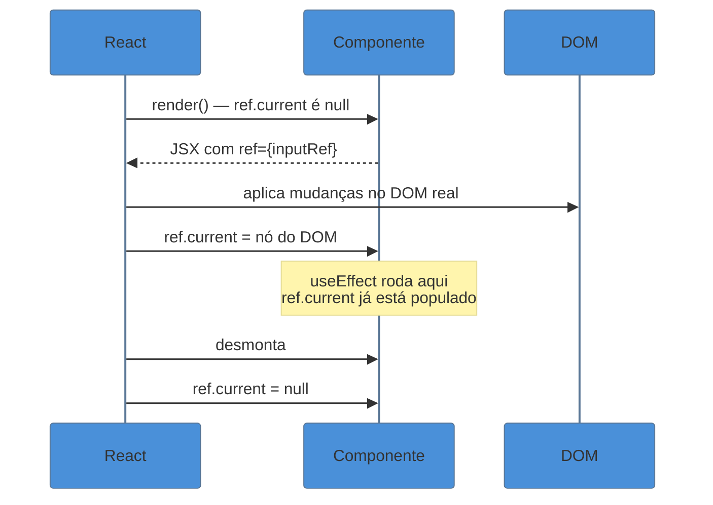
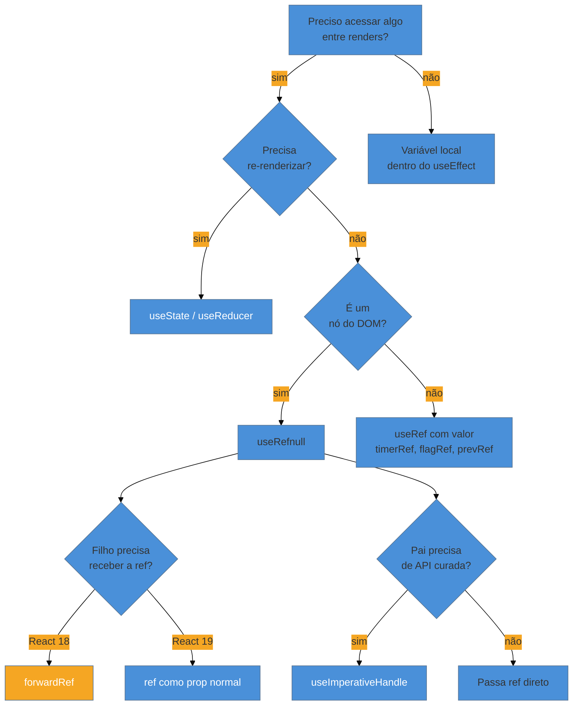

# useRef e refs

> [!abstract] TL;DR
> `useRef` é uma caixa mutável que persiste entre renders sem disparar re-render. Ela serve para dois propósitos distintos: segurar uma referência a um nó do DOM (para focar, medir ou integrar libs imperativas) e guardar valores mutáveis que você quer lembrar entre renders sem causar re-render (timers, flags, valor anterior). A diferença central em relação a `useState` é que mudar `ref.current` é síncrono e silencioso — React não sabe, não age. O React 19 simplificou o modelo: `ref` agora é uma prop normal em componentes funcionais, tornando `forwardRef` obsoleto. Para expor uma API imperativa curada ao pai, use `useImperativeHandle`.

---

Imagine que você tem um formulário de login e quer que o campo "e-mail" ganhe foco automaticamente assim que o modal abre. Você não tem um evento do usuário para responder — a ação precisa acontecer no DOM diretamente. Mas no React, você não toca no DOM: a biblioteca faz isso. Como chegar até o elemento real sem quebrar o modelo declarativo?

Ou: você tem um `setInterval` dentro de um `useEffect` e precisa guardar o ID do timer para cancelar depois. Se você usar `useState`, a atualização do ID vai disparar um re-render desnecessário. Se você usar uma variável local, ela some a cada render. Onde guardar esse valor sem causar ruído?

Esses dois problemas têm a mesma solução: `useRef`.

---

## A caixa que não avisa ninguém

A melhor analogia para `useRef` é um **post-it colado na parede do componente**. Você escreve um valor nele, rasura, reescreve — mas ninguém é notificado. React não sabe, o virtual DOM não muda, nenhum re-render acontece. O valor simplesmente persiste ali, entre renders, esperando você precisar dele.

```tsx
const ref = useRef(valorInicial);
// ref.current === valorInicial

ref.current = novoValor; // silencioso, síncrono, sem re-render
```

Compare com `useState`:

| | `useState` | `useRef` |
|---|---|---|
| Persiste entre renders | ✓ | ✓ |
| Dispara re-render ao mudar | ✓ | ✗ |
| Visível no virtual DOM | ✓ | ✗ |
| Leitura | `state` (imutável no ciclo) | `ref.current` (sempre atual) |
| Atualização | `setState(novo)` (assíncrono) | `ref.current = novo` (síncrono) |

Essa distinção é a regra de ouro: **se a mudança precisa aparecer na tela, use state. Se não precisa, use ref.**

---

## Uso 1 — Referência a nó do DOM

O caso mais comum é conectar `useRef` a um elemento JSX via a prop `ref`. Depois que o componente monta, `ref.current` aponta para o nó do DOM real.

```tsx
import { useRef, useEffect } from 'react';

function SearchInput() {
  const inputRef = useRef<HTMLInputElement>(null);

  useEffect(() => {
    // O DOM já existe aqui — é seguro acessar .current
    inputRef.current?.focus();
  }, []);

  return <input ref={inputRef} type="search" placeholder="Buscar..." />;
}
```

O tipo `useRef<HTMLInputElement>(null)` é importante: antes de montar, `ref.current` é `null`. Sempre cheque antes de acessar — o TypeScript vai cobrar isso com o optional chaining `?.`.

### Quando usar ref para DOM

- Focar um elemento programaticamente
- Medir dimensões (`getBoundingClientRect`)
- Disparar animações imperativas (scroll, `play()` em vídeo)
- Integrar bibliotecas de terceiros que recebem um nó do DOM (mapas, editores de texto, gráficos D3)

### O que não fazer

Não use ref para ler valores que pertencem ao modelo de dados. Se você está tentando ler o texto de um `<input>` através de `inputRef.current.value` em vez de manter um estado controlado, provavelmente há um design mais limpo com `useState` ou `useReducer`.

---

## Uso 2 — Valores mutáveis entre renders

O segundo uso é guardar valores que precisam persistir mas não precisam aparecer na tela. O exemplo clássico é um ID de timer:

```tsx
import { useRef, useEffect, useState } from 'react';

function Cronometro() {
  const [segundos, setSegundos] = useState(0);
  const timerRef = useRef<ReturnType<typeof setInterval> | null>(null);

  function iniciar() {
    if (timerRef.current !== null) return; // já está rodando
    timerRef.current = setInterval(() => {
      setSegundos(s => s + 1);
    }, 1000);
  }

  function parar() {
    if (timerRef.current === null) return;
    clearInterval(timerRef.current);
    timerRef.current = null;
  }

  useEffect(() => {
    return () => {
      if (timerRef.current !== null) clearInterval(timerRef.current);
    };
  }, []);

  return (
    <div>
      <p>{segundos}s</p>
      <button onClick={iniciar}>Iniciar</button>
      <button onClick={parar}>Parar</button>
    </div>
  );
}
```

Note como `timerRef` nunca aparece no JSX — ele só existe como memória interna do componente.

### Padrão: valor anterior

Outro uso clássico é rastrear o valor anterior de uma prop ou state:

```tsx
import { useRef, useEffect } from 'react';

function usePrevious<T>(value: T): T | undefined {
  const ref = useRef<T | undefined>(undefined);

  useEffect(() => {
    ref.current = value;
  });
  // O effect roda DEPOIS do render,
  // então durante o render, ref.current ainda tem o valor anterior

  return ref.current;
}

// Uso:
function Contador({ count }: { count: number }) {
  const prev = usePrevious(count);
  return <p>Antes: {prev} | Agora: {count}</p>;
}
```

---

## A regra do render

> [!warning] Nunca leia nem escreva em `ref.current` durante o render
> O corpo da função componente é o render. Lá dentro, `ref.current` pode ter qualquer valor (especialmente `null` antes da montagem). Ler refs no render quebra a idempotência que React exige — dois renders iguais devem produzir o mesmo resultado.
>
> **Correto:** ler/escrever em `useEffect`, `useLayoutEffect`, ou handlers de evento.
> **Errado:** `const valor = ref.current` no topo da função componente.

---

## Diagrama — ciclo de vida do ref



O diagrama deixa claro: `ref.current` aponta para o DOM **depois** que React termina de aplicar as mudanças. Por isso `useEffect` (que roda depois do render+commit) é o lugar certo para usar refs de DOM.

---

## React 19 — ref como prop normal

Antes do React 19, para passar uma ref de um componente pai para um filho funcional, você precisava do wrapper `forwardRef`:

```tsx
// React 18 e anterior — forwardRef necessário
import { forwardRef, useRef } from 'react';

const CampoTexto = forwardRef<HTMLInputElement, { label: string }>(
  ({ label }, ref) => (
    <label>
      {label}
      <input ref={ref} />
    </label>
  )
);

// Uso:
function Formulario() {
  const ref = useRef<HTMLInputElement>(null);
  return <CampoTexto label="Nome" ref={ref} />;
}
```

O problema com `forwardRef` era de ergonomia: ele envolve o componente num wrapper, separa `props` de `ref` na assinatura, e complica a inferência de tipos. Muita gente o confundia com algo mais misterioso do que é.

**No React 19, `ref` é simplesmente uma prop como qualquer outra em componentes funcionais:**

```tsx
// React 19 — ref como prop normal
import { useRef } from 'react';

interface CampoTextoProps {
  label: string;
  ref?: React.Ref<HTMLInputElement>;
}

function CampoTexto({ label, ref }: CampoTextoProps) {
  return (
    <label>
      {label}
      <input ref={ref} />
    </label>
  );
}

// Uso idêntico ao anterior:
function Formulario() {
  const ref = useRef<HTMLInputElement>(null);
  return <CampoTexto label="Nome" ref={ref} />;
}
```

`forwardRef` continua funcionando no React 19 para compatibilidade retroativa, mas será removido em versão futura. O time do React disponibilizou um codemod para migração automática.

> [!info] Por que `forwardRef` existia?
> Antes do React 19, `ref` não era uma prop como outra qualquer — era tratada de forma especial pelo runtime (como `key`). Passar `ref` numa prop qualquer simplesmente não funcionava: o componente filho recebia `undefined`. `forwardRef` era o mecanismo para "tunelar" a ref até o componente interno. O React 19 eliminou esse tratamento especial.

### Cleanup em callback refs (React 19)

Além de ref-as-prop, o React 19 também trouxe suporte a **cleanup functions em callback refs** — análogo ao cleanup do `useEffect`:

```tsx
function ComponenteComRef() {
  return (
    <div
      ref={(node) => {
        // Setup: quando o nó monta
        const observer = new ResizeObserver(() => { /* ... */ });
        if (node) observer.observe(node);

        // Cleanup: quando o nó desmonta (retorne uma função)
        return () => {
          observer.disconnect();
        };
      }}
    />
  );
}
```

Antes, era preciso usar um `useEffect` separado para limpar efeitos associados a um nó do DOM. Agora o callback ref é autocontido.

---

## useImperativeHandle — expondo uma API imperativa

Às vezes você não quer expor o nó do DOM inteiro ao pai — você quer oferecer uma API curada. `useImperativeHandle` é o hook para isso.

```tsx
import { useRef, useImperativeHandle } from 'react';

interface VideoPlayerHandle {
  play: () => void;
  pause: () => void;
  seek: (segundos: number) => void;
}

interface VideoPlayerProps {
  src: string;
  ref?: React.Ref<VideoPlayerHandle>;
}

function VideoPlayer({ src, ref }: VideoPlayerProps) {
  const videoRef = useRef<HTMLVideoElement>(null);

  useImperativeHandle(ref, () => ({
    play() {
      videoRef.current?.play();
    },
    pause() {
      videoRef.current?.pause();
    },
    seek(segundos) {
      if (videoRef.current) videoRef.current.currentTime = segundos;
    },
  }));

  return <video ref={videoRef} src={src} />;
}

// O pai recebe a API curada, não o elemento <video> bruto:
function Player() {
  const playerRef = useRef<VideoPlayerHandle>(null);

  return (
    <>
      <VideoPlayer src="/filme.mp4" ref={playerRef} />
      <button onClick={() => playerRef.current?.play()}>Play</button>
      <button onClick={() => playerRef.current?.seek(30)}>+30s</button>
    </>
  );
}
```

O terceiro argumento do `useImperativeHandle` é um array de dependências — funciona exatamente como `useEffect`. Se você não passar, a API é recriada a cada render; passe `[]` para estabilizar.

> [!info] Quando usar `useImperativeHandle`?
> Use apenas quando o componente filho tem comportamento genuinamente imperativo que não cabe em props/estado — players de mídia, editores de texto, componentes de animação. Para todo o resto, prefira o fluxo de dados declarativo normal (props + callbacks).

---

## Callback refs

Uma ref não precisa ser um objeto criado por `useRef`. Você pode passar uma **função** para o atributo `ref`, e o React a chamará com o nó do DOM quando ele montar (e `null` quando desmontar, ou a cleanup function se você a retornar no React 19).

```tsx
// Callback ref simples
function Lista() {
  const items = ['a', 'b', 'c'];

  function medirElemento(node: HTMLLIElement | null) {
    if (node) {
      console.log('Altura:', node.getBoundingClientRect().height);
    }
  }

  return (
    <ul>
      {items.map((item) => (
        <li key={item} ref={medirElemento}>{item}</li>
      ))}
    </ul>
  );
}
```

> [!warning] Defina callback refs fora do JSX
> Se você escrever `ref={(node) => ...}` inline, o React criará uma nova função a cada render e chamará o callback com `null` seguido do novo nó a cada render. Extraia para uma função estável com `useCallback` ou fora do componente para evitar esse comportamento.

```tsx
// Errado — recriada a cada render
<input ref={(node) => { myRef.current = node; }} />

// Correto — estável
const setRef = useCallback((node: HTMLInputElement | null) => {
  myRef.current = node;
}, []);

<input ref={setRef} />
```

---

## Diagrama — árvore de decisão de refs



---

## Casos práticos

### Cenário 1 — Focar campo em modal

Um modal de busca deve focar o input assim que abre, sem o usuário ter que clicar nele.

```tsx
import { useRef, useEffect } from 'react';

interface ModalBuscaProps {
  aberto: boolean;
  onFechar: () => void;
}

function ModalBusca({ aberto, onFechar }: ModalBuscaProps) {
  const inputRef = useRef<HTMLInputElement>(null);

  useEffect(() => {
    if (aberto) {
      // Small timeout para garantir que o modal terminou de animar/montar
      const id = setTimeout(() => inputRef.current?.focus(), 50);
      return () => clearTimeout(id);
    }
  }, [aberto]);

  if (!aberto) return null;

  return (
    <div role="dialog" aria-modal>
      <input
        ref={inputRef}
        type="search"
        placeholder="Buscar..."
        aria-label="Campo de busca"
      />
      <button onClick={onFechar}>Fechar</button>
    </div>
  );
}
```

### Cenário 2 — Integrar biblioteca imperativa (D3 / Chart.js)

Muitas libs de visualização esperam um elemento do DOM como ponto de montagem:

```tsx
import { useRef, useEffect } from 'react';
import Chart from 'chart.js/auto';

interface GraficoProps {
  dados: number[];
  rotulos: string[];
}

function GraficoLinha({ dados, rotulos }: GraficoProps) {
  const canvasRef = useRef<HTMLCanvasElement>(null);
  const chartRef = useRef<Chart | null>(null);

  useEffect(() => {
    if (!canvasRef.current) return;

    // Destrói instância anterior antes de recriar
    chartRef.current?.destroy();

    chartRef.current = new Chart(canvasRef.current, {
      type: 'line',
      data: {
        labels: rotulos,
        datasets: [{ data: dados, borderColor: '#4A90D9' }],
      },
    });

    return () => {
      chartRef.current?.destroy();
    };
  }, [dados, rotulos]);

  return <canvas ref={canvasRef} />;
}
```

Aqui usamos dois refs: `canvasRef` aponta para o DOM, `chartRef` guarda a instância da lib — ambos sem causar re-renders.

---

## Armadilhas comuns

> [!warning] Ler `ref.current` durante o render
> **O que acontece:** `ref.current` retorna `null` na primeira renderização e pode ter valor stale nas subsequentes. O resultado fica inconsistente e difícil de depurar.
> **Por quê:** O React popula `ref.current` depois do commit (após o render). Durante o render, o DOM ainda não foi atualizado.
> **Como evitar:** Acesse `ref.current` apenas dentro de `useEffect`, `useLayoutEffect`, ou handlers de evento — nunca no corpo da função de render.

> [!warning] Usar `ref` onde deveria ser `state`
> **O que acontece:** Você muda `ref.current` mas a tela não atualiza. O valor está correto na memória, mas o usuário não vê a mudança.
> **Por quê:** `ref.current` muda silenciosamente — React não agenda um re-render.
> **Como evitar:** Pergunta de diagnóstico: "Se eu mudar esse valor, a interface precisa atualizar?" Se sim, use `useState` ou `useReducer`. Refs são para efeitos colaterais e imperativos.

> [!warning] Esquecer o null check em `ref.current`
> **O que acontece:** `TypeError: Cannot read properties of null (reading 'focus')` no console.
> **Por quê:** Entre o render e o commit, e na desmontagem, `ref.current` é `null`. Também ocorre em renderização condicional — se o elemento é removido do DOM, a ref é zerada.
> **Como evitar:** Sempre use optional chaining: `ref.current?.focus()`. O TypeScript detecta isso automaticamente quando o tipo é `HTMLElement | null`.

> [!warning] Callback ref inline recriada a cada render
> **O que acontece:** React detecta uma "nova" função ref a cada render, chama a ref anterior com `null` e a nova com o nó. Isso pode causar flickers, re-montagens desnecessárias ou loops infinitos se o callback tem efeitos colaterais.
> **Por quê:** Funções inline são recriadas a cada chamada da função componente.
> **Como evitar:** Extraia callback refs para `useCallback` com dependências corretas, ou declare-as fora do componente se não fecharem sobre estado.

---

## Como explicar em inglês

In React, `useRef` gives you a mutable box that survives re-renders without triggering them. It has two main uses: holding a reference to a DOM node — for imperative actions like focusing an input or integrating third-party libraries — and storing mutable values between renders, like timer IDs or previous state snapshots. The key distinction from `useState` is that mutating `ref.current` is synchronous and invisible to React: no re-render, no diffing, no notification.

In React 19, `ref` became a regular prop for function components, making `forwardRef` obsolete. When you need a parent to call imperative methods on a child, `useImperativeHandle` lets you expose a curated API rather than the raw DOM element.

| PT | EN |
|---|---|
| ref como prop | ref as prop |
| encaminhar ref | forward a ref |
| ref de callback | callback ref |
| limpeza de ref | ref cleanup |
| alça imperativa | imperative handle |
| referência mutável | mutable ref |
| disparar re-render | trigger a re-render |
| nó do DOM | DOM node |
| valor anterior | previous value |
| ciclo de vida | lifecycle |

---

## O que vem a seguir

Refs são a porta de entrada para o mundo imperativo dentro do React — mas elas ganham ainda mais sentido quando combinadas com efeitos, que controlam quando e como ações imperativas acontecem. A próxima nota explora esse modelo em profundidade.

- [[09 - useEffect e o modelo de efeitos]] — o contexto certo para ler e escrever refs de DOM; o por quê do `useEffect` rodar depois do commit
- [[03-Dominios/Tecnologia/React/TypeScript com React/05 - Tipando state e refs|Tipando state e refs]] — como tipar `useRef` corretamente: `RefObject` vs `MutableRefObject`, typing para `useImperativeHandle`
- [[Dicionário de React]] — glossário de termos: ref, forward ref, imperative handle, callback ref

---

## Fontes

- **Equipe React** — [*React v19 — Changelog oficial*](https://react.dev/blog/2024/12/05/react-19) — anúncio da depreciação de `forwardRef` e ref-as-prop; fonte primária
- **React Docs** — [*Manipulating the DOM with Refs*](https://react.dev/learn/manipulating-the-dom-with-refs) — guia canônico de refs de DOM com exemplos de foco, scroll e integração
- **React Docs** — [*useImperativeHandle*](https://react.dev/reference/react/useImperativeHandle) — referência oficial com exemplos de API imperativa curada
- **Dominik Dorfmeister (TkDodo)** — [*Ref Callbacks, React 19 and the Compiler*](https://tkdodo.eu/blog/ref-callbacks-react-19-and-the-compiler) — análise aprofundada de callback refs e cleanup no React 19
- **Saeloun Blog** — [*React 19 Ref as Prop & Cleanup Functions*](https://blog.saeloun.com/2025/03/24/react-19-ref-as-prop/) — migração de `forwardRef` com exemplos antes/depois
- **LogRocket Blog** — [*use forwardRef in React*](https://blog.logrocket.com/use-forwardref-react/) — histórico de `forwardRef`, trade-offs e caminho de migração para React 19
