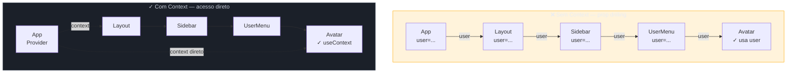

> [!abstract] TL;DR
> A Context API resolve **prop drilling** — a passagem de dados por vários níveis de componentes que não usam esses dados, só repassam. Com `createContext`, um `Provider` e `useContext`, qualquer componente na árvore acessa o valor diretamente. No React 19, o `<MyContext>` pode ser usado como provider diretamente, sem o sufixo `.Provider`. O custo é real: **todo consumidor re-renderiza quando o value do Provider muda**, inclusive por referência. Objeto literal inline no `value` é a armadilha mais comum. As mitigações são: split de contextos, memoizar o value com `useMemo`, e encapsular o contexto em um custom hook com guard de Provider ausente. Context é ideal para dados de baixa frequência de mudança (tema, auth, locale) — **não** substitui gerenciamento de estado global de alta frequência.

## O problema: prop drilling em 5 níveis

Imagine um app com essa árvore de componentes:

```
App
└── Layout
    └── Sidebar
        └── UserMenu
            └── Avatar  ← precisa do nome do usuário
```

`App` tem o usuário. `Avatar` precisa do nome. Os três componentes do meio — `Layout`, `Sidebar`, `UserMenu` — não usam o nome, mas têm que recebê-lo como prop só para repassar adiante.

```tsx
// ❌ Prop drilling: três componentes carregando peso que não é deles
function App() {
  const user = { nome: "Beatriz", avatar: "/b.jpg" };
  return <Layout user={user} />;
}

function Layout({ user }: { user: User }) {
  return <Sidebar user={user} />;
}

function Sidebar({ user }: { user: User }) {
  return <UserMenu user={user} />;
}

function UserMenu({ user }: { user: User }) {
  return <Avatar user={user} />;
}

function Avatar({ user }: { user: User }) {
  return ;
}
```

Isso escala mal. Cada prop adicionada ao usuário precisa ser propagada manualmente por todos os níveis intermediários. A manutenção vira um pesadelo.

> [!question]- Por que não elevar o estado e passar por props de forma organizada?
> Elevar estado (lifting state up) resolve quando a árvore tem 1-2 níveis. Com 4 ou mais níveis, o número de components que precisam receber e repassar props cresce linearmente com a profundidade — exatamente o prop drilling. Context existe para esse caso.

**A analogia do ar-condicionado:** distribuir props por 5 níveis é como entregar um casaco mão a mão pelo corredor — cada pessoa tem que pegar, segurar e passar adiante. A Context API é o ar-condicionado da sala: você configura uma vez no ambiente e qualquer pessoa acessa diretamente, sem intermediários.

## Como funciona a Context API

A API tem três peças:

```
createContext()  →  Provider  →  useContext()
    cria              distribui      consome
```

### 1. `createContext` — criando o canal

```tsx
// theme-context.tsx
import { createContext } from "react";

type Theme = "light" | "dark";

interface ThemeContextValue {
  theme: Theme;
  toggleTheme: () => void;
}

// O argumento de createContext é o valor padrão — usado quando não há Provider
const ThemeContext = createContext<ThemeContextValue>({
  theme: "light",
  toggleTheme: () => {},
});
```

O valor padrão passado para `createContext` é retornado quando um componente chama `useContext` **fora de qualquer Provider**. É um fallback — útil para testes e documentação, mas não para produção (veremos o padrão correto mais adiante).

### 2. `Provider` — distribuindo o valor

```tsx
// ThemeProvider.tsx
import { useState, useMemo } from "react";

function ThemeProvider({ children }: { children: React.ReactNode }) {
  const [theme, setTheme] = useState<Theme>("light");

  const value = useMemo<ThemeContextValue>(
    () => ({
      theme,
      toggleTheme: () => setTheme((t) => (t === "light" ? "dark" : "light")),
    }),
    [theme]
  );

  return (
    <ThemeContext value={value}>
      {children}
    </ThemeContext>
  );
}
```

> [!info] React 19: `<Context>` como Provider
> No React 19, você escreve `<ThemeContext value={value}>` diretamente — **sem `.Provider`**. O sufixo `.Provider` ainda funciona por retrocompatibilidade, mas o React 19 deprecou esse padrão. Por baixo dos panos é a mesma coisa; a sintaxe ficou mais limpa.
>
> ```tsx
> // React 18 (ainda válido, mas deprecado no React 19)
> <ThemeContext.Provider value={value}>
>   {children}
> </ThemeContext.Provider>
>
> // React 19 (canônico)
> <ThemeContext value={value}>
>   {children}
> </ThemeContext>
> ```

### 3. `useContext` — consumindo o valor

```tsx
// Avatar.tsx
import { useContext } from "react";

function Avatar() {
  const { theme } = useContext(ThemeContext);

  return (
    <div className={`avatar avatar--${theme}`}>
      {/* ... */}
    </div>
  );
}
```

`useContext` assina o contexto. Quando o `value` do Provider muda, **todos os componentes que chamam `useContext(ThemeContext)` re-renderizam automaticamente** — independente de estarem a 1 ou 10 níveis de profundidade na árvore.

## Visualizando a diferença



Os componentes intermediários deixam de carregar `user` na assinatura. A linha pontilhada mostra que `Avatar` acessa o contexto diretamente do Provider, pulando todos os níveis.

## O custom hook `useTheme` — a forma correta de consumir

Expor `useContext(ThemeContext)` diretamente em cada componente tem um problema: se alguém usa o hook fora de um `ThemeProvider`, recebe o valor padrão silenciosamente, sem erro. Bugs sutis garantidos.

O padrão correto é encapsular em um custom hook com guard:

```tsx
// use-theme.ts
import { useContext } from "react";

export function useTheme(): ThemeContextValue {
  const context = useContext(ThemeContext);

  if (context === undefined) {
    throw new Error(
      "useTheme deve ser usado dentro de um <ThemeProvider>. " +
      "Certifique-se de que o componente está dentro da árvore do Provider."
    );
  }

  return context;
}
```

Para que o guard funcione, o valor padrão de `createContext` deve ser `undefined`:

```tsx
// Ajuste necessário para o guard funcionar
const ThemeContext = createContext<ThemeContextValue | undefined>(undefined);
```

Agora o `useTheme` garante em tempo de execução que o contexto existe:

```tsx
// ✓ Correto — dentro do Provider
function BotaoTema() {
  const { theme, toggleTheme } = useTheme();
  return <button onClick={toggleTheme}>Tema: {theme}</button>;
}

// ❌ Erro imediato e claro — fora do Provider
function ComponenteSolto() {
  const { theme } = useTheme(); // throws: "useTheme deve ser usado dentro de..."
}
```

A mensagem de erro clara poupa horas de debugging. E como o `ThemeContext` não é exportado, ninguém chama `useContext(ThemeContext)` diretamente — o hook é a única interface pública.

## Quando usar (e quando não usar) Context

Context resolve um problema específico: **compartilhar dados entre componentes sem prop drilling**. Mas a decisão de usar Context deve considerar o tipo de dado e a frequência de mudança.

### Use Context para:

| Dado | Por quê |
|------|---------|
| **Tema** (light/dark) | Muda raramente, consumido em toda a árvore |
| **Usuário autenticado** | Lido por muitos componentes, muda só no login/logout |
| **Locale / idioma** | Estável durante uma sessão, global |
| **Configurações** | Raramente mudam, amplamente consumidas |

### Não use Context para:

| Situação | Alternativa |
|----------|-------------|
| Estado de alta frequência (mouse position, scroll, timers) | Estado local + callbacks |
| Estado compartilhado entre poucos componentes próximos | Elevar estado (`useState` no pai) |
| Estado global complexo com ações | Zustand, Redux, Jotai |
| Cache de dados do servidor | TanStack Query, SWR |

> [!question]- Por que Context não serve bem para estado de alta frequência?
> Cada mudança no `value` do Provider dispara re-render em **todos** os consumidores. Se o valor muda 60 vezes por segundo (posição do mouse, por exemplo), todos os componentes que consomem esse contexto re-renderizam 60 vezes por segundo — mesmo que na maioria das vezes o componente não use a parte que mudou. O mecanismo de Context foi projetado para dados estáveis, não para atualizações frequentes.

## O problema de performance do Context

Esta é a parte que pega a maioria dos desenvolvedores.

**Regra:** quando o `value` do Provider muda por referência, **todos** os consumidores do contexto re-renderizam — não só os que usam a parte que mudou.

O React usa igualdade referencial (`===`) para detectar mudança no value. Isso tem uma consequência fatal com objetos literais.

### O pitfall do objeto inline

```tsx
// ❌ Armadilha clássica: novo objeto a cada render do Provider
function App() {
  const [user, setUser] = useState<User | null>(null);

  return (
    // Toda vez que App re-renderizar, {user, setUser} é um NOVO objeto em memória
    // → todos os consumidores re-renderizam, mesmo que user não tenha mudado
    <UserContext value={{ user, setUser }}>
      <Router />
    </UserContext>
  );
}
```

`{ user, setUser }` é um objeto literal criado a cada render de `App`. Mesmo que `user` não tenha mudado, o novo objeto tem uma referência diferente em memória. React vê `oldValue !== newValue` e re-renderiza todos os consumidores.

### Mitigação 1: memoizar o value

```tsx
// ✓ useMemo garante que o objeto só muda quando user muda de fato
function App() {
  const [user, setUser] = useState<User | null>(null);

  const value = useMemo(
    () => ({ user, setUser }),
    [user] // setUser é estável (referência constante do useState)
  );

  return (
    <UserContext value={value}>
      <Router />
    </UserContext>
  );
}
```

Agora o objeto só é recriado quando `user` muda. Os consumidores só re-renderizam quando necessário.

Para entender **por que** `useMemo` funciona aqui e como usá-lo corretamente, veja `[[13 - Memoização - useMemo, useCallback, React.memo e o React Compiler]]` (nota futura do galho).

### Mitigação 2: split de contextos (estado vs. dispatch)

O padrão mais eficiente para contextos com dados e ações separadas:

```tsx
// Contexto separado para o estado (muda quando user muda)
const UserStateContext = createContext<User | null | undefined>(undefined);

// Contexto separado para o dispatch (setUser é estável — nunca muda)
const UserDispatchContext = createContext<
  React.Dispatch<React.SetStateAction<User | null>> | undefined
>(undefined);

function UserProvider({ children }: { children: React.ReactNode }) {
  const [user, setUser] = useState<User | null>(null);

  return (
    <UserStateContext value={user}>
      <UserDispatchContext value={setUser}>
        {children}
      </UserDispatchContext>
    </UserStateContext>
  );
}

// Hook para ler o estado
export function useUser() {
  const ctx = useContext(UserStateContext);
  if (ctx === undefined) throw new Error("useUser fora do UserProvider");
  return ctx;
}

// Hook para disparar ações (componentes que só escrevem não re-renderizam com mudança de estado)
export function useSetUser() {
  const ctx = useContext(UserDispatchContext);
  if (ctx === undefined) throw new Error("useSetUser fora do UserProvider");
  return ctx;
}
```

Componentes que só chamam `useSetUser()` **nunca re-renderizam** quando o usuário muda, porque o `UserDispatchContext` tem `setUser` como value — e `setUser` é uma referência estável criada pelo `useState`.

### Mitigação 3: bibliotecas de seletores

Para casos onde split de contextos não é suficiente (context com muitos campos independentes), a biblioteca [`use-context-selector`](https://github.com/dai-shi/use-context-selector) (de Daishi Kato, mesmo autor do Zustand/Jotai) permite subscrever apenas um campo:

```tsx
// Apenas re-renderiza quando theme muda, mesmo que locale mude
const theme = useContextSelector(SettingsContext, (s) => s.theme);
```

Note: `useContextSelector` **não é API nativa do React** (nem no React 19) — é uma lib de userland. Avalie se a complexidade se justifica antes de adotar.

## Exemplo completo: ThemeContext com TypeScript

```tsx
// theme-context.tsx — arquivo completo exportável
import {
  createContext,
  useContext,
  useState,
  useMemo,
  type ReactNode,
} from "react";

// 1. Tipos
type Theme = "light" | "dark";

interface ThemeContextValue {
  theme: Theme;
  toggleTheme: () => void;
}

// 2. Context (undefined como valor padrão para o guard funcionar)
const ThemeContext = createContext<ThemeContextValue | undefined>(undefined);

// 3. Provider
export function ThemeProvider({ children }: { children: ReactNode }) {
  const [theme, setTheme] = useState<Theme>("light");

  const value = useMemo<ThemeContextValue>(
    () => ({
      theme,
      toggleTheme: () => setTheme((t) => (t === "light" ? "dark" : "light")),
    }),
    [theme]
  );

  // React 19: <ThemeContext> direto, sem .Provider
  return <ThemeContext value={value}>{children}</ThemeContext>;
}

// 4. Custom hook com guard
export function useTheme(): ThemeContextValue {
  const context = useContext(ThemeContext);

  if (context === undefined) {
    throw new Error(
      "useTheme deve ser usado dentro de <ThemeProvider>.\n" +
      "Envolva a árvore do componente com <ThemeProvider>."
    );
  }

  return context;
}
```

```tsx
// App.tsx — setup
import { ThemeProvider } from "./theme-context";
import { BotaoTema } from "./BotaoTema";
import { Pagina } from "./Pagina";

export function App() {
  return (
    <ThemeProvider>
      <BotaoTema />
      <Pagina />
    </ThemeProvider>
  );
}
```

```tsx
// BotaoTema.tsx — consumidor
import { useTheme } from "./theme-context";

export function BotaoTema() {
  const { theme, toggleTheme } = useTheme();

  return (
    <button
      onClick={toggleTheme}
      aria-label={`Mudar para tema ${theme === "light" ? "escuro" : "claro"}`}
    >
      {theme === "light" ? "🌙" : "☀️"}
    </button>
  );
}
```

## Armadilhas comuns

> [!warning] Objeto literal inline no `value` causa re-render em cascata
> **O que acontece:** todos os consumidores do contexto re-renderizam mesmo quando o dado não mudou. **Por quê:** `{ user, setUser }` cria um novo objeto a cada render do Provider. React usa `===` para comparar values — referências diferentes = mudança detectada = re-render em todos os consumidores. **Como evitar:** sempre memoize o objeto do `value` com `useMemo(() => ({...}), [deps])`. Alternativa: split de contextos (estado num context, dispatch em outro).

> [!warning] `useContext` sem Provider retorna valor padrão silenciosamente
> **O que acontece:** o componente funciona aparentemente normal, mas com dados incorretos (o valor padrão de `createContext`). **Por quê:** quando não há Provider na árvore acima, `useContext` retorna o valor padrão passado para `createContext` — sem erro, sem aviso. **Como evitar:** use o padrão `createContext<T | undefined>(undefined)` + custom hook com `if (context === undefined) throw new Error(...)`. O erro aparece imediatamente e com mensagem clara.

> [!warning] Context para estado de alta frequência degrada performance
> **O que acontece:** UI lenta, frames perdidos, experiência jank. **Por quê:** cada atualização do value re-renderiza todos os consumidores síncronamente. Para posição de mouse (60fps+), isso significa re-renders constantes em toda a sub-árvore de consumidores. **Como evitar:** use estado local para dados que mudam frequentemente. Considere refs (`useRef`) para valores que não precisam disparar re-render. Para estado global de alta frequência, avalie Zustand ou Jotai que têm mecanismos de subscrição mais granulares. Veja `[[15 - Estado - local, elevado e externo]]` (nota futura do galho).

> [!warning] Context não substitui gerenciamento de estado global
> **O que acontece:** contexto vira um "mini-Redux" improvisado, difícil de manter. **Por quê:** Context não tem DevTools, não tem middleware, não tem seletores nativos. Com múltiplos contextos aninhados, a árvore de Providers se torna um "Provider hell". **Como evitar:** use Context para dados transversais de baixa frequência (tema, auth, locale). Para estado global complexo com ações, mutations, e cache, use uma lib dedicada (Zustand, TanStack Query, Redux Toolkit).

## Tipando Context com TypeScript

Para a tipagem completa do contexto — incluindo como evitar o `as ThemeContextValue` e usar o `| undefined` corretamente com o pattern do custom hook — veja [[03-Dominios/Tecnologia/React/TypeScript com React/08 - Tipando Context API|Tipando Context API]].

O padrão mostrado aqui (`createContext<T | undefined>(undefined)` + guard no custom hook) é a abordagem recomendada para TypeScript — o type system força o tratamento do caso `undefined` no hook, evitando o `null assertion` ou o cast inseguro `as T`.

## Como explicar em inglês

> "The Context API solves prop drilling by providing a way to share data across the component tree without passing props through every level. You create a context with `createContext`, wrap the tree with a Provider, and any descendant component can access the value directly with `useContext`. The trade-off is that every consumer re-renders whenever the context value changes, so you need to be careful with object references and memoize the value when needed."

| PT | EN |
|----|----|
| Prop drilling | Prop drilling |
| Contexto | Context |
| Provedor | Provider |
| Consumidor | Consumer |
| Valor padrão | Default value |
| Re-renderização | Re-render |
| Memoizar | Memoize |
| Árvore de componentes | Component tree |
| Dividir contextos | Split contexts |
| Seletor de contexto | Context selector |

## O que vem a seguir

Agora que você sabe compartilhar dados pelo contexto, o próximo passo natural é entender **quando o Context deixa de ser suficiente**. Aplicações maiores precisam de estado derivado, ações assíncronas, cache invalidation — problemas que Context resolve mal.

- [[03-Dominios/Tecnologia/React/TypeScript com React/08 - Tipando Context API|Tipando Context API]] — como tipar contextos com TypeScript, o pattern `createContext<T | undefined>` e por que ele existe
- `[[13 - Memoização - useMemo, useCallback, React.memo e o React Compiler]]` — memoizar o value do Provider é o principal mecanismo de mitigação de re-renders em contextos com objetos
- `[[15 - Estado - local, elevado e externo]]` — quando Context não basta e como escolher entre estado local, elevado e uma lib externa como Zustand

## Referências

- **React Team** — [*createContext – React*](https://react.dev/reference/react/createContext) — documentação oficial com a nova sintaxe do React 19 sem `.Provider`
- **React Team** — [*useContext – React*](https://react.dev/reference/react/useContext) — referência completa do hook, incluindo notas de performance e padrões de otimização
- **React Team** — [*React v19 – Blog*](https://react.dev/blog/2024/12/05/react-19) — anúncio oficial do React 19, incluindo a mudança de `<Context.Provider>` para `<Context>`
- **Eniola Ogundipe** — [*React 19: Context as a Provider and Other Updates*](https://medium.com/@ogundipe.eniola/react-19-context-as-a-provider-and-other-updates-eb6ff3b18c52) — overview das mudanças de Context no React 19
- **Steve Kinney** — [*Safer createContext Helpers*](https://stevekinney.com/courses/react-typescript/safer-createcontext-helpers) — o padrão `createContext<T | undefined>` + guard hook em TypeScript
- **TenX Developer** — [*Optimizing React Context for Performance*](https://www.tenxdeveloper.com/blog/optimizing-react-context-performance) — análise das estratégias de mitigação de re-renders
- **Daishi Kato** — [*use-context-selector*](https://github.com/dai-shi/use-context-selector) — lib de userland para seletores de contexto granulares

---

*Context em uma frase: um canal de dados que elimina prop drilling mas cobra re-renders em todos os consumidores quando o value muda — use com parcimônia e sempre memoize objetos.*

Veja também: [[03-Dominios/Tecnologia/React/Dicionário de React|Dicionário de React]]
