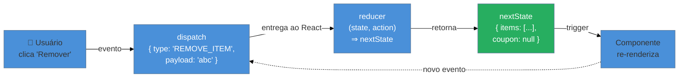
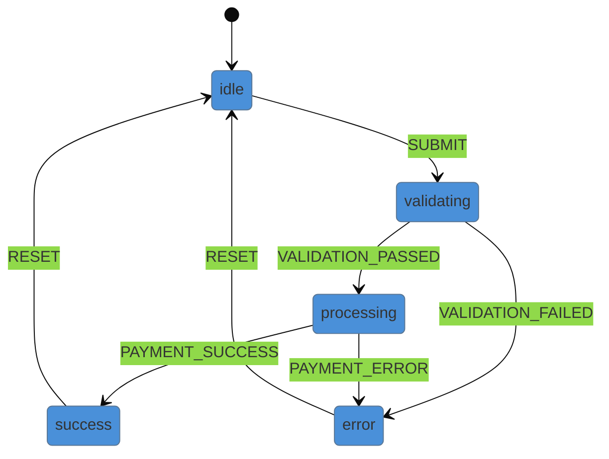

> [!abstract] TL;DR
> `useReducer` é o hook para quando `useState` vira um emaranhado: múltiplas variáveis que mudam juntas, transições que dependem do estado anterior ou lógica que seria mais legível como "o que aconteceu" (action) em vez de "qual é o novo valor". A assinatura `(state, action) => newState` centraliza toda a lógica de transição num reducer puro e testável. Em TypeScript, *discriminated unions* nas actions eliminam classes inteiras de bugs em tempo de compilação. Combinado com Context, o par `useReducer + Context` entrega compartilhamento de estado global sem Redux. Para estado muito aninhado, Immer suaviza a imutabilidade — mas o reducer precisa continuar puro.

## O problema: useState vira espaguete

Você está construindo um carrinho de compras. Começou com três `useState`s razoáveis:

```tsx
const [items, setItems] = useState<CartItem[]>([]);
const [coupon, setCoupon] = useState<string | null>(null);
const [isCheckingOut, setIsCheckingOut] = useState(false);
```

Funciona por um tempo. Mas, conforme o produto cresce, aparecem regras novas:

- Ao aplicar um cupom, o desconto depende dos itens já no carrinho.
- Ao iniciar o checkout, o cupom deve ser validado antes de seguir.
- Ao remover o último item, o cupom deve ser descartado automaticamente.

Agora você está espalhando `setItems`, `setCoupon` e `setIsCheckingOut` por event handlers diferentes, cada um tentando coordenar os outros. Se um handler atualiza `items` mas esquece de limpar `coupon`, o estado fica inconsistente. O bug existe antes mesmo de o usuário clicar.

Este é o sinal de que o estado tem **transições relacionadas** — e que precisa ser gerenciado como uma unidade, não como três variáveis soltas.

`useReducer` resolve exatamente isso.

## A anatomia do useReducer

A ideia central é separar **o que aconteceu** (action) de **como o estado muda** (reducer).

```tsx
import { useReducer } from 'react';

const [state, dispatch] = useReducer(reducer, initialState);
//     ^^^^^  ^^^^^^^^   ^^^^^^^^^ ^^^^^^^^^^^^^^^^^^^^^^
//     estado  despacha   a função  estado inicial
//     atual   ações      de lógica
```

Você nunca modifica `state` diretamente. Em vez disso, chama `dispatch` com uma *action* — um objeto que descreve o evento. O React passa o `state` atual e a `action` para o `reducer`, que retorna o próximo estado.

```
dispatch(action)
    ↓
reducer(state, action) → nextState
    ↓
React re-renderiza com nextState
```

### A função reducer

O reducer é uma **função pura**: dado o mesmo `state` e a mesma `action`, sempre retorna o mesmo novo estado. Sem efeitos colaterais, sem chamadas de API, sem mutação.

```tsx
function reducer(state: CartState, action: CartAction): CartState {
  switch (action.type) {
    case 'ADD_ITEM':
      return { ...state, items: [...state.items, action.payload] };
    case 'REMOVE_ITEM':
      return {
        ...state,
        items: state.items.filter(item => item.id !== action.payload),
        // Regra: remove cupom se carrinho esvaziar
        coupon: state.items.length === 1 ? null : state.coupon,
      };
    default:
      return state;
  }
}
```

Toda a lógica de negócio vive em um único lugar. Qualquer `case` pode ler e combinar partes do estado sem precisar coordenar múltiplos setters.

## Tipando com discriminated unions em TypeScript

Aqui está onde TypeScript brilha. *Discriminated unions* fazem o compilador saber exatamente qual formato cada action tem — e te proibem de acessar um campo que não existe.

```tsx
// Estado do carrinho
interface CartItem {
  id: string;
  name: string;
  price: number;
  quantity: number;
}

interface CartState {
  items: CartItem[];
  coupon: string | null;
  isCheckingOut: boolean;
}

// Actions: cada type tem seu próprio payload
type CartAction =
  | { type: 'ADD_ITEM';      payload: CartItem }
  | { type: 'REMOVE_ITEM';   payload: string }        // id do item
  | { type: 'UPDATE_QTY';    payload: { id: string; qty: number } }
  | { type: 'APPLY_COUPON';  payload: string }
  | { type: 'REMOVE_COUPON' }                         // sem payload
  | { type: 'START_CHECKOUT' }
  | { type: 'CANCEL_CHECKOUT' };
```

> [!question]- Por que discriminated union é melhor que `{ type: string; payload?: any }`?
> Com `payload?: any`, TypeScript não sabe que `ADD_ITEM` precisa de um `CartItem`. Você pode despachar `dispatch({ type: 'ADD_ITEM' })` sem payload e só vai quebrar em runtime. Com a union, o compilador recusa na linha errada: *"Property 'payload' is missing in type '{ type: "ADD_ITEM" }' but required in type '{ type: "ADD_ITEM"; payload: CartItem }'"*. O bug nunca chega ao browser.

No reducer, o TypeScript faz *narrowing* automático dentro de cada `case`:

```tsx
function cartReducer(state: CartState, action: CartAction): CartState {
  switch (action.type) {
    case 'ADD_ITEM':
      // Aqui TypeScript sabe: action.payload é CartItem ✓
      return {
        ...state,
        items: [...state.items, action.payload],
      };

    case 'REMOVE_ITEM': {
      // action.payload é string (id) ✓
      const updatedItems = state.items.filter(i => i.id !== action.payload);
      return {
        ...state,
        items: updatedItems,
        coupon: updatedItems.length === 0 ? null : state.coupon,
      };
    }

    case 'UPDATE_QTY':
      // action.payload é { id: string; qty: number } ✓
      return {
        ...state,
        items: state.items.map(item =>
          item.id === action.payload.id
            ? { ...item, quantity: action.payload.qty }
            : item
        ),
      };

    case 'APPLY_COUPON':
      return { ...state, coupon: action.payload };

    case 'REMOVE_COUPON':
      return { ...state, coupon: null };

    case 'START_CHECKOUT':
      return { ...state, isCheckingOut: true };

    case 'CANCEL_CHECKOUT':
      return { ...state, isCheckingOut: false };

    default:
      // Exhaustiveness check: se um case não for tratado, TS avisa ✓
      return state;
  }
}
```

> [!info] Exhaustiveness check
> Adicionar `default: return state` garante que o TypeScript se comporta corretamente se um `case` novo for adicionado ao tipo mas esquecido no reducer — nenhum estado vai sumir silenciosamente.

## O componente completo com useReducer

```tsx
import { useReducer } from 'react';

const initialState: CartState = {
  items: [],
  coupon: null,
  isCheckingOut: false,
};

function ShoppingCart() {
  const [cart, dispatch] = useReducer(cartReducer, initialState);

  function handleAddItem(item: CartItem) {
    dispatch({ type: 'ADD_ITEM', payload: item });
  }

  function handleRemoveItem(id: string) {
    dispatch({ type: 'REMOVE_ITEM', payload: id });
  }

  function handleApplyCoupon(code: string) {
    dispatch({ type: 'APPLY_COUPON', payload: code });
  }

  return (
    <div>
      {cart.items.map(item => (
        <div key={item.id}>
          <span>{item.name} — R$ {item.price}</span>
          <button onClick={() => handleRemoveItem(item.id)}>Remover</button>
        </div>
      ))}
      {cart.coupon && <p>Cupom aplicado: {cart.coupon}</p>}
      {!cart.isCheckingOut && (
        <button onClick={() => dispatch({ type: 'START_CHECKOUT' })}>
          Finalizar compra
        </button>
      )}
    </div>
  );
}
```

Compare com a versão em `useState`: cada handler agora chama `dispatch` com a intenção. A lógica de "o que fazer com essa intenção" vive no reducer — fora do componente, testável de forma independente.

## Fluxo de dados: o ciclo dispatch → reducer → render



O fluxo é sempre unidirecional: evento → dispatch → reducer → novo estado → render. Nunca ao contrário.

## State machine simples com useReducer

Reducers são naturalmente *state machines*: cada action é uma transição de um estado para outro. Isso fica claro quando o estado é uma string discriminada:

```tsx
// Máquina de estados: formulário de pagamento
type PaymentStatus =
  | 'idle'
  | 'validating'
  | 'processing'
  | 'success'
  | 'error';

interface PaymentState {
  status: PaymentStatus;
  errorMessage: string | null;
  transactionId: string | null;
}

type PaymentAction =
  | { type: 'SUBMIT' }
  | { type: 'VALIDATION_PASSED' }
  | { type: 'VALIDATION_FAILED'; payload: string }
  | { type: 'PAYMENT_SUCCESS'; payload: string }
  | { type: 'PAYMENT_ERROR'; payload: string }
  | { type: 'RESET' };

function paymentReducer(state: PaymentState, action: PaymentAction): PaymentState {
  switch (action.type) {
    case 'SUBMIT':
      if (state.status !== 'idle') return state; // Transição inválida: ignorar
      return { ...state, status: 'validating', errorMessage: null };

    case 'VALIDATION_PASSED':
      if (state.status !== 'validating') return state;
      return { ...state, status: 'processing' };

    case 'VALIDATION_FAILED':
      return { ...state, status: 'error', errorMessage: action.payload };

    case 'PAYMENT_SUCCESS':
      return { status: 'success', errorMessage: null, transactionId: action.payload };

    case 'PAYMENT_ERROR':
      return { ...state, status: 'error', errorMessage: action.payload };

    case 'RESET':
      return { status: 'idle', errorMessage: null, transactionId: null };

    default:
      return state;
  }
}
```



O ponto-chave: o reducer **rejeita transições inválidas** (`if (state.status !== 'idle') return state`). Estados ilegais ficam impossíveis de alcançar — não por convenção, mas por código.

> [!question]- Quando uma state machine formal (XState) é melhor que um reducer?
> Reducers funcionam bem para máquinas simples (3-6 estados, transições lineares). Quando os estados têm guards complexos, ações paralelas, timeouts automáticos ou você precisa de visualização do grafo, XState paga o custo. Para a maioria dos formulários e fluxos de checkout, o reducer é suficiente.

## useState vs useReducer: quando migrar?

A decisão não é binária — é um espectro. Comece com `useState` e migre quando perceber os sinais.

| Situação | Use `useState` | Use `useReducer` |
|---|---|---|
| Um valor independente | ✓ | — |
| Dois ou três valores sem relação | ✓ | — |
| Múltiplos valores que mudam juntos | — | ✓ |
| Próximo estado depende do atual | — | ✓ |
| Lógica que você quer testar sem React | — | ✓ |
| Vários componentes despacham o mesmo evento | — | ✓ |
| Estado é uma string enum (status machine) | — | ✓ |
| Contador simples, toggle, input controlado | ✓ | — |

> [!info] Regra prática de Kent C. Dodds
> "Se elementos do estado precisam mudar juntos, use `useReducer`." — [Should I useState or useReducer?](https://kentcdodds.com/blog/should-i-usestate-or-usereducer)

A migração de `useState` para `useReducer` é incremental: você extrai os setters para um reducer sem mudar o comportamento externo. Os testes passam antes e depois.

## useReducer + Context: alternativa leve ao Redux

`useReducer` sozinho gerencia estado local — só o componente que chama o hook acessa `dispatch`. Para compartilhar o estado e o `dispatch` com a árvore inteira, você combina com Context.

O padrão canônico cria **dois contexts separados**: um para o estado e outro para o dispatch.

```tsx
import { createContext, useContext, useReducer, ReactNode } from 'react';

// Contexts
const CartStateContext = createContext<CartState | null>(null);
const CartDispatchContext = createContext<React.Dispatch<CartAction> | null>(null);

// Provider
function CartProvider({ children }: { children: ReactNode }) {
  const [cart, dispatch] = useReducer(cartReducer, initialState);

  return (
    <CartStateContext.Provider value={cart}>
      <CartDispatchContext.Provider value={dispatch}>
        {children}
      </CartDispatchContext.Provider>
    </CartStateContext.Provider>
  );
}

// Hooks de acesso — nunca expõe o context cru
function useCart(): CartState {
  const ctx = useContext(CartStateContext);
  if (!ctx) throw new Error('useCart deve ser usado dentro de CartProvider');
  return ctx;
}

function useCartDispatch(): React.Dispatch<CartAction> {
  const ctx = useContext(CartDispatchContext);
  if (!ctx) throw new Error('useCartDispatch deve ser usado dentro de CartProvider');
  return ctx;
}
```

Por que dois contexts? Componentes que só leem estado (ex: um `<CartTotal />`) não re-renderizam quando `dispatch` muda — e vice-versa. Separar é uma otimização de performance que custa zero.

```tsx
// Componente que só lê
function CartTotal() {
  const { items, coupon } = useCart(); // Re-renderiza quando items mudam
  const total = items.reduce((sum, i) => sum + i.price * i.quantity, 0);
  return <p>Total: R$ {total}</p>;
}

// Componente que só despacha
function AddToCartButton({ item }: { item: CartItem }) {
  const dispatch = useCartDispatch(); // NÃO re-renderiza quando state muda
  return (
    <button onClick={() => dispatch({ type: 'ADD_ITEM', payload: item })}>
      Adicionar
    </button>
  );
}
```

> [!question]- Quando esse padrão se torna insuficiente e precisa de Redux/Zustand?
> Quando você precisar de: middleware (logging, analytics por action), time-travel debugging (Redux DevTools), persistência em localStorage automática, seleção com memoização fina (reselect), ou quando o grafo de dependências entre slices de estado ficar complexo demais para gerenciar manualmente.

## Immer: quando a imutabilidade cansa

Reducers com estado profundamente aninhado ficam verbosos:

```tsx
// Sem Immer — verbose para estado aninhado
case 'UPDATE_SHIPPING_ADDRESS':
  return {
    ...state,
    checkout: {
      ...state.checkout,
      shipping: {
        ...state.checkout.shipping,
        address: {
          ...state.checkout.shipping.address,
          city: action.payload,
        },
      },
    },
  };
```

Immer deixa você **escrever como se mutasse**, mas produz um novo objeto imutável por baixo dos panos:

```tsx
import { produce } from 'immer';

case 'UPDATE_SHIPPING_ADDRESS':
  return produce(state, draft => {
    draft.checkout.shipping.address.city = action.payload;
    // Immer cria uma cópia imutável — state original intacto
  });
```

Ou use o hook `useImmerReducer` da biblioteca `use-immer`:

```tsx
import { useImmerReducer } from 'use-immer';

const [cart, dispatch] = useImmerReducer(
  (draft, action) => {
    // Pode mutar draft diretamente
    switch (action.type) {
      case 'ADD_ITEM':
        draft.items.push(action.payload); // Sem spread!
        break;
    }
  },
  initialState
);
```

> [!warning] Immer não elimina a necessidade de reducer puro
> O reducer ainda não pode ter efeitos colaterais — chamadas de API, `console.log` com side effects, operações de I/O. Immer só resolve o problema da **sintaxe de imutabilidade**, não da **pureza da função**.

## Armadilhas comuns

> [!warning] Mutar o state diretamente
> **O que acontece:** o estado muda, mas o React não detecta a mudança e o componente não re-renderiza.
> **Por quê:** React compara referências de objetos. Se você muta `state.items.push(item)`, a referência do array continua a mesma — React acha que nada mudou.
> **Como evitar:** sempre retorne um novo objeto/array: `{ ...state, items: [...state.items, item] }`. Se o padrão spread ficar impraticável, adote Immer.

> [!warning] Efeitos colaterais dentro do reducer
> **O que acontece:** comportamentos inesperados, chamadas duplicadas de API, bugs difíceis de reproduzir (especialmente no React StrictMode que invoca o reducer duas vezes em dev).
> **Por quê:** reducers puros precisam ser idempotentes. O React pode chamar o reducer mais de uma vez para reconciliar.
> **Como evitar:** reducers só calculam o próximo estado. Efeitos colaterais vão em `useEffect`, event handlers ou middleware.

> [!warning] Action sem type discriminado ("any action")
> **O que acontece:** você perde o narrowing do TypeScript — `action.payload` pode ser `undefined` no runtime mesmo com tipo declarado.
> **Por quê:** `{ type: string; payload?: any }` é uma union de uma só variante. O compilador não sabe qual `case` corresponde a qual formato.
> **Como evitar:** declare a union de actions explicitamente com cada variante tipada. Veja a seção "Tipando com discriminated unions" acima.

> [!warning] Despachar em loops ou dentro do próprio reducer
> **O que acontece:** loop infinito de renders ou stack overflow.
> **Por quê:** `dispatch` dispara um re-render; se for chamado dentro de um `useEffect` sem dependências corretas, o ciclo nunca para.
> **Como evitar:** despachar só em event handlers, em `useEffect` com dependências estáveis, ou em respostas assíncronas (após `await`). Nunca dentro do corpo do reducer.

## Casos práticos

### Cenário 1: formulário multi-step com validação por passo

Um wizard de cadastro com 4 etapas, onde avançar para a próxima etapa depende de validação da atual, e voltar não deve resetar os dados já preenchidos.

```tsx
type WizardStep = 'personal' | 'address' | 'payment' | 'review';

interface WizardState {
  currentStep: WizardStep;
  data: {
    personal: PersonalData | null;
    address: AddressData | null;
    payment: PaymentData | null;
  };
  errors: Record<WizardStep, string | null>;
}

type WizardAction =
  | { type: 'SUBMIT_PERSONAL'; payload: PersonalData }
  | { type: 'SUBMIT_ADDRESS';  payload: AddressData }
  | { type: 'SUBMIT_PAYMENT';  payload: PaymentData }
  | { type: 'GO_BACK' }
  | { type: 'SET_ERROR'; payload: { step: WizardStep; message: string } };

const steps: WizardStep[] = ['personal', 'address', 'payment', 'review'];

function wizardReducer(state: WizardState, action: WizardAction): WizardState {
  switch (action.type) {
    case 'SUBMIT_PERSONAL':
      return {
        ...state,
        currentStep: 'address',
        data: { ...state.data, personal: action.payload },
        errors: { ...state.errors, personal: null },
      };
    case 'SUBMIT_ADDRESS':
      return {
        ...state,
        currentStep: 'payment',
        data: { ...state.data, address: action.payload },
      };
    case 'GO_BACK': {
      const currentIndex = steps.indexOf(state.currentStep);
      const prevStep = currentIndex > 0 ? steps[currentIndex - 1] : state.currentStep;
      return { ...state, currentStep: prevStep };
    }
    default:
      return state;
  }
}
```

O reducer garante que o botão "Voltar" nunca perde os dados já preenchidos — cada passo salva seu payload antes de avançar, e `GO_BACK` apenas muda `currentStep`.

### Cenário 2: dashboard com filtros encadeados

Uma tabela de dados com filtros de data, categoria e status que precisam ser aplicados juntos — mudar qualquer um deve resetar a paginação.

```tsx
interface DashboardState {
  filters: {
    dateRange: [Date, Date] | null;
    category: string | null;
    status: 'all' | 'active' | 'inactive';
  };
  page: number;
  pageSize: number;
}

type DashboardAction =
  | { type: 'SET_DATE_RANGE'; payload: [Date, Date] }
  | { type: 'SET_CATEGORY';   payload: string | null }
  | { type: 'SET_STATUS';     payload: 'all' | 'active' | 'inactive' }
  | { type: 'SET_PAGE';       payload: number }
  | { type: 'RESET_FILTERS' };

function dashboardReducer(state: DashboardState, action: DashboardAction): DashboardState {
  switch (action.type) {
    case 'SET_DATE_RANGE':
      // Mudar filtro reseta a paginação — regra garantida pelo reducer
      return { ...state, filters: { ...state.filters, dateRange: action.payload }, page: 1 };
    case 'SET_CATEGORY':
      return { ...state, filters: { ...state.filters, category: action.payload }, page: 1 };
    case 'SET_STATUS':
      return { ...state, filters: { ...state.filters, status: action.payload }, page: 1 };
    case 'SET_PAGE':
      return { ...state, page: action.payload };
    case 'RESET_FILTERS':
      return { ...state, filters: { dateRange: null, category: null, status: 'all' }, page: 1 };
    default:
      return state;
  }
}
```

A regra "mudar filtro reseta página" vive **uma vez** no reducer. Sem essa centralização, cada handler de filtro precisaria lembrar de chamar `setPage(1)` — e um dia alguém vai esquecer.

## Como explicar em inglês

> "I use `useReducer` when state has multiple related transitions that need to stay in sync — like a shopping cart where removing the last item should also clear the coupon. The reducer centralizes all that logic in a single pure function, making it testable in isolation. I type actions as discriminated unions so TypeScript narrows the payload type inside each case, which catches entire classes of bugs at compile time rather than runtime."

| PT | EN |
|---|---|
| reducer puro | pure reducer |
| despachar uma action | dispatch an action |
| union discriminada | discriminated union |
| estado complexo | complex state |
| transição de estado | state transition |
| máquina de estados | state machine |
| efeito colateral | side effect |
| imutabilidade | immutability |
| narrowing (de tipo) | type narrowing |
| estado inicial | initial state |

## useReducer em uma frase

`useReducer` é `useState` com endereço: em vez de definir o próximo valor, você descreve o que aconteceu — e o reducer decide o que fazer com isso.

## O que vem a seguir

Agora que o estado local complexo está sob controle, o próximo desafio é compartilhá-lo com componentes distantes na árvore sem prop drilling. O Context API é a ponte — e quando combinado com `useReducer`, o par substitui o Redux em muitos casos de uso reais.

- `useContext e Context API` (nota 11, a ser criada) — como propagar o `dispatch` para qualquer nível da árvore sem passar props manualmente
- `[[03-Dominios/Tecnologia/React/TypeScript com React/09 - Tipando reducers e state machines|Tipando reducers e state machines]]` — aprofunda as técnicas de tipagem de reducers: exhaustive check pattern, `ReturnType`, helper types para actions
- `[[05 - useState e estado local]]` — o ponto de partida antes de migrar para `useReducer`
- `Estado local, elevado e externo` (nota 15, a ser criada) — quando `useReducer + Context` não basta e Redux/Zustand entram em cena

## Referências

- **React Team** — [*useReducer – React Docs*](https://react.dev/reference/react/useReducer) — documentação oficial, inclui receitas de lazy initializer e casos de uso comparados com `useState`
- **React Team** — [*Extracting State Logic into a Reducer*](https://react.dev/learn/extracting-state-logic-into-a-reducer) — guia de migração passo a passo de `useState` para `useReducer`, com exemplos de carrinho e lista de tarefas
- **Kent C. Dodds** — [*Should I useState or useReducer?*](https://kentcdodds.com/blog/should-i-usestate-or-usereducer) — critério claro de decisão; cunhou a regra "elementos que mudam juntos"
- **Ben Ilegbodu** — [*Type-checking React useReducer in TypeScript*](https://www.benmvp.com/blog/type-checking-react-usereducer-typescript/) — guia focado em discriminated unions e narrowing no switch
- **Prateek Surana** — [*Simplify immutable data structures in useReducer with Immer*](https://prateeksurana.me/blog/simplify-immutable-data-structures-in-usereducer-with-immer/) — quando e como integrar Immer sem perder a pureza do reducer
- **Dmitri Pavlutin** — [*How to Use React useReducer() Hook*](https://dmitripavlutin.com/react-usereducer/) — introdução clara ao ciclo dispatch → reducer → render com diagramas
- **[[03-Dominios/Tecnologia/React/Dicionário de React|Dicionário de React]]** — glossário do vault com definições de termos React usados nesta nota
