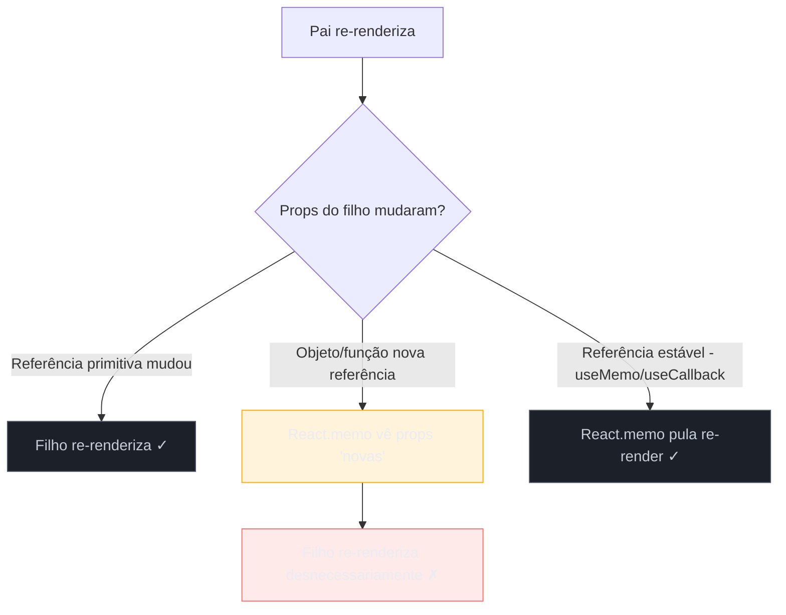
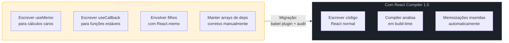

> [!abstract] TL;DR
> Re-renders desnecessários são o principal gargalo de performance em apps React. `useMemo` evita recalcular resultados caros, `useCallback` estabiliza referências de funções, e `React.memo` impede que componentes filhos re-renderizem quando suas props não mudaram. O elo entre os três é **referência estável**: um objeto ou função criado a cada render é sempre "novo" para o JS, então sem memoização o filho nunca enxerga props iguais. A revirada veio com o **React Compiler 1.0** (outubro 2025): ele analisa seu código em tempo de build e insere automaticamente as memoizações necessárias — tornando `useMemo`/`useCallback` manuais largamente desnecessários em projetos novos. Para código legado ou projetos sem o Compiler, os três hooks continuam sendo o arsenal padrão.

## O problema: re-renders que custam caro

Imagine uma lista de 10.000 produtos com campo de busca. A cada tecla digitada o componente pai re-renderiza — e junto com ele a lista inteira, mesmo que apenas o valor do input tenha mudado. O usuário digita "notebook" e o browser precisa reprocessar todos os dez mil itens, avaliar cada prop, percorrer toda a árvore virtual. Em componentes simples isso é rápido demais para perceber. Mas componentes com cálculos pesados, listas longas, gráficos ou lógica de negócio complexa tornam essa sequência visível: o campo de texto trava, a animação gagueja, o scroll hesita.

O React por padrão **re-renderiza toda a subárvore** quando o componente pai re-renderiza. Isso é correto e seguro — mas às vezes é desperdício. Memoização é a ferramenta para dizer ao React: "pode pular esse trabalho, nada relevante mudou".

---

## A analogia: post-it de resultado

Pense em um colega de trabalho que toda vez que você pergunta "qual o total das vendas de ontem?" sai e recalcula tudo do zero — abre o banco, agrega, formata, volta. Agora imagine que ele anota o resultado num post-it com a data. Na próxima vez que você perguntar, ele olha o post-it: se a data ainda for de ontem, entrega o número sem recalcular. Só descarta o post-it se a data mudar.

Isso é memoização: **guardar o resultado de um cálculo junto com as entradas que o produziram, e reutilizá-lo enquanto as entradas não mudarem**.

---

## `useMemo`: memoizar cálculo caro

### O problema que resolve

Toda vez que um componente re-renderiza, **todo código no corpo da função é executado novamente**. Se esse código inclui um filtro sobre 50.000 itens, uma transformação de dados complexa ou uma agregação, o custo aparece em cada render — mesmo que os dados de entrada não tenham mudado.

```tsx
// ❌ Sem memoização: filtra a lista inteira a cada tecla digitada no campo de busca
function ProductList({ products, query }: { products: Product[]; query: string }) {
  const filtered = products.filter((p) =>
    p.name.toLowerCase().includes(query.toLowerCase())
  );

  return (
    <ul>
      {filtered.map((p) => (
        <li key={p.id}>{p.name}</li>
      ))}
    </ul>
  );
}
```

Se `ProductList` re-renderiza porque o componente pai mudou algum estado não relacionado (ex: um modal abriu), o filtro roda de novo sem necessidade.

```tsx
// ✅ Com useMemo: só recalcula quando products ou query mudarem
function ProductList({ products, query }: { products: Product[]; query: string }) {
  const filtered = useMemo(
    () =>
      products.filter((p) =>
        p.name.toLowerCase().includes(query.toLowerCase())
      ),
    [products, query] // dependências: recalcula só quando esses valores mudarem
  );

  return (
    <ul>
      {filtered.map((p) => (
        <li key={p.id}>{p.name}</li>
      ))}
    </ul>
  );
}
```

### Assinatura e mecanismo

```tsx
const memoizedValue = useMemo(() => computeExpensiveValue(a, b), [a, b]);
```

- O primeiro argumento é uma **função que retorna o valor** — não o valor diretamente.
- O segundo é o **array de dependências**: se qualquer dep mudar entre renders (por comparação `Object.is`), o React descarta o cache e chama a função novamente.
- O React pode, em situações especiais (ex: modo concurrent), descartar o cache mesmo sem mudança nas deps — nunca coloque efeitos colaterais dentro de `useMemo`.

### Segundo uso: referência estável de objetos/arrays

`useMemo` não serve só para cálculos pesados. Ele também serve para **criar a mesma referência** de objeto ou array entre renders — crucial quando o objeto é passado para um filho memoizado.

```tsx
// ❌ Cria um novo objeto a cada render → filho sempre vê props "novas"
const config = { theme: "dark", locale: "pt-BR" };

// ✅ Mesma referência enquanto as deps não mudarem
const config = useMemo(
  () => ({ theme: "dark", locale: "pt-BR" }),
  [] // sem deps: só cria uma vez
);
```

---

## `useCallback`: memoizar funções

### Por que funções precisam de tratamento especial?

Em JavaScript, **toda função é um novo objeto a cada vez que é criada**. Isso significa que:

```tsx
const handleClick = () => console.log("clicado"); // render 1 → referência A
const handleClick = () => console.log("clicado"); // render 2 → referência B
```

`A !== B` mesmo que o código seja idêntico. Se você passa `handleClick` como prop para um filho memoizado com `React.memo`, o filho vai re-renderizar em todo render do pai — porque a prop `onClick` "mudou" (nova referência).

`useCallback` resolve isso:

```tsx
const handleClick = useCallback(() => {
  console.log("clicado");
}, []); // mesma referência enquanto as deps não mudarem
```

### Assinatura e relação com `useMemo`

```tsx
const memoizedFn = useCallback(fn, deps);
// Equivale a:
const memoizedFn = useMemo(() => fn, deps);
```

`useCallback` é um atalho de `useMemo` especializado em funções. Guarda a referência da função, não o resultado de chamá-la.

### Exemplo real: handleSubmit + filho memoizado

```tsx
function Form() {
  const [value, setValue] = useState("");
  const [otherState, setOtherState] = useState(0);

  // ❌ Sem useCallback: nova referência a cada render do Form
  // SubmitButton vai re-renderizar toda vez que otherState mudar
  const handleSubmit = () => submitForm(value);

  // ✅ Com useCallback: só recria a função quando value mudar
  const handleSubmit = useCallback(() => {
    submitForm(value);
  }, [value]);

  return (
    <>
      <input value={value} onChange={(e) => setValue(e.target.value)} />
      <button onClick={() => setOtherState((n) => n + 1)}>+</button>
      <SubmitButton onSubmit={handleSubmit} />
    </>
  );
}

const SubmitButton = React.memo(({ onSubmit }: { onSubmit: () => void }) => {
  console.log("SubmitButton renderizou");
  return <button onClick={onSubmit}>Enviar</button>;
});
```

Sem `useCallback`, clicar no botão `+` recria `handleSubmit` → `SubmitButton` re-renderiza. Com `useCallback`, a referência de `handleSubmit` só muda quando `value` muda.

---

## `React.memo`: pular re-render do componente filho

### O mecanismo de bailout

`React.memo` é um **Higher-Order Component** que envolve um componente funcional. Antes de re-renderizar, ele compara as props do render atual com as do render anterior usando **shallow comparison** (comparação rasa por `Object.is`).

- Se todas as props forem iguais → **pula o render**, reutiliza o resultado anterior.
- Se qualquer prop mudar → re-renderiza normalmente.

```tsx
// Sintaxe básica
const MemoizedComponent = React.memo(MyComponent);

// Com comparador customizado (raramente necessário)
const MemoizedComponent = React.memo(MyComponent, (prevProps, nextProps) => {
  return prevProps.id === nextProps.id; // true = props "iguais" = pula render
});
```

### Shallow comparison e o problema de props por valor vs. referência

Tipos primitivos (`string`, `number`, `boolean`) são comparados por valor — funcionam bem com `React.memo`. Objetos, arrays e funções são comparados por **referência**.

```tsx
// ❌ Objeto inline: nova referência a cada render → React.memo nunca pula
<MemoizedChild style={{ color: "red" }} />

// ✅ Referência estável via useMemo → React.memo funciona
const style = useMemo(() => ({ color: "red" }), []);
<MemoizedChild style={style} />
```

Esse é o motivo pelo qual `React.memo`, `useMemo` e `useCallback` formam um trio: **`React.memo` só funciona bem quando as props têm referência estável**.

---

## Fluxo completo: como os três se conectam



O fluxo crítico: o pai cria um objeto/função → sem memoização, nova referência → `React.memo` não consegue pular → filho re-renderiza mesmo sem mudança real.

---

## Quando memoizar — e quando NÃO memoizar

A memoização tem custo: o React precisa armazenar o valor anterior, executar a comparação das deps a cada render, e manter a referência viva na memória. Para componentes simples, esse custo pode ser **maior** que o custo do re-render evitado.

### Memoize quando:

| Situação | Hook/API |
|----------|----------|
| Cálculo demora visível (>1ms, ex: ordenar lista grande) | `useMemo` |
| Valor derivado passado como prop para filho memoizado | `useMemo` |
| Função passada como prop para filho memoizado | `useCallback` |
| Função usada como dep de `useEffect` (evitar loop) | `useCallback` |
| Componente filho renderiza frequentemente com props que raramente mudam | `React.memo` |
| Gráficos, tabelas virtualizadas, componentes com DOM pesado | `React.memo` |

### NÃO memoize quando:

| Situação | Por quê evitar |
|----------|----------------|
| Componente simples com DOM leve | Custo da comparação > custo do render |
| Prop é primitivo (string, number) | JS já compara por valor — React.memo funciona sem memo |
| Deps do useMemo mudam a cada render | Cache descartado sempre; só adiciona overhead |
| Sem profiling confirmando problema | Premature optimization — não otimize o que não está lento |

> [!question]- "Mas memoizar por precaução não é mais seguro?"
> Não. Cada `useMemo`/`useCallback` adiciona overhead de comparação de deps em todo render. Memoização de tudo sem profiling é um antipadrão documentado — o custo acumulado pode degradar o app. Meça primeiro, otimize depois.

---

## O React Compiler: automemoização em build-time

### O que é e como surgiu

O React Compiler (originalmente chamado **React Forget**) é um compilador de build-time que analisa seu código React e **insere automaticamente** as memoizações necessárias — equivalente a adicionar `useMemo`, `useCallback` e `React.memo` nas posições certas, sem que você escreva nenhum deles.

Saiu de beta e chegou à versão **1.0 estável em outubro de 2025** (anunciado em [react.dev/blog/2025/10/07/react-compiler-1](https://react.dev/blog/2025/10/07/react-compiler-1)). O Next.js 16 adotou como opt-in estável. O Meta usou em produção no Meta Quest Store antes do lançamento público, com melhoras de até 12% no tempo de carregamento e 2.5x em certas interações.

### Como funciona

```
Seu .tsx → Babel/Compiler Plugin → Código com memoizações automáticas → Bundle
```

O Compiler entende:

1. **Quais valores dependem de quê** — analisa o grafo de dependências do componente inteiro.
2. **O que é puro** — identifica funções sem efeitos colaterais que podem ser memoizadas com segurança.
3. **Onde inserir os limites de memoização** — insere equivalentes de `useMemo`/`useCallback`/`React.memo` precisamente onde há ganho real.

### Como adotar (projetos React 19+)

**Instalação:**

```bash
npm install --save-dev babel-plugin-react-compiler
npm install react-compiler-runtime
```

**Configuração (babel.config.js):**

```js
// babel.config.js
module.exports = {
  plugins: [
    ["babel-plugin-react-compiler", {
      // compilationMode: "all" → compila tudo (padrão recomendado para projetos novos)
      // compilationMode: "annotation" → só compila com diretiva "use memo"
      compilationMode: "all",
    }],
  ],
};
```

**No Next.js 16+:**

```ts
// next.config.ts
const nextConfig = {
  reactCompiler: true, // habilita o Compiler em todo o projeto
};
export default nextConfig;
```

**ESLint (detecta código que o Compiler não consegue otimizar):**

```bash
npm install --save-dev eslint-plugin-react-hooks
```

O plugin reporta quando um componente viola as regras de hooks ou tem padrões que impedem a otimização automática — um aviso de que aquele componente vai ser "bail-out" pelo Compiler.

### Adoção incremental com `"use memo"`

Para projetos legados, o modo `compilationMode: "annotation"` permite opt-in por arquivo:

```tsx
"use memo"; // diretiva no topo do arquivo

function ExpensiveList({ items }: { items: Item[] }) {
  // O Compiler vai otimizar este componente
  return <ul>{items.map((i) => <li key={i.id}>{i.name}</li>)}</ul>;
}
```

### O que muda na prática em 2026

```tsx
// ANTES do Compiler: você escreve isso manualmente
function SearchResults({ products, query }: Props) {
  const filtered = useMemo(
    () => products.filter((p) => p.name.includes(query)),
    [products, query]
  );

  const handleSelect = useCallback((id: string) => {
    onSelect(id);
  }, [onSelect]);

  return <ResultList items={filtered} onSelect={handleSelect} />;
}

// DEPOIS do Compiler: você escreve isso, o Compiler adiciona as memoizações em build-time
function SearchResults({ products, query }: Props) {
  const filtered = products.filter((p) => p.name.includes(query));

  const handleSelect = (id: string) => {
    onSelect(id);
  };

  return <ResultList items={filtered} onSelect={handleSelect} />;
}
```

O output compilado é funcionalmente equivalente ao primeiro — mas você não escreveu nenhum `useMemo` ou `useCallback`.

### Limitações e casos onde o Compiler faz bail-out

O Compiler **pula a otimização** de componentes que:

- Violam as regras dos hooks (chamadas condicionais, loops, etc.)
- Têm mutações de variáveis de maneiras que o Compiler não consegue rastrear
- Usam padrões com bibliotecas de terceiros que o Compiler não entende
- Dependem de efeitos colaterais em cálculos derivados

O ESLint plugin `eslint-plugin-react-hooks` reporta esses casos. Componentes com bail-out simplesmente **não são otimizados** — sem erro em runtime, sem quebra de comportamento.

---

## Antes e depois: visão comparativa



---

## Casos práticos

### Caso 1: Tabela com filtro e ordenação

```tsx
type SortKey = "name" | "price" | "stock";

interface Product {
  id: string;
  name: string;
  price: number;
  stock: number;
}

interface ProductTableProps {
  products: Product[];
  filter: string;
  sortKey: SortKey;
}

function ProductTable({ products, filter, sortKey }: ProductTableProps) {
  // Filtra E ordena — custo O(n log n) em cada render sem memo
  const processed = useMemo(() => {
    const lower = filter.toLowerCase();
    return [...products]
      .filter((p) => p.name.toLowerCase().includes(lower))
      .sort((a, b) => (a[sortKey] > b[sortKey] ? 1 : -1));
  }, [products, filter, sortKey]);

  return (
    <table>
      <tbody>
        {processed.map((p) => (
          <ProductRow key={p.id} product={p} />
        ))}
      </tbody>
    </table>
  );
}

// React.memo evita que ProductRow re-renderize quando ProductTable re-renderiza
// por outros motivos (ex: estado de paginação acima na árvore)
const ProductRow = React.memo(({ product }: { product: Product }) => (
  <tr>
    <td>{product.name}</td>
    <td>{product.price}</td>
    <td>{product.stock}</td>
  </tr>
));
```

### Caso 2: useCallback para evitar loops em useEffect

Sem `useCallback`, uma função recriada a cada render que aparece nas deps de `useEffect` causa um loop infinito: a função muda → effect dispara → componente re-renderiza → função muda novamente.

```tsx
function UserProfile({ userId }: { userId: string }) {
  const [profile, setProfile] = useState<User | null>(null);

  // ❌ Sem useCallback: fetchUser é nova função a cada render
  // → useEffect dispara em todo render → loop infinito
  const fetchUser = async () => {
    const data = await api.getUser(userId);
    setProfile(data);
  };

  // ✅ Com useCallback: fetchUser só muda quando userId muda
  const fetchUser = useCallback(async () => {
    const data = await api.getUser(userId);
    setProfile(data);
  }, [userId]);

  useEffect(() => {
    fetchUser();
  }, [fetchUser]); // dep explícita — funciona sem loop

  return profile ? <div>{profile.name}</div> : <Spinner />;
}
```

Este padrão conecta diretamente à forma como `useEffect` modela dependências — tema aprofundado em `09 - useEffect e o modelo de efeitos` (quando disponível no galho).

---

## Armadilhas comuns

> [!warning] Memoizar tudo por padrão
> **O que acontece:** `useMemo`/`useCallback` em todo componente e toda função, sem profiling. **Por quê:** A comparação de dependências tem custo real. Em componentes simples com renders rápidos, o overhead da memoização é maior que o custo do re-render evitado. O resultado é um app mais lento, não mais rápido. **Como evitar:** Use React DevTools Profiler para identificar quais componentes re-renderizam com frequência E têm custo real. Só então aplique memoização cirúrgica.

> [!warning] Array de dependências incompleto no `useMemo`
> **O que acontece:** Um valor usado dentro do `useMemo` foi omitido das deps. O cálculo usa um valor "stale" (desatualizado) porque o React não sabe que precisa recalcular. **Por quê:** O ESLint rule `exhaustive-deps` (do `eslint-plugin-react-hooks`) detecta esse caso, mas é fácil ignorar o aviso ou desabilitá-lo sem entender o impacto. **Como evitar:** Nunca desabilite `// eslint-disable-next-line react-hooks/exhaustive-deps` sem entender por que o linter reclamou. Se a dep muda demais e invalida o cache, reavalie se `useMemo` é a ferramenta certa ali.

> [!warning] `React.memo` com prop de objeto inline
> **O que acontece:** Componente envolvido com `React.memo` re-renderiza em todo render do pai mesmo assim. **Por quê:** `<MemoizedChild style={{ color: "red" }} />` cria um novo objeto `{ color: "red" }` a cada render. `React.memo` compara por shallow reference — novo objeto → props "mudaram" → re-renderiza. **Como evitar:** Stabilize a prop com `useMemo` (para objetos) ou `useCallback` (para funções) no componente pai.

> [!warning] Confundir `useMemo` (valor) com `useCallback` (função)
> **O que acontece:** `useMemo(() => myFn, [deps])` retorna `myFn` (a função em si, sem chamá-la) — não o resultado de chamar `myFn`. Isso é o que `useCallback` faz. Se o objetivo era memoizar o *resultado*, isso está errado. **Por quê:** A assinatura similar confunde — ambos recebem `(fn, deps)`. **Como evitar:** `useMemo` → memoiza o *retorno* da função passada. `useCallback` → memoiza a *função em si*. Regra prática: se você quer guardar um valor calculado, use `useMemo`; se quer guardar uma função para passar como prop ou dep, use `useCallback`.

---

## Como explicar em inglês

React memoization is about avoiding unnecessary re-renders by caching computed values and stable references. `useMemo` prevents expensive recalculations from running on every render, `useCallback` stabilizes function references so memoized children don't see "new" props on every render cycle, and `React.memo` lets a child component bail out of re-rendering when its props haven't changed. Since React Compiler 1.0 shipped in late 2025, manual memoization is largely a legacy concern for new projects — the compiler inserts optimizations at build time automatically.

| PT | EN |
|----|-----|
| memoização | memoization |
| referência estável | stable reference |
| re-render desnecessário | unnecessary re-render / wasted render |
| comparação rasa | shallow comparison |
| prop de função | function prop / callback prop |
| dependências | dependencies / deps |
| bail-out de render | render bail-out |
| compilador de build-time | build-time compiler |
| automemoização | automatic memoization |
| custo de comparação | comparison overhead |

---

## Resumo em uma linha

Memoização em React é o contrato de "só refaz o trabalho se as entradas mudaram" — e o React Compiler 1.0 torna esse contrato automático, eliminando a necessidade de gerenciá-lo manualmente na maioria dos casos.

---

## O que vem a seguir

Com memoização você controla *quando* um componente re-renderiza — mas entender *por que* um render acontece em primeiro lugar, e como o React decide o que reconciliar no DOM, é o próximo nível. A seção de performance e de reconciliation do galho aprofundam esses mecanismos:

- `09 - useEffect e o modelo de efeitos` — como referências estáveis de funções evitam loops em effects (ainda não existe no galho; será criado)
- `11 - useContext e Context API` — como `useMemo` estabiliza o value do Provider para evitar re-renders em cascata de consumidores (ainda não existe no galho)
- `16 - Reconciliation e diffing a fundo` — o mecanismo por trás do "render bail-out" que `React.memo` aciona (ainda não existe no galho)
- `17 - Performance no React` — profiling com React DevTools, identificar re-renders caros, estratégias complementares à memoização (ainda não existe no galho)
- [[03-Dominios/Tecnologia/React/Dicionário de React|Dicionário de React]] — glossário de termos React usados nesta nota

---

## Referências

- **React Team** — [*React Compiler v1.0*](https://react.dev/blog/2025/10/07/react-compiler-1) — Anúncio oficial da versão estável com guia de adoção e resultados de produção no Meta
- **React Docs** — [*React Compiler — Introduction*](https://react.dev/learn/react-compiler/introduction) — Documentação oficial do Compiler com instalação e exemplos
- **React Docs** — [*React Compiler — Incremental Adoption*](https://react.dev/learn/react-compiler/incremental-adoption) — Guia de adoção incremental com `"use memo"` e gating por feature flag
- **React Docs** — [*useMemo*](https://react.dev/reference/react/useMemo) — Referência oficial da API com exemplos de uso correto e incorreto
- **React Docs** — [*useCallback*](https://react.dev/reference/react/useCallback) — Referência oficial com casos de uso e alternativas
- **React Docs** — [*React.memo*](https://react.dev/reference/react/memo) — Referência oficial com shallow comparison e comparador customizado
- **Josh W. Comeau** — [*Understanding useMemo and useCallback*](https://www.joshwcomeau.com/react/usememo-and-usecallback/) — Artigo definitivo sobre quando cada hook resolve um problema real vs. overhead desnecessário
- **Sascha Becker** — [*The React Compiler at Eighteen Months*](https://www.saschb2b.com/blog/react-compiler-year-in-review) — Análise retrospectiva dos debates e estado do Compiler em 2026
- **InfoQ** — [*Meta's React Compiler 1.0 Brings Automatic Memoization to Production*](https://www.infoq.com/news/2025/12/react-compiler-meta/) — Números de produção e análise de impacto no Meta Quest Store
