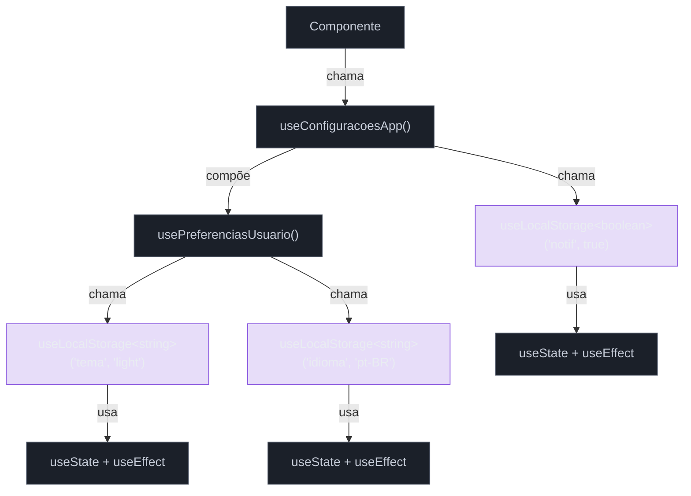

# Custom hooks

> [!abstract] TL;DR
> Custom hooks são funções TypeScript cujo nome começa com `use` e que encapsulam lógica **com estado** reutilizável — não UI. Cada chamada ao hook cria um estado totalmente isolado: dois componentes que chamam `useToggle()` têm toggles independentes. As Regras dos Hooks existem porque o React identifica cada hook pela sua **posição na ordem de chamada** (linked list), não pelo nome da variável — quebrar a ordem corromperia o mapeamento state→hook. Hooks compostos (um hook que chama outros) são o padrão de reutilização mais poderoso do ecossistema React.

---

Imagine que você tem três componentes diferentes — um modal, um drawer e um menu dropdown — e os três precisam controlar um booleano `open`/`closed` com funções `toggle`, `open` e `close`. Você começa copiando a lógica. Dois dias depois, há um bug: o modal não fecha quando você pressiona Escape. Você corrige em um lugar. Uma semana depois descobre que o drawer e o dropdown ainda têm o bug.

Essa é a dor que os custom hooks resolvem: extrair lógica com estado para um lugar só, sem precisar de hierarquia de componentes, sem Context API, sem Redux.

---

## O que é um custom hook, exatamente?

Um custom hook é **uma função JavaScript/TypeScript cujo nome começa com `use`** e que pode chamar outros hooks (built-in ou customizados). É só isso. Nenhuma mágica especial — a convenção `use*` existe para que o linter e o React DevTools reconheçam o arquivo como "um lugar onde hooks são válidos".

```tsx
// ✅ custom hook — pode chamar useState, useEffect, outros hooks
function useToggle(initialValue = false) {
  const [value, setValue] = useState(initialValue);
  const toggle = useCallback(() => setValue(v => !v), []);
  return [value, toggle] as const;
}

// ❌ função comum — não pode chamar hooks
function computeToggle(initialValue = false) {
  const [value, setValue] = useState(initialValue); // erro de lint!
  // ...
}
```

A diferença entre um componente e um custom hook: o componente retorna JSX; o hook retorna dados, funções, ou uma tupla — qualquer coisa **exceto** JSX.

Consulte o [[03-Dominios/Tecnologia/React/Dicionário de React|Dicionário de React]] para o glossário de termos React usados nesta nota.

---

## Por que a convenção `use*` importa

O prefixo `use` não é decorativo. Ele sinaliza para três coisas ao mesmo tempo:

1. **React DevTools** — consegue inspecionar o estado interno do hook na árvore de componentes.
2. **ESLint plugin** (`eslint-plugin-react-hooks`) — sabe que pode aplicar as Regras dos Hooks dentro dessa função.
3. **Leitores humanos** — sabem imediatamente que esta função pode ter efeitos colaterais de ciclo de vida.

Sem o prefixo `use`, o linter não valida as regras dentro da função e o DevTools não consegue rastrear o estado.

---

## As Regras dos Hooks — e por quê elas existem

As Regras dos Hooks parecem arbitrárias na primeira leitura. Mas há um mecanismo concreto por baixo.

### Como o React rastreia hooks internamente

O React não usa nomes de variáveis para identificar qual hook é qual. Ele mantém uma **linked list** de "células de memória" para cada componente — uma célula por hook chamado, na ordem em que foram chamados.

```tsx
function Contador() {
  const [count, setCount] = useState(0);   // célula 0
  const [nome, setNome] = useState("");    // célula 1
  useEffect(() => { /* ... */ }, [count]); // célula 2
  // ...
}
```

A cada render, o React percorre essa lista na mesma ordem. A célula 0 sempre pertence ao primeiro `useState`, a célula 1 ao segundo, e assim por diante. O estado de `count` vive na célula 0 **por posição**, não por nome.

Veja também [[04 - Renderização - o que dispara um render]] para entender quando o React percorre essa lista.

### O que quebra quando você viola a ordem

```tsx
// ❌ NÃO FAÇA ISSO
function Perfil({ usuario }: { usuario: Usuario | null }) {
  if (!usuario) return null; // early return ANTES dos hooks

  const [editando, setEditando] = useState(false); // célula 0 (às vezes)
  useEffect(() => { /* fetch dados */ }, [usuario.id]); // célula 1 (às vezes)
}
```

Se `usuario` for `null` no primeiro render, nenhum hook é chamado — a lista tem 0 células. Se no segundo render `usuario` existir, de repente há 2 células. O React tenta mapear as células antigas nas novas posições e obtém lixo: o estado do `useState` do segundo render é associado a um hook que não existia antes.

```tsx
// ✅ CORRETO — hooks sempre chamados, early return depois
function Perfil({ usuario }: { usuario: Usuario | null }) {
  const [editando, setEditando] = useState(false); // célula 0, sempre
  useEffect(() => {
    if (!usuario) return; // condição DENTRO do efeito
    /* fetch dados */
  }, [usuario?.id]);

  if (!usuario) return null; // early return DEPOIS dos hooks
}
```

### As duas regras, formuladas com precisão

**Regra 1 — Só no topo:** Chame hooks no topo da função — antes de qualquer `if`, `for`, `while`, early return, ou função aninhada. Isso garante que a ordem seja sempre a mesma.

**Regra 2 — Só em componentes ou custom hooks:** Não chame hooks em funções utilitárias comuns, callbacks de evento, ou fora de um contexto React. A linked list só existe no contexto de renderização de um componente.

```tsx
// ❌ hook fora de componente/hook — erro em runtime
function formatarData(timestamp: number) {
  const [locale] = useState("pt-BR"); // não existe linked list aqui
  return new Intl.DateTimeFormat(locale).format(timestamp);
}
```

---

## Isolamento de estado — cada chamada é um universo separado

Esse ponto é contraintuitivo e merece atenção explícita: **cada chamada a um custom hook cria um conjunto de estado completamente isolado**.

```tsx
function useToggle(initial = false) {
  const [value, setValue] = useState(initial);
  const toggle = useCallback(() => setValue(v => !v), []);
  return [value, toggle] as const;
}

function App() {
  const [modalAberto, toggleModal] = useToggle();    // estado próprio
  const [drawerAberto, toggleDrawer] = useToggle();  // estado próprio, diferente
  const [menuAberto, toggleMenu] = useToggle();      // estado próprio, diferente

  // Clicar em toggleModal não afeta drawerAberto nem menuAberto
}
```

`useToggle` não é um singleton. Cada componente que chama `useToggle()` tem seu próprio `useState` interno. Se você precisa que dois componentes **compartilhem** o mesmo estado, custom hooks **não** são a ferramenta certa — você precisa de `useContext`, estado global (Zustand, Jotai), ou lift state up.

> [!info] Analogia: molde de bolo
> Um custom hook é como um **molde de bolo**: cada vez que você despeja a massa (chama o hook), você obtém um bolo novo e independente. O molde não guarda o bolo anterior — ele apenas define a forma.

Veja [[05 - useState e estado local]] para entender como o estado local se comporta dentro dos hooks.

---

## Compor hooks — um hook que chama outros

A parte mais poderosa dos custom hooks é a composição: hooks podem chamar outros hooks.

```tsx
// Hook de baixo nível
function useLocalStorage<T>(key: string, initialValue: T) {
  // ... (implementação completa abaixo)
}

// Hook de médio nível — compõe useLocalStorage
function usePreferenciasUsuario() {
  const [tema, setTema] = useLocalStorage<"light" | "dark">("tema", "light");
  const [idioma, setIdioma] = useLocalStorage<string>("idioma", "pt-BR");
  return { tema, setTema, idioma, setIdioma };
}

// Hook de alto nível — compõe usePreferenciasUsuario
function useConfiguracoesApp() {
  const preferencias = usePreferenciasUsuario();
  const [notificacoes, setNotificacoes] = useLocalStorage("notif", true);
  return { ...preferencias, notificacoes, setNotificacoes };
}
```

Cada camada adiciona um nível de abstração. O componente final só enxerga `useConfiguracoesApp()` — não precisa saber que há `localStorage` por baixo.



---

## Exemplos clássicos — implementações completas

### `useToggle` — o mais simples

```tsx
import { useCallback, useState } from "react";

type UseToggleReturn = [boolean, () => void, (value: boolean) => void];

function useToggle(initialValue = false): UseToggleReturn {
  const [value, setValue] = useState(initialValue);

  const toggle = useCallback(() => setValue(v => !v), []);
  const set = useCallback((v: boolean) => setValue(v), []);

  return [value, toggle, set];
}

// Uso
function Modal() {
  const [aberto, toggleAberto, setAberto] = useToggle();

  return (
    <>
      <button onClick={toggleAberto}>Abrir</button>
      {aberto && (
        <dialog open>
          <button onClick={() => setAberto(false)}>Fechar</button>
        </dialog>
      )}
    </>
  );
}
```

---

### `useLocalStorage` — tipado com genérico

O desafio aqui é tratar três casos de borda: `localStorage` pode não existir (SSR), o JSON pode estar corrompido, e o storage pode lançar erro (modo privado com cota cheia).

```tsx
import { useCallback, useEffect, useState } from "react";

function useLocalStorage<T>(key: string, initialValue: T) {
  // Lê o valor inicial de forma lazy — evita leitura em SSR
  const [storedValue, setStoredValue] = useState<T>(() => {
    if (typeof window === "undefined") return initialValue;
    try {
      const item = window.localStorage.getItem(key);
      return item !== null ? (JSON.parse(item) as T) : initialValue;
    } catch {
      console.warn(`useLocalStorage: erro ao ler key "${key}"`);
      return initialValue;
    }
  });

  // Persiste quando o valor muda
  useEffect(() => {
    if (typeof window === "undefined") return;
    try {
      window.localStorage.setItem(key, JSON.stringify(storedValue));
    } catch {
      console.warn(`useLocalStorage: erro ao gravar key "${key}"`);
    }
  }, [key, storedValue]);

  // Retorno: tupla [valor, setter] com as const para tipar corretamente
  const setValue = useCallback(
    (value: T | ((prev: T) => T)) => {
      setStoredValue(prev =>
        typeof value === "function" ? (value as (prev: T) => T)(prev) : value
      );
    },
    []
  );

  return [storedValue, setValue] as const;
}

// Uso tipado — T é inferido pelo initialValue
function ConfiguracaoTema() {
  const [tema, setTema] = useLocalStorage<"light" | "dark">("tema", "light");
  //    ^-- "light" | "dark"  ✓

  return (
    <button onClick={() => setTema(t => t === "light" ? "dark" : "light")}>
      Tema: {tema}
    </button>
  );
}
```

Veja [[09 - useEffect e o modelo de efeitos]] para entender por que o efeito de persistência não pode estar direto no setter.

---

### `useDebounce` — genérico, delay configurável

Debounce adia a propagação de um valor até que o usuário pare de digitar por `delay` milissegundos. Útil para buscas, auto-save, e qualquer operação cara.

```tsx
import { useEffect, useState } from "react";

function useDebounce<T>(value: T, delay = 300): T {
  const [debouncedValue, setDebouncedValue] = useState<T>(value);

  useEffect(() => {
    const timer = setTimeout(() => setDebouncedValue(value), delay);
    return () => clearTimeout(timer); // cleanup cancela o timer anterior
  }, [value, delay]);

  return debouncedValue;
}

// Uso com busca
function BuscaProdutos() {
  const [query, setQuery] = useState("");
  const debouncedQuery = useDebounce(query, 400); // dispara só após 400ms parado

  useEffect(() => {
    if (!debouncedQuery) return;
    fetch(`/api/produtos?q=${debouncedQuery}`)
      .then(r => r.json())
      .then(console.log);
  }, [debouncedQuery]); // não reexecuta a cada tecla, só após debounce

  return <input value={query} onChange={e => setQuery(e.target.value)} />;
}
```

> [!question]- Por que o cleanup de `useEffect` é essencial aqui?
> Sem o `return () => clearTimeout(timer)`, cada render com novo valor de `query` criaria um timer novo **sem cancelar o anterior**. Se o usuário digitar 10 caracteres em 200ms, haveria 10 timers ativos simultaneamente — todos disparando, todos atualizando o estado, todos causando re-renders. O cleanup garante que apenas o timer mais recente sobrevive.

---

### `useMediaQuery` — integra com o browser

```tsx
import { useEffect, useState } from "react";

function useMediaQuery(query: string): boolean {
  const [matches, setMatches] = useState<boolean>(() => {
    if (typeof window === "undefined") return false;
    return window.matchMedia(query).matches;
  });

  useEffect(() => {
    if (typeof window === "undefined") return;
    const mediaQueryList = window.matchMedia(query);
    const handler = (e: MediaQueryListEvent) => setMatches(e.matches);

    // API moderna (suporte amplo desde 2020)
    mediaQueryList.addEventListener("change", handler);
    return () => mediaQueryList.removeEventListener("change", handler);
  }, [query]);

  return matches;
}

// Uso
function Layout() {
  const isMobile = useMediaQuery("(max-width: 768px)");
  return isMobile ? <MobileNav /> : <DesktopNav />;
}
```

---

## Tipando custom hooks — tupla vs objeto

A escolha entre retornar uma tupla ou um objeto afeta ergonomia e type safety.

### Tupla com `as const` — para ≤2 valores

```tsx
// ❌ sem "as const" — TypeScript infere (boolean | () => void)[] — union inútil
function useToggle() {
  const [v, setV] = useState(false);
  return [v, () => setV(x => !x)]; // tipo: (boolean | (() => void))[]
}

// ✅ com "as const" — TypeScript infere [boolean, () => void] — tuple exata
function useToggle() {
  const [v, setV] = useState(false);
  return [v, () => setV(x => !x)] as const; // tipo: readonly [boolean, () => void]
}

// Alternativa: named tuple (mais documentado)
function useToggle(): [value: boolean, toggle: () => void] {
  const [v, setV] = useState(false);
  return [v, () => setV(x => !x)];
}
```

### Objeto — para ≥3 valores ou quando nomes importam

```tsx
// ✅ objeto quando há muitos campos — sem ambiguidade de posição
function useFormField(initialValue: string) {
  const [value, setValue] = useState(initialValue);
  const [touched, setTouched] = useState(false);
  const [error, setError] = useState<string | null>(null);

  return {
    value,
    touched,
    error,
    onChange: (e: React.ChangeEvent<HTMLInputElement>) => {
      setValue(e.target.value);
      setTouched(true);
    },
    onBlur: () => setTouched(true),
    setError,
    reset: () => { setValue(initialValue); setTouched(false); setError(null); },
  };
}

// Uso — nomes explícitos, sem depender de posição
const emailField = useFormField("");
const { value, error, onChange } = emailField;
```

**Regra de bolso:** use tupla quando o hook espelha o padrão `[state, setter]` do `useState`. Use objeto quando há mais de dois valores ou quando a posição na tupla seria ambígua.

Para tipagem avançada de hooks customizados, veja [[03-Dominios/Tecnologia/React/TypeScript com React/07 - Tipando hooks customizados|Tipando hooks customizados]].

---

## Armadilhas comuns

> [!warning] Hook chamado condicionalmente
> **O que acontece:** `useState` ou `useEffect` dentro de um `if` — o linter avisa, mas o erro em runtime é sutil: o estado de um hook é atribuído ao hook errado na re-renderização. **Por quê:** O React usa a **posição na linked list** para mapear hooks ao seu estado. Se o `if` mudar entre renders, a lista muda de tamanho e o mapeamento fica errado. **Como evitar:** Mova a condição para dentro do hook (dentro do `useEffect`, por exemplo). Nunca envolva o hook em um `if`. Hooks sempre no topo, condições dentro.
>
> ```tsx
> // ❌
> if (usuario) {
>   const [nome, setNome] = useState(usuario.nome);
> }
>
> // ✅
> const [nome, setNome] = useState(usuario?.nome ?? "");
> ```

> [!warning] Hook chamado fora de componente ou custom hook
> **O que acontece:** Chamar `useState` ou `useEffect` em uma função utilitária comum (não prefixada com `use`, não componente) causa erro em runtime: "Invalid hook call". **Por quê:** A linked list de hooks só existe no contexto de renderização de um componente. Fora desse contexto, não há lugar para guardar o estado. **Como evitar:** Se a função precisa de estado, ela **é** um hook — renomeie para `use*` e garanta que só é chamada em componentes ou outros hooks.
>
> ```tsx
> // ❌ função utilitária com hook
> function formatarComContador(texto: string) {
>   const [count, setCount] = useState(0); // ERRO: não é componente nem hook
>   return `${texto} (${count})`;
> }
>
> // ✅ promovida a hook
> function useFormatarComContador(texto: string) {
>   const [count, setCount] = useState(0);
>   return { formatted: `${texto} (${count})`, increment: () => setCount(c => c + 1) };
> }
> ```

> [!warning] Esperar que dois componentes compartilhem estado via mesmo hook
> **O que acontece:** `ComponenteA` e `ComponenteB` chamam `useToggle()`. O desenvolvedor espera que alterar o toggle em A afete B — mas não afeta. **Por quê:** Cada chamada ao hook instancia um estado **novo e independente**. O hook é um molde, não um singleton. **Como evitar:** Para estado compartilhado, use `useContext` + um provider, ou um gerenciador de estado global (Zustand, Jotai). O custom hook pode ainda encapsular a lógica, mas o estado precisa viver em um lugar centralizado.
>
> ```tsx
> // ❌ ilusão de estado compartilhado
> function ComponenteA() { const [aberto] = useToggle(); /* ... */ }
> function ComponenteB() { const [aberto] = useToggle(); /* estado diferente! */ }
>
> // ✅ compartilhar via Context
> const ToggleContext = createContext<ReturnType<typeof useToggle> | null>(null);
> function ToggleProvider({ children }: { children: React.ReactNode }) {
>   const toggle = useToggle();
>   return <ToggleContext.Provider value={toggle}>{children}</ToggleContext.Provider>;
> }
> ```

> [!warning] Dependências de `useEffect` incompletas dentro do hook
> **O que acontece:** Um hook interno usa `useEffect` mas omite dependências — o efeito não re-executa quando deveria, causando dados stale. **Por quê:** As regras de `exhaustive-deps` do linter se aplicam **dentro** do hook exatamente como em componentes. O hook não tem tratamento especial. **Como evitar:** Sempre complete o array de dependências. Use `useCallback` para funções que entram como dependência para estabilizar a referência.

---

## Custom hooks em uma frase

> Um custom hook é uma função `use*` que extrai lógica **com estado** para ser reutilizada sem duplicar componentes — cada chamada cria estado isolado, e a ordem de chamada nunca pode mudar.

---

## Como explicar em inglês

Custom hooks are functions prefixed with `use` that extract stateful logic — not UI — from components. Each call to a custom hook creates its own isolated state, so two components calling `useToggle()` have completely independent toggles. The Rules of Hooks exist because React tracks each hook by its **position in the call order**, not by variable name; conditional or looped calls corrupt that positional mapping.

| PT | EN |
|----|-----|
| Hook customizado | Custom hook |
| Regras dos Hooks | Rules of Hooks |
| Ordem de chamada | Call order |
| Estado isolado | Isolated state |
| Compor hooks | Composing hooks |
| Tupla com `as const` | Tuple with `as const` |
| Célula de memória | Memory cell / hook slot |
| Lista encadeada | Linked list |
| Extrair lógica com estado | Extract stateful logic |
| Funções utilitárias | Utility functions |

---

## O que vem a seguir

Custom hooks são a fundação para abstrações mais poderosas. O próximo passo natural é entender como organizar hooks que dependem de dados assíncronos — onde o estado de loading, error e data precisam ser coordenados.

- [[19 - Suspense e data fetching no cliente]] — Suspense como alternativa declarativa ao padrão `isLoading/error/data` que os hooks de fetch costumam expor; como `use()` do React 19 muda o modelo.
- [[03-Dominios/Tecnologia/React/TypeScript com React/07 - Tipando hooks customizados|Tipando hooks customizados]] — Tipagem avançada: genéricos, overloads, inferência de retorno, padrões para hooks com múltiplos modos.

---

## Referências

- **Dan Abramov** — [*Why Do React Hooks Rely on Call Order?*](https://overreacted.io/why-do-hooks-rely-on-call-order/) — Explicação canônica do mecanismo de linked list por trás das Regras dos Hooks; escrita pelo co-autor do feature.
- **React Docs** — [*Rules of Hooks*](https://react.dev/reference/rules/rules-of-hooks) — Referência oficial; inclui o raciocínio formal por trás das duas regras.
- **fettblog.eu** — [*TypeScript + React: Typing custom hooks with tuple types*](https://fettblog.eu/typescript-react-typeing-custom-hooks/) — Guia focado em `as const` e named tuples para evitar inferência de union.
- **React TypeScript Cheatsheet** — [*Hooks*](https://react-typescript-cheatsheet.netlify.app/docs/basic/getting-started/hooks/) — Referência rápida de padrões de tipagem para hooks customizados.
- **usehooks-ts** — [*useLocalStorage*](https://usehooks-ts.com/react-hook/use-local-storage) — Implementação de referência open source com suporte a SSR, sync entre abas e serialização customizada.
- **JavaScriptDoctor** — [*7 Battle-Tested React Hooks for Pro Developers (2026)*](https://www.javascriptdoctor.blog/2026/04/7-battle-tested-react-hooks-for-pro.html) — Panorama dos padrões mais usados em produção em 2026.
