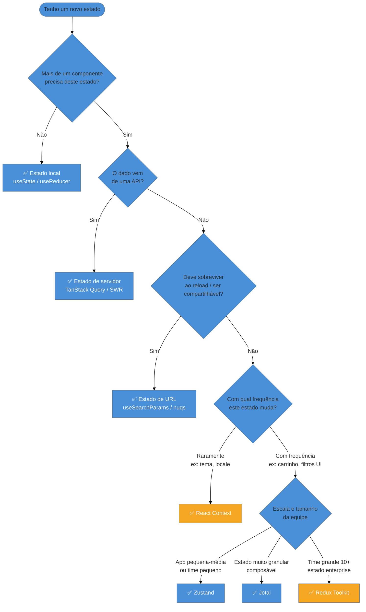

> [!abstract] TL;DR
> Estado em React tem **endereço certo**: local (`useState`/`useReducer`) quando só um componente precisa; elevado pro ancestral comum quando dois precisam compartilhar; na URL quando precisa ser compartilhável ou sobreviver ao reload; em cache de servidor (TanStack Query) quando veio de uma API; e em store global (Zustand, Redux Toolkit, Jotai) só quando o estado é genuinamente global — tema, usuário autenticado, carrinho. O princípio que governa tudo isso chama-se **colocation**: estado mora o mais perto possível de quem o usa. Violá-lo sem motivo gera re-renders desnecessários, prop drilling doloroso e componentes impossíveis de testar. A árvore de decisão não é opcional — ela é o mapa da arquitetura.

## O problema que toda aplicação enfrenta

Você acabou de perceber que dois componentes diferentes precisam saber qual produto está selecionado. Um é o `<ProductCard>`, que exibe detalhes. O outro é o `<CartButton>`, que adiciona o produto ao carrinho. Ambos vivem em lugares distintos da árvore. E agora?

Você pensa: "vou colocar no contexto". Ou "vou colocar no Redux". E aí começa o problema — você tomou a decisão antes de entender onde o estado **pertence de verdade**.

Este é o desafio central do gerenciamento de estado em React: não é uma questão de qual biblioteca usar. É uma questão de **onde o estado mora**.

## A regra-raiz: colocation

Antes de qualquer biblioteca, existe um princípio simples formulado por Kent C. Dodds: **coloque o estado o mais perto possível do componente que o usa**.

Parece óbvio. Na prática, a maioria das aplicações faz o contrário — levanta estado para global quando poderia ser local, e mantém estado local quando deveria ser compartilhado.

A diferença importa porque React re-renderiza de cima para baixo. Se um estado global muda, todos os componentes que o consomem re-renderizam. Se o estado é local, só aquele componente re-renderiza. Isso é, literalmente, a diferença entre uma interface fluida e uma lenta.

> [!info] A regra aplicada
> Antes de colocar estado em qualquer lugar, pergunte: **"Qual é o menor ancestral comum de todos os componentes que precisam deste estado?"**. Esse é o lugar certo.

---

## Nível 1 — Estado local: `useState` e `useReducer`

O ponto de partida é sempre o estado local. Se apenas **um componente** precisa de um valor — um contador, um campo aberto, um item em hover — esse valor não tem nada a fazer em nenhum outro lugar.

```tsx
// Bom: estado local para visibilidade de dropdown
function UserMenu() {
  const [isOpen, setIsOpen] = useState(false);

  return (
    <div>
      <button onClick={() => setIsOpen(prev => !prev)}>Menu</button>
      {isOpen && <DropdownItems />}
    </div>
  );
}
```

O `isOpen` não interessa a nenhum outro componente. Se ele fosse para um contexto ou store global, cada vez que o menu abrisse, **toda** a aplicação re-renderizaria. Isso é desperdício.

Quando o estado local fica complexo — múltiplos sub-valores relacionados, transições que dependem do estado anterior, lógica de atualização não-trivial — `useReducer` é a escolha. Veja [[12 - useReducer e estado complexo]] para o padrão completo.

Para estado mais simples, [[05 - useState e estado local]] cobre o mecanismo em profundidade.

---

## Nível 2 — Lifting state up: levantar pro ancestral comum

Quando **dois ou mais componentes** precisam do mesmo estado, você levanta (lift) o estado para o menor ancestral comum entre eles. Os componentes filhos recebem o valor e o setter via props.

Este é o padrão "lifting state up" — um dos poucos princípios que o próprio React considera fundamental desde o início.

### O problema concreto

```tsx
// ❌ ANTES: estado duplicado em dois irmãos — ficam dessincronizados
function TemperatureConverter() {
  return (
    <div>
      <CelsiusInput />   {/* tem seu próprio estado interno */}
      <FahrenheitInput /> {/* tem seu próprio estado interno */}
    </div>
  );
}
```

Os dois campos não se conversam. Mudar um não atualiza o outro.

### A solução: elevar pro pai

```tsx
// ✅ DEPOIS: estado no ancestral comum, passado via props
function TemperatureConverter() {
  const [celsius, setCelsius] = useState<number>(0);

  const fahrenheit = celsius * 1.8 + 32;

  return (
    <div>
      <CelsiusInput
        value={celsius}
        onChange={setCelsius}
      />
      <FahrenheitInput
        value={fahrenheit}
        onChange={(f) => setCelsius((f - 32) / 1.8)}
      />
    </div>
  );
}

interface TemperatureInputProps {
  value: number;
  onChange: (value: number) => void;
}

function CelsiusInput({ value, onChange }: TemperatureInputProps) {
  return (
    <label>
      Celsius:
      <input
        type="number"
        value={value}
        onChange={(e) => onChange(Number(e.target.value))}
      />
    </label>
  );
}

function FahrenheitInput({ value, onChange }: TemperatureInputProps) {
  return (
    <label>
      Fahrenheit:
      <input
        type="number"
        value={value}
        onChange={(e) => onChange(Number(e.target.value))}
      />
    </label>
  );
}
```

Agora existe **uma única fonte da verdade**. O pai detém o estado; os filhos apenas exibem e reportam mudanças. Isso é o padrão controlado aplicado a componentes.

> [!question]- E se o prop drilling ficar profundo demais?
> Quando você precisa passar props por três ou mais níveis de componentes intermediários que não usam os dados — apenas os repassam — você atingiu o limiar onde Context ou uma store fazem sentido. Mas atenção: dois ou três níveis de drilling raramente são problema. O problema é passar por dez níveis.

---

## Nível 2b — Controlado vs não-controlado em formulários

O padrão "elevado" tem uma versão específica para formulários: **controlado** vs **não-controlado**.

Um **input controlado** tem seu valor governado pelo estado React:

```tsx
function SearchBox() {
  const [query, setQuery] = useState('');

  return (
    <input
      value={query}
      onChange={(e) => setQuery(e.target.value)}
    />
  );
}
```

Um **input não-controlado** mantém seu próprio estado interno no DOM, e você o acessa via `ref`:

```tsx
function SearchBox() {
  const inputRef = useRef<HTMLInputElement>(null);

  function handleSubmit() {
    const value = inputRef.current?.value ?? '';
    // usa value apenas no submit
  }

  return <input ref={inputRef} />;
}
```

**Quando usar cada um:**

| Situação | Escolha |
|----------|---------|
| Validação em tempo real, sync com outro campo | Controlado |
| Formulário simples lido só no submit | Não-controlado |
| Integração com libs de form (React Hook Form) | Não-controlado (por performance) |
| Precisar de valor derivado (preview em tempo real) | Controlado |

> [!info] A regra prática
> Se você precisa ler o valor a cada keystroke, use controlado. Se só precisa no submit, não-controlado é mais simples e performático — menos re-renders.

---

## Nível 3 — Estado de URL: a fonte da verdade esquecida

Há uma categoria de estado que a maioria dos desenvolvedores coloca em `useState` quando deveria estar na URL: **filtros, paginação, ordenação, termos de busca, abas ativas**.

Por que a URL é a fonte certa para esses casos?

- O usuário pode copiar e compartilhar o link com o estado exato
- O botão "voltar" do navegador funciona corretamente
- Ao recarregar a página, o estado não se perde
- O servidor pode pré-renderizar com base nos parâmetros

```tsx
// Exemplo conceitual com URLSearchParams nativos
function ProductList() {
  const [searchParams, setSearchParams] = useSearchParams();

  const category = searchParams.get('category') ?? 'all';
  const page = Number(searchParams.get('page') ?? '1');

  function handleCategoryChange(newCategory: string) {
    setSearchParams({ category: newCategory, page: '1' });
  }

  return (
    <div>
      <CategoryFilter value={category} onChange={handleCategoryChange} />
      <ProductGrid category={category} page={page} />
    </div>
  );
}
```

Para type-safety completo, a biblioteca **nuqs** (~6KB) oferece `useQueryState` que funciona como `useState` mas persiste na URL, com parsers tipados para números, booleanos, datas e arrays. Ela suporta Next.js, Remix e TanStack Router.

```tsx
// Com nuqs
import { useQueryState, parseAsInteger } from 'nuqs';

function ProductList() {
  const [page, setPage] = useQueryState('page', parseAsInteger.withDefault(1));
  const [category, setCategory] = useQueryState('category', { defaultValue: 'all' });
  // ...
}
```

> [!info] Quando URL state é obrigatório
> Qualquer filtro ou configuração de visualização que o usuário esperaria encontrar ao voltar à página ou compartilhar o link pertence à URL. Trate a URL como memória de longo prazo do estado de UI.

---

## Nível 4 — Estado de servidor: não é estado de cliente

Este é o erro mais caro em aplicações React modernas: **gerenciar dados do servidor com `useState` + `useEffect`**.

```tsx
// ❌ Anti-padrão: servidor state em useState
function ProductPage({ id }: { id: string }) {
  const [product, setProduct] = useState<Product | null>(null);
  const [loading, setLoading] = useState(false);
  const [error, setError] = useState<Error | null>(null);

  useEffect(() => {
    setLoading(true);
    fetchProduct(id)
      .then(setProduct)
      .catch(setError)
      .finally(() => setLoading(false));
  }, [id]);

  if (loading) return <Spinner />;
  if (error) return <ErrorMessage />;
  return <ProductCard product={product!} />;
}
```

O problema não é que isso "não funciona" — funciona. O problema é que:
1. Não há cache: cada navegação refaz o fetch
2. Não há background refetch: dados ficam stale
3. Não há deduplicação: múltiplos componentes fazem o mesmo fetch em paralelo
4. O código é verboso e difícil de testar

**Estado de servidor pertence a uma biblioteca de cache de servidor**, como o TanStack Query (galho Ecossistema — a ser criado). Ela gerencia cache, refetch, deduplicação, paginação e mutations de forma declarativa.

```tsx
// ✅ Estado de servidor com TanStack Query
function ProductPage({ id }: { id: string }) {
  const { data: product, isLoading, error } = useQuery({
    queryKey: ['product', id],
    queryFn: () => fetchProduct(id),
  });

  if (isLoading) return <Spinner />;
  if (error) return <ErrorMessage />;
  return <ProductCard product={product!} />;
}
```

A distinção conceitual é clara: **servidor state** é assíncrono, pertence ao servidor, pode ficar desatualizado a qualquer momento. **Cliente state** é síncrono, pertence ao navegador, você controla quando muda. Misturá-los no mesmo mecanismo (`useState`) é fonte de bugs difíceis de rastrear.

---

## Nível 5 — Estado global de cliente: Context vs stores externas

Quando o estado é genuinamente global — o usuário autenticado, o tema dark/light, o carrinho de compras, um modal aberto por qualquer parte da aplicação — ele precisa ser acessível em toda a árvore sem prop drilling.

React oferece Context nativamente. Bibliotecas como Zustand, Redux Toolkit e Jotai vão além.

### Quando Context é suficiente

Context é ideal para estado que muda raramente: tema, locale, usuário logado, feature flags. Para esses casos, a performance não é problema — poucos re-renders ocorrem.

```tsx
// Context para tema (muda raramente)
interface ThemeContextType {
  theme: 'light' | 'dark';
  toggleTheme: () => void;
}

const ThemeContext = createContext<ThemeContextType | null>(null);

function ThemeProvider({ children }: { children: ReactNode }) {
  const [theme, setTheme] = useState<'light' | 'dark'>('light');

  return (
    <ThemeContext.Provider value={{ theme, toggleTheme: () => setTheme(t => t === 'light' ? 'dark' : 'light') }}>
      {children}
    </ThemeContext.Provider>
  );
}
```

Veja [[11 - useContext e Context API]] para o padrão completo.

**Limite do Context**: quando o estado muda frequentemente (a cada segundo, a cada keystroke), todos os consumidores re-renderizam juntos. Não há seletores — você paga o custo total em cada mudança.

### Zustand: o padrão pragmático em 2026

Zustand (~3KB) é o padrão de fato para estado global de cliente em 2026. Zero boilerplate, TypeScript nativo, suporte a seletores que evitam re-renders desnecessários.

```tsx
// store/cart.ts — store Zustand tipada mínima
import { create } from 'zustand';

interface CartItem {
  id: string;
  name: string;
  quantity: number;
  price: number;
}

interface CartStore {
  items: CartItem[];
  addItem: (item: Omit<CartItem, 'quantity'>) => void;
  removeItem: (id: string) => void;
  clearCart: () => void;
  total: () => number;
}

export const useCartStore = create<CartStore>()((set, get) => ({
  items: [],

  addItem: (item) =>
    set((state) => {
      const existing = state.items.find((i) => i.id === item.id);
      if (existing) {
        return {
          items: state.items.map((i) =>
            i.id === item.id ? { ...i, quantity: i.quantity + 1 } : i
          ),
        };
      }
      return { items: [...state.items, { ...item, quantity: 1 }] };
    }),

  removeItem: (id) =>
    set((state) => ({
      items: state.items.filter((i) => i.id !== id),
    })),

  clearCart: () => set({ items: [] }),

  total: () =>
    get().items.reduce((sum, item) => sum + item.price * item.quantity, 0),
}));

// Uso com seletor — re-renderiza apenas quando items.length muda
function CartIcon() {
  const itemCount = useCartStore((s) => s.items.length);
  return <span>{itemCount}</span>;
}

// Re-renderiza apenas quando total muda
function CartTotal() {
  const total = useCartStore((s) => s.total());
  return <span>R$ {total.toFixed(2)}</span>;
}
```

### Jotai: quando o estado é granular e composável

Jotai (~4KB) usa o modelo de **átomos**: cada pedaço de estado é um átomo independente, e você pode compor átomos para criar estado derivado. É próximo de como Signals funcionam.

```tsx
import { atom, useAtom } from 'jotai';

const countAtom = atom(0);
const doubleAtom = atom((get) => get(countAtom) * 2); // derivado

function Counter() {
  const [count, setCount] = useAtom(countAtom);
  const double = useAtomValue(doubleAtom);
  return <button onClick={() => setCount(c => c + 1)}>{count} (dobro: {double})</button>;
}
```

Jotai se destaca quando você tem muitos fragmentos independentes de estado que podem ser combinados — semelhante ao `useState` mas global e composável.

### Redux Toolkit: para times grandes e estado complexo

Redux Toolkit (~15KB) ainda tem lugar em 2026, mas esse lugar é específico: **equipes grandes** (10+ devs) que precisam de padrões enforçados, time-travel debugging no Redux DevTools e um ecossistema maduro de middleware.

Para projetos novos de porte médio, o overhead de slices, actions e reducers raramente se justifica quando Zustand resolve o mesmo problema em menos código.

### Tabela comparativa

| Biblioteca | Tamanho | Boilerplate | Seletores | Melhor para |
|------------|---------|-------------|-----------|-------------|
| Context nativo | 0KB | Baixo | Não | Estado raro (tema, locale) |
| Zustand | ~3KB | Mínimo | Sim | Maioria das apps |
| Jotai | ~4KB | Mínimo | Sim (átomos) | Estado granular/composável |
| Redux Toolkit | ~15KB | Moderado | Sim | Times grandes, estado complexo |

---

## A árvore de decisão



A árvore de cima para baixo reflete a ordem de preferência: primeiro tente o mais simples. Só escale quando o mais simples não resolver.

---

## Casos práticos

### Cenário 1: Filtro de produtos com URL state

Um e-commerce tem uma página de produtos com filtro por categoria, ordenação e paginação. O gestor quer poder copiar o link filtrado e mandar por email.

Usar `useState` local perderia os filtros no reload e não geraria URLs compartilháveis. A solução certa: **nuqs** com `useQueryState`.

```tsx
import { useQueryState, parseAsInteger, parseAsString } from 'nuqs';

function ProductFilters() {
  const [category, setCategory] = useQueryState('cat', parseAsString.withDefault('all'));
  const [page, setPage] = useQueryState('p', parseAsInteger.withDefault(1));
  const [sortBy, setSortBy] = useQueryState('sort', parseAsString.withDefault('relevance'));

  return (
    <div>
      <select value={category} onChange={(e) => { setCategory(e.target.value); setPage(1); }}>
        <option value="all">Todos</option>
        <option value="electronics">Eletrônicos</option>
      </select>
      <select value={sortBy} onChange={(e) => setSortBy(e.target.value)}>
        <option value="relevance">Relevância</option>
        <option value="price-asc">Menor preço</option>
      </select>
    </div>
  );
}
```

A URL fica `?cat=electronics&sort=price-asc&p=2` — compartilhável, indexável, e restaurável no reload.

### Cenário 2: Formulário de checkout com lifting state

Um checkout tem três componentes: `<AddressForm>`, `<PaymentForm>` e `<OrderSummary>`. O resumo precisa exibir o endereço e o método de pagamento para mostrar o total correto com frete.

Como o estado é compartilhado entre irmãos, ele sobe pro ancestral `<CheckoutPage>`:

```tsx
interface CheckoutState {
  address: Address | null;
  paymentMethod: 'credit' | 'pix' | null;
}

function CheckoutPage() {
  const [state, setState] = useState<CheckoutState>({
    address: null,
    paymentMethod: null,
  });

  return (
    <div className="checkout-grid">
      <div className="checkout-forms">
        <AddressForm
          onAddressChange={(address) => setState(s => ({ ...s, address }))}
        />
        <PaymentForm
          onPaymentChange={(paymentMethod) => setState(s => ({ ...s, paymentMethod }))}
        />
      </div>
      <OrderSummary
        address={state.address}
        paymentMethod={state.paymentMethod}
      />
    </div>
  );
}
```

Estado local ao `CheckoutPage` — não precisa ser global. Quando o usuário sair da tela, o estado é descartado naturalmente.

---

## Armadilhas comuns

> [!warning] Tudo no estado global por padrão
> **O que acontece:** A store Zustand ou Redux acumula estado de UI efêmero — tooltips abertos, animações ativas, estado de hover. O DevTools fica impossível de navegar e cada interação dispara re-renders em componentes não relacionados.
> **Por quê:** É mais fácil no curto prazo "jogar tudo no store" do que decidir onde cada estado pertence.
> **Como evitar:** Aplique a árvore de decisão. Estado que morre quando o componente desmonta é local. Se está no store, deve ter vida útil que sobrevive ao componente.

> [!warning] Servidor state em useState + useEffect
> **O que acontece:** `loading`, `error` e `data` são gerenciados manualmente. Bugs sutis surgem: dados stale após mutação, race conditions quando o usuário navega rápido, ausência de cache que causa waterfalls de requisições.
> **Por quê:** O padrão `useEffect` para fetch foi o único disponível por anos e ainda é ensinado em muitos tutoriais desatualizados.
> **Como evitar:** Qualquer dado que vem de uma API é estado de servidor. Use TanStack Query ou SWR. O código fica menor e os bugs somem.

> [!warning] Prop drilling vs Context excessivo
> **O que acontece:** Prop drilling com três níveis vira seis níveis, e a solução imediata é "botar tudo no Context". O Context cresce, qualquer mudança re-renderiza metade da árvore, e a performance despenca.
> **Por quê:** Context é visto como a solução para prop drilling, mas ignora o custo de performance e de acoplamento.
> **Como evitar:** Antes de usar Context, considere composition com `children`. Antes de usar Context para estado frequente, use Zustand com seletores. Context é ideal para estado raro.

> [!warning] Duplicar estado de servidor em estado de cliente
> **O que acontece:** Você usa TanStack Query para buscar o produto e também guarda `product` em um `useState` para "facilitar". Agora há duas fontes da verdade que podem divergir.
> **Por quê:** Instinto de "ter o dado disponível localmente".
> **Como evitar:** O cache do TanStack Query já é o estado. Leia direto de `useQuery`. Só copie para estado local se precisar editar localmente antes de salvar (formulário de edição).

---

## Como explicar em inglês

When you're in a React interview and the topic of state management comes up, here's how to frame your thinking:

> "My default is colocation — state lives as close as possible to where it's used. If two components share state, I lift it to their closest common ancestor. For server data, I use TanStack Query because it handles caching, background refetching and deduplication — useState plus useEffect doesn't scale. For URL-bound state like filters and pagination, I use search params so the link is shareable. For true global client state, I reach for Zustand — it's lightweight, TypeScript-friendly, and supports selectors to avoid unnecessary re-renders. Context I reserve for low-frequency state like theme or locale."

| PT | EN |
|----|-----|
| levantar o estado | lift state up |
| estado local | local state |
| estado de servidor | server state |
| estado de URL | URL state |
| estado global de cliente | global client state |
| colocação / colocation | colocation |
| fonte única da verdade | single source of truth |
| prop drilling | prop drilling |
| componente controlado | controlled component |
| componente não-controlado | uncontrolled component |
| ancestral comum | common ancestor |
| seletor | selector |

---

## O que vem a seguir

Agora que você tem o mapa completo de onde o estado mora, o próximo passo natural é entender como componentes se compõem para consumir e expor esse estado de forma limpa. Arquitetura de componentes — separar presentational de container, pensar em interfaces de props, criar abstrações reutilizáveis — é o que transforma estados bem localizados em uma base de código sustentável. Essa nota ainda não existe no galho (Arquitetura de componentes — a criar), mas é o passo lógico após dominar os mecanismos de estado.

Wikilinks deste galho que se conectam diretamente ao conteúdo desta nota:

- [[05 - useState e estado local]] — mecanismo completo do estado local com `useState`
- [[12 - useReducer e estado complexo]] — quando estado local cresce além do `useState`
- [[11 - useContext e Context API]] — o padrão completo de Context, quando usar e armadilhas

Glossário do domínio: [[03-Dominios/Tecnologia/React/Dicionário de React|Dicionário de React]]

---

## Referências

- **React Team** — [*Sharing State Between Components*](https://react.dev/learn/sharing-state-between-components) — documentação oficial do padrão lifting state up
- **Kent C. Dodds** — [*State Colocation will make your React app faster*](https://kentcdodds.com/blog/state-colocation-will-make-your-react-app-faster) — o artigo canônico sobre colocation, ainda relevante em 2026
- **Kent C. Dodds** — [*Application State Management with React*](https://kentcdodds.com/blog/application-state-management-with-react) — visão geral de quando Context é suficiente
- **TanStack** — [*Does TanStack Query replace Redux?*](https://tanstack.com/query/v4/docs/react/guides/does-this-replace-client-state) — distinção clara entre server state e client state
- **Zustand (pmndrs)** — [*Beginner TypeScript Guide*](https://zustand.docs.pmnd.rs/learn/guides/beginner-typescript) — padrões TypeScript oficiais do Zustand
- **Better Stack** — [*Zustand vs. Redux Toolkit vs. Jotai*](https://betterstack.com/community/guides/scaling-nodejs/zustand-vs-redux-toolkit-vs-jotai/) — comparação com benchmarks reais
- **nuqs** — [*Type-safe search params state management for React*](https://nuqs.dev/) — biblioteca para URL state com type-safety
- **Jotai** — [*Comparison*](https://jotai.org/docs/basics/comparison) — como Jotai se posiciona vs Context, Zustand e Recoil
- **Sascha Becker** — [*React State Management in 2026: A Data-Driven Comparison*](https://saschb2b.com/blog/react-state-management-2026) — números atualizados de bundle size e adoção
