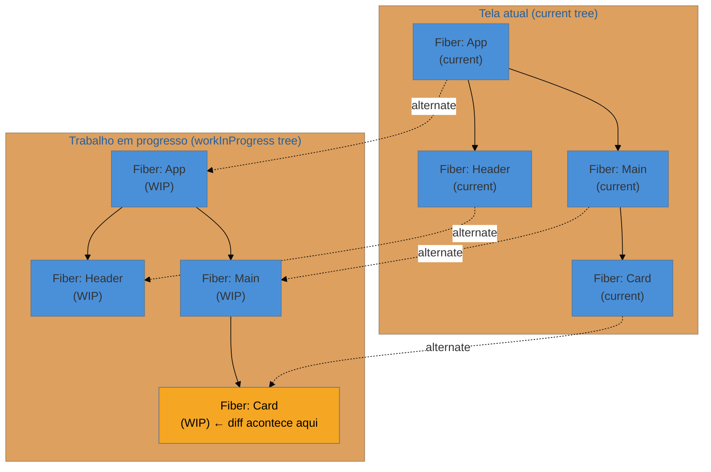
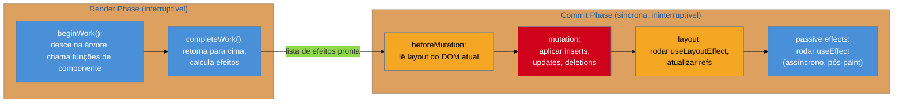
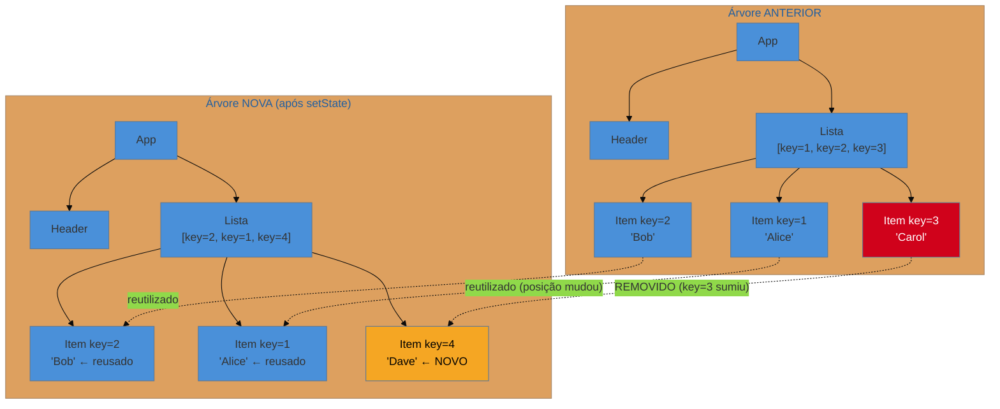

# Reconciliation e diffing a fundo

> [!abstract] TL;DR
> Reconciliation é o processo pelo qual o React decide **o que mudou** entre dois renders e aplica o mínimo de operações possível ao DOM real. O motor por trás disso é o **Fiber**: uma estrutura de dados em linked list que representa cada unidade de trabalho e permite pausar, priorizar e retomar o processamento. O algoritmo de diff opera em O(n) graças a duas heurísticas centrais — tipo de elemento diferente implica desmontar tudo; keys identificam filhos em listas. Trocar o tipo ou a key de um elemento destrói o estado local; isso pode ser usado **de propósito** para resetar componentes.

---

## O problema que o React resolve

Imagine que você tem um editor de texto colaborativo com mil parágrafos na tela. O usuário digita uma letra em um campo de busca e o estado muda. Como você atualiza a interface?

A abordagem ingênua seria destruir todo o DOM e reconstruir do zero — rápida de implementar, lenta de executar. A abordagem oposta seria fazer o React rastrear cirurgicamente cada nó, calculando o diff exato entre a árvore antiga e a nova — matematicamente correto, computacionalmente caro (O(n³) para árvores genéricas).

O React escolheu um caminho intermediário: um algoritmo de diff em **O(n)**, viabilizado por duas suposições sobre como UIs funcionam na prática. Entender essas suposições é entender o coração do React.

---

## O Virtual DOM: duas versões da realidade

Antes do diff existir, precisa existir algo para difar. O React mantém em memória uma representação leve da UI — o **Virtual DOM** — uma árvore de objetos JavaScript que descreve o que deveria estar na tela.

A cada render, o React produz uma **nova árvore virtual**. Ele então compara essa árvore nova com a anterior para descobrir o delta. Só depois de calcular esse delta o React toca o DOM real.

Isso tem uma implicação importante: o React nunca diffa o DOM diretamente. Ele diffa dois grafos de objetos JS, que é ordens de magnitude mais rápido.

```tsx
// O que você escreve:
<div className="card">
  <h2>{title}</h2>
  <p>{body}</p>
</div>

// O que o React vê internamente (simplificado):
{
  type: 'div',
  props: { className: 'card' },
  children: [
    { type: 'h2', props: {}, children: [title] },
    { type: 'p',  props: {}, children: [body]  }
  ]
}
```

> [!question]- Por que não usar o próprio DOM como "virtual DOM"?
> O DOM é uma API cara — cada acesso a propriedades de nó dispara reflows potenciais, expõe muitos atributos que o React não gerencia, e é síncrono por natureza. Objetos JS puros são simples, rápidos de copiar e manipular, e não têm efeitos colaterais.

---

## As duas heurísticas do diff

O React opera com complexidade O(n) — linear no número de nós — porque recusa resolver o caso geral e assume duas coisas sobre UIs reais:

### Heurística 1: tipo diferente → subárvore diferente

Se o **tipo** do elemento muda de um render para o outro, o React assume que a subárvore inteira é nova e a desmonta completamente, reconstruindo do zero.

```tsx
// Render anterior:
<div>
  <Counter />
</div>

// Render atual — tipo mudou de <div> para <section>:
<section>
  <Counter />
</section>
// → Counter é DESMONTADO e REMONTADO. Estado interno perdido.
```

Isso parece agressivo, mas faz sentido: se você trocou um `<div>` por um `<section>`, ou um `<UserCard>` por um `<AdminCard>`, a semântica do que está sendo renderizado mudou — o React não tem como saber quais filhos se correspondem.

**O corolário prático:** nunca defina componentes dentro do corpo de outro componente. Se você faz isso, o tipo muda identidade a cada render do pai (é uma função nova a cada vez), forçando desmontagem e remontagem constantes.

```tsx
// ❌ Armadilha clássica: InnerForm é recriada a cada render de Parent
function Parent() {
  // Nova referência de função a cada render → tipo sempre "diferente" para o React
  const InnerForm = () => <input />;
  return <InnerForm />;
}

// ✅ Correto: InnerForm é estável entre renders
const InnerForm = () => <input />;
function Parent() {
  return <InnerForm />;
}
```

### Heurística 2: mesmo tipo → atualiza, não desmonta

Se o tipo é o mesmo, o React mantém o nó DOM ou a instância do componente e apenas **atualiza as props**. O estado local sobrevive.

```tsx
// Render anterior:
<Button variant="primary" label="Salvar" />

// Render atual — tipo igual, props mudaram:
<Button variant="danger"  label="Excluir" />
// → React atualiza as props do Button existente. Estado interno preservado.
```

Isso é o que torna interações fluidas: um input controlado não perde o cursor quando você digita, um componente de animação não reinicia do zero, um componente com `useRef` mantém seus refs intactos.

---

## Keys: identidade explícita em listas

As duas heurísticas anteriores funcionam para árvores estáticas. Em listas dinâmicas, há um terceiro problema: como o React sabe que o item na posição 2 da lista nova corresponde ao item na posição 2 da lista velha — ou se os itens foram reordenados?

Sem keys, o React usa a **posição** como identidade implícita. Isso falha silenciosamente quando a ordem muda.

```tsx
// Lista anterior:       Lista atual (novo item no início):
// [0] <li>Alice</li>   [0] <li>Bob</li>   ← React vê: tipo igual, atualiza texto
// [1] <li>Carol</li>   [1] <li>Alice</li>  ← React vê: tipo igual, atualiza texto
//                      [2] <li>Carol</li>  ← React vê: novo nó, cria do zero

// Se os itens tivessem estados (checkboxes, inputs), eles estariam errados!
```

A `key` resolve isso dando ao React uma identidade **explícita** independente da posição:

```tsx
// ✅ Com keys estáveis: React sabe que "alice" é a mesma pessoa, onde quer que esteja
{users.map(user => (
  <UserRow key={user.id} user={user} />
))}
```

Com keys, o algoritmo de diff de listas torna-se mais inteligente: o React cria um mapa de `key → fiber` da lista antiga, e para cada item da lista nova verifica se existe uma correspondência. Se existe, reutiliza (e atualiza props). Se não, cria do zero.

A relação entre keys e reconciliation é aprofundada em [[07 - Listas e keys]].

---

## Trocar o tipo ou a key reseta estado — e você pode usar isso de propósito

Aprendemos que tipo diferente ou key diferente causa desmontagem. Isso é geralmente um bug. Mas pode ser uma **feature deliberada**.

Cenário clássico: um formulário de chat onde o usuário pode trocar de contato. Você quer que os campos se resetem completamente ao mudar de conversa.

```tsx
// ❌ Sem key: estado do input persiste entre contatos diferentes
function Chat({ contactId }: { contactId: string }) {
  return (
    <div>
      <input placeholder="Digite sua mensagem..." />
    </div>
  );
}

// ✅ Com key: React desmonta e remonta <Chat> ao trocar de contactId
// O estado do input é destruído — exatamente o que queremos aqui
function Conversation({ contactId }: { contactId: string }) {
  return <Chat key={contactId} contactId={contactId} />;
}
```

Outro uso: resetar um formulário complexo sem precisar de `useEffect` de limpeza ou estado de controle manual:

```tsx
// Força remontagem ao clicar em "Novo cadastro"
const [formKey, setFormKey] = useState(0);

<CadastroForm key={formKey} />
<button onClick={() => setFormKey(k => k + 1)}>Novo cadastro</button>
```

> [!info] Key como ejetor de estado
> Mudar a `key` de um componente é a forma oficial de dizer ao React: "trate isso como um componente completamente novo". Não há `useEffect`, `useImperativeHandle` ou ref envolvido — é pura semântica de identidade.

---

## Render bailout: quando o React nem começa o diff

Antes de executar o diff, o React tem um mecanismo de saída antecipada chamado **bailout**. Se o React consegue provar que nada mudou, ele pula o componente inteiro — sem executar o corpo da função, sem gerar Virtual DOM novo, sem difar.

A comparação é feita com **`Object.is`** (equivalente a `===` para primitivos, mas com tratamento correto de `NaN` e `±0`):

```tsx
// React.memo: envolve o componente em uma checagem de props shallow
const MemoCard = React.memo(function Card({ title, count }: CardProps) {
  return <div>{title}: {count}</div>;
});

// Se o pai re-renderizar mas title e count não mudarem (Object.is),
// Card não é chamada. O fiber antigo é reutilizado diretamente.
```

Internamente, o Fiber armazena `memoizedProps` (props do último render) e `pendingProps` (props do render atual). Na função `beginWork()`, se `pendingProps === memoizedProps` (via `Object.is`) **e** não houve mudança de contexto ou estado, o React faz bailout.

> [!question]- Por que `Object.is` e não `===`?
> `Object.is(NaN, NaN)` retorna `true`, enquanto `NaN === NaN` retorna `false`. E `Object.is(+0, -0)` retorna `false`, enquanto `+0 === -0` retorna `true`. Para comparações de props, esses casos importam — por exemplo, um prop do tipo `number` que é `NaN` não deve causar re-render desnecessário.

A relação entre bailout, `React.memo`, `useMemo` e `useCallback` é explorada em [[13 - Memoização - useMemo, useCallback, React.memo e o React Compiler]].

---

## Fiber: o motor por trás de tudo

Tudo que descrevemos até aqui — diff, bailout, heurísticas — é executado pelo **Fiber**: a arquitetura de reconciliação que o React usa desde a versão 16.

### O problema do reconciliador antigo

Antes do Fiber (React < 16), o reconciliador usava recursão síncrona. Ele descia a árvore de componentes chamando funções recursivamente, sem possibilidade de pausa. Se a árvore fosse grande, o thread principal ficava bloqueado por décadas de milissegundos — causando janks visíveis na interface.

O Fiber foi a reescrita que tornou o trabalho de reconciliação **interruptível**.

### O que é um Fiber

Um Fiber é um objeto JavaScript que representa uma unidade de trabalho. Para cada componente na árvore, existe um Fiber correspondente. Ele carrega:

- `type` — o componente ou elemento que representa
- `key` — a key do elemento, se houver
- `child`, `sibling`, `return` — ponteiros que formam uma linked list da árvore
- `pendingProps` / `memoizedProps` — props nova e antiga
- `memoizedState` — o estado atual (incluindo a linked list de hooks)
- `alternate` — ponteiro para o fiber "espelho" (double buffering)
- `lanes` — prioridade do trabalho pendente

### Double buffering: current e workInProgress

O React mantém **duas árvores de fibers simultaneamente**:



A **current tree** é o que está na tela. A **workInProgress tree** é onde o React constrói o próximo estado da UI. Cada fiber tem um ponteiro `alternate` para seu espelho na outra árvore.

Quando o render termina, o React simplesmente troca os ponteiros — a workInProgress vira a current. É um swap de referência, não uma cópia. Isso é chamado de **double buffering**, o mesmo conceito usado em jogos para evitar flickering de tela.

### Render phase vs. commit phase

O trabalho do Fiber se divide em duas fases com características muito diferentes:



**Render phase** (também chamada de reconciliation phase):
- O React percorre a árvore de fibers chamando `beginWork()` em cada nó
- Executa as funções dos componentes, gera o Virtual DOM novo
- Compara com o fiber `alternate` (diff)
- Marca os fibers com **flags** de efeito (ex: `Placement`, `Update`, `Deletion`)
- É **interruptível**: o React pode pausar aqui para dar prioridade a interações do usuário

**Commit phase**:
- O React percorre a **lista de efeitos** (fibers marcados) em ordem
- Aplica as mutações ao DOM real — inserts, updates, removes
- Roda `useLayoutEffect` (síncrono, antes do paint)
- Agenda `useEffect` para execução assíncrona após o paint
- É **ininterruptível**: o DOM não pode ficar em estado parcialmente atualizado

> [!info] Por que o commit é ininterruptível?
> Se o React aplicasse metade das mudanças ao DOM e pausasse, o usuário veria uma UI inconsistente — botões aparecendo sem seus handlers, texto sem estilo, estados intermediários visíveis. O commit é uma transação atômica do ponto de vista do usuário.

### Prioridade e lanes

O Fiber introduziu um sistema de **lanes** (faixas de prioridade) para decidir qual trabalho processar primeiro. Atualizações urgentes (clique de botão, digitação) têm prioridade alta. Atualizações de dados em background têm prioridade baixa.

Isso é a fundação do modo concurrent — o React pode estar reconciliando uma atualização de baixa prioridade quando uma interação urgente chega, pausar o trabalho atual, processar a urgente, e retomar. O fiber `workInProgress` é simplesmente descartado e recriado com o estado mais recente.

O que vem a seguir sobre isso: `20 - Concurrent features` (nota ainda não criada neste galho).

O que dispara o processo todo é descrito em [[04 - Renderização - o que dispara um render]].

---

## Diff visual: antes e depois de uma mudança



Neste exemplo:
- `Header` → mesmo tipo, props idênticas → **bailout** (não re-renderiza)
- `key=1` e `key=2` → encontrados no mapa de keys antigas → **reutilizados** (só posição muda)
- `key=3` → não encontrado na lista nova → **desmontado**
- `key=4` → não encontrado na lista antiga → **montado do zero**

---

## Armadilhas comuns

> [!warning] Usar index como key em listas que mudam de ordem
> **O que acontece:** componentes trocam de estado visivelmente — um checkbox marcado "pula" para outro item, um input mantém o valor de um item deletado. **Por quê:** o React usa a key como identidade. Se `key=0` sempre aponta para o primeiro item da lista, e o primeiro item muda, o React pensa que é o mesmo componente com props diferentes — e mantém o estado interno. **Como evitar:** use um identificador estável do dado (`user.id`, `post.slug`). Index só é seguro em listas totalmente estáticas e sem estado local nos itens.

> [!warning] Definir componentes dentro de outros componentes
> **O que acontece:** o componente interno desmonta e remonta a cada render do pai, perdendo todo estado local. Efeitos rodam em loop, refs são destruídas. **Por quê:** cada vez que o pai renderiza, a expressão `const Inner = () => <div/>` cria uma **nova referência de função**. O React compara tipos por referência — é sempre um tipo diferente, logo sempre desmonta. **Como evitar:** defina todos os componentes no escopo do módulo, fora de qualquer outro componente.

> [!warning] Trocar o tipo em renderização condicional sem perceber
> **O que acontece:** um campo de formulário perde o valor digitado, uma animação reinicia, um componente de timer reseta. **Por quê:** alternar entre dois componentes diferentes em um if/else (mesmo que pareçam "iguais" semanticamente) força desmontagem/remontagem porque o tipo é diferente. **Como evitar:** se você quer preservar estado entre dois modos, use o mesmo tipo e passe props diferentes — ou use CSS para esconder (`hidden`, `display: none`) em vez de desmontar.
>
> ```tsx
> // ❌ Troca de tipo → estado do input perdido
> {isAdmin ? <AdminInput /> : <UserInput />}
>
> // ✅ Mesmo tipo, prop diferente → estado preservado
> <Input mode={isAdmin ? 'admin' : 'user'} />
> ```

> [!warning] Esperando que `React.memo` evite todos os re-renders
> **O que acontece:** componente memoizado re-renderiza mesmo sem mudança visível nos dados. **Por quê:** `React.memo` usa `Object.is` em cada prop. Se qualquer prop é um objeto, array ou função criado inline, a referência é nova a cada render do pai — `Object.is` retorna `false` e o memo não funciona. **Como evitar:** estabilize referências com `useMemo` e `useCallback` para props que são objetos/funções. Ou use o React Compiler (disponível desde React 19) que automatiza isso.

---

## Casos práticos

### Cenário 1: resetar formulário com `key` ao trocar de entidade

Em um sistema de cadastro com um painel lateral de lista, o usuário seleciona diferentes registros para editar. Sem `key`, o formulário reutiliza o mesmo componente, e os campos ficam pré-preenchidos com os valores do registro anterior enquanto os dados novos carregam.

```tsx
interface EditPanelProps {
  selectedId: string | null;
}

// ✅ key força remontagem ao trocar de ID
// Estado interno do formulário é destruído e recriado limpo
function EditPanel({ selectedId }: EditPanelProps) {
  if (!selectedId) return <p>Selecione um registro</p>;

  return <RecordForm key={selectedId} recordId={selectedId} />;
}

// Dentro de RecordForm — estado local não "vaza" entre registros
function RecordForm({ recordId }: { recordId: string }) {
  const [name, setName] = useState('');      // sempre começa vazio
  const [email, setEmail] = useState('');    // sempre começa vazio

  // useEffect carrega os dados do registro
  useEffect(() => {
    fetchRecord(recordId).then(data => {
      setName(data.name);
      setEmail(data.email);
    });
  }, [recordId]);

  return (
    <form>
      <input value={name} onChange={e => setName(e.target.value)} />
      <input value={email} onChange={e => setEmail(e.target.value)} />
    </form>
  );
}
```

### Cenário 2: diagnosticando re-renders inesperados com Fiber em mente

Você adicionou `React.memo` a um componente pesado mas ele ainda re-renderiza. Usando o React DevTools Profiler, você vê "Props changed". A causa:

```tsx
// ❌ columns é recriado a cada render de TableContainer
function TableContainer({ data }: { data: Row[] }) {
  const columns = [           // nova referência a cada render
    { id: 'name', header: 'Nome' },
    { id: 'email', header: 'E-mail' },
  ];

  return <HeavyTable data={data} columns={columns} />;
}

const HeavyTable = React.memo(function HeavyTable({
  data,
  columns,
}: {
  data: Row[];
  columns: Column[];
}) {
  // renderiza uma tabela complexa
  return <table>...</table>;
});

// ✅ columns estável entre renders (só muda se o array de deps mudar)
function TableContainer({ data }: { data: Row[] }) {
  const columns = useMemo(() => [
    { id: 'name', header: 'Nome' },
    { id: 'email', header: 'E-mail' },
  ], []); // deps vazia: criado uma vez

  return <HeavyTable data={data} columns={columns} />;
}
```

O Fiber estava comparando `columns` via `Object.is` — dois arrays diferentes nunca são iguais por referência, mesmo com conteúdo idêntico.

---

## Como explicar em inglês

React's reconciliation algorithm compares two virtual DOM trees using a linear O(n) diff, guided by two heuristics: different element types unmount the entire subtree, and keys give list items a stable identity. This is powered by the Fiber architecture, which breaks rendering into interruptible units of work — a crucial foundation for concurrent features like transitions and Suspense.

| PT | EN |
|----|-----|
| Reconciliação | Reconciliation |
| Árvore de fibers | Fiber tree |
| Fase de render | Render phase |
| Fase de commit | Commit phase |
| Saída antecipada | Bailout |
| Tipo de elemento | Element type |
| Desmontar / remontar | Unmount / remount |
| Duplo buffer | Double buffering |
| Trabalho em progresso | Work in progress (WIP) |
| Prioridade / faixas | Lanes / priority |

---

## O que vem a seguir

Com o modelo de reconciliation bem estabelecido, é hora de ver o que acontece quando o diff precisa ser **interrompido** para dar espaço a updates mais urgentes. As concurrent features do React — `startTransition`, `useDeferredValue`, `Suspense` — existem exatamente porque o Fiber tornou o render phase interruptível.

- [[04 - Renderização - o que dispara um render]] — o que inicia o processo de reconciliation
- [[07 - Listas e keys]] — as keys em profundidade: como escolher, quando usar index, armadilhas de estado em listas
- [[13 - Memoização - useMemo, useCallback, React.memo e o React Compiler]] — como o bailout funciona na prática e quando o memo realmente ajuda
- `20 - Concurrent features` — o Fiber interruptível em ação: transitions, Suspense, Activities (React 19.2)

---

Reconciliation em uma frase: o React diffa dois Virtual DOMs com heurísticas O(n) e aplica o mínimo de mudanças ao DOM real — processo executado pelo Fiber, que torna o trabalho interruptível por prioridade.

---

## Fontes

- **React Team** — [*Reconciliation (legacy docs)*](https://legacy.reactjs.org/docs/reconciliation.html) — documentação original do algoritmo de diff com as duas heurísticas; ainda é a referência mais direta sobre o comportamento de tipo e keys
- **React Team** — [*Preserving and Resetting State*](https://react.dev/learn/preserving-and-resetting-state) — documentação oficial sobre como o React associa estado à posição na árvore e como usar keys para resetar intencionalmente
- **Andrew Clark** — [*React Fiber Architecture*](https://github.com/acdlite/react-fiber-architecture) — o documento original (2016) que descreve os objetivos e o modelo mental do Fiber; escrito pelo autor da reimplementação
- **LogRocket** — [*A deep dive into React Fiber*](https://blog.logrocket.com/deep-dive-react-fiber/) — análise técnica detalhada das estruturas de dados do Fiber, double buffering e fases de render/commit
- **Developer Way** — [*React reconciliation: how it works and why should we care*](https://www.developerway.com/posts/reconciliation-in-react) — artigo prático com exemplos concretos de como o diff funciona em casos reais, incluindo o bug de componente definido dentro de componente
- **DEV Community** — [*The Role of Fiber in React Rendering (Part 2): Buffers, Hooks, Lanes, and the Commit*](https://dev.to/congar97/the-role-of-fiber-in-react-rendering-part-2-buffers-hooks-lanes-and-the-commit-4jmd) — cobertura das lanes, double buffering e commit phase com referências ao código-fonte

---

*Consulte também o [[03-Dominios/Tecnologia/React/Dicionário de React|Dicionário de React]] para termos e conceitos do ecossistema React.*
