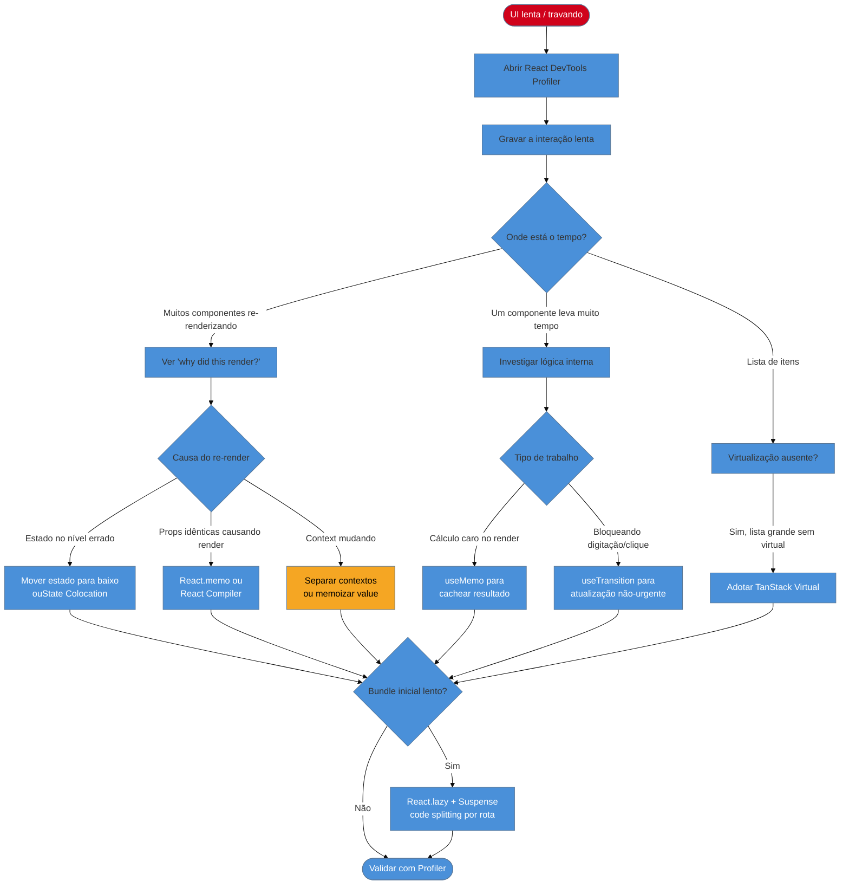

> [!abstract] TL;DR
> Performance no React começa em **medir antes de otimizar**: o React DevTools Profiler mostra exatamente quais componentes re-renderizam, por quê e quanto tempo levam. As causas mais comuns de lentidão são re-renders desnecessários (estado ou contexto no lugar errado), listas enormes renderizadas todas de uma vez, e bundles grandes carregados na inicialização. O arsenal de soluções inclui mover estado para baixo, usar composição com `children`, memoização seletiva com `React.memo`/`useMemo`/`useCallback` (ou o React Compiler automatizando tudo isso), virtualização de listas com TanStack Virtual, code splitting com `React.lazy` + `Suspense`, e `useTransition` para manter a UI responsiva durante atualizações pesadas.

---

Imagine uma lista de produtos com filtro ao vivo. O usuário digita no campo de busca e a interface trava por um segundo a cada letra. Nenhuma chamada de rede, nenhum bug óbvio — só React tentando re-renderizar 2.000 itens enquanto você ainda está digitando. O problema não está na sua lógica de negócio, está em como você estruturou a árvore de componentes e o que acontece quando o estado muda.

Performance no React não é magia negra nem uma lista de regras para memorizar. É um processo: **medir o que está lento, entender por que renderiza, agir no ponto certo**. Este guia percorre esse processo de ponta a ponta.

---

## Primeiro, meça. Depois, otimize

A regra mais importante de performance é: **nunca otimize sem dados**. Adicionar `useMemo` em todos os valores e `React.memo` em todos os componentes antes de medir não acelera o app — cria overhead de comparação em lugares que já eram rápidos, e deixa intocados os gargalos reais.

### React DevTools Profiler

O Profiler é a ferramenta principal. É uma aba dentro da extensão React Developer Tools (Chrome, Firefox, Edge).

**Como usar:**

1. Abra o DevTools → aba "Profiler"
2. Clique em "Start profiling" (botão de gravar)
3. Reproduza a ação lenta (clique no botão, filtre a lista, navegue para a rota)
4. Clique em "Stop profiling"
5. Examine o flamegraph resultante

O flamegraph mostra cada componente como uma barra colorida: mais vermelho = mais tempo de render. Clique em qualquer barra para ver:
- `actualDuration`: quanto tempo esse componente levou para renderizar
- `baseDuration`: quanto levaria sem memoização
- `Rendered by`: qual componente pai causou o render

**Ative "Record why each component rendered"** nas configurações do Profiler (ícone de engrenagem). Com isso ativado, cada componente mostra a razão exata do re-render: props mudaram, estado mudou, ou o componente pai re-renderizou.

### React Performance Tracks (React 19.2+)

A partir do React 19.2, o Chrome DevTools Performance panel ganhou uma trilha "React" nativa. Ela mostra eventos específicos do React (commits, atualizações de estado, transitions) lado a lado com chamadas de rede e execução de JS — sem precisar de extensão adicional. Para habilitá-la, é necessário usar uma build de desenvolvimento do React 19.2+.

### O que procurar no Profiler

| Sinal | O que pode significar |
|-------|----------------------|
| Componente pai re-renderiza e arrasta N filhos com ele | Estado no nível errado; falta de memoização ou composição |
| Componente renderiza com props idênticas | Falta de `React.memo` ou referência nova a cada render |
| `actualDuration` >> `baseDuration` | A memoização não está funcionando como esperado |
| Muitos componentes pequenos na mesma cor amarela | Re-render em cascata a partir de um Context |
| Render de lista leva >100ms | Virtualização ausente |

---

## Por que componentes re-renderizam (revisão rápida)

Um componente re-renderiza quando:
1. Seu **estado local** muda (`useState`, `useReducer`)
2. Seu **componente pai** re-renderiza (por padrão, filhos re-renderizam junto)
3. O **Context** que consome muda de valor
4. Uma **prop** que recebe tem valor diferente (ou referência nova)

O ponto 2 é a armadilha mais frequente: o pai muda por qualquer razão, e todos os filhos re-renderizam, mesmo que suas props não tenham mudado nada.

---

## Cortar re-renders sem memoização: estrutura é a primeira solução

Antes de recorrer a `memo` e `useCallback`, vale verificar se a estrutura do componente já resolve o problema. Frequentemente resolve.

### Mover estado para baixo (State Colocation)

Se um estado só é usado por um subconjunto da árvore, ele não precisa morar no pai. Mover o estado para o componente mais próximo que o usa significa que apenas esse subárvore re-renderiza quando o estado muda.

**Antes — estado no pai faz tudo re-renderizar:**

```tsx
function ProductPage() {
  const [query, setQuery] = useState('');
  // quando query muda, ProductList e ProductSidebar re-renderizam
  return (
    <>
      <SearchInput query={query} onChange={setQuery} />
      <ProductList query={query} />
      <ProductSidebar /> {/* não usa query, mas re-renderiza mesmo assim */}
    </>
  );
}
```

**Depois — estado isolado no SearchSection:**

```tsx
function SearchSection() {
  const [query, setQuery] = useState('');
  return (
    <>
      <SearchInput query={query} onChange={setQuery} />
      <ProductList query={query} />
    </>
  );
}

function ProductPage() {
  // ProductSidebar nunca re-renderiza por causa de query
  return (
    <>
      <SearchSection />
      <ProductSidebar />
    </>
  );
}
```

O `ProductSidebar` agora está completamente isolado. Sem `memo`, sem `useCallback` — só reorganização.

### Composição com `children` para isolar re-renders

Outra técnica poderosa: quando um componente "pesado" precisa existir dentro de um componente que muda estado, passe-o como `children`. O React não re-renderiza os `children` passados de fora se o pai re-renderizar — eles já existem como elementos JSX criados pelo avô.

**Problema — `HeavyChart` re-renderiza toda vez que o modal abre:**

```tsx
function Dashboard() {
  const [open, setOpen] = useState(false);
  return (
    <div>
      <Modal open={open} onClose={() => setOpen(false)}>
        <HeavyChart /> {/* re-renderiza quando open muda */}
      </Modal>
      <button onClick={() => setOpen(true)}>Abrir</button>
    </div>
  );
}
```

**Solução — separar o componente que tem o estado:**

```tsx
function ModalWrapper({ children }: { children: React.ReactNode }) {
  const [open, setOpen] = useState(false);
  return (
    <>
      <Modal open={open} onClose={() => setOpen(false)}>
        {children}
      </Modal>
      <button onClick={() => setOpen(true)}>Abrir</button>
    </>
  );
}

function Dashboard() {
  return (
    <ModalWrapper>
      <HeavyChart /> {/* criado pelo Dashboard, não re-renderiza quando open muda */}
    </ModalWrapper>
  );
}
```

`HeavyChart` não sabe que `open` existe. Ele foi criado como elemento JSX antes de ser passado para `ModalWrapper`, então mudanças no estado de `ModalWrapper` não o afetam.

> [!question]- Por que `children` não re-renderiza junto com o pai?
> Quando você escreve `<ModalWrapper><HeavyChart /></ModalWrapper>`, quem cria o elemento JSX de `HeavyChart` é o `Dashboard` — não o `ModalWrapper`. O React só re-renderiza componentes quando *o criador* re-renderiza. Como `Dashboard` não re-renderiza nesse fluxo, o elemento de `HeavyChart` é reutilizado sem re-render.

---

## Memoização seletiva: quando a estrutura não basta

Quando a reorganização estrutural não é suficiente — ou quando você quer garantir que um componente caro não re-renderize com props idênticas — entra a memoização. Veja a nota dedicada: [[13 - Memoização - useMemo, useCallback, React.memo e o React Compiler]].

O resumo prático:

- **`React.memo(Component)`**: memoiza o resultado do render; só re-renderiza se as props mudarem (comparação shallow)
- **`useCallback(fn, deps)`**: retorna a mesma referência de função entre renders; evita que filhos memoizados re-renderizem por receber "nova" função que faz o mesmo
- **`useMemo(fn, deps)`**: memoiza o resultado de um cálculo caro; só recalcula quando `deps` muda

**Regra de ouro**: meça com o Profiler. Se o componente não aparece como gargalo, não memoize.

### O React Compiler elimina a memoização manual

O React Compiler (estável desde fins de 2025, parte do React 19) analisa seu código em tempo de build e insere automaticamente as otimizações de memoização onde elas são necessárias. Meta estimou que 60-70% dos problemas de performance em seus apps eram relacionados à falta ou incorreção de memoização manual — o Compiler resolve isso automaticamente.

Com o Compiler ativo:
- `React.memo`, `useMemo` e `useCallback` tornam-se, em grande parte, desnecessários no dia a dia
- Você ainda pode usá-los como "escape hatch" para controle fino
- O Compiler é mais inteligente que a memoização manual: ele memoiza valores intermediários dentro do componente, não só os retornos de funções

```bash
# Instalação do plugin do compilador
npm install --save-dev babel-plugin-react-compiler
```

```json
// babel.config.json
{
  "plugins": ["babel-plugin-react-compiler"]
}
```

---

## O custo do Context: cuidado com valores que mudam

O `Context` é conveniente para estado global, mas tem um custo de performance específico: **qualquer mudança no valor do Context faz todos os consumidores re-renderizarem**, independentemente de usarem ou não a parte que mudou.

```tsx
// ❌ Problema: mudar `theme` re-renderiza consumidores de `user` também
const AppContext = createContext({ user: null, theme: 'light' });
```

**Estratégias para mitigar:**

1. **Separar contextos por domínio de mudança**: `UserContext` e `ThemeContext` separados
2. **Memoizar o value**: `useMemo` no valor passado ao Provider
3. **Usar Context para estado que raramente muda**: tema, locale, usuário logado — não para estado de UI que muda com frequência

```tsx
// ✅ Valor memoizado no Provider
function UserProvider({ children }: { children: React.ReactNode }) {
  const [user, setUser] = useState<User | null>(null);

  const value = useMemo(() => ({ user, setUser }), [user]);

  return <UserContext.Provider value={value}>{children}</UserContext.Provider>;
}
```

---

## Virtualização de listas: renderize só o que o usuário vê

Uma lista com 5.000 itens não precisa criar 5.000 nós no DOM. O usuário vê talvez 20 de cada vez. Virtualização é a técnica de criar no DOM apenas os itens visíveis na viewport, reciclando os nós à medida que o usuário rola.

**Sem virtualização:** 5.000 `<div>` no DOM, 5.000 eventos de ciclo de vida, layout e paint de 5.000 elementos.

**Com virtualização:** ~25 `<div>` no DOM a qualquer momento, independente do tamanho da lista.

### TanStack Virtual (recomendado em 2026)

O `@tanstack/react-virtual` é a biblioteca de referência atual. É headless (você controla o markup), zero-dependency, e funciona com listas, grids e tabelas.

```tsx
import { useVirtualizer } from '@tanstack/react-virtual';
import { useRef } from 'react';

interface Product {
  id: number;
  name: string;
  price: number;
}

function ProductList({ products }: { products: Product[] }) {
  const parentRef = useRef<HTMLDivElement>(null);

  const virtualizer = useVirtualizer({
    count: products.length,
    getScrollElement: () => parentRef.current,
    estimateSize: () => 72, // altura estimada de cada item em px
  });

  return (
    <div
      ref={parentRef}
      style={{ height: '600px', overflow: 'auto' }}
    >
      {/* Container com altura total da lista (virtual) */}
      <div style={{ height: virtualizer.getTotalSize(), position: 'relative' }}>
        {virtualizer.getVirtualItems().map((virtualItem) => (
          <div
            key={virtualItem.key}
            style={{
              position: 'absolute',
              top: 0,
              left: 0,
              width: '100%',
              transform: `translateY(${virtualItem.start}px)`,
            }}
          >
            <ProductCard product={products[virtualItem.index]} />
          </div>
        ))}
      </div>
    </div>
  );
}
```

> [!info] react-window em 2026
> O `react-window` (Brian Vaughn) foi por anos a biblioteca padrão. Em 2026, está sem desenvolvimento ativo e com limitações para listas de tamanho variável. Para novos projetos, prefira `@tanstack/react-virtual` ou `react-virtuoso`.

---

## Code splitting com `React.lazy` e `Suspense`

O bundle inicial do app é um dos maiores fatores de performance percebida. Cada KB extra no bundle principal é tempo extra de download e parsing antes do primeiro render. Code splitting resolve isso: divide o bundle em pedaços carregados sob demanda.

`React.lazy` transforma um import dinâmico em um componente lazy. `Suspense` define o fallback enquanto o chunk ainda não foi carregado.

```tsx
import { lazy, Suspense } from 'react';

// Chunk separado: só carregado quando o componente for renderizado pela primeira vez
const HeavyEditor = lazy(() => import('./HeavyEditor'));
const AnalyticsDashboard = lazy(() => import('./AnalyticsDashboard'));

function App() {
  const [view, setView] = useState<'editor' | 'analytics' | 'home'>('home');

  return (
    <div>
      <nav>
        <button onClick={() => setView('editor')}>Editor</button>
        <button onClick={() => setView('analytics')}>Analytics</button>
      </nav>

      <Suspense fallback={<div className="spinner">Carregando...</div>}>
        {view === 'editor' && <HeavyEditor />}
        {view === 'analytics' && <AnalyticsDashboard />}
      </Suspense>
    </div>
  );
}
```

**Splitting por rota** é a estratégia com maior impacto e menor esforço. Se você usa React Router ou TanStack Router, cada rota pode ser lazy:

```tsx
const ProductsPage = lazy(() => import('./pages/ProductsPage'));
const CheckoutPage = lazy(() => import('./pages/CheckoutPage'));
const AdminPanel = lazy(() => import('./pages/AdminPanel'));
```

Apps complexos relatam redução de 20–70% no bundle inicial com splitting por rota.

> [!question]- O que acontece se o import falhar (rede fora)?
> O `Suspense` não captura erros de carregamento — para isso você precisa de um `ErrorBoundary` envolvendo o `Suspense`. Isso garante que a falha de rede mostre uma mensagem amigável em vez de quebrar silenciosamente a UI.

---

## `useTransition`: atualizações não-urgentes não devem bloquear a UI

Voltando ao problema da lista de busca: o input trava porque React trata todas as atualizações de estado com a mesma prioridade. Quando você digita uma letra, o React tenta atualizar `query` E re-renderizar 2.000 itens filtrados — tudo em uma tacada.

`useTransition` resolve isso marcando parte da atualização como "não urgente". O React garante que a UI responsiva (o input mostrando a letra digitada) seja processada primeiro; a parte pesada (re-render da lista) acontece assim que houver tempo disponível.

```tsx
import { useState, useTransition } from 'react';

function ProductSearch({ products }: { products: Product[] }) {
  const [input, setInput] = useState('');
  const [query, setQuery] = useState('');
  const [isPending, startTransition] = useTransition();

  function handleChange(e: React.ChangeEvent<HTMLInputElement>) {
    const value = e.target.value;
    setInput(value); // urgente: atualiza o campo imediatamente

    startTransition(() => {
      setQuery(value); // não urgente: pode esperar um frame
    });
  }

  const filtered = products.filter((p) =>
    p.name.toLowerCase().includes(query.toLowerCase())
  );

  return (
    <div>
      <input value={input} onChange={handleChange} placeholder="Buscar produto..." />
      {isPending && <span className="text-gray-400">Filtrando...</span>}
      <ul>
        {filtered.map((p) => (
          <li key={p.id}>{p.name} — R$ {p.price}</li>
        ))}
      </ul>
    </div>
  );
}
```

`isPending` fica `true` enquanto a transição está em andamento — use para mostrar um indicador visual sutil. Isso é diferente de debounce: com `useTransition`, se o usuário para de digitar, o React processa a atualização pendente imediatamente, sem esperar um timeout.

`startTransition` (sem o hook) funciona fora de componentes para os mesmos casos.

---

## Evitar trabalho caro dentro do render

O corpo do componente executa em cada render. Cálculos pesados dentro do corpo — filtrar arrays grandes, ordenar, computar derivações — acontecem toda vez que qualquer estado do componente muda.

```tsx
// ❌ Reordena 10k itens em todo render
function LeaderBoard({ scores }: { scores: Score[] }) {
  const sorted = scores.sort((a, b) => b.value - a.value); // caro!
  return <ul>{sorted.map(renderRow)}</ul>;
}

// ✅ Só reordena quando scores mudar
function LeaderBoard({ scores }: { scores: Score[] }) {
  const sorted = useMemo(
    () => [...scores].sort((a, b) => b.value - a.value),
    [scores]
  );
  return <ul>{sorted.map(renderRow)}</ul>;
}
```

Com o React Compiler ativo, o compilador identifica esse padrão e insere o `useMemo` automaticamente. Mesmo assim, é uma boa prática reconhecer quando um render está fazendo trabalho que poderia ser cacheado.

---

## Fluxo de diagnóstico de performance



---

## Casos práticos

### Cenário 1: Tabela de dados financeiros com 3.000 linhas

Um dashboard financeiro mostra 3.000 transações. Cada linha tem formatação de moeda, badges de status e ícones. O scroll é travado e a página demora 4 segundos para renderizar inicialmente.

**Diagnóstico:** Profiler mostra que o componente `TransactionTable` leva 3.800ms no primeiro render e 200ms em cada scroll. As 3.000 linhas existem no DOM simultaneamente.

**Solução:**
1. `@tanstack/react-virtual` para renderizar apenas as ~15 linhas visíveis
2. `React.memo` em `TransactionRow` para evitar re-render quando outras linhas mudam
3. `useMemo` para cálculos de totais que derivam da lista

Resultado: primeiro render cai para ~80ms, scroll suave a 60fps.

### Cenário 2: Input de busca que trava durante filtragem

Campo de busca em catálogo de produtos. Digitar qualquer letra causa 400ms de atraso porque a lista de 800 produtos é re-filtrada e re-renderizada em cada tecla.

**Diagnóstico:** Profiler com "record why each component rendered" mostra que `ProductGrid` (com 800 `ProductCard` filhos) re-renderiza completamente a cada keystroke, pois `query` vive no mesmo componente pai que renderiza o grid.

**Solução:**
```tsx
function SearchSection() {
  const [input, setInput] = useState('');
  const [query, setQuery] = useState('');
  const [isPending, startTransition] = useTransition();

  return (
    <>
      <input
        value={input}
        onChange={(e) => {
          setInput(e.target.value);
          startTransition(() => setQuery(e.target.value));
        }}
      />
      {isPending ? <SkeletonGrid /> : <ProductGrid query={query} />}
    </>
  );
}
```

O input é atualizado imediatamente; o grid espera o frame disponível.

---

## Armadilhas comuns

> [!warning] Otimizar sem medir
> **O que acontece:** você adiciona `useMemo` e `React.memo` em 30 componentes e a performance não melhora — ou até piora. **Por quê:** `React.memo` tem custo: comparação shallow de props a cada render. Em componentes que recebem objetos/arrays novos a cada vez (criados inline), o `memo` nunca impede o re-render e você paga o custo da comparação de graça. **Como evitar:** Profiler primeiro. Meça `actualDuration` antes e depois de cada otimização. Memoize apenas onde o ganho supera o custo da comparação.

> [!warning] Memoizar tudo "por garantia"
> **O que acontece:** o código fica cheio de `useCallback` e `useMemo` em funções e valores triviais (`() => setCount(c + 1)`, `[1, 2, 3]`). **Por quê:** memoização de valores baratos adiciona overhead de closure e comparação de deps sem benefício real. Também esconde o problema real, que é a estrutura do componente. **Como evitar:** `useCallback` faz sentido quando a referência da função é passada para um filho memoizado (`React.memo`). `useMemo` faz sentido quando o cálculo é genuinamente caro (>1ms). Para o resto, confie no React Compiler.

> [!warning] Virtualizar listas pequenas
> **O que acontece:** você adiciona TanStack Virtual a uma lista de 50 itens e o código fica mais complexo sem ganho visível. **Por quê:** virtualização tem overhead de setup (cálculo de posições, refs de scroll). Para listas pequenas, o custo supera o benefício. **Como evitar:** virtualização começa a valer a partir de ~200–300 itens. Para menos que isso, considere apenas `React.memo` nos itens.

> [!warning] Context para estado de UI de alta frequência
> **O que acontece:** você coloca `mousePosition`, `scrollY` ou `inputValue` em um Context. Toda a árvore de consumidores re-renderiza a cada movimento do mouse. **Por quê:** Context não tem granularidade: qualquer mudança no value dispara re-render em todos os consumidores, mesmo que eles só usem uma pequena parte do objeto. **Como evitar:** Context serve para estado que muda raramente (theme, locale, usuário). Estado de UI de alta frequência fica no componente local, ou usa uma biblioteca de estado com seletores (Zustand, Jotai) que evita re-renders desnecessários.

---

## Como explicar em inglês

Performance optimization in React follows a clear process: first, use the React DevTools Profiler to identify which components are re-rendering unnecessarily and why. Common culprits include state lifted too high in the tree, missing memoization, or large lists rendered without virtualization.

The most underrated technique is structural: moving state down to the closest component that needs it, or using component composition with `children` to isolate re-renders. When structure isn't enough, `React.memo`, `useMemo`, and `useCallback` add memoization — though in React 19+ projects the React Compiler handles this automatically.

For large lists, virtualization with TanStack Virtual ensures only visible items are in the DOM. For heavy components loaded on demand, `React.lazy` with `Suspense` splits the bundle. And for updates that shouldn't block user input, `useTransition` marks them as non-urgent.

| PT | EN |
|----|-----|
| Medir antes de otimizar | Measure before you optimize |
| Re-render desnecessário | Unnecessary re-render |
| Mover estado para baixo | State colocation / lifting state down |
| Composição com filhos | Component composition with children |
| Virtualização de listas | List virtualization |
| Divisão de código | Code splitting |
| Atualização não-urgente | Non-urgent update / deferred update |
| Compilador de React | React Compiler |
| Perfil de performance | Performance profile |
| Gargalo | Bottleneck |

---

## O que vem a seguir

Com as técnicas de performance em mão, a próxima fronteira é entender o engine que torna tudo isso possível: o algoritmo de reconciliação do React. Saber como o React decide o que atualizar no DOM (e quando ele "corta caminho" com bailout) é o que transforma otimizações empíricas em decisões conscientes.

- [[16 - Reconciliation e diffing a fundo]] — como o React decide o que re-renderizar; bailout, fiber e as regras que o algoritmo segue (nota futura)
- [[13 - Memoização - useMemo, useCallback, React.memo e o React Compiler]] — profundidade em cada API de memoização e o React Compiler
- [[19 - Suspense e data fetching no cliente]] — Suspense além de lazy: como ele coordena data fetching declarativo (nota futura)
- [[20 - Concurrent features]] — `useTransition`, `useDeferredValue` e o modelo concurrent completo (nota futura)
- [[03-Dominios/Tecnologia/Tooling e Build/17 - Otimização de bundle|Tooling — Otimização de bundle]] — tree shaking, análise de bundle, estratégias de splitting no nível do bundler
- [[03-Dominios/Tecnologia/React/Dicionário de React|Dicionário de React]] — glossário do domínio

---

## Fontes

- **React Team** — [*React Compiler — Introduction*](https://react.dev/learn/react-compiler/introduction) — documentação oficial do React Compiler, status e guia de adoção
- **React Team** — [*`<Profiler>` API*](https://react.dev/reference/react/Profiler) — referência da API de profiling programático
- **TanStack** — [*TanStack Virtual — React docs*](https://tanstack.com/virtual/latest/docs/framework/react/react-virtual) — documentação oficial de virtualização headless
- **PkgPulse** — [*TanStack Virtual vs react-window vs react-virtuoso 2026*](https://www.pkgpulse.com/guides/tanstack-virtual-vs-react-window-vs-react-virtuoso-2026) — comparação atualizada das bibliotecas de virtualização
- **DebugBear** — [*How to Measure and Optimize React Performance*](https://www.debugbear.com/blog/measuring-react-app-performance) — guia prático de profiling com foco em métricas reais
- **DEV Community / Pockit** — [*React Compiler Deep Dive: How Automatic Memoization Eliminates 90% of Performance Optimization Work*](https://dev.to/pockit_tools/react-compiler-deep-dive-how-automatic-memoization-eliminates-90-of-performance-optimization-work-1351) — análise aprofundada do impacto do Compiler na memoização manual
- **OneUptime Blog** — [*How to Profile React Applications with React DevTools*](https://oneuptime.com/blog/post/2026-01-15-profile-react-applications-devtools/view) — tutorial atualizado 2026 de uso do Profiler
