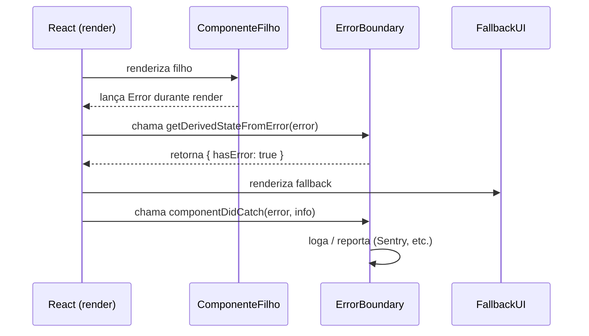
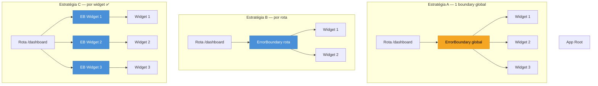

# Error boundaries

> [!abstract] TL;DR
> Um erro de render em qualquer componente filho derruba a árvore inteira — tela branca, nada. Error boundaries são componentes especiais que interceptam esse erro antes que ele exploda, exibem um fallback e mantêm o resto da app de pé. Eles só existem como **class components** (por limitação do ciclo de vida do React), mas a lib `react-error-boundary` encapsula isso numa API funcional moderna. React 19 adicionou callbacks globais (`onCaughtError`, `onUncaughtError`) no `createRoot` para rastrear esses erros em produção com mais granularidade. Boundaries **não** capturam erros em event handlers nem código assíncrono — para esses casos, `try/catch` e `useErrorBoundary` são a resposta.

---

## O problema: um widget quebra a cidade inteira

Imagine uma dashboard com cinco widgets: gráfico de vendas, mapa de entregas, tabela de pedidos, notificações e perfil do usuário. O componente de mapa tenta acessar `data.coordinates[0].lat` — mas a API retornou `null`. Durante o render, o JavaScript lança um `TypeError`.

O que acontece? **A tela fica completamente branca.**

Não apenas o mapa some. A React desmonta a árvore inteira a partir do ponto onde o erro ocorreu e não consegue recuperar o render. O usuário perde acesso à tabela de pedidos, às notificações, a tudo — por causa de um bug em um único componente que nem era o foco da sessão dele.

Esse é o comportamento padrão do React antes dos error boundaries: erros de render são fatais para a subárvore inteira. A solução é instalar um "disjuntor".

---

## A analogia do disjuntor elétrico

Em uma instalação elétrica, cada cômodo tem um disjuntor no quadro. Quando a tomada da cozinha faz curto, o disjuntor daquele circuito desarma — a geladeira e o forno param, mas o resto da casa continua com luz. Sem disjuntor, um curto em qualquer ponto apagaria tudo.

Error boundaries funcionam exatamente assim: você coloca um "disjuntor" em volta de cada subárvore que pode falhar. Quando um componente filho lança um erro durante o render, o boundary intercepta, exibe uma UI de fallback (o "quadro de aviso: circuito desarmado") e o resto da app continua funcionando normalmente.

---

## Por que class components? O mecanismo interno

> [!question]- Por que error boundaries ainda exigem class components em 2026, se hooks existem há anos?
> A razão é técnica e deliberada. Error boundaries precisam de dois mecanismos do ciclo de vida que não têm equivalente direto em hooks:
>
> - **`static getDerivedStateFromError(error)`**: método estático chamado durante a fase de render quando um filho lança erro. Retorna um objeto que atualiza o state do boundary — isso instrui o React a renderizar o fallback em vez da árvore quebrada. É chamado de forma **síncrona**, no meio do ciclo de render.
> - **`componentDidCatch(error, errorInfo)`**: chamado na fase de commit, depois que o fallback já foi montado. Ideal para side effects como logar o erro num serviço externo.
>
> Hooks rodam dentro do ciclo de render e não têm como interceptar exceções **lançadas por outros componentes durante o render deles**. O `try/catch` dentro de um hook só capturaria erros do próprio hook. O mecanismo de interceção de erro de filho é, por design, exclusivo de métodos de classe. A equipe do React reconhece isso como uma lacuna histórica — há discussões em aberto — mas nenhuma RFC foi fundida até 2026.

Um boundary mínimo em TypeScript fica assim:

```tsx
import { Component, ErrorInfo, ReactNode } from "react";

interface Props {
  children: ReactNode;
  fallback: ReactNode;
}

interface State {
  hasError: boolean;
  error: Error | null;
}

class SimpleErrorBoundary extends Component<Props, State> {
  state: State = { hasError: false, error: null };

  // Fase de render: atualiza state para mostrar fallback
  static getDerivedStateFromError(error: Error): State {
    return { hasError: true, error };
  }

  // Fase de commit: side effects (logs, Sentry, etc.)
  componentDidCatch(error: Error, errorInfo: ErrorInfo): void {
    console.error("Erro capturado pelo boundary:", error, errorInfo.componentStack);
  }

  render() {
    if (this.state.hasError) {
      return this.props.fallback;
    }
    return this.props.children;
  }
}

export default SimpleErrorBoundary;
```

O fluxo interno é:



---

## O padrão moderno: `react-error-boundary`

Escrever class components a mão em 2026 é raro. A lib `react-error-boundary` (de Brian Vaughn, ex-core team React) encapsula o boundary como componente funcional consumível, com props TypeScript bem tipadas.

### Instalação

```bash
npm install react-error-boundary
# ou
pnpm add react-error-boundary
```

### Uso básico com `fallback` (JSX estático)

```tsx
import { ErrorBoundary } from "react-error-boundary";

function App() {
  return (
    <ErrorBoundary fallback={<p>Algo deu errado. Tente recarregar.</p>}>
      <MapaWidget />
    </ErrorBoundary>
  );
}
```

### Uso avançado com `FallbackComponent` (acesso ao erro + reset)

`FallbackComponent` recebe `error` e `resetErrorBoundary` — permite exibir a mensagem de erro e oferecer um botão de retry:

```tsx
import { ErrorBoundary, FallbackProps } from "react-error-boundary";

function FallbackDoMapa({ error, resetErrorBoundary }: FallbackProps) {
  return (
    <div role="alert" className="error-card">
      <h2>O mapa não carregou</h2>
      <p>{error.message}</p>
      <button onClick={resetErrorBoundary}>Tentar novamente</button>
    </div>
  );
}

function App() {
  return (
    <ErrorBoundary
      FallbackComponent={FallbackDoMapa}
      onError={(error, info) => {
        // Sentry, Datadog, etc.
        Sentry.captureException(error, { extra: info });
      }}
      onReset={() => {
        // Opcional: limpar estado que causou o erro
        console.log("Boundary resetado");
      }}
    >
      <MapaWidget />
    </ErrorBoundary>
  );
}
```

### `resetKeys`: reset automático por mudança de prop

O boundary mantém o estado de erro até ser resetado. Se a causa foi um `productId` inválido e o usuário navega para outro produto, o boundary deve se limpar automaticamente. É aí que entra `resetKeys`:

```tsx
function ProductPage({ productId }: { productId: string }) {
  return (
    <ErrorBoundary
      FallbackComponent={FallbackDoMapa}
      resetKeys={[productId]}  // reseta quando productId mudar
    >
      <ProductDetails productId={productId} />
    </ErrorBoundary>
  );
}
```

Quando qualquer valor em `resetKeys` muda entre renders, a biblioteca chama `resetErrorBoundary` internamente — o fallback some e o filho tenta renderizar de novo com os novos dados.

### `useErrorBoundary`: propagando erros assíncronos

Event handlers e código assíncrono não propagam erros para boundaries automaticamente. O hook `useErrorBoundary` resolve isso: você chama `showBoundary(error)` de dentro de um `catch` e o boundary do ancestral mais próximo assume:

```tsx
import { useErrorBoundary } from "react-error-boundary";

function MapaWidget() {
  const { showBoundary } = useErrorBoundary();

  async function carregarDados() {
    try {
      const data = await fetchCoordenadas();
      // ...
    } catch (error) {
      // Propaga o erro para o boundary ancestral
      showBoundary(error);
    }
  }

  return <button onClick={carregarDados}>Carregar</button>;
}
```

---

## React 19: logging melhorado com `onCaughtError` e `onUncaughtError`

Antes do React 19, havia um único canal de logging de erros — `console.error` — e não era possível diferenciar facilmente erros capturados por boundaries de erros que quebraram a app inteira.

React 19 adicionou três callbacks no `createRoot` (e `hydrateRoot`):

| Callback | Quando é chamado |
|---|---|
| `onCaughtError` | Erro foi lançado e **capturado por um Error Boundary** |
| `onUncaughtError` | Erro foi lançado e **não capturado** — app provavelmente quebrou |
| `onRecoverableError` | React conseguiu se recuperar automaticamente (ex.: hydration mismatch) |

Configuração típica num setup de produção:

```tsx
// main.tsx
import { createRoot } from "react-dom/client";
import * as Sentry from "@sentry/react";
import App from "./App";

const root = createRoot(document.getElementById("root")!, {
  // Erro foi isolado — boundary exibiu fallback
  onCaughtError(error, errorInfo) {
    // Logar sem alarme crítico: o usuário ainda vê algo
    Sentry.captureException(error, {
      extra: { componentStack: errorInfo.componentStack },
      level: "warning",
    });
  },

  // Erro não capturado — tela branca iminente
  onUncaughtError(error, errorInfo) {
    Sentry.captureException(error, {
      extra: { componentStack: errorInfo.componentStack },
      level: "fatal",
    });
  },

  // React se recuperou sozinho (hydration, etc.)
  onRecoverableError(error, errorInfo) {
    console.warn("Erro recuperável:", error, errorInfo.componentStack);
  },
});

root.render(<App />);
```

> [!info] onCaughtError ≠ onError do ErrorBoundary
> `onCaughtError` (no `createRoot`) é um hook global de observabilidade — ele é chamado para **todo** erro capturado por qualquer boundary na app. O `onError` prop do `<ErrorBoundary>` da lib é local — só para aquele boundary. Use ambos em camadas: `onError` para contexto rico (qual widget, qual rota), `onCaughtError` para enviar ao serviço de monitoramento.

---

## O que error boundaries NÃO capturam — e como lidar

Boundaries interceptam apenas erros que ocorrem durante o **render** (incluindo construtores de classe e `getDerivedStateFromProps`). Três cenários ficam de fora:

### 1. Event handlers

```tsx
// ❌ Esse erro NÃO chega ao boundary
function BotaoPerigoso() {
  function handleClick() {
    throw new Error("Erro no handler"); // não é render
  }
  return <button onClick={handleClick}>Click</button>;
}

// ✅ Use try/catch ou showBoundary
function BotaoSeguro() {
  const { showBoundary } = useErrorBoundary();

  function handleClick() {
    try {
      operacaoArriscada();
    } catch (error) {
      showBoundary(error); // propaga ao boundary ancestral
    }
  }
  return <button onClick={handleClick}>Click</button>;
}
```

### 2. Código assíncrono

```tsx
// ❌ Promise rejeitada não é capturada pelo boundary
useEffect(() => {
  fetch("/api/dados")
    .then(res => res.json())
    .then(setDados);
  // sem .catch — rejeição silenciosa
}, []);

// ✅ Trate a rejeição explicitamente
useEffect(() => {
  const controller = new AbortController();
  fetch("/api/dados", { signal: controller.signal })
    .then(res => res.json())
    .then(setDados)
    .catch(err => {
      if (err.name !== "AbortError") setErro(err);
    });
  return () => controller.abort();
}, []);
```

### 3. Server-Side Rendering (SSR)

Em SSR (Next.js, Remix), error boundaries só entram em ação no lado do cliente. No servidor, erros de render devem ser tratados via mecanismos do próprio framework (`error.tsx` no Next.js App Router, `ErrorBoundary` do Remix).

---

## Granularidade: onde colocar cada boundary

A granularidade do boundary determina quanto da app sobrevive a um erro. Há três estratégias comuns:



**Recomendação para apps de produção:**

- **Boundary global** (estratégia A): último recurso, captura o que escapou de todos os outros. Obrigatório, mas não suficiente.
- **Boundary por rota**: protege o layout de navegação quando o conteúdo de uma rota falha.
- **Boundary por widget/seção** (estratégia C): mais granular, mais resiliente. Um gráfico quebrado não derruba a tabela ao lado.

```tsx
// Padrão recomendado: combinar os três níveis
function Dashboard() {
  return (
    <div className="dashboard">
      <ErrorBoundary FallbackComponent={FallbackWidget}>
        <GraficoDeVendas />
      </ErrorBoundary>

      <ErrorBoundary FallbackComponent={FallbackWidget}>
        <MapaDeEntregas />
      </ErrorBoundary>

      <ErrorBoundary FallbackComponent={FallbackWidget}>
        <TabelaDePedidos />
      </ErrorBoundary>
    </div>
  );
}
```

---

## Integração com Sentry

A combinação ideal em produção usa `onError` (local, rico em contexto) e `onCaughtError` (global, para o dashboard do Sentry):

```tsx
import * as Sentry from "@sentry/react";
import { ErrorBoundary } from "react-error-boundary";

// O Sentry também exporta seu próprio ErrorBoundary com integração nativa:
import { ErrorBoundary as SentryErrorBoundary } from "@sentry/react";

function WidgetComMonitoramento({ widgetNome }: { widgetNome: string }) {
  return (
    <SentryErrorBoundary
      fallback={<p>Widget indisponível</p>}
      beforeCapture={(scope) => {
        // Adiciona contexto antes de enviar ao Sentry
        scope.setTag("widget", widgetNome);
        scope.setLevel("warning");
      }}
    >
      <ConteudoDoWidget />
    </SentryErrorBoundary>
  );
}
```

---

## Armadilhas comuns

> [!warning] Boundary não pega erros em event handlers
> **O que acontece:** você coloca um `<ErrorBoundary>` em volta do componente mas erros no `onClick` ou `onSubmit` não ativam o fallback — aparecem silenciosamente no console ou quebram outro estado. **Por quê:** event handlers não fazem parte do ciclo de render do React. O boundary só intercepta erros que ocorrem durante `render()` ou métodos de ciclo de vida síncronos. **Como evitar:** use `try/catch` no handler ou chame `showBoundary(error)` do hook `useErrorBoundary` para propagar manualmente ao boundary ancestral.

> [!warning] Um único boundary no topo da app não isola nada
> **O que acontece:** erro em qualquer componente filho derruba toda a árvore abaixo do boundary — que é praticamente a app inteira. O usuário vê a tela de fallback genérica sem poder usar nada. **Por quê:** boundary com escopo global é safety net, não isolamento. Ele protege o documento de ficar completamente sem markup, mas não preserva o resto da UI. **Como evitar:** use boundaries por rota e por widget/seção, deixando o global apenas como última linha de defesa.

> [!warning] Esquecer de resetar o boundary após correção
> **O que acontece:** o usuário tenta novamente — navega para outra rota, muda filtros, atualiza dados — mas o fallback continua exibido porque o boundary ainda está em estado de erro. **Por quê:** o error boundary mantém `hasError: true` no seu state até que seja explicitamente resetado. Mudanças de props filhas não disparam reset automático. **Como evitar:** use `resetKeys={[chaveQueDeveResetar]}` na lib `react-error-boundary` para reset automático quando um valor relevante mudar. Inclua também um botão "Tentar novamente" que chame `resetErrorBoundary`.

> [!warning] Não reportar erros capturados como erros de produção
> **O que acontece:** o boundary exibe o fallback silenciosamente. O time de engenharia não sabe que um widget está falhando para 5% dos usuários. **Por quê:** por padrão, boundaries apenas renderizam o fallback — sem telemetria. **Como evitar:** sempre configure `onError` (por boundary) e `onCaughtError` no `createRoot` para enviar ao Sentry, Datadog, ou serviço equivalente.

---

## Como explicar em inglês

"Error boundaries are React class components that catch rendering errors in their child tree. Instead of crashing the entire app with a blank screen, they display a fallback UI and keep the rest of the application running. In practice, we use the `react-error-boundary` library, which wraps this into a clean API with TypeScript support, reset keys, and the `useErrorBoundary` hook for propagating async errors."

"Think of them as circuit breakers: when a widget short-circuits during render, the boundary trips, shows a safe fallback, and isolates the failure so other parts of the UI stay live."

| PT | EN |
|---|---|
| boundary de erro | error boundary |
| subárvore | subtree |
| fallback | fallback / fallback UI |
| capturar o erro | catch the error |
| fase de render | render phase |
| fase de commit | commit phase |
| propagar o erro | bubble up the error / propagate the error |
| resetar o boundary | reset the boundary |
| componente de classe | class component |
| tela branca | blank screen / white screen of death |

---

## Error boundaries em uma frase

Um error boundary é um disjuntor no grafo de componentes React: isola o curto de render de um filho, exibe um fallback, e mantém o resto da app funcionando — sem ele, qualquer erro de render apaga a tela inteira.

---

## O que vem a seguir

Error boundaries lidam com o *que fazer quando o render falha*. Suspense, que vem a seguir, lida com o *o que mostrar enquanto o render ainda não terminou* — o fallback de carregamento em vez do fallback de erro. Os dois se complementam: Suspense para estados de loading, boundaries para estados de falha. Em muitas arquiteturas modernas, ambos envolvem o mesmo componente.

- Suspense e data fetching no cliente — fallback de loading vs. fallback de erro; como Suspense e boundaries coexistem na mesma subárvore (nota 19, ainda não existente no galho)
- [[04 - Renderização - o que dispara um render]] — entender o ciclo de render é pré-requisito para entender *onde* boundaries interceptam o erro

---

## Referências

- **React Team** — [*createRoot – React Docs*](https://react.dev/reference/react-dom/client/createRoot) — documentação oficial dos callbacks `onCaughtError`, `onUncaughtError`, `onRecoverableError` no React 19
- **React Team** — [*React v19 Release Notes*](https://react.dev/blog/2024/12/05/react-19) — anúncio oficial com seção de melhorias de error handling
- **Brian Vaughn** — [*react-error-boundary (GitHub)*](https://github.com/bvaughn/react-error-boundary) — repositório da lib; README com API completa e exemplos TypeScript
- **LogRocket** — [*React error handling with react-error-boundary*](https://blog.logrocket.com/react-error-handling-react-error-boundary/) — guia prático de uso da lib, incluindo `useErrorBoundary` e `resetKeys`
- **Kent C. Dodds / Epic React** — [*Why React Error Boundaries Aren't Just Try/Catch for Components*](https://www.epicreact.dev/why-react-error-boundaries-arent-just-try-catch-for-components-i6e2l) — explica tecnicamente por que boundaries exigem class components
- **Sentry** — [*React Error Boundary + Sentry Integration*](https://docs.sentry.io/platforms/javascript/guides/react/features/error-boundary/) — setup de monitoramento com `beforeCapture` e `onError`

---

*Nota relacionada: [[03-Dominios/Tecnologia/React/Dicionário de React|Dicionário de React]]*
