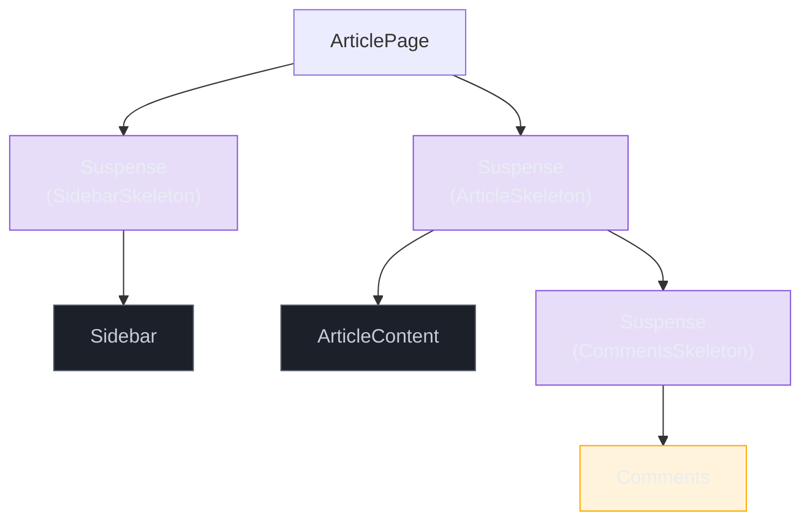
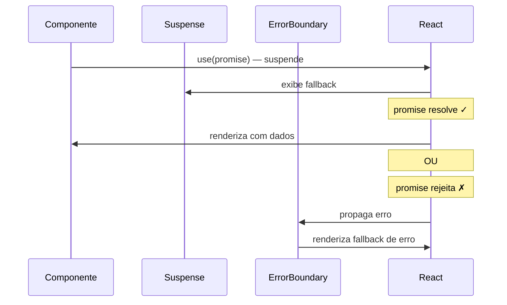
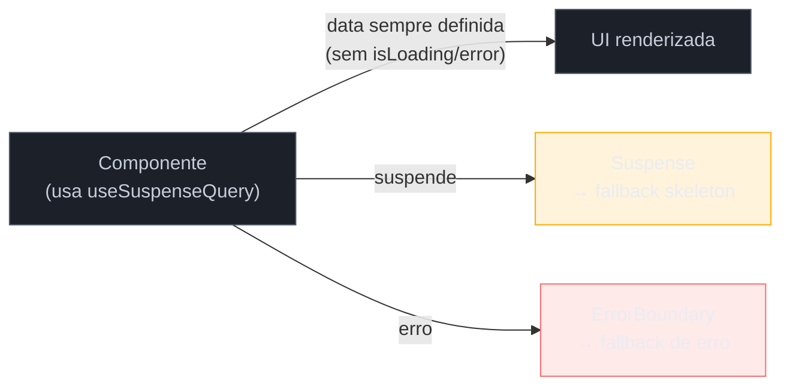

> [!abstract] TL;DR
> `<Suspense fallback={...}>` é o mecanismo declarativo do React para lidar com estados de carregamento assíncrono — o componente "suspende" (lança uma promise), React exibe o fallback, e quando a promise resolve, renderiza o conteúdo final. React 19 introduz o hook `use(promise)` que permite ler uma promise diretamente no render, ativando o Suspense do lado do cliente. Na prática, porém, React não entrega um data-fetcher: você precisa de uma lib (TanStack Query com `useSuspenseQuery`, SWR, ou um framework com loaders) para gerenciar cache, deduplicação e invalidação. `useTransition` é o aliado essencial para evitar que atualizações de dados re-exibam o fallback sobre conteúdo já visível.

---

Você está cansado de escrever isso:

```tsx
const [data, setData] = useState<User | null>(null);
const [isLoading, setIsLoading] = useState(true);
const [error, setError] = useState<Error | null>(null);

useEffect(() => {
  fetch('/api/user')
    .then(r => r.json())
    .then(setData)
    .catch(setError)
    .finally(() => setIsLoading(false));
}, []);

if (isLoading) return <Spinner />;
if (error) return <ErrorCard error={error} />;
return <UserCard user={data!} />;
```

Três estados manuais, um `useEffect` que esconde a lógica de negócio, e um `data!` com `!` que você sabe que está mentindo para o TypeScript. Em aplicações reais esse padrão se multiplica, e cada componente passa a carregar seu próprio ciclo de vida de loading — o que torna o código difícil de ler, de testar e de compor.

O Suspense existe para acabar com esse padrão.

---

## O que é Suspense — e o que faz um componente "suspender"

Suspense não é uma biblioteca de data fetching. É um mecanismo do React para **coordenar estados de carregamento declarativamente**. A ideia central é simples: um componente pode dizer "ainda não estou pronto" lançando uma promise. O React intercepta esse lançamento, exibe o `fallback` do `<Suspense>` mais próximo, e quando a promise resolve, tenta renderizar o componente novamente.

```tsx
// Estrutura mínima
<Suspense fallback={<Spinner />}>
  <UserProfile userId={42} />
</Suspense>
```

Dois casos canônicos fazem um componente suspender hoje:

1. **`React.lazy`** — importação dinâmica de módulo; o componente suspende enquanto o bundle não carregou.
2. **`use(promise)`** — o hook `use()`, estável no React 19, lê uma promise diretamente no render e suspende até ela resolver.

> [!question]- Qualquer `throw` de promise funciona?
> Tecnicamente sim — Suspense foi projetado para capturar qualquer promise lançada no render. Mas **fora do `use()` e do `React.lazy`, não é uma API pública estável**. Antes do React 19, data-fetching libraries implementavam isso como hack privado. Hoje o caminho oficial é `use()`.

---

## `React.lazy` e code splitting

O caso mais simples — e já amplamente usado — é carregar um componente pesado só quando ele for necessário:

```tsx
// Carrega o bundle somente quando o componente for renderizado pela primeira vez
const Dashboard = React.lazy(() => import('./Dashboard'));

export function App() {
  return (
    <Suspense fallback={<PageSkeleton />}>
      <Dashboard />
    </Suspense>
  );
}
```

O `React.lazy` aceita uma função que retorna `import()`. O componente suspende enquanto o módulo não foi baixado. Quando o bundle chega, React renderiza `<Dashboard />` no lugar do fallback.

Esse é o padrão clássico de **code splitting por rota** — cada página é um lazy, cada rota tem seu `<Suspense>`.

> [!info] `React.lazy` só funciona com export default
> O componente importado precisa ser `export default`. Não é possível usar com named exports diretamente — você precisaria criar um re-export default intermediário.

---

## `use(promise)` — data fetching declarativo no cliente

React 19 tornou o `use()` uma API oficial. A ideia é que você pode **passar uma promise para dentro do render** e o React faz o resto:

```tsx
import { use, Suspense } from 'react';

// A promise é criada FORA do componente (ou passada como prop)
const userPromise = fetch('/api/user/42').then(r => r.json() as Promise<User>);

function UserProfile() {
  // use() suspende o componente até a promise resolver
  const user = use(userPromise);
  return <h1>{user.name}</h1>;
}

export function UserPage() {
  return (
    <Suspense fallback={<Skeleton />}>
      <UserProfile />
    </Suspense>
  );
}
```

A promise está **fora** do componente — esse detalhe é crítico (veremos nas armadilhas). `use()` lê o resultado quando está pronto; enquanto não está, o componente suspende e o `<Suspense>` exibe o fallback.

Ao contrário dos hooks comuns, `use()` pode ser chamado condicionalmente:

```tsx
function ConditionalData({ loadExtra }: { loadExtra: boolean }) {
  const base = use(basePromise);
  const extra = loadExtra ? use(extraPromise) : null;
  return <>{base.name} {extra?.detail}</>;
}
```

---

## Suspense como modelo declarativo de loading

O shift conceitual é este: em vez de **cada componente gerenciar seu estado de carregamento**, você **declara onde o carregamento acontece na árvore**.

```tsx
// Antes: cada componente carrega e decide o que mostrar
function OldPage() {
  const { data: user, isLoading: uLoading } = useUser();
  const { data: posts, isLoading: pLoading } = usePosts();

  if (uLoading || pLoading) return <Spinner />;
  return <Layout user={user} posts={posts} />;
}

// Depois: Suspense coordena, componentes só renderizam com dados prontos
function NewPage() {
  return (
    <Suspense fallback={<PageSkeleton />}>
      <UserHeader />     {/* suspende se user não carregou */}
      <PostsList />      {/* suspende se posts não carregaram */}
    </Suspense>
  );
}
```

O `<Suspense>` age como um "checkpoint" da árvore. Qualquer filho que suspender ativa o fallback do `<Suspense>` mais próximo. Isso significa que a granularidade do fallback é **controlada pelo posicionamento dos boundaries**.

---

## Boundaries de Suspense e granularidade

Essa é uma das decisões de design mais importantes em aplicações que usam Suspense. A regra geral:

- **Boundary alto / amplo**: um único fallback para tudo embaixo — mais simples, mas esconde progresso parcial.
- **Boundaries aninhados / granulares**: cada seção tem seu próprio fallback — mais complexo, mas permite skeleton progressivo.

```tsx
// Granularidade: sidebar e conteúdo principal carregam independentemente
function ArticlePage() {
  return (
    <div className="layout">
      <Suspense fallback={<SidebarSkeleton />}>
        <Sidebar />
      </Suspense>

      <Suspense fallback={<ArticleSkeleton />}>
        <ArticleContent />
        <Suspense fallback={<CommentsSkeleton />}>
          <Comments />       {/* aninhado: carrega por último sem bloquear o artigo */}
        </Suspense>
      </Suspense>
    </div>
  );
}
```



> [!info] Azul = carregado, âmbar = ainda suspendendo
> Nessa árvore, Sidebar e ArticleContent podem aparecer antes dos Comments, que tem seu próprio fallback aninhado.

O trade-off sênior aqui é entre **complexidade da árvore de Suspense** e **qualidade da experiência de loading**. Mais granular é melhor para o usuário, mas mais difícil de manter. Uma boa heurística: granularize onde o tempo de carregamento das seções é significativamente diferente.

---

## Combinando com Error Boundary — o par inseparável

Suspense lida com loading. Error Boundary lida com falha. Em produção, você sempre precisa dos dois:

```tsx
import { ErrorBoundary } from 'react-error-boundary';

function UserSection() {
  return (
    <ErrorBoundary
      fallback={<p>Erro ao carregar usuário.</p>}
      onError={(err) => logToSentry(err)}
    >
      <Suspense fallback={<UserSkeleton />}>
        <UserProfile />
      </Suspense>
    </ErrorBoundary>
  );
}
```

Quando a promise passada para `use()` rejeita, o React lança o erro para o Error Boundary mais próximo. Se não houver Error Boundary, a exceção sobe até o root e pode quebrar toda a aplicação.



> [!question]- Posso usar `use()` sem Error Boundary?
> Tecnicamente sim, mas é uma armadilha de produção. Em dev, o React avisa. Em prod, um fetch que falha vai crashar o componente silenciosamente para cima. `use()` + `Suspense` sem `ErrorBoundary` é metade do contrato.

---

## `useTransition` — evitar fallback em navegação já visível

Imagine que o usuário está na aba "Perfil" e clica em "Posts". Sem `useTransition`, a mudança de tab ativa um novo fetch, que faz a page-level Suspense re-exibir o skeleton — escondendo conteúdo que o usuário já viu.

Com `useTransition`, o React espera os dados chegarem antes de committar a nova UI, mantendo a UI anterior visível durante a espera:

```tsx
import { useState, useTransition, Suspense } from 'react';

type Tab = 'profile' | 'posts' | 'followers';

export function ProfilePage() {
  const [tab, setTab] = useState<Tab>('profile');
  const [isPending, startTransition] = useTransition();

  function handleTabChange(next: Tab) {
    startTransition(() => setTab(next));
  }

  return (
    <div>
      <nav style={{ opacity: isPending ? 0.6 : 1 }}>
        {(['profile', 'posts', 'followers'] as Tab[]).map(t => (
          <button
            key={t}
            onClick={() => handleTabChange(t)}
            aria-pressed={tab === t}
          >
            {t}
          </button>
        ))}
      </nav>

      <Suspense fallback={<TabSkeleton />}>
        {tab === 'profile' && <ProfileTab />}
        {tab === 'posts' && <PostsTab />}
        {tab === 'followers' && <FollowersTab />}
      </Suspense>
    </div>
  );
}
```

O `isPending` é o sinal para feedback visual leve — opacidade reduzida, spinner inline — sem substituir o conteúdo visível por um skeleton.

> [!info] Regra prática do useTransition com Suspense
> Use `startTransition` sempre que uma mudança de estado vai causar um fetch que ativaria um Suspense boundary já exibido. Para conteúdo novo (primeira vez que aparece na tela), Suspense com fallback é o comportamento correto — `useTransition` não muda isso.

---

## Data fetching no cliente: o que React 19 entrega — e o que não entrega

Esta é a conversa honesta que muitos tutoriais pulam.

React 19 entrega:
- `use(promise)` — lê uma promise no render e integra com Suspense
- Coordenação de loading via `<Suspense>`
- `useTransition` para transições suaves

React 19 **não entrega**:
- Cache de requisições entre re-renders
- Deduplicação de requisições idênticas
- Invalidação e revalidação de dados
- Retry em caso de falha
- Stale-while-revalidate
- Paginação e infinite scroll

Isso significa que usar `use(promise)` com `fetch` diretamente funciona em demos, mas em produção você vai escrever o cache e a deduplicação na mão — ou usar uma lib.

O próprio time do React recomenda:
- **TanStack Query** (`useSuspenseQuery`) — o padrão da indústria para estado do servidor
- **SWR** com Suspense
- **Remix** / **Next.js** — loaders no servidor que pré-populam as promises

### TanStack Query com Suspense

```tsx
import { useSuspenseQuery } from '@tanstack/react-query';

interface User {
  id: number;
  name: string;
  email: string;
}

function UserProfile({ userId }: { userId: number }) {
  // Nenhum isLoading, nenhum error manual
  // A query suspende se não há dados; lança erro para o ErrorBoundary se falhar
  const { data: user } = useSuspenseQuery<User>({
    queryKey: ['user', userId],
    queryFn: () => fetch(`/api/users/${userId}`).then(r => r.json()),
  });

  return (
    <div>
      <h2>{user.name}</h2>
      <p>{user.email}</p>
    </div>
  );
}

// No ponto de uso:
function UserPage({ userId }: { userId: number }) {
  return (
    <ErrorBoundary fallback={<p>Falha ao carregar.</p>}>
      <Suspense fallback={<UserSkeleton />}>
        <UserProfile userId={userId} />
      </Suspense>
    </ErrorBoundary>
  );
}
```

`useSuspenseQuery` garante que `data` nunca é `undefined` dentro do componente — TypeScript recebe isso corretamente. O `isLoading` e o `isError` desaparecem do componente e migram para o Suspense e o ErrorBoundary respectivamente.



### Render-as-you-fetch vs Fetch-on-render

Um conceito sênior importante: o padrão `use(promise)` incentiva **render-as-you-fetch** — a promise é iniciada antes da renderização do componente (no loader da rota, no componente pai, ou em antecipação de navegação). O padrão `useEffect + setState` é **fetch-on-render** — o fetch só começa quando o componente já está na árvore.

```tsx
// Fetch-on-render (waterfall implícito)
function SlowPage() {
  const [data, setData] = useState(null);
  useEffect(() => { fetch('/api/data').then(setData); }, []);
  if (!data) return <Spinner />;
  return <Content data={data} />;
}

// Render-as-you-fetch (Suspense + promise pré-criada)
// A promise começa no router, antes da renderização
const dataPromise = preloadData(); // chamado no loader da rota

function FastPage() {
  const data = use(dataPromise); // já pode estar resolvida
  return <Content data={data} />;
}
```

---

## Casos práticos

### Cenário 1: Skeleton progressivo em dashboard multi-seção

Um dashboard com métricas, tabela de usuários e gráfico. As três seções têm latências diferentes. Com Suspense aninhado, cada seção aparece quando fica pronta, sem bloquear as outras:

```tsx
interface MetricsData { revenue: number; users: number }
interface UsersData { rows: Array<{ id: number; name: string }> }
interface ChartData { points: number[] }

function MetricsCard() {
  const { data } = useSuspenseQuery<MetricsData>({
    queryKey: ['metrics'],
    queryFn: fetchMetrics,   // rápido: ~100ms
  });
  return <MetricsSummary data={data} />;
}

function UsersTable() {
  const { data } = useSuspenseQuery<UsersData>({
    queryKey: ['users'],
    queryFn: fetchUsers,     // médio: ~300ms
  });
  return <DataTable rows={data.rows} />;
}

function RevenueChart() {
  const { data } = useSuspenseQuery<ChartData>({
    queryKey: ['chart'],
    queryFn: fetchChartData, // lento: ~800ms
  });
  return <LineChart data={data} />;
}

export function Dashboard() {
  return (
    <div className="dashboard">
      <Suspense fallback={<MetricsSkeleton />}>
        <MetricsCard />
      </Suspense>
      <Suspense fallback={<TableSkeleton />}>
        <UsersTable />
      </Suspense>
      <Suspense fallback={<ChartSkeleton />}>
        <RevenueChart />
      </Suspense>
    </div>
  );
}
```

Resultado: métricas aparecem em ~100ms, tabela em ~300ms, gráfico em ~800ms — sem que o mais lento bloqueie os mais rápidos.

### Cenário 2: Navegação entre abas sem re-exibir skeleton

```tsx
import { useState, useTransition } from 'react';
import { useSuspenseQuery } from '@tanstack/react-query';

type View = 'overview' | 'details' | 'history';

function ProjectOverview({ projectId }: { projectId: string }) {
  const { data } = useSuspenseQuery({
    queryKey: ['project', projectId, 'overview'],
    queryFn: () => fetchProjectOverview(projectId),
  });
  return <OverviewCard data={data} />;
}

function ProjectDetails({ projectId }: { projectId: string }) {
  const { data } = useSuspenseQuery({
    queryKey: ['project', projectId, 'details'],
    queryFn: () => fetchProjectDetails(projectId),
  });
  return <DetailsPanel data={data} />;
}

export function ProjectPage({ projectId }: { projectId: string }) {
  const [view, setView] = useState<View>('overview');
  const [isPending, startTransition] = useTransition();

  return (
    <div style={{ opacity: isPending ? 0.7 : 1 }}>
      <TabBar
        active={view}
        onSelect={(v: View) => startTransition(() => setView(v))}
      />
      <ErrorBoundary fallback={<ErrorCard />}>
        <Suspense fallback={<ViewSkeleton />}>
          {view === 'overview' && <ProjectOverview projectId={projectId} />}
          {view === 'details' && <ProjectDetails projectId={projectId} />}
        </Suspense>
      </ErrorBoundary>
    </div>
  );
}
```

O `isPending` escurece levemente o container enquanto os dados chegam. O skeleton só aparece na primeira vez que cada view é visitada — nas subsequentes, TanStack Query retorna o cache imediatamente.

---

## Armadilhas comuns

> [!warning] Criar a promise dentro do componente
> **O que acontece:** o componente entra em loop infinito — render → `use(promise)` → suspende → resolve → novo render → nova promise → suspende para sempre. **Por quê:** cada render cria uma nova promise, então nunca há uma promise "já resolvida" do render anterior. O React não consegue usar o resultado cacheado. **Como evitar:** crie a promise fora do componente (no módulo, no loader da rota, ou passando como prop estável). Com TanStack Query, o `queryKey` resolve isso automaticamente.
>
> ```tsx
> // ERRADO — nova promise em cada render
> function Bad() {
>   const data = use(fetch('/api').then(r => r.json())); // 💥
>   return <div>{data.name}</div>;
> }
>
> // CORRETO — promise estável fora do componente
> const stablePromise = fetch('/api').then(r => r.json());
> function Good() {
>   const data = use(stablePromise); // ✓
>   return <div>{data.name}</div>;
> }
> ```

> [!warning] Suspense sem Error Boundary em produção
> **O que acontece:** quando a promise rejeita, o erro sobe sem tratamento. Em dev, React exibe um overlay. Em prod, o componente desmonta silenciosamente ou a tela fica em branco. **Por quê:** `use()` lança o erro para o Error Boundary mais próximo — se não houver nenhum, o erro propaga até o root. **Como evitar:** sempre envolva `<Suspense>` com `<ErrorBoundary>`. Trate como par inseparável. Use `react-error-boundary` para ter `fallbackRender` tipado.

> [!warning] Waterfall de fetch com Suspense aninhado
> **O que acontece:** componentes aninhados que cada um faz seu próprio fetch criam um waterfall: Parent suspende → resolve → renderiza Child → Child suspende. O tempo total é a soma das latências. **Por quê:** o filho só começa seu fetch quando o pai terminou de renderizar. **Como evitar:** inicie todos os fetches no nível mais alto possível (loader da rota, componente pai, ou `prefetchQuery` do TanStack Query) antes de renderizar os filhos. Ou use `Promise.all` para paralelizar explicitamente.
>
> ```tsx
> // Waterfall (evitar)
> function Parent() {
>   const parent = use(fetchParent()); // suspende
>   return <Child parentId={parent.id} />; // filho só carrega depois
> }
>
> // Paralelo (preferir)
> const parentPromise = fetchParent();
> const childPromise = fetchChild(); // inicia em paralelo
>
> function Parent() {
>   const parent = use(parentPromise);
>   return <Child promise={childPromise} />;
> }
> ```

> [!warning] Usar Suspense para loading state de mutations
> **O que acontece:** o desenvolvedor coloca um `<Suspense>` em torno de um form de submit ou botão de delete, esperando que o Suspense exiba o fallback enquanto a mutation processa. **Por quê:** Suspense é projetado para **leitura de dados**, não para mutations. Mutations são imperativas; Suspense é para dados declarativos de leitura. **Como evitar:** para mutations, use `isPending` de `useTransition`, ou o estado de pending de `useMutation` (TanStack Query). Reserve Suspense para fetches de dados que alimentam a UI.

> [!warning] Granularidade excessiva de Suspense boundaries
> **O que acontece:** cada componente pequeno tem seu próprio `<Suspense>`, gerando dezenas de skeletons que aparecem e desaparecem de forma descoordenada — a "UI do Chumbinho". **Por quê:** Suspense granular demais sem coordenação visual resulta em layout shift e experiência fragmentada. **Como evitar:** agrupe componentes que semanticamente "pertencem à mesma tela" em um único Suspense. Use granularidade apenas onde as latências são significativamente diferentes ou onde a seção pode genuinamente ser útil antes das outras.

---

## Trade-offs sênior

| Decisão | Quando Suspense ajuda | Quando pode atrapalhar |
|---|---|---|
| **Loading state** | Múltiplos componentes com loading coordenado | Um único fetch simples — `isLoading` é mais direto |
| **Skeleton progressivo** | Seções com latências muito diferentes | Componentes com latência similar — coordenação desnecessária |
| **Navegação** | Com `useTransition`, evita skeleton em re-visita | Primeira visita sempre mostrará fallback de qualquer forma |
| **Mutations** | Não se aplica | Tentar usar Suspense para mutations é anti-padrão |
| **TypeScript** | `useSuspenseQuery` elimina `data \| undefined` | `use()` puro ainda exige promise bem tipada externamente |
| **SSR / RSC** | Streaming SSR usa Suspense como coordenador | No cliente puro, Server Components são a alternativa superior para data fetching inicial |

---

## Como explicar em inglês

"Suspense is React's declarative way to handle asynchronous loading states. Instead of tracking `isLoading` and `error` in each component, you wrap the component tree in a `<Suspense>` boundary with a fallback. Any child that 'suspends' — by calling `use()` with a promise or being a lazy-loaded component — causes the nearest Suspense boundary to show the fallback until the data is ready. In production, you almost always pair this with an Error Boundary and a library like TanStack Query, since React itself doesn't ship a data fetcher."

| PT | EN |
|----|-----|
| boundary de Suspense | Suspense boundary |
| suspender (um componente) | to suspend (a component) |
| fallback | fallback (sem tradução direta) |
| carregamento declarativo | declarative loading |
| busca de dados | data fetching |
| transição | transition |
| estado pendente | pending state |
| limite de erro | error boundary |
| divisão de código | code splitting |
| buscar ao renderizar | fetch-on-render |
| buscar antes de renderizar | render-as-you-fetch |
| invalidação de cache | cache invalidation |

---

## Suspense em uma frase

**Suspense transforma o estado de carregamento de uma responsabilidade de cada componente em uma coordenação declarativa da árvore — você diz onde mostrar o fallback, não como gerenciar o loading.**

---

## O que vem a seguir

Suspense é a face visível de um modelo de renderização mais amplo que o React chama de Concurrent. A capacidade de "pausar" um componente, manter múltiplas versões da árvore em memória e committar só quando os dados estão prontos é o que faz o `useTransition` funcionar — e essa mesma infraestrutura alimenta as `concurrent features` do React 18 e 19.

- [[20 - Concurrent features]] — o modelo de renderização concorrente que torna Suspense possível: `startTransition`, `useDeferredValue`, e como o React gerencia múltiplas versões da árvore
- [[21 - O hook use()]] — detalhes do `use()`: além de promises, leitura de Context, regras de condicionalidade e quando preferir `use()` sobre hooks tradicionais
- [[18 - Error boundaries]] — o par inseparável do Suspense: como implementar Error Boundaries corretamente com `react-error-boundary` e estratégias de recuperação
- [[17 - Performance no React]] — `React.lazy` e code splitting como estratégia de performance além do data fetching

---

## Referências

- **React Team** — [*`<Suspense>` — React Docs*](https://react.dev/reference/react/Suspense) — documentação oficial; cobre fallback, irmãos, transitions e caveat de streaming
- **React Team** — [*React v19 — Release Notes*](https://react.dev/blog/2024/12/05/react-19) — anúncio oficial do `use()` como API estável no React 19
- **React Team** — [*`useTransition` — React Docs*](https://react.dev/reference/react/useTransition) — referência de `startTransition` e comportamento com Suspense
- **Dominik Dorfmeister (TkDodo)** — [*React 19 and Suspense — A Drama in 3 Acts*](https://tkdodo.eu/blog/react-19-and-suspense-a-drama-in-3-acts) — análise crítica das mudanças de Suspense no React 19 e impacto em TanStack Query; leitura obrigatória para entender por que a comunidade resistiu inicialmente
- **TanStack** — [*`useSuspenseQuery` — TanStack Query Docs*](https://tanstack.com/query/latest/docs/framework/react/reference/useSuspenseQuery) — referência de `useSuspenseQuery`: garantia de tipo, comportamento com ErrorBoundary
- **Teemu Taskula** — [*Exploring using Suspense with React Query*](https://www.teemutaskula.com/blog/exploring-query-suspense) — análise prática de trade-offs entre `useSuspenseQuery` e hooks tradicionais
- **React Working Group** — [*When to use Suspense vs startTransition?*](https://github.com/reactwg/react-18/discussions/94) — discussão oficial sobre fronteiras de uso entre Suspense e transitions
- **FreeCodeCamp** — [*The Modern React Data Fetching Handbook*](https://www.freecodecamp.org/news/the-modern-react-data-fetching-handbook-suspense-use-and-errorboundary-explained) — visão panorâmica de `use()`, Suspense e ErrorBoundary no React 19

---

*Veja também:* [[03-Dominios/Tecnologia/React/Dicionário de React|Dicionário de React]]
