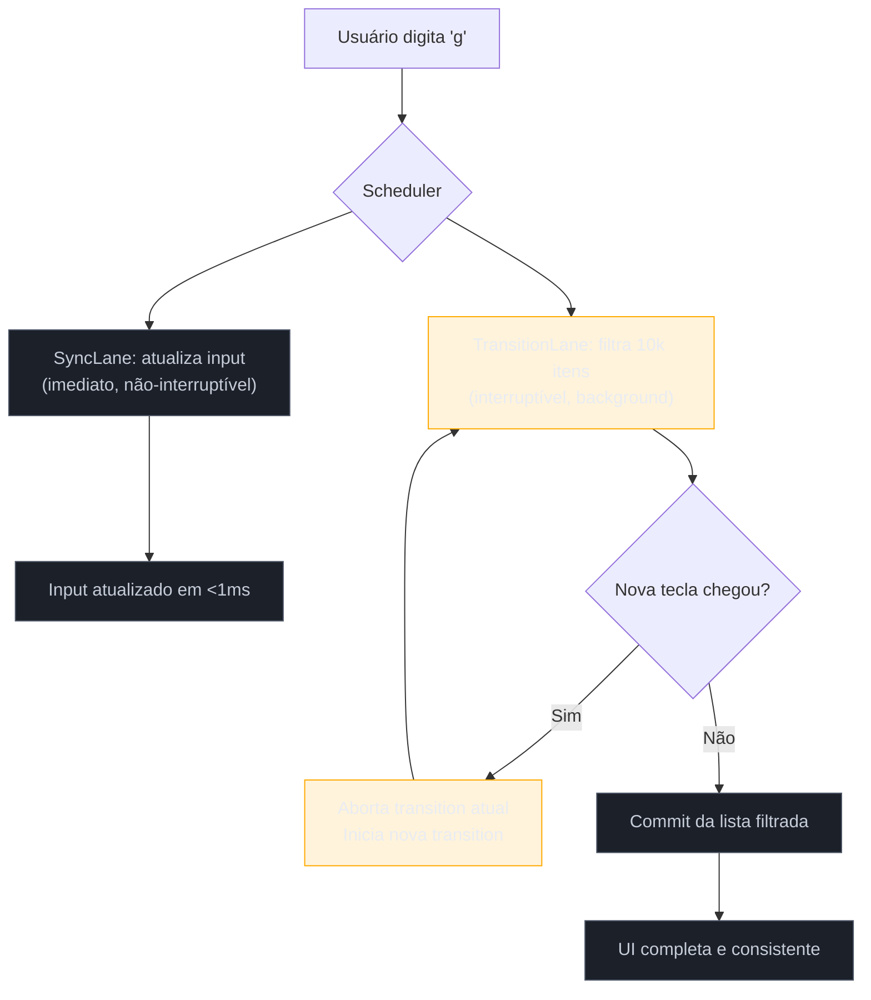
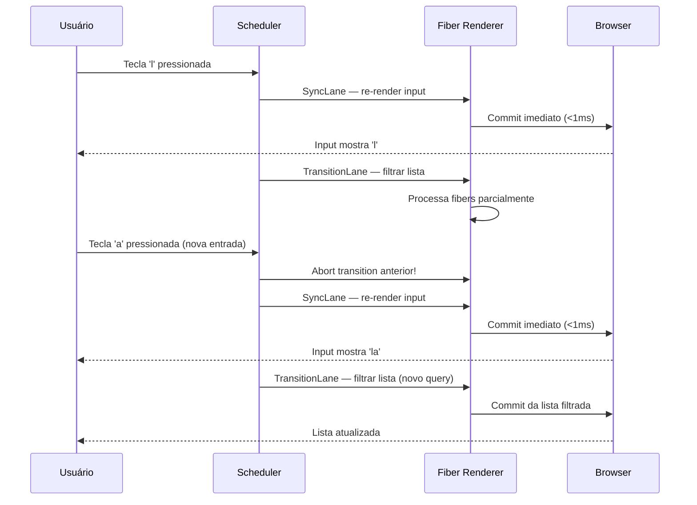

> [!abstract] TL;DR
> React Concurrent é a capacidade de **pausar, abortar e retomar renders** sem bloquear o browser. `useTransition` marca atualizações como não-urgentes para que o input do usuário nunca trave — mesmo filtrando 10 000 itens. `useDeferredValue` fornece uma "cópia atrasada" de um valor para descobpler a renderização pesada do ciclo de digitação. Ambos funcionam porque o Fiber scheduler opera com **lanes de prioridade**: input direto tem prioridade máxima, transitions correm em background e podem ser interrompidas. `useId` resolve um problema diferente — IDs estáveis e SSR-safe sem causar hydration mismatch.

## O problema que quebra qualquer app com lista longa

Imagine um campo de busca conectado a uma lista de 10 000 produtos. A cada tecla pressionada, o React precisa re-renderizar todos os itens filtrados. Em um dispositivo mid-range, isso custa 150–300 ms de CPU pura.

O resultado é visível e frustrante: o cursor do input trava. O usuário digita "laptop g" e a letra "g" só aparece depois de um delay perceptível. A lista atualiza, mas a sensação é de app travado.

A causa é simples: antes do React Concurrent, **todo update tinha a mesma prioridade**. O React precisava terminar de renderizar a lista inteira antes de processar a próxima tecla. O browser ficava bloqueado durante todo esse tempo.

Concurrent features mudam esse contrato.

---

## O modelo mental: React pode pausar e retomar

Para entender `useTransition` e `useDeferredValue`, você precisa primeiro entender o que o React Concurrent **pode fazer** que o React legado não podia.

> [!question]- Por que o React legado bloqueava o browser?
> O React legado usava um algoritmo de reconciliação **síncrono e não-interruptível**. Uma vez que o React começasse a renderizar uma árvore, ele tinha que terminar antes de devolver o controle ao browser. Era como lavar uma pilha enorme de pratos sem poder parar no meio — e durante esse tempo, ninguém podia usar a cozinha.

O **React Fiber** (reescrita do reconciliador em 2017) mudou a estrutura interna para trabalhar em **unidades menores** chamadas fibers. Cada fiber representa um componente na árvore. O scheduler pode processar um fiber, verificar se há trabalho mais urgente na fila, e **pausar** o trabalho atual para atender primeiro o que tem prioridade maior.

O mecanismo concreto é o sistema de **lanes** — um bitmap de 31 bits onde cada bit representa uma categoria de prioridade:

| Lane | Prioridade | Exemplo |
|------|-----------|---------|
| `SyncLane` | Máxima — síncrono, não-interruptível | Click, keydown |
| `InputContinuousLane` | Alta — contínuo | Mouse move, scroll |
| `DefaultLane` | Normal — assíncrono | `setState` comum |
| `TransitionLane` (1-15) | Baixa — interruptível | `startTransition` |
| `IdleLane` | Mínima — quando não há nada mais urgente | Prefetch, offscreen |

Quando você usa `useTransition`, o React move seu update para `TransitionLane`. Quando chega uma tecla nova (SyncLane), o React pode **abortar** o render da transition e começar do zero com a nova entrada. Não é delay — é prioridade.



---

## `useTransition`: controle explícito sobre prioridade

`useTransition` é o hook que você usa quando **você controla o setter de estado** que dispara o trabalho pesado. Ele retorna dois valores:

```tsx
const [isPending, startTransition] = useTransition();
```

- `isPending`: `boolean` — `true` enquanto há uma transition em curso
- `startTransition`: função que envolve o(s) setter(s) de estado não-urgentes

### Exemplo: busca com 10 000 itens

```tsx
import { useState, useTransition, useMemo } from "react";

const ALL_PRODUCTS: Product[] = generateProducts(10_000);

function ProductSearch() {
  const [inputValue, setInputValue] = useState("");
  const [filterQuery, setFilterQuery] = useState("");
  const [isPending, startTransition] = useTransition();

  function handleChange(e: React.ChangeEvent<HTMLInputElement>) {
    // Urgente: atualiza o input imediatamente (SyncLane)
    setInputValue(e.target.value);

    // Não-urgente: filtragem vai para TransitionLane
    startTransition(() => {
      setFilterQuery(e.target.value);
    });
  }

  const filtered = useMemo(
    () =>
      ALL_PRODUCTS.filter((p) =>
        p.name.toLowerCase().includes(filterQuery.toLowerCase())
      ),
    [filterQuery]
  );

  return (
    <div>
      <input
        value={inputValue}
        onChange={handleChange}
        placeholder="Buscar produto..."
      />
      {isPending && <span className="searching-indicator">Filtrando…</span>}
      <ProductList items={filtered} />
    </div>
  );
}
```

O truque está em **dois estados separados**: `inputValue` (atualizado imediatamente) e `filterQuery` (atualizado via transition). O input responde a cada tecla sem delay. A lista pode levar alguns frames a mais, mas o usuário nunca sente travamento.

> [!info] `isPending` é seu friend de UX
> Use `isPending` para mostrar um indicador visual discreto durante a transition — um spinner inline, opacidade reduzida na lista, ou uma badge "Atualizando…". Nunca use para desabilitar o input.

### `startTransition` sem o hook

Quando você não precisa do `isPending`, pode usar a função standalone importada diretamente:

```tsx
import { startTransition } from "react";

function handleTabChange(tab: Tab) {
  startTransition(() => {
    setActiveTab(tab);
  });
}
```

É a mesma semântica — o update vai para TransitionLane — sem a necessidade do hook completo.

### React 19: transitions com async functions

O React 19 expandiu `startTransition` para aceitar funções assíncronas, o que permite encapsular todo o ciclo de uma action (incluindo fetch) dentro de uma transition:

```tsx
const [isPending, startTransition] = useTransition();

async function handleSearch(query: string) {
  startTransition(async () => {
    // React gerencia isPending automaticamente durante o await
    const results = await fetchProducts(query);
    setProducts(results);
  });
}
```

Isso integra transitions com o modelo de Actions do React 19, onde o React gerencia estados de pending, erro e otimismo automaticamente.

---

## `useDeferredValue`: quando você não controla o setter

Às vezes você recebe um valor via prop ou contexto e não tem acesso ao setter que o dispara. `useDeferredValue` resolve esse caso:

```tsx
const deferredValue = useDeferredValue(value);
```

O React mantém uma **versão "atrasada"** do valor que só é atualizada quando o browser tem tempo livre. Durante uma atualização urgente (digitação), `deferredValue` fica "para trás", apontando para o valor anterior enquanto a renderização urgente acontece.

### Exemplo: input com resultado pesado via prop

```tsx
interface SearchResultsProps {
  query: string; // vem do pai — você não controla o setter
}

function SearchResults({ query }: SearchResultsProps) {
  // query muda a cada tecla; deferredQuery só muda quando há tempo
  const deferredQuery = useDeferredValue(query);

  // Memoization é OBRIGATÓRIA aqui — veja Armadilhas
  const results = useMemo(
    () => expensiveFilter(deferredQuery),
    [deferredQuery]
  );

  const isStale = query !== deferredQuery;

  return (
    <div style={{ opacity: isStale ? 0.6 : 1, transition: "opacity 0.2s" }}>
      {results.map((item) => (
        <ResultItem key={item.id} item={item} />
      ))}
    </div>
  );
}
```

O padrão `isStale = query !== deferredQuery` é canônico: enquanto os valores diferem, a UI está renderizando com dados "velhos" e você pode indicar isso visualmente.

> [!question]- Por que `useDeferredValue` existe se já temos `useTransition`?
> Porque nem sempre você tem acesso ao setter. Num componente profundo na árvore que recebe `query` via prop, você não pode envolver o setter do ancestral em `startTransition`. `useDeferredValue` é a solução "do lado do consumidor" — você diz ao React: "processa esse valor de forma não-urgente, e eu aguento receber a versão atrasada por alguns frames."

---

## Diagrama: urgente vs transition na fila de render



---

## Transition vs debounce: diferença fundamental

Essa confusão é a mais comum entre devs que chegam nas concurrent features pela primeira vez.

| Aspecto | Debounce | `useTransition` |
|---------|----------|----------------|
| **Quando executa** | Após período de inatividade | Imediatamente, em background |
| **Interruptível?** | Não — timer reseta e re-executa | Sim — React aborta e reinicia |
| **Delay artificial?** | Sim (ex.: 300ms) | Não — usa tempo livre do browser |
| **Network requests** | Ótimo para reduzir requests | Não afeta requests (só renders) |
| **Implementação** | `setTimeout` / `lodash.debounce` | API nativa do React |
| **Resultado** | Ignora eventos intermediários | Mostra conteúdo intermediário |

O ponto crucial: **debounce é para network, transition é para render**. Se você quer evitar 50 fetches enquanto o usuário digita, use debounce na chamada de fetch. Se você quer que o input responda enquanto a lista renderiza, use transition.

Em muitas buscas reais, você usa **os dois**: transition para a lista renderizar sem travar, debounce para disparar o fetch só após 300ms de inatividade.

```tsx
function SearchPage() {
  const [inputValue, setInputValue] = useState("");
  const [displayQuery, setDisplayQuery] = useState(""); // para a lista local
  const [isPending, startTransition] = useTransition();

  // Debounce controla o fetch
  const debouncedFetch = useDebouncedCallback((q: string) => {
    fetchAndSetRemoteResults(q);
  }, 300);

  function handleChange(e: React.ChangeEvent<HTMLInputElement>) {
    setInputValue(e.target.value);

    // Transition controla a renderização da lista local
    startTransition(() => setDisplayQuery(e.target.value));

    // Debounce controla a chamada de rede
    debouncedFetch(e.target.value);
  }
  // ...
}
```

---

## Transitions e Suspense: evitando o fallback

Quando um componente suspenso está dentro de uma transition, o React **não mostra o fallback** da `<Suspense>` boundary. Em vez disso, mantém o conteúdo anterior visível até que o novo conteúdo esteja pronto.

Isso é especialmente importante em navegações client-side: ao trocar de aba ou rota, a experiência sem transition exibe um spinner (fallback de Suspense) a cada navegação. Com transition, o usuário vê o conteúdo anterior até o novo estar pronto — como uma navegação suave.

```tsx
function TabContainer() {
  const [activeTab, setActiveTab] = useState<Tab>("overview");
  const [isPending, startTransition] = useTransition();

  function selectTab(tab: Tab) {
    startTransition(() => setActiveTab(tab));
  }

  return (
    <>
      <TabBar onSelect={selectTab} isPending={isPending} />
      {/* Suspense boundary NÃO mostra fallback durante transition */}
      <Suspense fallback={<PageSkeleton />}>
        <TabContent tab={activeTab} />
      </Suspense>
    </>
  );
}
```

> [!info] Estado "stale" durante transition
> Durante uma transition, o React pode mostrar conteúdo "stale" (versão anterior) por alguns frames. Isso é **intencional**: é melhor mostrar dados ligeiramente desatualizados do que um spinner por 50ms. Use `isPending` para indicar que a atualização está em curso se a staleness importar para o usuário.

---

## `useId`: IDs estáveis e SSR-safe

`useId` é tecnicamente parte das concurrent features porque resolve um problema que o rendering concorrente e o SSR tornam crítico: como gerar IDs únicos que sejam **idênticos no servidor e no cliente**.

```tsx
function PasswordField() {
  const id = useId();

  return (
    <div>
      <label htmlFor={`${id}-input`}>Senha</label>
      <input id={`${id}-input`} type="password" />
      <span id={`${id}-desc`}>Mínimo 8 caracteres</span>
    </div>
  );
}
```

### Por que não usar `Math.random()` ou `crypto.randomUUID()`?

No SSR, o servidor gera um ID. O cliente, ao hidratar, precisa gerar **o mesmo ID** para que o HTML do servidor corresponda ao render do cliente. `Math.random()` e `uuid` geram valores diferentes a cada execução — garantia de hydration mismatch.

`useId` deriva o ID a partir da **posição do componente na árvore** de React. Como a árvore é determinística (mesmos componentes, mesma ordem), o servidor e o cliente chegam ao mesmo ID.

```tsx
// IDs gerados: ":r0:", ":r1:", ":r2:"... — estáveis e únicos por instância
const id = useId(); // ex.: ":r3:"

// Para múltiplos elementos no mesmo componente:
return (
  <>
    <input id={`${id}-name`} />     {/* ":r3:-name" */}
    <input id={`${id}-email`} />    {/* ":r3:-email" */}
  </>
);
```

> [!warning] `useId` não é para keys de listas
> O ID gerado é estável **por instância** do componente, mas se você renderizar o mesmo componente 100 vezes em uma lista, cada instância tem seu próprio `useId`. Mas o ID não é derivado dos dados — é posicional. Para keys de lista, use o `id` dos seus dados (ex.: `product.id`).

---

## Casos práticos

### Cenário 1: Editor de código com preview em tempo real

Um editor onde cada keystroke re-renderiza um preview de markdown compilado. Sem transition, o preview bloqueia o editor. Com transition, o editor permanece fluído:

```tsx
function MarkdownEditor() {
  const [raw, setRaw] = useState("");
  const [compiled, setCompiled] = useState("");
  const [isPending, startTransition] = useTransition();

  function handleEdit(value: string) {
    setRaw(value); // urgente: textarea atualiza na hora

    startTransition(() => {
      setCompiled(compileMarkdown(value)); // pesado: vai para background
    });
  }

  return (
    <div className="editor-layout">
      <textarea value={raw} onChange={(e) => handleEdit(e.target.value)} />
      <div
        className="preview"
        style={{ opacity: isPending ? 0.7 : 1 }}
        dangerouslySetInnerHTML={{ __html: compiled }}
      />
    </div>
  );
}
```

### Cenário 2: Dashboard com filtros cruzados

Um dashboard analytics onde múltiplos filtros (período, região, categoria) re-renderizam vários gráficos pesados. `useDeferredValue` permite que os filtros selecionados sejam visualmente responsivos enquanto os gráficos atualizam de forma coordenada:

```tsx
interface DashboardFilters {
  period: string;
  region: string;
  category: string;
}

function Dashboard() {
  const [filters, setFilters] = useState<DashboardFilters>({
    period: "30d",
    region: "all",
    category: "all",
  });

  // Os charts usam a versão deferida dos filtros
  const deferredFilters = useDeferredValue(filters);
  const isStale = filters !== deferredFilters;

  return (
    <div>
      <FilterBar filters={filters} onChange={setFilters} />
      {/* FilterBar mostra os filtros selecionados imediatamente */}

      <div style={{ opacity: isStale ? 0.5 : 1 }}>
        {/* Charts só atualizam quando há tempo livre */}
        <RevenueChart filters={deferredFilters} />
        <UsersChart filters={deferredFilters} />
        <ConversionChart filters={deferredFilters} />
      </div>
    </div>
  );
}
```

---

## Armadilhas comuns

> [!warning] Usar transition para updates urgentes
> **O que acontece:** o update atrasa visualmente — o usuário clica num botão e a UI demora para responder. **Por quê:** transitions têm prioridade baixa. Updates urgentes (clicks, inputs, feedback imediato) devem sempre usar `setState` direto, sem `startTransition`. **Como evitar:** só use transition quando o trabalho pesado é a *consequência* de um input urgente — nunca para o input em si. Regra: o que o usuário tocou diretamente → urgente. O que muda em resposta → pode ser transition.

> [!warning] Esperar que `useTransition` funcione como debounce
> **O que acontece:** o dev adiciona `useTransition` esperando reduzir chamadas de rede, mas o número de fetches não muda. **Por quê:** transitions controlam **renderização**, não execução de efeitos ou funções. Um fetch dentro de `startTransition` ainda dispara a cada keystroke — apenas o render associado tem prioridade reduzida. **Como evitar:** para reduzir fetches, use debounce ou throttle. Transitions e debounce resolvem problemas diferentes e se complementam.

> [!warning] `useDeferredValue` sem `useMemo` no consumidor
> **O que acontece:** `useDeferredValue` não traz nenhum benefício — a renderização pesada acontece a cada render, mesmo que `deferredValue` não tenha mudado. **Por quê:** `useDeferredValue` só faz sentido se a computação pesada for memoizada com base no valor deferido. Sem `useMemo`, React re-executa o cálculo toda vez mesmo que `deferredQuery === previousDeferredQuery`. **Como evitar:** sempre combine `useDeferredValue` com `useMemo` (ou `React.memo` no componente filho) usando o `deferredValue` como dependência.

> [!warning] Colocar `startTransition` fora do event handler
> **O que acontece:** `Warning: Can't perform a React state update on a component that is already updating.` **Por quê:** `startTransition` precisa ser chamado de forma síncrona dentro de um event handler ou de outro lifecycle do React. Chamá-lo dentro de um `setTimeout` ou callback assíncrono break o contexto de scheduling. **Como evitar:** se precisar de delay real antes de iniciar a transition, use `setTimeout` externamente e chame `startTransition` dentro do callback — mas questione se não é um caso de debounce mesmo.

---

## Trade-offs sênior

**Quando transitions são insuficientes:** se o trabalho pesado é genuinamente bloqueante (ex.: parse de JSON de 50 MB na thread principal), transitions não ajudam porque o Fiber scheduler só pode pausar *entre* fibers, não no meio de um cálculo JavaScript síncrono. Para isso, use Web Workers.

**Transitions e React DevTools:** o Profiler do React DevTools mostra as lanes de cada render. Em uma transition, você verá renders marcados como "Transition" com prioridade reduzida. Isso é útil para diagnosticar por que uma transition está tomando muito tempo.

**`useDeferredValue` com initialValue (React 19):** a assinatura completa em React 19 é `useDeferredValue(value, initialValue?)`. O segundo argumento permite especificar o valor inicial para SSR, evitando que o servidor renderize com um valor "stale" imaginário.

```tsx
// React 19: initialValue para SSR
const deferredQuery = useDeferredValue(query, ""); // começa com string vazia no server
```

**Custo de transitions abortadas:** cada vez que o React aborta uma transition para processar trabalho urgente, o trabalho feito até ali é descartado. Em listas muito grandes, isso pode significar renderizar a mesma lista várias vezes parcialmente. Se a lista em si é cara de renderizar (mesmo com React.memo), considere virtualização (`react-virtual`, `@tanstack/virtual`) além de transitions.

---

## Como explicar em inglês

> React's concurrent features let the renderer **pause, abandon, and restart work** based on priority. When you wrap a state update in `startTransition`, you're telling React: "this can wait — if something more urgent comes in, drop this and start fresh." The Fiber scheduler uses a lane-based priority system internally, where user input always runs at sync priority while transitions run at a lower, interruptible priority. `useDeferredValue` is the consumer-side version — you get a "lagged copy" of a value that only updates when the browser is idle, which you combine with `useMemo` to skip expensive recalculations.

| PT | EN |
|----|-----|
| renderização interruptível | interruptible rendering |
| atualização não-urgente | non-urgent update / low-priority update |
| valor deferido | deferred value |
| conteúdo obsoleto / desatualizado | stale content |
| transição em andamento | pending transition |
| hidratação | hydration |
| ID estável | stable ID |
| suspense com fallback | Suspense fallback |
| scheduler de prioridade | priority scheduler |
| lanes de prioridade | priority lanes |

---

## O que vem a seguir

Agora que você entende como o React prioriza e interrompe trabalho, há dois caminhos naturais:

O primeiro é entender como o React **detecta o que mudou** na árvore antes de agendar qualquer trabalho — esse é o território do reconciliador e do algoritmo de diffing, explicado em detalhes em [[16 - Reconciliation e diffing a fundo]].

O segundo é como aplicar essas técnicas dentro de uma estratégia mais ampla de performance, incluindo memoização, code splitting e análise com o Profiler: [[17 - Performance no React]].

E para o vocabulário técnico das concurrent features em inglês e em código, consulte o [[03-Dominios/Tecnologia/React/Dicionário de React|Dicionário de React]].

---

## Referências

- **React Team** — [*React v19 Release Notes*](https://react.dev/blog/2024/12/05/react-19) — changelog oficial com mudanças em `useTransition` para async actions
- **React Docs** — [*useTransition*](https://react.dev/reference/react/useTransition) — referência canônica com exemplos de Suspense e tabs
- **React Docs** — [*useId*](https://react.dev/reference/react/useId) — referência com casos de uso SSR e acessibilidade
- **Colin Zhou** — [*How React Lanes Work (React Internal Deep-dive 2025)*](https://javascript.plainenglish.io/how-react-lanes-work-react-internal-deep-dive-2025-e4ac04d0534b) — deep dive no sistema de lanes e bitmask
- **Developer Way** — [*React useTransition: performance game changer or…?*](https://www.developerway.com/posts/use-transition) — análise comparativa com benchmarks reais em dispositivos mid-range
- **DEV Community** — [*useTransition !== debounced functions*](https://dev.to/borzoomv/usetransition-debounced-functions-1igi) — distinção prática com exemplos
- **React WG** — [*When to use Suspense vs startTransition?*](https://github.com/reactwg/react-18/discussions/94) — discussão canônica da equipe do React sobre a interação entre os dois
- **SIXT Tech** — [*React 18 - useTransition vs useDeferredValue*](https://www.sixt.tech/useTransition-vs-useDeferredValue) — comparação em cenários de produção reais
- **Code With Seb** — [*A Deep Dive into React Fiber — The Engine Behind Modern React*](https://www.codewithseb.com/blog/deep-dive-into-react-fiber-the-engine-behind-modern-react) — estrutura interna do Fiber e o modelo de scheduling

---

> **Concurrent features em uma frase:** o React Concurrent é a capacidade de tratar renders como trabalho interruptível, usando lanes de prioridade para garantir que o usuário nunca espera pela UI — o input sempre responde, e o trabalho pesado acontece nos intervalos.
