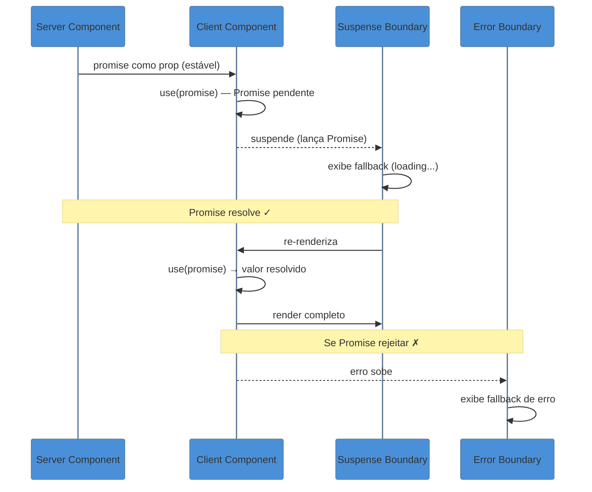
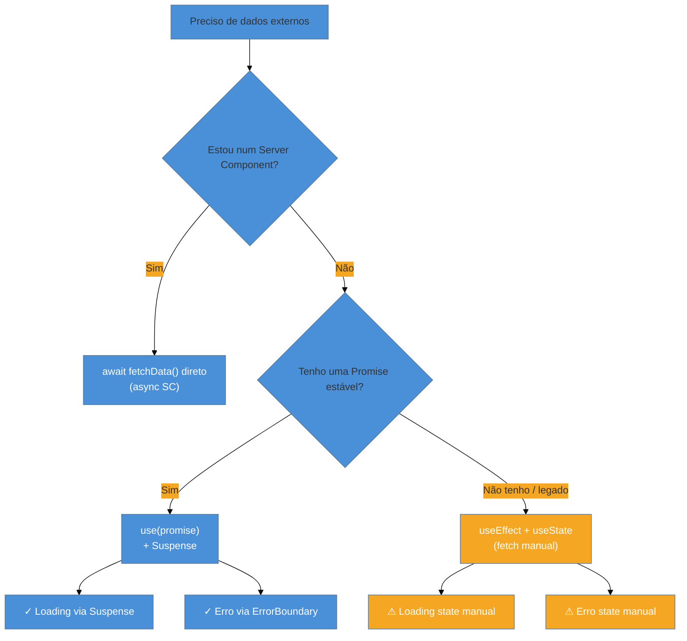
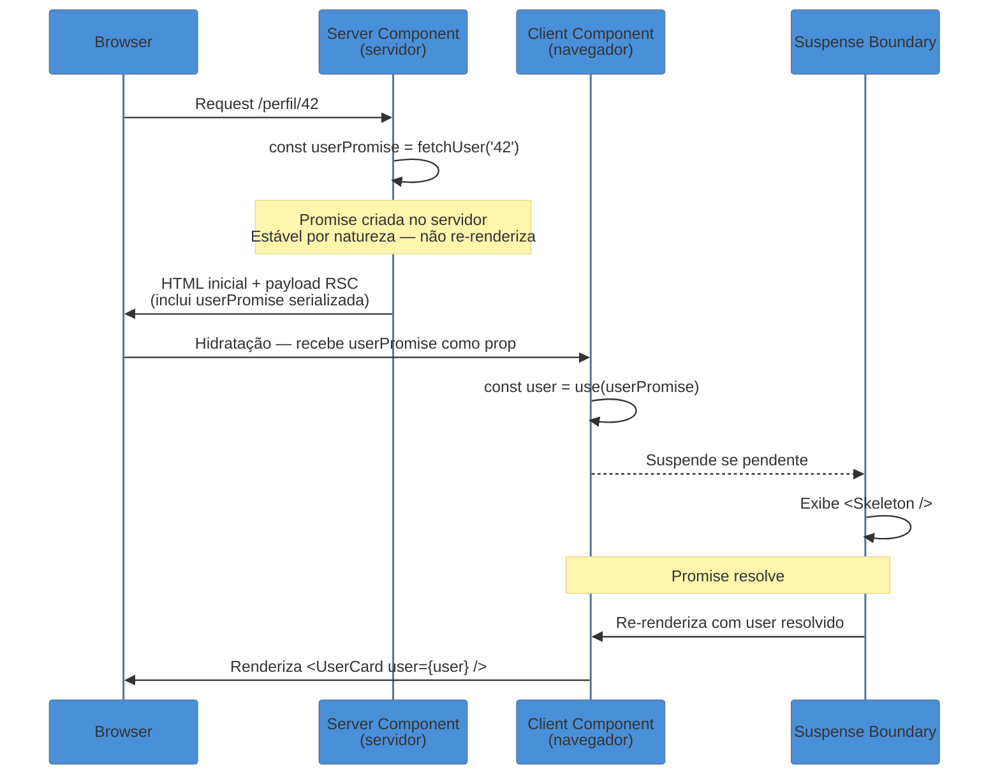

# O hook `use()` — a API que quebra as regras (de propósito)

> [!abstract] TL;DR
> `use()` é uma nova API do React 19 que permite ler Promises e Contextos **durante o render** — e é a única API do React que pode ser chamada condicionalmente e dentro de loops. Com `use(promise)`, o componente suspende automaticamente até a Promise resolver, delegando o estado de loading ao Suspense mais próximo e os erros ao Error Boundary. Com `use(Context)`, funciona como `useContext`, mas com flexibilidade para chamadas condicionais. O grande pitfall: a Promise passada para `use()` **deve ser estável** — criá-la dentro do corpo do componente gera um loop infinito de suspensão.

---

Você já escreveu algo assim?

```tsx
const [data, setData] = useState<User | null>(null);
const [loading, setLoading] = useState(true);
const [error, setError] = useState<Error | null>(null);

useEffect(() => {
  fetchUser(userId)
    .then(setData)
    .catch(setError)
    .finally(() => setLoading(false));
}, [userId]);

if (loading) return <Spinner />;
if (error) return <ErrorMessage error={error} />;
return <UserCard user={data!} />;
```

São 15 linhas, três estados sincronizados à mão, uma race condition escondida e uma UI de loading gerenciada dentro do componente. Qualquer desenvolvedor sênior já viu esse padrão e também já viu ele quebrar de formas criativas — `data` sendo exibido antes de `loading` ser `false`, `error` sendo apagado num re-render, o spinner travado para sempre porque o cleanup do `useEffect` não foi feito direito.

O React 19 trouxe uma resposta: `use()`. Três linhas, zero estados manuais, loading e erro delegados para a árvore. Mas para usar com segurança, é preciso entender o que está acontecendo por baixo.

---

## O que é `use()` e por que ele não é um hook comum

Antes de ver o código, é importante desfazer um equívoco que vai aparecer em toda discussão sobre `use()`: ele **não é um hook**.

Hooks têm regras rígidas — as famosas *Rules of Hooks*. Você as conhece: só pode chamar hooks no nível superior de um componente ou de outro hook, nunca dentro de `if`, `for` ou funções aninhadas. Isso existe porque React identifica cada hook pela sua **posição na ordem de chamada**. Se a ordem muda entre renders, o React fica confuso sobre qual estado pertence a qual hook.

`use()` não usa esse mecanismo. Ele é tratado pelo compilador e pelo runtime como uma API especial — pode ser chamado condicionalmente, dentro de loops, depois de um `return` antecipado. A documentação oficial do React chama explicitamente de "API", não "hook".

> [!info] Por que use() pode ser condicional?
> Hooks dependem de ordem porque guardam estado entre renders via uma lista interna ("fiber"). `use()` não guarda estado próprio — ele *lê* um recurso externo (Promise ou Context) e ou retorna o valor ou suspende o render. Sem estado interno para rastrear, não há problema com chamadas condicionais.

Isso abre padrões que antes eram impossíveis sem gambiarras:

```tsx
// ✅ Válido com use() — impossível com useContext
function UserPanel({ isAdmin }: { isAdmin: boolean }) {
  if (!isAdmin) return <AccessDenied />;

  // Só administradores leem esse contexto — condicional e legal
  const adminConfig = use(AdminConfigContext);
  return <AdminDashboard config={adminConfig} />;
}
```

Com `useContext`, você seria forçado a chamar o contexto antes do `if`, mesmo que o valor nunca fosse usado para 99% dos usuários.

---

## Uso 1 — `use(promise)`: ler dados de forma declarativa

### O mecanismo por dentro

Quando você passa uma Promise para `use()`, o React faz algo que parece mágico mas tem uma mecânica precisa:

1. Se a Promise ainda está **pendente**, o React *suspende* o componente — internamente, ele "lança" a Promise como uma exceção especial.
2. O Suspense boundary mais próximo *captura* essa suspensão e exibe o fallback de loading.
3. Quando a Promise **resolve**, o React re-renderiza o componente a partir do Suspense boundary.
4. `use(promise)` agora retorna o valor resolvido — o componente termina de renderizar normalmente.
5. Se a Promise **rejeita**, o erro sobe para o Error Boundary mais próximo.



### Código: o padrão correto

O padrão canônico separa onde a Promise é **criada** de onde ela é **consumida**:

```tsx
// server-component.tsx (Server Component)
import { UserCard } from './UserCard';

export default async function ProfilePage({ userId }: { userId: string }) {
  // A Promise é criada aqui — Server Component não re-renderiza,
  // então a referência é estável por natureza
  const userPromise = fetchUser(userId);

  return (
    <Suspense fallback={<Skeleton />}>
      <ErrorBoundary fallback={<ErrorMessage />}>
        <UserCard userPromise={userPromise} />
      </ErrorBoundary>
    </Suspense>
  );
}
```

```tsx
// UserCard.tsx (Client Component)
'use client';
import { use } from 'react';

interface Props {
  userPromise: Promise<User>;
}

export function UserCard({ userPromise }: Props) {
  // use() suspende se a Promise ainda estiver pendente
  // Quando resolve, retorna o User diretamente
  const user = use(userPromise);

  return (
    <div className="user-card">
      <h2>{user.name}</h2>
      <p>{user.email}</p>
    </div>
  );
}
```

Observe o que *não* existe no `UserCard`: nenhum `useState`, nenhum `useEffect`, nenhum estado de loading manual. A UI de loading está no `<Suspense fallback={<Skeleton />}>` — um nível acima, gerenciada pelo React. O tratamento de erro está no `<ErrorBoundary>` — também gerenciado externamente.

O componente faz exatamente uma coisa: dado um usuário, renderiza o cartão. Zero lógica de orquestração.

---

## Uso 2 — `use(Context)`: contexto sem as amarras de posição

`use()` aceita um Context como argumento e se comporta como `useContext` — lê o valor atual do contexto mais próximo na árvore. A diferença é a flexibilidade de chamada:

```tsx
// ✅ Antes do React 19 — forçado a chamar no topo
function Notification({ type }: { type: 'toast' | 'banner' }) {
  const theme = useContext(ThemeContext); // DEVE estar aqui, antes de qualquer condicional

  if (type === 'toast') {
    return <Toast color={theme.accent} />;
  }
  return <Banner color={theme.primary} />;
}
```

```tsx
// ✅ Com use() — pode chamar onde fizer sentido semântico
function Notification({ type }: { type: 'toast' | 'banner' }) {
  if (type === 'toast') {
    const theme = use(ThemeContext); // Lê apenas quando relevante
    return <Toast color={theme.accent} />;
  }

  const theme = use(ThemeContext); // Poderia ser omitido se o tipo não precisasse
  return <Banner color={theme.primary} />;
}
```

> [!question]- `useContext` vai ser depreciado?
> Não — a documentação oficial deixa claro que `useContext` continua funcionando. `use(Context)` é uma alternativa mais flexível, não um substituto obrigatório. Para a maioria dos casos onde você chama contexto no topo de um componente sem condicionais, `useContext` é igualmente adequado e mais legível para quem não conhece React 19.

---

## Mapa mental: `use()` vs as APIs anteriores



---

## O pitfall central: Promise deve ser estável

Este é o ponto mais importante da nota e o que mais vai aparecer em code review.

Se você criar a Promise **dentro do corpo do componente** que chama `use()`, você aciona um loop infinito:

```tsx
// ❌ ERRADO — cria nova Promise a cada render
function UserCard({ userId }: { userId: string }) {
  // Cada render cria uma Promise nova
  const userPromise = fetchUser(userId); // ← AQUI está o problema

  const user = use(userPromise); // React suspende...
  // ... Promise resolve → re-render → nova Promise → suspende de novo → loop
  return <div>{user.name}</div>;
}
```

A mecânica do loop:
1. Render começa → `fetchUser()` cria Promise nova.
2. `use(promise)` detecta Promise pendente → suspende o componente.
3. Promise resolve → React re-renderiza o componente.
4. Render começa novamente → `fetchUser()` cria **outra** Promise nova.
5. `use()` vê Promise pendente de novo → suspende de novo.
6. Loop infinito.

### Soluções válidas

**Opção 1 — Promise vinda de Server Component (recomendada):**
```tsx
// Server Component cria a Promise (não re-renderiza → estável)
const promise = fetchUser(userId);
return <UserCard userPromise={promise} />;
```

**Opção 2 — `useMemo` para estabilizar no cliente:**
```tsx
function UserCard({ userId }: { userId: string }) {
  // useMemo garante que a Promise só é recriada quando userId muda
  const userPromise = useMemo(() => fetchUser(userId), [userId]);
  const user = use(userPromise);
  return <div>{user.name}</div>;
}
```

**Opção 3 — `cache()` do React para deduplicação em Server Components:**
```tsx
import { cache } from 'react';

// cache() garante que chamadas com mesmo argumento retornam a mesma Promise
// durante o mesmo ciclo de request
const getUser = cache((userId: string) => fetchUser(userId));
```

> [!warning] `async` dentro de `cache()` quebra a deduplicação
> Não marque a função envolvida em `cache()` como `async`. O `async` sempre cria uma Promise nova, mesmo que o valor já esteja em cache internamente. Use uma função síncrona que guarda e retorna a Promise original.

---

## Casos práticos

### Cenário 1: Dashboard com múltiplas seções independentes

Em vez de buscar todos os dados em sequência e bloquear o render, cada seção tem seu próprio Suspense:

```tsx
// dashboard-page.tsx (Server Component)
export default function DashboardPage() {
  const statsPromise = fetchStats();
  const activityPromise = fetchRecentActivity();
  const alertsPromise = fetchAlerts();

  return (
    <div className="dashboard">
      <Suspense fallback={<StatsSkeleton />}>
        <StatsPanel statsPromise={statsPromise} />
      </Suspense>

      <Suspense fallback={<ActivitySkeleton />}>
        <ActivityFeed activityPromise={activityPromise} />
      </Suspense>

      <Suspense fallback={<AlertsSkeleton />}>
        <AlertsPanel alertsPromise={alertsPromise} />
      </Suspense>
    </div>
  );
}
```

```tsx
// StatsPanel.tsx (Client Component)
'use client';
import { use } from 'react';

export function StatsPanel({ statsPromise }: { statsPromise: Promise<Stats> }) {
  const stats = use(statsPromise);
  return <div>{stats.totalUsers} usuários</div>;
}
```

As três Promises são disparadas em paralelo no servidor. Cada seção fica disponível assim que seus dados chegam — sem coordenação manual, sem `Promise.all` que bloqueia tudo até o mais lento resolver.

---

### Cenário 2: Contexto condicional para permissões

```tsx
// PermissionedActions.tsx
'use client';
import { use } from 'react';

const AdminContext = React.createContext<AdminConfig | null>(null);

function ActionButtons({ role }: { role: 'user' | 'admin' }) {
  // Contexto pesado só é lido por admins
  if (role !== 'admin') {
    return <BasicActions />;
  }

  const adminConfig = use(AdminContext);

  if (!adminConfig) {
    throw new Error('AdminContext não está disponível');
  }

  return <AdminActions config={adminConfig} />;
}
```

Sem `use()`, seria necessário chamar `useContext(AdminContext)` antes do `if (role !== 'admin')` — lendo um contexto potencialmente pesado para todos os usuários que nunca vão chegar no branch de admin.

---

## Armadilhas comuns

> [!warning] Criar Promise dentro do componente que chama `use()` — loop infinito
> **O que acontece:** o componente entra em loop infinito de suspensão — o spinner não desaparece nunca, ou o componente fica re-renderizando rapidamente sem exibir dados.
> **Por quê:** cada render cria uma Promise nova; `use()` suspende; quando a Promise resolve, um novo render começa com uma nova Promise; o ciclo reinicia indefinidamente.
> **Como evitar:** a Promise deve ser criada fora do componente consumidor — em um Server Component (passa como prop), em `useMemo` (estabiliza por dependência), ou via `cache()` do React (deduplicação por argumento).

> [!warning] Usar `use(promise)` sem Suspense boundary
> **O que acontece:** React lança um erro em produção e um warning em desenvolvimento — "A component suspended while rendering but no fallback UI was specified in a parent Suspense boundary."
> **Por quê:** quando `use()` suspende, precisa de um Suspense boundary para exibir o fallback. Sem ele, o erro sobe até o root e a tela fica em branco.
> **Como evitar:** sempre envolva componentes que usam `use(promise)` com `<Suspense fallback={...}>`. O Suspense não precisa ser direto pai — pode estar vários níveis acima na árvore.

> [!warning] Achar que `use()` substitui toda lógica de data fetching no cliente
> **O que acontece:** o desenvolvedor remove `TanStack Query` ou SWR achando que `use()` é equivalente — e descobre que não há cache automático, invalidação, revalidação no foco, deduplicação de requests ou polling.
> **Por quê:** `use()` é uma primitiva de baixo nível para ler uma Promise durante o render. Bibliotecas como TanStack Query são camadas de alto nível com estratégias de cache, stale-while-revalidate, retry e muito mais. São complementares, não concorrentes.
> **Como evitar:** use `use()` para integrar com o padrão Server Component → Client Component, onde a Promise vem do servidor. Para data fetching 100% no cliente com cache, continue com TanStack Query ou SWR.

> [!warning] Esquecer o Error Boundary ao usar `use(promise)`
> **O que acontece:** se a Promise rejeitar e não houver Error Boundary, o erro vai virar uma tela branca ou propagar de forma incontrolada.
> **Por quê:** `use()` re-lança erros de Promise rejeita para o Error Boundary mais próximo — mas se não existir um, o erro sobe para o root.
> **Como evitar:** sempre combine `<Suspense>` com `<ErrorBoundary>` ao usar `use(promise)`. O padrão canônico é: `<ErrorBoundary fallback={...}><Suspense fallback={...}><ComponenteComUse /></Suspense></ErrorBoundary>`.

---

## Diferença técnica: `use()` vs `useContext` vs `useEffect + fetch`

| Dimensão | `use(promise)` | `useEffect + fetch` | `use(Context)` | `useContext` |
|---|---|---|---|---|
| **Quando executa** | Durante o render | Após o render (commit) | Durante o render | Durante o render |
| **Loading state** | Via Suspense (declarativo) | Via `useState` (imperativo) | N/A | N/A |
| **Erro** | Via Error Boundary | Via `try/catch` + `useState` | Throw se fora do provider | Throw se fora do provider |
| **Condicional?** | ✓ Sim | ✓ Sim (mas hook não pode) | ✓ Sim | ✗ Não |
| **Cache** | Não (depende da Promise) | Não (depende da impl.) | Context é o cache | Context é o cache |
| **Race condition** | Não (Promise é estável) | Precisa cleanup manual | N/A | N/A |
| **Integra com RSC** | ✓ Naturalmente | ✗ Não | Parcialmente | Parcialmente |

---

## Trade-offs sênior: quando usar o quê

Antes de adotar `use()`, um desenvolvedor sênior precisa responder a pergunta real: *qual é a API certa para este caso*? A resposta depende de mais variáveis do que parece.

### Tabela de decisão

| Critério | `use(promise)` + RSC | `useEffect` + `fetch` | `useContext` / `use(Context)` | TanStack Query / SWR |
|---|---|---|---|---|
| **Dados vêm do servidor (RSC disponível)** | ✅ Ideal | ⚠ Redundante | ❌ Errado | ⚠ Desnecessário |
| **Dados buscados 100% no cliente** | ⚠ Sem cache | ⚠ Race condition manual | ❌ Errado | ✅ Ideal |
| **Precisa de cache + invalidação** | ❌ Não tem | ❌ Não tem | ❌ Não tem | ✅ Ideal |
| **Dados em polling / revalidação no foco** | ❌ Não tem | 🛠 Implementar manualmente | ❌ Não tem | ✅ Ideal |
| **Estado global compartilhado entre componentes** | ❌ Não é para isso | ❌ Não é para isso | ✅ Ideal | ⚠ Possível (query cache) |
| **Condicional / dentro de early-return** | ✅ Sim | ✅ Sim (mas exige cuidado) | ❌ Não (`useContext`) / ✅ Sim (`use`) | N/A (hook separado) |
| **Projeto sem App Router / Next 15+** | ❌ Sem suporte a RSC | ✅ Funciona em qualquer setup | ✅ Funciona em qualquer setup | ✅ Funciona em qualquer setup |
| **Curva de aprendizado** | Alta (exige entender RSC) | Baixa | Baixa | Média |

> [!warning] `use(promise)` não é cache
> Este é o equívoco sênior mais comum em adoção de React 19. `use()` lê uma Promise — quem decide se essa Promise vai ser criada toda vez ou servida do cache é a camada acima. No padrão RSC, o `cache()` do React pode deduplicar, mas não tem stale-while-revalidate, TTL configurável ou invalidação granular. Para data fetching client-side com esses requisitos, TanStack Query continua sendo a ferramenta certa.

### Quando cada API vence

**`use(promise)` + RSC vence quando:**
- Você tem App Router (Next.js 13+) ou um framework com Server Components.
- A Promise pode ser criada no servidor e passada para o cliente como prop.
- Você quer loading declarativo via Suspense e erro via Error Boundary sem código manual.
- Os dados são "fresh by default" — buscados a cada request no servidor e não precisam de cache granular no cliente.

**`useEffect` + `fetch` vence quando:**
- O projeto não usa RSC (Create React App, Vite SPA legacy, React Router SPA).
- O fetch depende de input do usuário que não existe no primeiro render (ex: busca ao digitar).
- Você precisa controlar o ciclo completo manualmente — abort, debounce, sequência de requests.
- É manutenção de código legado e adicionar TanStack Query não está no escopo.

**TanStack Query / SWR vencem quando:**
- Data fetching é client-side e você precisa de: cache, invalidação, revalidação no foco/rede, deduplicação, retry automático, optimistic updates.
- A aplicação tem muitos componentes que precisam dos mesmos dados sem prop drilling.
- Performance de rede importa: TanStack Query evita re-fetches desnecessários com stale time configurável.

**`use(Context)` vence quando:**
- Você já usa `useContext` mas precisa chamar o contexto condicionalmente.
- O contexto só é relevante num branch específico e você não quer poluir o escopo geral.
- Você está migrando código legado e quer só o benefício da flexibilidade condicional, sem mudar arquitetura.

> [!info] A combinação mais poderosa
> Em projetos com App Router, o padrão que mais escala é: **TanStack Query para mutations e dados client-side com cache** + **`use(promise)` + RSC para dados de server-side rendering**. Eles resolvem problemas diferentes e convivem bem na mesma aplicação.

---

## `use(promise)` no contexto de RSC: o par Server → Client

Esta seção fecha o círculo entre `use()` e os Server Components. Se você ainda não leu [[23 - Server Components (RSC)]], o resumo necessário é: Server Components executam no servidor, não re-renderizam no cliente, e podem fazer `await` de dados diretamente. Client Components, marcados com `'use client'`, executam no navegador e têm acesso a estado e efeitos.

### Por que Server Components são o lugar certo para criar a Promise

A restrição central do `use(promise)` é que a Promise deve ser **estável** — a mesma referência entre renders. Server Components resolvem isso estruturalmente: eles não re-renderizam. A Promise é criada uma vez, no servidor, para aquele request. Não há o risco de uma nova Promise ser criada a cada render porque simplesmente não há "próximo render" no servidor.



### Exemplo completo: par Server + Client

```tsx
// perfil/[id]/page.tsx — Server Component
// Este arquivo NÃO tem 'use client' — roda inteiramente no servidor
import { Suspense } from 'react';
import { ErrorBoundary } from 'react-error-boundary';
import { UserCard } from '@/components/UserCard';
import { UserCardSkeleton } from '@/components/UserCardSkeleton';
import { UserErrorFallback } from '@/components/UserErrorFallback';

interface Props {
  params: { id: string };
}

export default function ProfilePage({ params }: Props) {
  // fetchUser é chamado no servidor — pode ser um fetch(), uma query direta ao DB,
  // ou uma chamada a um serviço interno. Sem await aqui: passamos a Promise.
  const userPromise = fetchUser(params.id);

  return (
    <main>
      <h1>Perfil do Usuário</h1>

      {/* ErrorBoundary fora do Suspense para capturar rejeições da Promise */}
      <ErrorBoundary FallbackComponent={UserErrorFallback}>
        {/* Suspense exibe o skeleton enquanto a Promise estiver pendente */}
        <Suspense fallback={<UserCardSkeleton />}>
          {/* userPromise é prop estável — criada no servidor, sem re-render */}
          <UserCard userPromise={userPromise} />
        </Suspense>
      </ErrorBoundary>
    </main>
  );
}
```

```tsx
// components/UserCard.tsx — Client Component
// 'use client' é necessário porque usa interatividade (onClick, estado, etc.)
'use client';

import { use, useState } from 'react';

interface User {
  id: string;
  name: string;
  email: string;
  bio: string;
}

interface Props {
  // A prop é tipada como Promise<User> — a contagem vem do servidor
  userPromise: Promise<User>;
}

export function UserCard({ userPromise }: Props) {
  // use() suspende o componente se a Promise ainda estiver pendente.
  // Quando resolve, retorna o User diretamente — sem useState, sem useEffect.
  const user = use(userPromise);

  // Estado local do componente — funciona normalmente após use() resolver
  const [isExpanded, setIsExpanded] = useState(false);

  return (
    <article className="user-card">
      <h2>{user.name}</h2>
      <p className="email">{user.email}</p>

      <button onClick={() => setIsExpanded(!isExpanded)}>
        {isExpanded ? 'Ocultar bio' : 'Ver bio'}
      </button>

      {isExpanded && <p className="bio">{user.bio}</p>}
    </article>
  );
}
```

> [!info] Por que não fazer `await` no Server Component e passar o User resolvido?
> Você *pode* fazer `const user = await fetchUser(params.id)` e passar `user` como prop — e isso é mais simples quando não precisa de streaming. A diferença é o modelo de loading: com `await`, a página inteira bloca até o dado chegar. Com `userPromise` passada para `use()`, o React pode fazer **streaming**: envia o HTML inicial imediatamente e transmite o conteúdo do Suspense boundary quando a Promise resolve. Para dados críticos acima da dobra, `await` é mais simples. Para seções secundárias ou que carregam mais devagar, `use()` + Suspense streaming é a escolha certa.

### O que acontece com a serialização da Promise

Uma dúvida razoável: como uma Promise — que é um objeto JavaScript — pode ser passada de um Server Component para um Client Component, se os dois rodam em ambientes diferentes?

A resposta é que o React serializa o *resultado* da Promise, não a Promise em si. Quando o Server Component passa `userPromise` para `UserCard`, o React RSC payload inclui uma referência especial que, no cliente, se materializa como uma Promise que resolve para o valor serializado. O Client Component nunca vê a Promise "real" do servidor — vê uma Promise client-side que resolve para o JSON serializado do `User`. Para o código do `UserCard`, o comportamento é idêntico.

---

## `use(Context)` condicional: o caso que `useContext` não permite

Esta seção é intencionalmente curta porque o exemplo prático já apareceu no Cenário 2 (contexto condicional para permissões) e no Uso 2 (`use(Context)` sem as amarras de posição). O que vale detalhar aqui é *por que* a restrição existe no `useContext` e o que exatamente `use()` desbloqueia.

### A restrição do `useContext` e sua origem

As Rules of Hooks existem porque o React mantém uma **lista ordenada de chamadas de hook** por fiber (a unidade interna de um componente). Na primeira renderização, a lista é construída em ordem. Nas renderizações seguintes, o React percorre a mesma lista na mesma ordem para parear cada hook com seu estado persistido.

Se um hook é chamado condicionalmente, a lista pode ter comprimentos diferentes entre renders — e o React perderia o pareamento. É por isso que `useContext` chamado depois de um `return` antecipado viola as Rules of Hooks.

`use()` não usa essa lista. Ele não persiste estado entre renders — lê um recurso no momento da chamada. Sem lista para manter, não há problema com ordem.

### O padrão: `use(Context)` após early-return

```tsx
// NotificationCenter.tsx
'use client';

import { use } from 'react';
import { NotificationContext } from '@/contexts/NotificationContext';

interface Props {
  isEnabled: boolean;
  userId: string;
}

export function NotificationCenter({ isEnabled, userId }: Props) {
  // Early-return antes de qualquer leitura de contexto.
  // Com useContext, isso seria ilegal — a chamada teria que vir antes do if.
  if (!isEnabled) {
    return (
      <div className="notifications-disabled">
        Notificações desativadas
      </div>
    );
  }

  // use() pode ser chamado aqui, após o early-return, porque não depende
  // de uma lista ordenada de chamadas.
  const notifications = use(NotificationContext);

  // Contexto pode ser null se o Provider não estiver presente
  if (!notifications) {
    throw new Error(
      'NotificationCenter precisa estar dentro de um NotificationProvider'
    );
  }

  const userNotifications = notifications.filter(n => n.userId === userId);

  return (
    <ul className="notification-list">
      {userNotifications.map(notification => (
        <li key={notification.id}>
          <span>{notification.message}</span>
          <button onClick={() => notifications.dismiss(notification.id)}>
            Dispensar
          </button>
        </li>
      ))}
    </ul>
  );
}
```

O que `useContext` forçaria:

```tsx
// ❌ Com useContext — contexto pesado carregado mesmo quando isEnabled = false
export function NotificationCenter({ isEnabled, userId }: Props) {
  // Precisa estar aqui, antes do early-return — independente de isEnabled
  const notifications = useContext(NotificationContext);

  if (!isEnabled) {
    // notifications foi carregado mas nunca usado neste branch
    return <div>Notificações desativadas</div>;
  }

  // ...
}
```

Em termos práticos, a diferença raramente é de performance — ler um Context é O(1) e leve. O benefício real é **semântico**: o código com `use()` expressa a intenção correta — "só me dê esse contexto se você chegar aqui". Em contextos com side-effects de Provider (como loggers, tracers ou sistemas de analytics) ou em componentes renderizados muitas vezes com `isEnabled = false`, a diferença pode ser mensurável.

---

## Fundamento: a mecânica de suspensão

Para entender `use(promise)` a fundo, vale saber que a suspensão não é magia — é uma convenção de exceções.

Quando `use()` recebe uma Promise pendente, ele **lança a Promise** (literalmente, `throw promise`). O React captura esse lançamento em seus internals, reconhece que é uma Promise (não um `Error`), e ativa o Suspense boundary mais próximo. Quando a Promise resolve, o React agenda um novo render do componente, com o valor resolvido disponível.

Essa mecânica existia antes do React 19 — era o fundamento não-documentado do `React.lazy()`. O que o `use()` faz é tornar esse mecanismo uma API de primeira classe, segura para uso direto.

```tsx
// O que use() faz internamente (simplificado):
function use<T>(resource: Promise<T> | Context<T>): T {
  if (resource instanceof Promise) {
    const status = getPromiseStatus(resource); // rastreado internamente pelo React

    if (status === 'pending') {
      throw resource; // Suspense boundary captura
    }
    if (status === 'rejected') {
      throw resource.reason; // Error Boundary captura
    }
    return resource.value; // resolve retorna o valor
  }
  // Para Context: lê o valor do contexto atual
  return readContextValue(resource);
}
```

---

## Como explicar em inglês

`use()` is a new React 19 API that lets you read Promises and Contexts during render. Unlike hooks, it can be called conditionally or inside loops. When passed a Promise, it suspends the component until the Promise resolves — delegating loading state to the nearest Suspense boundary and errors to the nearest Error Boundary.

The most important constraint is that the Promise must be stable across renders. The canonical pattern is to create the Promise in a Server Component and pass it as a prop to the Client Component that calls `use()`.

| PT | EN |
|---|---|
| suspender o componente | suspend the component |
| Suspense boundary | Suspense boundary |
| Promise estável | stable Promise |
| Error Boundary | Error Boundary |
| ler um contexto condicionalmente | read a context conditionally |
| loop de suspensão | suspension loop / infinite suspension loop |
| API de render | render-time API |
| deduplicação de request | request deduplication |

---

## `use()` em uma frase

`use()` é a API que deixa o React ler Promises e Contextos **durante o render**, com suporte nativo a Suspense — sem estados de loading manuais e sem as restrições de posição dos hooks.

---

## O que vem a seguir

Agora que você entende como `use(promise)` integra com Suspense e como a Promise deve ser criada fora do componente consumidor, o próximo passo natural é entender o outro lado dessa equação: quem cria essas Promises e como o Suspense orquestra a experiência de loading.

- `19 - Suspense e data fetching no cliente` — o mecanismo de Suspense por dentro: como ele captura a suspensão, exibe o fallback e quando fazer nested Suspense boundaries (nota ainda não criada neste galho)
- [[11 - useContext e Context API]] — como o Context funciona por dentro, quando usar Provider vs outras abordagens de estado global, e como `use(Context)` se compara a `useContext` em profundidade
- [[14 - Custom hooks]] — por que as regras dos hooks existem, como `use()` escapa delas, e como criar hooks customizados que encapsulam `use()` de forma segura
- `23 - Server Components (RSC)` — de onde as Promises estáveis vêm: o modelo de Server Components, como eles não re-renderizam e por que são o lugar natural para criar Promises que `use()` vai consumir (nota ainda não criada neste galho)

---

## Referências

- **React Team** — [*use – React (documentação oficial)*](https://react.dev/reference/react/use) — referência primária para a API, com exemplos canônicos do padrão Server → Client
- **React Team** — [*React v19 – Blog post de lançamento*](https://react.dev/blog/2024/12/05/react-19) — contexto de design da API `use()` dentro das mudanças do React 19
- **React Team** — [*Built-in React APIs*](https://react.dev/reference/react/apis) — posicionamento de `use()` como API (não hook) dentro do ecosistema
- **Sude Nur Çevik** — [*use() Explained: Promises, Context, Suspense — One Render-Time API in React 19*](https://medium.com/@sudenurcevik/use-explained-promises-context-suspense-one-render-time-api-in-react-19-7f58cdab23aa) — análise clara do mecanismo interno e diferença com hooks
- **Pockit Tools** — [*React 19 use() Hook Deep Dive: The Game-Changer for Data Fetching*](https://dev.to/pockit_tools/react-19-use-hook-deep-dive-the-game-changer-for-data-fetching-53fi) — casos práticos e comparação com `useEffect + fetch`
- **TheCodeForge** — [*React 19 use() Hook — Fix Infinite Suspension Loop*](https://thecodeforge.io/javascript/react-19-new-features/) — análise detalhada do pitfall do loop infinito e estratégias de mitigação
- **Webhani Blog** — [*React 19's use Hook and Suspense: Patterns Worth Adopting Now*](https://www.webhani.com/blog/react-19-use-hook-suspense-2026) — padrões de 2026 com foco em adoção em produção
- [[03-Dominios/Tecnologia/React/Dicionário de React|Dicionário de React]] — glossário do ecossistema React com termos usados nesta nota
