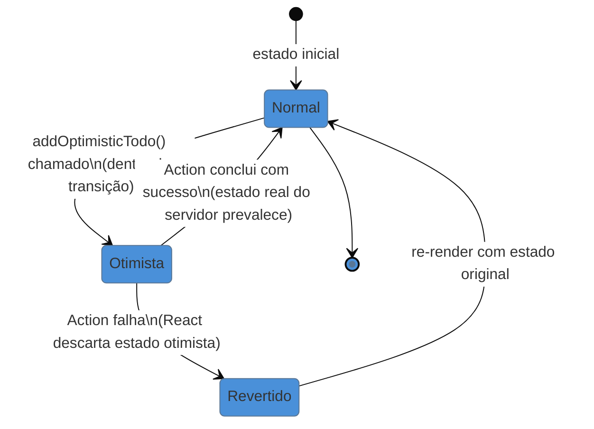

# Actions no React 19

> [!abstract] TL;DR
> React 19 introduz **Actions** — um modelo unificado para mutações assíncronas que elimina o boilerplate de `isLoading`/`isError`/`onSubmit`. O núcleo é `useActionState(action, initialState)`, que retorna `[state, formAction, isPending]` e encapsula o ciclo completo de uma operação: pendência, erro e resultado. `useFormStatus()` lê o estado do form pai em qualquer componente filho sem prop drilling. `useOptimistic()` exibe o estado esperado imediatamente enquanto a mutação ainda roda no servidor. Nos bastidores, tudo isso é açúcar sobre `useTransition` — qualquer função async passada a um `<form action={fn}>` já vira uma Action automaticamente.

---

## O problema: boilerplate em todo formulário

Você já escreveu isso. Ou algo muito parecido:

```tsx
function OldSchoolForm() {
  const [name, setName] = useState('')
  const [isLoading, setIsLoading] = useState(false)
  const [error, setError] = useState<string | null>(null)
  const [success, setSuccess] = useState(false)

  async function handleSubmit(e: React.FormEvent) {
    e.preventDefault()
    setIsLoading(true)
    setError(null)
    try {
      await updateProfile({ name })
      setSuccess(true)
    } catch (err) {
      setError('Falha ao salvar. Tente novamente.')
    } finally {
      setIsLoading(false)
    }
  }

  return (
    <form onSubmit={handleSubmit}>
      <input value={name} onChange={e => setName(e.target.value)} />
      {error && <p>{error}</p>}
      <button disabled={isLoading}>
        {isLoading ? 'Salvando...' : 'Salvar'}
      </button>
    </form>
  )
}
```

Quatro `useState`, um try/catch, um finally, um `e.preventDefault()`. E isso é um formulário simples — sem feedback otimista, sem validação assíncrona, sem estado derivado do resultado. Multiplique isso por cada formulário da aplicação e você tem um padrão que o React 19 decidiu resolver de vez.

O nome da solução é **Actions**.

---

## O que são Actions?

Uma Action é qualquer função assíncrona que pode ser passada diretamente como prop `action` de um `<form>`, ou invocada através de `useActionState`. O React gerencia o ciclo de vida dela automaticamente:

- Enquanto a Action está rodando, `isPending` é `true`.
- Quando termina (com sucesso ou erro), `isPending` volta a `false` e o estado é atualizado.
- Erros lançados dentro da Action são capturados automaticamente (não encerram o app) e ficam acessíveis no estado.

Sob o capô, isso é `useTransition`. A diferença é que você não precisa mais chamar `startTransition` manualmente — o `<form action={fn}>` faz isso por você. Qualquer função async dentro de uma transição passa a ser uma Action.

> [!question]- Por que isso passa pelo useTransition?
> `useTransition` marca um conjunto de atualizações de estado como "não-urgentes" — o React pode interrompê-las para processar entradas do usuário. Actions herdam esse comportamento: enquanto você espera a resposta do servidor, a UI continua responsiva. O `isPending` exposto é exatamente o `isPending` de `useTransition`.

---

## Fluxo de uma Action

```mermaid
%%{init: {"theme": "base", "themeVariables": {"primaryColor": "#4A90D9", "edgeLabelBackground": "#ffffff"}}}%%
sequenceDiagram
    participant U as Usuário
    participant F as <form>
    participant R as React (Transition)
    participant S as Servidor / API

    U->>F: submit
    F->>R: dispara Action (startTransition implícito)
    R-->>F: isPending = true
    R->>S: executa função async
    Note over R,S: useOptimistic atualiza UI imediatamente
    S-->>R: resposta (sucesso ou erro)
    R-->>F: isPending = false
    alt Sucesso
        R-->>F: state = resultado da Action
    else Erro
        R-->>F: state.error = mensagem capturada
        Note over R: reverte otimismo se houver
    end
```



---

## `useActionState` — o coração das Actions

`useActionState` é o hook central. Ele conecta uma função async a um estado gerenciado pelo React, expondo `isPending` sem você precisar de um `useState<boolean>` separado.

### Assinatura

```tsx
const [state, formAction, isPending] = useActionState(
  action,       // (previousState: S, formData: FormData) => Promise<S>
  initialState  // S — estado inicial, retornado antes da primeira chamada
)
```

A função `action` tem a mesma cara de um reducer: recebe o estado anterior e retorna o próximo estado. A diferença é que ela pode fazer efeitos — chamadas de API, mutações no banco, tudo vale.

> [!info] Por que a assinatura parece um reducer?
> Porque conceptualmente é um. A ordem dos argumentos `(previousState, payload)` é a mesma de `useReducer`. O payload aqui é um `FormData` (quando vem de um form HTML) ou qualquer dado que você passe manualmente. Isso também viabiliza **progressive enhancement**: o mesmo formulário funciona sem JavaScript, porque o `FormData` é nativo do browser.

### Exemplo completo: atualizar nome de perfil

```tsx
import { useActionState } from 'react'

// Tipagem do estado retornado pela action
interface ProfileState {
  name: string
  error?: string
  success?: boolean
}

// A action — pode ser async, pode lançar erros
async function updateProfileAction(
  prevState: ProfileState,
  formData: FormData
): Promise<ProfileState> {
  const name = formData.get('name') as string

  if (!name || name.trim().length < 2) {
    return { ...prevState, error: 'Nome precisa ter ao menos 2 caracteres.', success: false }
  }

  try {
    await updateProfile({ name: name.trim() })
    return { name: name.trim(), success: true, error: undefined }
  } catch {
    return { ...prevState, error: 'Falha ao salvar. Tente novamente.', success: false }
  }
}

export function ProfileForm({ currentName }: { currentName: string }) {
  const [state, formAction, isPending] = useActionState(updateProfileAction, {
    name: currentName,
  })

  return (
    <form action={formAction}>
      <input
        name="name"
        defaultValue={state.name}
        disabled={isPending}
      />

      {state.error && (
        <p role="alert" className="text-red-600">{state.error}</p>
      )}

      {state.success && (
        <p className="text-green-600">Nome atualizado com sucesso!</p>
      )}

      <button type="submit" disabled={isPending}>
        {isPending ? 'Salvando...' : 'Salvar'}
      </button>
    </form>
  )
}
```

Compare com o jeito antigo acima: saímos de 4 `useState` + try/catch/finally para **zero `useState`** — o estado vive inteiro no `useActionState`.

> [!question]- `defaultValue` em vez de `value` — por quê?
> Quando o formulário é controlado por `<form action={}>`, o React gerencia o reset do form após o submit. Usar `defaultValue` (formulário não-controlado) é idiomático aqui e evita conflitos com o ciclo de reset automático. Formulários controlados (com `value` + `onChange`) ainda funcionam, mas exigem mais cuidado para não sobrescrever o estado da Action.

---

## `useFormStatus` — ler o estado do form em componentes filhos

Imagine que o botão de submit é um componente separado, reutilizável em vários forms:

```tsx
// sem useFormStatus — você precisaria de prop drilling
function SubmitButton({ isLoading }: { isLoading: boolean }) {
  return <button disabled={isLoading}>{isLoading ? 'Enviando...' : 'Enviar'}</button>
}
```

Com `useFormStatus`, o componente sabe sozinho se o form pai está pendente:

```tsx
import { useFormStatus } from 'react-dom'

// Nenhuma prop necessária — lê o contexto do <form> pai
export function SubmitButton({ label = 'Salvar' }: { label?: string }) {
  const { pending } = useFormStatus()

  return (
    <button type="submit" disabled={pending} aria-busy={pending}>
      {pending ? 'Aguarde...' : label}
    </button>
  )
}
```

E você usa assim:

```tsx
<form action={formAction}>
  <input name="email" type="email" />
  <SubmitButton label="Inscrever" />
</form>
```

`useFormStatus` retorna um objeto com quatro campos:

| Campo | Tipo | Descrição |
|-------|------|-----------|
| `pending` | `boolean` | `true` enquanto o form está submetendo |
| `data` | `FormData \| null` | Os dados do form em trânsito |
| `method` | `string \| null` | O método HTTP (`'get'`, `'post'`) |
| `action` | `string \| function \| null` | A action atual do form |

Na prática, `pending` é o campo mais usado.

> [!warning] useFormStatus só funciona DENTRO do form — não no mesmo componente
> `useFormStatus()` precisa ser chamado em um **componente filho** do `<form>`, não no componente que renderiza o form. Se você chamar `useFormStatus` no mesmo componente que tem `<form action={...}>`, `pending` sempre será `false`. Extraia o botão para um componente filho.

---

## `useOptimistic` — feedback instantâneo enquanto a mutation roda

Imagine uma lista de tarefas. Quando o usuário adiciona uma, ele espera a API responder antes de ver a nova tarefa. Com `useOptimistic`, você mostra a tarefa imediatamente — e se o servidor falhar, o React reverte automaticamente.

```tsx
import { useOptimistic, useActionState } from 'react'

interface Todo {
  id: number | string  // string = temporário (optimistic), number = confirmado pelo servidor
  text: string
  isPending?: boolean
}

interface TodosState {
  todos: Todo[]
  error?: string
}

async function addTodoAction(prevState: TodosState, formData: FormData): Promise<TodosState> {
  const text = formData.get('text') as string
  try {
    const newTodo = await createTodo({ text }) // retorna { id: number, text: string }
    return { todos: [...prevState.todos, newTodo], error: undefined }
  } catch {
    return { ...prevState, error: 'Falha ao criar tarefa.' }
  }
}

export function TodoList({ initialTodos }: { initialTodos: Todo[] }) {
  const [state, formAction, isPending] = useActionState(addTodoAction, {
    todos: initialTodos,
  })

  // useOptimistic: exibe estado esperado durante a transição
  const [optimisticTodos, addOptimisticTodo] = useOptimistic(
    state.todos,
    // função de update: recebe lista atual + o novo item otimista
    (currentTodos: Todo[], newText: string) => [
      ...currentTodos,
      { id: `temp-${Date.now()}`, text: newText, isPending: true },
    ]
  )

  // Wrapper que dispara o otimismo ANTES de submeter
  async function handleAddTodo(formData: FormData) {
    const text = formData.get('text') as string
    addOptimisticTodo(text)        // UI atualiza imediatamente
    await formAction(formData)     // server confirma (ou reverte)
  }

  return (
    <div>
      <ul>
        {optimisticTodos.map(todo => (
          <li key={todo.id} style={{ opacity: todo.isPending ? 0.5 : 1 }}>
            {todo.text}
            {todo.isPending && ' (salvando...)'}
          </li>
        ))}
      </ul>

      {state.error && <p role="alert">{state.error}</p>}

      <form action={handleAddTodo}>
        <input name="text" placeholder="Nova tarefa" required />
        <SubmitButton label="Adicionar" />
      </form>
    </div>
  )
}
```

### Como `useOptimistic` funciona por dentro



O segredo é que `useOptimistic` mantém dois mundos em paralelo: o **estado real** (confirmado pelo servidor) e o **estado otimista** (o que você acha que vai acontecer). Enquanto a transição está pendente, ele exibe o otimista. Quando termina — seja com sucesso ou erro — o estado real prevalece.

> [!question]- E se o servidor retornar dados diferentes do que eu esperava?
> Esse é o principal risco do otimismo. Se você adicionar uma tarefa e o servidor retornar um ID diferente (ou modificar o texto, ou adicionar campos), você precisa que a `action` do `useActionState` reconcilie o estado real corretamente. O estado otimista é sempre temporário — ele é substituído pelo retorno da action. Portanto, **a action precisa retornar o estado definitivo completo**, não apenas um diff.

---

## Server Actions — o mesmo modelo, executado no servidor

> [!info] Contexto: Server Components (RSC)
> Server Actions funcionam dentro do ecossistema React Server Components. Para o contexto completo de RSC, consulte a nota 23 (futura). Aqui cobrimos apenas a interface das Actions no cliente.

Quando você usa um framework como Next.js com RSC habilitado, pode marcar uma função com `'use server'` para executá-la no servidor:

```tsx
// app/actions.ts
'use server'  // diretiva: esta função roda no servidor

import { db } from '@/lib/db'
import { revalidatePath } from 'next/cache'

export async function updateNameAction(
  prevState: { name: string; error?: string },
  formData: FormData
): Promise<{ name: string; error?: string }> {
  const name = formData.get('name') as string

  if (!name || name.length < 2) {
    return { name: prevState.name, error: 'Nome inválido.' }
  }

  await db.user.update({ where: { id: 'current' }, data: { name } })
  revalidatePath('/profile')  // invalida o cache do Next.js

  return { name, error: undefined }
}
```

```tsx
// app/profile/ProfileForm.tsx — componente cliente
'use client'

import { useActionState } from 'react'
import { updateNameAction } from '../actions'

export function ProfileForm({ currentName }: { currentName: string }) {
  const [state, formAction, isPending] = useActionState(updateNameAction, {
    name: currentName,
  })

  return (
    <form action={formAction}>
      <input name="name" defaultValue={state.name} />
      {state.error && <p>{state.error}</p>}
      <button disabled={isPending}>
        {isPending ? 'Salvando...' : 'Salvar'}
      </button>
    </form>
  )
}
```

A interface para o componente cliente é **idêntica** — `useActionState` não sabe se a action roda no cliente ou servidor. Isso é intencional: você pode migrar de uma chamada de API local para uma Server Action sem mudar nada no componente.

---

## Comparativo: jeito antigo vs. Actions

| Aspecto | Antes (React 18) | Depois (React 19 Actions) |
|---------|-----------------|--------------------------|
| Estado de loading | `useState<boolean>` manual | `isPending` do `useActionState` |
| Captura de erro | `try/catch` + `useState<string>` | Retorno tipado da action (ou `error` boundary) |
| Feedback ao usuário | `setIsLoading`, `setError`, `setSuccess` | Um único `state` retornado pela action |
| Botão de submit | Recebe `isLoading` por prop | `useFormStatus()` — zero prop drilling |
| UI otimista | Lógica manual + rollback manual | `useOptimistic()` com rollback automático |
| `e.preventDefault()` | Obrigatório | Não necessário — o form action cuida |
| Progressive enhancement | Não disponível | `<form action={fn}>` funciona sem JS |

---

## Padrão completo: validação + erro + otimismo

Este é o padrão de referência para um formulário de produção com Actions:

```tsx
import { useActionState, useOptimistic } from 'react'
import { useFormStatus } from 'react-dom'

// ── Tipos ────────────────────────────────────────────────────────────────────
interface Comment {
  id: string
  text: string
  author: string
  isPending?: boolean
}

interface CommentState {
  comments: Comment[]
  error?: string
}

// ── Server Action (ou client action) ────────────────────────────────────────
async function postCommentAction(
  prevState: CommentState,
  formData: FormData
): Promise<CommentState> {
  const text = formData.get('text') as string
  const author = formData.get('author') as string

  // Validação síncrona — retorna erro sem chamar a API
  if (!text?.trim()) return { ...prevState, error: 'Comentário não pode ser vazio.' }
  if (!author?.trim()) return { ...prevState, error: 'Autor é obrigatório.' }

  try {
    const saved = await api.comments.create({ text: text.trim(), author: author.trim() })
    return {
      comments: [...prevState.comments, saved],
      error: undefined,
    }
  } catch {
    return { ...prevState, error: 'Erro ao publicar. Tente novamente.' }
  }
}

// ── Componente de botão reutilizável ─────────────────────────────────────────
function SubmitButton() {
  const { pending } = useFormStatus()
  return (
    <button type="submit" disabled={pending}>
      {pending ? 'Publicando...' : 'Publicar comentário'}
    </button>
  )
}

// ── Componente principal ─────────────────────────────────────────────────────
export function CommentSection({ initialComments }: { initialComments: Comment[] }) {
  const [state, formAction] = useActionState(postCommentAction, {
    comments: initialComments,
  })

  const [optimisticComments, addOptimisticComment] = useOptimistic(
    state.comments,
    (current: Comment[], newComment: Pick<Comment, 'text' | 'author'>) => [
      ...current,
      { id: `temp-${Date.now()}`, ...newComment, isPending: true },
    ]
  )

  async function handlePost(formData: FormData) {
    const text = formData.get('text') as string
    const author = formData.get('author') as string
    // Só dispara otimismo se os dados parecem válidos
    if (text?.trim() && author?.trim()) {
      addOptimisticComment({ text: text.trim(), author: author.trim() })
    }
    await formAction(formData)
  }

  return (
    <section>
      <ul>
        {optimisticComments.map(c => (
          <li key={c.id} style={{ opacity: c.isPending ? 0.6 : 1 }}>
            <strong>{c.author}:</strong> {c.text}
            {c.isPending && ' (publicando...)'}
          </li>
        ))}
      </ul>

      <form action={handlePost}>
        <input name="author" placeholder="Seu nome" required />
        <textarea name="text" placeholder="Seu comentário" required />
        {state.error && <p role="alert" className="error">{state.error}</p>}
        <SubmitButton />
      </form>
    </section>
  )
}
```

---

## Armadilhas comuns

> [!warning] `useFormStatus` chamado no mesmo componente do `<form>`
> **O que acontece:** `pending` é sempre `false`, o botão nunca fica desabilitado durante o submit. **Por quê:** `useFormStatus` lê o status do form ascendente na árvore. No componente que renderiza o próprio `<form>`, não há form pai — então retorna o estado padrão (`pending: false`). **Como evitar:** Mova o botão (ou qualquer elemento que use `useFormStatus`) para um componente filho separado, renderizado dentro do `<form>`.

> [!warning] `useOptimistic` sem reconciliar com o estado real do servidor
> **O que acontece:** A UI mostra o estado otimista permanentemente (ou mostra dados errados), porque o estado real retornado pela action não inclui os campos que o servidor adicionou (como `id`, `createdAt`, `slug`). **Por quê:** Quando a action termina, o estado retornado por ela substitui o otimista. Se o retorno da action não incluir todos os campos necessários, o item aparece incompleto ou some da lista. **Como evitar:** A action deve retornar o estado **completo e definitivo** — incluindo os campos gerados pelo servidor. Nunca retorne apenas um diff.

> [!warning] Esquecer tratamento de erro dentro da action
> **O que acontece:** Se a função async lançar uma exceção não capturada, o React propaga o erro para o Error Boundary mais próximo. A UI pode quebrar completamente e o `isPending` fica `true` para sempre. **Por quê:** Diferente de um `onSubmit` convencional, não há try/catch implícito em volta da action. O React captura erros de rendering, mas não de async functions em Actions da mesma forma. **Como evitar:** Sempre envolva o corpo da action em `try/catch`. Retorne o estado com `error` no caso de falha — não relance erros, a menos que queira que o Error Boundary os capture intencionalmente.

> [!warning] Disparar `addOptimisticTodo` fora de uma transição
> **O que acontece:** A atualização otimista reverte antes da action terminar, causando um "piscar" na UI. **Por quê:** `useOptimistic` exige estar dentro de uma transição ativa. Fora dela, o React trata a atualização como definitiva e a reverte imediatamente quando percebe que não há transição pendente. **Como evitar:** Chame `addOptimisticTodo` dentro da mesma função async que chama `formAction` — ou use `startTransition` explicitamente. Quando você usa `<form action={handleFn}>`, a transição já está ativa durante a execução de `handleFn`.

---

## Como explicar em inglês

React 19 Actions eliminate the boilerplate that used to come with every async form — no more manual loading states, no more try/catch wired to `useState`. You pass an async function as the form's action, and React handles `isPending`, error surfacing, and optimistic updates through three hooks: `useActionState` for the full action lifecycle, `useFormStatus` for child components that need to know when their parent form is busy, and `useOptimistic` for showing expected state before the server confirms.

The mental model is similar to a reducer: your action receives the previous state and returns the next state, but it can do async side effects along the way.

| PT | EN |
|----|-----|
| Ação (React) | Action |
| Estado pendente | Pending state |
| Atualização otimista | Optimistic update |
| Reconciliar com o servidor | Reconcile with the server |
| Reverter (estado otimista) | Roll back (optimistic state) |
| Formulário com melhoria progressiva | Progressively enhanced form |
| Diretiva de servidor | Server directive (`'use server'`) |
| Transição assíncrona | Async transition |

---

## O que vem a seguir

Você acabou de ver como React 19 trata mutações assíncronas no cliente. O próximo passo natural é entender o ambiente em que Server Actions vivem: os **React Server Components**, que permitem que partes da árvore renderizem exclusivamente no servidor — e mudam fundamentalmente onde você coloca lógica, acessa dados e distribui JavaScript.

- Concurrent Features (`[[20 - Concurrent features]]`) — suspense, transitions e o scheduler que tornam tudo isso possível; esta nota é a camada de application sobre aquela fundação
- Server Components (`[[23 - Server Components (RSC)]]`) — o contexto completo de onde Server Actions executam
- `[[06 - Eventos e formulários controlados]]` — a base de formulários controlados que Actions substituem em muitos casos
- `[[03-Dominios/Tecnologia/React/Dicionário de React|Dicionário de React]]` — glossário de termos do ecossistema React

> [!info] Notas 20 e 23 ainda não foram escritas nesta trilha.

---

## Actions em uma frase

**Actions no React 19** encapsulam o ciclo de vida completo de uma mutação assíncrona — pending, error, optimistic — em `useActionState`, eliminando o boilerplate de `isLoading`/`isError` que antes aparecia em cada formulário da aplicação.

---

## Referências

- **React Team** — [*React v19 Release Notes*](https://react.dev/blog/2024/12/05/react-19) — anúncio oficial com a spec completa de Actions, useActionState, useFormStatus e useOptimistic
- **React Docs** — [*useActionState reference*](https://react.dev/reference/react/useActionState) — documentação canônica com assinatura, parâmetros e exemplos
- **React Docs** — [*useFormStatus reference*](https://react.dev/reference/react-dom/hooks/useFormStatus) — limitações e casos de uso corretos do hook
- **React Docs** — [*useOptimistic reference*](https://react.dev/reference/react/useOptimistic) — semântica de rollback e integração com transições
- **LogRocket** — [*React useActionState: A practical guide*](https://blog.logrocket.com/react-useactionstate/) — exemplos TypeScript com análise de casos edge
- **freeCodeCamp** — [*React 19 Actions – How to Simplify Form Submission*](https://www.freecodecamp.org/news/react-19-actions-simpliy-form-submission-and-loading-states/) — comparativo antes/depois com código real
- **Callstack** — [*Developer Guide to React 19: Async Handling*](https://www.callstack.com/blog/the-complete-developer-guide-to-react-19-part-1-async-handling) — visão arquitetural do modelo de Actions
- **Rohit Kuwar** — [*Deep Dive into React 19's Latest Hooks*](https://medium.com/@rohitkuwar/deep-dive-into-react-19s-latest-hooks-use-useactionstate-useoptimistic-and-useformstatus-849395af9c11) — análise prática publicada em fevereiro de 2026
- **xjavascript.com** — [*Mastering useActionState in TypeScript*](https://www.xjavascript.com/blog/useactionstate-typescript/) — tipagem avançada e padrões TS-first
