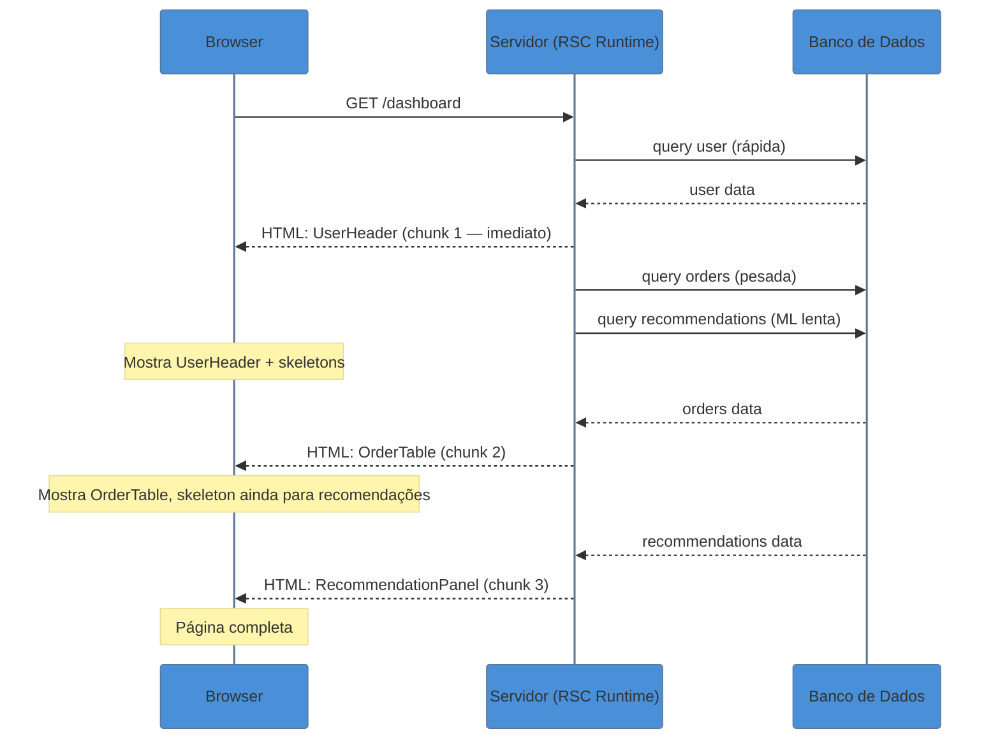
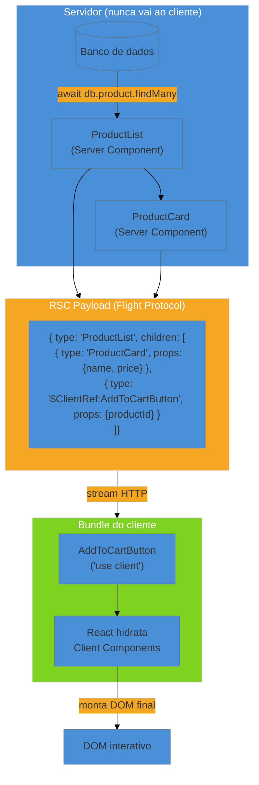
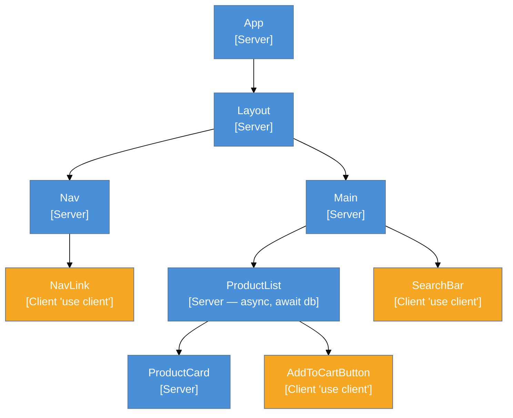

> [!abstract] TL;DR
> React Server Components (RSC) são componentes que executam **exclusivamente no servidor** e nunca chegam ao bundle do cliente — nem como código, nem como lógica. Eles resolvem dois problemas históricos do React: bundle gigante (todo JS vai ao cliente, incluindo dependências pesadas) e fetch em waterfall (cada componente esperava o pai para começar a buscar dados). RSC permite `async/await` direto no corpo do componente, acesso a banco de dados e sistema de arquivos, e zero bytes de lógica de servidor no cliente. O trade-off honesto: RSC é um modelo da biblioteca React, mas a infraestrutura (router, bundler, runtime, cache) é do framework — hoje principalmente Next.js. Sem framework, RSC não roda.

---

Imagine que sua aplicação React tem uma página de dashboard: cabeçalho com dados do usuário, uma tabela de pedidos com 500 linhas, um gráfico que precisa de uma biblioteca de 80 KB, e um botão "Filtrar" que é interativo. Antes do RSC, você tinha duas opções ruins:

1. **Renderizar tudo no servidor (SSR clássico):** o HTML chega rápido, mas todo o JavaScript — inclusive a biblioteca de gráfico de 80 KB — vai ao cliente para hidratação. O bundle cresce.

2. **Renderizar no cliente (SPA):** o bundle vai inteiro, o usuário vê uma tela em branco até o JS executar, e ainda há um waterfall de fetch: o componente pai busca dados, renderiza, o filho começa a buscar, e assim por diante.

React Server Components cortam esse nó górdio: a tabela de pedidos, o gráfico e o cabeçalho com dados estáticos ficam no servidor. Apenas o botão "Filtrar" vai ao cliente. A biblioteca de 80 KB nunca cruza a rede.

---

## O modelo mental: cozinha e salão

Pense num restaurante de alto padrão. A **cozinha** (servidor) é onde o trabalho pesado acontece: ingredientes brutos, facas, fogo, receitas complexas. O **salão** (cliente) é onde o prato chega pronto para o cliente interagir — cortar, temperar, comer.

Server Components são a cozinha. Eles recebem os ingredientes (dados do banco), processam (lógica de negócio, formatação), e entregam um **prato pronto** para o salão. O cliente nunca vê a receita, os ingredientes brutos, ou as facas. Só vê o resultado.

Client Components são o prato no salão: o cliente interage, pede mais sal (estado), chama o garçom (evento). Mas a cozinha já fez o trabalho pesado.

A **fronteira** entre os dois é o `'use client'` — a porta entre a cozinha e o salão.

---

## O que são Server Components, de verdade

Um Server Component é qualquer componente React que **não** tem a diretiva `'use client'` no topo do arquivo, **em um ambiente RSC**. Isso é importante: no React puro sem framework, não existe RSC. A distinção server/client só existe quando um bundler + runtime RSC-aware está presente (Next.js App Router, React Router v7, Remix, Waku, etc.).

Server Components têm três características definidoras:

**1. Executam no servidor, uma única vez.** Não há re-render de Server Component. Ele roda uma vez (por request ou por build), produz output, e para. Não há `useState`, não há `useEffect`, não há ciclo de vida de re-render.

**2. Nunca vão ao bundle do cliente.** O código do Server Component — inclusive as dependências que ele importa — não é enviado ao navegador. Se você importar uma biblioteca de parsing de Markdown de 200 KB num Server Component, zero bytes dela vão ao cliente.

**3. Podem ser assíncronos nativamente.** `async function Page()` é válido num Server Component. Você pode dar `await` em qualquer Promise diretamente no corpo do componente — banco de dados, sistema de arquivos, API interna.

```tsx
// Server Component — nenhuma diretiva, nenhum import de hooks de estado
// Este arquivo NUNCA vai ao bundle do cliente

import { db } from '@/lib/db'
import { ProductCard } from './ProductCard'    // também Server Component
import { AddToCartButton } from './AddToCartButton' // Client Component

interface Props {
  categoryId: string
}

export async function ProductList({ categoryId }: Props) {
  // await direto — sem useEffect, sem useState, sem loading state manual
  const products = await db.product.findMany({
    where: { categoryId },
    orderBy: { createdAt: 'desc' },
  })

  return (
    <ul>
      {products.map((product) => (
        <li key={product.id}>
          {/* Server Component renderiza os dados */}
          <ProductCard product={product} />
          {/* Client Component cuida da interatividade */}
          <AddToCartButton productId={product.id} />
        </li>
      ))}
    </ul>
  )
}
```

---

## A fronteira: `'use client'`

A diretiva `'use client'` **não significa "este componente roda no cliente"** no sentido de "só no cliente". Significa: **"aqui começa o grafo de módulos do cliente"**. É uma declaração de fronteira no módulo graph, não na árvore de componentes.

Quando você marca um arquivo com `'use client'`:

- Esse arquivo entra no bundle do cliente.
- Tudo que ele **importa** também entra no bundle do cliente — recursivamente, mesmo que esses módulos não tenham `'use client'`.
- O componente pode usar `useState`, `useEffect`, event handlers, browser APIs.

```tsx
'use client'

import { useState } from 'react'

interface Props {
  productId: string
}

// Este componente VAI ao bundle do cliente
// Pode usar hooks, eventos, browser APIs
export function AddToCartButton({ productId }: Props) {
  const [added, setAdded] = useState(false)

  return (
    <button
      onClick={async () => {
        await fetch(`/api/cart`, {
          method: 'POST',
          body: JSON.stringify({ productId }),
        })
        setAdded(true)
      }}
    >
      {added ? 'Adicionado!' : 'Adicionar ao carrinho'}
    </button>
  )
}
```

> [!question]- Por que `'use client'` marca a fronteira do grafo, e não do componente?
> Porque o bundler precisa saber, em tempo de build, quais módulos vão para o bundle do cliente. Ele não consegue fazer essa decisão dinamicamente por componente — precisa rastrear o grafo de importações. Quando você marca um arquivo, o bundler para de seguir as importações desse arquivo em direção ao servidor e começa a incluí-las no bundle do cliente.

---

## `'use server'`: não é para Server Components

Aqui mora uma confusão clássica: `'use server'` **não é a diretiva de Server Components**. Server Components não precisam de diretiva — eles são o padrão em ambientes RSC.

`'use server'` marca **Server Functions** (também chamadas de Server Actions): funções assíncronas que rodam no servidor mas podem ser **chamadas a partir de Client Components**, tanto em formulários quanto em event handlers.

```tsx
// actions.ts
'use server'

// Esta é uma Server Function — não um componente
// Roda no servidor quando chamada do cliente
export async function addToCart(productId: string) {
  await db.cartItem.create({ data: { productId } })
  revalidatePath('/cart') // Next.js — revalida o cache
}
```

```tsx
'use client'

import { addToCart } from './actions'

export function AddToCartButton({ productId }: { productId: string }) {
  return (
    <button onClick={() => addToCart(productId)}>
      Adicionar ao carrinho
    </button>
  )
}
```

Para entender o comportamento completo de Actions e `'use server'`, veja [[22 - Actions no React 19]].

---

## O que um Server Component pode e não pode fazer

### Pode

| Capacidade | Por quê funciona |
|---|---|
| `async/await` direto no corpo | Executa no servidor; não há runtime de browser que restrinja Promises no render |
| Acessar banco de dados direto | Código roda no servidor; credenciais nunca chegam ao cliente |
| Ler sistema de arquivos (`fs`) | Mesmo motivo — ambiente Node.js/Deno no servidor |
| Importar dependências pesadas | A biblioteca fica no servidor; zero bytes no bundle do cliente |
| Receber props de qualquer tipo | Props vêm de outro Server Component; não cruzam a fronteira de serialização |
| Renderizar Client Components | Passa props serializáveis; os children são renderizados pelo cliente |
| Renderizar outros Server Components | Composição normal no servidor |
| Passar Promises a Client Components | Promise é serializada; cliente usa `use()` para resolver |

### Não pode

| Restrição | Por quê não funciona |
|---|---|
| `useState`, `useReducer`, hooks de estado | State pressupõe re-render; RSC não re-renderiza |
| `useEffect`, `useLayoutEffect` | Efeitos existem para sincronizar com o DOM/browser; não há DOM no servidor |
| Event handlers (`onClick`, `onChange`, ...) | Eventos são browser APIs; não existem no servidor |
| Browser APIs (`window`, `document`, `localStorage`) | Não existem no ambiente de execução do servidor |
| Context API (como consumidor) | Context requer estado reativo — incompatível com o modelo imutável do RSC |
| Importar módulos que contêm `'use client'` (diretamente) | Pode importar; mas o que é marcado como client vai ao bundle cliente normalmente |

> [!question]- E se eu precisar de estado em parte de uma página RSC?
> Você extrai a parte interativa em um Client Component. A regra de ouro: deixe o Server Component o mais "embaixo" possível na árvore (para buscar e transformar dados), e empurre o `'use client'` o mais para as folhas — apenas onde a interatividade é necessária.

---

## Composição: como Server e Client convivem

A composição Server + Client tem uma regra que parece contraintuitiva à primeira vista:

**Client Components não podem importar Server Components** (mas podem recebê-los como `children`).

Por quê? Porque quando um Client Component importa algo, esse módulo entra no bundle do cliente. Server Components não podem ser executados no cliente — portanto, você não pode importá-los de dentro de um arquivo `'use client'`.

Mas você pode **passar Server Components como `children`**. O truque está em **quem renderiza quem**:

```tsx
// layout.tsx — Server Component
// Importa o Provider (Client) e passa children (Server)
import { ThemeProvider } from './ThemeProvider'  // Client Component
import { Dashboard } from './Dashboard'          // Server Component

export default function Layout() {
  return (
    <ThemeProvider>
      {/* Dashboard é um Server Component passado como children */}
      {/* O Server Component pai (Layout) o renderiza; */}
      {/* o Client Component (ThemeProvider) só o recebe como prop */}
      <Dashboard />
    </ThemeProvider>
  )
}
```

```tsx
// ThemeProvider.tsx
'use client'

import { createContext, useState } from 'react'

export function ThemeProvider({ children }: { children: React.ReactNode }) {
  const [theme, setTheme] = useState<'light' | 'dark'>('light')
  // children pode ser um Server Component — ThemeProvider não o importa,
  // só recebe como prop. Não vira bundle do cliente.
  return (
    <ThemeContext.Provider value={{ theme, setTheme }}>
      {children}
    </ThemeContext.Provider>
  )
}
```

A chave: `ThemeProvider` não **importa** `Dashboard` — apenas recebe como `children`. Quem decide renderizar `Dashboard` é o Server Component `Layout`. Assim, `Dashboard` nunca entra no bundle do cliente.

---

## Props serializáveis: a regra da fronteira

Quando um Server Component passa props a um Client Component, esses dados **cruzam a fronteira server-client**. Para isso, precisam ser serializáveis — convertíveis em JSON + algumas extensões do RSC payload:

| Tipo | Pode passar? |
|---|---|
| `string`, `number`, `boolean`, `null` | Sim |
| Objetos planos (`{ id: 1, name: "..." }`) | Sim |
| Arrays | Sim |
| `Date` | Sim (serializado como string ISO) |
| `Promise` | Sim — o cliente recebe uma Promise e resolve com `use()` |
| `React.ReactNode` / JSX | Sim — como `children` |
| Funções | **Não** — funções não são serializáveis |
| Instâncias de classe | **Não** |
| Referências a módulos | Não diretamente |

```tsx
// Server Component
async function UserCard({ userId }: { userId: string }) {
  const user = await db.user.findUnique({ where: { id: userId } })

  return (
    <EditUserForm
      // OK: objeto plano serializável
      initialData={{ name: user.name, email: user.email }}
      // ERRO: não pode passar função como prop de Server→Client
      // onSave={handleSave} ← isso quebraria
    />
  )
}
```

Para passar ações ao Client Component, use Server Functions (Actions) — veja [[22 - Actions no React 19]].

---

## Streaming: RSC + Suspense

Uma das vantagens mais poderosas de RSC é o **streaming progressivo**. Em vez de esperar todos os dados do servidor para enviar qualquer coisa ao cliente, o React pode enviar partes da UI à medida que ficam prontas.

Isso é viabilizado pela integração entre RSC e `Suspense`:

```tsx
// page.tsx — Server Component
import { Suspense } from 'react'
import { UserHeader } from './UserHeader'          // dados rápidos
import { OrderTable } from './OrderTable'          // query pesada
import { RecommendationPanel } from './RecommendationPanel' // ML lento

export default async function DashboardPage() {
  // UserHeader: await rápido — dados do usuário já em cache
  const user = await getUser()

  return (
    <main>
      <UserHeader user={user} />

      {/* OrderTable e RecommendationPanel podem demorar mais */}
      {/* Suspense define o fallback enquanto o servidor ainda processa */}
      <Suspense fallback={<TableSkeleton />}>
        <OrderTable userId={user.id} />
      </Suspense>

      <Suspense fallback={<PanelSkeleton />}>
        <RecommendationPanel userId={user.id} />
      </Suspense>
    </main>
  )
}
```

O servidor envia o HTML de `UserHeader` imediatamente. `OrderTable` e `RecommendationPanel` chegam assim que os respectivos awaits resolvem — sem bloquear o restante da página.

Para um mergulho profundo em Suspense e data fetching, veja [[19 - Suspense e data fetching no cliente]].



---

## O RSC Payload: o que realmente trafega

RSC não envia HTML puro nem JavaScript do componente. Ele envia um formato intermediário chamado **RSC Payload** (protocolo React Flight):

- Uma representação serializada da árvore de componentes renderizada
- Referências a Client Components que devem ser hidratados
- Props passadas de Server Components a Client Components
- Promises que o cliente pode resolver com `use()`

O cliente reconstrói a árvore a partir desse payload, sem precisar do código dos Server Components. Isso é o que possibilita atualizações parciais da página sem recarregar o HTML inteiro.



---

## A fronteira server/client na árvore de componentes

Veja como a divisão server/client se manifesta numa árvore de componentes real:



Os nós em azul executam no servidor. Os em âmbar vão ao bundle do cliente. A maioria da árvore fica no servidor — apenas as folhas interativas cruzam a fronteira.

---

## Honestidade: RSC precisa de framework

Este ponto merece repetição porque é fácil de esquecer: **React Server Components são um modelo da biblioteca React, mas não funcionam sem infraestrutura de framework**.

React 19 estabilizou as APIs de RSC (`react-server`, `react-server-dom-webpack`, etc.), mas essas APIs são de uso do **framework**, não do desenvolvedor. O framework é responsável por:

- Identificar quais componentes são Server e quais são Client em build time
- Gerar o bundle do cliente separado dos Server Components
- Configurar o runtime do servidor para executar RSC
- Implementar o roteamento (request → componente → RSC payload)
- Gerenciar cache, revalidação e streaming

Hoje (meados de 2026), os frameworks maduros com suporte RSC são:
- **Next.js 13.4+** (App Router) — implementação de referência, mais completa
- **React Router v7 / Remix** — suporte RSC em maturação
- **Waku** — framework minimalista focado em RSC puro

Tudo sobre App Router, caching, revalidação com RSC, e deploy fica no **galho Next.js** (futuro). Esta nota cobre o **modelo React** — o contrato da biblioteca.

---

## Casos práticos

### Cenário 1: Dashboard com dados pesados e sem waterfall

Antes do RSC, um dashboard típico em SPA usava `useEffect` em cascata:

```tsx
// ❌ Padrão pre-RSC: waterfall de fetch
function Dashboard() {
  const [user, setUser] = useState(null)
  const [orders, setOrders] = useState([])

  useEffect(() => {
    fetchUser().then((u) => {
      setUser(u)
      // Só busca orders DEPOIS de ter o user — waterfall!
      fetchOrders(u.id).then(setOrders)
    })
  }, [])

  if (!user) return <Spinner />
  return <OrderTable orders={orders} />
}
```

Com RSC, os fetches são paralelos e sem overhead de estado:

```tsx
// ✅ RSC: paralelo, sem waterfall, sem useEffect
export default async function DashboardPage() {
  // Promise.all — paralelo no servidor
  const [user, orders] = await Promise.all([
    db.user.findFirst(),
    db.order.findMany({ take: 50 }),
  ])

  return <OrderTable user={user} orders={orders} />
}
```

### Cenário 2: Biblioteca pesada no servidor, zero no cliente

```tsx
// markdownPage.tsx — Server Component
import { unified } from 'unified'       // 50 KB
import remarkParse from 'remark-parse'  // 30 KB
import remarkHtml from 'remark-html'    // 15 KB

// 95 KB de dependências que NUNCA vão ao bundle do cliente
export async function MarkdownPage({ slug }: { slug: string }) {
  const raw = await fs.readFile(`./content/${slug}.md`, 'utf-8')

  const result = await unified()
    .use(remarkParse)
    .use(remarkHtml)
    .process(raw)

  return <article dangerouslySetInnerHTML={{ __html: String(result) }} />
}
```

### Cenário 3: Passando Promise ao cliente com `use()`

O servidor inicia uma Promise de baixa prioridade e passa ao cliente, que a resolve com `use()`:

```tsx
// Server Component — inicia promise sem await
export async function PostPage({ postId }: { postId: string }) {
  const post = await db.post.findUnique({ where: { id: postId } }) // crítico: await
  const commentsPromise = db.comment.findMany({ where: { postId } }) // não crítico: sem await

  return (
    <article>
      <PostBody post={post} />
      <Suspense fallback={<p>Carregando comentários...</p>}>
        {/* Passa Promise ao Client Component */}
        <CommentsList commentsPromise={commentsPromise} />
      </Suspense>
    </article>
  )
}
```

```tsx
// CommentsList.tsx — Client Component
'use client'

import { use } from 'react'

interface Props {
  commentsPromise: Promise<Comment[]>
}

export function CommentsList({ commentsPromise }: Props) {
  // use() suspende este componente até a Promise resolver
  const comments = use(commentsPromise)

  return (
    <ul>
      {comments.map((c) => <li key={c.id}>{c.body}</li>)}
    </ul>
  )
}
```

Para mais sobre o hook `use()`, veja [[21 - O hook use()]].

---

## Trade-offs sênior

**Bundle menor vs. HTML maior.** Server Components eliminam código JS do cliente, mas o RSC payload e o HTML pré-renderizado aumentam o payload inicial. Para páginas com muito conteúdo estático, a troca é favorável — menos JS pesa mais no Time to Interactive do que HTML extra. Meça antes de assumir.

**Latência de servidor vs. latência de rede.** Se o servidor tem cold start alto (serverless), a vantagem de buscar dados "perto do servidor" pode ser anulada. Serverless + RSC com queries pesadas sem cache pode ser pior que uma SPA com CDN.

**Debugging mais complexo.** Erros em Server Components aparecem no log do servidor, não no console do browser. Rastrear a cadeia server → RSC payload → client requer tooling adequado. Next.js tem suporte razoável, mas o DX é mais fragmentado que SPA pura.

**Mental model shift para o time.** A distinção server/client no nível de arquivo — e não de componente — exige que o time entenda o grafo de módulos. Júniors tendem a colocar `'use client'` em tudo (o que derrota o propósito) ou a tentar usar hooks em Server Components (erro de runtime).

**Re-render não existe no servidor.** State global que precisaria "reatividade no servidor" (ex: tema, autenticação em tempo real) continua no cliente. RSC não substitui Client Components — complementa.

**Lock-in de framework.** Hoje RSC é sinônimo de Next.js na prática. Migrar de Next.js para outro runtime RSC no futuro pode exigir reescrita de infraestrutura (cache, Actions). Invista sabendo disso.

---

## Armadilhas comuns

> [!warning] Colocar `'use client'` em tudo porque "é mais seguro"
> **O que acontece:** Todo o potencial de RSC é anulado. Dependências pesadas voltam ao bundle, fetches voltam ao cliente, waterfall volta. **Por quê:** `'use client'` não é apenas "modo cliente" — é uma declaração que puxa tudo que o arquivo importa para o bundle do cliente. **Como evitar:** Só adicione `'use client'` quando o componente precisar de estado (`useState`), efeitos (`useEffect`), event handlers, ou browser APIs. Tudo mais permanece Server Component por padrão.

> [!warning] Passar função como prop de Server Component para Client Component
> **O que acontece:** Erro em runtime — "Functions are not valid as a React child" ou erro de serialização. **Por quê:** Props que cruzam a fronteira server-client precisam ser serializáveis. Funções não são serializáveis — elas são closures que capturam referências do ambiente de execução do servidor. **Como evitar:** Para passar lógica ao cliente, use Server Functions (Actions) com `'use server'`. Para callbacks, implemente a lógica no próprio Client Component.

> [!warning] Usar `useState` ou `useEffect` diretamente em um Server Component
> **O que acontece:** Erro de runtime — "useState is not defined" ou "You're importing a component that needs useState". **Por quê:** `useState` e outros hooks de estado e efeito existem no runtime do cliente. Server Components executam num ambiente sem esses hooks. **Como evitar:** Se o componente precisar de estado, extraia a parte com estado para um Client Component separado. O Server Component passa dados como props.

> [!warning] Importar Server Component de dentro de Client Component
> **O que acontece:** O Server Component é silenciosamente tratado como Client Component (ou o bundler lança erro). **Por quê:** Tudo importado por um Client Component entra no bundle do cliente. Server Components não têm runtime no cliente. **Como evitar:** Passe Server Components como `children` ou outras props — deixe o Server Component pai renderizá-los e passá-los "descidos" ao Client Component.

---

## Como explicar em inglês

React Server Components are React components that run exclusively on the server and never ship to the client bundle. They're async by nature — you can `await` database queries directly in the component body without `useEffect` or loading states. The `'use client'` directive marks the module boundary where server code ends and client code begins, not the component itself. Think of it as splitting your component tree into the kitchen — where the heavy lifting happens — and the dining room, where users interact with the result.

In an interview, you might say: "RSC lets me co-locate data fetching with the UI that displays it, without shipping the fetching logic to the browser. The trade-off is framework lock-in — RSC is a React primitive, but the infrastructure is always provided by a framework like Next.js."

| PT | EN |
|---|---|
| Componente de Servidor | Server Component |
| Componente de Cliente | Client Component |
| Fronteira de cliente | Client boundary |
| Diretiva | Directive |
| Payload RSC / protocolo Flight | RSC payload / React Flight protocol |
| Bundle do cliente | Client bundle |
| Hidratação | Hydration |
| Função de servidor / Ação | Server Function / Server Action |
| Props serializáveis | Serializable props |
| Grafo de módulos | Module graph |
| Streaming | Streaming |
| Sem JavaScript no cliente | Zero JS to the client |

---

## O que vem a seguir

Agora que você entende o modelo RSC — o contrato React — o próximo passo natural é entender como a infraestrutura do framework materializa esse contrato. Server Components + Actions formam o núcleo do full-stack com React:

- [[22 - Actions no React 19]] — `'use server'` para Server Functions e Actions: o mecanismo pelo qual o cliente chama código do servidor sem construir uma API REST manualmente
- [[21 - O hook use()]] — `use()` para consumir Promises passadas de Server Components ao cliente, integrando-se naturalmente com Suspense
- [[19 - Suspense e data fetching no cliente]] — como Suspense e streaming se combinam com RSC para entregar UI progressiva

Para tudo relacionado à infraestrutura — App Router, caching com `revalidatePath`/`revalidateTag`, `generateStaticParams`, deploy e Server Actions no Next.js — consulte o **galho Next.js** (futuro).

---

## RSC em uma frase

> Server Components são a cozinha do React: o trabalho pesado fica no servidor, e o cliente recebe apenas o prato pronto — sem a receita, sem os ingredientes, sem o fogo.

---

## Referências

- **React Team** — [*Server Components — React Docs*](https://react.dev/reference/rsc/server-components) — documentação oficial; cobre capacidades, limitações, async components e composição com Client Components
- **React Team** — [*'use client' — React Docs*](https://react.dev/reference/rsc/use-client) — semântica da diretiva e como ela define a fronteira do módulo graph
- **Josh W. Comeau** — [*Making Sense of React Server Components*](https://www.joshwcomeau.com/react/server-components/) — artigo de referência com o modelo mental de ownership e `children` pattern; perspectiva sênior sobre trade-offs
- **DebugBear** — [*An Introduction to React Server Components*](https://www.debugbear.com/blog/react-server-components) — cobre RSC Payload, protocolo Flight, streaming e integração com Suspense; bom ponto de entrada técnico
- **Kunal Chowdhury** — [*Mastering React Server Components (RSC) in 2026*](https://www.kunal-chowdhury.com/2026/03/react-server-components.html) — estado da arte em 2026, incluindo React 19 stable
- **Growin Engineering** — [*React Server Components in Production: Benefits, Pitfalls and Best Practices for 2026*](https://www.growin.com/blog/react-server-components/) — perspectiva de produção: cold starts, bundle vs. HTML, debugging

---

*Consulte também: [[03-Dominios/Tecnologia/React/Dicionário de React|Dicionário de React]]*
