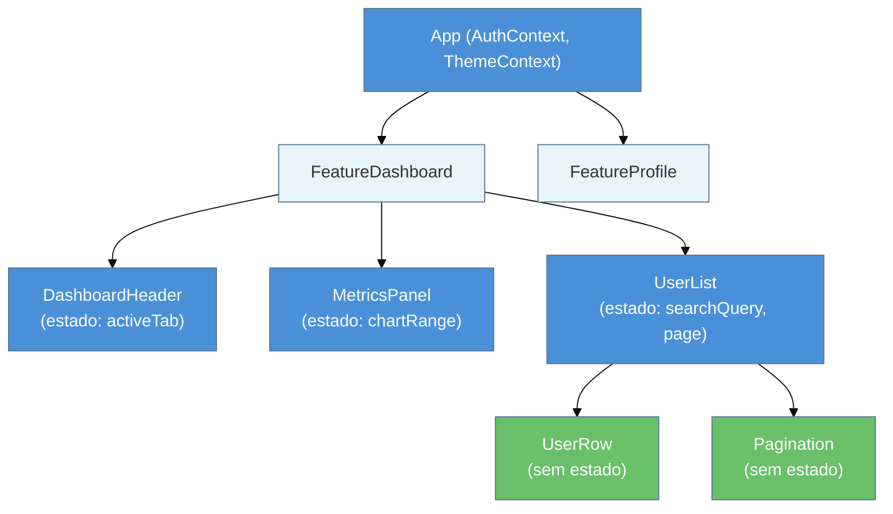
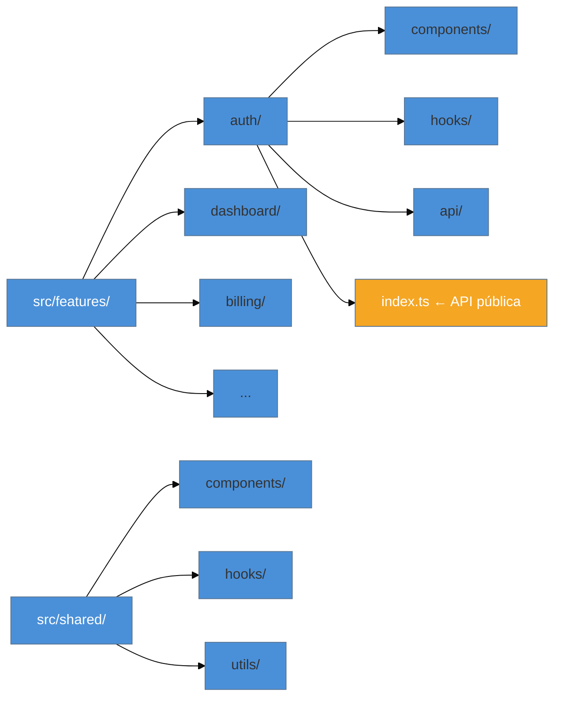
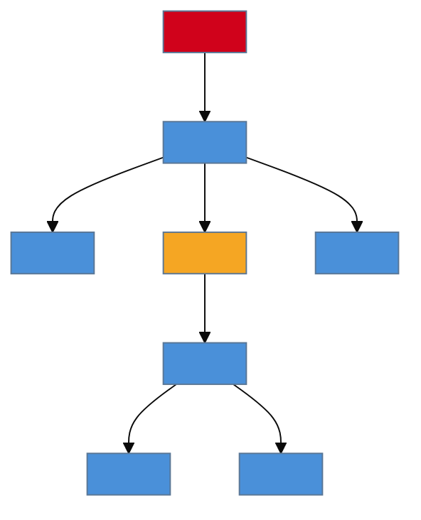

> [!abstract] TL;DR
> Arquitetura de componentes é a disciplina de decidir **onde o estado mora, o que cada componente faz e como as peças se encaixam** — antes que o caos do crescimento tome conta. O princípio central é composição sobre configuração: componentes pequenos, responsabilidade única, estado colocado o mais perto possível de quem o usa. A divisão clássica presentacional/container evoluiu com hooks, mas o espírito persiste: separar *o que renderizar* de *de onde vêm os dados*. Barrel files parecem convenientes mas inflam bundle e destroem HMR; estrutura feature-based escala onde layer-based quebra. Padrões avançados (compound, render props, HOC) vivem no galho React Design Patterns (futuro).

---

## O problema começa cedo

Você está na reunião de planejamento do sprint 12. Alguém abre o arquivo `UserDashboard.tsx` para mostrar uma estimativa. São 847 linhas. O componente busca os dados do usuário, trata o estado de loading, filtra permissões por role, renderiza três seções diferentes e ainda cuida do formulário de edição inline. Cada vez que alguém toca em qualquer coisa, o arquivo inteiro tem que ser relido mentalmente do zero.

Esse componente tem um nome técnico: **God Component**. E o problema não é o tamanho — é a ausência de fronteiras claras. Sem fronteiras, o estado vaza para onde não deveria, os efeitos colaterais se acumulam e os bugs se escondem nos cantos.

Arquitetura de componentes é o mapa que você desenha antes (ou que você reconstrói depois) para responder a três perguntas:

1. **Onde vive o estado?** (e quem tem permissão de mudá-lo)
2. **O que cada componente faz?** (e o que ele deliberadamente *não* faz)
3. **Como as peças se encaixam?** (composição, não configuração)

Essas perguntas não têm resposta única — mas têm padrões testados em produção.

---

## Composição sobre configuração

O princípio mais importante da arquitetura React não é um padrão específico; é uma forma de pensar.

**Configuração** significa criar um componente que aceita uma prop para cada variação possível de comportamento:

```tsx
// ❌ Configuração: o componente cresce junto com cada novo caso
<Card
  showHeader={true}
  showFooter={false}
  footerVariant="minimal"
  headerTitle="Usuário"
  headerSubtitle="Perfil"
  bodyPadding="lg"
  collapsible={true}
  defaultExpanded={false}
/>
```

Depois de oito sprints, esse componente tem quarenta props, metade condicionais entre si, e ninguém sabe o que acontece quando `showHeader={false}` e `headerTitle` estão presentes ao mesmo tempo.

**Composição** resolve isso deixando o *chamador* montar a estrutura:

```tsx
// ✅ Composição: o consumidor decide o que colocar onde
<Card>
  <Card.Header>
    <h2>Usuário</h2>
    <span>Perfil</span>
  </Card.Header>
  <Card.Body>
    <UserForm />
  </Card.Body>
</Card>
```

O componente `Card` não sabe o que há dentro de `Card.Header`. Ele só garante estrutura e estilo. Quem sabe o que colocar é o consumidor. Esse é o padrão Compound Component — que vive em detalhes no galho React Design Patterns (futuro).

A composição se aplica em todos os níveis: em vez de passar dezenas de props para baixo (prop drilling), você passa o próprio componente como children ou como slot. A seção sobre prop drilling versus composição aprofunda isso adiante.

---

## Onde o estado mora — colocation primeiro

Pense no estado como uma conta bancária: colocar o dinheiro no banco central quando você só precisa de troco para o café da manhã é burocracia desnecessária. Estado global tem custo — cognitivo, de performance, de acoplamento.

A regra é simples: **estado deve morar o mais perto possível de quem o usa**.



Nessa árvore:
- `activeTab` em `DashboardHeader` não interessa a ninguém fora dele — fica lá.
- `searchQuery` e `page` de `UserList` só importam para `UserList` e seus filhos — ficam lá.
- `AuthContext` precisa estar disponível em qualquer lugar da app — sobe para `App`.

**Quando levantar o estado?** Quando dois componentes *irmãos* precisam ler ou mudar o mesmo valor. Levanta para o ancestral comum mais próximo — não mais alto que isso.

> [!question]- Por que não colocar tudo no estado global logo?
> Porque estado global cria acoplamento invisível. Quando `UserList` lê de um store global, ela depende de qualquer parte da app que escreva naquele store. Bugs viram enigmas. Re-renders se espalham. A árvore de Suspense perde granularidade. Comece colocado, eleve quando necessário.

A nota [[15 - Estado - local, elevado e externo]] aprofunda as regras de quando usar `useState`, quando elevar e quando usar contexto ou store externo.

---

## Componentes presentacionais vs. containers — e por que os hooks mudaram a conversa

Em 2015, Dan Abramov descreveu a divisão: **componentes presentacionais** (burros) só renderizam UI baseada em props; **componentes container** (espertos) buscam dados, gerenciam estado, conectam à store.

O problema dessa divisão rígida era estrutural: containers eram HOCs (Higher-Order Components) ou classes que envolviam os presentacionais, criando uma hierarquia desnecessária. O debugging era um pesadelo de wrapper stacks.

Com hooks, o *espírito* da divisão persiste, mas a *implementação* mudou:

```tsx
// ANTES: Container como componente separado (HOC ou classe)
class UserListContainer extends React.Component {
  state = { users: [], loading: true };
  componentDidMount() { fetchUsers().then(u => this.setState({ users: u, loading: false })); }
  render() { return <UserList users={this.state.users} loading={this.state.loading} />; }
}

// DEPOIS com hooks: a separação vive dentro do mesmo componente, ou em custom hook
// Opção A — custom hook separa lógica de UI (preferida em 2026)
function useUserList() {
  const [users, setUsers] = useState<User[]>([]);
  const [loading, setLoading] = useState(true);

  useEffect(() => {
    fetchUsers().then(u => {
      setUsers(u);
      setLoading(false);
    });
  }, []);

  return { users, loading };
}

// Componente "presentacional" recebe dados via hook (ou via props se for reutilizável)
export function UserListPage() {
  const { users, loading } = useUserList();
  return <UserList users={users} loading={loading} />;
}

// UserList é puramente presentacional — testável sem nenhum mock de rede
export function UserList({ users, loading }: { users: User[]; loading: boolean }) {
  if (loading) return <Skeleton />;
  return (
    <ul>
      {users.map(u => (
        <UserRow key={u.id} user={u} />
      ))}
    </ul>
  );
}
```

A separação real hoje é entre **lógica de negócio/dados** (custom hook) e **renderização** (componente puro). O container como componente extra virou opcional — muitas vezes é apenas o hook.

> [!info] Dan Abramov sobre o próprio padrão
> Em 2019, Abramov atualizou o post original dizendo que não recomendaria mais a divisão da forma original. Hooks alcançaram o mesmo objetivo com menos indireção. O princípio (separar dados de renderização) continua válido; o mecanismo (HOC/classe container) ficou para trás.

---

## Quando extrair um componente

A decisão de extrair é guiada por *sinais*, não por métricas arbitrárias de linhas:

| Sinal | O que fazer |
|---|---|
| O componente faz duas coisas não relacionadas | Extrai em dois componentes separados |
| Um bloco de JSX se repete em dois lugares | Extrai em componente reutilizável |
| Uma seção do componente tem estado próprio que não vaza | Extrai e coloca o estado junto |
| Um bloco tem lógica condicional complexa que ofusca o resto | Extrai em componente com nome semântico |
| O componente fica difícil de ler (>150 linhas de JSX denso) | Extrai por seção semântica |

O contrário também importa: **não extrair prematuramente**. Um componente com 80 linhas coesas é melhor que cinco componentes de 15 linhas com nomes vagos e props passadas de um para outro sem propósito.

```tsx
// ❌ Abstração prematura — nomes sem semântica real
function Section({ children }: { children: React.ReactNode }) { ... }
function Container({ children }: { children: React.ReactNode }) { ... }
function Wrapper({ children }: { children: React.ReactNode }) { ... }

// ✅ Extração com semântica — o nome descreve a responsabilidade
function UserMetricsPanel({ userId }: { userId: string }) { ... }
function BillingHistoryTable({ invoices }: { invoices: Invoice[] }) { ... }
```

### Quando extrair um hook

- A lógica (effects, refs, callbacks) está acoplada mas poderia ser reutilizada em outro componente
- O componente fica difícil de ler por causa de `useEffect`s complexos
- Você quer testar a lógica independentemente do JSX
- Você está implementando a mesma lógica de `useEffect` pela segunda vez em lugares diferentes

---

## Props vs. composição — como evitar prop drilling

Prop drilling é quando você passa a mesma prop por três ou mais camadas de componentes que não a usam — só a repassam para baixo.

```tsx
// ❌ Prop drilling: intermediários não usam user, só repassam
<Page user={user}>
  <PageHeader user={user}>
    <UserMenu user={user} />
  </PageHeader>
</Page>
```

Há duas saídas, com perfis diferentes:

**1. Composição com children/slots** — ideal quando os intermediários não precisam do dado de jeito nenhum:

```tsx
// ✅ Composição: Page não precisa saber de user
function Page({ children }: { children: React.ReactNode }) {
  return <main>{children}</main>;
}

// O chamador monta a estrutura com acesso a user
function App() {
  const user = useAuth();
  return (
    <Page>
      <PageHeader>
        <UserMenu user={user} />
      </PageHeader>
    </Page>
  );
}
```

**2. Context** — ideal quando muitos componentes numa subárvore precisam do mesmo dado:

```tsx
const UserContext = React.createContext<User | null>(null);

function UserProvider({ children }: { children: React.ReactNode }) {
  const user = useCurrentUser(); // busca uma vez só
  return <UserContext.Provider value={user}>{children}</UserContext.Provider>;
}

// Qualquer descendente acessa sem drilling
function UserMenu() {
  const user = useContext(UserContext);
  return <span>{user?.name}</span>;
}
```

A composição resolve o drilling sem adicionar estado global. Use Context quando a composição não for viável (ex: dados de autenticação que qualquer componente pode precisar sem avisar).

A nota [[08 - Renderização condicional e composição]] cobre o padrão de children e render slots em mais profundidade.

---

## Estrutura de pastas — feature-based vs. layer-based

A escolha da estrutura de pastas parece cosmética, mas tem impacto real em como equipes navegam e como o código escala.

### Layer-based (por tipo de arquivo)

```
src/
  components/
    Button.tsx
    UserCard.tsx
    InvoiceTable.tsx
  hooks/
    useAuth.ts
    useUsers.ts
    useInvoices.ts
  services/
    userService.ts
    invoiceService.ts
```

Funciona para apps pequenas. Quebra quando a base cresce: para entender uma feature, você abre quatro pastas diferentes. Um refactor de "Users" toca arquivos espalhados por todo o projeto.

### Feature-based (por domínio de negócio)

```
src/
  features/
    auth/
      components/
        LoginForm.tsx
        AuthGuard.tsx
      hooks/
        useAuth.ts
      api/
        authApi.ts
      types.ts
      index.ts           ← barrel MÍNIMO: só exports públicos da feature
  dashboard/
    components/
      MetricsPanel.tsx
      UserList.tsx
    hooks/
      useMetrics.ts
    index.ts
  shared/
    components/
      Button.tsx
      Modal.tsx
    hooks/
      useDebounce.ts
```

**Cada feature é uma ilha.** O código que muda junto fica junto. Um refactor de "auth" não toca "dashboard". Onboarding de novos devs é por feature, não por tipo.

Essa é a estrutura recomendada pelo Bulletproof React (alan2207/bulletproof-react) e adotada por equipes que escalam além de ~5 features simultâneas.



**Regra de ouro da feature-based:** componentes dentro de uma feature podem se importar livremente. Componentes de features diferentes só se comunicam via `shared/` ou pela API pública do `index.ts`. Nunca `import { X } from '../auth/components/LoginForm'` de dentro de `dashboard/`.

---

## Barrel files — a conveniência que tem preço

Um barrel file é um `index.ts` que re-exporta tudo de uma pasta:

```ts
// components/index.ts
export * from './Button';
export * from './Modal';
export * from './UserCard';
export * from './InvoiceTable';
export * from './DataGrid';
// ... 40 mais
```

A conveniência é real: `import { Button, Modal } from '@/components'` é mais limpo que paths profundos. O custo também é real.

**O problema com bundlers:** quando você importa `Button` de um barrel que re-exporta 50 componentes, o bundler tem que processar os 50 para confirmar que só `Button` é usado. Tree-shaking fica mais difícil de fazer com confiança. O resultado são bundles maiores e HMR mais lento.

**Números reais:** a Capchase eliminou barrel files e teve build 5x mais rápido. O Next.js reporta 15-70% de melhoria no dev boot quando configurado com `optimizePackageImports` para contornar barrels de bibliotecas externas.

**O que fazer:**
- Barrel `index.ts` na raiz de uma *feature* (exports públicos da feature) — aceitável e útil
- Barrel abrangendo *todos* os componentes de uma pasta grande — evitar
- Imports diretos para código dentro da mesma feature — sempre preferir

```ts
// ✅ Barrel mínimo — só expõe a API pública da feature auth
// features/auth/index.ts
export { AuthGuard } from './components/AuthGuard';
export { useAuth } from './hooks/useAuth';
export type { User } from './types';
// LoginForm fica interno — não exportado

// ❌ Barrel gorduroso — expõe tudo e cria acoplamento
export * from './components/LoginForm';
export * from './components/AuthGuard';
export * from './hooks/useAuth';
export * from './api/authApi';    // nunca deveria ser público
```

---

## Boundary de responsabilidade — um componente, uma razão para mudar

O princípio da responsabilidade única (SRP) aplicado a componentes React tem uma formulação prática: **um componente deve ter uma razão para mudar**.

`UserDashboard` com 847 linhas tem pelo menos cinco razões para mudar: design da seção de métricas, lógica de permissão, comportamento do formulário de edição, estrutura de dados da API, estado de loading global. Qualquer mudança em qualquer uma dessas razões toca o mesmo arquivo.

A refatoração correta não é dividir por tamanho — é dividir por razão de mudança:

```tsx
// Antes: um componente, cinco responsabilidades
function UserDashboard() { /* 847 linhas */ }

// Depois: cada parte tem sua própria razão de mudar
function UserDashboard() {
  const { user, loading } = useCurrentUser();

  if (loading) return <DashboardSkeleton />;

  return (
    <DashboardLayout>
      <UserMetricsPanel userId={user.id} />
      <PermissionGate roles={['admin', 'editor']}>
        <UserEditSection user={user} />
      </PermissionGate>
      <BillingHistoryPanel userId={user.id} />
    </DashboardLayout>
  );
}
```

`UserDashboard` agora tem uma razão para mudar: a estrutura geral do dashboard. `UserMetricsPanel` muda quando as métricas mudam. `PermissionGate` muda quando a lógica de autorização muda. Cada componente é testável isoladamente.

---

## Árvore de Suspense e Error Boundaries — pensar em camadas de falha

Um erro comum é tratar Suspense e Error Boundaries como detalhes de implementação para adicionar depois. Na arquitetura, eles são **camadas de contrato**: definem onde o loading e o erro param de se propagar.



**Princípio:** coloque Error Boundaries e Suspense onde você quer que o fallback pare. Um único `<ErrorBoundary>` na raiz da app significa que qualquer erro em qualquer componente derruba a app inteira. Error Boundaries em torno de features individuais isolam falhas.

**Decisão arquitetural:** para cada feature assíncrona, decida:
- Qual é o fallback de loading aceitável? (skeleton local vs. spinner global)
- Se essa feature falhar, o resto da app pode continuar?

Se sim, a feature precisa do próprio `<ErrorBoundary>`. Se o rest da app depende dos dados dela para funcionar, o boundary sobe na árvore.

As notas [[18 - Error boundaries]] e [[19 - Suspense e data fetching no cliente]] cobrem a implementação em detalhe.

---

## Casos práticos

### Cenário 1 — Refatorando o God Component

**Antes:** `OrderPage.tsx` com 620 linhas que busca pedido, gerencia estado de edição inline, renderiza header, itens, totais e painel de status, e lida com submit de atualização.

**Diagnóstico:** seis responsabilidades num arquivo. Bugs de re-render afetando header quando o formulário muda. Impossível testar a lógica de totais sem montar a página inteira.

**Depois:**

```tsx
// features/orders/
// ├── components/
// │   ├── OrderHeader.tsx        — exibe número e data, sem estado
// │   ├── OrderItemsTable.tsx    — renderiza linhas + permite edição inline
// │   ├── OrderTotals.tsx        — calcula e exibe totais (puro: mesmos inputs → mesma saída)
// │   └── OrderStatusPanel.tsx   — lógica de transição de status isolada
// ├── hooks/
// │   ├── useOrder.ts            — busca e cache do pedido
// │   └── useOrderEdit.ts        — estado de edição + mutação de submit
// └── OrderPage.tsx              — orquestra, ~60 linhas

export function OrderPage({ orderId }: { orderId: string }) {
  const { order, loading } = useOrder(orderId);
  const editState = useOrderEdit(orderId);

  if (loading) return <OrderSkeleton />;

  return (
    <ErrorBoundary fallback={<OrderError />}>
      <OrderHeader order={order} />
      <OrderItemsTable items={order.items} editState={editState} />
      <OrderTotals items={order.items} />
      <OrderStatusPanel orderId={orderId} currentStatus={order.status} />
    </ErrorBoundary>
  );
}
```

**Resultado:** cada componente é testável de forma independente. `OrderTotals` é uma função pura. `useOrderEdit` pode ser testado com `renderHook`.

---

### Cenário 2 — Escolhendo a estrutura quando a app cresce

**Contexto:** app começou layer-based. Agora tem 8 features, 3 devs e merges conflitando toda semana porque `components/` virou um cemitério de 80 arquivos.

**Migração gradual** (não precisa ser big bang):

1. Criar `src/features/` e `src/shared/`
2. Mover a próxima feature nova diretamente para `features/nova-feature/`
3. Quando tocar numa feature existente para uma tarefa, migrar esse código junto
4. Deixar `components/` antigo no lugar; marcar como legado; não crescer mais
5. Em 2-3 meses, `components/` está vazio o suficiente para deletar

Nenhuma refatoração big bang. Nenhum sprint inteiro de "reorganização". A estrutura nova cresce junto com o trabalho normal.

---

## Armadilhas comuns

> [!warning] Estado global para tudo
> **O que acontece:** toda decisão de estado vai para Zustand/Redux/Jotai, mesmo estados de UI puramente locais (modal aberto, tab ativa, valor de input). A store cresce sem controle. **Por quê:** parece seguro colocar no global "por garantia". Na prática cria dependências invisíveis e re-renders desnecessários em componentes não relacionados. **Como evitar:** regra simples — estado começa local (`useState`). Sobe quando dois componentes irmãos precisam do mesmo valor. Vai para store apenas quando precisar persistir, ser compartilhado entre features distantes, ou precisar de ações complexas (undo, otimistic updates).

> [!warning] Abstração prematura — componentes sem semântica
> **O que acontece:** ao primeiro sinal de repetição, você extrai `<Wrapper>`, `<Container>`, `<Section>` e `<Box>` genéricos. Daqui a dois meses, você tem uma hierarquia de seis componentes sem nomes que dizem nada. **Por quê:** a regra "DRY a todo custo" aplicada sem contexto. Dois componentes com JSX similar mas razões de mudança diferentes deveriam ser componentes separados — a duplicação é acidental, não essencial. **Como evitar:** só extrai quando o componente tem um nome que descreve *o que ele representa no domínio* (não "como ele funciona"). `<UserPermissionBadge>` é bom. `<StyledBox variant="pill">` provavelmente não deveria existir.

> [!warning] Barrel file que infla bundle
> **O que acontece:** `export * from './components'` em toda pasta. O bundler importa 60 componentes para usar um. Bundle cresce, HMR fica lento, cold start do dev server dobra. **Por quê:** a conveniência de imports curtos mascarou o custo até alguém rodar o bundle analyzer. **Como evitar:** barrel files só na raiz de features (exports públicos). Imports dentro da mesma feature são diretos: `import { Button } from './Button'`, não via barrel.

> [!warning] Prop drilling ignorado até virar crise
> **O que acontece:** uma prop passa por 5 componentes intermediários que não a usam. Qualquer mudança no tipo dessa prop exige tocar em 5 arquivos. **Por quê:** é mais fácil "adicionar uma prop" do que refatorar para composição ou context agora. **Como evitar:** ao segundo nível de drilling (prop passa por componente que não usa ela), avaliar composição com `children` ou Context. Não esperar o quinto nível.

---

## Como explicar em inglês

In a React codebase, component architecture is about drawing clear responsibility boundaries: each component does one thing, state lives as close as possible to where it's consumed, and composition replaces configuration wherever possible. The classic container/presentational split evolved with hooks — today we separate data logic into custom hooks and keep components focused on rendering. Feature-based folder structure groups code by business domain rather than file type, which is what scales when teams grow.

| PT | EN |
|---|---|
| arquitetura de componentes | component architecture |
| colocation do estado | state colocation |
| levantar estado | lift state |
| componente presentacional | presentational component |
| componente container | container component |
| fronteira de responsabilidade | responsibility boundary |
| barrel file | barrel file / index re-export |
| estrutura por feature | feature-based structure |
| estrutura por camada | layer-based structure |
| árvore de componentes | component tree |
| prop drilling | prop drilling |
| composição | composition |
| extração de componente | component extraction |

---

## O que vem a seguir

A arquitetura define onde o estado mora e como os componentes se organizam. O próximo nível é entender *como* o React decide o que re-renderizar quando esse estado muda — e onde a performance entra na equação.

- [[17 - Performance no React]] — memoização, colocation como otimização e quando o React Compiler muda o jogo
- [[15 - Estado - local, elevado e externo]] — as regras de quando elevar e quando ir para store externa
- [[08 - Renderização condicional e composição]] — padrões de composição com children, render props e slots
- [[18 - Error boundaries]] — implementação e posicionamento de boundaries na árvore
- [[19 - Suspense e data fetching no cliente]] — como Suspense define a granularidade de loading

---

## Veja também

- [[03-Dominios/Tecnologia/React/Dicionário de React|Dicionário de React]] — glossário de termos usados neste galho

---

## Referências

- **Alan Zalewski** — [*Bulletproof React*](https://github.com/alan2207/bulletproof-react) — referência canônica de estrutura feature-based para apps React em produção; atualizada em 2025
- **Robin Wieruch** — [*React Folder Structure Best Practices (2026)*](https://www.robinwieruch.de/react-folder-structure/) — análise progressiva de estruturas, do iniciante ao enterprise
- **Kent C. Dodds** — [*State Colocation will make your React app faster*](https://kentcdodds.com/blog/state-colocation-will-make-your-react-app-faster) — artigo clássico sobre colocation com benchmark real
- **Adeel Imran** — [*Colocated State and Powerful Composition with React (2025)*](https://adeelhere.com/blog/2025-10-10-colocated-state-and-powerful-composition-with-react) — atualização pós-hooks com exemplos concretos
- **Capchase Tech** — [*The Hidden Cost of Barrel Files*](https://medium.com/capchase/the-hidden-cost-of-barrel-files-how-capchase-sped-up-builds-by-5x-fcb38bcbe8be) — case real de build 5x mais rápido após remoção de barrel files
- **patterns.dev** — [*Container/Presentational Pattern*](https://www.patterns.dev/react/presentational-container-pattern/) — histórico e evolução do padrão com hooks
- **Albert Barsegyan** — [*The Best React Architecture for 2026: Domain-Driven + Feature-Sliced Design*](https://medium.com/@albert_barsegyan/the-best-react-js-architecture-for-2026-domain-driven-feature-sliced-design-87f6e25d13fe) — perspectiva 2026 combinando DDD com feature-sliced
- **Mirrorcodex** — [*Presentational vs Container Components: Still Relevant in 2025?*](https://mirrorcodex.com/presentational-vs-container-components/) — análise honesta do estado atual do padrão

---

> *Arquitetura de componentes em uma frase: decida onde o estado mora antes que ele decida sozinho — e componha em vez de configurar.*
