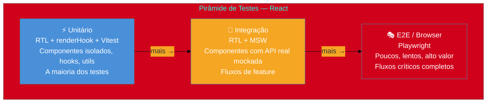
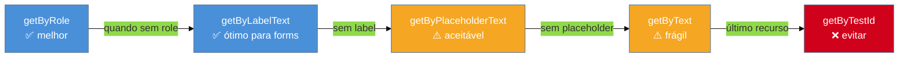
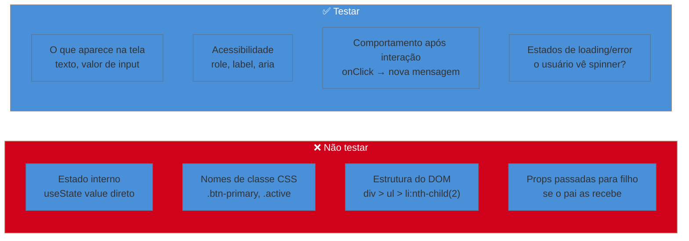

> [!abstract] TL;DR
> Testar React bem significa testar o que o usuário experimenta, não como o componente funciona por dentro. A React Testing Library (RTL) encarna essa filosofia: render, encontre elementos por papel acessível, interaja como um usuário real com `@testing-library/user-event`, e assert no que aparece na tela. Para chamadas HTTP, MSW intercepta na camada de rede — não no módulo — tornando os mocks reutilizáveis entre testes, Storybook e dev. Vitest é o runner moderno para projetos Vite/React. O que **não** testar: estado interno, detalhes de implementação, IDs de teste sem semântica. Testes que quebram a cada refactor interno não são testes de qualidade — são dívida técnica.

---

## O teste que não deveria ter quebrado

Você faz um refactor limpo: renomeia um estado interno de `isLoading` para `isPending`, extrai um hook customizado, reorganiza a estrutura dos componentes. Nada visível ao usuário muda. E então o CI explode em vermelho — 47 testes quebraram.

Isso não é o teste fazendo seu trabalho. É o teste fazendo o trabalho **errado**. Testes que acoplam ao estado interno, ao nome de variáveis, à estrutura do DOM — esses testes punem refactoring em vez de protegê-lo.

A virada de chave aconteceu quando Kent C. Dodds formulou a filosofia que está no coração da React Testing Library:

> *"The more your tests resemble the way your software is used, the more confidence they can give you."*

Se o usuário não consegue ver `isLoading`, por que seu teste deveria?

---

## A filosofia: testar comportamento, não implementação

Pense como um usuário cego usando um leitor de tela. Ele não vê `<div className="spinner">`. Ele ouve "Carregando..." ou não ouve nada. O que importa é o que aparece, o que pode ser clicado, o que é lido em voz alta.

A RTL formaliza isso com uma hierarquia de queries:

```
role → label → placeholder → text → displayValue → altText → title → testId
```

Quanto mais à esquerda, melhor. Um `getByRole('button', { name: 'Enviar' })` testa acessibilidade **e** comportamento ao mesmo tempo. Um `getByTestId('submit-btn')` testa só a existência do atributo — zero semântica, zero confiança.

```
X em uma frase: teste o que o usuário vê e interage, não o que o código faz por dentro.
```

---

## A pirâmide de testes no contexto React



A pirâmide não é lei — é heurística. Em React, a camada de integração com RTL + MSW dá retorno excelente: você testa o componente inteiro (render → interação → assert) sem precisar de browser real.

---

## React Testing Library — as peças fundamentais

### Instalação moderna (Vitest + jsdom)

```tsx
// package.json (devDependencies)
// "@testing-library/react": "^16.x"
// "@testing-library/user-event": "^14.x"
// "@testing-library/jest-dom": "^6.x"
// "vitest": "^3.x"
// "jsdom": "^25.x" ou "happy-dom"

// vitest.config.ts
import { defineConfig } from 'vitest/config'
import react from '@vitejs/plugin-react'

export default defineConfig({
  plugins: [react()],
  test: {
    environment: 'jsdom',      // emula o browser
    globals: true,             // describe/it/expect sem import
    setupFiles: ['./src/test/setup.ts'],
  },
})

// src/test/setup.ts
import '@testing-library/jest-dom'  // matchers: toBeInTheDocument, toHaveValue...
```

> [!info] happy-dom vs jsdom
> `happy-dom` é ~3x mais rápido que `jsdom` em suites grandes. Para projetos novos, vale experimentar. Para projetos existentes, trocar pode revelar diferenças de comportamento em edge cases.

### render e screen — o par fundamental

```tsx
// src/components/LoginForm.test.tsx
import { render, screen } from '@testing-library/react'
import { LoginForm } from './LoginForm'

test('exibe erro quando email está vazio', async () => {
  render(<LoginForm onSubmit={vi.fn()} />)

  // screen é o objeto global de queries — sempre prefira-o a desestruturar de render()
  const submitButton = screen.getByRole('button', { name: /entrar/i })
  expect(submitButton).toBeInTheDocument()
})
```

> [!question]- Por que `screen` em vez de desestruturar de `render`?
> `const { getByRole } = render(...)` funciona, mas `screen` é preferível porque não exige refactoring quando você precisa de múltiplos renders no mesmo teste. `screen` aponta sempre para o document corrente.

---

## As três famílias de queries

A escolha errada de query é uma das armadilhas mais comuns. A distinção é simples:

| Família | Encontra? | Elemento ausente | Quando usar |
|---------|-----------|------------------|-------------|
| `getBy` / `getAllBy` | Imediatamente | Lança erro | Elemento **deve** estar presente agora |
| `queryBy` / `queryAllBy` | Imediatamente | Retorna `null` | Verificar que elemento **não** existe |
| `findBy` / `findAllBy` | Aguarda (async) | Lança erro após timeout | Elemento aparece **depois** de algo assíncrono |

```tsx
// getBy — elemento deve estar presente agora
const title = screen.getByRole('heading', { name: /bem-vindo/i })

// queryBy — confirmar ausência (único caso de uso legítimo)
expect(screen.queryByRole('alert')).not.toBeInTheDocument()

// findBy — elemento aparece após fetch, estado async, etc.
const errorMsg = await screen.findByRole('alert', { name: /email inválido/i })
expect(errorMsg).toBeVisible()
```

### Hierarquia de queries por semântica



---

## @testing-library/user-event — interagindo como humano

`fireEvent` dispara eventos DOM sintéticos. `userEvent` simula a sequência completa de eventos que um humano gera: foco, movimento do ponteiro, keydown, input, keyup, blur. A diferença importa quando você testa validação, masks de input, ou qualquer lógica ativada por eventos intermediários.

### O padrão correto com v14

```tsx
import userEvent from '@testing-library/user-event'

// ✅ CORRETO: instancia antes do render; user carrega config e mantém estado entre interações
test('submete formulário de login com credenciais válidas', async () => {
  const user = userEvent.setup()        // ← instanciar antes do render
  const handleSubmit = vi.fn()

  render(<LoginForm onSubmit={handleSubmit} />)

  // 1. Preenche email — user.type simula foco + digitação + blur
  await user.type(
    screen.getByLabelText(/e-mail/i),
    'joao@exemplo.com'
  )

  // 2. Preenche senha
  await user.type(
    screen.getByLabelText(/senha/i),
    'secreto123'
  )

  // 3. Clica em Entrar
  await user.click(screen.getByRole('button', { name: /entrar/i }))

  // 4. Assert no comportamento, não no estado interno
  expect(handleSubmit).toHaveBeenCalledWith({
    email: 'joao@exemplo.com',
    password: 'secreto123',
  })
})
```

> [!info] `userEvent.setup({ delay: null })`
> Em suites grandes, `user.type()` pode ficar lento (simula delay entre teclas). `userEvent.setup({ delay: null })` remove o delay artificial e acelera os testes sem perder fidelidade nos assertions.

### fireEvent vs userEvent — quando cada um

```
fireEvent.click(btn)         → dispara 1 evento click
userEvent.click(btn)         → dispara: pointerover, pointermove, mouseover,
                               mousemove, pointerdown, mousedown, focus,
                               pointerup, mouseup, click
```

Use `fireEvent` apenas quando testar um handler que ouve exatamente aquele evento — raro. Para tudo que envolve comportamento do usuário, use `userEvent`.

---

## Testando hooks com renderHook

Hooks com lógica complexa merecem teste isolado — sem precisar envolvê-los num componente fictício.

```tsx
// src/hooks/useCounter.test.ts
import { renderHook, act } from '@testing-library/react'
import { useCounter } from './useCounter'

test('incrementa o contador', () => {
  // renderHook retorna { result, rerender, unmount }
  const { result } = renderHook(() => useCounter({ initial: 0 }))

  // result.current é o valor retornado pelo hook
  expect(result.current.count).toBe(0)

  // act() garante que updates de estado são processados antes do assert
  act(() => {
    result.current.increment()
  })

  expect(result.current.count).toBe(1)
})

// Hook com providers (Context, React Query, etc.)
test('usa valor do contexto', () => {
  const wrapper = ({ children }: { children: React.ReactNode }) => (
    <ThemeProvider theme="dark">{children}</ThemeProvider>
  )

  const { result } = renderHook(() => useTheme(), { wrapper })

  expect(result.current.mode).toBe('dark')
})
```

> [!info] `@testing-library/react-hooks` está obsoleto
> A partir do RTL v13+, `renderHook` vive diretamente em `@testing-library/react`. Não instale o pacote separado `@testing-library/react-hooks` em projetos novos.

---

## Testando estados assíncronos

O padrão mais comum: componente faz fetch, exibe loading, exibe resultado (ou erro).

```tsx
// src/components/UserProfile.test.tsx
import { render, screen } from '@testing-library/react'
import { UserProfile } from './UserProfile'

test('exibe dados do usuário após carregamento', async () => {
  render(<UserProfile userId="42" />)

  // Enquanto carrega, spinner deve aparecer
  expect(screen.getByRole('status')).toBeInTheDocument()  // aria-label="Carregando"

  // findBy aguarda o elemento aparecer (timeout padrão: 1000ms)
  const name = await screen.findByRole('heading', { name: /João Silva/i })
  expect(name).toBeVisible()

  // Spinner some depois que os dados chegam
  expect(screen.queryByRole('status')).not.toBeInTheDocument()
})
```

### waitFor — quando findBy não basta

`findBy` é açúcar em torno de `waitFor`. Use `waitFor` quando seu assertion não é sobre um elemento novo, mas sobre uma mudança de estado:

```tsx
import { waitFor } from '@testing-library/react'

test('exibe mensagem de sucesso após salvar', async () => {
  const user = userEvent.setup()
  render(<ProfileEditor />)

  await user.click(screen.getByRole('button', { name: /salvar/i }))

  // waitFor tenta o callback repetidamente até passar ou esgotar timeout
  await waitFor(() => {
    expect(screen.getByText(/salvo com sucesso/i)).toBeInTheDocument()
  })
})
```

> [!warning] Não coloque múltiplos expects dentro de waitFor
> `waitFor` re-executa o callback até que todos os expects passem. Se o primeiro passa mas o segundo falha, você fica em loop até o timeout. Quebre em múltiplos `waitFor` ou use `findBy` para o elemento e depois asserts síncronos.

---

## MSW — Mock Service Worker: o padrão para HTTP

### Por que MSW, não jest.mock('fetch') ou axios?

Imagine testar um formulário que faz `POST /api/login`. Você pode:

1. **Mockar o módulo axios diretamente** — frágil; se você trocar para `fetch`, o mock quebra. Testa a implementação, não o comportamento.
2. **Injetar o serviço via prop** — workable, mas vaza infra de teste para o design do componente.
3. **MSW** — intercepta na camada de rede (Service Worker no browser, `http` module no Node). O componente faz a requisição real; a rede a intercepta. Mesmos handlers funcionam em Vitest, Storybook e dev.

```tsx
// src/mocks/handlers.ts
import { http, HttpResponse } from 'msw'

export const handlers = [
  // Happy path — retorna usuário autenticado
  http.post('/api/login', () => {
    return HttpResponse.json(
      { id: '42', name: 'João Silva', token: 'abc123' },
      { status: 200 }
    )
  }),

  http.get('/api/users/:id', ({ params }) => {
    return HttpResponse.json({ id: params.id, name: 'João Silva' })
  }),
]
```

```tsx
// src/test/setup.ts
import { setupServer } from 'msw/node'
import { handlers } from '../mocks/handlers'

export const server = setupServer(...handlers)

// Inicia antes de todos os testes
beforeAll(() => server.listen({ onUnhandledRequest: 'error' }))

// Reseta overrides entre testes
afterEach(() => server.resetHandlers())

// Para ao final
afterAll(() => server.close())
```

```tsx
// src/components/LoginForm.test.tsx
import { server } from '../test/setup'
import { http, HttpResponse } from 'msw'

test('exibe erro quando credenciais são inválidas', async () => {
  // Override apenas neste teste — handler default fica intacto
  server.use(
    http.post('/api/login', () => {
      return HttpResponse.json(
        { message: 'Credenciais inválidas' },
        { status: 401 }
      )
    })
  )

  const user = userEvent.setup()
  render(<LoginForm />)

  await user.type(screen.getByLabelText(/e-mail/i), 'wrong@email.com')
  await user.type(screen.getByLabelText(/senha/i), 'errado')
  await user.click(screen.getByRole('button', { name: /entrar/i }))

  const error = await screen.findByRole('alert')
  expect(error).toHaveTextContent(/credenciais inválidas/i)
})
```

> [!info] MSW no browser vs Node
> No browser (Storybook, dev): MSW usa um Service Worker real (`public/mockServiceWorker.js`). Em testes (Vitest, Jest): usa `msw/node` com `setupServer`, que intercepta via Node.js `http` module. Mesmos handlers, ambientes diferentes.

---

## Testando Error Boundaries

Error Boundaries capturam erros de renderização — mas o React loga o erro no console mesmo em testes, o que polui a saída. O padrão é silenciar o console.error durante esses testes:

```tsx
// src/components/ErrorBoundary.test.tsx
import { render, screen } from '@testing-library/react'
import { ErrorBoundary } from './ErrorBoundary'

// Componente que sempre explode
const BrokenComponent = (): never => {
  throw new Error('Algo explodiu')
}

test('exibe fallback quando filho lança erro', () => {
  // Silencia o console.error do React durante este teste
  const consoleSpy = vi.spyOn(console, 'error').mockImplementation(() => {})

  render(
    <ErrorBoundary fallback={<p>Algo deu errado</p>}>
      <BrokenComponent />
    </ErrorBoundary>
  )

  expect(screen.getByText(/algo deu errado/i)).toBeInTheDocument()

  consoleSpy.mockRestore()
})
```

Veja [[18 - Error boundaries]] para a implementação completa e os padrões de `errorElement` no React Router.

---

## O que NÃO testar

Esta seção é tão importante quanto as anteriores. Testes que punem refactoring são piores que nenhum teste.



### A regra dos detalhes de implementação

> Se eu refatorar o componente sem mudar o comportamento visível para o usuário, meu teste deve continuar verde.

Isso exclui: estado interno, refs, nomes de métodos privados, ordem de chamadas de hooks, estrutura interna do DOM.

---

## Casos práticos

### Cenário 1: Form com validação e submit assíncrono

```tsx
// src/components/ContactForm.test.tsx
import { render, screen, waitFor } from '@testing-library/react'
import userEvent from '@testing-library/user-event'
import { ContactForm } from './ContactForm'

describe('ContactForm', () => {
  test('exibe validação quando campos obrigatórios estão vazios', async () => {
    const user = userEvent.setup()
    render(<ContactForm />)

    // Clica em enviar sem preencher nada
    await user.click(screen.getByRole('button', { name: /enviar/i }))

    // Erros de validação devem aparecer (cada um com role alert ou associado à label)
    expect(await screen.findByText(/nome é obrigatório/i)).toBeInTheDocument()
    expect(screen.getByText(/email inválido/i)).toBeInTheDocument()
  })

  test('envia dados e exibe confirmação', async () => {
    const user = userEvent.setup()
    render(<ContactForm />)

    await user.type(screen.getByLabelText(/nome/i), 'Maria')
    await user.type(screen.getByLabelText(/e-mail/i), 'maria@exemplo.com')
    await user.type(screen.getByLabelText(/mensagem/i), 'Olá!')

    await user.click(screen.getByRole('button', { name: /enviar/i }))

    // MSW (configurado no setup) retorna 200; componente exibe confirmação
    await screen.findByText(/mensagem enviada com sucesso/i)

    // Form é resetado após sucesso
    expect(screen.getByLabelText(/nome/i)).toHaveValue('')
  })
})
```

### Cenário 2: Hook de paginação com estado assíncrono

```tsx
// src/hooks/usePagination.test.ts
import { renderHook, act, waitFor } from '@testing-library/react'
import { usePagination } from './usePagination'

test('avança para a próxima página e carrega dados', async () => {
  const { result } = renderHook(() => usePagination({ pageSize: 10 }))

  // Estado inicial
  expect(result.current.page).toBe(1)
  expect(result.current.isLoading).toBe(true)

  // Aguarda carregamento da página 1
  await waitFor(() => {
    expect(result.current.isLoading).toBe(false)
  })

  expect(result.current.items).toHaveLength(10)

  // Avança para página 2
  act(() => {
    result.current.nextPage()
  })

  expect(result.current.page).toBe(2)
  expect(result.current.isLoading).toBe(true)

  await waitFor(() => {
    expect(result.current.isLoading).toBe(false)
  })

  expect(result.current.items).toHaveLength(10)
})
```

---

## Armadilhas comuns

> [!warning] Testar estado interno — a mais cara das armadilhas
> **O que acontece:** Você acessa `component.state`, chama métodos internos do hook diretamente, ou testa se `useState` foi chamado com determinado valor. **Por quê:** Isso não testa nenhum comportamento observável. Um refactor que muda o nome do estado — mas não o comportamento — quebra o teste. **Como evitar:** Apenas asserte no que aparece no DOM (`screen.getBy...`) ou no que sai do componente via callbacks (`onSubmit`, `onChange`).

> [!warning] Queries por data-testid quando existe alternativa semântica
> **O que acontece:** `getByTestId('submit-button')` em vez de `getByRole('button', { name: /enviar/i })`. **Por quê:** `data-testid` não existe no DOM real do usuário. Um botão sem texto acessível é um problema de acessibilidade — o teste está mascarando um bug, não verificando qualidade. **Como evitar:** Siga a hierarquia de queries. Se você precisar de `testId`, pergunte-se primeiro: "esse elemento tem um papel semântico e um nome acessível?" Se não, o componente provavelmente precisa de `aria-label`.

> [!warning] fireEvent em vez de userEvent para interação do usuário
> **O que acontece:** `fireEvent.click(button)` passa, mas o mesmo fluxo falha em produção porque a lógica depende de `mousedown` antes de `click`. **Por quê:** `fireEvent` dispara um único evento. Um clique de usuário real gera ~8 eventos em sequência. Para máscaras de input, validação on-blur, e handlers que verificam a sequência de eventos, `fireEvent` não reproduz a realidade. **Como evitar:** Use `userEvent.setup()` + `await user.click(...)` para toda interação de usuário. Reserve `fireEvent` para testar handlers que explicitamente ouvem um evento único.

> [!warning] act() warnings — o sinal de que algo está errado
> **O que acontece:** Vitest/Jest exibe `Warning: An update to Component inside a test was not wrapped in act(...)`. **Por quê:** Um update de estado aconteceu fora do ciclo controlado pelo test runner (geralmente uma promise resolvida depois do assert). **Como evitar:** Use `findBy` em vez de `getBy` para elementos assíncronos. Use `waitFor` para assertions sobre estado que muda. Se o warning persiste, investigue se há atualizações de estado após o unmount do componente.

> [!warning] Não resetar handlers do MSW entre testes
> **O que acontece:** Um teste sobrescreve um handler com `server.use(...)` para testar cenário de erro. O próximo teste espera o happy path, mas o handler de erro ainda está ativo. **Por quê:** `server.use()` registra um override persistente até que seja resetado. **Como evitar:** Sempre configure `afterEach(() => server.resetHandlers())` no setup global. Só sobreescreva handlers dentro do teste que precisa do cenário alternativo.

---

## Component testing vs E2E

A fronteira importa:

| | RTL + Vitest | Playwright E2E |
|---|---|---|
| **Velocidade** | Milissegundos por teste | Segundos por teste |
| **Fidelidade** | jsdom (quase browser) | Browser real |
| **O que testa** | Componente isolado + integração local | Fluxo completo, cross-page |
| **Feedback** | Imediato (CI rápido) | Lento (CI caro) |
| **Quando usar** | Lógica, componentes, hooks, integração de feature | Jornadas críticas do usuário (checkout, login) |

RTL testa **dentro** do componente. Playwright testa o produto **como o usuário o usa no browser real**, incluindo roteamento, carregamento de assets, cookies, e comportamentos de browser que o jsdom não replica.

Para E2E em React, o padrão moderno é Playwright — veja o galho Ecossistema (futuro) para cobertura aprofundada.

---

## Como explicar em inglês

> *"In React testing, we use React Testing Library to assert on what users see and interact with — not on component internals. We query by accessible role and label, interact with user-event to simulate real browser events, and mock network requests at the HTTP layer using MSW. This approach makes tests resilient to refactoring while validating real user behavior."*

| PT | EN |
|----|-----|
| Testar comportamento | Test behavior |
| Detalhes de implementação | Implementation details |
| Papel acessível | Accessible role |
| Elemento de texto | Text element |
| Consulta assíncrona | Async query |
| Mock de rede | Network mock |
| Interceptar requisição | Intercept request |
| Estado de carregamento | Loading state |
| Renderizar um hook | Render a hook |
| Limpar entre testes | Clean up between tests |

---

## O que vem a seguir

Com testing dominado, o próximo passo natural é integrar a suíte com o ecossistema de ferramentas: configuração do Vitest em monorepos, coverage integrado ao CI, e as práticas de teste específicas para React Query, Zustand e outros parceiros de estado. Testes de componente só são tão bons quanto o runner e o pipeline que os executam.

- [[03-Dominios/Tecnologia/Tooling e Build/19 - Test runner nativo (node-test) e o cenário de testes|Tooling — test runners e Vitest]] — Vitest em profundidade: config, coverage, modos, watch
- [[03-Dominios/Engenharia/Testes/index|Engenharia — Testes]] — fundamentos agnósticos de plataforma: pirâmide, TDD, test doubles, flaky tests
- [[18 - Error boundaries]] — implementação de error boundaries e como testá-los adequadamente
- [[03-Dominios/Tecnologia/React/Dicionário de React|Dicionário de React]] — glossário de termos React para referência rápida

---

## Referências

- **Testing Library** — [*Guiding Principles*](https://testing-library.com/docs/guiding-principles) — a filosofia oficial "test behavior, not implementation"; fundação de tudo nesta nota
- **Testing Library** — [*About Queries*](https://testing-library.com/docs/queries/about/) — hierarquia de queries, quando usar getBy/findBy/queryBy
- **Testing Library** — [*user-event Introduction*](https://testing-library.com/docs/user-event/intro/) — v14 setup, diferenças para fireEvent
- **Philipp Fritsche** — [*Testing with user-event 14*](https://ph-fritsche.github.io/blog/post/userevent-14/) — autor do user-event explica a nova API
- **MSW** — [*Introduction*](https://mswjs.io/docs/) — documentação oficial; setupServer, handlers, HttpResponse
- **MSW** — [*Structuring handlers*](https://mswjs.io/docs/best-practices/structuring-handlers/) — boas práticas para organizar handlers em escala
- **Oneuptime Blog** — [*How to Mock API Calls in React Tests with MSW*](https://oneuptime.com/blog/post/2026-01-15-mock-api-calls-react-msw/view) — guia prático MSW 2.x em React, Janeiro 2026
- **Nandann** — [*Ultimate Guide: React, TypeScript, Vite & Vitest Setup for 2026*](https://www.nandann.com/blog/react-typescript-vite-vitest-setup-guide-2026) — configuração moderna Vitest + RTL + TypeScript
- **Walterra Dev** — [*Lessons learned upgrading user-event to v14 in Kibana*](https://walterra.dev/blog/2025-05-06-user-event-v14) — armadilhas reais de migração em base de código grande, Maio 2025
- **Incubyte Blog** — [*Vitest with React Testing Library: A Modern Approach*](https://blog.incubyte.co/blog/vitest-react-testing-library-guide/) — setup completo e padrões modernos
