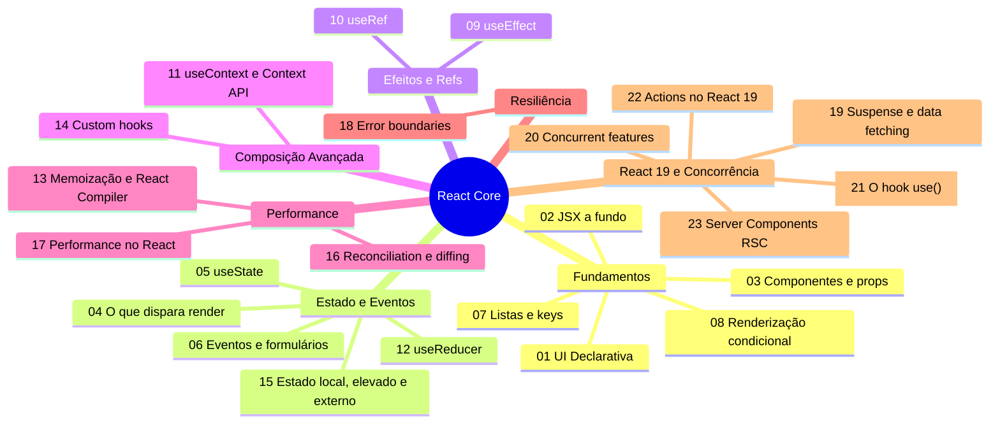
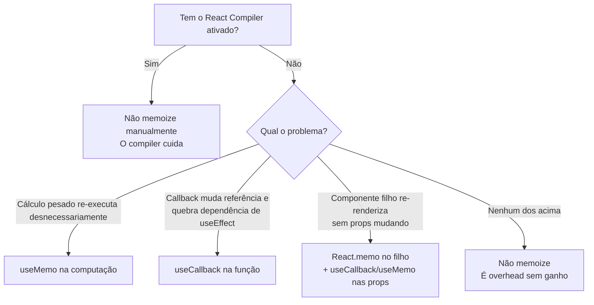
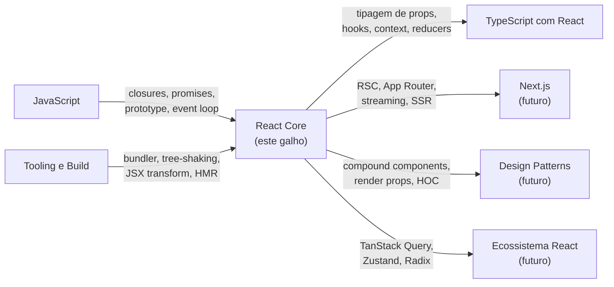

# Capstone — React na prática e em entrevista

> [!abstract] TL;DR
> React é a equação `UI = f(estado)` materializada: dado o estado atual, o framework sabe qual árvore de DOM deve existir — e cuida de chegar lá da forma mais eficiente via reconciliation e o algoritmo Fiber. Hooks tornaram esse modelo componível sem classes; React 19 estende a mesma lógica ao servidor (RSC) e à concorrência (transitions, Suspense, Actions), sem quebrar o modelo mental de base. Esta nota é o mapa final do galho: revisão em três fases, banco de perguntas de entrevista com resposta-modelo, decision points de sênior, e as pontes para o ecossistema ao redor.

---

Você chegou ao final de uma jornada de 23 notas sobre o núcleo do React. Não foi uma leitura de documentação — foi uma desmontagem e remontagem do framework peça por peça. Agora é hora de olhar para trás e enxergar o padrão que liga tudo: a equação declarativa que vai de `useState` a Server Components, de `useEffect` a Actions no React 19.

Este capstone tem três funções: **amarrar o conhecimento** acumulado em um modelo mental único, **prepará-lo para a entrevista técnica** com perguntas reais e respostas prontas, e **mostrar as pontes** para os galhos vizinhos que você vai percorrer a seguir.

---

## O modelo mental unificado

A ideia central do React cabe em uma linha:

```
UI = f(estado)
```

Dado um estado, há exatamente uma UI que deveria existir. O framework garante a convergência. Mas o que parece simples esconde três camadas de mecanismo:

### Camada 1 — O modelo de componentes

Tudo é função (ou era classe, mas o ecossistema migrou). Um componente recebe `props` (imutáveis por convenção) e usa `state` (gerenciado pelo React) para produzir JSX — que é açúcar sintático para `React.createElement()`. O JSX é transformado em uma árvore de elementos React (objetos literais), não em nós do DOM real.

### Camada 2 — Render → Reconciliation → Commit

Quando o estado muda, o React recalcula a árvore de elementos (render). O algoritmo Fiber compara essa nova árvore com a anterior (reconciliation / diffing) e determina a lista mínima de mudanças necessárias. Só então ele atualiza o DOM real (commit). A separação entre "calcular o que mudar" e "aplicar a mudança" é o que permite ao React pausar, priorizar e retomar trabalho — a base das concurrent features.

### Camada 3 — React 19: servidor e concorrência como primeiros cidadãos

O React 19 não quebrou o modelo — estendeu-o em dois eixos:

- **Server Components (RSC):** componentes que rodam no servidor, nunca chegam ao bundle cliente, têm acesso direto a dados e reduzem o JS enviado ao browser. O modelo `UI = f(estado)` vale, mas o "estado" pode ser os dados do banco de dados no servidor.
- **Actions e Transitions:** o trabalho assíncrono (envio de formulário, navegação) passa a ser gerenciado pelo React, que mantém o estado de pending, sucesso e erro de forma integrada. Junto com `use()` e Suspense, monta-se pipelines de data fetching declarativos sem useState manual.

---

## Mapa mental do galho



---

## Mapa de revisão por fase

### Iniciado — Fase 1: entender o modelo

| Nota | O que você aprende |
|------|--------------------|
| [[03-Dominios/Tecnologia/React/React core/01 - O que é React e a UI declarativa\|01 - O que é React e a UI declarativa]] | O problema que o React resolve; declarativo vs imperativo |
| [[03-Dominios/Tecnologia/React/React core/02 - JSX a fundo\|02 - JSX a fundo]] | JSX como açúcar sintático; `React.createElement`; regras de sintaxe |
| [[03-Dominios/Tecnologia/React/React core/03 - Componentes e props\|03 - Componentes e props]] | Componentes como funções; composição; props imutáveis |
| [[03-Dominios/Tecnologia/React/React core/04 - Renderização - o que dispara um render\|04 - Renderização - o que dispara um render]] | Quando o React re-renderiza; estado vs props; referências |
| [[03-Dominios/Tecnologia/React/React core/05 - useState e estado local\|05 - useState e estado local]] | O hook mais fundamental; batch de updates; closures de state |
| [[03-Dominios/Tecnologia/React/React core/06 - Eventos e formulários controlados\|06 - Eventos e formulários controlados]] | Controlled vs uncontrolled; synthetic events; handlers |
| [[03-Dominios/Tecnologia/React/React core/07 - Listas e keys\|07 - Listas e keys]] | Por que keys importam; diffing de listas; keys estáveis |
| [[03-Dominios/Tecnologia/React/React core/08 - Renderização condicional e composição\|08 - Renderização condicional e composição]] | Padrões de renderização condicional; composição com `children` |

### Adepto — Fase 2: dominar o mecanismo

| Nota | O que você aprende |
|------|--------------------|
| [[03-Dominios/Tecnologia/React/React core/09 - useEffect e o modelo de efeitos\|09 - useEffect e o modelo de efeitos]] | O modelo de sincronização; array de dependências; cleanup; armadilhas |
| [[03-Dominios/Tecnologia/React/React core/10 - useRef e refs\|10 - useRef e refs]] | Refs como escape hatch; acesso ao DOM; valores persistidos sem re-render |
| [[03-Dominios/Tecnologia/React/React core/11 - useContext e Context API\|11 - useContext e Context API]] | Prop drilling; Context como canal; quando não usar Context |
| [[03-Dominios/Tecnologia/React/React core/12 - useReducer e estado complexo\|12 - useReducer e estado complexo]] | Estado como máquina de estados; reducer puro; actions tipadas |
| [[03-Dominios/Tecnologia/React/React core/13 - Memoização - useMemo, useCallback, React.memo e o React Compiler\|13 - Memoização - useMemo, useCallback, React.memo e o React Compiler]] | Quando memoizar vale; referential equality; React Compiler como solução |
| [[03-Dominios/Tecnologia/React/React core/14 - Custom hooks\|14 - Custom hooks]] | Extração de lógica com estado; regras de hooks; reutilização |
| [[03-Dominios/Tecnologia/React/React core/15 - Estado - local, elevado e externo\|15 - Estado - local, elevado e externo]] | Árvore de estado; lifting; quando ir para biblioteca externa |

### Magus — Fase 3: React sob o capô e no servidor

| Nota | O que você aprende |
|------|--------------------|
| [[03-Dominios/Tecnologia/React/React core/16 - Reconciliation e diffing a fundo\|16 - Reconciliation e diffing a fundo]] | Algoritmo Fiber; heurísticas de diffing; por que type matters |
| [[03-Dominios/Tecnologia/React/React core/17 - Performance no React\|17 - Performance no React]] | Profiler; bundle splitting; lazy; as métricas que importam |
| [[03-Dominios/Tecnologia/React/React core/18 - Error boundaries\|18 - Error boundaries]] | Componentes de classe para captura de erros; reset de boundary |
| [[03-Dominios/Tecnologia/React/React core/19 - Suspense e data fetching no cliente\|19 - Suspense e data fetching no cliente]] | Suspense como mecanismo de fallback declarativo |
| [[03-Dominios/Tecnologia/React/React core/20 - Concurrent features\|20 - Concurrent features]] | useTransition; useDeferredValue; como o scheduler do Fiber funciona |
| [[03-Dominios/Tecnologia/React/React core/21 - O hook use()\|21 - O hook use()]] | `use(promise)` e `use(context)`; integração com Suspense |
| [[03-Dominios/Tecnologia/React/React core/22 - Actions no React 19\|22 - Actions no React 19]] | useFormStatus; useActionState; useOptimistic; form actions |
| [[03-Dominios/Tecnologia/React/React core/23 - Server Components (RSC)\|23 - Server Components (RSC)]] | Modelo RSC; client boundary; streaming; integração com Next.js |
| [[03-Dominios/Tecnologia/React/React core/24 - Arquitetura de componentes\|24 - Arquitetura de componentes]] | Colocation; composição; onde o estado mora; estrutura de pastas |
| [[03-Dominios/Tecnologia/React/React core/25 - Testing React\|25 - Testing React]] | Testing Library; testar comportamento, não implementação; user-event |

---

## Banco de perguntas de entrevista

### Tema 1 — Fundamentos

**P1: O que significa React ser declarativo? Qual a diferença prática para o imperativo?**

> **Resposta-modelo:** No paradigma imperativo, você descreve *como* mudar o DOM passo a passo (`document.getElementById(...).style.display = 'none'`). No declarativo, você descreve *o que* a UI deve parecer dado o estado atual, e o React cuida das operações de DOM necessárias para convergir para esse estado. A vantagem é previsibilidade: dado o mesmo estado, sempre obtemos o mesmo output, sem efeito colateral oculto.
>
> Ver: [[03-Dominios/Tecnologia/React/React core/01 - O que é React e a UI declarativa|01 - O que é React e a UI declarativa]]

---

**P2: O que é JSX? O que o transpilador faz com ele?**

> **Resposta-modelo:** JSX é açúcar sintático para `React.createElement(type, props, ...children)`. O transpilador (Babel / SWC / esbuild) converte cada tag JSX em uma chamada de função que retorna um objeto literal — o "elemento React". Com o JSX Transform do React 17+, não é mais necessário importar React no topo de cada arquivo; o runtime de JSX é injetado automaticamente.
>
> Ver: [[03-Dominios/Tecnologia/React/React core/02 - JSX a fundo|02 - JSX a fundo]]

---

**P3: Quando o React re-renderiza um componente?**

> **Resposta-modelo:** Em três situações: (1) o próprio estado do componente muda via `setState` / `dispatch`; (2) o componente pai re-renderiza e a referência de alguma prop mudou; (3) um contexto do qual o componente é assinante muda de valor. Re-render não significa atualização de DOM — é apenas a fase de calcular o novo JSX; a atualização real depende do resultado do diffing.
>
> Ver: [[03-Dominios/Tecnologia/React/React core/04 - Renderização - o que dispara um render|04 - Renderização - o que dispara um render]]

---

**P4: Explique o ciclo render → reconciliation → commit.**

> **Resposta-modelo:** **Render** é a fase em que o React chama as funções de componente e monta a nova árvore de elementos (virtual DOM). **Reconciliation** é a comparação entre a árvore nova e a anterior usando o algoritmo Fiber — ele descobre quais nós foram adicionados, removidos ou alterados. **Commit** é quando o React aplica essas mudanças ao DOM real; é a única fase que tem efeito colateral visível. Efeitos (`useEffect`) rodam após o commit.
>
> Ver: [[03-Dominios/Tecnologia/React/React core/16 - Reconciliation e diffing a fundo|16 - Reconciliation e diffing a fundo]]

---

### Tema 2 — Hooks e estado

**P5: Qual a diferença entre `useState` e `useReducer`? Quando usar cada um?**

> **Resposta-modelo:** `useState` é adequado para estado simples e independente (um booleano, uma string, um número). `useReducer` é preferível quando: há múltiplos campos de estado que mudam juntos; as transições entre estados têm lógica condicional; o próximo estado depende do anterior de formas complexas; ou você quer modelar o estado como máquina explícita (cada action tem um nome, o reducer é puro e testável em isolamento).
>
> Ver: [[03-Dominios/Tecnologia/React/React core/05 - useState e estado local|05 - useState e estado local]] · [[03-Dominios/Tecnologia/React/React core/12 - useReducer e estado complexo|12 - useReducer e estado complexo]]

---

**P6: O que é o modelo de sincronização do `useEffect`? Qual a diferença entre `useEffect` sem array, com array vazio e com dependências?**

> **Resposta-modelo:** `useEffect` sincroniza um efeito externo com o estado do componente — é "o React notificando que o estado mudou, agora sincronize o mundo externo". Sem array: roda após todo render. Com `[]`: roda uma vez após o primeiro render (equivalente a mount). Com dependências `[a, b]`: roda após qualquer render em que `a` ou `b` mudaram (comparação por `Object.is`). O cleanup da função retornada roda antes do efeito seguinte ou no unmount — é o que evita memory leaks.
>
> Ver: [[03-Dominios/Tecnologia/React/React core/09 - useEffect e o modelo de efeitos|09 - useEffect e o modelo de efeitos]]

---

**P7: O que é `useRef`? Qual a diferença para `useState`?**

> **Resposta-modelo:** `useRef` retorna um objeto `{ current: valor }` que persiste entre renders. A diferença crucial: mudar `ref.current` *não dispara re-render*. `useState` dispara. Use `useRef` para: guardar referência a nós do DOM; persistir valores mutáveis entre renders sem causar re-render (timers, instâncias de bibliotecas); guardar o valor anterior de um estado para comparação.
>
> Ver: [[03-Dominios/Tecnologia/React/React core/10 - useRef e refs|10 - useRef e refs]]

---

**P8: Quando usar `useMemo` / `useCallback` / `React.memo`? E o que é o React Compiler?**

> **Resposta-modelo:** Memoização só vale quando o custo de recomputar é real (cálculos pesados, componentes caros) **e** a referência é usada em comparação de dependências de outro hook ou em props de componente memoizado. O erro comum é memoizar tudo "por precaução" — além de não ajudar, adiciona overhead de cache. O React Compiler (antigo React Forget), disponível no React 19, resolve esse problema automaticamente: analisa o código em tempo de build e injeta as memoizações corretas, eliminando a necessidade da maioria dos usos manuais.
>
> Ver: [[03-Dominios/Tecnologia/React/React core/13 - Memoização - useMemo, useCallback, React.memo e o React Compiler|13 - Memoização - useMemo, useCallback, React.memo e o React Compiler]]

---

### Tema 3 — Performance e internos

**P9: O que é o algoritmo de diffing do React? Quais são suas heurísticas principais?**

> **Resposta-modelo:** O Fiber usa um algoritmo O(n) (não O(n³) como o ótimo teórico) baseado em duas heurísticas: (1) elementos de tipos diferentes são sempre substituídos — nunca reutilizados; (2) a propriedade `key` identifica elementos em listas — o algoritmo usa keys para mapear elementos da árvore antiga à nova. Sem keys estáveis em listas, o React assume que a posição é a identidade, o que causa bugs de estado em componentes controlados.
>
> Ver: [[03-Dominios/Tecnologia/React/React core/16 - Reconciliation e diffing a fundo|16 - Reconciliation e diffing a fundo]] · [[03-Dominios/Tecnologia/React/React core/07 - Listas e keys|07 - Listas e keys]]

---

**P10: O que são Concurrent Features? O que `useTransition` faz?**

> **Resposta-modelo:** Concurrent Mode é a capacidade do React de pausar, retomar e abortar trabalho de render com base em prioridade. `useTransition` marca uma atualização de estado como "não urgente" — o React pode interromper o render dessa transição se uma atualização urgente (digitação, clique) chegar. O resultado: a UI responde imediatamente a interações do usuário enquanto atualizações pesadas (busca, filtragem de grandes listas) acontecem ao fundo, sem bloquear o thread principal.
>
> Ver: [[03-Dominios/Tecnologia/React/React core/20 - Concurrent features|20 - Concurrent features]]

---

### Tema 4 — React 19 e arquitetura moderna

**P11: O que são Server Components? Qual a diferença para Client Components?**

> **Resposta-modelo:** Server Components (RSC) são componentes que rodam exclusivamente no servidor (ou em build time). Eles nunca chegam ao bundle JavaScript do cliente — apenas o HTML/payload de dados resultante é enviado. Não têm estado (`useState`) nem efeitos (`useEffect`); são funções async que podem acessar banco de dados, filesystem e APIs internas diretamente. Client Components (marcados com `'use client'`) rodam no browser, têm estado e interatividade. A fronteira é explícita e unidirecional: um Server Component pode importar Client Components, mas não o contrário.
>
> Ver: [[03-Dominios/Tecnologia/React/React core/23 - Server Components (RSC)|23 - Server Components (RSC)]]

---

**P12: O que é `Suspense`? Como ele se integra com data fetching?**

> **Resposta-modelo:** Suspense é um componente que exibe um fallback enquanto seu subárvore "suspende" — ou seja, enquanto algum componente filho joga uma Promise não resolvida. O React captura essa Promise, renderiza o fallback, e re-renderiza a subárvore quando a Promise resolve. Com RSC e frameworks como Next.js App Router, o padrão emergente é: componentes async fazem `await fetch(...)` diretamente, Suspense envolve a UI que depende desses dados, e o streaming HTTP entrega partes da página progressivamente.
>
> Ver: [[03-Dominios/Tecnologia/React/React core/19 - Suspense e data fetching no cliente|19 - Suspense e data fetching no cliente]]

---

**P13: O que são Actions no React 19? O que `useActionState` e `useOptimistic` fazem?**

> **Resposta-modelo:** Actions são funções assíncronas associadas a forms (via `action={...}`) ou chamadas manualmente em transições. O React gerencia automaticamente o ciclo de vida: pending, sucesso, erro. `useActionState` retorna `[state, dispatch, isPending]` para uma action — substitui o padrão manual com `useState` + `useEffect` para feedback de formulário. `useOptimistic` aplica uma atualização "otimista" ao estado imediatamente, antes da confirmação do servidor, e reverte automaticamente em caso de erro.
>
> Ver: [[03-Dominios/Tecnologia/React/React core/22 - Actions no React 19|22 - Actions no React 19]]

---

**P14: O que são Error Boundaries? Por que ainda usam componentes de classe?**

> **Resposta-modelo:** Error Boundaries são componentes que capturam erros JavaScript em qualquer descendente durante render, em lifecycle methods e em construtores — exibindo uma UI de fallback em vez de uma tela em branco. Ainda precisam ser componentes de classe porque dependem dos lifecycle methods `static getDerivedStateFromError` (captura o erro) e `componentDidCatch` (efeito para logging). O React ainda não expôs equivalente via hooks — embora `react-error-boundary` (biblioteca) embrulhe a classe numa API mais ergonômica.
>
> Ver: [[03-Dominios/Tecnologia/React/React core/18 - Error boundaries|18 - Error boundaries]]

---

**P15: Qual a diferença entre formulário controlado e não-controlado?**

> **Resposta-modelo:** Em um formulário **controlado**, o valor do input é sempre derivado do estado React (`value={state}`) e cada mudança atualiza o estado (`onChange`). O React é a "fonte da verdade". Em um **não-controlado**, o DOM mantém o próprio valor e você acessa via `ref.current.value` somente quando necessário (ex: no submit). Controlado dá mais controle (validação em tempo real, máscaras), mas gera um re-render por tecla. Não-controlado é mais simples para formulários grandes onde validação só importa no submit — é a abordagem que libraries como React Hook Form favorecem internamente.
>
> Ver: [[03-Dominios/Tecnologia/React/React core/06 - Eventos e formulários controlados|06 - Eventos e formulários controlados]]

---

## Decision points — o que um sênior sabe

### `useState` vs `useReducer` vs estado externo

```
Estado simples independente
    └─► useState

Estado com múltiplos campos inter-relacionados
  ou lógica de transição condicional
    └─► useReducer

Estado compartilhado entre muitos componentes
  distantes na árvore
    └─► Context API (se atualização pouco frequente)
      ou biblioteca externa (Zustand, Jotai, Redux Toolkit)
          └─► Se precisa de cache de servidor: TanStack Query / SWR
```

Ver: [[03-Dominios/Tecnologia/React/React core/15 - Estado - local, elevado e externo|15 - Estado - local, elevado e externo]]

---

### Quando memoizar — e quando deixar o React Compiler fazer



---

### Client Component vs Server Component

| Preciso de... | Use |
|---------------|-----|
| `useState`, `useEffect`, hooks | Client Component |
| Interatividade (click, input, formulário) | Client Component |
| Acesso a browser APIs (localStorage, window) | Client Component |
| Acesso a banco de dados, filesystem, secrets | Server Component |
| Reduzir bundle JS do cliente | Server Component |
| Componente grande e não-interativo | Server Component |
| Ambos | Server Component como shell + Client Component na parte interativa |

Ver: [[03-Dominios/Tecnologia/React/React core/23 - Server Components (RSC)|23 - Server Components (RSC)]]

---

### Suspense vs loading manual com `useState`

Antes do Suspense, o padrão era:
```tsx
const [data, setData] = useState(null);
const [loading, setLoading] = useState(true);
const [error, setError] = useState(null);

useEffect(() => {
  fetch(url)
    .then(r => r.json())
    .then(setData)
    .catch(setError)
    .finally(() => setLoading(false));
}, [url]);

if (loading) return <Spinner />;
if (error) return <ErrorUI />;
return <UI data={data} />;
```

Com Suspense + RSC (ou TanStack Query / SWR com suporte a Suspense):
```tsx
// Componente filho "suspende" automaticamente enquanto carrega
// O Suspense pai exibe o fallback
// Error Boundary captura erros

<ErrorBoundary fallback={<ErrorUI />}>
  <Suspense fallback={<Spinner />}>
    <AsyncComponent />  {/* ou <ClientComponent queryKey={...} /> */}
  </Suspense>
</ErrorBoundary>
```

A vantagem não é menos código — é **composabilidade**: o loading state sobe para o nível certo na árvore, sem drilling de props de loading.

---

## Como explicar em inglês

### Hooks

> "Hooks are functions that let you 'hook into' React state and lifecycle from function components. Before hooks, you needed class components for that. `useState` gives you local state, `useEffect` lets you synchronize with external systems, and custom hooks let you extract and reuse stateful logic without changing the component hierarchy."

### Render e reconciliation

> "When state changes, React re-runs the component function to produce a new element tree — that's the render phase. It then compares the new tree to the previous one using the Fiber reconciler, which figures out the minimum set of DOM operations needed — that's reconciliation. Finally, in the commit phase, React applies those changes to the actual DOM."

### `useEffect` (armadilha clássica de entrevista)

> "useEffect is not a lifecycle hook — it's a synchronization mechanism. You're telling React: 'whenever these values change, run this side effect to sync the outside world.' The cleanup function runs before the next effect and on unmount, which is how you prevent memory leaks. The biggest mistake is thinking in terms of mount/unmount instead of dependencies."

### Server Components

> "React Server Components run on the server and never ship to the client bundle. They can be async functions that await database queries directly. Only the resulting HTML or a lightweight payload is sent to the browser. Client Components — anything that needs state, effects, or browser APIs — are marked with 'use client' and run in the browser as usual. The boundary is explicit and unidirectional."

### Performance

> "React's rendering is already optimized by default through the Fiber scheduler and batched updates. Manual memoization with `useMemo`, `useCallback`, and `React.memo` is only worth it when you have a concrete performance problem — premature memoization adds overhead. With the React Compiler, most of this is handled automatically at build time."

---

### Tabela PT ↔ EN consolidada

| PT | EN |
|----|-----|
| Renderização | Rendering |
| Reconciliação | Reconciliation |
| Árvore de componentes | Component tree |
| Estado local | Local state |
| Estado elevado | Lifted state |
| Efeito colateral | Side effect |
| Componente controlado | Controlled component |
| Componente não-controlado | Uncontrolled component |
| Memorização / memoização | Memoization |
| Limite de erro | Error boundary |
| Componente de servidor | Server Component |
| Componente de cliente | Client Component |
| Carregamento sob demanda | Lazy loading |
| Divisão de código | Code splitting |
| Transição concorrente | Concurrent transition |
| Fallback de suspense | Suspense fallback |
| Atualização otimista | Optimistic update |
| Ação de formulário | Form action |
| Gancho personalizado | Custom hook |
| Prop drilling | Prop drilling (sem tradução consolidada) |
| Referência | Ref |
| Dispatcher | Dispatcher |
| Redutor | Reducer |
| Despachar | Dispatch |
| Hidratação | Hydration |
| Streaming | Streaming |

---

## Armadilhas comuns

> [!warning] `useEffect` com dependência faltante provoca bugs de closure
> **O que acontece:** o efeito usa um valor do estado ou prop mas não o inclui no array de dependências. O efeito "enxerga" apenas o valor do primeiro render — a chamada `staleProps` / `staleClosure`. **Por quê:** funções de componente criam um novo fechamento a cada render. `useEffect` captura aquele fechamento. Se a dependência não está no array, o React não re-executa o efeito quando o valor muda. **Como evitar:** use o ESLint plugin `react-hooks/exhaustive-deps` (recomendado pela equipe do React) e nunca ignore os warnings manualmente sem entender o motivo. Se a função precisa ser estável, use `useCallback`; se for um valor, inclua-o nas deps.

---

> [!warning] Index de array como `key` em listas que reordenam ou filtram
> **O que acontece:** ao filtrar ou reordenar uma lista, o React reutiliza os componentes errados (a posição bateu, mas o dado é outro). Campos de input controlados exibem o valor do item anterior. Animações disparam no item errado. **Por quê:** a `key` é o identificador do elemento para o algoritmo de reconciliation. Se você usa o index, e o array muda de ordem, o mesmo index agora aponta para um dado diferente — mas o React pensa que é o mesmo elemento. **Como evitar:** use um identificador estável e único do dado (ex: `item.id`). Só use index como chave quando a lista é estática e nunca reordena ou filtra.

---

> [!warning] Memoização prematura sem problema de performance real
> **O que acontece:** wrapping de funções em `useCallback` e valores em `useMemo` sem profiling. O resultado é código mais complexo, mais difícil de ler, e — por ironia — potencialmente mais lento (o cache do hook também tem custo). **Por quê:** memoização não é gratuita. O React precisa comparar as dependências a cada render para decidir se retorna o valor cacheado. Para cálculos baratos, esse overhead supera o ganho. **Como evitar:** perfil primeiro com React DevTools Profiler. Memoize apenas quando houver evidência de problema. Considere ativar o React Compiler, que resolve isso automaticamente em React 19+.

---

> [!warning] `useEffect` para sincronizar estado derivado
> **O que acontece:** `useEffect` escuta uma prop e faz `setState` do valor derivado. Isso provoca dois renders onde bastaria um — e é propício a loops infinitos. **Por quê:** estado derivado de outra prop ou estado não precisa de `useEffect`. O cálculo pode acontecer diretamente no corpo do componente. **Como evitar:** calcule o valor derivado diretamente na função do componente. Se o cálculo for caro, use `useMemo`. Reserve `useEffect` para sincronizar com sistemas **externos** ao React (DOM, WebSockets, timers, APIs), não para derivar estado interno.

---

> [!warning] Mudar o `type` do componente na árvore destrói o estado
> **O que acontece:** ao renderizar `<Input />` condicionalmente e trocar para `<TextArea />` (ou qualquer tipo diferente) na mesma posição da árvore, o React desmonta o componente anterior e monta um novo — o estado interno é destruído. **Por quê:** o algoritmo Fiber usa o `type` do elemento como primeiro critério de identidade. Tipos diferentes na mesma posição = elementos diferentes. **Como evitar:** se precisar preservar estado entre dois tipos de componente, use uma `key` explícita e mantenha o estado no componente pai (elevação de estado). Ou use o mesmo tipo de componente com props que controlam a renderização interna.

---

## Onde o galho se conecta aos vizinhos



### JavaScript — a fundação

React é JavaScript. Closures explicam por que `useEffect` captura valores stale. Promises e async/await são o mecanismo por baixo do Suspense e das Actions. O event loop explica por que o estado é assíncrono. O módulo de [[03-Dominios/Tecnologia/JavaScript/index|JavaScript]] cobre as bases que fazem o comportamento do React ser previsível em vez de mágico.

### Tooling e Build — o que transforma seu código

O JSX que você escreve não roda no browser — passa por um transpilador (SWC / Babel / esbuild). O bundler (Vite / webpack) resolve os módulos, faz tree-shaking e gera os chunks para lazy loading. O módulo de [[03-Dominios/Tecnologia/Tooling e Build/index|Tooling e Build]] explica por que `import('./Lazy')` funciona e como configurar o ambiente de desenvolvimento.

### TypeScript com React — tipos como documentação viva

Componentes sem tipos são caixas pretas. O galho [[03-Dominios/Tecnologia/React/TypeScript com React/index|TypeScript com React]] cobre a tripla inferência (props / state / hooks), como tipar reducers como discriminated unions, generic components e a razão pela qual `React.FC` saiu de moda. É o complemento natural deste galho para qualquer código de produção.

### Next.js (futuro)

O App Router do Next.js 13+ é a materialização mais completa do modelo RSC + Suspense + Actions. Rotas são Server Components por padrão; Client Components são opt-in; data fetching acontece no nível do componente. Entender este galho é pré-requisito para o Next.js não parecer magia.

### Design Patterns (futuro)

Compound components, render props, higher-order components, slots — padrões de composição avançada que resolvem problemas recorrentes em bibliotecas de componentes. Aprendê-los após este galho é natural: você já tem o vocabulário (hooks, context, refs) para entender por que esses padrões existem.

### Ecossistema React (futuro)

TanStack Query, Zustand, Jotai, Radix UI, React Hook Form — bibliotecas que resolvem problemas específicos que o React core não resolve. Entender este galho torna claro *por que* essas bibliotecas existem e *quando* usá-las em vez de construir sua própria solução.

---

## Veja também

- [[03-Dominios/Tecnologia/React/Dicionário de React|Dicionário de React]] — glossário completo dos termos do ecossistema
- [[03-Dominios/Tecnologia/React/React Red Flag Manual|React Red Flag Manual]] — catálogo de anti-padrões para review de código
- [[03-Dominios/Tecnologia/React/TypeScript com React/index|TypeScript com React]] — tipagem de componentes, hooks e contextos

---

## Resumo em uma frase

React é a equação `UI = f(estado)` — componentes puros, estado gerenciado pelo framework, reconciliation eficiente e, no React 19, a mesma lógica estendida ao servidor e à concorrência.

---

## Fontes

- **React Team** — [*React Docs (react.dev)*](https://react.dev) — documentação oficial; referência canônica para hooks, Server Components e React 19 APIs
- **Dan Abramov** — [*A Complete Guide to useEffect*](https://overreacted.io/a-complete-guide-to-useeffect/) — artigo de referência sobre o modelo de sincronização do useEffect
- **React Team** — [*React Labs: What We've Been Working On (2024)*](https://react.dev/blog/2024/02/15/react-labs-what-we-have-been-working-on-february-2024) — visão geral do React Compiler e React 19
