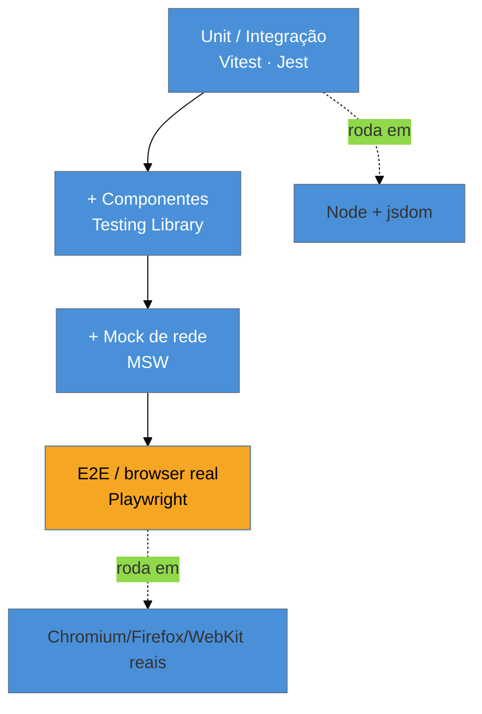

# O cenário de testes JS

> [!abstract] TL;DR
> O ecossistema de testes JS se organiza em camadas, cada uma com sua ferramenta dominante em 2026: **unit/integração** com **Vitest** (2–4× mais rápido que o Jest e default para novos projetos desde 2025) ou **Jest** (legacy, mas ainda ~metade dos testes no npm, mantido pela Meta); **componentes** com **Testing Library**; **mock de rede** com **MSW**; e **E2E** com **Playwright** (que destronou o Cypress). Este galho é o *ferramental* — a *teoria* (pirâmide, doubles, TDD) vive em [[03-Dominios/Engenharia/Testes/index|Engenharia/Testes]]. Regra de ouro do stack: Vitest para o que roda em Node/jsdom, Playwright para o que precisa de um browser de verdade.

## O problema: "qual ferramenta de teste eu uso?"

Um dev que vem de outra stack (ou volta ao front depois de um tempo) abre o ecossistema JS de testes e se afoga: Jest, Vitest, Mocha, Jasmine, Testing Library, Enzyme (morto), Cypress, Playwright, MSW, Nock, Sinon... Quais são atuais? Quais competem entre si e quais se **combinam**? Escolher errado significa reescrever a suíte depois, ou lutar contra uma ferramenta em declínio.

A confusão vem de misturar **camadas**. "Ferramenta de teste" não é uma categoria — são várias, e você usa **uma de cada**, juntas. Um test runner (Vitest) não compete com uma lib de mock de rede (MSW) nem com um framework E2E (Playwright); eles se **empilham**. Entender esse mapa é o pré-requisito de todo o galho: antes de aprender a *usar* cada ferramenta, você precisa saber *qual* usar e *por quê*.

## As camadas do stack

Cada camada responde a uma pergunta diferente da pirâmide de testes (ver [[03-Dominios/Engenharia/Testes/02 - A pirâmide de testes e suas variações|Engenharia/Testes 02]]):

| Camada | Ferramenta 2026 | Pergunta que responde | Onde roda |
|--------|-----------------|-----------------------|-----------|
| **Test runner** (unit/integração) | **Vitest** (ou Jest) | "esta função/módulo faz o certo?" | Node + jsdom |
| **Componentes** | **Testing Library** | "este componente renderiza e reage certo?" | Node + jsdom (via runner) |
| **Mock de rede** | **MSW** | "e quando a API responde X?" | intercepta no runner ou browser |
| **E2E** | **Playwright** | "o fluxo inteiro funciona no browser real?" | Chromium/Firefox/WebKit |

Repare: Testing Library e MSW **rodam dentro** do Vitest/Jest — não são runners, são bibliotecas que você usa nos seus testes. Playwright é o único que traz seu próprio runner e um browser de verdade.

## Vitest vs Jest: a decisão do runner

A única escolha "ou/ou" real do stack é o **test runner**, e em 2026 ela está praticamente decidida para projetos novos.

- **Vitest** nasceu do ecossistema **Vite** e é **nativo de ESM**. Ele reusa a config e o pipeline de transformação do Vite, então "simplesmente funciona" com TS, JSX e aliases sem configuração extra. É **2–4× mais rápido** que o Jest em projetos reais (cold start ~6× mais rápido, graças ao ESM nativo), e sua API é **compatível com a do Jest** (`describe`/`it`/`expect`), o que torna a migração quase mecânica. Virou o **default para novos projetos** (sobretudo Vite/React) desde ~2025.
- **Jest**, mantido pela **Meta**, foi o padrão da década e ainda roda **cerca de metade dos testes** publicados no npm. É maduríssimo e continua uma escolha sólida — mas carrega o peso de um mundo pré-ESM (transformações via Babel, config mais pesada). Em 2026 é essencialmente **legacy**: ótimo se você já o tem, raramente a escolha para começar do zero.

> [!question]- Se a API é a mesma, "Vitest é só um Jest mais rápido"?
> Em grande parte, sim — e é de propósito. O Vitest adotou a API do Jest justamente para que a migração fosse trivial e o conhecimento fosse transferível: `describe`, `it`/`test`, `expect`, os matchers, os hooks — tudo igual. As diferenças reais estão **por baixo**: o Vitest é ESM-first e integrado ao Vite (config unificada, HMR nos testes em watch), enquanto o Jest gira em torno de transformações CommonJS/Babel. Na prática, o que você aprende de escrita de teste vale para os dois; o que muda é a *config*, a *velocidade* e o namespace de mocking (`vi` no Vitest, `jest` no Jest). Por isso este galho ensina com **Vitest** como default, apontando o equivalente Jest onde diverge.

## Onde este galho começa e termina

A confusão mais cara é achar que "aprender a testar em JS" é aprender a teoria. Não é — a teoria já está feita, e é agnóstica de stack:

- **A teoria** (o que testar, a pirâmide, test doubles, TDD, design de caso, flaky e coverage *conceituais*) vive em [[03-Dominios/Engenharia/Testes/index|Engenharia/Testes]]. Não vamos reescrevê-la; vamos **instrumentá-la**.
- **Este galho** é o **ferramental**: como configurar o Vitest, escrever asserções, mockar com `vi`, testar componentes com Testing Library, interceptar rede com MSW, rodar E2E com Playwright, medir cobertura e domar flaky *com as ferramentas*.
- O galho-**paralelo** é [[03-Dominios/Tecnologia/Java/Testes/index|Java/Testes]] — o mesmo papel, para o stack Java. E o `node:test` nativo e o panorama de runners estão em [[03-Dominios/Tecnologia/Tooling e Build/19 - Test runner nativo (node-test) e o cenário de testes|Tooling 19]].

> [!warning] Escolher a ferramenta antes de entender a camada
> **O que acontece:** o time decide "vamos usar Cypress para tudo" ou "Jest resolve", e meses depois luta para testar o que a ferramenta não cobre bem (unit lento no Cypress, E2E frágil no jsdom). **Por quê:** nenhuma ferramenta cobre todas as camadas bem. Runner (Vitest) é para unit/integração rápidos; E2E (Playwright) é para o fluxo no browser. Forçar uma na camada errada gera testes lentos, frágeis ou impossíveis. **Como evitar:** escolha **por camada**, não por preferência única. O stack saudável combina Vitest + Testing Library + MSW + Playwright — cada um no seu papel. Este galho segue exatamente essa ordem.

**O cenário de testes JS em uma frase:** o stack se empilha por camada — Vitest (ou Jest legacy) para unit/integração, Testing Library para componentes, MSW para rede, Playwright para E2E —, e este galho ensina o *ferramental* de cada camada, deixando a *teoria* para [[03-Dominios/Engenharia/Testes/index|Engenharia/Testes]].

## Em entrevista

> "The JS testing stack layers by concern. For unit and integration I use **Vitest** — it's ESM-native, 2 to 4 times faster than Jest, and the default for new projects, though its API is Jest-compatible so migration is trivial. **Jest** is still around, maintained by Meta and running about half of npm's tests, but it's legacy for new work. For components I add **Testing Library**, for network mocking **MSW**, and for end-to-end I use **Playwright**, which has largely replaced Cypress. The rule of thumb: Vitest for anything that runs in Node or jsdom, Playwright for anything that needs a real browser."

| PT | EN |
|----|----|
| Executor de testes | Test runner |
| Testes de ponta a ponta | End-to-end (E2E) tests |
| Mock de rede | Network mocking |
| Legado | Legacy |
| Nativo de ESM | ESM-native |
| Empilhar (camadas) | To stack (layers) |

## O que vem a seguir

Definido o mapa, começamos pela camada base — o test runner. E como o Vitest é o default de 2026, o próximo passo é pô-lo para rodar: instalar, configurar e escrever o primeiro teste que passa.

- [[03-Dominios/Tecnologia/Testes JS/02 - Vitest - setup e o primeiro teste|02 — Vitest: setup e o primeiro teste]] — config Vite-native e o primeiro `test`.
- [[03-Dominios/Engenharia/Testes/02 - A pirâmide de testes e suas variações|Engenharia/Testes 02]] — a pirâmide que estas camadas materializam, como base.

## Fontes

- **Vitest** — [*Comparisons with other test runners*](https://vitest.dev/guide/comparisons.html) — Vitest vs Jest e o posicionamento no ecossistema.
- **State of JS** — [stateofjs.com — testing](https://stateofjs.com/) — adoção de Jest, Vitest, Playwright e Testing Library.
- **Playwright / MSW** — [playwright.dev](https://playwright.dev/) · [mswjs.io](https://mswjs.io/) — as ferramentas das camadas E2E e de rede.
