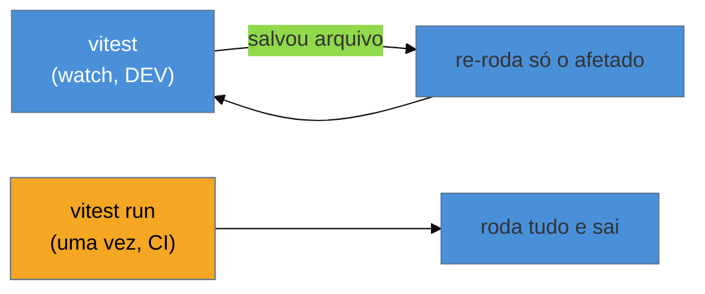

# Vitest: setup e o primeiro teste

> [!abstract] TL;DR
> Instalar o Vitest é `npm i -D vitest` e adicionar `"test": "vitest"` no `package.json`. Um arquivo `*.test.ts` com `test('...', () => { expect(...).toBe(...) })` já roda — o Vitest **reusa a config do Vite**, então TS, JSX e aliases funcionam sem setup extra. `vitest` roda em **modo watch** por padrão (re-executa só o que mudou); `vitest run` roda uma vez (para CI). Para testar componentes você define o `environment: 'jsdom'`. O primeiro teste que passa é o "hello world" que destrava todo o resto do galho.

## O problema: da teoria ao primeiro teste verde

Você entendeu o mapa (nota 01) e sabe que vai usar o Vitest. Mas entre "vou usar o Vitest" e "tenho um teste rodando" há uma série de decisões de setup que travam iniciantes: onde ponho o arquivo? preciso configurar TypeScript? por que o terminal fica "preso" depois de rodar? como testo algo que usa o DOM?

A boa notícia é que o Vitest foi desenhado para minimizar exatamente essa fricção — ele herda quase tudo do Vite. Esta nota leva você do zero ao primeiro teste verde, que é o gesto fundador de toda suíte.

## Instalação e o primeiro teste

```bash
npm install -D vitest
```

No `package.json`:

```json
{
  "scripts": {
    "test": "vitest",
    "test:run": "vitest run"
  }
}
```

Agora um arquivo — o Vitest descobre automaticamente arquivos com `.test.` ou `.spec.` no nome:

```ts
// soma.ts
export function soma(a: number, b: number) {
  return a + b;
}

// soma.test.ts
import { expect, test } from 'vitest';
import { soma } from './soma';

test('soma dois números', () => {
  expect(soma(2, 3)).toBe(5);
});
```

`npm test` e você tem o primeiro verde. Três peças compõem esse teste, e elas são a gramática de *todo* teste (e são iguais no Jest):

- **`test(nome, fn)`** (ou o alias `it`) — declara um caso de teste. O `nome` descreve o comportamento esperado.
- **`expect(valor)`** — envolve o valor real que você quer verificar.
- **`.toBe(esperado)`** — o **matcher**: a afirmação sobre o valor (assunto da nota 03).

Isso é o padrão **AAA** (Arrange-Act-Assert) da [[03-Dominios/Engenharia/Testes/03 - Anatomia de um bom teste|Engenharia/Testes 03]] em forma mínima: arranje (`soma`), aja (`soma(2,3)`), afirme (`expect().toBe()`).

## Por que "simplesmente funciona": a herança do Vite

O que torna o Vitest tão leve de configurar é que ele **reusa o pipeline do Vite**. Se o seu projeto já usa Vite (React, Vue, Svelte modernos), o Vitest lê a **mesma** `vite.config` — os mesmos plugins, aliases, transformação de TS/JSX. Você não configura TypeScript de novo, não instala Babel, não mapeia `@/` duas vezes.

```ts
// vitest.config.ts (ou dentro do vite.config.ts, na chave "test")
import { defineConfig } from 'vitest/config';

export default defineConfig({
  test: {
    globals: true,            // usar test/expect sem importar (estilo Jest)
    environment: 'node',      // 'jsdom' para testar DOM/componentes (nota 08)
  },
});
```

Duas opções que você vai tocar cedo:

- **`globals: true`** deixa você usar `test`/`expect`/`describe` **sem importar** em cada arquivo (como o Jest faz por padrão). Sem isso, você importa de `'vitest'` — mais explícito, preferido por muitos. Se ligar, adicione `"types": ["vitest/globals"]` no `tsconfig` para o TS reconhecer.
- **`environment`** define **onde** o teste roda: `'node'` (padrão, sem DOM) ou `'jsdom'`/`'happy-dom'` (simula um DOM para testar componentes — nota 08).

## Watch mode: a peça que confunde no começo



Rodar `vitest` (via `npm test`) entra em **modo watch**: ele roda os testes e **fica observando** os arquivos, re-executando *só os testes afetados* por cada mudança que você salvar. Isso é ótimo no desenvolvimento (feedback instantâneo), mas confunde quem espera o comando "terminar" — ele não termina de propósito.

Para CI e scripts, use **`vitest run`**: roda a suíte uma vez e sai com código 0 (passou) ou 1 (falhou). Confundir os dois é a causa nº 1 de "meu CI trava para sempre".

> [!warning] Rodar `vitest` (watch) no CI
> **O que acontece:** o pipeline de CI fica "pendurado" indefinidamente e estoura o timeout, mesmo com todos os testes passando.
> **Por quê:** `vitest` sem `run` entra em modo watch e **nunca sai** — ele espera por mudanças de arquivo que nunca virão no CI.
> **Como evitar:** use **`vitest run`** em qualquer ambiente não-interativo (CI, hooks de git, scripts). Deixe o `vitest` watch só para o `npm test` local, ou nomeie os scripts explicitamente (`test` = watch, `test:run`/`test:ci` = `vitest run`).

> [!question]- Preciso de `vitest.config` separado ou uso o `vite.config`?
> Se você já tem um `vite.config`, pode adicionar a chave `test` **nele mesmo** — o Vitest a lê. Só precisa do `/// <reference types="vitest/config" />` (ou importar `defineConfig` de `'vitest/config'`) para o TypeScript aceitar a chave `test`. Um `vitest.config.ts` separado só faz sentido quando você quer config de teste divergente da de build. Para a maioria, **um arquivo só** é o caminho — é justamente a vantagem de o Vitest herdar o Vite. Projetos sem Vite (uma lib Node pura) usam um `vitest.config.ts` mínimo, e ainda assim ganham ESM/TS sem Babel.

**Vitest setup em uma frase:** `npm i -D vitest`, um script `"test": "vitest"`, e um arquivo `*.test.ts` com `test`/`expect` já rodam porque o Vitest herda a config do Vite — lembrando de usar `vitest run` (não o watch) na CI e `environment: 'jsdom'` quando for testar o DOM.

## Em entrevista

> "Setting up Vitest is minimal because it reuses the Vite config — TypeScript, JSX, and aliases just work, no Babel. I install it, add a `test` script, and write a `.test.ts` file with `test` and `expect`. The one gotcha: `vitest` runs in **watch mode** by default, which is great locally but hangs forever in CI — there you use `vitest run`. And to test components I set `environment: 'jsdom'`. I usually keep a single config file with a `test` key rather than a separate one."

| PT | EN |
|----|----|
| Modo observação | Watch mode |
| Ambiente de teste | Test environment |
| Descoberta de arquivos | File discovery |
| Globais (test/expect sem importar) | Globals |
| Herdar a config | Inherit the config |
| Rodar uma vez | Single run |

## O que vem a seguir

O primeiro teste usou `.toBe`. Mas `.toBe` é só um dos muitos **matchers**, e escolher o certo (igualdade referencial vs. estrutural, objetos, exceções, promises) é o que torna as asserções precisas e as mensagens de falha úteis. É a próxima nota.

- [[03-Dominios/Tecnologia/Testes JS/03 - Matchers e asserções|03 — Matchers e asserções]] — a API do `expect` a fundo.
- [[03-Dominios/Engenharia/Testes/03 - Anatomia de um bom teste|Engenharia/Testes 03]] — o AAA e o naming, como base.

## Fontes

- **Vitest** — [*Getting Started*](https://vitest.dev/guide/) — instalação, primeiro teste e config.
- **Vitest** — [*Configuring Vitest*](https://vitest.dev/config/) — `globals`, `environment` e a herança do Vite.
- **Vitest** — [*Command Line Interface*](https://vitest.dev/guide/cli.html) — `vitest` (watch) vs `vitest run`.
