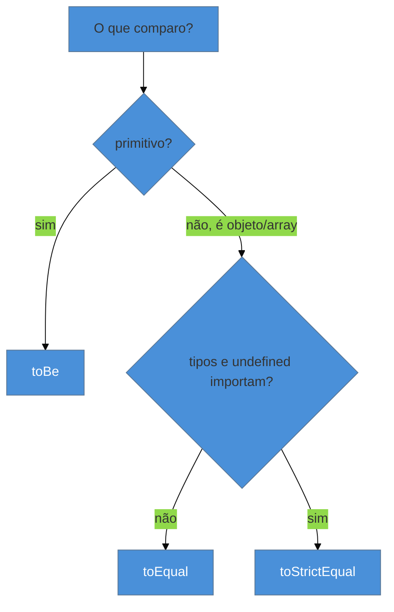

# Matchers e asserções

> [!abstract] TL;DR
> O `expect(valor)` envolve o valor real; o **matcher** encadeado é a afirmação. A distinção que mais pega iniciante: **`toBe`** compara por **identidade** (`===`, bom para primitivos e mesma referência), enquanto **`toEqual`** compara por **estrutura** (recursivo, para objetos e arrays) — e **`toStrictEqual`** é o `toEqual` mais rigoroso (checa `undefined` e tipos). Para exceções, `toThrow`; para promises, `resolves`/`rejects`; para "qualquer valor que satisfaça", os **matchers assimétricos** (`expect.any`, `expect.objectContaining`). Escolher o matcher certo torna a asserção precisa e a mensagem de falha legível.

## O problema: o teste passa (ou falha) pelo motivo errado

Você compara dois objetos com `toBe` e o teste falha, mesmo que eles pareçam idênticos. Ou compara com `toEqual` e ele passa, mesmo com um `undefined` sobrando que era um bug. O matcher errado gera dois desastres simétricos: um **falso negativo** (falha algo correto, você perde tempo) ou um **falso positivo** (passa algo quebrado, o bug escapa). Pior, a mensagem de falha fica críptica quando o matcher não combina com o tipo do valor.

Dominar os matchers é o que faz a asserção dizer *exatamente* o que você quer verificar — nem mais, nem menos. É a diferença entre um teste que documenta o comportamento e um que só faz barulho.

## `toBe` vs `toEqual`: identidade vs estrutura

A confusão nº 1. JavaScript compara objetos por **referência**, não por conteúdo — dois objetos com os mesmos campos são `!==`. Os matchers respeitam isso:

```ts
import { expect, test } from 'vitest';

test('toBe = identidade (===)', () => {
  expect(2 + 2).toBe(4);              // ✅ primitivos: valor
  expect('ab').toBe('ab');           // ✅
  expect({ a: 1 }).toBe({ a: 1 });   // ❌ FALHA: objetos diferentes na memória
});

test('toEqual = estrutura (recursivo)', () => {
  expect({ a: 1 }).toEqual({ a: 1 });          // ✅ mesmos campos
  expect([1, { b: 2 }]).toEqual([1, { b: 2 }]); // ✅ compara em profundidade
});
```

A regra:

| Matcher | Compara | Use para |
|---------|---------|----------|
| **`toBe`** | identidade (`===` / `Object.is`) | primitivos, ou "é a mesma referência?" |
| **`toEqual`** | estrutura, recursivo (ignora `undefined`) | objetos e arrays por conteúdo |
| **`toStrictEqual`** | estrutura + tipos + `undefined` + sparse arrays | quando o tipo e campos `undefined` importam |



> [!question]- Por que `toEqual` "ignora `undefined`" e isso importa?
> `toEqual({ a: 1 })` considera `{ a: 1, b: undefined }` **igual** a `{ a: 1 }` — ele trata uma chave com valor `undefined` como se não existisse. Na maioria dos casos isso é conveniente. Mas se o seu código *deveria* omitir a chave `b` e passou a incluí-la como `undefined` (um bug de serialização, por exemplo), o `toEqual` **não pega**. É aí que entra o `toStrictEqual`, que distingue "chave ausente" de "chave com `undefined`", checa o tipo (uma instância de classe vs. objeto literal) e não ignora buracos em arrays. Regra prática: `toEqual` para o dia a dia; `toStrictEqual` quando a forma exata do objeto é o que você está testando.

## Os matchers que você mais usa

Além de igualdade, o `expect` tem um vocabulário rico. Os essenciais:

```ts
// verdade / existência
expect(valor).toBeTruthy();          // toBeFalsy, toBeNull, toBeUndefined, toBeDefined
expect(valor).toBeNaN();

// números
expect(0.1 + 0.2).toBeCloseTo(0.3);  // float! nunca toBe com decimais
expect(idade).toBeGreaterThan(17);   // toBeLessThan, toBeGreaterThanOrEqual...

// strings e coleções
expect('hello world').toContain('world');
expect(['a', 'b']).toContain('a');
expect([1, 2, 3]).toHaveLength(3);
expect({ nome: 'Ana' }).toHaveProperty('nome', 'Ana');

// negação: .not encadeia em qualquer matcher
expect(lista).not.toContain('x');
```

> [!warning] `toBe` com números de ponto flutuante
> **O que acontece:** `expect(0.1 + 0.2).toBe(0.3)` **falha** — o teste acusa erro num cálculo correto.
> **Por quê:** `0.1 + 0.2` é `0.30000000000000004` em ponto flutuante IEEE-754; não é exatamente `0.3`. `toBe` usa igualdade estrita e vê a diferença.
> **Como evitar:** para decimais, use **`toBeCloseTo(0.3)`** (que compara com uma tolerância de casas decimais). Reserve `toBe` para inteiros e primitivos exatos.

## Exceções, promises e matchers assimétricos

**Exceções** — passe uma *função* para o `expect` (senão o erro estoura antes de ser capturado):

```ts
expect(() => validar('')).toThrow();               // lançou algo?
expect(() => validar('')).toThrow('vazio');        // mensagem contém "vazio"
expect(() => validar('')).toThrow(ValidationError); // instância da classe?
```

**Promises** — `resolves`/`rejects` (detalhados na nota 05):

```ts
await expect(buscarUsuario(1)).resolves.toEqual({ id: 1 });
await expect(buscarUsuario(-1)).rejects.toThrow('não encontrado');
```

**Matchers assimétricos** — quando você não sabe (ou não liga para) o valor exato, só o formato:

```ts
expect(usuario).toEqual({
  id: expect.any(Number),            // qualquer número
  nome: 'Ana',
  criadoEm: expect.any(Date),
});
expect(resposta).toEqual(expect.objectContaining({ status: 200 })); // só checa esses campos
expect(lista).toEqual(expect.arrayContaining([1, 2]));              // contém pelo menos esses
```

São ouro para dados parcialmente dinâmicos (IDs, timestamps) — você afirma o que importa e ignora o que varia, sem tornar o teste frágil.

**Matchers e asserções em uma frase:** `expect(valor)` + o matcher certo é o coração da asserção — `toBe` para identidade/primitivos, `toEqual`/`toStrictEqual` para estrutura de objetos, `toThrow` para exceções, `resolves`/`rejects` para promises, e matchers assimétricos (`expect.any`, `objectContaining`) para afirmar só o que importa em dados dinâmicos.

## Em entrevista

> "`expect` wraps the actual value and the matcher is the assertion. The classic distinction is `toBe` versus `toEqual`: `toBe` is identity — `===` — good for primitives or same-reference checks, while `toEqual` is deep structural equality for objects and arrays, and `toStrictEqual` also checks types and `undefined` keys. For floats I use `toBeCloseTo`, never `toBe`. For errors, `toThrow` with a function; for promises, `resolves`/`rejects`. And for dynamic data like IDs or timestamps, asymmetric matchers like `expect.any(Number)` or `objectContaining` let me assert only what matters without making the test brittle."

| PT | EN |
|----|----|
| Asserção | Assertion |
| Igualdade referencial / estrutural | Referential / structural equality |
| Matcher assimétrico | Asymmetric matcher |
| Ponto flutuante | Floating point |
| Negação | Negation (`.not`) |
| Falso positivo / negativo | False positive / negative |

## O que vem a seguir

Com asserções precisas, o próximo passo é **organizar** os testes — agrupá-los, compartilhar setup entre eles e controlar quais rodam. É o que `describe`, os hooks e `test.each` fazem.

- [[03-Dominios/Tecnologia/Testes JS/04 - Organização e ciclo de vida|04 — Organização e ciclo de vida]] — `describe`, hooks, `test.each`.
- [[03-Dominios/Tecnologia/Testes JS/05 - Testando código assíncrono|05 — Testando código assíncrono]] — `resolves`/`rejects` a fundo.

## Fontes

- **Vitest** — [*expect API*](https://vitest.dev/api/expect.html) — a lista completa de matchers.
- **Vitest** — [*expect — asymmetric matchers*](https://vitest.dev/api/expect.html#expect-anything) — `expect.any`, `objectContaining`, `arrayContaining`.
- **Jest** — [*Using Matchers*](https://jestjs.io/docs/using-matchers) — a mesma semântica (API compatível), útil como referência cruzada.
