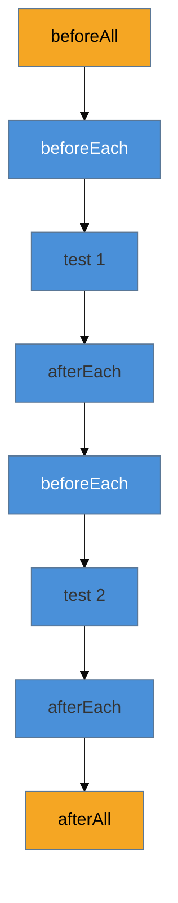

# Organização e ciclo de vida

> [!abstract] TL;DR
> `describe` agrupa testes relacionados (e pode aninhar); os **hooks** compartilham setup/teardown — `beforeEach`/`afterEach` rodam a cada teste, `beforeAll`/`afterAll` uma vez por bloco. **`test.each`** roda o mesmo teste sobre uma tabela de dados, matando duplicação. E `.skip`/`.only`/`.todo` controlam o que roda. A regra de ouro que evita a classe mais traiçoeira de bug de teste: prefira **`beforeEach`** (estado fresco por teste) a compartilhar estado mutável entre testes — testes que dependem da ordem ou vazam estado um no outro são flaky por construção.

## O problema: setup repetido e testes que se contaminam

Seus testes começam simples, mas logo cada um repete as mesmas cinco linhas de preparação (criar um usuário, montar um objeto, limpar um mock). Você copia e cola. Aí, para "economizar", move o objeto para fora e o compartilha entre os testes — e agora, às vezes, um teste falha só quando roda **depois** de outro. Você acaba de introduzir o pesadelo do **acoplamento entre testes**.

Organizar testes não é estética: é a diferença entre uma suíte que você confia (cada teste isolado, determinístico) e uma que "às vezes falha" sem ninguém saber por quê. `describe`, os hooks e `test.each` são as ferramentas para compartilhar setup **sem** criar acoplamento.

## `describe`: agrupar

`describe(nome, fn)` agrupa testes relacionados sob um rótulo, e pode aninhar para espelhar a estrutura do que você testa:

```ts
import { describe, test, expect } from 'vitest';

describe('Carrinho', () => {
  describe('adicionarItem', () => {
    test('soma ao total', () => { /* ... */ });
    test('agrupa itens iguais', () => { /* ... */ });
  });
  describe('remover', () => {
    test('esvazia quando remove o último', () => { /* ... */ });
  });
});
```

O agrupamento aparece no output (`Carrinho > adicionarItem > soma ao total`), organiza o relatório e — importante — define o **escopo dos hooks**: um hook dentro de um `describe` só afeta os testes daquele bloco.

## Os hooks: setup e teardown



| Hook | Roda | Use para |
|------|------|----------|
| **`beforeEach`** | antes de **cada** teste | estado fresco por teste (o padrão seguro) |
| **`afterEach`** | depois de **cada** teste | limpar (resetar mocks, `cleanup`) |
| **`beforeAll`** | **uma vez**, antes de todos | setup caro e imutável (subir um servidor de teste) |
| **`afterAll`** | **uma vez**, no fim | teardown caro (derrubar o servidor) |

```ts
describe('Carrinho', () => {
  let carrinho: Carrinho;
  beforeEach(() => { carrinho = new Carrinho(); }); // ✅ novo a cada teste

  test('começa vazio', () => {
    expect(carrinho.itens).toHaveLength(0);
  });
  test('aceita um item', () => {
    carrinho.adicionar(item);              // não afeta o outro teste:
    expect(carrinho.itens).toHaveLength(1); // cada um tem seu carrinho fresco
  });
});
```

> [!warning] Compartilhar estado mutável entre testes (usar `beforeAll` onde devia ser `beforeEach`)
> **O que acontece:** um teste passa sozinho mas falha quando roda depois de outro, ou a suíte só passa numa certa ordem. Muda a ordem (ou roda em paralelo) e quebra. **Por quê:** um objeto criado uma vez (`beforeAll`, ou fora dos hooks) e **mutado** pelos testes vaza estado de um para o outro. O segundo teste herda a bagunça do primeiro — acoplamento por estado compartilhado, a raiz de muitos flaky (ver [[03-Dominios/Engenharia/Testes/11 - Testes flaky|Engenharia/Testes 11]]). **Como evitar:** o default é **`beforeEach`**, que dá a cada teste um estado **fresco**. Reserve `beforeAll` para setup **caro e imutável** (que os testes só leem, nunca mutam). Testes devem ser independentes e rodar em qualquer ordem — princípio "Independent" do F.I.R.S.T.

> [!question]- Se cada teste precisa de estado fresco, `beforeEach` não é lento por recriar tudo toda vez?
> Raramente importa, e a segurança compensa. Recriar um objeto ou resetar um mock é barato — microssegundos. O que é caro (subir um banco em container, iniciar um servidor) você põe em `beforeAll` **e trata como somente-leitura**: os testes se conectam, mas não mutam o recurso compartilhado (ou limpam o que sujaram no `afterEach`). A regra: **estado barato e mutável → `beforeEach`; recurso caro e imutável → `beforeAll`**. Otimizar recriando menos, ao custo de compartilhar estado mutável, é trocar velocidade por flaky — mau negócio.

## `test.each`: uma tabela, muitos casos

Quando o mesmo teste roda sobre vários dados, `test.each` elimina o copia-cola (o equivalente aos testes parametrizados — ver [[03-Dominios/Engenharia/Testes/10 - Técnicas de teste e edge cases|Engenharia/Testes 10]]):

```ts
test.each([
  { a: 2, b: 3, esperado: 5 },
  { a: -1, b: 1, esperado: 0 },
  { a: 0, b: 0, esperado: 0 },
])('soma($a, $b) = $esperado', ({ a, b, esperado }) => {
  expect(soma(a, b)).toBe(esperado);
});
```

Cada linha vira um teste independente no relatório (com o nome interpolado), então uma falha aponta *qual caso* quebrou — muito melhor que um loop dentro de um `test` só, que para no primeiro erro e esconde os demais.

## Controlar o que roda: `.skip`, `.only`, `.todo`

```ts
test.skip('ainda não implementado', () => { /* pulado */ });
test.only('só este roda no arquivo', () => { /* foco durante debug */ });
test.todo('validar CPF');  // aparece como pendente no relatório
```

`.only` é ótimo para focar num teste durante o debug — **mas é uma armadilha se esquecido**:

> [!warning] Esquecer um `.only` no commit
> **O que acontece:** você usa `test.only` para focar, comita, e no CI **só aquele teste roda** — todos os outros são silenciosamente pulados, dando um "verde" enganoso. **Por quê:** `.only` restringe a execução àquele(s) teste(s) no arquivo; o CI passa porque o único que rodou passou, mascarando regressões em tudo o mais. **Como evitar:** configure o Vitest com `--allowOnly=false` na CI (ou um lint/hook que barra `.only`), fazendo o build **falhar** se houver um `.only` esquecido. Trate `.only` como ferramenta de debug local, nunca commitável.

**Organização e ciclo de vida em uma frase:** `describe` agrupa e escopa hooks; `beforeEach`/`afterEach` (por teste) e `beforeAll`/`afterAll` (por bloco) compartilham setup — preferindo `beforeEach` para estado fresco e evitar acoplamento; `test.each` roda uma tabela de casos sem duplicação; e `.only` é debug local que nunca deve chegar à CI.

## Em entrevista

> "I group related tests with `describe`, which also scopes the hooks. For setup I default to `beforeEach`, so each test gets fresh state — sharing mutable state via `beforeAll` is how you get order-dependent, flaky tests. `beforeAll` is only for expensive, immutable setup like spinning up a test server. For data-driven cases I use `test.each` with a table, so each row is its own reported test. And `.only` is a local debugging tool — I make CI fail on a stray `.only` with `--allowOnly=false`, because otherwise it silently skips every other test and gives a false green."

| PT | EN |
|----|----|
| Ciclo de vida | Lifecycle |
| Gancho (setup/teardown) | Hook |
| Estado fresco | Fresh state |
| Acoplamento entre testes | Test coupling |
| Teste parametrizado / tabela | Parameterized / table-driven test |
| Independência (F.I.R.S.T.) | Independence |

## O que vem a seguir

Falta uma peça essencial do básico: quase todo código real é **assíncrono** (fetch, timers, I/O), e testá-lo tem armadilhas próprias — promises não-esperadas, timers que travam o teste. É a última nota do Iniciado.

- [[03-Dominios/Tecnologia/Testes JS/05 - Testando código assíncrono|05 — Testando código assíncrono]] — `async`/`await`, `resolves`/`rejects`, fake timers.
- [[03-Dominios/Engenharia/Testes/03 - Anatomia de um bom teste|Engenharia/Testes 03]] — F.I.R.S.T. e independência, como base.

## Fontes

- **Vitest** — [*Test API (`describe`, `test.each`, `.only`/`.skip`/`.todo`)*](https://vitest.dev/api/) — a API de organização.
- **Vitest** — [*Setup and Teardown (hooks)*](https://vitest.dev/api/#setup-and-teardown) — `beforeEach`/`beforeAll` e escopo.
- **Vitest** — [*CLI — `--allowOnly`*](https://vitest.dev/guide/cli.html) — barrar `.only` na CI.
