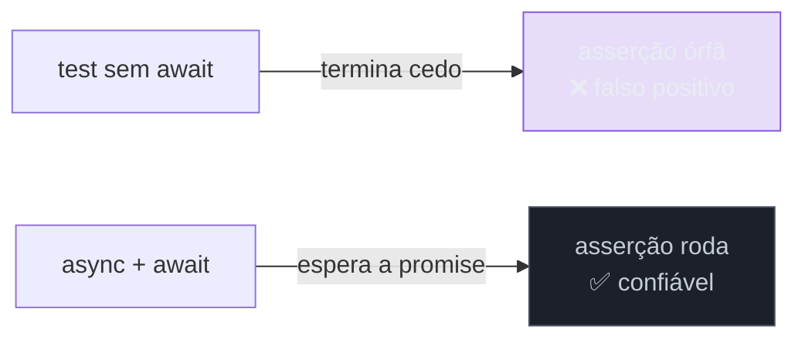

# Testando código assíncrono

> [!abstract] TL;DR
> A armadilha nº 1 do teste assíncrono: **esquecer de esperar** a promise. Um teste que não faz `await` termina *antes* da asserção rodar e passa como falso positivo. A cura: torne a função de teste `async` e **`await`** o que for assíncrono, ou use `await expect(promise).resolves`/`.rejects`. Para código que depende de tempo (`setTimeout`, `setInterval`, debounce), use **fake timers** (`vi.useFakeTimers()` + `vi.advanceTimersByTime(ms)`) para "adiantar o relógio" sem esperar de verdade — testes que dormem são lentos e flaky. Um `expect.assertions(n)` garante que a asserção dentro do `catch` realmente rodou.

## O problema: o teste verde que não testou nada

Quase todo código real é assíncrono — um `fetch`, uma leitura de arquivo, um timer. E o teste assíncrono tem uma falha traiçoeira que engana até quem tem experiência:

```ts
// ❌ FALSO POSITIVO: passa sempre, mesmo se buscarUsuario estiver quebrado
test('busca o usuário', () => {
  buscarUsuario(1).then((u) => {
    expect(u.nome).toBe('Ana');   // esta linha talvez nem rode antes do teste acabar
  });
});
```

O teste **termina** assim que a função síncrona retorna — e a `.then` só executa *depois*. A asserção pode rodar tarde demais (ignorada) ou nem rodar. O teste fica verde sem ter verificado nada. Pior: se a asserção falhasse, o erro apareceria *fora* do teste, quebrando outro aleatório. Dominar o assíncrono é, antes de tudo, garantir que o teste **espera** o que precisa verificar.

## A regra: `async` + `await`

A correção é tornar o teste `async` e **esperar** a promise. Assim o Vitest só considera o teste terminado quando a promise (e suas asserções) resolveram:

```ts
// ✅ o teste espera de verdade
test('busca o usuário', async () => {
  const u = await buscarUsuario(1);
  expect(u.nome).toBe('Ana');
});
```

Para afirmar sobre a promise diretamente, `resolves`/`rejects` — e aqui há um segundo `await` obrigatório, no `expect`:

```ts
// resolve com o valor esperado
await expect(buscarUsuario(1)).resolves.toEqual({ id: 1, nome: 'Ana' });

// rejeita com um erro
await expect(buscarUsuario(-1)).rejects.toThrow('não encontrado');
```



> [!warning] Esquecer o `await` no `expect().resolves/.rejects`
> **O que acontece:** `expect(p).rejects.toThrow()` **sem** `await` passa mesmo quando a promise resolve (deveria falhar) — a asserção vira uma promise pendente que ninguém checa. **Por quê:** `resolves`/`rejects` retornam uma promise; sem `await` (ou `return`), o Vitest não sabe que deve esperá-la, e o teste termina antes da verificação. **Como evitar:** **sempre** `await` (ou `return`) o `expect(...).resolves/.rejects`. Um lint como `eslint-plugin-vitest` (regra `valid-expect`) pega isso automaticamente.

## Garantir que a asserção rodou: `expect.assertions`

Ao testar o caminho de **erro** com try/catch, há um risco sutil: se o código *não* lançar, o `catch` não roda, a asserção é pulada, e o teste passa achando que testou o erro. `expect.assertions(n)` blinda contra isso — falha o teste se o número de asserções esperado não rodou:

```ts
test('rejeita id inválido', async () => {
  expect.assertions(1);              // exijo que 1 asserção rode
  try {
    await buscarUsuario(-1);
  } catch (e) {
    expect(e).toBeInstanceOf(NotFoundError); // se não lançar, nunca roda → teste falha
  }
});
```

(Na prática, `await expect(...).rejects.toThrow()` é mais limpo que try/catch — mas `expect.assertions` é a rede de segurança quando o try/catch é inevitável.)

## Tempo: fake timers

Código que depende de tempo real — `setTimeout`, `setInterval`, debounce, polling — não pode ser testado *esperando de verdade*: um teste que faz `await sleep(5000)` é lento e frágil. A solução são os **fake timers**: você substitui o relógio e o **adianta manualmente**.

```ts
import { vi, test, expect, beforeEach, afterEach } from 'vitest';

beforeEach(() => vi.useFakeTimers());
afterEach(() => vi.useRealTimers());   // sempre restaure!

test('debounce dispara após 300ms', () => {
  const fn = vi.fn();
  const debounced = debounce(fn, 300);

  debounced();
  expect(fn).not.toHaveBeenCalled();   // ainda não

  vi.advanceTimersByTime(300);         // "adianta o relógio" 300ms, instantâneo
  expect(fn).toHaveBeenCalledOnce();   // agora sim
});
```

As ferramentas de controle do tempo:

| API | O que faz |
|-----|-----------|
| `vi.useFakeTimers()` / `vi.useRealTimers()` | liga/desliga o relógio falso |
| `vi.advanceTimersByTime(ms)` | avança N ms (dispara timers vencidos) |
| `vi.runAllTimers()` | roda todos os timers pendentes |
| `vi.advanceTimersByTimeAsync(ms)` | idem, mas aguarda microtasks (para código async com timers) |

> [!question]- Por que não simplesmente esperar o tempo de verdade com um `await sleep`?
> Três razões, todas caras. **Velocidade:** um teste de um polling de 30s levaria 30s; multiplicado por dezenas de testes, a suíte fica inutilizável. **Determinismo:** tempo real depende da carga da máquina — na CI lenta, `setTimeout(100)` pode levar 150ms e o teste vira flaky. **Controle:** com fake timers você testa cenários impossíveis de esperar (o que acontece exatamente em 299ms vs 300ms). Adiantar o relógio dá um teste **instantâneo, determinístico e preciso**. Esperar de verdade é a receita de suíte lenta e flaky (ver [[03-Dominios/Tecnologia/Testes JS/16 - Testes flaky em JS|nota 16]]).

**Testando código assíncrono em uma frase:** torne o teste `async` e `await` tudo que é assíncrono (inclusive o `expect().resolves/.rejects`) para não passar por falso positivo, use `expect.assertions(n)` para garantir que a asserção no `catch` rodou, e controle tempo com fake timers (`vi.useFakeTimers` + `advanceTimersByTime`) em vez de esperar de verdade.

## Em entrevista

> "The number-one async testing bug is forgetting to await — a test that doesn't wait finishes before the assertion runs and passes as a false positive. So I make the test `async` and `await` the promise, or use `await expect(p).resolves`/`.rejects` — and that `await` on the expect is mandatory. When I test error paths with try/catch, I add `expect.assertions(1)` so the test fails if the catch never runs. And for time-dependent code — debounce, polling — I use fake timers: `vi.useFakeTimers()` and `vi.advanceTimersByTime()` to fast-forward the clock instead of really waiting, which keeps tests fast and deterministic."

| PT | EN |
|----|----|
| Falso positivo | False positive |
| Esperar a promise | Await the promise |
| Relógio falso / fake timers | Fake timers |
| Adiantar o relógio | Fast-forward the clock |
| Assíncrono determinístico | Deterministic async |
| Timer pendente | Pending timer |

## O que vem a seguir

Você fecha o básico do Vitest: setup, asserções, organização e assíncrono. A fase Adepto começa pela ferramenta que separa testes ingênuos de testes de verdade — os **test doubles**, aqui na forma concreta do mocking com `vi`.

- [[03-Dominios/Tecnologia/Testes JS/06 - Mocking com Vitest|06 — Mocking com Vitest]] — `vi.fn`, `vi.spyOn`, `vi.mock`.
- [[03-Dominios/Engenharia/Testes/05 - Test doubles - dummy, stub, spy, mock, fake|Engenharia/Testes 05]] — a taxonomia dos doubles, a teoria por trás.

## Fontes

- **Vitest** — [*Testing asynchronous code*](https://vitest.dev/guide/testing-types.html) e [*expect — resolves/rejects*](https://vitest.dev/api/expect.html#resolves) — esperar promises.
- **Vitest** — [*Fake Timers (`vi.useFakeTimers`)*](https://vitest.dev/api/vi.html#vi-usefaketimers) — controlar o tempo.
- **Testing Library** — [*Async methods (`findBy`, `waitFor`)*](https://testing-library.com/docs/dom-testing-library/api-async/) — o assíncrono no contexto de UI (nota 08).
