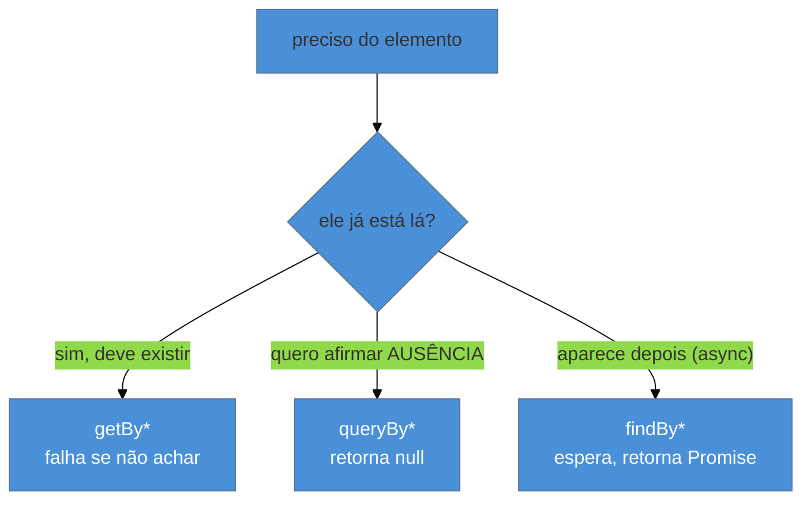

# Testing Library: filosofia e queries

> [!abstract] TL;DR
> A Testing Library tem uma filosofia forte: **teste como o usuário usa**, não os detalhes de implementação. Por isso ela não deixa você selecionar por classe CSS ou nome de componente — você busca elementos pelo que o **usuário percebe**: o papel acessível (`getByRole`), o texto do label, o texto visível. As queries vêm em três variantes: **`getBy`** (falha se não achar — para o que deve existir), **`queryBy`** (retorna `null` — para afirmar ausência), **`findBy`** (assíncrona, espera aparecer — para UI que carrega). A prioridade recomendada: `role` > `label` > `text` > (último recurso) `testid`. Isso torna o teste resiliente a refatoração e sensível a acessibilidade.

## O problema: o teste que quebra a cada refatoração

Você testa um componente selecionando `.btn-primary` e verificando o estado interno. Um colega renomeia a classe para `.button-main` numa refatoração puramente visual — e o teste quebra, mesmo sem nenhuma mudança de comportamento. Ou você testa "o state `isOpen` virou `true`", e aí troca `useState` por `useReducer`: o comportamento é idêntico, mas o teste explode.

Esses testes são **acoplados à implementação** — eles testam *como* o componente é feito, não *o que* ele faz. Resultado: refatorar vira um inferno de testes falsos-vermelhos, e a suíte, em vez de dar confiança, vira um freio. A Testing Library nasceu para resolver isso, com uma filosofia que ela **impõe** pelo design da API.

## A filosofia: teste como o usuário

O princípio-guia da Testing Library, nas palavras do autor (Kent C. Dodds):

> "Quanto mais os seus testes se parecem com a forma como o software é usado, mais confiança eles te dão."

Um usuário não sabe o que é uma classe CSS, um nome de componente ou um pedaço de state. Ele vê **um botão escrito "Enviar"**, **um campo rotulado "E-mail"**, **um texto de erro**. Então a Testing Library te faz buscar os elementos do mesmo jeito — pelo que é **percebível e acessível**. Isso alinha o teste ao comportamento real e, de brinde, **exercita a acessibilidade** (se o teste não acha o botão pelo papel, provavelmente um leitor de tela também não acharia).

Isso conecta direto à [[03-Dominios/Engenharia/Testes/06 - Testar comportamento, não implementação|Engenharia/Testes 06]]: testar comportamento, não implementação. A Testing Library é essa ideia transformada em API — ela literalmente **não tem** um `getByClassName`.

## As três variantes de query

Toda query existe em três formas, e escolher a certa é metade da habilidade:



| Variante | Se **não** acha | Se acha | Assíncrona? | Use para |
|----------|-----------------|---------|:-----------:|----------|
| **`getBy`** | **lança** erro | retorna o elemento | não | o que **deve** estar presente agora |
| **`queryBy`** | retorna `null` | retorna o elemento | não | afirmar **ausência** (`expect(...).not.toBeInTheDocument()`) |
| **`findBy`** | rejeita (após timeout) | resolve o elemento | **sim** | o que **aparece depois** (dados carregando) |

```ts
import { screen } from '@testing-library/react';

// deve existir agora:
const botao = screen.getByRole('button', { name: /enviar/i });

// afirmar que NÃO existe:
expect(screen.queryByText('Erro')).not.toBeInTheDocument();

// aparece após um fetch:
const item = await screen.findByText('Pedido #42');
```

> [!warning] Usar `getBy` para checar ausência
> **O que acontece:** você escreve `expect(screen.getByText('Erro')).toBeNull()` e o teste quebra com "Unable to find an element" **antes** de chegar na asserção. **Por quê:** `getBy` **lança** quando não acha — então ele nunca retorna `null` para você comparar; ele explode primeiro. `getBy` é para o que existe. **Como evitar:** para afirmar ausência, use **`queryBy`** (que retorna `null`): `expect(screen.queryByText('Erro')).not.toBeInTheDocument()`. Regra: `getBy`/`findBy` para presença, `queryBy` para ausência.

## A prioridade das queries

Nem toda query é igualmente boa. A Testing Library recomenda uma **ordem de prioridade**, da mais próxima da experiência do usuário para a mais frágil:

1. **`getByRole`** — o papel acessível (`button`, `textbox`, `heading`), com `name`. **A primeira escolha** — é como tecnologias assistivas enxergam a página.
2. **`getByLabelText`** — para campos de formulário, pelo `<label>` associado. Ótimo para forms.
3. **`getByPlaceholderText`** / **`getByText`** — placeholder ou texto visível.
4. **`getByDisplayValue`** / **`getByAltText`** / **`getByTitle`** — casos específicos.
5. **`getByTestId`** — `data-testid`. **Último recurso**, quando nada acima serve (nada disso é percebível pelo usuário).

> [!question]- Por que `getByTestId` é "último recurso" se é o mais fácil e estável?
> Justamente porque ele foge da filosofia. Um `data-testid` é invisível ao usuário — ele não testa nada do que a pessoa percebe, e um teste que só passa por `testid` pode estar verde com o componente inacessível ou com o texto errado (o usuário veria o problema; o `testid` não). Ele é estável porque é acoplado ao *código*, não ao comportamento — a mesma fragilidade disfarçada de estabilidade. Use `getByRole` primeiro: se o teste acha o elemento pelo papel, você **provou** que ele é acessível de brinde. Reserve `testid` para o que genuinamente não tem papel nem texto (um container sem semântica, um canvas). Se você se pega usando `testid` o tempo todo, é sinal de que a UI está pouco acessível — o teste está te avisando.

**Testing Library em uma frase:** ela impõe "teste como o usuário usa" ao só deixar você buscar elementos pelo que é percebível (papel, label, texto) — em três variantes (`getBy` para presença, `queryBy` para ausência, `findBy` para o que carrega) e numa prioridade (role > label > text > testid) que torna o teste resiliente a refatoração e sensível a acessibilidade.

## Em entrevista

> "Testing Library enforces a philosophy: test the way the user uses the app, not implementation details. It won't let you select by CSS class or component name — you query by what the user perceives: the accessible role, the label, the visible text. Queries come in three flavors: `getBy` throws if not found — for what should be there; `queryBy` returns null — for asserting absence; and `findBy` is async and waits — for UI that loads. The recommended priority is role, then label, then text, with `getByTestId` as a last resort. Querying by role means my test also proves the element is accessible."

| PT | EN |
|----|----|
| Papel acessível | Accessible role |
| Detalhe de implementação | Implementation detail |
| Resiliente a refatoração | Refactor-resilient |
| Afirmar ausência | Assert absence |
| Prioridade de queries | Query priority |
| Tecnologia assistiva | Assistive technology |

## O que vem a seguir

Com a filosofia e as queries na mão, o próximo passo é o ato concreto: renderizar um componente React, simular a interação do usuário e afirmar o resultado — incluindo o assíncrono de UI que carrega dados.

- [[03-Dominios/Tecnologia/Testes JS/08 - Testando componentes React|08 — Testando componentes React]] — `render`, `user-event`, `findBy`.
- [[03-Dominios/Tecnologia/React/React core/17 - Performance no React|React core]] — o componente que estamos testando, como reforço.

## Fontes

- **Testing Library** — [*Guiding Principles*](https://testing-library.com/docs/guiding-principles) — a filosofia "teste como o usuário usa".
- **Testing Library** — [*About Queries / priority*](https://testing-library.com/docs/queries/about/#priority) — a ordem recomendada de queries.
- **Testing Library** — [*Which query should I use?*](https://testing-library.com/docs/queries/about/) — `getBy`/`queryBy`/`findBy`.
