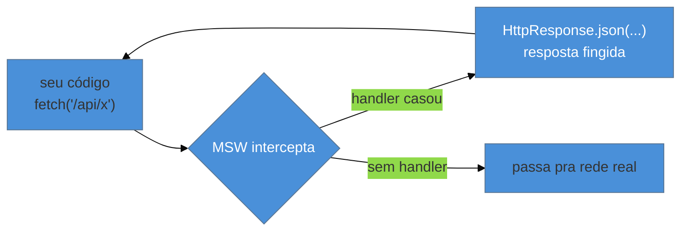

# MSW: mockando a rede

> [!abstract] TL;DR
> O **MSW (Mock Service Worker)** intercepta requisições HTTP na **camada de rede** — não mockando o `fetch` nem o cliente HTTP, mas respondendo às requisições reais como se fosse o servidor. Você declara **handlers** (`http.get('/api/users', () => HttpResponse.json(...))`) e o MSW os aplica via `setupServer` (Node/testes) ou `setupWorker` (browser/dev). A vantagem decisiva: o **mesmo** mock serve testes (Vitest), E2E (Playwright), Storybook e dev — seu código nem sabe que está mockado. Em 2026 use a **API v2** (`http`/`HttpResponse`/`graphql`). O padrão de teste: `beforeAll(server.listen)`, `afterEach(server.resetHandlers)`, `afterAll(server.close)`.

## O problema: mockar `fetch` é frágil e não se reusa

Seu componente faz `fetch('/api/pedidos')`. Para testá-lo, a reação ingênua é mockar o `fetch` global (`vi.spyOn(globalThis, 'fetch')...`). Isso funciona, mas é frágil e não escala:

- Você reimplementa a mão a interface do `Response` (`.json()`, `.status`, headers) — trabalhoso e propenso a divergir do real.
- Se você troca `fetch` por `axios`, todos os mocks quebram — o mock está acoplado ao **cliente**, não à rede.
- O mock só vale no teste. No Storybook, no dev, no E2E, você reescreve tudo de novo.

O MSW resolve pela **camada certa**: em vez de mockar a ferramenta que faz a requisição, ele intercepta a **requisição HTTP em si** e responde. Seu código roda o `fetch`/`axios` real; o MSW finge ser o servidor. Um mock, todos os ambientes.

## Como o MSW funciona



Você escreve **handlers** que casam requisições e devolvem respostas. No Node (testes), o `setupServer` intercepta no nível da runtime; no browser (dev/Storybook), o `setupWorker` usa um Service Worker de verdade. A mesma lista de handlers alimenta os dois.

## Handlers (API v2)

```ts
// handlers.ts
import { http, HttpResponse } from 'msw';

export const handlers = [
  http.get('/api/pedidos', () => {
    return HttpResponse.json([{ id: 42, total: 100 }]);
  }),

  http.get('/api/pedidos/:id', ({ params }) => {
    return HttpResponse.json({ id: Number(params.id), total: 100 });
  }),

  http.post('/api/pedidos', async ({ request }) => {
    const body = await request.json();
    return HttpResponse.json({ id: 99, ...body }, { status: 201 });
  }),
];
```

Na v2, os pilares são **`http`** (métodos `.get`/`.post`/...) e **`HttpResponse`** (`.json()`, `.text()`, status/headers) — ambos alinhados à Web Fetch API padrão. Há também **`graphql`** para operações GraphQL. (A v1 usava `rest` e `res(ctx.json(...))` — se você vir isso, é código v2-desatualizado.)

## O setup em testes (Node)

```ts
// setup-tests.ts
import { setupServer } from 'msw/node';
import { handlers } from './handlers';
import { afterAll, afterEach, beforeAll } from 'vitest';

export const server = setupServer(...handlers);

beforeAll(() => server.listen({ onUnhandledRequest: 'error' }));
afterEach(() => server.resetHandlers());   // desfaz overrides por-teste
afterAll(() => server.close());
```

(Registre esse arquivo em `test.setupFiles` no `vitest.config`.) Os três hooks são o padrão canônico:

- **`server.listen()`** liga a interceptação (com `onUnhandledRequest: 'error'` para pegar requisições que você esqueceu de mockar).
- **`server.resetHandlers()`** no `afterEach` desfaz overrides feitos *dentro* de um teste — sem isso, um handler específico de um teste vaza para os próximos (o mesmo princípio de isolamento da nota 04).
- **`server.close()`** desliga no fim.

Para testar um caso específico (um erro 500, uma resposta diferente), você **sobrescreve** o handler só naquele teste com `server.use(...)`:

```ts
test('mostra erro quando a API falha', async () => {
  server.use(
    http.get('/api/pedidos', () => new HttpResponse(null, { status: 500 }))
  );
  render(<ListaPedidos />);
  expect(await screen.findByText(/erro ao carregar/i)).toBeInTheDocument();
});
```

> [!question]- MSW substitui os mocks do `vi` (nota 06)? Quando uso cada um?
> São para camadas diferentes e se complementam. **`vi.mock`/`vi.fn`** (nota 06) mockam **módulos e funções** do seu código — uma dependência interna, um utilitário, um callback. **MSW** mocka a **rede** — o que atravessa HTTP. Regra: se a dependência é uma **chamada HTTP** (a uma API, própria ou de terceiros), use **MSW** — é mais realista (seu `fetch`/`axios` roda de verdade) e reusável entre testes/E2E/Storybook. Se é uma **função ou módulo** JS (uma lib de formatação, um serviço interno sem rede), use **`vi`**. Mockar `fetch` com `vi` é justamente o que o MSW veio substituir; mockar uma função pura com MSW não faz sentido. Na dúvida: atravessa a rede → MSW; não atravessa → `vi`.

> [!warning] Não resetar handlers entre testes
> **O que acontece:** um `server.use()` que você criou para simular um erro num teste continua ativo no teste seguinte, que passa a receber o erro inesperadamente e falha (ou pior, passa por engano).
> **Por quê:** `server.use()` adiciona handlers de runtime que **persistem** até serem resetados. Sem `resetHandlers`, eles vazam para os próximos testes — o clássico acoplamento por estado compartilhado.
> **Como evitar:** **sempre** `afterEach(() => server.resetHandlers())`. Isso restaura a lista base de handlers a cada teste, garantindo isolamento.

**MSW em uma frase:** ele intercepta a rede na camada HTTP (handlers com `http`/`HttpResponse` na API v2), então seu `fetch`/`axios` real roda mas recebe respostas fingidas — reusáveis entre Vitest, Playwright, Storybook e dev —, com o padrão `listen`/`resetHandlers`/`close` garantindo isolamento entre testes.

## Em entrevista

> "MSW — Mock Service Worker — intercepts requests at the **network layer**, instead of mocking `fetch` or the HTTP client. I declare handlers like `http.get('/api/users', () => HttpResponse.json(...))`, and the same handlers work in Vitest via `setupServer`, in the browser via `setupWorker`, in Storybook, and in dev — my code runs the real `fetch` and doesn't know it's mocked. That reusability and realism is why I prefer it over mocking `fetch` with `vi`. The test pattern is `listen` in `beforeAll`, `resetHandlers` in `afterEach` for isolation, and `close` in `afterAll`. In 2026 I use the v2 API — `http` and `HttpResponse`."

| PT | EN |
|----|----|
| Camada de rede | Network layer |
| Interceptar requisições | Intercept requests |
| Manipulador (handler) | Handler |
| Sobrescrever por teste | Per-test override |
| Requisição não-tratada | Unhandled request |
| Reuso entre ambientes | Cross-environment reuse |

## O que vem a seguir

Você testa lógica, componentes e rede. Falta a lógica que vive **fora** de um componente visual: os custom hooks. Testá-los isoladamente pede uma ferramenta própria — `renderHook`.

- [[03-Dominios/Tecnologia/Testes JS/10 - Testando hooks e estado|10 — Testando hooks e estado]] — `renderHook`, `act`, providers.
- [[03-Dominios/Engenharia/Testes/07 - Testes de integração|Engenharia/Testes 07]] — o teste de integração que o MSW viabiliza, como base.

## Fontes

- **MSW** — [*Getting Started*](https://mswjs.io/docs/getting-started) — handlers, `http`/`HttpResponse`, setup.
- **MSW** — [*Integrations — Node (`setupServer`)*](https://mswjs.io/docs/integrations/node) — o padrão `listen`/`resetHandlers`/`close`.
- **MSW** — [*Migrating to v2*](https://mswjs.io/docs/migrations/1.x-to-2.x/) — a mudança de `rest`/`res(ctx...)` para `http`/`HttpResponse`.
