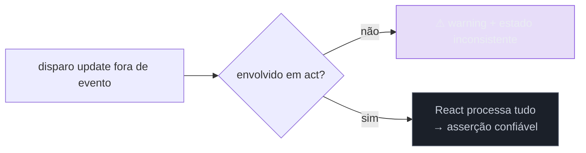

# Testando hooks e estado

> [!abstract] TL;DR
> Hooks só rodam dentro de componentes React — então, para testar um custom hook isoladamente, a Testing Library dá o **`renderHook`**, que o monta num componente mínimo e expõe seu retorno em **`result.current`**. Qualquer atualização de estado disparada fora de um evento precisa ser envolvida em **`act(...)`** (ou usar o `user-event`/`waitFor`, que já embrulham) — senão o React avisa "not wrapped in act(...)". Para hooks que dependem de contexto (um `useAuth` que lê um Provider), passe um **`wrapper`**. E lembre: teste o **comportamento** do hook (o que ele retorna e faz), não sua implementação.

## O problema: um hook não roda sozinho

Você extraiu a lógica de um formulário para um custom hook `useFormulario()` — validação, estado, submit. Quer testá-lo direto, sem montar um componente inteiro só para exercitá-lo. Mas se você chamar `useFormulario()` num teste, o React explode: **"Hooks can only be called inside the body of a function component"**. Hooks dependem do runtime do React (o "dispatcher" que gerencia `useState`, `useEffect`); fora de um componente, não há esse runtime.

A saída ingênua — criar um componente de teste que usa o hook e inspecionar o DOM — funciona, mas é verboso e indireto. A Testing Library resolve com uma ferramenta dedicada que monta o hook num componente mínimo e te dá acesso direto ao que ele retorna.

## `renderHook`: montar o hook isolado

```ts
import { renderHook, act } from '@testing-library/react';
import { expect, test } from 'vitest';
import { useContador } from './useContador';

test('incrementa o contador', () => {
  const { result } = renderHook(() => useContador(10));

  expect(result.current.valor).toBe(10);     // estado inicial

  act(() => {
    result.current.incrementar();            // dispara a atualização
  });

  expect(result.current.valor).toBe(11);     // result.current reflete o novo estado
});
```

Duas peças-chave:

- **`result.current`** é o **valor mais recente** retornado pelo hook. Ele é atualizado a cada re-render — por isso você sempre lê `result.current.valor` na hora da asserção, nunca guarda uma referência antiga (ela ficaria congelada no valor velho).
- **`renderHook`** também retorna **`rerender`** (para re-renderizar com novas props e testar reação a mudanças) e **`unmount`** (para testar cleanup de `useEffect`).

```ts
const { result, rerender } = renderHook(({ id }) => useUsuario(id), {
  initialProps: { id: 1 },
});
rerender({ id: 2 });  // re-renderiza com nova prop; testa a reação
```

## `act`: por que e quando

O `act(...)` diz ao React "estou prestes a causar uma atualização; processe-a completamente antes de eu verificar". Sem ele, uma mudança de estado pode ficar pela metade quando a asserção roda, e o React emite o famoso aviso:

> Warning: An update to X inside a test was not wrapped in act(...)



> [!question]- Preciso de `act` em todo teste? Ouvi dizer que "quase nunca".
> As duas coisas são verdade, e a chave é: **muita coisa já embrulha `act` por você**. `render`, os métodos do `userEvent`, `findBy` e `waitFor` **já rodam dentro de `act`** internamente — então em testes de *componente* você raramente escreve `act` à mão. O `act` explícito aparece sobretudo ao testar **hooks com `renderHook`**, quando você chama uma função retornada pelo hook (`result.current.incrementar()`) que dispara `setState` *fora* de um evento de usuário — aí você mesmo envolve em `act`. Regra: se você vê o warning "not wrapped in act", é sinal de uma atualização de estado assíncrona ou manual que escapou; envolva-a em `act`, ou (melhor, se for UI) use `userEvent`/`waitFor` que já cuidam disso. Não saia salpicando `act` preventivamente.

## Hooks que dependem de contexto: `wrapper`

Um hook como `useAuth()` que lê um `AuthContext` precisa do Provider para funcionar. O `renderHook` aceita um **`wrapper`** — um componente que envolve o hook:

```tsx
function wrapper({ children }: { children: React.ReactNode }) {
  return <AuthProvider usuario={{ nome: 'Ana' }}>{children}</AuthProvider>;
}

const { result } = renderHook(() => useAuth(), { wrapper });
expect(result.current.usuario.nome).toBe('Ana');
```

O mesmo padrão de `wrapper` serve para qualquer provider (React Query, tema, i18n, store) — e é reaproveitável entre testes de hook e de componente (você pode extrair um `renderComProviders` que aplica todos os providers de uma vez).

> [!warning] Guardar `result.current` numa variável antes da atualização
> **O que acontece:** `const valor = result.current.valor;` antes do `act`, e depois você afirma sobre `valor` — o teste vê o valor **antigo**, mesmo após a atualização. **Por quê:** `result.current` é substituído a cada re-render; a variável que você guardou aponta para o snapshot **anterior**, congelado. A atualização criou um novo `current`, mas sua variável não o acompanha. **Como evitar:** sempre leia `result.current.x` **na hora da asserção**, depois do `act`. Nunca desestruture/guarde valores de `result.current` para reusar após uma atualização.

**Testando hooks em uma frase:** `renderHook` monta o hook num componente mínimo e expõe seu retorno em `result.current` (sempre lido na hora, nunca guardado), atualizações manuais de estado vão dentro de `act` (mas `render`/`userEvent`/`waitFor` já embrulham), e hooks que dependem de contexto recebem um `wrapper` com os providers.

## Em entrevista

> "Hooks only run inside components, so to test a custom hook in isolation I use `renderHook`, which mounts it in a minimal component and exposes its return value in `result.current`. I always read `result.current` at assertion time — it's replaced on every render, so a saved reference goes stale. State updates I trigger manually go inside `act`, though `render`, `userEvent`, and `waitFor` already wrap `act` for me, so I rarely write it by hand outside hook tests. And for hooks that depend on context, like a `useAuth` reading a provider, I pass a `wrapper`. As always, I test what the hook returns and does, not how it's implemented."

| PT | EN |
|----|----|
| Custom hook | Custom hook |
| Renderizar o hook | Render the hook |
| Valor atual | Current value |
| Envolver em `act` | Wrap in `act` |
| Componente-embrulho | Wrapper component |
| Valor congelado (stale) | Stale value |

## O que vem a seguir

Você cobriu lógica, componentes, rede e hooks. Uma técnica transversal merece atenção pelo tanto que é mal usada: o **snapshot testing** — poderoso para pegar mudanças inesperadas, perigoso quando vira ruído.

- [[03-Dominios/Tecnologia/Testes JS/11 - Snapshot testing|11 — Snapshot testing]] — quando usar e quando evitar.
- [[03-Dominios/Tecnologia/Testes JS/08 - Testando componentes React|08 — Testando componentes React]] — o teste de componente que usa os mesmos providers, como base.

## Fontes

- **Testing Library** — [*`renderHook`*](https://testing-library.com/docs/react-testing-library/api/#renderhook) — API, `result.current`, `rerender`, `wrapper`.
- **React** — [*`act(...)`*](https://react.dev/reference/react/act) — por que e quando envolver atualizações.
- **Kent C. Dodds** — [*How to test custom React hooks*](https://kentcdodds.com/blog/how-to-test-custom-react-hooks) — testar comportamento, não implementação, de hooks.
