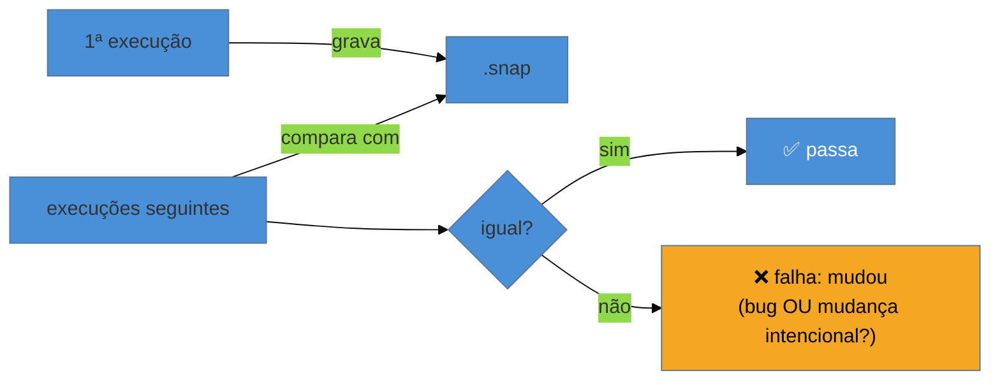

# Snapshot testing

> [!abstract] TL;DR
> Snapshot testing grava a saída de algo (o markup de um componente, um objeto grande) num arquivo na **primeira** execução e, nas seguintes, **compara** — falhando se mudou. **`toMatchSnapshot()`** guarda num arquivo `.snap`; **`toMatchInlineSnapshot()`** grava no próprio teste. É poderoso para pegar **mudanças inesperadas** de saída de graça, mas perigoso: snapshots grandes viram ruído que ninguém lê, e o hábito de "atualizar tudo" (`-u`) sem revisar transforma o teste em carimbo automático. Regra: snapshots **pequenos e intencionais**, sempre revisados no diff; para UI, prefira asserções explícitas com queries (nota 08).

## O problema: garantir que "nada mudou sem querer"

Você tem uma função que serializa um objeto complexo, ou um componente com muito markup. Escrever uma asserção para *cada* campo é trabalhoso e você provavelmente vai esquecer algum. O que você realmente quer é: "a saída deve continuar exatamente como está — me avise se **qualquer** coisa mudar". Esse é o caso de uso do snapshot: capturar uma saída inteira e detectar desvios futuros sem enumerar cada detalhe.

O problema é que essa conveniência tem um lado sombrio famoso — o snapshot que ninguém entende, que "sempre muda", e que o time atualiza no automático até ele não testar mais nada. Saber **quando** usar (e quando não) é o que separa snapshot como rede de segurança de snapshot como teatro.

## Como funciona

```ts
import { expect, test } from 'vitest';

test('serializa o pedido', () => {
  const pedido = criarPedido({ itens: 2 });
  expect(pedido).toMatchSnapshot();
});
```

Na **primeira** execução, o Vitest grava a saída num arquivo `__snapshots__/arquivo.test.ts.snap` e o teste passa. Nas execuções **seguintes**, ele compara a saída atual com o `.snap` guardado:



Quando falha, você decide: se a mudança é **um bug**, conserte o código; se é **intencional**, atualize o snapshot com `vitest -u` (update). Há duas formas:

- **`toMatchSnapshot()`** — grava num arquivo `.snap` separado. Bom para saídas grandes.
- **`toMatchInlineSnapshot()`** — grava **no próprio arquivo de teste** (o Vitest escreve o valor entre as aspas). Melhor para saídas pequenas: o valor esperado fica **visível ali**, sem pular para outro arquivo.

```ts
expect(formatarMoeda(1234.5)).toMatchInlineSnapshot(`"R$ 1.234,50"`);
```

## Quando usar

Snapshot brilha quando a saída é **serializável, estável e você quer detectar qualquer desvio**:

- Saída de **serializadores/formatadores** (uma função que gera JSON, um markdown, um objeto de config).
- **Erros e mensagens** estruturadas.
- Componentes **pequenos e estáveis**, onde o markup completo é o contrato.
- Detectar **mudanças não-intencionais** de saída numa refatoração ("eu só renomeei; o output mudou?").

## Quando evitar (o lado sombrio)

> [!warning] Snapshots gigantes de componentes inteiros
> **O que acontece:** você faz `toMatchSnapshot()` de uma página inteira, gera um `.snap` de 500 linhas, e a partir daí *qualquer* mudança de UI quebra o teste. O time começa a rodar `vitest -u` no automático a cada falha. **Por quê:** um snapshot enorme não tem **intenção legível** — ninguém revisa 500 linhas de diff, então a atualização vira reflexo. Um snapshot que é sempre atualizado sem leitura **não testa nada**: ele carimba o presente, seja ele correto ou bugado. **Como evitar:** snapshots **pequenos e focados**. Para UI, prefira asserções explícitas com queries (`getByRole`, `toHaveTextContent`) que dizem *o que* importa (nota 08). Se usar snapshot de componente, capture um fragmento mínimo, não a árvore toda.

> [!question]- Se o snapshot "sempre muda", ele é inútil? Como saber se um snapshot é bom?
> O teste decisivo é: **quando este snapshot falhar, alguém vai olhar o diff e conseguir julgar se a mudança é boa ou ruim?** Se sim (o snapshot é pequeno, a saída é significativa, o diff é legível), ele é uma ótima rede de segurança. Se não (é gigante, muda a cada ajuste de estilo, o diff é ilegível), ele é ruído que será atualizado no automático — pior que inútil, porque dá falsa sensação de cobertura. Bons snapshots são **pequenos, determinísticos e revisáveis**. Um sinal de alerta é o `-u` reflexo: se o time atualiza snapshots sem ler, os snapshots pararam de testar. Nesse caso, troque por asserções explícitas.

Cuidado extra com **não-determinismo**: datas, IDs aleatórios e timestamps fazem o snapshot mudar a cada execução. Normalize-os (injete uma data fixa, use property matchers `expect.any(Date)` no snapshot) antes de capturar.

**Snapshot testing em uma frase:** grava a saída na primeira execução e compara depois, pegando mudanças inesperadas de graça — mas só vale quando o snapshot é pequeno, determinístico e revisável no diff; snapshots gigantes viram carimbo automático que não testa nada, e para UI asserções explícitas com queries costumam ser melhores.

## Em entrevista

> "Snapshot testing records output on the first run and compares on later runs, failing if it changed — `toMatchSnapshot` in a `.snap` file, or `toMatchInlineSnapshot` right in the test. It's great for catching unintended changes in serializable output for free. But the danger is big snapshots: nobody reviews a 500-line diff, so the team just runs update on autopilot and the snapshot stops testing anything. My rule is small, deterministic, reviewable snapshots — and for UI I usually prefer explicit assertions with queries, which state what actually matters. The test of a good snapshot is: when it fails, can someone judge the diff?"

| PT | EN |
|----|----|
| Instantâneo (snapshot) | Snapshot |
| Snapshot em linha | Inline snapshot |
| Atualizar o snapshot | Update the snapshot |
| Mudança não-intencional | Unintended change |
| Carimbo automático | Rubber-stamping |
| Determinístico | Deterministic |

## O que vem a seguir

Uma pergunta recorrente sobre qualquer suíte é "quanto do código isto cobre?". A cobertura tem ferramentas próprias no ecossistema JS — e uma lição importante sobre o que ela **não** garante.

- [[03-Dominios/Tecnologia/Testes JS/12 - Cobertura no ecossistema JS|12 — Cobertura no ecossistema JS]] — v8 vs istanbul, thresholds e limites.
- [[03-Dominios/Engenharia/Testes/13 - Além do básico - property-based, snapshot, contract, smoke|Engenharia/Testes 13]] — snapshot no contexto das técnicas avançadas, como base.

## Fontes

- **Vitest** — [*Snapshot*](https://vitest.dev/guide/snapshot.html) — `toMatchSnapshot`, inline, update e property matchers.
- **Jest** — [*Snapshot Testing — best practices*](https://jestjs.io/docs/snapshot-testing) — quando usar e as armadilhas (a mesma semântica).
- **Kent C. Dodds** — [*Effective Snapshot Testing*](https://kentcdodds.com/blog/effective-snapshot-testing) — por que snapshots grandes falham como testes.
