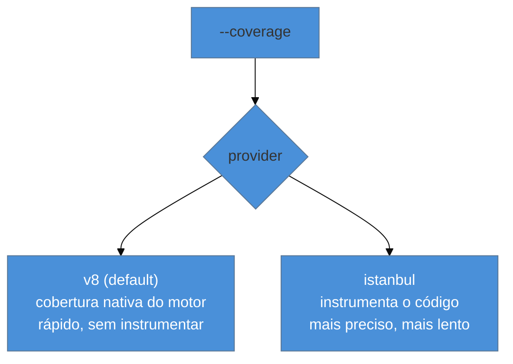

# Cobertura no ecossistema JS

> [!abstract] TL;DR
> `vitest run --coverage` mede quanto do código os testes exercitaram, em quatro dimensões: **linhas, statements, funções e branches** (a de branches é a que mais importa). O Vitest oferece dois provedores: **v8** (usa a cobertura nativa do motor V8 — rápido, o default) e **istanbul** (instrumenta o código — mais preciso em casos de borda). Você configura **thresholds** que falham o build abaixo de um percentual. A lição central (a mesma de [[03-Dominios/Engenharia/Testes/12 - Coverage e mutation testing|Engenharia/Testes 12]]): cobertura mede o que foi **executado**, não o que foi **verificado** — 100% de cobertura com asserções fracas não prova nada. É um detector de *buracos*, não um selo de qualidade.

## O problema: "quanto do meu código está testado?"

É uma pergunta legítima — e perigosa. Legítima porque você quer saber se há partes do código que *nenhum* teste toca (candidatas óbvias a bugs). Perigosa porque a resposta, um número percentual, é fácil de transformar numa meta idólatra ("temos que chegar a 100%") que produz testes inúteis escritos só para subir o número.

A cobertura é uma ferramenta valiosa quando você entende **o que ela mede e o que não mede**. Esta nota é o ferramental JS (como rodar, os provedores, os thresholds) ancorado na lição conceitual que a Engenharia/Testes já estabeleceu: cobertura alta ≠ testes bons.

## Rodar e ler a cobertura

```bash
vitest run --coverage
```

(Requer instalar o provider: `npm i -D @vitest/coverage-v8`.) A saída é uma tabela por arquivo com quatro métricas:

| Métrica | Mede | Nota |
|---------|------|------|
| **% Stmts** | statements executados | granular |
| **% Branch** | ramos (if/else, `&&`, ternários, `?.`) percorridos | **a mais reveladora** |
| **% Funcs** | funções chamadas | pega funções mortas |
| **% Lines** | linhas executadas | a mais citada, a menos informativa |

A métrica que mais importa é **branches**: 100% de linhas com 50% de branches significa que você roda o código mas nunca testa o caminho do `else`, do erro, do caso vazio — exatamente onde os bugs moram. "% Lines" alto com "% Branch" baixo é o retrato de uma suíte que passa por tudo sem testar as decisões.

## Os dois provedores: v8 vs istanbul



- **v8** (`@vitest/coverage-v8`): usa a cobertura que o **motor V8** já coleta nativamente. Não instrumenta seu código, então é **rápido** e não distorce o que roda. É o **default** e a escolha da maioria. Historicamente tinha imprecisões em mapear de volta ao código-fonte (via source maps), muito melhoradas ao longo do tempo.
- **istanbul** (`@vitest/coverage-istanbul`): **instrumenta** o código (insere contadores) antes de rodar. É mais **preciso** em casos de borda de mapeamento, ao custo de ser mais lento. Escolha-o se você notar números de cobertura estranhos com o v8.

Config no `vitest.config`:

```ts
export default defineConfig({
  test: {
    coverage: {
      provider: 'v8',                    // ou 'istanbul'
      reporter: ['text', 'html', 'lcov'], // terminal + relatório navegável + p/ CI
      exclude: ['**/*.config.*', 'src/types/**'],
      thresholds: {
        lines: 80, functions: 80, branches: 75, statements: 80,
      },
    },
  },
});
```

Os **thresholds** fazem o `--coverage` **falhar** se a cobertura cair abaixo do percentual — um gate de CI contra regressão de cobertura. O reporter `lcov` gera o formato que serviços de CI (Codecov, etc.) consomem; o `html` gera um relatório navegável onde você vê linha a linha o que não foi coberto.

## A armadilha: cobertura não é qualidade

> [!warning] Perseguir 100% de cobertura como meta
> **O que acontece:** o time impõe "100% de cobertura", e surgem testes que **executam** o código sem **verificar** nada — chamam a função, não afirmam o resultado, só para a linha "contar como coberta". **Por quê:** cobertura mede **execução**, não **verificação**. Um teste `expect(fn()).toBeDefined()` cobre a função inteira e não testa quase nada. 100% de cobertura com asserções vazias é 0% de confiança — e a meta de 100% incentiva exatamente esses testes-fantasma, além de custar caro nos últimos e menos valiosos pontos. **Como evitar:** trate cobertura como **detector de buracos** (o que *nenhum* teste toca), não como selo. Mire numa faixa pragmática (70–85% costuma ser saudável), priorize **branches** sobre linhas, e para medir se os testes realmente *pegam* bugs use **mutation testing** (ver [[03-Dominios/Engenharia/Testes/12 - Coverage e mutation testing|Engenharia/Testes 12]]; a ferramenta JS é o **Stryker**).

> [!question]- Então qual número de cobertura eu devo mirar?
> Não existe número universal — depende do código. Lógica de negócio crítica merece cobertura alta (perto de 90%+ de branches); código de configuração, tipos e glue trivial não valem o esforço. O erro é o **número único imposto a tudo**, que força testes inúteis no código que não precisa e dá falsa segurança no que precisa. Uma abordagem melhor: use os thresholds para **evitar regressão** (não deixar cair do patamar atual) em vez de perseguir um teto; olhe o relatório HTML para achar **branches críticos descobertos** (o `catch` que ninguém testa, o caso vazio) e cubra *esses*; e lembre que **mutation testing** responde a pergunta que cobertura não responde — "meus testes realmente pegam bugs, ou só passam pelo código?".

**Cobertura no ecossistema JS em uma frase:** `vitest --coverage` mede linhas/statements/funcs/branches (priorize branches) via provider v8 (rápido, default) ou istanbul (preciso), com thresholds que barram regressão — lembrando que cobertura mede execução, não verificação, então é um detector de buracos, não um selo de qualidade.

## Em entrevista

> "`vitest run --coverage` reports lines, statements, functions, and branches — and branches is the one I watch, because high line coverage with low branch coverage means I'm running the code but never testing the else, the error path, the empty case. Vitest has two providers: v8, which uses the engine's native coverage and is fast — the default — and istanbul, which instruments the code and is more precise. I set thresholds to fail the build on regressions. But the key point is that coverage measures execution, not verification: 100% coverage with weak assertions proves nothing. It's a hole detector, not a quality badge — for real bug-catching power I'd add mutation testing with Stryker."

| PT | EN |
|----|----|
| Cobertura de testes | Test coverage |
| Ramo (branch) | Branch |
| Instrumentar o código | Instrument the code |
| Limiar (threshold) | Threshold |
| Detector de buracos | Hole detector |
| Teste de mutação | Mutation testing |

## O que vem a seguir

Fechamos a fase Adepto — o ferramental de unit, componente, rede, hooks e qualidade. A fase Magus sobe a pirâmide até o topo: os testes **end-to-end** no browser real, começando pela ferramenta que dominou a categoria, o Playwright.

- [[03-Dominios/Tecnologia/Testes JS/13 - Playwright - E2E|13 — Playwright: E2E]] — locators, auto-wait, fixtures, trace.
- [[03-Dominios/Engenharia/Testes/12 - Coverage e mutation testing|Engenharia/Testes 12]] — coverage e mutation testing, a teoria completa.

## Fontes

- **Vitest** — [*Coverage*](https://vitest.dev/guide/coverage.html) — `--coverage`, v8 vs istanbul, thresholds, reporters.
- **Istanbul** — [istanbul.js.org](https://istanbul.js.org/) — o instrumentador por trás do provider istanbul.
- **Stryker** — [stryker-mutator.io](https://stryker-mutator.io/) — mutation testing em JS, a resposta ao "cobertura não é qualidade".
