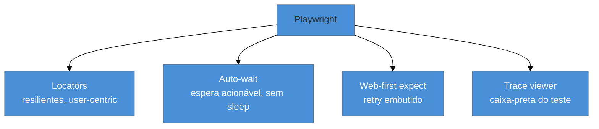

# Playwright: E2E

> [!abstract] TL;DR
> Testes **E2E** exercitam o app inteiro num **browser real** — o fluxo do usuário de ponta a ponta, do clique ao banco. O **Playwright** dominou a categoria em 2026. Suas armas: **locators** (seletores resilientes, no estilo user-centric da Testing Library), **auto-waiting** (ele espera o elemento estar acionável antes de agir — sem `sleep`), **web-first assertions** (`expect(locator).toBeVisible()` tem retry embutido), **fixtures** e **projects** (rodar em Chromium/Firefox/WebKit), e o **trace viewer** (uma "caixa-preta" que grava tudo para depurar falhas). E2E é o topo da pirâmide: poucos, caros, mas insubstituíveis para os caminhos críticos.

## O problema: unit e componente não pegam tudo

Você tem unit tests, testes de componente com Testing Library, MSW mockando a rede. A cobertura está boa. E ainda assim, em produção, o botão de checkout não funciona — porque o roteamento, a autenticação real, o banco e o front só se encontram **no browser, juntos**, e nada disso foi exercitado em conjunto. Cada peça foi testada isolada; a **integração ponta a ponta** não.

É o que o **E2E** cobre: subir o app de verdade, num browser de verdade, e simular o usuário percorrendo um fluxo completo (login → buscar → comprar). É o topo da pirâmide de testes (ver [[03-Dominios/Engenharia/Testes/02 - A pirâmide de testes e suas variações|Engenharia/Testes 02]]) — o mais caro e lento, então usado com parcimônia nos **caminhos críticos**, mas o único que prova que o sistema inteiro funciona.

## Anatomia de um teste Playwright

```ts
import { test, expect } from '@playwright/test';

test('usuário compra um produto', async ({ page }) => {
  await page.goto('/produtos');
  await page.getByRole('link', { name: 'Camiseta' }).click();
  await page.getByRole('button', { name: 'Adicionar ao carrinho' }).click();
  await page.getByRole('link', { name: 'Carrinho' }).click();

  await expect(page.getByText('Camiseta')).toBeVisible();
  await expect(page.getByRole('button', { name: 'Finalizar' })).toBeEnabled();
});
```

A fixture **`page`** é uma aba de browser isolada, entregue pronta a cada teste. Você navega, encontra elementos com **locators** e afirma com **web-first assertions**. Repare na semelhança com a Testing Library: `getByRole('button', { name: ... })` — o Playwright adotou a mesma filosofia user-centric de queries.

## As quatro colunas do Playwright



### Locators e auto-waiting

Um **locator** não é uma referência a um elemento — é uma *descrição* de como encontrá-lo, avaliada no momento da ação. Isso, combinado com o **auto-waiting**, elimina a praga do E2E antigo: o `sleep`. Antes de clicar, o Playwright **espera automaticamente** o elemento estar visível, estável, habilitado e recebendo eventos. Você nunca escreve "espere 2 segundos" — ele espera exatamente o necessário, e não mais.

### Web-first assertions

`await expect(locator).toBeVisible()` não checa uma vez e falha — ele **tenta de novo** até o elemento aparecer (dentro de um timeout). Isso mata os flaky de "a asserção rodou antes da UI atualizar", porque a espera é parte da asserção. É a diferença de um `expect` de UI de um `expect` de unit.

### Fixtures e projects

O Playwright tem um sistema de **fixtures** (como `page`, `context`, `browser`) que preparam e limpam recursos por teste. E os **projects** (no `playwright.config`) rodam a mesma suíte em várias configurações — os três engines (**Chromium, Firefox, WebKit**), mobile emulado, ou com setup diferente:

```ts
// playwright.config.ts
export default defineConfig({
  projects: [
    { name: 'chromium', use: devices['Desktop Chrome'] },
    { name: 'firefox', use: devices['Desktop Firefox'] },
    { name: 'webkit', use: devices['Desktop Safari'] },
  ],
});
```

Rodar em WebKit é como o Playwright pega bugs específicos de Safari sem um Mac — algo que o Cypress historicamente não fazia bem (nota 15).

### O trace viewer

Quando um teste E2E falha na CI, você não estava lá para ver. O **trace viewer** resolve: com `trace: 'on-first-retry'`, o Playwright grava um trace completo (snapshots do DOM a cada passo, screenshots, rede, console, timeline) que você abre depois e **navega passo a passo**, como um replay. É de longe a melhor ferramenta de depuração de E2E que existe — transforma "falhou no CI, não sei por quê" em "vejo exatamente o estado da página no momento da falha".

> [!warning] Usar `page.waitForTimeout` (sleep) para "estabilizar" o teste
> **O que acontece:** o teste falha intermitentemente, você adiciona `await page.waitForTimeout(2000)` antes da ação, e "resolve" — até voltar a falhar numa CI mais lenta, ou ficar lento demais. **Por quê:** `sleep` é uma aposta cega: ou espera de menos (flaky) ou de mais (lento). Ele ignora o auto-waiting que o Playwright já faz de graça. **Como evitar:** confie no auto-wait dos locators e nas web-first assertions. Se precisa esperar uma **condição**, espere *a condição* (`await expect(locator).toBeVisible()`, `page.waitForResponse(...)`), nunca um tempo fixo. `waitForTimeout` só em depuração descartável, jamais commitado.

> [!question]- E2E é tão poderoso — por que não testar tudo com Playwright?
> Porque E2E é **caro** em todos os eixos: lento (sobe browser, app, banco), frágil (mais partes móveis = mais pontos de falha) e difícil de diagnosticar (a falha pode estar em qualquer camada). A pirâmide de testes existe por isso: muitos unit (rápidos, precisos), alguns de integração/componente, **poucos** E2E nos **caminhos críticos** (login, checkout, o fluxo que dá dinheiro). Testar cada regra de negócio via E2E seria uma suíte de horas, flaky, que ninguém confia. Regra: E2E prova que as peças se conectam no fluxo essencial; a corretude de cada peça é dos testes mais baixos e baratos. Poucos E2E bem escolhidos valem mais que centenas cobrindo detalhes.

**Playwright E2E em uma frase:** exercita o app inteiro num browser real via locators resilientes com auto-waiting (sem `sleep`), web-first assertions com retry, projects para rodar em Chromium/Firefox/WebKit, e o trace viewer para depurar falhas — usado com parcimônia no topo da pirâmide, nos caminhos críticos.

## Em entrevista

> "E2E tests exercise the whole app in a real browser — the user's flow end to end, which unit and component tests can't cover because routing, auth, and the database only meet in the browser. Playwright dominates this in 2026. Its killer features: **locators** with **auto-waiting**, so I never write `sleep` — it waits for the element to be actionable; **web-first assertions** like `toBeVisible` that retry, killing timing flakiness; **projects** to run across Chromium, Firefox, and WebKit; and the **trace viewer**, which records a full replay of the run so I can debug CI failures step by step. E2E is the top of the pyramid — few, on critical paths only."

| PT | EN |
|----|----|
| Ponta a ponta | End-to-end (E2E) |
| Localizador | Locator |
| Espera automática | Auto-waiting |
| Asserção com retry | Web-first (retrying) assertion |
| Visualizador de trace | Trace viewer |
| Caminho crítico | Critical path |

## O que vem a seguir

O básico do Playwright cobre a maioria dos E2E. Mas ele foi muito além do E2E clássico: testa componentes em browser real, gerencia autenticação, faz testes visuais. A próxima nota explora esse território avançado.

- [[03-Dominios/Tecnologia/Testes JS/14 - Playwright além do básico|14 — Playwright além do básico]] — component testing, auth, visual.
- [[03-Dominios/Engenharia/Testes/02 - A pirâmide de testes e suas variações|Engenharia/Testes 02]] — onde o E2E se encaixa na pirâmide, como base.

## Fontes

- **Playwright** — [*Writing tests*](https://playwright.dev/docs/writing-tests) — locators, ações e web-first assertions.
- **Playwright** — [*Auto-waiting*](https://playwright.dev/docs/actionability) — a lista de checagens antes de cada ação.
- **Playwright** — [*Trace viewer*](https://playwright.dev/docs/trace-viewer) — depurar falhas com o replay.
