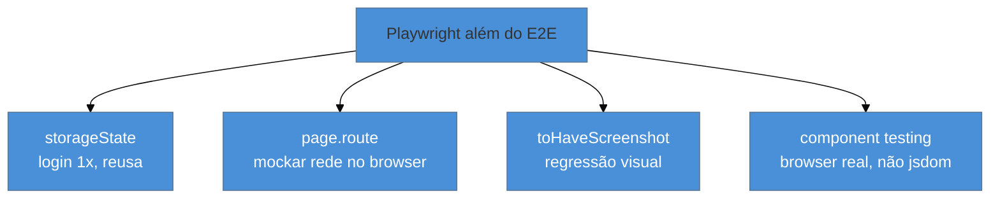

# Playwright além do básico

> [!abstract] TL;DR
> O Playwright vai muito além do E2E clássico. **Autenticação reusável:** faça login uma vez, salve o `storageState` (cookies + localStorage) e reuse em todos os testes — sem logar em cada um. **Interceptar rede:** `page.route()` mocka respostas HTTP direto no browser (ou reuse os handlers do MSW). **Testes visuais:** `toHaveScreenshot()` compara a tela pixel a pixel para pegar regressões visuais. E o **component testing** (experimental) roda componentes React em **browser real** (Chromium/Firefox/WebKit) em vez de jsdom — eliminando o "passa no jsdom, quebra no browser". São as capacidades que fazem o Playwright cobrir do componente ao fluxo completo.

## O problema: E2E básico é lento e repetitivo

Você tem os E2E dos caminhos críticos (nota 13). Mas logo bate em fricções: **todo** teste precisa de um usuário logado — e logar via UI em cada um é lento e repetitivo. Alguns testes precisam de uma resposta de API específica (um erro 500, um estado raro) que é difícil de reproduzir no backend real. E há bugs **visuais** (um CSS que quebrou o layout) que nenhuma asserção de texto pega. Além disso, o teste de componente em jsdom (nota 08) às vezes mente — passa no jsdom mas quebra no browser real, porque jsdom não é um browser de verdade.

O Playwright tem resposta para cada uma dessas fricções. São os recursos que o transformam de "runner de E2E" em plataforma de teste de browser completa.

## Autenticação reusável: `storageState`

Logar via UI em cada teste é o maior desperdício de tempo em suítes E2E. A solução: logar **uma vez**, salvar o estado de autenticação (cookies + localStorage) num arquivo, e **reusá-lo**:

```ts
// auth.setup.ts — roda uma vez antes dos testes
import { test as setup } from '@playwright/test';

setup('authenticate', async ({ page }) => {
  await page.goto('/login');
  await page.getByLabel('E-mail').fill('ana@ex.com');
  await page.getByLabel('Senha').fill('senha');
  await page.getByRole('button', { name: 'Entrar' }).click();
  await page.context().storageState({ path: 'auth.json' }); // salva o estado
});

// playwright.config.ts — os testes começam já logados
export default defineConfig({
  projects: [
    { name: 'setup', testMatch: /auth\.setup\.ts/ },
    { name: 'chromium', use: { storageState: 'auth.json' }, dependencies: ['setup'] },
  ],
});
```

Todos os testes do projeto `chromium` começam **já autenticados**, sem repetir o login. É mais rápido e isola o "fluxo de login" no seu próprio teste (onde ele realmente deve ser testado).

## Interceptar a rede: `page.route`

Assim como o MSW (nota 09), o Playwright pode **mockar respostas HTTP** — útil para forçar estados difíceis de reproduzir (erro do servidor, resposta lenta, dado específico):

```ts
await page.route('**/api/pedidos', (route) =>
  route.fulfill({ status: 500, body: 'erro' })
);
await page.goto('/pedidos');
await expect(page.getByText('Falha ao carregar')).toBeVisible();
```



> [!question]- Uso `page.route` do Playwright ou reuso o MSW (nota 09) no E2E?
> Depende do que você quer testar. Se o objetivo do E2E é validar o **fluxo real ponta a ponta**, o ideal é bater no **backend de verdade** (ou num de staging) — mockar a rede num E2E o transforma parcialmente num teste de integração. Você usa `page.route` (ou MSW) no E2E de forma **cirúrgica**: para forçar um estado que o backend não produz facilmente (um erro 500, um timeout, um dado de borda), ou para isolar o front de um serviço de terceiros instável. A vantagem de **reusar os handlers do MSW** é não duplicar mocks entre os testes de componente e os E2E — é justamente o argumento de reuso da nota 09. Regra: E2E "de verdade" bate no backend real; use interceptação só para os estados que valem mockar.

## Testes visuais: `toHaveScreenshot`

Bugs de layout (um CSS que empurrou tudo, um componente que sumiu) não têm texto para asserir. O **visual regression testing** compara um screenshot atual com um de referência:

```ts
await expect(page).toHaveScreenshot('home.png'); // 1ª vez grava; depois compara
```

Na primeira execução grava a imagem de referência; nas seguintes compara pixel a pixel (com tolerância configurável) e falha se divergir. É o análogo visual do snapshot (nota 11) — e tem os mesmos cuidados: fontes/animações/dados dinâmicos causam diferenças espúrias, então estabilize (desligue animações, use dados fixos) antes de capturar.

## Component testing em browser real

O teste de componente com Testing Library roda em **jsdom** — uma *simulação* de DOM, não um browser. Isso gera o problema "passa no jsdom, quebra no Safari": jsdom não implementa layout real, algumas APIs, comportamentos de CSS. O **component testing do Playwright** (ainda experimental em 2026) roda o componente num **browser de verdade** (Chromium/Firefox/WebKit):

```ts
import { test, expect } from '@playwright/experimental-ct-react';
import { Botao } from './Botao';

test('renderiza e clica', async ({ mount }) => {
  const comp = await mount(<Botao>Enviar</Botao>);
  await expect(comp).toContainText('Enviar');
});
```

Para UIs complexas (drag-and-drop, WebGL, media, medições de layout), isso elimina a divergência jsdom-vs-browser. Como ainda é experimental, para componentes simples o combo Vitest + Testing Library (jsdom) segue mais rápido e maduro; o CT do Playwright brilha onde o browser real importa.

> [!warning] Screenshots visuais sem estabilizar o ambiente
> **O que acontece:** o teste visual falha em toda execução com diferenças mínimas — uma fonte que renderiza diferente, um cursor piscando, um timestamp na tela. **Por quê:** comparação pixel a pixel é sensível a qualquer não-determinismo: animações, fontes do SO, dados dinâmicos, antialiasing entre ambientes (seu Mac vs. o Linux da CI). **Como evitar:** estabilize antes de capturar — desligue animações (`animations: 'disabled'`), fixe dados/datas, rode a captura de referência **no mesmo ambiente da CI** (via Docker), e use `maxDiffPixels`/tolerância. Screenshot instável é o snapshot gigante da nota 11 em forma visual.

**Playwright além do básico em uma frase:** `storageState` reusa o login (rápido), `page.route` mocka a rede no browser para estados difíceis, `toHaveScreenshot` pega regressões visuais, e o component testing experimental roda componentes em browser real — cobrindo do componente ao fluxo, com os mesmos cuidados de estabilização dos snapshots.

## Em entrevista

> "Playwright goes well beyond basic E2E. For auth I log in once, save the `storageState` — cookies and localStorage — and reuse it, so tests don't each log in through the UI. `page.route` lets me mock network responses in the browser to force hard-to-reproduce states like a 500. `toHaveScreenshot` does visual regression testing, comparing pixels to catch layout bugs. And its experimental **component testing** runs components in a real browser instead of jsdom, killing the 'works in jsdom, breaks in Safari' problem — valuable for complex UIs, though for simple components Vitest plus Testing Library is still faster and more mature."

| PT | EN |
|----|----|
| Estado de autenticação | Auth state / storageState |
| Interceptar a rede | Intercept the network |
| Regressão visual | Visual regression |
| Component testing em browser real | Real-browser component testing |
| Estabilizar o ambiente | Stabilize the environment |
| Tolerância de diferença | Diff tolerance |

## O que vem a seguir

Você conhece o Playwright a fundo. Mas por que *ele*, e não o Cypress, que dominou a categoria antes? Entender essa disputa — e os trade-offs de arquitetura — é o que fecha uma decisão de ferramenta bem fundamentada.

- [[03-Dominios/Tecnologia/Testes JS/15 - Playwright vs Cypress|15 — Playwright vs Cypress]] — o cenário E2E e por que o Playwright dominou.
- [[03-Dominios/Tecnologia/Testes JS/11 - Snapshot testing|11 — Snapshot testing]] — o análogo não-visual, como reforço.

## Fontes

- **Playwright** — [*Authentication*](https://playwright.dev/docs/auth) — `storageState` e login reusável.
- **Playwright** — [*Visual comparisons*](https://playwright.dev/docs/test-snapshots) e [*Mock APIs / network*](https://playwright.dev/docs/mock) — screenshots e `page.route`.
- **Playwright** — [*Components (experimental)*](https://playwright.dev/docs/test-components) — component testing em browser real.
