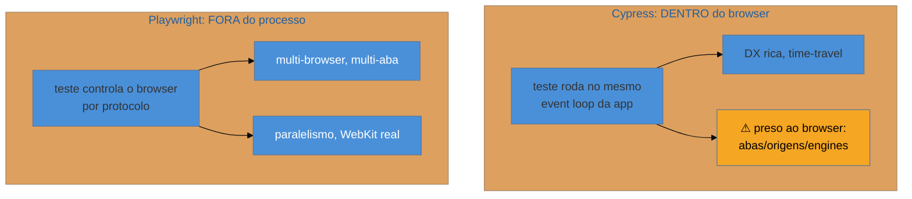

# Playwright vs Cypress

> [!abstract] TL;DR
> A escolha do framework E2E se resolve na **arquitetura**. O **Cypress** roda o teste **dentro do browser**, junto da sua app — o que deu uma DX incrível (time-travel, ver o app enquanto testa) mas o prendeu ao event loop do browser: limitações com múltiplas abas, múltiplas origens, e suporte tardio/parcial a outros engines. O **Playwright** roda **fora do processo**, controlando o browser por protocolo — o que lhe dá multi-browser real (Chromium/Firefox/**WebKit**), múltiplas abas/contextos, paralelismo nativo e o trace viewer. Em 2026 o Playwright **dominou** para projetos novos; o Cypress ainda vive por DX e bases existentes. Regra: projeto novo → Playwright, salvo razão específica.

## O problema: qual framework E2E escolher?

Você vai montar a camada E2E do zero. As duas opções sérias são Cypress e Playwright, e a escolha não é trivial — envolve reescrever a suíte se você errar. O Cypress foi o queridinho da categoria por anos, com uma experiência de desenvolvimento celebrada; o Playwright chegou depois, da Microsoft, e virou o padrão. Por quê? A resposta não é "um é melhor" no vácuo — é entender a **decisão de arquitetura** de cada um, porque é dela que decorrem todas as diferenças práticas.

## A diferença que explica tudo: onde o teste roda

- **Cypress** roda o **teste dentro do browser**, no mesmo contexto da sua aplicação. Isso deu a ele a DX que o tornou famoso: o **time-travel debugging** (você "volta no tempo" e vê o estado do app em cada comando), o runner visual que mostra a app rodando ao vivo, e uma sensação de estar "dentro" do app. Mas rodar dentro do browser tem um custo estrutural: o teste está **preso ao event loop e ao sandbox do browser**, o que historicamente causou limitações com **múltiplas abas**, **múltiplas origens** (cross-domain), iframes, e um suporte **tardio e parcial** a outros engines (por muito tempo só Chromium; Firefox e WebKit vieram depois e com ressalvas).
- **Playwright** roda o **teste fora do processo do browser**, controlando-o via **protocolo de automação**. Como não vive dentro do browser, ele não tem essas amarras: dirige **Chromium, Firefox e WebKit** de verdade (o WebKit permite pegar bugs de Safari sem um Mac), lida naturalmente com **múltiplas abas e contextos**, paraleliza nativamente, e grava o **trace viewer** (nota 13).

## A comparação prática

| Dimensão | Cypress | Playwright |
|----------|---------|------------|
| Arquitetura | dentro do browser | fora do processo (protocolo) |
| Browsers | Chromium sólido; Firefox/WebKit limitados | Chromium, Firefox, **WebKit** de 1ª classe |
| Múltiplas abas/origens | difícil (limitação estrutural) | nativo |
| Paralelismo | pago/via dashboard historicamente | nativo e gratuito |
| DX/debugging | **time-travel**, runner visual (destaque) | trace viewer, codegen, UI mode |
| Linguagem | JS/TS | JS/TS, Python, Java, .NET |
| Momento (2026) | em declínio para projetos novos | **dominante** |

## Por que o Playwright dominou — e onde o Cypress ainda cabe

O Playwright venceu porque a arquitetura fora-do-processo resolveu as dores estruturais do Cypress (multi-browser real, abas, origens, paralelismo grátis) **sem perder** a boa DX (o UI mode e o trace viewer são excelentes). Para a maioria dos **projetos novos** em 2026, ele é a escolha padrão.

Isso **não** torna o Cypress ruim. Ele ainda tem uma DX muito querida (o time-travel é genuinamente ótimo para debugar), uma comunidade grande, e é uma escolha perfeitamente razoável para **bases de código que já o usam** — migrar uma suíte E2E grande custa caro e raramente se justifica só por moda. A decisão madura: **projeto novo → Playwright**; **base existente saudável em Cypress → fique**, a menos que você bata nas limitações (precisa de WebKit, múltiplas abas, paralelismo grátis).

> [!question]- Se o Cypress ainda funciona, migrar do Cypress para Playwright vale a pena?
> Raramente só por "estar na moda" — e aqui vale a mesma disciplina do [[03-Dominios/Engenharia/Testes/index|resto de testes]]: mudança de ferramenta é custo, não virtude. Migrar uma suíte E2E significativa consome semanas e introduz risco de regressão na própria rede de segurança. Justifica-se quando há uma **dor concreta**: você precisa testar em **WebKit/Safari** (o Cypress não cobre bem), precisa de **múltiplas abas/origens** que o Cypress trava, o **paralelismo** virou gargalo/custo, ou a suíte está flaky de um jeito que a arquitetura do Playwright resolveria. Sem uma dessas dores, o ganho é marginal e o custo é real — fique no Cypress. Para *projeto novo*, porém, comece com Playwright: você evita a dívida de saída.

> [!warning] Escolher pela DX de um demo, ignorando a arquitetura
> **O que acontece:** o time escolhe pela demo bonita (o time-travel do Cypress encanta), e meses depois bate numa parede estrutural — precisa testar num fluxo com duas abas, ou em WebKit, e a ferramenta não deixa. **Por quê:** DX impressiona num demo curto; limitações de arquitetura só aparecem quando a suíte cresce e encontra casos reais (múltiplas origens, outro engine, paralelismo em escala). **Como evitar:** decida pela **arquitetura e pelos requisitos** (quais browsers? múltiplas abas? paralelismo? orçamento?), não pela primeira impressão. A DX importa, mas não paga uma parede estrutural lá na frente.

**Playwright vs Cypress em uma frase:** a diferença é arquitetural — Cypress roda *dentro* do browser (DX rica com time-travel, mas preso a abas/origens/engines) e Playwright roda *fora* (multi-browser real incl. WebKit, múltiplas abas, paralelismo nativo, trace viewer) —, o que fez o Playwright dominar projetos novos em 2026, embora o Cypress siga válido em bases existentes sem dores estruturais.

## Em entrevista

> "The E2E choice comes down to architecture. **Cypress** runs the test **inside the browser**, alongside your app — that gave it fantastic DX, like time-travel debugging, but tied it to the browser's event loop, so multiple tabs, multiple origins, and non-Chromium engines were long a struggle. **Playwright** runs **out-of-process**, driving the browser over a protocol, so it gets real multi-browser including WebKit, multiple tabs and contexts, native parallelism, and the trace viewer. That's why Playwright dominates new projects in 2026. Cypress isn't bad — its DX is loved and it's fine for existing suites — but for a new project I start with Playwright."

| PT | EN |
|----|----|
| Dentro do browser | In-browser |
| Fora do processo | Out-of-process |
| Protocolo de automação | Automation protocol |
| Depuração time-travel | Time-travel debugging |
| Múltiplas origens | Multiple origins (cross-origin) |
| Amarra estrutural | Structural constraint |

## O que vem a seguir

Escolhida a ferramenta, resta o inimigo transversal de toda suíte — especialmente da E2E: os **testes flaky**, que falham de forma intermitente e corroem a confiança na suíte inteira. O ferramental JS tem armas específicas contra eles.

- [[03-Dominios/Tecnologia/Testes JS/16 - Testes flaky em JS|16 — Testes flaky em JS]] — auto-wait, retries, isolamento.
- [[03-Dominios/Engenharia/Testes/11 - Testes flaky|Engenharia/Testes 11]] — a teoria dos flaky, como base.

## Fontes

- **Playwright** — [*Why Playwright*](https://playwright.dev/docs/why-playwright) — a arquitetura out-of-process e o multi-browser.
- **Cypress** — [*Cypress docs*](https://docs.cypress.io/) — arquitetura in-browser e time-travel.
- **State of JS** — [stateofjs.com — testing](https://stateofjs.com/) — a adoção relativa de Playwright e Cypress ao longo do tempo.
