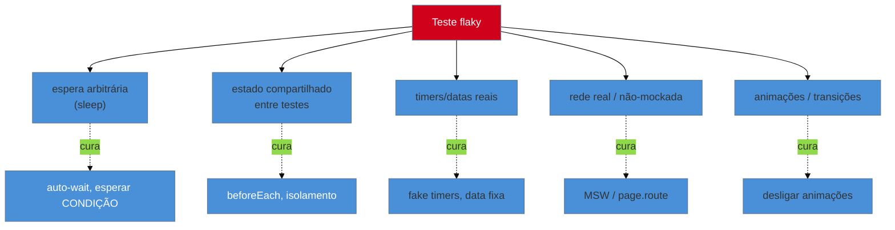

# Testes flaky em JS

> [!abstract] TL;DR
> Um teste **flaky** passa e falha sem o código mudar — e um só corrói a confiança na suíte inteira (o time começa a re-rodar no automático e a ignorar vermelhos). No ecossistema JS as causas concretas são conhecidas: **esperas arbitrárias** (`sleep`), **estado compartilhado** entre testes, **ordem/paralelismo**, **timers e datas reais**, **rede não-mockada** e **animações**. As curas mapeiam uma a uma: `await`/auto-wait em vez de `sleep` (notas 05/13), isolamento com estado fresco (nota 04), mock de rede (nota 09), fake timers (nota 05). Os **retries** do Playwright/Vitest são **rede de contenção e diagnóstico**, não conserto — um teste que só passa no retry ainda está flaky.

## O problema: o teste que "às vezes falha"

Nada destrói a confiança numa suíte mais rápido que a flakiness. Um teste que falha 1 em cada 20 execuções, sem mudança de código, treina o time a fazer a coisa mais perigosa possível: **re-rodar o CI até passar** e ignorar vermelhos. A partir daí, a suíte parou de proteger — quando um bug **real** aparecer, ninguém vai acreditar no vermelho. Um único flaky contamina a credibilidade de todos os outros testes.

A teoria da flakiness — por que acontece, o custo, a estratégia de quarentena — está em [[03-Dominios/Engenharia/Testes/11 - Testes flaky|Engenharia/Testes 11]]. Esta nota é o **como no JS**: as causas concretas neste ecossistema e as ferramentas específicas para eliminá-las.

## As causas concretas no JS (e a cura de cada uma)

Quase todo flaky em JS cai numa destas categorias — e a boa notícia é que cada uma tem um remédio já visto neste galho:



| Causa | Por que gera flaky | Cura (nota) |
|-------|--------------------|-------------|
| **Espera arbitrária** (`sleep`/`waitForTimeout`) | ora espera de menos (falha), ora de mais (lento) | auto-wait; esperar a *condição* (13); `await` (05) |
| **Estado compartilhado** entre testes | um teste herda a bagunça do outro; depende da ordem | `beforeEach` com estado fresco; isolamento (04) |
| **Ordem / paralelismo** | testes paralelos disputam recurso (DB, arquivo, porta) | isolar recursos; resetar mocks/handlers (06/09) |
| **Timers e datas reais** | `Date.now()`/`setTimeout` variam com a máquina | fake timers; injetar data fixa (05) |
| **Rede real não-mockada** | latência e respostas variáveis, serviços instáveis | MSW (09) ou `page.route` (14) |
| **Animações/transições** | o elemento "ainda está animando" quando o teste age | desligar animações no teste |

A lição unificadora: **flaky quase sempre é tempo e estado não-controlados**. Você elimina flakiness tornando o teste **determinístico** — controlando quando as coisas acontecem (esperar condições, não tempo; fake timers) e garantindo que cada teste parte de um estado limpo (isolamento).

## A arma mais mal-usada: retries

Playwright e Vitest permitem **re-executar** um teste que falhou:

```ts
// playwright.config.ts
export default defineConfig({
  retries: process.env.CI ? 2 : 0,  // 2 tentativas na CI, 0 local
});
```

Retries são úteis — **mas para o propósito certo**. Eles são:

- **Rede de contenção:** impedem que um flaky ocasional quebre um deploy legítimo enquanto você o conserta.
- **Sinal de diagnóstico:** o Playwright marca testes que passaram só no retry como **"flaky"** no relatório — isso te dá a *lista* dos flaky para consertar.

O que retries **não** são: um conserto. Um teste que só passa na segunda tentativa **continua flaky** — você só escondeu o sintoma. Tratar retry como solução é o caminho para uma suíte que "passa" mas não testa nada de forma confiável.

> [!warning] Usar retries como conserto de flaky
> **O que acontece:** o time liga `retries: 3`, os vermelhos somem do CI, e todos consideram o problema resolvido. Meses depois, a suíte é lenta (re-roda muita coisa) e ninguém confia nela. **Por quê:** retry mascara o flaky sem removê-lo. O teste ainda é não-determinístico; você só aumentou a chance de ele passar por sorte — e escondeu bugs reais que se manifestam de forma intermitente. **Como evitar:** use retries como **contenção temporária + diagnóstico** (a lista de "flaky" do relatório), e **conserte** a causa raiz (espera arbitrária, estado compartilhado, timer real). Um teste que precisa de retry para passar entra na fila de conserto, não na de "resolvido".

> [!question]- E o teste que é flaky e eu não consigo consertar agora?
> Coloque em **quarentena**, não deixe poluindo o sinal. A estratégia (de [[03-Dominios/Engenharia/Testes/11 - Testes flaky|Engenharia/Testes 11]]): marque-o (`test.fixme` no Playwright, `test.skip` com um motivo, ou uma tag `@flaky`) para que ele **saia do caminho crítico** do CI — não reprova o deploy — mas fique **registrado e visível** numa lista de dívida a resolver. O que você **nunca** faz é deixá-lo falhando aleatoriamente no meio da suíte principal: ou ele é confiável e fica, ou é flaky e vai para a quarentena com um ticket. O pior dos mundos é o flaky "ativo" que treina todos a ignorar vermelhos. Quarentena é honestidade: "sei que este não é confiável, isolei, e vou consertar".

**Testes flaky em JS em uma frase:** flaky é tempo e estado não-controlados — `sleep`, estado compartilhado, timers/datas/rede reais, animações —, e a cura é tornar o teste determinístico (auto-wait/esperar condição, isolamento, fake timers, MSW), usando retries só como contenção e diagnóstico (nunca como conserto) e quarentena para o que não dá pra consertar agora.

## Em entrevista

> "A flaky test passes and fails without code changes, and a single one corrodes trust in the whole suite — people start re-running CI on autopilot and ignoring reds. In JS the causes are concrete: arbitrary `sleep`s, shared state between tests, real timers and dates, un-mocked network, animations. Each has a fix I already use: auto-wait instead of sleep, `beforeEach` for isolation, fake timers, MSW. Retries in Playwright and Vitest are a safety net and a diagnostic — they flag flaky tests — but not a fix: a test that only passes on retry is still flaky. What I don't fix now goes into quarantine with a ticket, off the critical path but visible."

| PT | EN |
|----|----|
| Teste instável | Flaky test |
| Determinístico | Deterministic |
| Espera arbitrária | Arbitrary wait |
| Rede de contenção | Safety net |
| Quarentena | Quarantine |
| Causa raiz | Root cause |

## O que vem a seguir

Testes confiáveis precisam rodar automaticamente onde importa: no pipeline. A penúltima nota leva a suíte para a CI — matriz de browsers, sharding, cache, reporters e o Playwright rodando no servidor.

- [[03-Dominios/Tecnologia/Testes JS/17 - Testes na CI|17 — Testes na CI]] — matriz, sharding, cache, reporters.
- [[03-Dominios/Engenharia/Testes/11 - Testes flaky|Engenharia/Testes 11]] — a estratégia completa contra flaky, como base.

## Fontes

- **Playwright** — [*Retries*](https://playwright.dev/docs/test-retries) — retries, o marcador "flaky" e o propósito correto.
- **Playwright** — [*Best Practices*](https://playwright.dev/docs/best-practices) — evitar `waitForTimeout`, esperar condições, isolamento.
- **Vitest** — [*Test API — `retry`*](https://vitest.dev/api/#test-retry) — retries por teste/config.
