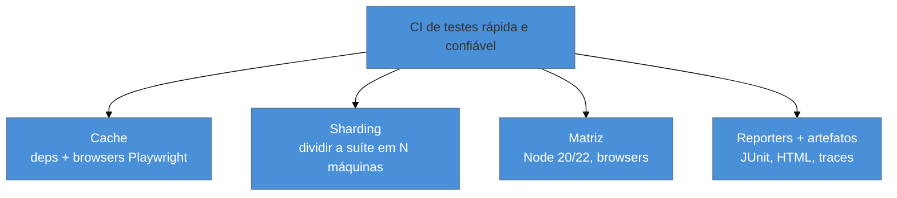

# Testes na CI

> [!abstract] TL;DR
> Um teste só protege se roda **automaticamente em cada mudança** — na CI. As peças no ecossistema JS: rodar em modo não-interativo (`vitest run`, não o watch — nota 02); **cache** de dependências e dos **browsers do Playwright** (baixá-los toda vez é lento); **sharding** para dividir a suíte entre máquinas paralelas; **matriz** para rodar em várias versões de Node/browsers; **reporters** que a CI entende (JUnit XML, e o HTML report do Playwright); e **artefatos** (traces, screenshots, vídeos) salvos nas falhas para depurar depois. O Playwright exige `npx playwright install --with-deps` para baixar os browsers no runner.

## O problema: o teste que só roda na máquina do dev

Você tem uma suíte excelente — unit, componente, E2E. Mas ela roda quando *alguém lembra* de rodar, na máquina de quem escreveu. Um colega abre um PR que quebra três testes e ninguém percebe até produção, porque a suíte não rodou naquele PR. Testes que não rodam automaticamente são teatro: dão a sensação de segurança sem a garantia.

A CI resolve isso rodando a suíte em **cada push/PR**, num ambiente limpo, bloqueando o merge se algo quebrar (o gate da [[03-Dominios/Engenharia/Testes/15 - Testes em CI-CD|Engenharia/Testes 15]]). Esta nota é o ferramental JS de fazer isso bem — porque uma CI de testes ingênua é lenta, cara e frágil, e há técnicas concretas para cada problema.

## O básico: rodar em modo CI

O ponto de partida é rodar em modo **não-interativo**:

```yaml
# .github/workflows/test.yml (exemplo GitHub Actions)
- run: npm ci
- run: npx vitest run --coverage        # 'run', nunca 'vitest' (watch trava o CI)
- run: npx playwright install --with-deps # baixa os browsers no runner
- run: npx playwright test
```

Dois cuidados que quebram CIs ingênuas:

- **`vitest run`**, não `vitest` — o watch mode nunca sai e estoura o timeout (a armadilha da nota 02).
- **`playwright install --with-deps`** — o runner de CI não tem os browsers; o Playwright precisa baixá-los (e as libs de sistema). Esquecer isso é o erro nº 1 de "Playwright funciona local, falha no CI".

## As técnicas que fazem a diferença



### Cache

Baixar `node_modules` e os browsers do Playwright a cada run é lento e caro. Cacheie ambos (o cache de deps por hash do lockfile; o dos browsers pela versão do Playwright). Isso corta minutos de cada execução — o ganho de performance mais fácil da CI.

### Sharding: paralelizar entre máquinas

Uma suíte grande (sobretudo E2E) leva muito tempo em série. **Sharding** divide os testes em N pedaços que rodam em **máquinas paralelas**:

```yaml
strategy:
  matrix:
    shard: [1, 2, 3, 4]
steps:
  - run: npx playwright test --shard=${{ matrix.shard }}/4
```

Quatro máquinas rodam 1/4 da suíte cada; o tempo total cai ~4×. O Playwright tem sharding embutido (`--shard=X/N`); o Vitest também (`--shard`). Depois você agrega os relatórios (o Playwright tem `merge-reports`).

### Matriz

A **matriz** roda a suíte em várias configurações — versões de Node (20, 22), sistemas, ou browsers — para pegar bugs específicos de ambiente. Combina com o `projects` do Playwright (nota 13) para os engines.

### Reporters e artefatos

A CI precisa de saída que ela **entende** e que ajuda a depurar:

- **Reporters:** `junit` (XML que a maioria das CIs lê para mostrar testes na UI), mais o **HTML report** do Playwright para navegar os resultados. No Vitest, `reporter: ['default', 'junit']`.
- **Artefatos:** salve **traces, screenshots e vídeos** do Playwright **nas falhas** (`trace: 'on-first-retry'`, `screenshot: 'only-on-failure'`) como artefatos do job. Assim, quando um E2E falha no CI, você baixa o trace e abre no trace viewer (nota 13) — a única forma sã de depurar uma falha que você não viu acontecer.

> [!warning] Não persistir traces/artefatos das falhas de E2E
> **O que acontece:** um teste E2E falha no CI, você olha o log, vê "elemento não encontrado", e não faz ideia do porquê — o app estava num estado que você não pode reproduzir. **Por quê:** sem trace/screenshot/vídeo salvos, a falha é uma caixa-preta. Logs de texto não mostram o **estado da página** no momento do erro. **Como evitar:** configure o Playwright para gravar trace/screenshot **na falha** e faça o upload como **artefato do job** (`actions/upload-artifact`). Depurar E2E de CI sem o trace é adivinhação; com o trace, é um replay passo a passo.

> [!question]- Onde essa CI de testes se encaixa no pipeline maior (CI/CD)?
> Ela é uma **etapa** do pipeline, e a ordem importa por custo. O padrão: rode primeiro o **barato e rápido** (lint, typecheck, unit/componente com Vitest) — se quebrar aqui, falha em segundos e nem vale rodar o resto. Só então rode o **caro** (E2E com Playwright), idealmente com sharding. Testes entram como **gate de merge** (o PR não funde com vermelho) e muitas vezes de novo como gate de **deploy** (não sobe para produção sem passar). A disciplina de CI/CD em si — estágios, deploy, rollback — é de [[03-Dominios/Engenharia/Testes/15 - Testes em CI-CD|Engenharia/Testes 15]] e de Operação; aqui o recorte é *como fazer a suíte JS rodar bem* dentro desse pipeline: rápida (cache, sharding), confiável (sem flaky, nota 16) e depurável (artefatos).

**Testes na CI em uma frase:** rode `vitest run` e o Playwright (com `install --with-deps`) em cada PR, acelere com cache (deps + browsers) e sharding (dividir entre máquinas), amplie com matriz (Node/browsers), e sempre persista reporters (JUnit/HTML) e artefatos (traces/screenshots nas falhas) para poder depurar o que quebrou.

## Em entrevista

> "Tests only protect if they run automatically on every change, in CI. The essentials for JS: run non-interactively — `vitest run`, never watch, which hangs CI; **cache** dependencies and the Playwright browsers, since downloading them each run is slow; **shard** the suite across parallel machines to cut wall-clock time; use a **matrix** for Node versions and browsers; and emit **reporters** the CI understands, like JUnit, plus persist **artifacts** — traces and screenshots on failure — so I can debug a CI failure in the trace viewer afterward. The number-one Playwright-in-CI gotcha is forgetting `playwright install --with-deps`."

| PT | EN |
|----|----|
| Modo não-interativo | Non-interactive mode |
| Fragmentação (sharding) | Sharding |
| Matriz de build | Build matrix |
| Cache de dependências | Dependency cache |
| Artefato do job | Job artifact |
| Gate de merge | Merge gate |

## O que vem a seguir

Você percorreu o galho inteiro — do runner ao E2E, da rede à CI. Falta amarrar tudo numa **estratégia coerente**: como combinar unit, componente, integração e E2E num app real, com o equilíbrio certo. É o capstone.

- [[03-Dominios/Tecnologia/Testes JS/18 - Capstone - estratégia de testes de um app JS-TS production-grade|18 — Capstone: estratégia de testes de um app JS/TS]] — junta tudo.
- [[03-Dominios/Engenharia/Testes/15 - Testes em CI-CD|Engenharia/Testes 15]] — CI/CD como disciplina, a teoria completa.

## Fontes

- **Playwright** — [*Continuous Integration*](https://playwright.dev/docs/ci) — `install --with-deps`, artefatos, exemplos por provedor.
- **Playwright** — [*Sharding*](https://playwright.dev/docs/test-sharding) — dividir a suíte e `merge-reports`.
- **Vitest** — [*Improving Performance / CLI (`--shard`, reporters)*](https://vitest.dev/guide/cli.html) — Vitest na CI.
