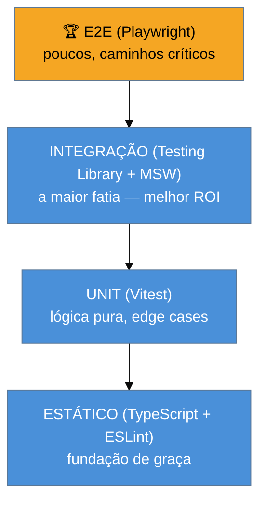

# Capstone: estratégia de testes de um app JS/TS production-grade

> [!abstract] TL;DR
> Ferramentas isoladas não são uma estratégia. O stack JS moderno se combina no formato do **troféu de testes** (não a pirâmide clássica): muitos testes de **integração** (componente + MSW), que dão o melhor retorno confiança/custo em apps de UI; uma base de **unit** (Vitest) para lógica pura e edge cases; **poucos E2E** (Playwright) nos caminhos que dão dinheiro; e testes **estáticos** (TypeScript + lint) como fundação de graça. A regra que rege tudo: **teste comportamento, priorize o nível mais barato que dá confiança suficiente, e reserve E2E para o crítico.** Este capstone junta as 17 notas numa decisão coerente.

## O problema: ter as ferramentas não é ter uma estratégia

Você agora sabe usar Vitest, Testing Library, MSW e Playwright. Mas saber *usar* cada um não responde a pergunta que importa num app real: **o que testar em qual nível, e quanto de cada?** Testar tudo em E2E dá uma suíte lenta e flaky; testar tudo em unit com mocks demais dá falsa confiança (passa mas o app quebra); não ter estratégia dá o pior dos dois — retrabalho, buracos e testes que ninguém confia.

Estratégia é **alocação**: dado orçamento finito de tempo e manutenção, onde investir cada teste para máxima confiança por custo. Este capstone amarra o ferramental do galho à estratégia — que é, no fundo, a teoria de [[03-Dominios/Engenharia/Testes/16 - Estratégia de testes em entrevista|Engenharia/Testes 16]] aplicada ao stack JS.

## O formato: troféu, não pirâmide

A pirâmide clássica (muitos unit, poucos E2E — [[03-Dominios/Engenharia/Testes/02 - A pirâmide de testes e suas variações|Engenharia/Testes 02]]) foi pensada para uma era em que testes de integração eram lentos e frágeis. No front-end moderno, com Testing Library + MSW, o **teste de integração ficou barato e confiável** — então o formato ótimo para apps de UI é o **troféu de testes** (Kent C. Dodds):

- **Estático** (base, de graça): **TypeScript** pega classes inteiras de bug antes de qualquer teste rodar; **ESLint** pega padrões ruins. É o teste mais barato que existe — o compilador rodando.
- **Unit** (Vitest): para **lógica pura** — funções de cálculo, formatação, validação, reducers, edge cases. Rápidos, precisos, muitos.
- **Integração** (Testing Library + MSW): **a maior fatia**. Testar um componente/feature com suas dependências reais (render + interação + rede mockada por MSW) dá a **maior confiança por custo** — exercita o que o usuário faz, sem a fragilidade do E2E. É o coração da estratégia de UI moderna.
- **E2E** (Playwright): **poucos**, nos **caminhos críticos** (login, checkout, o fluxo que dá dinheiro). Caros e lentos, mas insubstituíveis para provar que o sistema inteiro se conecta.

> [!question]- Por que "troféu" e não a pirâmide clássica que a Engenharia/Testes ensina?
> Não é contradição — é a pirâmide **ajustada ao contexto**. A pirâmide prega "muitos unit, poucos E2E" porque, historicamente, integração era cara. A tese do troféu é que, **no front-end com Testing Library + MSW**, o teste de integração deixou de ser caro: você renderiza o componente real, interage como usuário e mocka só a rede — rápido e resiliente. Como esse nível dá o melhor retorno confiança/custo *para UI*, ele merece a maior fatia. A pirâmide continua certa para **backend/lógica** (onde unit domina). Ou seja: a *forma* muda com a natureza do código. O princípio profundo é o mesmo dos dois modelos — **prefira o nível mais barato que dá confiança suficiente**; só muda qual nível é o mais barato-e-confiável em cada contexto. Um app fullstack usa ambos: pirâmide no backend, troféu no front.

## Aplicando: o que testar em cada nível

Para uma feature real — digamos, um checkout — a alocação fica:

| Nível | Ferramenta | O que testa no checkout |
|-------|-----------|-------------------------|
| Estático | TS + ESLint | tipos de `Pedido`, `Pagamento`; nenhum `any` solto |
| Unit | Vitest | cálculo de total, desconto, frete; validação de CEP/cartão (edge cases) |
| Integração | Testing Library + MSW | o form renderiza, valida, e ao submeter chama a API (mockada) e mostra sucesso/erro |
| E2E | Playwright | o fluxo real: adicionar ao carrinho → checkout → pagamento → confirmação, no browser, contra backend real |

Repare: o **cálculo de desconto** é unit (lógica pura, muitos casos baratos); o **comportamento do formulário** é integração (o melhor nível para "o usuário preenche e envia"); o **fluxo ponta a ponta** é um E2E só, o caminho feliz crítico. Testar o cálculo de desconto via E2E seria absurdo (lento, frágil); testar o fluxo inteiro só com unit mockado daria falsa confiança. **Cada coisa no seu nível.**

## Os princípios que atravessam tudo

O galho inteiro se destila em poucos princípios, que são o que você leva para qualquer stack:

1. **Teste comportamento, não implementação** (notas 07/08/10). O teste sobrevive à refatoração se afirma o que o usuário percebe, não o `useState` interno.
2. **Prefira o nível mais barato que dá confiança suficiente.** Não suba para E2E o que a integração resolve; não mocke em unit o que a integração testaria melhor.
3. **Determinismo acima de tudo** (notas 05/16). Controle tempo (fake timers) e estado (isolamento) — flaky mata a confiança na suíte.
4. **Mocke na camada certa** (notas 06/09). `vi` para módulos, MSW para rede; não reescreva `fetch` à mão.
5. **Automatize o gate** (notas 01/02/17). Budget e suíte na CI, falhando o build — testes que não rodam automaticamente não protegem.
6. **Cobertura é bússola, não meta** (nota 12). Detector de buracos, não selo; branches importam, mutation testing prova.

> [!warning] Copiar a distribuição de testes de outro projeto
> **O que acontece:** o time impõe "70% unit, 20% integração, 10% E2E" porque leu num artigo, e acaba com unit demais (mockando tudo, falsa confiança) ou E2E demais (suíte lenta e flaky). **Por quê:** a distribuição ótima depende do **tipo de app** — uma lib de utilidades é quase toda unit; um app de UI pesa em integração (troféu); um sistema com muitos fluxos críticos precisa de mais E2E. Número emprestado ignora o seu contexto. **Como evitar:** decida a alocação pela **natureza do código e do risco**: lógica pura → unit; comportamento de UI → integração; fluxo crítico de negócio → E2E; e tudo sobre a base estática do TypeScript. Deixe o formato **emergir** do que dá confiança por custo no *seu* app.

**A estratégia de testes JS em uma frase:** combine os níveis no formato do troféu para apps de UI — estático (TS/lint) de graça, unit (Vitest) para lógica pura, a maior fatia em integração (Testing Library + MSW) pelo melhor ROI, e poucos E2E (Playwright) nos caminhos críticos —, sempre testando comportamento, preferindo o nível mais barato que dá confiança suficiente, e rodando tudo na CI de forma determinística.

## Em entrevista

> "Having the tools isn't a strategy — the question is what to test at which level and how much. For UI apps I use the **testing trophy**: static analysis with TypeScript and ESLint as a free foundation; unit tests in Vitest for pure logic and edge cases; the **biggest slice in integration** — Testing Library plus MSW — because that gives the best confidence-per-cost, exercising what the user does without E2E's fragility; and a **few E2E** in Playwright for the money paths like checkout. The pyramid still holds for backend logic; the trophy fits the front end, because Testing Library and MSW made integration cheap. The through-line: test behavior, prefer the cheapest level that gives enough confidence, keep it deterministic, and gate it in CI."

| PT | EN |
|----|----|
| Troféu de testes | Testing trophy |
| Análise estática | Static analysis |
| Confiança por custo | Confidence per cost |
| Alocação de testes | Test allocation |
| Caminho crítico de negócio | Critical business path |
| Nível mais barato suficiente | Cheapest sufficient level |

## O que vem a seguir

Você fechou o galho Testes JS — do runner à estratégia. Os caminhos naturais daqui:

- [[03-Dominios/Engenharia/Testes/index|Engenharia/Testes]] — a teoria que este galho instrumentou (pirâmide, doubles, TDD, flaky, coverage).
- [[03-Dominios/Tecnologia/Java/Testes/index|Java/Testes]] — o mesmo capstone no stack Java, para comparar as estratégias.
- [[03-Dominios/Tecnologia/Testes JS/index|Índice do galho Testes JS]] — o mapa das 18 notas.

## Fontes

- **Kent C. Dodds** — [*The Testing Trophy and Testing Classifications*](https://kentcdodds.com/blog/the-testing-trophy-and-testing-classifications) — o modelo do troféu e por que integração pesa mais em UI.
- **Kent C. Dodds** — [*Write tests. Not too many. Mostly integration.*](https://kentcdodds.com/blog/write-tests) — o princípio de alocação por confiança/custo.
- **Testing Library** — [*Guiding Principles*](https://testing-library.com/docs/guiding-principles) — testar comportamento, o fio que costura a estratégia.
