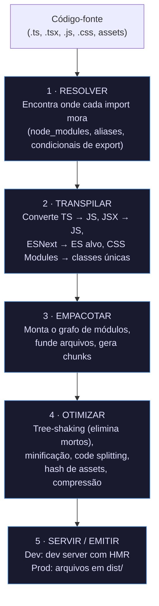
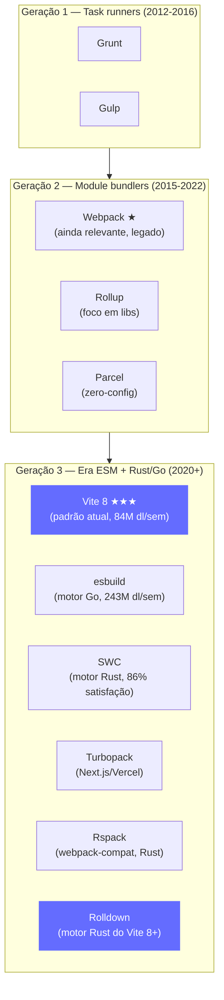
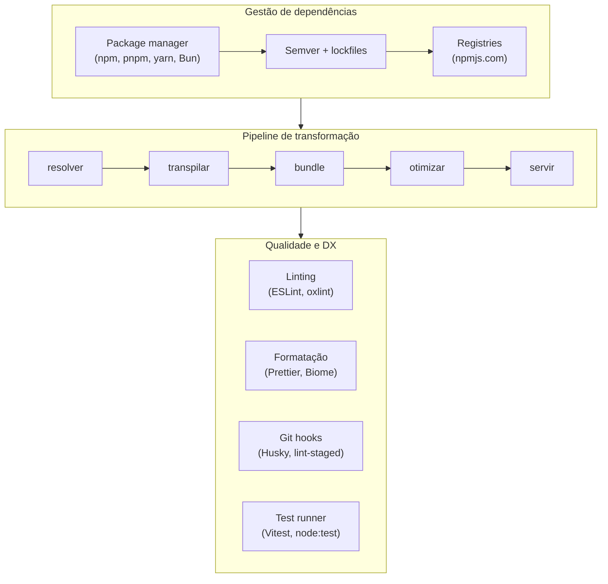
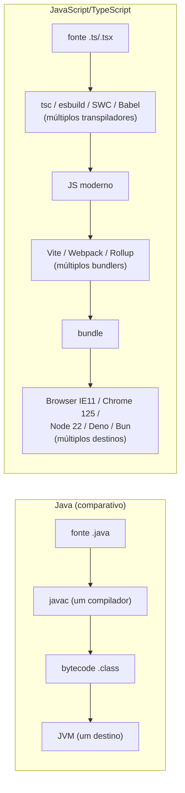

# Por que tooling e build existem

> [!abstract] TL;DR
> Tooling e build existem para fechar um **gap fundamental**: o que você escreve (TypeScript, ESM, JSX, CSS moderno, dependências de terceiros) não é o que roda no browser ou no Node. No meio fica um pipeline — **resolver → transpilar → empacotar → otimizar → servir** — que converte o código-fonte em algo que o ambiente de execução entende, e o mais rápido possível. Em 2026, Vite (agora com Rolldown em Rust) ultrapassou o Webpack em downloads semanais, esbuild tem 243 M de downloads/semana, e o ecossistema muda num ritmo que parece excessivo — mas tem uma razão estrutural para isso. Essa nota explica o *porquê* antes de mergulhar nas ferramentas.

---

## Antes do tooling: o tempo das tags `<script>`

Pense em como a web funcionava em 2010. Você tinha um arquivo `index.html`, algumas tags `<script src="jquery.min.js">` e mais uns dois arquivos seus. Abria no browser, funcionava. Nenhuma etapa intermediária. O browser lia o HTML, requisitava cada script, executava na ordem.

Esse modelo tem uma beleza quase brutalmente simples — mas ele quebra em três cenários que aparecem em todo projeto real:

**Quando o projeto cresce.** Vinte arquivos JS carregados em sequência, na ordem certa, em todas as páginas. Uma mudança de dependência? Você edita o HTML à mão. Alguém esqueceu de adicionar um script? Bug silencioso em produção.

**Quando você quer usar uma biblioteca de terceiros.** Como você distribui `lodash` para um browser? Você baixava o `.min.js` e commitava no repositório. Versões? Atualizações? Resolvidas na mão, arquivo por arquivo.

**Quando você quer escrever código moderno.** Classes, arrow functions, `async/await` — tudo isso não existia ou tinha suporte nulo em browsers antigos. Se você queria usar, ficava dependente da adoção do mercado.

Essas três dores — escala de arquivos, gestão de dependências e compatibilidade de sintaxe — são as forças que criaram todo o ecossistema de tooling JS. Cada geração de ferramentas nasceu para resolver a dor que a anterior deixou. (A história completa dessa evolução está em [[02 - A evolução do tooling JS - de script ao bundler moderno]].)

---

## O gap fundamental

Existe um gap entre dois mundos:

```mermaid
graph LR
    subgraph ESCREVE["O que você ESCREVE"]
        TS["TypeScript (.ts)"]
        JSX["JSX/TSX (.jsx/.tsx)"]
        ESM["ESM moderno\n(import/export)"]
        CSS["CSS moderno\n(@layer, CSS Modules)"]
        ASSETS["Assets\n(.svg, .png, .woff2)"]
        DEPS["Dependências\n(node_modules/)"]
    end

    subgraph RODA["O que RODA"]
        JS["JavaScript vanilla\n(compatível com o alvo)"]
        BUNDLE["Bundle otimizado\n(arquivos merged/split)"]
        CSSOUT["CSS processado"]
        ASSETSOUT["Assets referenciados\n(com hash de cache)"]
        DEPSOUT["Código de deps\n(tree-shaken, inline)"]
    end

    ESCREVE -->|"GAP\n(tooling fecha isso)"| RODA
```

Cada item do lado esquerdo tem um motivo para não rodar diretamente:

- **TypeScript** tem tipos — o browser não entende tipos. O `tsc` ou o esbuild/SWC precisam apagar as anotações antes de qualquer execução. (O trail de [[03-Dominios/Tecnologia/TypeScript/index|TypeScript]] explica a fundo esse "type erasure".)
- **JSX** é açúcar sintático — `<Button />` vira `React.createElement(Button, null)` ou `_jsx(Button, {})`. Nenhum ambiente de execução entende JSX nativo.
- **ESM com `import`** funciona no browser moderno — mas requer que o servidor sirva os arquivos com `Content-Type: application/javascript`, e cada `import` gera uma requisição HTTP separada. Com 500 módulos, isso mata o tempo de carregamento (HTTP/1.1) ou desperdiça multiplexing (HTTP/2). E no Node antigo, CJS ainda era o padrão.

> [!duvida] O que é uma "requisição HTTP separada" e por que ter 500 delas é ruim?
> A nota fala que cada `import` vira uma requisição, mas não explica o que acontece fisicamente: o browser precisa pedir cada arquivo para o servidor individualmente. Por que isso é lento? E o que é HTTP/1.1 vs HTTP/2 — essas versões mudam alguma coisa no problema? Salto de dependência: o iniciante precisaria de uma breve explicação de que o browser "busca" cada arquivo da rede antes de conseguir executar o código.
- **CSS Modules / `@layer`** precisam de processamento para gerar classes com escopo único ou combinar regras em ordem correta.
- **Assets** precisam de URLs com hash de conteúdo para cache-busting correto (`logo.abc123.png`), não podem ser importados como módulos JS por padrão.
- **`node_modules/`** tem centenas de megabytes de arquivos. O browser não tem acesso ao sistema de arquivos. Alguém precisa resolver quais partes do `node_modules` entram no bundle — e eliminar o que não é usado.

> [!note] A analogia da cozinha
> Você escreve uma receita em português (TypeScript + JSX + ESM moderno). O comensal (browser) só come prato pronto, num idioma específico dele (JavaScript ES5/ES2020 compatível, num bundle único). O tooling é toda a cozinha no meio — tradução, preparo, otimização e entrega. Sem a cozinha, a receita não chega à mesa.

---

## O pipeline conceitual

Independente de qual ferramenta você usa — Vite, Webpack, esbuild, Rollup — o pipeline é conceitualmente o mesmo. Varia a velocidade, a arquitetura interna e quais etapas são separadas ou fundidas, mas o fluxo de dados é este:

Vamos destrinchar cada etapa brevemente — as notas [[07 - O grafo de módulos e o que é bundling]] e [[08 - Transpilação e targets]] cobrem resolução/bundling e transpilação em profundidade. Aqui o objetivo é ter o mapa antes do território.

### 1 · Resolver

Quando você escreve `import { useState } from 'react'`, o tooling precisa encontrar *onde* `react` mora. É `node_modules/react/index.js`? É a versão ESM em `node_modules/react/esm/react.js`? Tem um campo `"exports"` no `package.json` que redireciona imports? Existe um alias de projeto (`@/components` → `src/components`)?

Resolução de módulos parece trivial até você debugar por que o build está importando CJS em vez de ESM, ou por que um alias não está funcionando. Esse é o trabalho do resolver.

### 2 · Transpilar

Transpilação é a conversão de uma linguagem (ou dialeto) em outro. No contexto JS/TS:

- TypeScript → JavaScript (apaga tipos)
- JSX/TSX → chamadas de função (`createElement`, `_jsx`)
- ES2024+ → ES2020/ES5 (downleveling de sintaxe para o alvo)
- Decoradores experimentais → código equivalente sem decoradores

Ferramentas que fazem isso: `tsc` (TypeScript), Babel, esbuild, SWC. As últimas duas são implementadas em Go e Rust, respectivamente — daí a velocidade. (Ver [[08 - Transpilação e targets]] e [[03-Dominios/Ciência/Compiladores e Linguagens/index|Compiladores e Linguagens]] para o modelo conceitual de pipelines de tradução.)

> [!warning] "Transpilar TypeScript" ≠ "checar TypeScript"
> Esta é a confusão mais cara para um iniciado. esbuild e SWC fazem **type erasure** — apagam as anotações de tipo sem analisá-las semanticamente. Se você escrever `const x: number = "oi"`, esbuild transpila sem reclamar. Só o `tsc --noEmit` faz a verificação real dos tipos.
>
> A consequência prática: pipelines de CI que usam apenas esbuild/SWC para build podem embarcar bugs de tipo em produção sem nenhum erro de compilação. A solução padrão é rodar `tsc --noEmit` **em paralelo**, como etapa separada de validação — não como transpilador, mas como type-checker.
>
> Pense assim: esbuild é o copiloto que remove os post-its de anotação do documento (os tipos) antes de imprimir. Ele não lê o conteúdo — só retira os post-its. `tsc --noEmit` é o revisor que lê o documento completo antes de remover qualquer coisa.

### 3 · Empacotar (bundle)

Empacotamento é montar o grafo de módulos. A partir de um entry point (`main.tsx`), o bundler segue todos os `import`s recursivamente, constrói um grafo de dependências e funde os módulos num conjunto de arquivos de saída.

> [!duvida] O que é "entry point" e por que o bundler começa por ele?
> O termo aparece aqui sem ter sido definido antes. Pelo contexto parece ser "o primeiro arquivo", mas não fica claro: eu escolho qual é o entry point? Ele é sempre `main.tsx`? O que acontece se tiver mais de um? Salto de dependência: conceito essencial para entender bundling, introduzido sem motivação.

Por que fundir? Porque 500 requisições HTTP separadas (uma por módulo) em produção é mais lento do que poucas requisições de arquivos otimizados — especialmente em conexões de alta latência. (A nota [[07 - O grafo de módulos e o que é bundling]] vai fundo nesse trade-off.)

### 4 · Otimizar

Com o grafo montado, várias otimizações se tornam possíveis:

- **Tree-shaking**: eliminar código que nunca é importado/usado. Se você só usa `formatDate` do `date-fns`, o resto da biblioteca não vai para o bundle.

> [!duvida] O que é um "efeito colateral" de um import — e por que o bundler tem medo disso?
> O callout abaixo fala em "efeitos colaterais (modificar globals, registrar polyfills, importar CSS)", mas não explica o que significa um import "fazer alguma coisa" além de exportar funções. Por que simplesmente importar um arquivo poderia modificar o comportamento do programa inteiro? Essencial escondido: a ideia de que código pode executar ao ser importado (não só ao ser chamado) é o núcleo do problema — sem isso, o gotcha não faz sentido.

> [!warning] O gotcha do `sideEffects` no `package.json`
> Tree-shaking depende de uma declaração no `package.json` da biblioteca: `"sideEffects": false`. Sem ela, o bundler assume que qualquer `import` pode ter efeitos colaterais (modificar globals, registrar polyfills, importar CSS) e mantém o arquivo inteiro — mesmo que você use zero exports.
>
> Este é o motivo mais comum de "por que minha lib de ícones ficou gigante no bundle" — o autor não marcou a lib como side-effect-free. E o pior caso: se `sideEffects: false` estiver incorreto (a lib tem CSS imports não declarados), o resultado é ainda mais traiçoeiro — o CSS some em produção e o bug só aparece depois do deploy.

- **Minificação**: remover espaços, encurtar nomes de variáveis, eliminar comentários.
- **Code splitting**: dividir o bundle em chunks que o browser carrega sob demanda (lazy loading de rotas, por exemplo).
- **Hash de assets**: `logo.svg` vira `logo.abc123f7.svg` — o hash muda só quando o conteúdo muda, permitindo cache agressivo no browser.
- **Compressão**: gzip/brotli.
- **Source maps**: arquivos `.map` que mapeiam o código minificado de volta ao código-fonte original. Em desenvolvimento, gerados em formato rápido (inline ou `eval`). Em produção, a prática recomendada é gerar source maps "hidden" — o arquivo `.map` existe, mas não é referenciado no bundle público; você faz upload para seu serviço de rastreamento de erros (Sentry, Datadog) e não os expõe no CDN. Sem source maps, debugar um erro em produção é tentar ler `a.b.c(d,e,f)` em vez do nome real das funções.

### 5 · Servir / emitir

Em desenvolvimento: um **dev server** serve os arquivos com Hot Module Replacement (HMR) — quando você salva um arquivo, só aquele módulo é atualizado no browser sem recarregar a página. Em produção: os arquivos vão para `dist/` (ou `build/`, `out/`) e são enviados para um CDN ou servidor.

> [!tip] Dev vs Prod — pipelines diferentes
> Em desenvolvimento, velocidade de feedback importa mais do que tamanho do bundle. Em produção, o oposto. Por isso, ferramentas modernas como Vite usam estratégias diferentes: em dev, serve ESM nativo sem bundle; em prod, empacota e otimiza. A nota [[09 - Dev server e HMR]] detalha esse split.

> [!warning] O gotcha dev-vs-prod mais perigoso
> Até o Vite 7, o pipeline de dev usava esbuild e o de prod usava Rollup — ferramentas diferentes com estratégias de resolução ligeiramente distintas. Um módulo que funcionava perfeitamente em `npm run dev` podia quebrar no `npm run build` — tipicamente quando uma biblioteca exporta CJS em vez de ESM, ou quando um `import.meta.env` não está definido no contexto correto.
>
> Com Vite 8 e Rolldown unificado, essa divergência diminuiu — mas a regra prática continua válida: **sempre rode `npm run build` antes de abrir um PR importante**, não apenas `npm run dev`. O custo de descobrir isso em CI é muito menor do que em produção.

---

## O panorama em 2026

Aqui está o mapa do ecossistema atual. O objetivo *desta* nota não é detalhar cada ferramenta — isso fica para as notas do Adepto — mas te dar uma orientação mínima para não se perder.

Os números do **State of JS 2024** (com ~11.000 respondentes) revelam o estado de transição que ainda vivemos:

| Ferramenta | Usuários (profissional) | Observação |
|---|---|---|
| webpack | 7.927 respondentes | Maioria = projetos legados |
| Vite | 7.909 respondentes | Crescimento mais rápido do mercado |
| esbuild | 4.112 respondentes | Usado como motor, não bundler direto |

> [!duvida] O que significa esbuild ser um "motor" em vez de um bundler direto?
> A tabela diz que esbuild é "usado como motor", mas a nota nunca explicou o que diferencia um motor de um bundler. O Vite usa esbuild por baixo — mas o usuário não configura esbuild diretamente? Peça sem encaixe: o conceito de "ferramenta que usa outra ferramenta por baixo" não foi introduzido.
| tsc CLI | 3.051 respondentes | Só compilação TS |
| Rollup | 2.889 respondentes | Foco em bibliotecas |
| SWC | 1.613 respondentes | 86% de satisfação |
| Turbopack | 1.191 respondentes | Novo, crescendo com Next.js |

Em julho de 2025, Vite ultrapassou Webpack em downloads semanais — um marco simbólico. Em **12 de março de 2026**, Vite 8 foi lançado com Rolldown como motor unificado (Rust), substituindo definitivamente o pipeline duplo esbuild-dev + Rollup-prod. Builds de produção são 4–20x mais rápidos; no benchmark do Linear, o tempo de build caiu de 46 segundos para 6 segundos. No lançamento, Vite tinha 65 milhões de downloads semanais no npm.

> [!info] Quem está por trás do Rolldown
> O Rolldown foi desenvolvido pela **VoidZero** — empresa criada por Evan You (criador do Vite e Vue) especificamente para financiar ferramentas de build de próxima geração. Em 2026, a **Cloudflare adquiriu a VoidZero**, tornando-se a patrocinadora principal do ecossistema Rolldown/Vite. Isso explica por que o Vite tem um futuro de longo prazo garantido: não é um projeto de um desenvolvedor solo, mas uma infraestrutura corporativa.

> [!warning] "Mas por que isso muda tão rápido?"
> Essa é a pergunta que frustra todo desenvolvedor que entra no ecossistema JS. A resposta curta: porque as **restrições do ambiente** mudaram dramaticamente e continuam mudando. Browsers ganharam ESM nativo, HTTP/2, service workers. O Node ganhou ESM nativo. Rust e Go tornaram possível um nível de performance que fazia Webpack parecer comparativamente lento. E frameworks com opiniões fortes (React, Vue, Svelte) adoptam e impõem ferramentas, criando efeitos de rede.
>
> Cada onda de mudança tecnológica justifica uma nova geração de ferramentas. A boa notícia: o **pipeline conceitual não muda**. Resolver, transpilar, empacotar, otimizar, servir — essas etapas existiam no Grunt, existem no Vite 8. O que muda é quem faz cada etapa e em quanto tempo.

---

## Por que o pipeline importa para a sua carreira

Uma pergunta razoável: "Por que eu, desenvolvedor de produto, preciso saber disso? Eu só quero que meu `npm run dev` funcione."

Porque o tooling **vaza**. Ele aparece:

- No **tempo de CI** — quando a build de produção demora 8 minutos e ninguém sabe por quê.
- No **bundle size** — quando o usuário em 3G espera 12 segundos pela tela inicial e você descobre que toda a `date-fns` foi para o bundle quando você precisava de uma função.
- Nas **entrevistas** — "Como funciona o tree-shaking?", "Por que você usaria Vite em vez de Webpack num projeto novo?", "O que é HMR e como funciona?".
- No **debugging** — quando um import funciona em dev mas quebra em prod, e você precisa entender que esbuild (dev) e Rolldown (prod) às vezes resolvem módulos de forma diferente.
- Na **escolha de arquitetura** — monorepo? SSR? biblioteca publicada? Cada resposta muda o tooling adequado.

> [!example] A pergunta de entrevista clássica
> "Você pode me explicar o que acontece entre `npm run build` e o arquivo `dist/index.js` aparecer?"
>
> A resposta ideal percorre o pipeline: o bundler lê o entry point, resolve o grafo de imports (resolver), transpila TypeScript e JSX para JS (transpilação), monta os módulos num bundle (empacotamento), aplica tree-shaking e minificação (otimização) e emite os arquivos em `dist/`. Cada passo tem um nome, uma ferramenta, e pode ser a origem de um problema.

---

## A camada ao redor do pipeline

O pipeline de transformação de código é o coração do tooling, mas não é tudo. Ao redor dele existem duas camadas igualmente importantes:

**Gestão de dependências** (notas 3, 4, 5, 6 deste galho): antes de transpilar ou empacotar, o código de terceiros precisa estar disponível localmente. Isso é o trabalho do package manager (npm, pnpm, yarn, Bun) — baixar, versionar, resolver conflitos, manter um lockfile determinístico.

**Qualidade e DX**: linting (ESLint, oxlint), formatação (Prettier, Biome) e git hooks garantem que código de baixa qualidade nunca chegue ao pipeline principal. Test runners (Vitest, `node:test`) fecham o ciclo.

> [!note] Este galho tem 26 notas por isso
> O tooling não é um tópico — é uma camada completa da engenharia frontend. Cada área (package managers, módulos, transpilação, bundlers específicos, qualidade, monorepos, produção) tem profundidade suficiente para uma nota própria. O roster completo está no [[03-Dominios/Tecnologia/Tooling e Build/index|índice do galho]].

---

## O que diferencia o ecossistema JS de outras plataformas

Se você vem de [[03-Dominios/Tecnologia/Java/Build e tooling/01 - Por que build tools existem|Java]], a comparação é instrutiva: Maven e Gradle são duas ferramentas maduras que dominam o ecossistema há mais de uma década. A linguagem compila para bytecode JVM — um destino estável. O pipeline é bem definido.

No ecossistema JS:

- O **destino varia**: browser (IE? Chrome 2020? Chrome 2025?), Node, Deno, Bun, edge workers, service workers. Cada um tem capacidades diferentes.
- A **linguagem não é estável como alvo**: JS evolui anualmente (ES2024, ES2025), e o que um browser suporta muda constantemente.
- **Não existe um "compilador oficial"**: TypeScript tem `tsc`, mas a transpilação de TS pode ser feita por esbuild, SWC, Babel, ox-transform — cada um com trade-offs diferentes.
- **O ambiente de runtime é o browser**, que não foi projetado para ser um ambiente de build — ele só executa o que você entrega.

Isso explica a proliferação de ferramentas. Não é caos sem propósito — é uma plataforma heterogênea sendo servida por soluções especializadas para contextos diferentes.

---

## Como explicar em inglês

Essa seção prepara você para entrevistas onde as perguntas virão em inglês.

**Resposta para "What is a build tool and why does it exist?"**

> Build tools exist to close the gap between what you write — TypeScript, JSX, ESM imports, third-party dependencies, modern CSS — and what actually runs in the browser or Node. That gap has several dimensions: type erasure (TypeScript's types don't exist at runtime), syntax transformation (JSX becomes function calls), module resolution (the browser can't access `node_modules`), and optimization (sending 500 individual files over HTTP would be slow). The conceptual pipeline is always the same: resolve imports, transpile syntax, bundle modules, optimize the output, and serve it. Different tools — Webpack, Vite, esbuild — implement that pipeline differently, but the fundamental problem they solve is identical.

**Resposta para "Why does the JS tooling ecosystem change so fast?"**

> Because the target keeps changing. Every year browsers gain new capabilities — native ESM, HTTP/2, service workers. Node and Deno ship new runtime features. TypeScript evolves. And frameworks like React or Vue adopt new tools, creating network effects. Each wave of platform change justifies a new generation of tooling. The conceptual pipeline doesn't change, but who does each step — and how fast — keeps improving, especially as tools written in Rust and Go (esbuild, SWC, Turbopack, Rolldown) have pushed performance to levels previously unthinkable in Node-based tooling.

### Vocabulário-chave

| Português | Inglês |
|---|---|
| Ferramenta de build | Build tool |
| Empacotador | Bundler |
| Transpilador | Transpiler |
| Resolução de módulos | Module resolution |
| Grafo de módulos | Module graph |
| Empacotamento | Bundling |
| Eliminação de código morto | Tree-shaking |
| Substituição de módulo a quente | Hot Module Replacement (HMR) |
| Divisão de código | Code splitting |
| Otimização de bundle | Bundle optimization |
| Ponto de entrada | Entry point |
| Artefato de saída | Build artifact / output |
| Minificação | Minification |
| Mapa de origem | Source map |
| Apagamento de tipos | Type erasure |
| Efeitos colaterais | Side effects |
| Servidor de desenvolvimento | Dev server |
| Pipeline de build | Build pipeline |
| Dependência de terceiros | Third-party dependency |

---

## Fronteiras deste galho

Este galho tem fronteiras deliberadas — o que **não** está aqui:

| Tema | Dono |
|---|---|
| `tsc` como type-checker, `tsconfig.json` avançado | [[03-Dominios/Tecnologia/TypeScript/index\|TypeScript]] |
| ESM × CJS como **semântica da linguagem JS** | Nota 06 deste galho |
| Runtime do Node (event loop, streams) | Trail Node.js |
| Build tools de Java (Maven/Gradle) | [[03-Dominios/Tecnologia/Java/Build e tooling/01 - Por que build tools existem\|Java/Build e tooling]] |
| PostCSS, Tailwind engine, CSS-in-JS | Trail CSS |
| Vitest, Playwright (test tooling) | Trail Engenharia/Testes |

---

## O que vem a seguir

Esta nota estabeleceu o *por quê* — o gap que o tooling fecha, o pipeline que o organiza, e o panorama em 2026. A próxima nota conta a **história**: como chegamos aqui, geração por geração, e o que cada era resolveu (e criou) de problema.

➤ **[[02 - A evolução do tooling JS - de script ao bundler moderno]]** — de tags `<script>` manuais ao Vite 8 com Rolldown: a narrativa completa.

---

## Veja também

- [[02 - A evolução do tooling JS - de script ao bundler moderno]]
- [[07 - O grafo de módulos e o que é bundling]]
- [[08 - Transpilação e targets]]
- [[09 - Dev server e HMR]]
- [[17 - Otimização de bundle]]
- [[23 - Build em produção, CI e determinismo]]
- [[03-Dominios/Tecnologia/JavaScript/index|JavaScript]]
- [[03-Dominios/Tecnologia/TypeScript/index|TypeScript]]
- [[03-Dominios/Ciência/Compiladores e Linguagens/index|Compiladores e Linguagens]]
- [[03-Dominios/Tecnologia/Tooling e Build/index|Tooling e Build (MOC)]]

---

## Referências

- State of JavaScript 2024 — Build Tools — https://2024.stateofjs.com/so-SO/libraries/build_tools/
- Vite — Why Vite — https://vite.dev/guide/why
- npm trends — esbuild vs rollup vs vite vs webpack — https://npmtrends.com/esbuild-vs-rollup-vs-rspack-vs-snowpack-vs-vite-vs-webpack
- Technology Checker — Companies Using Vite in 2026 — https://technologychecker.io/technology/vite
- DEV Community — Vite vs. Webpack in 2026 — https://dev.to/pockit_tools/vite-vs-webpack-in-2026-a-complete-migration-guide-and-deep-performance-analysis-5ej5
- **Vite** — [*Announcing Vite 8*](https://vite.dev/blog/announcing-vite8) (2026). Lançamento oficial com Rolldown unificado: stats de performance, downloads e breaking changes.
- **VoidZero** — [*Announcing Rolldown 1.0*](https://voidzero.dev/posts/announcing-rolldown-1-0) (2026). Contexto sobre a empresa criada por Evan You e a aquisição pela Cloudflare.
- **Leapcell** — [*Navigating TypeScript Transpilers: tsc, esbuild, and SWC*](https://leapcell.io/blog/navigating-typescript-transpilers-a-guide-to-tsc-esbuild-and-swc) (2025). Comparação detalhada de trade-offs entre transpiladores, incluindo a distinção type erasure vs type checking.
- **Webpack** — [*Tree Shaking Guide*](https://webpack.js.org/guides/tree-shaking/) (doc oficial). Explica `sideEffects` no `package.json` e as armadilhas de configuração.
- **This Dot Labs** — [*Understanding Sourcemaps: From Development to Production*](https://www.thisdot.co/blog/understanding-sourcemaps-from-development-to-production) (2025). Estratégias de source maps em dev vs prod, incluindo hidden source maps e upload para error tracking.
