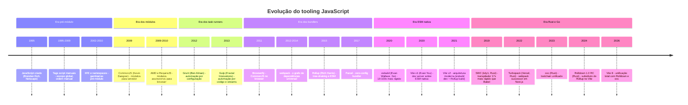
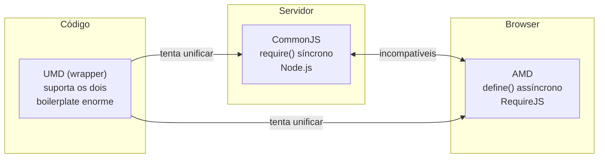
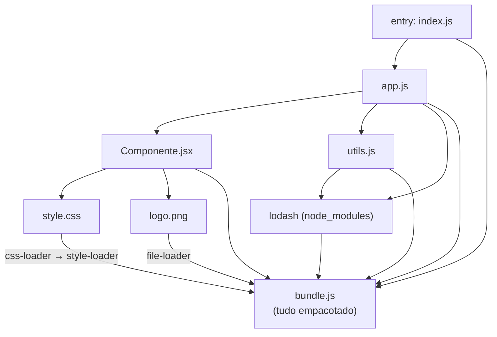
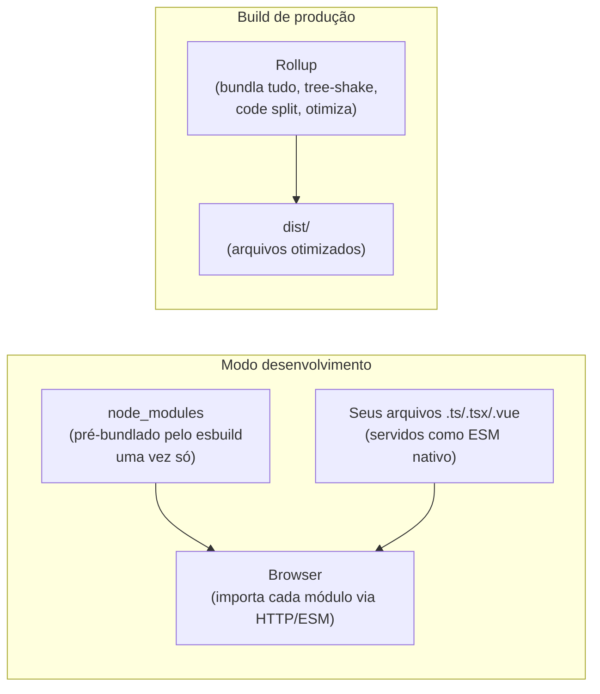
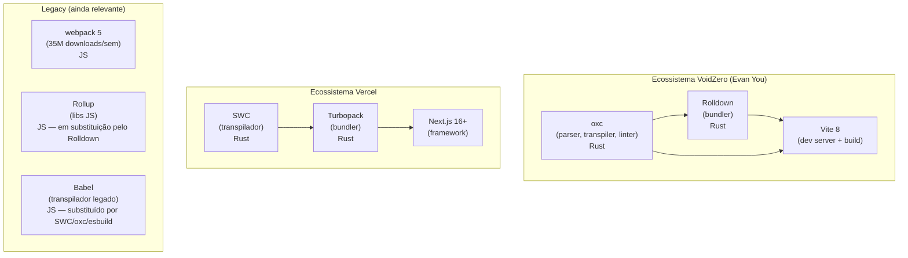

# A evolução do tooling JS: de `<script>` ao bundler moderno

> [!abstract] TL;DR
> O tooling JS existe porque cada época tentou resolver uma dor que a anterior deixou sem resposta. Tags `<script>` criaram um escopo global poluído; IIFEs amenizaram, mas não resolveram a dependência implícita entre arquivos; CommonJS e AMD formalizaram módulos, mas o browser não os entendia nativamente; Grunt e Gulp automatizaram tarefas, mas não gerenciavam o grafo de dependências; Browserify e webpack trouxeram o grafo — mas a custo de configuração e lentidão crescente; Vite virou o dev server sobre ESM nativo, e esbuild/SWC/Rolldown/Turbopack trouxeram Rust e Go para acabar com o gargalo de velocidade. Este é o mapa do tempo: as notas [[10 - Ferramentas legadas - Grunt, Gulp, Bower, Browserify e RequireJS]], [[11 - webpack - o veterano]], [[13 - Vite a fundo]] e [[15 - Turbopack, Rspack e a corrida Rust-Go]] aprofundam cada ferramenta.

---

## O problema que ninguém via — até ficar grande demais

Pense numa aplicação web de 2006. Ela tinha talvez três arquivos JavaScript: `jquery.js`, `utils.js` e `app.js`. Você os adicionava ao HTML em ordem, e tudo funcionava. Simples, direto, sem cerimônia.

Agora pense em 2012. Uma SPA (Single-Page Application) podia ter cinquenta, cem, duzentos arquivos JS. Cada um dependia de outros. Mudar a ordem de um `<script>` podia quebrar tudo silenciosamente. Variáveis de um arquivo vazavam para o escopo global e sobrescreviam variáveis de outro. "Funcionou no meu PC" era quase um gênero de bug. Carregar cem scripts separados para um browser de 2012 era uma agonia de performance: cada request era uma round-trip de rede, e browsers da época limitavam requests paralelos a 6 por domínio.

Esse é o arco central desta nota: **a complexidade crescente do JavaScript no browser empurrou cada salto de tooling**. Cada geração de ferramentas nasceu para resolver a dor que a anterior deixou. E, invariavelmente, cada solução criou novos problemas — que a próxima geração precisou resolver.

> [!info] Esta nota é o mapa — não o território
> O objetivo aqui é a narrativa cronológica: entender *por que* cada ferramenta existiu e *por que* foi superada. Os detalhes técnicos de cada ferramenta vivem em notas próprias: [[10 - Ferramentas legadas - Grunt, Gulp, Bower, Browserify e RequireJS]], [[11 - webpack - o veterano]], [[13 - Vite a fundo]], [[15 - Turbopack, Rspack e a corrida Rust-Go]]. Aqui você estuda o movimento; lá você estuda os passos.

---

## A linha do tempo completa

Antes de mergulhar em cada geração, vale ter o mapa visual. São sete gerações — cada uma com um problema central que resolveu e uma dor nova que criou.



---

## Geração 1: Tags `<script>` manuais (1995 – ~2009)

O JavaScript foi criado em 1995 por Brendan Eich para o Netscape Navigator. Nos primeiros anos, a forma de incluir código era direta: você adicionava uma tag `<script>` no HTML e escrevia código ali mesmo, ou apontava para um arquivo externo.

```html
<!-- A forma canônica de incluir JS em 2005 -->
<html>
  <head>
    <script src="jquery.js"></script>
    <script src="utils.js"></script>
    <script src="app.js"></script>
  </head>
  <body>...</body>
</html>
```

O problema? **Tudo compartilhava o mesmo escopo global.** Se `utils.js` declarava uma variável `helper`, e `app.js` também declarava uma variável `helper`, a segunda sobrescrevia a primeira silenciosamente. Não havia erro, não havia aviso — a segunda `var helper` simplesmente ganhava.

Pior: a **ordem dos scripts importava**, e era frágil. Se `app.js` usava uma função definida em `utils.js`, você precisava garantir que `utils.js` viesse antes. Isso era gerenciado na mão, num arquivo HTML, sem nenhuma verificação automática. Mover uma linha quebrava a aplicação, e o JavaScript da época falhava silenciosamente — o erro aparecia horas depois, num comportamento inesperado em runtime.

```javascript
// utils.js — define uma variável global
var helper = function(x) { return x * 2; };

// outro-script.js — sobrescreve sem saber
var helper = "oops, sobrescrevi a função";

// app.js — tenta chamar a função
helper(5); // TypeError: helper is not a function
// E você descobre isso em runtime, talvez em produção
```

Para projetos pequenos, dava para gerenciar. Mas conforme as aplicações cresceram — especialmente com a popularização do Ajax a partir de 2005 e o início das SPAs — o modelo quebrou. Você não podia dividir código em módulos isolados porque o JavaScript simplesmente não tinha o conceito de módulo.

**O que essa geração resolveu:** nada — era o estado inicial, sem tooling algum.
**A dor que criou:** escopo global compartilhado, dependências implícitas, sem isolamento, sem gerenciamento automático de ordem.

---

## Geração 2: IIFE e namespaces (2002 – ~2012)

Antes que módulos formais existissem, a comunidade inventou gambiarras elegantes. A mais poderosa foi a **IIFE** (Immediately Invoked Function Expression — Expressão de Função Imediatamente Invocada).

A ideia é simples: uma função JavaScript cria um escopo próprio. Se você envolve seu código numa função e a chama imediatamente, tudo dentro dela fica isolado do escopo global.

```javascript
// Antes: vazamento global
var minhaLib = { ... };
var estado = "ativo";

// Depois: IIFE — só o que você exportar explicitamente vai ao global
var MinhaLib = (function() {
  // tudo aqui é privado
  var estado = "ativo";
  var _helper = function(x) { return x * 2; };

  // só isso vai para o global
  return {
    processar: function(x) { return _helper(x); },
    getEstado: function() { return estado; }
  };
})();

// MinhaLib.processar(5) funciona; _helper não existe no escopo global
```

Bibliotecas como jQuery, Backbone e Underscore usavam IIFEs. O padrão **namespace** era complementar: ao invés de criar dezenas de globais, você criava um único objeto global e aninhava tudo dentro:

```javascript
// Namespace pattern — jQuery-style
window.MinhApp = window.MinhaApp || {};
MinhaApp.utils = MinhaApp.utils || {};

MinhaApp.utils.formatar = function(valor) {
  return valor.toFixed(2);
};

// Pelo menos só um nome no global
```

Essas técnicas funcionavam — e muitas codebasees grandes as usavam produtivamente. Mas eram **convenções manuais**, não enforcement do sistema. Nada impedia alguém de declarar uma global acidentalmente. As dependências entre "módulos" continuavam implícitas: você ainda precisava garantir a ordem dos `<script>` na mão.

E tinha outro problema emergente: **performance de carregamento**. Em 2010, uma aplicação com trinta arquivos JS fazia trinta requests HTTP. Cada request tinha overhead de DNS, TCP handshake, HTTP round-trip. Browsers da época tinham limite de 4-6 conexões paralelas por domínio. Carregar uma aplicação podia levar 5, 10, 15 segundos — um tempo impensável pelos padrões modernos.

A resposta foi a **concatenação e minificação manual**: alguém (ou um script shell) juntava todos os arquivos JS num único arquivo e depois rodava uma ferramenta como YUI Compressor ou Google Closure Compiler para remover espaços, encurtar nomes de variáveis e reduzir o tamanho. Funcionava, mas era um processo manual, propenso a erros, sem automação confiável.

**O que essa geração resolveu:** redução parcial da poluição global, início da noção de "módulo manual".
**A dor que criou:** dependências ainda implícitas, concatenação manual frágil, zero verificação automática.

---

## Geração 3: AMD e CommonJS — a busca por módulos reais (2009 – ~2015)

Em janeiro de 2009, Kevin Dangoor — engenheiro da Mozilla — criou o projeto ServerJS, logo renomeado para **CommonJS**. A proposta era simples e poderosa: definir uma especificação de módulos para JavaScript fora do browser. O resultado foi a dupla `require()` / `module.exports`:

```javascript
// math.js — módulo CommonJS
function somar(a, b) { return a + b; }
function multiplicar(a, b) { return a * b; }

module.exports = { somar, multiplicar };

// app.js — consumidor
var math = require('./math');
console.log(math.somar(2, 3)); // 5
```

Quando o Node.js foi lançado em 2009 por Ryan Dahl, ele adotou CommonJS como sistema de módulos. A combinação Node + CommonJS foi um sucesso: pela primeira vez, JavaScript tinha módulos reais com escopo isolado, dependências explícitas e um registro central (npm, criado em 2010).

O problema? **CommonJS era síncrono**. `require()` bloqueia a execução até o módulo estar carregado. No servidor, isso é aceitável: ler um arquivo do disco é rápido. No browser, carregar um módulo pela rede de forma síncrona significa travar a página inteira durante o request. Era uma não-starter para o front-end.

O problema não é o `require()` em si — é o que ele faz enquanto carrega. JavaScript tem uma thread principal única: ela executa código, processa eventos e atualiza a interface. Quando `require()` síncrono precisa carregar um módulo pela rede, essa thread fica bloqueada — o browser para de responder a cliques, scrolls e animações até o download terminar. Para o usuário, a página simplesmente congela.

No servidor, a situação é diferente por dois motivos. Primeiro, os arquivos estão no disco local: ler do disco leva microssegundos, não os 50-300ms de uma round-trip de rede. Segundo, e mais importante, o Node.js foi projetado para I/O assíncrono com callbacks — quando ele precisa esperar algo lento, não bloqueia o processo inteiro. Mas mesmo no servidor, bloquear a thread para carregar do disco é aceitável no boot (quando você ainda não está servindo requisições), e é por isso que o CommonJS funciona: o `require()` acontece na inicialização, não durante uma requisição ativa.

A solução veio com o **AMD (Asynchronous Module Definition)**, cujo principal implementador foi o **RequireJS**, lançado por James Burke por volta de 2010 a partir de discussões na comunidade CommonJS:

```javascript
// Módulo AMD — define dependências explicitamente
define(['jquery', './utils'], function($, utils) {
  // as dependências são carregadas de forma assíncrona
  // quando chegam, a função factory é chamada

  return {
    init: function() {
      $('.botao').on('click', function() {
        utils.processar($(this).val());
      });
    }
  };
});

// Uso — requirejs carrega o módulo e suas deps async
require(['./meu-modulo'], function(modulo) {
  modulo.init();
});
```

AMD resolveu o carregamento assíncrono: você declarava as dependências explicitamente, e o RequireJS as carregava em paralelo pela rede antes de executar a factory function. Dependências implícitas viraram coisa do passado.

Mas a sintaxe era verbosa e estranha. E havia uma guerra de padrões: CommonJS no servidor (Node.js), AMD no browser (RequireJS), e os dois incompatíveis entre si. Você escrevia código diferente para as duas plataformas, ou usava wrappers complexos (UMD — Universal Module Definition) que suportavam os dois.



> [!warning] O problema do UMD
> O wrapper UMD que funcionava nos dois ambientes era tão feio que poucos o escreviam à mão — você gerava automaticamente. Era uma gambiarra sobre uma gambiarra. O problema real era que o JavaScript não tinha um sistema de módulos nativo; tudo que existia eram convenções aplicadas sobre a linguagem.

**O que essa geração resolveu:** módulos reais com escopo isolado e dependências explícitas; carregamento assíncrono no browser (AMD).
**A dor que criou:** guerra de padrões CJS vs AMD, sintaxe verbosa, dois mundos incompatíveis, zero suporte nativo no browser.

---

## Geração 4: Task runners — automação antes dos bundlers (2012 – ~2016)

Enquanto a batalha dos módulos acontecia, outro problema crescia: **as tarefas de build eram repetitivas e manuais**. Todo projeto de front-end precisava: minificar CSS e JS, compilar Sass/Less para CSS, otimizar imagens, rodar testes, copiar arquivos para a pasta `dist/`, fazer deploy. Tudo isso era feito com scripts shell, Makefiles, ou simplesmente na mão.

O **Grunt**, criado por Ben Alman em 2012, foi a primeira resposta popular. A ideia era declarar tarefas num arquivo de configuração JSON, e o Grunt as executaria em sequência:

```javascript
// Gruntfile.js — configuração declarativa
module.exports = function(grunt) {
  grunt.initConfig({
    uglify: {
      build: {
        src: 'src/*.js',
        dest: 'dist/bundle.min.js'
      }
    },
    sass: {
      dist: {
        files: { 'dist/style.css': 'src/style.scss' }
      }
    },
    watch: {
      scripts: {
        files: ['src/*.js'],
        tasks: ['uglify']
      }
    }
  });

  grunt.loadNpmTasks('grunt-contrib-uglify');
  grunt.loadNpmTasks('grunt-sass');
  grunt.loadNpmTasks('grunt-contrib-watch');

  grunt.registerTask('default', ['uglify', 'sass']);
};
```

O Grunt foi um sucesso imediato. Mas a abordagem de configuração mostrou seus limites rapidamente: projetos grandes geravam Gruntfiles enormes e difíceis de debugar. Cada tarefa lia arquivos do disco, processava, e escrevia de volta — sem reusar buffers em memória. Era lento.

Em julho de 2013, a Fractal Innovations lançou o **Gulp**, com uma proposta diferente: **código sobre configuração**, usando **streams**. Em vez de ler e escrever arquivos a cada etapa, você criava pipelines que passavam dados em memória de uma transformação para outra:

```javascript
// Gulpfile.js — código imperativo, streams em memória
const gulp = require('gulp');
const uglify = require('gulp-uglify');
const sass = require('gulp-sass');

// CSS: sass → autoprefixer → minificar → salvar
gulp.task('css', function() {
  return gulp.src('src/style.scss')
    .pipe(sass())
    .pipe(autoprefixer())
    .pipe(minifyCss())
    .pipe(gulp.dest('dist/'));
});

// JS: juntar → minificar → salvar
gulp.task('js', function() {
  return gulp.src('src/**/*.js')
    .pipe(concat('bundle.js'))
    .pipe(uglify())
    .pipe(gulp.dest('dist/'));
});

gulp.task('default', ['css', 'js']);
```

O Gulp era mais rápido (streams, sem I/O redundante) e mais legível (código JS em vez de JSON gigante). Mas os dois — Grunt e Gulp — tinham uma limitação fundamental que nenhum deles resolvia: **não entendiam dependências entre módulos**.

Se `app.js` fazia `require('./utils')`, o task runner não sabia disso. Você podia concatenar todos os arquivos numa ordem fixa, mas não havia análise do grafo de dependências. A "bundling" que Grunt e Gulp faziam era uma concatenação burra — útil para organizar arquivos, mas incapaz de resolver imports, eliminar código morto ou fazer code splitting inteligente.

> [!tip] Task runner vs. bundler — a distinção fundamental
> Um task runner (Grunt, Gulp) é um orquestrador de tarefas arbitrárias: "compile Sass, minifique JS, copie imagens, rode testes". Ele não sabe nada sobre a estrutura interna do JavaScript. Um bundler (webpack, Rollup, esbuild) entende o *grafo de módulos*: sabe que `app.js` importa `utils.js` que importa `lodash`. Essa diferença é o salto conceitual mais importante desta geração para a próxima.

**O que essa geração resolveu:** automação de build; pipelines de transformação repetíveis e versionáveis.
**A dor que criou:** sem entendimento do grafo de dependências; concatenação burra; os dois paradigmas (configuração vs. código) tinham trade-offs; e ainda não resolvia o problema do browser com CommonJS.

---

## Geração 5: Module bundlers — o grafo de dependências (2011 – ~2019)

A virada conceitual veio com os **bundlers**. Em vez de concatenar arquivos numa ordem fixa, um bundler **analisa o código**, constrói um grafo de todas as dependências, e gera um arquivo (ou arquivos) que pode ser executado no browser — resolvendo todos os `require()` e `import()` no processo.

**Browserify** (2011) foi pioneiro. A ideia era audaciosa: pegar o sistema CommonJS do Node.js e fazê-lo funcionar no browser. Você escrevia código Node.js normal com `require()`, e o Browserify analisava o grafo de dependências, incluía todos os módulos necessários (incluindo polyfills de APIs do Node.js), e gerava um único bundle para o browser.

```bash
# Browserify analisa app.js, segue todos os require(), gera bundle.js
browserify app.js -o dist/bundle.js
```

```javascript
// Você escrevia CommonJS normal
var EventEmitter = require('events');
var utils = require('./utils');

var emitter = new EventEmitter();
emitter.on('dados', utils.processar);
```

Browserify era poderoso, mas limitado: gerava um único bundle, tinha suporte limitado para assets não-JS (CSS, imagens), e não tinha um dev server integrado.

O **webpack**, concebido por Tobias Kopps em 2012 e publicado como open source em 2014, levou a ideia do grafo ao extremo. Webpack tratava *qualquer* asset como um módulo — JS, CSS, imagens, fontes, JSON, SVG. Você configurava **loaders** para cada tipo e **plugins** para transformações globais:

```javascript
// webpack.config.js — o grafo de tudo
module.exports = {
  entry: './src/index.js',
  output: {
    path: path.resolve(__dirname, 'dist'),
    filename: 'bundle.[contenthash].js'
  },
  module: {
    rules: [
      {
        test: /\.jsx?$/,
        use: 'babel-loader',     // transpila JS moderno para ES5
        exclude: /node_modules/
      },
      {
        test: /\.css$/,
        use: ['style-loader', 'css-loader']  // CSS vira JS!
      },
      {
        test: /\.(png|jpg|gif)$/,
        use: 'file-loader'       // imagens recebem hash no nome
      }
    ]
  },
  plugins: [
    new HtmlWebpackPlugin({ template: './src/index.html' }),
    new MiniCssExtractPlugin({ filename: 'style.[contenthash].css' })
  ]
};
```

O comentário "CSS vira JS!" merece uma pausa. O `css-loader` lê o arquivo `.css` e o converte numa string JavaScript — a regra CSS literal vira um valor de string dentro do bundle. O `style-loader` pega essa string e injeta um elemento `<style>` no DOM em runtime, quando o módulo é carregado. O resultado é que os estilos aparecem na página, mas o browser nunca recebeu um arquivo `.css` separado — recebeu um `.js` que criou o `<style>` via código. É por isso que a configuração inclui o `MiniCssExtractPlugin`: em produção, ele recolhe todas essas strings CSS do bundle e as extrai de volta para arquivos `.css` reais, que o browser carrega de forma mais eficiente.

O webpack foi uma revolução. Pela primeira vez, você tinha um grafo completo de todas as dependências do seu projeto — JS, CSS, imagens, tudo. Code splitting, lazy loading, hot module replacement (HMR), cache busting com hashes de conteúdo, bundle analysis. O Create React App (2016) e o Vue CLI adotaram webpack como seu coração, e ele se tornou o bundler dominante por praticamente uma década.

Mas o webpack cobrava um preço: **configuração complexa** e **lentidão em projetos grandes**. Um `webpack.config.js` para um projeto médio tinha centenas de linhas. Builds em cold start de 30-60 segundos eram comuns. A cada mudança de arquivo, o webpack precisava reconstruir partes do bundle — e enquanto projetos cresciam, esse tempo só aumentava.



> [!info] O grafo de dependências do webpack
> Cada caixa é um asset. O webpack constrói este grafo automaticamente seguindo os imports, aplica os loaders certos para cada tipo, e consolida tudo no bundle final. É poderoso — e é também a fonte de sua complexidade.

Em 2015, Rich Harris criou o **Rollup** com um foco diferente: não applications web com assets variados, mas **bibliotecas JavaScript**. O Rollup foi o primeiro bundler a implementar **tree-shaking** sério — a capacidade de analisar importações estáticas (ESM) e eliminar o código que não é usado. Se você importava `{ clamp }` de `lodash-es`, o Rollup incluía *só* `clamp`, não o pacote inteiro.

```javascript
// Você escreve ESM
import { clamp, debounce } from './utils.js';

// Rollup analisa: só clamp e debounce são usados
// O bundle não inclui as outras 50 funções de utils.js
// Resultado: bundle muito menor
```

O Rollup virou o bundler de escolha para bibliotecas (React, Vue, Svelte e quase toda lib séria do npm usam Rollup para gerar seus outputs). Mas para apps, o webpack ainda dominava — Rollup não tinha loader system, não tinha HMR nativo, não era fácil de configurar para assets complexos.

Em 2017, o **Parcel** tentou uma abordagem radical: **zero configuração**. Aponte o Parcel para seu `index.html`, e ele descobria o grafo sozinho, sem configuração explícita. Era impressionante para projetos pequenos e para demos rápidos. Mas para projetos maiores, a falta de controle fino revelou suas limitações.

**O que essa geração resolveu:** grafo real de dependências; bundling de assets heterogêneos; tree-shaking; hot module replacement; code splitting.
**A dor que criou:** configuração complexa; lentidão crescente conforme projetos cresciam; webpack exigia reescrever o grafo inteiro a cada mudança.

---

## Geração 6: ESM nativa + DX em foco (2020 – ~2022)

Por volta de 2019-2020, o ecossistema estava maduro o suficiente para observar o que os browsers haviam se tornado. Todos os browsers modernos já suportavam **ES Modules (ESM) nativamente** — você podia escrever `import` / `export` e o browser resolvia os módulos sem bundler algum, em modo de desenvolvimento.

Essa observação foi a semente do **Vite**, criado por Evan You (o criador do Vue.js) e lançado em 2020. A ideia central: *por que re-bundlar tudo durante o desenvolvimento, se o browser pode carregar ESM diretamente?*

```
webpack dev (antigo):     mudança → reconstruir bundle → recarregar
Vite dev:                 mudança → servir o arquivo modificado via ESM → HMR cirúrgico
```

O Vite usava **dois motores** com propósitos diferentes:
- Em **desenvolvimento**: o browser pedia cada módulo via ESM nativo; o Vite servia diretamente, usando o **esbuild** para pré-bundlar as dependências de `node_modules` (que não são ESM). O resultado: inicialização quase instantânea, independente do tamanho do projeto.
- Em **build de produção**: o **Rollup** bundlava o projeto para produção, com tree-shaking, code splitting e otimizações.



> [!note] Por que dois motores diferentes?
> esbuild é extremamente rápido (Go, paralelo, sem AST JS) — ideal para pre-bundling de deps em dev. Rollup tem o melhor sistema de plugins e tree-shaking mais maduro — ideal para produção. O Vite explorava o melhor dos dois mundos: velocidade de dev com qualidade de output de produção.

Outro produto dessa era foi o **esbuild** (2020), criado por Evan Wallace. Escrito em Go em vez de JavaScript, o esbuild era 10 a 100 vezes mais rápido que webpack ou Rollup para as mesmas tarefas. Um bundle que webpack levava 30 segundos para gerar, o esbuild fazia em 300 milissegundos.

```bash
# esbuild — CLI simples, velocidade agressiva
esbuild src/index.tsx \
  --bundle \
  --minify \
  --target=es2020 \
  --outfile=dist/bundle.js
```

O segredo do esbuild era combinar Go (compilado, tipado, paralelo) com decisões de design intencionalmente simples: sem plugins complexos, sem suporte a todos os edge cases, sem compatibilidade retroativa com o ecossistema webpack. Era um recomeço do zero priorizando velocidade.

**O que essa geração resolveu:** velocidade de desenvolvimento dramáticamente superior; ESM nativo em dev sem rebuild de bundle; arquitetura que separava dev (velocidade) de prod (qualidade).
**A dor que criou:** Vite usava Rollup para produção (JavaScript, mais lento); inconsistência possível entre comportamento dev (esbuild) e prod (Rollup); ecossistema ainda fragmentado entre Vite e webpack.

---

## Geração 7: Rust e Go — velocidade como proposta (2019 – 2026)

A sétima geração não é uma ruptura conceitual com a sexta — é a mesma ideia (bundling, transpilação, lint) reescrita em linguagens de sistemas para ser ordens de magnitude mais rápida. A aposta: o JavaScript não pode se compilar a si mesmo rápido o suficiente para projetos de escala enterprise.


### SWC — o transpilador em Rust (2019)

O **SWC** (Speedy Web Compiler) foi um dos primeiros a apostarem em Rust para substituir uma ferramenta JS. Criado por kdy1 (강동윤) e tendo suas primeiras versões no npm em 2019, o SWC é um transpilador JavaScript/TypeScript em Rust que é 17x mais rápido que o Babel para as mesmas transformações.

```bash
# Transpilação com SWC — mesmas opções que Babel, muito mais rápido
npx @swc/cli compile src/index.ts -o dist/index.js
```

O Next.js adotou o SWC como transpilador padrão a partir da versão 12 (2021), substituindo o Babel. Em 2026, o Next.js usa SWC como parte central do pipeline do Turbopack.

### Turbopack — o bundler incremental da Vercel (2022)

O **Turbopack** foi anunciado pela Vercel em outubro de 2022, na Next.js Conf, como o "successor to webpack". Escrito em Rust, o Turbopack usa uma arquitetura de **incrementalidade fina** — em vez de invalidar grandes partes do grafo, ele rastreia dependências no nível de funções individuais e só recomputa o que mudou.

Para entender o que "nível de funções individuais" significa, é preciso comparar com o webpack. Quando você salva um arquivo no webpack, ele invalida o **chunk** inteiro que contém aquele arquivo — um chunk é um grupo de módulos agrupados pelo algoritmo de code splitting. Se `utils.js` pertence ao mesmo chunk que `app.js`, ambos são reprocessados, mesmo que você tenha mudado apenas uma linha de `utils.js`. Em projetos grandes, um chunk pode ter centenas de módulos.

O Turbopack vai mais fundo: ele rastreia dependências no nível de **funções de transformação**. Em vez de dizer "este módulo mudou, reprocesse o chunk", ele diz "a função que transforma `utils.js` dependia dessas entradas específicas; só essas entradas mudaram; portanto só este resultado precisa ser recomputado". É o mesmo princípio de um sistema de build incremental como o Bazel ou o Gradle com caching fino — mas aplicado dentro do bundler.

Na prática: se você tem um projeto com 5.000 módulos e edita uma linha num utilitário, o webpack potencialmente reprocessa centenas de módulos no mesmo chunk; o Turbopack reprocessa apenas o que depende diretamente do que mudou naquele arquivo, muitas vezes em menos de 10 ms.

A promessa: builds 700x mais rápidas que webpack, 10x mais rápidas que Vite. Os benchmarks foram contestados, mas a direção era clara. Em janeiro de 2026, com o Next.js 16.1, o Turbopack passou todos os 8.302 testes de integração do Next.js e se tornou o bundler padrão de produção do framework.

> [!warning] Turbopack é bundler do Next.js, não universal (ainda)
> Em 2026, o Turbopack é fundamentalmente integrado ao Next.js. A ambição de se tornar um bundler agnóstico de framework existe, mas ainda não é realidade. Para projetos não-Next.js, o Turbopack não é uma opção prática.

### oxc — o toolchain em Rust da VoidZero (2023)

O **oxc** (JavaScript Oxidation Compiler) é um projeto mais ambicioso: não apenas um bundler, mas um **toolchain completo em Rust** — parser, linter (oxlint), formatter, transpilador, e mais. Anunciado em dezembro de 2023 e desenvolvido pela equipe da VoidZero (a empresa de Evan You), o oxlint atingiu v1.0 estável em junho de 2025, com 50-100x mais velocidade que o ESLint.

O oxc foi projetado para ser o motor de baixo nível que alimenta ferramentas de alto nível — incluindo o Rolldown.

### Rolldown — o substituto do Rollup no Vite (2024 – 2026)

O **Rolldown** é a peça mais importante da era Rust para o Vite. Escrito em Rust pela equipe da VoidZero, o Rolldown é um bundler com API compatível com o Rollup — projetado para substituir o Rollup como motor de produção do Vite.

Em março de 2026, o Vite 7 foi lançado com suporte ao Rolldown. Em maio de 2026, o **Vite 8** completou a migração, usando o Rolldown como único motor (tanto para dev quanto para produção), integrado com o oxc para transpilação. O resultado foi uma redução de 10 a 30x no tempo de build:

| Projeto | Antes (Rollup) | Depois (Rolldown) | Melhoria |
|---------|---------------|-------------------|----------|
| Linear | 46s | 6s | ~87% |
| Ramp | baseline | -57% | 57% |
| Beehiiv | baseline | -64% | 64% |

### O estado atual (2026)



> [!tip] O mapa do ecossistema em 2026
> O ecossistema está se consolidando em dois eixos: **VoidZero** (Vite + Rolldown + oxc, agnóstico de framework, a escolha padrão para Vue/React sem Next.js) e **Vercel/Turbopack** (Next.js como plataforma principal). Webpack segue com 35 milhões de downloads semanais — não está morto, mas está na manutenção estendida. Rollup ainda é o padrão para publicar bibliotecas no npm, com migração gradual para Rolldown.

**O que essa geração resolveu:** gargalo de velocidade em projetos grandes; builds que eram minutos viraram segundos; toolchain unificado em vez de composição frágil de ferramentas JS.
**A dor que criou (ainda em aberto):** fragmentação (Vite vs Next.js/Turbopack); migração de configurações webpack complexas; APIs em estabilização; Rolldown ainda em adoção.

---

## Armadilhas comuns

> [!warning] Confundir task runner com bundler
> Grunt e Gulp não entendem o grafo de módulos — eles só orquestram tarefas. Se você inclui um Gulpfile num projeto moderno e espera que ele resolva imports, vai se decepcionar. A concatenação de Gulp é **burra**: ela junta arquivos na ordem que você definir, sem verificar dependências. Para resolver imports, você precisa de um bundler (webpack, Vite, esbuild).

> [!warning] Acreditar que "ESM nativo em dev = ESM em produção"
> O Vite serve módulos via ESM nativo no browser durante o desenvolvimento — mas a build de produção (com Rollup/Rolldown) gera um bundle concatenado e otimizado, que é bem diferente do que o browser recebeu em dev. Isso cria um gap: código que funciona em dev pode falhar em produção se depender de comportamentos específicos do servidor de dev do Vite (como tratamento de `import.meta.env`, resolução de aliases ou plugins que transformam assets de forma diferente). **Sempre teste a build de produção antes de mergear.**

> [!warning] Assumir que o webpack está "morto"
> Com 35 milhões de downloads semanais em 2026 e a adoção ubíqua em projetos legados, o webpack ainda é a ferramenta que você vai encontrar na maioria dos jobs sênior. Mais: Module Federation — o caso de uso de micro-frontends — ainda tem o webpack como implementação de referência mais madura. Discord, por exemplo, explicitamente justificou não migrar para Vite em dezembro de 2025 citando a maturidade do Module Federation no webpack. Saber ler e modificar um `webpack.config.js` é habilidade de produção, não curiosidade histórica.

> [!warning] Tratar o histórico de módulos como irrelevante
> Em 2026, você ainda vai encontrar pacotes no npm distribuídos em CJS puro (sem campo `exports`, sem suporte a `"type": "module"`). O Vite e o Node.js moderno tentam compatibilizar — mas quando falham, você precisa entender a diferença entre CJS e ESM para diagnosticar. "Funcionou no Vite dev mas quebrou no build" ou "require is not defined" são erros que exigem que você saiba de onde vem cada sistema de módulos. Veja [[06 - ESM e CJS e o sistema de módulos]] para o diagnóstico completo.

---

## O fio narrativo: por que cada geração existiu

Olhando para trás, é tentador ver a evolução como um progresso linear óbvio. Mas cada ferramenta foi criada por pessoas resolvendo problemas reais que sentiam na pele — não por visão abstrata do futuro.


> [!note] A ironia do progresso
> Note que Grunt e Gulp (geração 4) e webpack (geração 5) nasceram aproximadamente na mesma época (2012-2014), mas resolviam problemas diferentes. Task runners e bundlers coexistiram — e muitos projetos usavam os dois juntos. A evolução não é uma fila linear; é um grafo de soluções parcialmente sobrepostas.

Três tensões recorrentes moldaram cada geração:

1. **Servidor vs. browser**: CommonJS nasceu para o servidor; o browser precisava de AMD. ESM (ES2015) foi a primeira tentativa de resolver os dois com um único padrão da linguagem — e levou quase uma década para o ecossistema adotar plenamente.

2. **Desenvolvimento vs. produção**: as necessidades são opostas. Em dev, você quer velocidade de iteração — HMR cirúrgico, sem rebuild de bundle. Em prod, você quer otimização — tree-shaking, minificação, code splitting, hashes de conteúdo para cache. Vite foi o primeiro a tornar essa separação explícita e elegante.

3. **JavaScript compila JavaScript**: compiladores escritos em JavaScript têm um limite físico de velocidade. Node.js é rápido para um interpretador, mas é ordem de magnitude mais lento que código compilado nativo. Quando os projetos cresceram além de um certo tamanho, reescrever em Go ou Rust foi a única saída que mantinha DX aceitável.

---

## Casos práticos: o que cada geração resolve em produção

Teoria só faz sentido quando você vê ela quebrando ou funcionando num projeto real. Abaixo, quatro cenários concretos que ilustram por que as escolhas de tooling importam — com números reais de equipes que fizeram a transição.

### Cenário 1: startup de dev server de 12 s para 800 ms (Shopify, 2024–2025)

A equipe de engenharia da Shopify migrou vários projetos internos de webpack para Vite entre 2024 e 2025. O resultado: dev server startup caindo de ~12 segundos para menos de 800 milissegundos no Hydrogen (o framework React deles). Em escala de 240 repositórios, a mediana de boot melhorou 7 segundos e o tempo de CI caiu 41%.

O que explica esse salto? Não é magia — é a arquitetura ESM-first do Vite. Com webpack, cada vez que você iniciava o dev server, ele **bundlava tudo antes de servir qualquer coisa**: criava o grafo de dependências inteiro, aplicava loaders, gerava um bundle enorme em memória. Com Vite, o dev server sobe primeiro e **serve os módulos sob demanda** — o browser só pede (e o Vite só processa) o que a página atual precisa. Num projeto com 200 arquivos, webpack processa os 200 no boot; Vite processa talvez 15.

**Lição para entrevistas**: saber articular *por que* o Vite é mais rápido em dev (lazy bundling via ESM + pre-bundling de deps com esbuild) é mais valioso do que saber que ele é mais rápido.

### Cenário 2: build de produção de 46 s para 6 s (Linear, migração para Rolldown, 2026)

O Linear (ferramenta de gestão de projetos) foi um dos early adopters do Rolldown como motor de produção do Vite 8. O resultado: build time caindo de 46 segundos para 6 segundos — redução de 87%. Ramp reportou -57%, Beehiiv -64%.

O que muda? Rolldown é um bundler Rust que rodar paralelamente em múltiplos threads, sem o overhead do event loop do Node.js. O Rollup (predecessor) processava o grafo de módulos sequencialmente em JavaScript. Em projetos com milhares de módulos, a diferença é de ordens de magnitude.

**Lição para entrevistas**: benchmarks de bundler dependem muito do tamanho e topologia do grafo. Para projetos pequenos (< 100 módulos), webpack e Vite+Rollup já são rápidos o suficiente. O gargalo aparece conforme o projeto cresce. Mencionar isso diferencia um desenvolvedor sênior de um que só repetiu número de benchmark.

### Cenário 3: "não migramos porque precisamos de Module Federation" (Discord, 2025)

Em dezembro de 2025, o time de engenharia do Discord publicou internamente os motivos pelos quais ainda não haviam migrado do webpack para Vite: a maturidade do Module Federation no webpack não tinha equivalente estável no ecossistema Vite/Rolldown. Module Federation permite que aplicações separadas compartilhem módulos em runtime (sem rebundlar) — é o padrão para micro-frontends em larga escala.

A partir de abril de 2026, o Module Federation 2.0 atingiu estabilidade com suporte ao Rspack e suporte experimental ao Vite. Mas para quem já tinha Module Federation maduro em webpack, a migração ainda exige validação extensiva.

**Lição para entrevistas**: a pergunta "Vite ou webpack?" não tem resposta universal. A resposta correta começa com "depende — você tem micro-frontends com Module Federation?". Demonstrar que você conhece esse trade-off é diferencial sênior.

### Cenário 4: Cloudflare padroniza em Vite (2025–2026)

A Cloudflare padronizou o Vite como bundler recomendado para projetos Workers em 2025, publicando plugins de primeira classe para Pages, Workers e Workers Sites. A equipe interna do Workers Builds reportou redução de 6,2x no tempo médio de build após migrar os templates de referência de wrangler v2 (webpack) para wrangler v4 (Vite), no início de 2026.

**Lição para entrevistas**: o Vite não é "apenas para front-end no browser". Ele está se tornando o padrão de build para edge computing e serverless também — o que expande o contexto onde você precisa conhecê-lo.

---

## Profundidade: trade-offs, edge cases e o que o júnior não vê

Esta seção existe para calibrar uma distinção importante: saber *que* o webpack é lento e o Vite é rápido é conhecimento de nível iniciado. Saber *quando* e *por que* essa afirmação é falsa — isso é conhecimento sênior.

### Trade-off 1: velocidade de dev vs. fidelidade do ambiente de prod

O maior risco arquitetural do Vite é o **gap dev↔prod**. Em dev, o browser recebe ESM nativo — cada arquivo é um módulo HTTP separado. Em prod, o Rolldown (ou Rollup) gera um bundle onde os módulos foram transformados. Isso significa:

- Plugins que se comportam diferente em dev vs. prod podem gerar bugs silenciosos
- Imagens e assets processados diferente em dev vs. prod
- Variáveis de ambiente (`import.meta.env`) resolvidas em momentos diferentes do pipeline

**A regra prática**: nunca declarar uma feature "pronta" sem rodar `vite build && vite preview`. O `vite preview` serve a build de produção localmente e é o ambiente mais próximo do que o usuário vai ver.

### Trade-off 2: configuração webpack complexa vs. ecosistema de plugins Vite

O webpack tem um ecossistema de plugins e loaders maduro, com soluções estabelecidas para edge cases obscuros (arquivos .ejs no bundle, assets legados, worker threads, workers em SharedArrayBuffer). O Vite tem plugins para os 90% mais comuns, mas o 10% restante pode forçar você a escrever um plugin customizado — o que exige entender a API de plugins do Rollup.

**O sinal de alerta**: se você está escrevendo um plugin Vite customizado complexo para reproduzir um comportamento que o webpack fazia nativamente, questione se a migração faz sentido agora.

### Trade-off 3: CommonJS puro em node_modules

O Vite pré-bundla dependências CJS usando esbuild — mas alguns pacotes têm comportamentos que o esbuild não consegue transpor fielmente (como `require()` dinâmico com expressões variáveis, circular dependencies com side effects específicos, ou uso de `__dirname`/`__filename` de formas não convencionais). O erro mais comum é `[plugin vite:dep-scan] Failed to resolve import "..."` — e o diagnóstico exige saber a diferença entre CJS e ESM. Veja [[06 - ESM e CJS e o sistema de módulos]].

### Edge case: "funciona em dev, quebra em build de produção"

Este é o bug de tooling mais irritante e mais comum em projetos Vite. As causas mais frequentes:

1. **Import dinâmico com variáveis**: `import(path)` onde `path` é calculado em runtime — o Rollup não consegue fazer análise estática e pode omitir o módulo do bundle
2. **Dependência não listada em `dependencies`**: disponível em dev (via `node_modules` hoisting) mas não em prod se o bundler for mais estrito
3. **CSS Modules com nomes de classe em camelCase**: o Vite em dev não transforma, mas o Rollup em prod pode — resultado: `.myClass` em dev vs. `styles["my-class"]` em prod

---

## O que vem a seguir

Esta nota é a visão de 30.000 pés. Você mapeou *por que* cada ferramenta existiu. Agora a escolha natural é entender *como* cada uma funciona de dentro — e para isso, as notas estão organizadas em sequência deliberada.

**Próximo passo imediato**: se você não tem clareza sobre por que o browser precisa de um bundler (o gap source↔runtime), leia [[01 - Por que tooling e build existem]] antes de continuar — ela é o fundamento conceitual desta nota.

**Sequência recomendada para aprofundar cada geração**:

1. **O sistema de módulos em detalhe** → [[06 - ESM e CJS e o sistema de módulos]] — entenda CJS vs. ESM no nível do runtime, não só da sintaxe. Isso desbloqueia o diagnóstico de 80% dos bugs de bundler.
2. **O grafo em detalhe** → [[07 - O grafo de módulos e o que é bundling]] — o que é um grafo de dependências, como o bundler o constrói, o que é tree-shaking estático vs. dinâmico.
3. **As ferramentas legadas** → [[10 - Ferramentas legadas - Grunt, Gulp, Bower, Browserify e RequireJS]] — você vai encontrar Grunt/Gulp em codebases de 2014–2018. Saber ler e manter é diferencial.
4. **O veterano** → [[11 - webpack - o veterano]] — entry/output/loaders/plugins em detalhe. Obrigatório para qualquer senior que trabalhe com projetos legados ou precisar configurar Module Federation.
5. **O presente** → [[13 - Vite a fundo]] — como os dois motores (esbuild dev + Rolldown prod) funcionam, como configurar, como escrever plugins.
6. **A corrida Rust/Go** → [[14 - Rollup, esbuild e Rolldown]] e [[15 - Turbopack, Rspack e a corrida Rust-Go]] — onde o ecossistema está indo e por que a reescrita em linguagens de sistemas foi inevitável.

**Para quem quer a visão de produção completa** (CI, determinismo, otimização de bundle): [[17 - Otimização de bundle]] e [[23 - Build em produção, CI e determinismo]] fecham o ciclo — você sai de "sei o que é bundler" para "consigo configurar um pipeline de build de produção robusto".

> [!tip] Pelo que começar se você tem 30 minutos?
> Leia [[06 - ESM e CJS e o sistema de módulos]] e depois [[11 - webpack - o veterano]]. Essas duas notas, combinadas com esta, cobrem ~70% do que aparece em entrevistas de tooling nível pleno/sênior.

---

## Como explicar em inglês

JavaScript build tooling evolved in generations, each solving the pain left by the previous one. We started with manual `<script>` tags and a polluted global scope, moved to IIFEs as a namespacing convention, then got real module systems with CommonJS (synchronous, for Node) and AMD/RequireJS (asynchronous, for the browser). Task runners like Grunt and Gulp automated repetitive build tasks but didn't understand module graphs. Module bundlers — Browserify first, then webpack — built the dependency graph and could bundle any asset type, but at the cost of complex configuration and slow builds as projects grew. Vite changed the game by leveraging native ESM in the browser for development (no bundling needed during dev) while still using Rollup for optimized production builds. The latest wave — esbuild, SWC, Turbopack, Rolldown — rewrites the core tooling in Go or Rust, achieving 10x to 100x speed improvements. As of 2026, the ecosystem is consolidating around two poles: the VoidZero stack (Vite 8 + Rolldown + oxc) for general use, and Turbopack for Next.js.

### Vocabulário-chave

| Português | English |
|-----------|---------|
| escopo global | global scope |
| poluição do escopo global | global scope pollution |
| função imediatamente invocada | immediately invoked function expression (IIFE) |
| carregamento assíncrono de módulos | asynchronous module loading |
| grafo de dependências | dependency graph |
| empacotador de módulos | module bundler |
| task runner / executor de tarefas | task runner |
| divisão de código | code splitting |
| eliminação de código morto | tree-shaking / dead code elimination |
| substituição de módulo em quente | hot module replacement (HMR) |
| transpilação | transpilation |
| minificação | minification |
| módulos ES nativos | native ES modules (native ESM) |
| servidor de desenvolvimento | dev server |
| carregamento preguiçoso | lazy loading |
| hash de conteúdo | content hash |
| bundler incremental | incremental bundler |
| ecossistema de plugins | plugin ecosystem |
| zero-config | zero-config |
| tempo de build | build time |
| compilação antecipada | ahead-of-time (AOT) compilation |

---

## Veja também

**Fundação e contexto**
- [[01 - Por que tooling e build existem]] — o gap source↔runtime em detalhe; o pipeline canônico
- [[06 - ESM e CJS e o sistema de módulos]] — CJS vs ESM a fundo; diagnóstico de erros de import
- [[07 - O grafo de módulos e o que é bundling]] — como o bundler constrói o grafo; tree-shaking estático vs dinâmico

**Ferramentas em detalhe**
- [[10 - Ferramentas legadas - Grunt, Gulp, Bower, Browserify e RequireJS]] — o que eram, estado hoje, substitutos
- [[11 - webpack - o veterano]] — entry/output/loaders/plugins; por que dominou e por que perde espaço
- [[12 - Create React App e a era dos scaffolders]] — zero-config como abstração; CRA e o que veio depois
- [[13 - Vite a fundo]] — dois motores, config, plugins, o modelo ESM-first
- [[14 - Rollup, esbuild e Rolldown]] — tree-shaking, Go vs Rust, a transição para Rolldown
- [[15 - Turbopack, Rspack e a corrida Rust-Go]] — bundlers em Rust; webpack-compat; por que o ecossistema migrou de linguagem

**Produção e operação**
- [[17 - Otimização de bundle]] — code splitting, lazy loading, análise de bundle
- [[23 - Build em produção, CI e determinismo]] — lockfiles, builds reprodutíveis, CI otimizado
- [[08 - Transpilação e targets]] — Babel, SWC, oxc, targets de browser

---

## Referências

- [Vite 8.0 is out! — vite.dev](https://vite.dev/blog/announcing-vite8) — anúncio oficial do Vite 8 com Rolldown como motor único (março 2026)
- [Vite 8 Beta: The Rolldown-powered Vite — vite.dev](https://vite.dev/blog/announcing-vite8-beta) — detalhes técnicos da migração para Rolldown
- [Vite Version 8: Unified Rust-Based Bundler — InfoQ](https://www.infoq.com/news/2026/05/vite-v8-rust/) — análise independente; benchmarks Linear (46s→6s), Ramp (-57%), Beehiiv (-64%)
- [Best-in-Class Developer Experience with Vite and Hydrogen — Shopify Engineering](https://shopify.engineering/developer-experience-with-hydrogen-and-vite) — migração do Hydrogen para Vite; dev server 12s→800ms
- [Migrating from Webpack to Vite: Real-World Lessons — Medium](https://medium.com/@ratchapol.thaworn/migrating-from-webpack-to-vite-real-world-lessons-from-a-production-frontend-project-ea4bb53a9d58) — lições práticas de migração em produção
- [Module Federation 2.0 Reaches Stable Release — InfoQ](https://www.infoq.com/news/2026/04/module-federation-2-stable/) — MF2 estável no Rspack/Vite em abril 2026; o principal argumento para manter webpack
- [Vite vs. Webpack for React apps in 2025: A senior engineer's perspective — LogRocket](https://blog.logrocket.com/vite-vs-webpack-react-apps-2025-senior-engineer/) — comparação de trade-offs por perspectiva sênior
- [Cloudflare Buys VoidZero: Vite 8, Rolldown & What Changes — nexgismo.com](https://www.nexgismo.com/blog/cloudflare-voidzero-vite-8-rolldown-guide-2026-3) — aquisição da VoidZero pela Cloudflare e impacto no Vite/Rolldown
- [Vite vs Webpack 2026: Is the Migration Worth It? — PkgPulse Blog](https://www.pkgpulse.com/blog/vite-vs-webpack-2026-migration-worth-it) — análise de custo-benefício da migração em 2026
